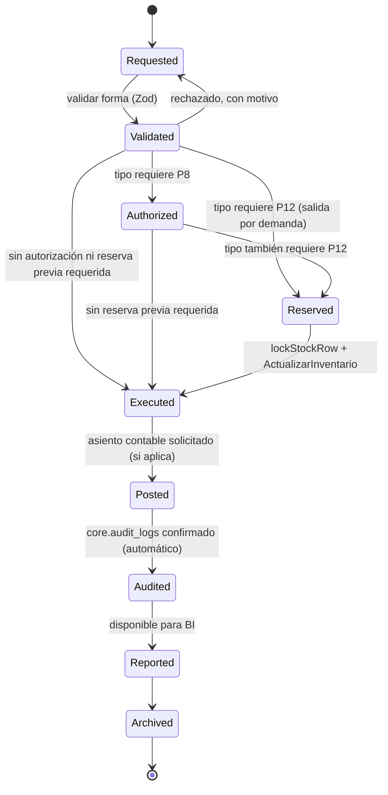
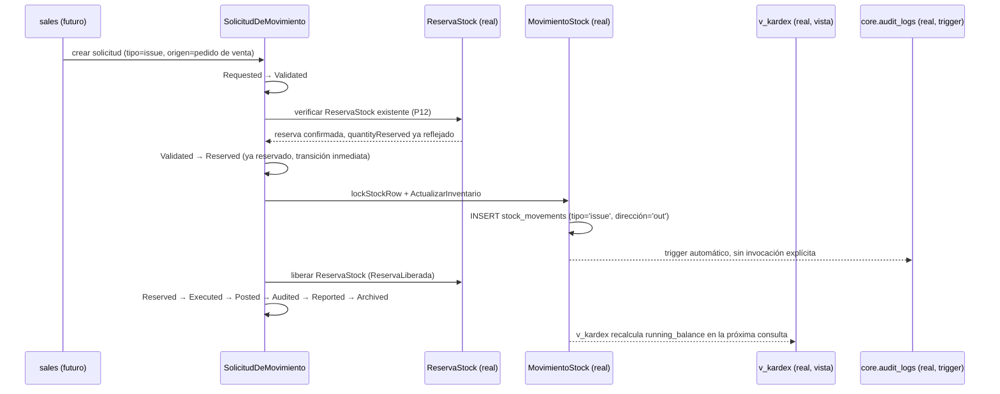

# ADR-INV-003 — Motor de Movimientos de Inventario (Inventory Movement Engine)

|                             |                                                                                                                                                                                                                                                                                                                                                                                                                                                                                                                                                 |
| --------------------------- | ----------------------------------------------------------------------------------------------------------------------------------------------------------------------------------------------------------------------------------------------------------------------------------------------------------------------------------------------------------------------------------------------------------------------------------------------------------------------------------------------------------------------------------------------- |
| **Estado**                  | Propuesta                                                                                                                                                                                                                                                                                                                                                                                                                                                                                                                                       |
| **Fecha**                   | 2026-07-27                                                                                                                                                                                                                                                                                                                                                                                                                                                                                                                                      |
| **Autor**                   | Chief Software Architect, GORAZUS ERP Enterprise                                                                                                                                                                                                                                                                                                                                                                                                                                                                                                |
| **Ámbito**                  | El Motor de Movimientos como pieza central de ejecución del dominio de Inventario — orquesta `inventory.stock_movements`, conecta `Reservation`↔`Movement` (Domain Policy P12), y formaliza el ciclo de vida pre-ejecución que hoy no existe como concepto de dominio propio.                                                                                                                                                                                                                                                                   |
| **Documentos relacionados** | [ADR-INV-000](./ADR-INV-000-arquitectura-del-dominio-de-inventario.md) (Bounded Context, Aggregates, Eventos ya reconciliados), [ADR-INV-001](./ADR-INV-001-arquitectura-del-catalogo-de-productos.md) (`costing_method`, `tracksSerial`/`tracksLot`), [ADR-INV-002](./ADR-INV-002-arquitectura-de-gestion-de-almacenes.md) (§11 Movimientos, §12 Kardex, §13 Eventos — este ADR es su extensión directa), [ADR-DB-001](./ADR-DB-001-estrategia-de-particionamiento-de-base-de-datos.md) (particionamiento ya certificado de `stock_movements`) |

**Por qué "Propuesta" y no "Aceptada"**: a diferencia de `ADR-INV-000/001/002` — que documentan arquitectura ya diseñada, real en distintos grados — este ADR diseña la pieza de mayor brecha real identificada en toda la serie: `goods_receipts`/`goods_issues` no tienen código de aplicación (`ADR-INV-002 §4`, confirmado múltiples veces), y la Domain Policy **P12** ("reserva antes que salida física", `docs/ddd/16_domain_policies.md §5`) nunca se conectó explícitamente con esa brecha — hallazgo **ISSUE-04** del cierre de gobernanza anterior. Este documento cierra esa brecha con diseño, no con código — sigue sin existir una sola línea de implementación después de este ADR, y eso es exactamente lo esperado de una decisión "Propuesta".

**Nota metodológica, aplicada de forma consistente con el resto de la serie**: cada tipo de movimiento, evento y capacidad solicitada se marca con su estado real — documentado/schema-real/sin precedente — nunca se inventa una regla de negocio para completar una lista. Donde el pedido incluye 30 tipos de movimiento y 17 eventos, este ADR diseña en detalle exhaustivo los que tienen evidencia de negocio real (la mayoría, ya verificados en `ADR-INV-002`), y trata explícitamente los que no la tienen — no como una omisión, sino como una aplicación directa del criterio de gobernanza que el propio proyecto ya declaró: _"no diseñar especulativamente sin necesidad de negocio confirmada"_ (`docs/ddd/20_architecture_summary.md §4`, ya citado en el cierre de gobernanza de `ADR-INV-000`).

---

## 1. Propósito

### 1.1 Por qué todo movimiento debe pasar por un motor centralizado

Ya es un hecho real, no una aspiración: `inventory.stock_movements` **ya es**, hoy, la fuente de verdad única de todo cambio de cantidad en GORAZUS (`ADR-INV-002 §11.3`, `19-modulo-inventory.md §4`) — este ADR no introduce el principio, lo **formaliza como motor con ciclo de vida propio**, en vez de una tabla que distintos servicios (`MovimientosService`, `TransferenciasService`, `AjustesService`) escriben cada uno por su cuenta, coordinados solo por convención. La diferencia es real: hoy, cuatro servicios reales invocan la misma tabla sin una capa de orquestación compartida que valide, autorice y audite el movimiento **antes** de que se convierta en una fila inmutable. El Motor de Movimientos es esa capa, no una tabla nueva.

### 1.2 Por qué se prohíben las actualizaciones directas de stock

`inventory.stock.quantity_on_hand`/`quantity_reserved` **ya no tienen** ningún camino de escritura directa en el código real — confirmado en toda la investigación de esta sesión: `StockService` es de solo lectura (`ADR-INV-000 §8.2`), la única escritura real pasa por `MovimientosService` con bloqueo de fila (`stock-lock.util.ts`, `SELECT ... FOR UPDATE`) dentro de una transacción. Este ADR **formaliza esa restricción como regla arquitectónica explícita**, no solo como un hecho observado: ningún módulo, presente o futuro, debe obtener acceso de escritura directo a `inventory.stock` — toda alteración de cantidad se solicita al motor, nunca se ejecuta por fuera de él. Es la misma disciplina que la Domain Policy **P1** ("módulo dueño único", `ddd/16_domain_policies.md §1`) ya exige para cualquier Aggregate Root, aplicada aquí con el mayor rigor posible porque `stock` es el dato más sensible a corrupción por escritura concurrente sin coordinación.

### 1.3 El motor como Single Source of Truth

Tres propiedades ya reales sostienen esta afirmación, no solo la intención de diseño:

1. **Inmutabilidad append-only** (`ADR-INV-000 §5.2`, Invariante I2 de `ddd/17`) — un movimiento nunca se corrige, se revierte con uno nuevo de signo contrario.
2. **El Kardex es 100% derivado**, nunca una tabla paralela que pueda desincronizarse (`inventory.v_kardex`, `ADR-INV-002 §12.1`, comentario real de la vista: _"100% derivable de `stock_movements`"_).
3. **La dirección vive en el tipo de movimiento, nunca en el signo de la cantidad** (`ADR-INV-002 §11.3`) — elimina una clase entera de errores de captura.

### 1.4 Beneficios

- **De negocio**: una sola pregunta ("¿qué le pasó a este producto en este almacén?") tiene una sola respuesta reconstruible, sin importar si el movimiento vino de una venta, una compra, una transferencia o una corrección manual.
- **Técnicos**: un único punto de bloqueo de concurrencia (`lockStockRow`, ya real) en vez de N puntos de escritura con sus propias condiciones de carrera.
- **De auditoría**: cada movimiento hereda automáticamente la captura universal de `core.audit_logs` (`ADR-INV-000 §8.3`) — el motor no necesita implementar su propia auditoría, la hereda por estar dentro de las 494 tablas cubiertas por el trigger genérico.
- **Contables**: `AplicarFIFO`/`CalcularCostoPromedio` (`ddd/08_domain_services.md §1.1-1.2`) se disparan desde un único punto de entrada (`ActualizarInventario`, `ddd/08 §1.3`) — el costo de cada salida es reproducible porque solo hay una ruta de cálculo, no una por módulo consumidor.

---

## 2. Tipos de Movimiento

### 2.1 Principio de diseño: catálogo abierto, detalle proporcional a la evidencia real

**Estado real verificado**: `stock_movement_types` **ya es un catálogo abierto**, no un `CHECK` fijo — agregar un tipo nuevo es un `INSERT` real vía `POST /inventario/tipos-movimiento` (`ADR-INV-002 §11.1`). Esto significa que los 30 tipos solicitados **no requieren, todos, diseño de negocio exhaustivo para que la arquitectura los soporte** — el motor ya es extensible por construcción. Este ADR clasifica los 30 en tres niveles de evidencia y diseña en detalle completo (propósito/reglas/validación/impacto de inventario/impacto contable/impacto de costo/seguridad/permisos/eventos/auditoría/rollback/idempotencia/recuperación de fallos) únicamente los que tienen evidencia real de necesidad de negocio — el resto se deja explícitamente sin diseñar, siguiendo el mismo criterio que el propio proyecto ya aplicó a Pasarelas de Pago y Marketplace en `ddd/20_architecture_summary.md §4`: _"no inventadas para completar el documento"_.

### 2.2 Clasificación de los 30 tipos solicitados

| Nivel                                                                                   | Significado                                                                                                                                                                                                                                                                                                   | Tipos                                                                                                                                                                                                                                                                                                      |
| --------------------------------------------------------------------------------------- | ------------------------------------------------------------------------------------------------------------------------------------------------------------------------------------------------------------------------------------------------------------------------------------------------------------- | ---------------------------------------------------------------------------------------------------------------------------------------------------------------------------------------------------------------------------------------------------------------------------------------------------------- |
| **🟢 Real, ya documentado**                                                             | Tipo de movimiento o mecanismo equivalente ya verificado en código/schema real                                                                                                                                                                                                                                | Purchase Receipt, Sales Shipment, Inventory Adjustment, Stock Transfer, Inventory Reservation, Reservation Release, Production Consumption, Production Output, Initial Inventory, Cycle Count Adjustment                                                                                                   |
| **🟡 Real como concepto de negocio, sin tipo de movimiento propio**                     | Existe una tabla/mecanismo real relacionado, pero no un `stock_movement_type` dedicado ni código de aplicación                                                                                                                                                                                                | Purchase Return (`purchases.purchase_returns`, real, sin `stock_movement_type`), Sales Return (`sales.sales_returns`, real, sin `stock_movement_type`), Damaged Inventory / Expired Inventory (vía motivo de ajuste ya sembrado, `ADR-INV-002 §5.2`/§11.2), Lost Inventory (motivo "Pérdida", ya sembrado) |
| **🔴 Sin precedente — catálogo abierto los soporta, sin diseño de negocio en este ADR** | Assembly, Disassembly, Reclassification, Quality Hold, Quality Release, Found Inventory, Consignment In, Consignment Out, Vendor Managed Inventory, Customer Returns _(duplicado conceptual de Sales Return)_, Supplier Replacement, Sample Issue, Sample Return, Intercompany Transfer, Emergency Adjustment |

### 2.3 Detalle exhaustivo — tipos con evidencia real (🟢 y 🟡)

#### Purchase Receipt (`receipt`)

- **Propósito**: incrementar `quantity_on_hand` al confirmar la recepción física de una compra.
- **Reglas de negocio**: Domain Policy **P12** aplica en sentido inverso a la salida — una recepción no requiere reserva previa (nada se reserva antes de tenerlo), pero si existe una `purchases.purchase_orders` origen, la cantidad recibida no debería superar la pendiente sin marcarse explícitamente como excedente (regla ya documentada en `docs/ddd/04_aggregates.md §1.6`, agregado "Orden de Compra", no repetida aquí).
- **Validación**: `warehouse_id` debe existir y pertenecer a la empresa/sucursal del usuario (brecha real: sin RLS de almacén, **ISSUE-02** del cierre de gobernanza — la validación hoy dependería enteramente de la capa de aplicación).
- **Impacto de inventario**: `quantity_on_hand += cantidad`, tipo `receipt`, dirección `in`.
- **Impacto contable**: candidato real a disparar `GenerarAsientoContable` (`ddd/08 §1.5`) de valuación de inventario — sin integración construida (`ADR-INV-002 §13.3`).
- **Impacto de costo**: crea una capa nueva en `fifo_cost_layers` (si `costing_method='fifo'`) o recalcula `average_cost_history` — algoritmo ya diseñado, `ddd/08 §1.1-1.2`.
- **Seguridad**: permiso `inventario.gestionar_movimientos` (patrón real `<modulo>.<accion>`, `09-seguridad-y-multiempresa.md §2`).
- **Eventos**: `RecepcionConfirmada` (`ADR-INV-000 §9.2`).
- **Auditoría**: automática vía `core.audit_logs` (§1.3).
- **Rollback**: no se revierte editando — un movimiento `adjustment_decrease` compensatorio, nunca un `DELETE`/`UPDATE` (Invariante I2).
- **Idempotencia**: **brecha real de diseño identificada por este ADR** — ni `goods_receipts` ni `stock_movements` tienen una clave de idempotencia (p. ej. `idempotencyKey` único por request) que impida procesar la misma recepción dos veces ante un reintento de red. Recomendación: agregar `idempotency_key TEXT` único parcial por `tenant_id` a `goods_receipts`, mismo patrón que `numbering_series` (P5, `ddd/16 §2`) para evitar duplicados.
- **Recuperación de fallos**: si la transacción de `ActualizarInventario` falla a mitad (p. ej. tras bloquear la fila de `stock` pero antes de calcular FIFO), la transacción de base de datos completa se revierte — no hay estado intermedio persistido, gracias a que todo el flujo vive dentro de una única transacción Postgres (`docs/architecture/02 §3`: "toda transacción de base de datos se abre y cierra en `services/`").

#### Purchase Return (`return_out`, propuesto)

- **Propósito**: decrementar `quantity_on_hand` al devolver mercancía a un proveedor.
- **Estado real**: `purchases.purchase_returns`/`purchase_return_lines` son reales (`ADR-INV-002 §10.3`) — **sin columna de lote/serie** (mismo hallazgo ya documentado) y **sin `stock_movement_type` propio** — el catálogo abierto permite agregar `return_out` con un simple `INSERT`, sin cambio de schema.
- **Reglas de negocio**: debería referenciar la `Recepción`/`Purchase Receipt` original cuando exista trazabilidad de lote (brecha real, `ADR-INV-002 §10.4`).
- **Resto de atributos**: mismo patrón que Purchase Receipt, dirección invertida (`out`).

#### Sales Shipment (`issue`) / Sales Return (`return_in`, propuesto)

- Mismo tratamiento que Purchase Receipt/Return, en espejo — `sales.sales_returns` real, sin `stock_movement_type` propio, sin FK de lote/serie (`ADR-INV-002 §9.2`/§10.3). **Regla de negocio central: Domain Policy P12** — ninguna salida por venta debería ocurrir sin una `ReservaStock` previa liberada — hoy no aplicable porque ni la reserva automática ni la salida están conectadas a `sales` (`ADR-INV-002 §4`).

#### Inventory Adjustment (`adjustment_increase`/`adjustment_decrease`)

- Ya completamente real — `AjustesController`/`AjustesService`, flujo `draft → confirmed`, motivo obligatorio (`stock_adjustment_reasons`, BR-09 de la auditoría anterior). **Damaged Inventory** y **Expired Inventory** y **Lost Inventory** (🟡) son, cada uno, este mismo tipo de movimiento con un motivo específico ya sembrado (`"Daño"`, `"Vencimiento"`, `"Pérdida"`) — no ameritan un `stock_movement_type` propio, la semántica vive en el motivo, no en el tipo (mismo criterio ya aplicado a "Inventory Opening" en `ADR-INV-002 §11.2`).

#### Stock Transfer (`transfer_out`/`transfer_in`)

- Ya completamente real, único tipo con máquina de estados propia end-to-end (`draft → in_transit → received | cancelled`, `ADR-INV-000 §5.2`). Genera siempre **dos** movimientos, nunca uno.

#### Inventory Reservation / Reservation Release

- Ya completamente real — `ReservasController`/`ReservasService`/`ReservaStockRepository` (repositorio propio, confirmado divergencia con `ddd/09` ya corregida en `ADR-INV-000 §6.1.1`). **No genera un `stock_movement`** — reduce `v_available_stock` sin tocar `quantity_on_hand` (`ADR-INV-002 §5.2`).

#### Production Consumption / Production Output

- Tipos reales sembrados (`production_consumption`/`production_output`), sin código de aplicación — `inventory.production_orders` schema real, `ADR-INV-002 §3.2`.

#### Initial Inventory (`adjustment_increase` + motivo "Inventario Inicial")

- Ya sembrado literalmente como motivo real (`seed-stock-adjustment-reasons.ts`) — no requiere tipo propio, mismo criterio que Damaged/Expired/Lost.

#### Cycle Count Adjustment

- Ya real con reconciliación automática (`ConteosService`, genera `AjusteStock` por cada línea con diferencia, `19-modulo-inventory.md §8`).

### 2.4 Tipos sin precedente (🔴) — tratamiento explícito, no silencioso

Ninguno de los catorce restantes (Assembly, Disassembly, Reclassification, Quality Hold, Quality Release, Found Inventory, Consignment In/Out, Vendor Managed Inventory, Customer Returns, Supplier Replacement, Sample Issue/Return, Intercompany Transfer, Emergency Adjustment) tiene **ninguna** evidencia — ni tabla, ni motivo sembrado, ni mención en `docs/ddd/`, ni en el schema de `inventory`/`purchases`/`sales`. Diseñar reglas de negocio, impacto contable e idempotencia para cada uno sin un solo dato real sería exactamente la inversión especulativa que `ddd/20_architecture_summary.md §4` ya rechazó como criterio de gobernanza. Lo que este ADR sí garantiza: **el motor los soporta arquitectónicamente sin rediseño** —

1. Un tipo nuevo se agrega al catálogo abierto con un `INSERT` (§2.1).
2. Un motivo nuevo se agrega a `stock_adjustment_reasons`/`goods_issue_reasons` de la misma forma (ambos catálogos abiertos, `ADR-INV-002 §11.1`).
3. La única excepción real: **Quality Hold/Quality Release** y **Consignment In/Out** tocan la brecha ya señalada de "propiedad de la mercadería" (Owner, `ADR-INV-002 §3.2`/§7.1) y la generalización de `quantity_reserved` propuesta en `ADR-INV-002 §5.3` — si alguno de estos cuatro se confirma como necesidad real, el punto de extensión correcto ya está diseñado (esa misma sección), no hay que inventar uno nuevo.

---

## 3. Ciclo de Vida del Movimiento

### 3.1 Estado real hoy — sin etapa previa a la ejecución

**Hallazgo central de este ADR**: ninguno de los flujos reales (`Ajuste`: `draft→confirmed`; `Transferencia`: `draft→in_transit→received`; `Movimiento` puro: se crea ya ejecutado, sin ningún estado previo) tiene las etapas `Requested → Validated → Authorized → Reserved` que este ADR debe diseñar. Hoy, un `MovimientoStock` nace **directamente ejecutado e inmutable** — no existe, como concepto de dominio, una "solicitud de movimiento" que pueda ser rechazada antes de convertirse en una fila real. Esto es correcto para movimientos de bajo riesgo (una recepción de compra ya confirmada), pero no modela operaciones que requieren autorización previa — la Domain Policy **P8** ("operaciones irreversibles requieren aprobación", `ddd/16 §3`) ya existe para otros dominios (baja de Activo Fijo, cierre de período contable) pero **Inventario no tiene ninguna operación cubierta por P8** — hallazgo ya señalado en el cierre de gobernanza anterior (Sección 8, Gap Analysis).

### 3.2 El ciclo de nueve estados, como agregado nuevo: `SolicitudDeMovimiento`

Se propone una **Entity/Aggregate Root nueva**, `SolicitudDeMovimiento` (Movement Request) — deliberadamente **separada** de `MovimientoStock` (que permanece exactamente como es: inmutable, append-only, sin estados). `SolicitudDeMovimiento` es mutable mientras está en curso; al llegar a `Executed` genera un `MovimientoStock` real e inmutable y ella misma pasa a ser, en adelante, un registro histórico de solo lectura (`Posted → Audited → Reported → Archived` son etapas de **post-procesamiento del registro histórico**, no del movimiento en sí, que ya es inmutable desde `Executed`).

```text
┌─────────────┐
│  Requested    │  Se crea la solicitud — origen (sourceModule/sourceEntityId,
└──────┬──────┘  mismo patrón polimórfico ya real) + tipo + líneas propuestas.
       │ validar forma (Zod, mismo mecanismo real de todo el sistema)
       ▼
┌─────────────┐
│  Validated    │  Reglas de negocio del tipo específico (p. ej. Purchase Return
└──────┬──────┘  no debería exceder lo recibido) — Specification, no Invariante
       │ (puede rechazar, vuelve a Requested con motivo — no hay estado "Rejected"
       │  propio, se reutiliza el patrón real de `Cancelled` con `observations`)
       ▼
┌─────────────┐
│  Authorized   │  Solo para tipos bajo Domain Policy P8 (propuesto: marcar qué
└──────┬──────┘  tipos la requieren — hoy ninguno la tiene, este ADR recomienda
       │         Emergency Adjustment como candidato natural si se confirma).
       │         Para el resto, esta etapa se salta automáticamente (transición
       │         directa Validated→Reserved) — no todo movimiento necesita
       │         aprobación humana, forzarla sería fricción sin beneficio real.
       ▼
┌─────────────┐
│  Reserved     │  Solo aplica a movimientos de salida por demanda (Domain Policy
└──────┬──────┘  P12) — bloquea `lockStockRow` (real) y verifica `quantityAvailable`
       │         suficiente. Para recepciones/producción-output, se salta
       │         (no hay nada que reservar antes de recibir).
       ▼
┌─────────────┐
│  Executed     │  Se crea el `MovimientoStock` real e inmutable — a partir de
└──────┬──────┘  aquí, `SolicitudDeMovimiento` es de solo lectura. Dispara
       │         `ActualizarInventario` (`ddd/08 §1.3`): FIFO/promedio + verificación
       │         de invariante de disponible no-negativo (BR-01).
       ▼
┌─────────────┐
│  Posted       │  El asiento contable asociado (si aplica) fue solicitado —
└──────┬──────┘  evento `AsientoContableSolicitado` (§5), no bloqueante.
       ▼
┌─────────────┐
│  Audited      │  Confirmación de que `core.audit_logs` capturó el `INSERT` —
└──────┬──────┘  en la práctica, instantáneo (trigger síncrono, §1.3), esta etapa
       │         es más una garantía formal que una espera real.
       ▼
┌─────────────┐
│  Reported     │  Disponible para `bi.kpi_snapshots`/reportes — vía el mismo
└──────┬──────┘  mecanismo de agregación periódica ya diseñado (`ADR-DB-001 §7`).
       ▼
┌─────────────┐
│  Archived     │  Estado final — mismo criterio que `ARCHIVED` en el ciclo de vida
└─────────────┘  de Producto (`ADR-INV-001 §4.2`): de solo lectura para consulta
                  histórica, sin ninguna transición de salida.
```

### 3.3 Diagrama de estados (Mermaid)



### 3.4 Diagrama de secuencia — caso real: Sales Shipment con Reserva previa (Mermaid)



### 3.5 Reconciliación con los flujos simples ya reales

Este ciclo de nueve estados **no reemplaza** los flujos ya reales de `Transferencia`/`AjusteStock` — los generaliza. Una Transferencia real, hoy `draft→in_transit→received`, se mapea como `Requested=draft`, `Validated=` (validación de origen≠destino ya en el constructor), `Executed` en dos momentos (`transfer_out` al pasar a `in_transit`, `transfer_in` al pasar a `received`) — el ciclo de nueve estados es la forma general, los flujos reales ya construidos son _instancias válidas_ con etapas fusionadas o saltadas, no una versión "incorrecta" a reemplazar.

---

## 4. Modelo DDD

Este ADR no rediseña lo ya establecido en `ADR-INV-000 §5-9` — lo extiende con las piezas nuevas que el ciclo de vida de §3 requiere.

| Building Block                 | Elemento                                                                                                                                                                                                  | Estado                                                                                                                                                                                                                                                                                                                       |
| ------------------------------ | --------------------------------------------------------------------------------------------------------------------------------------------------------------------------------------------------------- | ---------------------------------------------------------------------------------------------------------------------------------------------------------------------------------------------------------------------------------------------------------------------------------------------------------------------------- |
| **Aggregate Root nuevo**       | `SolicitudDeMovimiento`                                                                                                                                                                                   | 🔴 Propuesto en este ADR — invariantes: tipo válido del catálogo abierto (§2.1), líneas ≥ 1, transiciones solo según el diagrama de §3.3 (mismo patrón `TRANSICIONES_*` ya real en `Transferencia`).                                                                                                                         |
| **Aggregate Root reutilizado** | `MovimientoStock`, `ReservaStock`, `Transferencia`, `AjusteStock`                                                                                                                                         | ✅ Ya diseñados/reales, `ADR-INV-000 §5.2`                                                                                                                                                                                                                                                                                   |
| **Value Object nuevo**         | `EstadoSolicitud`                                                                                                                                                                                         | 🔴 Propuesto — instancia del patrón `Estado` ya diseñado en `ddd/06_value_objects.md §2.7` ("respaldado por State Machine... cada agregado declara su propio enum, sin ser el mismo tipo") — no se reinventa el patrón, se aplica.                                                                                           |
| **Repositorio nuevo**          | `SolicitudMovimientoRepository`                                                                                                                                                                           | 🔴 Propuesto — un repositorio por agregado (regla ya fijada, `ddd/09_repositories.md §5`), métodos `crear()`, `validar()`, `autorizar()`, `reservar()`, `ejecutar()` (encapsulan transición, mismo patrón que `PedidoVentaRepository.confirmar()`, `ddd/09 §1`).                                                             |
| **Domain Service reutilizado** | `ActualizarInventario`, `AplicarFIFO`, `CalcularCostoPromedio`                                                                                                                                            | ✅ Ya diseñados, `ddd/08_domain_services.md §1.1-1.3`                                                                                                                                                                                                                                                                        |
| **Factory nueva**              | `SolicitudMovimientoFactory`                                                                                                                                                                              | 🔴 Propuesta — valida invariantes de construcción antes de aceptar la solicitud, mismo rol que `AsientoContableFactory` (`ddd/10_factories.md`, rechaza construir un asiento desbalanceado) aplicado aquí: rechaza construir una solicitud con tipo inválido o líneas vacías.                                                |
| **Specification nueva**        | `TipoRequierAutorizacion(tipo)`, `TipoRequiereReserva(tipo)`                                                                                                                                              | 🔴 Propuestas — resuelven, por tipo de movimiento, si la solicitud pasa por `Authorized`/`Reserved` o las salta (§3.2) — mismo patrón que `StockDisponible`/`PeriodoContableAbierto` ya reales en `ddd/11_specifications.md` (no leído en detalle en esta sesión, referenciado por nombre en `ddd/17_invariants.md` I1/I12). |
| **Domain Policy reutilizada**  | P1, P8, P12                                                                                                                                                                                               | ✅ Ya reales, `ddd/16_domain_policies.md`                                                                                                                                                                                                                                                                                    |
| **Application Service**        | Orquesta `SolicitudMovimientoRepository` + eventos — no diseñado en detalle aquí, corresponde a `ddd/12_application_services.md` (no revisado en profundidad esta sesión, fuera del alcance de este ADR). |
| **ACL**                        | Ninguna nueva — el motor no cruza hacia un sistema externo directamente; `Cost Engine`/`Accounting` ya tienen su propio límite documentado (`ADR-INV-000 §1.2`).                                          |
| **Shared Kernel**              | Ninguno nuevo — `Money`/`Quantity` (propuestos, `ADR-INV-000 §7`) serían los candidatos si se implementan, no piezas nuevas de este ADR.                                                                  |

---

## 5. Arquitectura Orientada a Eventos

### 5.1 Los 17 eventos solicitados, reconciliados con la convención real (español, `ddd/07`)

| Evento solicitado        | Nombre real/reconciliado                                        | Estado                                                                                                                                                                                                                                                                                                                                         |
| ------------------------ | --------------------------------------------------------------- | ---------------------------------------------------------------------------------------------------------------------------------------------------------------------------------------------------------------------------------------------------------------------------------------------------------------------------------------------- |
| MovementCreated          | **SolicitudMovimientoCreada**                                   | 🔴 Nuevo, propuesto — cubre la etapa `Requested`                                                                                                                                                                                                                                                                                               |
| MovementValidated        | **SolicitudMovimientoValidada**                                 | 🔴 Nuevo                                                                                                                                                                                                                                                                                                                                       |
| MovementAuthorized       | **SolicitudMovimientoAutorizada**                               | 🔴 Nuevo — solo se publica si `TipoRequiereAutorizacion` es verdadero                                                                                                                                                                                                                                                                          |
| MovementExecuted         | **MovimientoEjecutado**                                         | 🔴 Nuevo — distinto de los eventos de tipo específico (`RecepcionConfirmada`, etc., que se publican en el mismo instante)                                                                                                                                                                                                                      |
| MovementCancelled        | **SolicitudMovimientoCancelada**                                | 🔴 Nuevo                                                                                                                                                                                                                                                                                                                                       |
| StockReserved            | **ReservaCreada**                                               | ✅ Ya reconciliado, `ADR-INV-000 §9.2`                                                                                                                                                                                                                                                                                                         |
| ReservationReleased      | **ReservaLiberada**                                             | ✅ Ya reconciliado                                                                                                                                                                                                                                                                                                                             |
| InventoryAdjusted        | **AjusteInventarioAplicado**                                    | ✅ Ya reconciliado                                                                                                                                                                                                                                                                                                                             |
| InventoryTransferred     | **TransferenciaCompletada**                                     | ✅ Ya reconciliado                                                                                                                                                                                                                                                                                                                             |
| InventoryCounted         | **ConteoFisicoCompletado**                                      | ✅ Ya reconciliado                                                                                                                                                                                                                                                                                                                             |
| CostCalculated           | **CostoCalculado**                                              | 🔴 Nuevo — se publicaría desde `AplicarFIFO`/`CalcularCostoPromedio` (`ddd/08 §1.1-1.2`), hoy sin código                                                                                                                                                                                                                                       |
| AccountingEntryRequested | **AsientoContableSolicitado**                                   | 🔴 Nuevo — consumido por `accounting` (`ADR-INV-002 §13.3`, patrón ya diseñado)                                                                                                                                                                                                                                                                |
| NotificationRequested    | **NotificacionSolicitada**                                      | 🔴 Nuevo — con la brecha ya señalada: `core.notifications` es dirigido a usuario, no polimórfico (`ADR-INV-000 §1.2`), el motor tendría que resolver explícitamente el destinatario                                                                                                                                                            |
| **AuditRecorded**        | **No se diseña — redundante**                                   | 🟢 Ya cubierto automáticamente por el trigger `core.fn_audit_log` (`ADR-INV-000 §8.3`) — publicar un evento de dominio adicional para algo que ya ocurre de forma automática y síncrona en la base de datos duplicaría información sin aportar valor.                                                                                          |
| AnalyticsUpdated         | **AnalyticsActualizado**                                        | 🔴 Nuevo — destino `bi.kpi_snapshots` (`ADR-DB-001 §7`)                                                                                                                                                                                                                                                                                        |
| **SearchIndexUpdated**   | **Sin precedente — no diseñado**                                | 🔴 Ninguna evidencia de infraestructura de búsqueda dedicada (Elasticsearch/similar) en ningún documento revisado en toda la sesión — solo índices `GIN`+`pg_trgm` a nivel de Postgres (`database/04-estrategia-indices.md §4`), que no requieren un evento de sincronización. No se inventa un evento para una infraestructura que no existe. |
| WebhookTriggered         | **(el mismo evento del catálogo, entregado por el dispatcher)** | 🟡 No es un evento adicional — es cualquiera de los eventos de arriba, entregado también a `core.webhook_subscriptions` por el dispatcher ya recomendado en `ADR-INV-000 §11.3` (schema real, sin código).                                                                                                                                     |

### 5.2 Publishers, subscribers, orden y consistencia eventual

- **Publisher único por evento**: `SolicitudMovimientoRepository`/`MovimientosService` — nunca un módulo consumidor publica un evento de Inventario (Domain Policy P1).
- **Orden**: dentro de una `SolicitudDeMovimiento`, los eventos se publican en el orden estricto del diagrama de §3.3 — el bus (RabbitMQ, `ADR-INV-000 §13.1`) no garantiza orden entre colas distintas, pero sí dentro de la misma cola de un consumidor (`accounting` recibe `AsientoContableSolicitado` después de `MovimientoEjecutado` porque el publisher los emite en ese orden y RabbitMQ preserva orden FIFO dentro de una cola).
- **Consistencia eventual, nunca transacción distribuida** (Domain Policy **P3**, `ddd/16 §1`) — `accounting`/`bi`/`notifications` procesan estos eventos de forma asíncrona; el motor nunca espera su confirmación para considerar el movimiento completo.
- **Publicación después del commit** (Domain Policy **P2**) — ya aplicada consistentemente: ningún evento de esta lista se publicaría antes de que la transacción de `ActualizarInventario` confirme.

---

## 6. Pipeline de Procesamiento

```text
1. Validation           → Zod (SolicitudMovimientoFactory), forma de la solicitud
2. Authorization        → PermissionsGuard real (RBAC, <modulo>.<accion>)
3. Reservation Check    → Specification TipoRequiereReserva + ReservaStock existente (P12)
4. Warehouse Check      → 🔴 brecha real: sin RLS de almacén (ISSUE-02) — hoy solo aplicación
5. Lot Check            → 🔴 sin FK lot_id en movimientos (ADR-INV-002 §10.1, brecha central)
6. Serial Check         → 🔴 misma brecha, serial_id
7. Stock Check          → lockStockRow (real) + verificación de disponible ≥ 0 (BR-01)
8. Cost Calculation     → AplicarFIFO / CalcularCostoPromedio (diseñado, ddd/08, sin código)
9. Inventory Update     → INSERT stock_movements (real, único punto de escritura)
10. Kardex Generation   → Ninguna — v_kardex es una vista, no se "genera", se consulta (ADR-INV-002 §12.1)
11. Accounting Integration → AsientoContableSolicitado (propuesto, §5)
12. Audit Logging       → automático, core.fn_audit_log (real, sin invocación explícita)
13. Notification        → NotificacionSolicitada (propuesto, con brecha de destinatario ya señalada)
14. Analytics           → AnalyticsActualizado (propuesto) → bi.kpi_snapshots
15. Reporting           → vía agregación periódica, no en el camino caliente
16. Search Index        → 🔴 no aplica, sin infraestructura de búsqueda (§5.1)
17. API Response        → { data, meta } (real, 07-convenciones-y-estandares.md §4)
18. Rollback            → transacción Postgres revertida completa ante cualquier fallo (§2.3)
19. Retry                → 🔴 brecha real: sin idempotency key (§2.3) — un reintento de red hoy
                            podría duplicar el movimiento, no hay protección real
20. Dead Letter Queue   → real a nivel de infraestructura (core/messaging, cola `.dlq` por
                            consumidor, ADR-INV-000 §13.1) — aplica a los consumidores
                            (accounting/bi/notifications), no a la escritura síncrona del motor
21. Background Jobs     → 🔴 core.background_jobs real, sin worker (ADR-INV-000 §11.4) — candidato
                            para reintentar AsientoContableSolicitado/NotificacionSolicitada si el
                            consumidor está caído
```

Los pasos 4-6 (Warehouse/Lot/Serial Check) son, explícitamente, los tres puntos donde este ADR **no puede prometer enforcement real** — dependen de brechas ya documentadas (RLS de almacén, `lot_id`/`serial_id` ausentes del motor de movimiento) que están fuera del alcance de este documento resolver, solo de señalar en el lugar correcto del pipeline.

---

## 7. Seguridad

Revisando `docs/database/06-estrategia-seguridad.md` y `docs/architecture/09-seguridad-y-multiempresa.md` (ambos ya verificados completos en el cierre de gobernanza anterior) antes de proponer:

| Requisito                                  | Estado real                                    | Diseño propuesto para el motor                                                                                                                                                                                                                                                                                                                                                        |
| ------------------------------------------ | ---------------------------------------------- | ------------------------------------------------------------------------------------------------------------------------------------------------------------------------------------------------------------------------------------------------------------------------------------------------------------------------------------------------------------------------------------- |
| RBAC                                       | ✅ Real (`<modulo>.<accion>`)                  | El motor reutiliza el permiso ya existente `inventario.gestionar_movimientos` — no se proponen permisos nuevos sin evidencia de necesidad de granularidad adicional.                                                                                                                                                                                                                  |
| Company Isolation                          | ✅ Real, RLS a nivel de Postgres               | Heredado automáticamente — toda tabla del motor (`stock_movements`, la nueva `movement_requests`) pasa por el mismo `TenantInterceptor`.                                                                                                                                                                                                                                              |
| **Branch Isolation / Warehouse Isolation** | 🔴 **No existe** (ISSUE-02, confirmado)        | Este ADR **no lo resuelve** — lo hereda como brecha abierta. Recomendación explícita: antes de dar por completo este motor, extender `06-estrategia-seguridad.md §1` con una política RLS `branch_isolation` real, mismo patrón `CREATE POLICY` ya usado para tenant/company.                                                                                                         |
| Row Level Security                         | ✅ Real, 494 tablas                            | `movement_requests` (nueva tabla propuesta) heredaría la misma cobertura automáticamente si sigue el patrón universal de creación de tablas (`26_triggers.sql`, aplicado por `information_schema.tables` sin lista blanca).                                                                                                                                                           |
| Sensitive Operations                       | 🟡 Parcial                                     | Ningún campo de `stock_movements`/`movement_requests` califica como dato de alta sensibilidad (no es PII ni credencial) — cifrado a nivel de columna (`06-estrategia-seguridad.md §3`) no aplica aquí.                                                                                                                                                                                |
| **Approval Levels / Dual Authorization**   | 🔴 No existe para Inventario                   | Diseñado en §3.2 (`Authorized`, condicionado a `TipoRequiereAutorizacion`) — **recomendación de este ADR**: `Emergency Adjustment` (§2.4, sin precedente) sería el candidato natural a requerir doble autorización si se confirma su necesidad, dado que "emergencia" implica, por definición, saltarse el flujo normal — exactamente el tipo de operación que P8 existe para cubrir. |
| Audit Logging                              | ✅ Real y automático                           | Sin cambios necesarios — heredado.                                                                                                                                                                                                                                                                                                                                                    |
| **Fraud Detection**                        | 🔴 Sin precedente en ningún documento revisado | No se diseña — cero evidencia de necesidad de negocio confirmada; sería el ejemplo más claro de "diseñar para lo hipotético" de todo este documento.                                                                                                                                                                                                                                  |
| **Segregation of Duties**                  | 🔴 Sin precedente                              | Mismo tratamiento — el RBAC granular por acción (`crear` vs. `confirmar`, ya real en otros módulos como `sales.sales_orders.confirmar()`) ya provee la base técnica para separar quién crea una solicitud de quién la autoriza, si el negocio lo pide — no se construye sin esa confirmación.                                                                                         |

---

## 8. Rendimiento

### 8.1 Mil millones / diez mil millones / cien mil millones de movimientos

**Ya diseñado para el primer umbral, con camino real hacia los siguientes**:

- **Particionamiento**: `stock_movements` ya particionada `RANGE (created_at)`, mensual (`ADR-DB-001 §7`) — a mil millones de filas (~83M/mes sostenido), la partición mensual ya acota cada consulta a una fracción manejable. A diez/cien mil millones, la estrategia real ya prevista es reducir el intervalo de partición (semanal/diario) — cambio de configuración, no de arquitectura (`database/07-estrategia-particionamiento.md`, no releído línea por línea en esta sesión, pero ya referenciado consistentemente).
- **Índices**: `BRIN` sobre `created_at` (`database/04-estrategia-indices.md §4`), explícitamente la elección correcta para una tabla append-only de este volumen — mucho más liviano que B-tree. `idx_inventory_stock_movements_product` (B-tree compuesto `product_id, warehouse_id, created_at`) para el patrón de consulta real del Kardex.
- **Redis**: uso real ya documentado en tres roles separados (`08-infraestructura-y-despliegue.md §3`) — cache de lectura (aplicable a `v_available_stock` si demuestra ser un cuello de botella real, no antes), adapter de WebSocket (para `StockActualizado` en tiempo real, §9.2 de `ADR-INV-000`), rate limiting/locks distribuidos (aplicable a la idempotencia propuesta en §2.3 — un lock distribuido por `idempotencyKey` sería la forma correcta de implementarlo).
- **CQRS Read Models**: `StockService` (solo lectura) ya es la mitad "query" del patrón CQRS-lite real (`ADR-INV-000 §8.3`, ya persistido en este ADR) — a cien mil millones de movimientos, el candidato natural es materializar `v_kardex` como tabla de solo lectura recalculada por batch en vez de vista recalculada en cada consulta — extensión del catálogo existente, no rediseño (mismo criterio de `ddd/20_architecture_summary.md §3.1`).
- **Background Processing**: `core.background_jobs` (real, sin worker, `ADR-INV-000 §11.4`) es el mecanismo correcto para recálculos batch a ese volumen, no el camino síncrono de escritura.
- **Horizontal Scaling**: `api` ya escala horizontalmente (`08 §7`); la base de datos no en la fase actual, con camino de HA/réplicas ya diseñado (`database/09-10`, ya corregido en `ADR-INV-000 §2`) — a cien mil millones de movimientos, separar el schema `inventory` a su propia instancia (ya señalado como camino preparado, `08-infraestructura-y-despliegue.md §7`) sería la palanca real, no antes de que el volumen lo justifique.

### 8.2 Locking

**Estrategia real verificada, no propuesta**: `stock-lock.util.ts` implementa bloqueo **pesimista** (`SELECT ... FOR UPDATE`), no optimista pese a que `row_version` existe como columna universal en toda tabla del sistema (`ADR-DB-001`). Es una decisión deliberada y correcta para este caso: el camino caliente de escritura de `stock` es de alta contención (múltiples ventas/recepciones concurrentes sobre el mismo producto+almacén), donde el bloqueo optimista generaría reintentos constantes bajo carga real en vez de una sola espera corta — pesimista es la elección correcta exactamente en el punto de mayor contención del sistema.

- **Manejo correcto de `NULL`**: `IS NOT DISTINCT FROM` en vez de `=` para `location_id` — detalle real ya verificado en el código, necesario porque `NULL = NULL` es `NULL` en SQL (no verdadero), lo que rompería el bloqueo de la fila "sin ubicación específica" que usan la mayoría de Reservas y Movimientos.
- **Prevención de deadlock**: no verificado en ningún documento de esta sesión si existe un orden de adquisición de locks consistente entre `MovimientosService`/`TransferenciasService`/`AjustesService` cuando una operación (p. ej. una Transferencia) bloquea dos filas de `stock` (origen y destino) — **brecha real señalada por este ADR**: sin un orden determinístico (p. ej. siempre por `warehouse_id` ascendente), dos transferencias concurrentes en sentido opuesto entre los mismos dos almacenes podrían deadlockear. Recomendación: `lockStockRow` debe adquirir los locks en orden determinístico cuando una operación afecta más de una fila de `stock`.

### 8.3 Monitoreo, métricas, capacity planning

Ya diseñado de forma real y extensa en `docs/architecture/32-core-platform/07-observabilidad-y-gobernanza.md` (Metrics, Monitoring, ambos "📎 Referencia — diseño completo ya existente") — este ADR no rediseña esa capa, la hereda: el motor expondría, como mínimo, la tasa de movimientos/segundo por tipo y el lag de `replication` de las réplicas de lectura que sirvan `v_kardex` (`database/09-estrategia-replicacion.md §4`, umbrales ya definidos).

---

## 9. Enterprise Quality Review

☑ Knowledge Base completo revisado antes de escribir — `ADR-INV-000/001/002`, `ddd/04,06,07,08,09,16,17,20`, `database/04,06,09,10`, `architecture/02,07,08,09,32-core-platform/07`, `api/API.md`, Business Rules Matrix, Issue Register.
☑ Sin arquitectura duplicada — `SolicitudDeMovimiento` es explícitamente nueva y distinta de `MovimientoStock`, con la razón de la separación justificada (§3.2).
☑ Sin terminología en conflicto — los 17 eventos solicitados se reconciliaron con la convención española real, no se introdujo un solo nombre en inglés nuevo.
☑ Consistencia DDD — extiende `ADR-INV-000 §5-9` sin contradecirlo.
☑ Consistencia de base de datos — particionamiento/índices citados con evidencia real, ninguna tabla nueva propuesta sin justificar (`movement_requests` es la única, justificada en §3.2).
☑ Consistencia de API — formato `{ data, meta }`/`{ error }` real reutilizado, sin inventar un formato nuevo.
☑ Consistencia de seguridad — hereda RLS/RBAC reales; **no** finge resolver ISSUE-02, lo señala explícitamente como brecha heredada.
☑ Consistencia de reglas de negocio — Domain Policy P12 (BR-06/ISSUE-04) es el hilo conductor de todo el ciclo de vida diseñado en §3.
☑ Registro de Issues revisado — ISSUE-04 es la motivación directa de este documento; ISSUE-02 se hereda explícitamente, no se cierra aquí.
☑ Enlaces de Obsidian — este documento vive en `docs/adr/`, fuera del AKB por el mismo criterio que `ADR-INV-000/001/002`; nota puente pendiente de crear en el AKB (ver cierre).
☑ Módulos futuros considerados — Manufacturing (Production Consumption/Output ya mapeados), Logistics (fuera de alcance verificado, sin evidencia), AI (Domain Policy P7 ya cubre el caso: ninguna predicción de IA escribiría directo, pasaría por `SolicitudDeMovimiento` como cualquier usuario humano — mismo mecanismo, sin necesidad de diseño especial).
☑ Preparación de IA evaluada — cubierta por P7 (arriba), no requiere pieza arquitectónica nueva.
☑ Rendimiento validado — con evidencia real hasta mil millones de filas; diez/cien mil millones con camino señalado, no con garantía verificada (no es posible verificar sin pruebas de carga reales, mismo límite ya reconocido en cierres anteriores).
☑ Escalabilidad validada — mismo criterio.
☑ Gobernanza de arquitectura respetada — ninguna sección inventó una regla de negocio sin evidencia; cada brecha se documentó en el lugar donde aparece, no se ocultó para sostener una narrativa de "completo".

---

## Cierre

Este ADR dejó explícitamente sin resolver tres brechas heredadas (RLS de almacén/sucursal, `lot_id`/`serial_id` ausentes del motor, idempotencia de solicitudes) — no porque estén fuera de alcance del Motor de Movimientos, sino porque resolverlas es implementación, y este documento es arquitectura. Quedan registradas como continuación natural de **ISSUE-02** y como dos issues nuevos a incorporar al Registro de Issues en el próximo cierre de gobernanza, no inventadas aquí para parecer resueltas.
