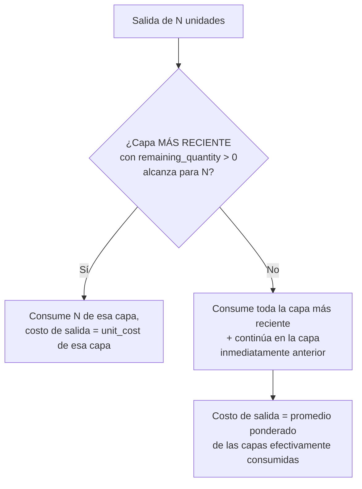
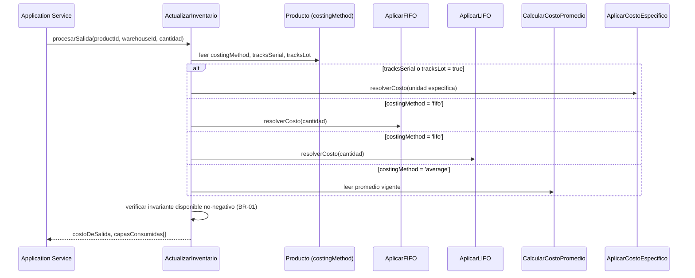
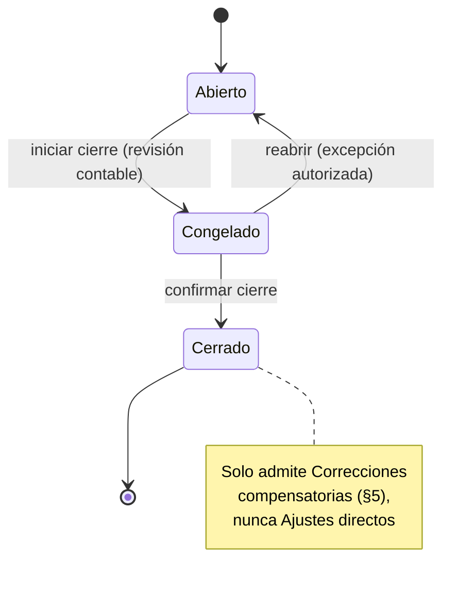
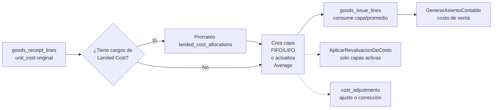

# ADR-INV-004 — Motor de Costeo de Inventario (Inventory Cost Engine)

|                                 |                                                                                                                                                                                                                                                                                                                      |
| ------------------------------- | -------------------------------------------------------------------------------------------------------------------------------------------------------------------------------------------------------------------------------------------------------------------------------------------------------------------- |
| **Identificador**               | `ADR-INV-004`                                                                                                                                                                                                                                                                                                        |
| **Versión**                     | 1.0.0                                                                                                                                                                                                                                                                                                                |
| **Estado**                      | Propuesta                                                                                                                                                                                                                                                                                                            |
| **Fecha**                       | 2026-07-28                                                                                                                                                                                                                                                                                                           |
| **Última revisión**             | 2026-07-28                                                                                                                                                                                                                                                                                                           |
| **Autor**                       | Principal Software Architect, GORAZUS ERP Enterprise                                                                                                                                                                                                                                                                 |
| **Ámbito**                      | Motor de costeo de inventario — dominio `inventory`, límites con `products`, `accounting`, `purchases`, `configuration`                                                                                                                                                                                              |
| **ADRs relacionados**           | `ADR-INV-000` (Bounded Context de Inventario, Domain Policy P11), `ADR-INV-001` (`products.costing_method`), `ADR-INV-002` (Almacenes), `ADR-INV-003` (Motor de Movimientos), `ADR-INF-001` (Concurrencia), `ADR-DB-001` (particionamiento)                                                                          |
| **Dominios relacionados**       | Inventory, Products, Accounting, Purchases, Configuration (`fiscal_regimes`, multi-moneda)                                                                                                                                                                                                                           |
| **Componentes relacionados**    | `inventory.fifo_cost_layers`, `inventory.lifo_cost_layers`, `inventory.average_cost_history`, `inventory.goods_receipt_lines`, `inventory.stock`, `products.products.costing_method`                                                                                                                                 |
| **Issues relacionados**         | `ISSUE-01` (I4, ajeno a este ADR pero mismo dominio), deuda nueva registrada en §21 de este documento                                                                                                                                                                                                                |
| **Patrones relacionados (AKB)** | `Append-Only Ledger Pattern`, `Asserted-but-Unenforced Invariant (Anti-Pattern)`, `Engineering Heuristics`, `Domain Design Heuristics`                                                                                                                                                                               |
| **Documentos relacionados**     | [docs/architecture/19-modulo-inventory.md §10-12](../architecture/19-modulo-inventory.md) (diseño real de FIFO/Promedio, **fuente que este ADR extiende, no duplica**), [docs/ddd/08_domain_services.md §1.1-1.3](../ddd/08_domain_services.md), [docs/ddd/16_domain_policies.md §P11](../ddd/16_domain_policies.md) |

Este documento formaliza el Motor de Costeo de Inventario completo de GORAZUS ERP Enterprise. Sigue
la misma disciplina de honestidad que el resto de la serie `ADR-INV-*`: cada capacidad se marca
explícitamente como **✅ Real** (verificado contra `core/database/prisma/schemas/inventory/schema.prisma`
y `docs/architecture/19-modulo-inventory.md`), **🟡 Real parcial** (tabla existe, diseño algorítmico
no) o **🔴 Propuesto** (diseño nuevo de este ADR, sin tabla ni código todavía). No se reescribe el
algoritmo FIFO/Promedio ya diseñado — se referencia y se extiende.

---

## 1. Propósito y Alcance

El Motor de Costeo resuelve una pregunta que ningún otro dominio de GORAZUS puede responder por sí
solo: **¿cuánto costó, exactamente, la unidad que acaba de salir de inventario?** Esa respuesta
alimenta directamente el costo de venta (`accounting`, vía `GenerarAsientoContable`), la valuación
de inventario en el balance, y cualquier decisión de precio o rentabilidad. Un motor de costeo
incorrecto no es un error de reporte — es un error contable que se propaga a los estados financieros.

Este ADR cubre: los ocho métodos de costeo solicitados (§3), el modelo unificado de capas de costo
(§4), revaluación/ajustes/correcciones (§5), política de inventario negativo (§6), congelamiento y
cierre de costo (§7), valuación de inventario (§8), soporte multi-almacén/empresa/moneda (§9),
recálculo histórico (§10), snapshot y auditoría (§11), diseño DDD completo (§12), diseño de base de
datos (§13), diseño de API (§14), seguridad (§15), rendimiento (§16), diagramas (§17), riesgos y
alternativas (§18), estrategia de migración (§19), consecuencias (§20) y mejoras futuras (§21).

## 2. Estado Real del Motor de Costeo (verificado, no asumido)

| Capacidad                      | Estado                                                        | Evidencia                                                                                                                                                                                                                                                                                                                     |
| ------------------------------ | ------------------------------------------------------------- | ----------------------------------------------------------------------------------------------------------------------------------------------------------------------------------------------------------------------------------------------------------------------------------------------------------------------------- |
| FIFO                           | ✅ Real, diseño algorítmico completo                          | `inventory.fifo_cost_layers` (con `source_receipt_line_id`, trazabilidad real a la recepción origen), algoritmo en `19-modulo-inventory.md §10`                                                                                                                                                                               |
| Costo Promedio Ponderado       | ✅ Real, diseño algorítmico completo                          | `inventory.average_cost_history` (snapshot por recálculo), fórmula en `19-modulo-inventory.md §11`                                                                                                                                                                                                                            |
| LIFO                           | 🟡 Tabla real, **sin diseño algorítmico en ningún documento** | `inventory.lifo_cost_layers` existe en el schema certificado (misma forma que `fifo_cost_layers`, **sin** `source_receipt_line_id`) — `products.costing_method` ya admite `'lifo'` como valor válido (`METODOS_COSTEO`, `producto.entity.ts`), pero ningún documento de arquitectura lo diseña — diseñado en §3.2 de este ADR |
| Standard Cost                  | 🟡 Valor declarado, sin ledger                                | `products.standard_cost` es un campo real de referencia; `costing_method` admite `'standard'`; **sin tabla de historial/varianza** — diseñado en §3.4                                                                                                                                                                         |
| Specific Cost                  | 🔴 Propuesto                                                  | Sin tabla ni diseño — pero `inventory_lots`/`inventory_serials` ya tienen `unit_cost` (serials) real, base natural — diseñado en §3.5                                                                                                                                                                                         |
| Landed Cost                    | 🔴 Propuesto                                                  | Sin tabla ni diseño — diseñado en §3.6                                                                                                                                                                                                                                                                                        |
| Replacement Cost               | 🔴 Propuesto (future-ready, declarativo)                      | Sin tabla ni diseño — diseñado en §3.7                                                                                                                                                                                                                                                                                        |
| Historical Cost                | 🟢 No es un método nuevo                                      | Ya es una propiedad emergente de FIFO/LIFO/capas — aclarado en §3.8                                                                                                                                                                                                                                                           |
| Cost Layers (modelo unificado) | 🟡 Tres tablas paralelas sin interfaz común                   | §4 propone la unificación conceptual sin romper las tablas reales                                                                                                                                                                                                                                                             |
| Cost Revaluation               | 🔴 Propuesto                                                  | §5                                                                                                                                                                                                                                                                                                                            |
| Cost Adjustments/Corrections   | 🔴 Propuesto                                                  | §5                                                                                                                                                                                                                                                                                                                            |
| Negative Inventory Policy      | 🔴 Propuesto, ligado a BR-01 ya conocida                      | §6                                                                                                                                                                                                                                                                                                                            |
| Cost Freeze / Cost Closing     | 🔴 Propuesto                                                  | §7                                                                                                                                                                                                                                                                                                                            |
| Inventory Valuation            | 🟡 Calculable, no materializado                               | `inventory.stock` **no tiene columna de valor** — solo `quantity_on_hand`/`quantity_reserved` — §8                                                                                                                                                                                                                            |
| Multi-Warehouse Cost           | ✅ Real                                                       | `product_id` + `warehouse_id` como clave compuesta en las tres tablas de capas/promedio                                                                                                                                                                                                                                       |
| Multi-Company Cost             | ✅ Real                                                       | `company_id` en las tres tablas, RLS universal (`ADR-DB-001`, `Security`)                                                                                                                                                                                                                                                     |
| Multi-Currency Cost            | 🔴 Propuesto                                                  | Sin columna de moneda en ninguna tabla de costeo real — §9.3                                                                                                                                                                                                                                                                  |
| Historical Recalculation       | 🔴 Propuesto                                                  | §10                                                                                                                                                                                                                                                                                                                           |
| Inventory Cost Snapshot        | 🟡 Parcial (solo Promedio)                                    | `average_cost_history` ya es un snapshot; FIFO/LIFO no tienen snapshot periódico, solo el estado de capas — §11                                                                                                                                                                                                               |
| Audit Trail                    | ✅ Real                                                       | Auditoría universal (`core.audit_logs`, trigger automático) cubre las tres tablas de costeo igual que las 494 tablas del sistema                                                                                                                                                                                              |

## 3. Métodos de Costeo — Diseño Completo

### 3.1 FIFO — ya real, referenciado

Sin cambios de diseño — `19-modulo-inventory.md §10` es la fuente completa (capas con
`original_quantity`/`remaining_quantity`, consumo de la más antigua primero, trazabilidad vía
`source_receipt_line_id`). Este ADR **extiende** FIFO en tres puntos no cubiertos por el documento
original: recálculo histórico (§10), revaluación (§5) y congelamiento de período (§7).

### 3.2 LIFO — diseño nuevo (tabla real, sin algoritmo hasta ahora)

`inventory.lifo_cost_layers` ya existe con la misma forma que `fifo_cost_layers`
(`original_quantity`, `remaining_quantity`, `unit_cost`) pero **sin** `source_receipt_line_id` — una
diferencia real de schema, no un descuido de este ADR (verificado línea por línea contra el schema
certificado). Se propone el mismo algoritmo que FIFO, invertido:



**Nota de cumplimiento contable, hallazgo de esta revisión**: LIFO está permitido bajo US GAAP pero
**prohibido bajo NIIF/IFRS** (`IAS 2`) — la mayoría de jurisdicciones que usan NIIF (incluida la
República Dominicana, ya referenciada en `configuration.fiscal_regimes`, `ADR-DB-001 §11.2`) no
aceptan LIFO para reporte financiero oficial, aunque puede usarse para análisis gerencial interno.
Se recomienda que `costing_method = 'lifo'` quede disponible a nivel de motor pero con una
advertencia explícita en la capa de aplicación cuando el régimen fiscal de la empresa no lo admita —
no bloqueado a nivel de base de datos (una empresa multinacional con operación en EE.UU. sí podría
necesitarlo legítimamente). **Recomendación de corrección**: agregar `source_receipt_line_id` a
`lifo_cost_layers` para igualar la trazabilidad de FIFO — sin esa columna, LIFO no puede ofrecer la
misma auditabilidad de "de qué recepción vino este costo de salida".

### 3.3 Costo Promedio Ponderado / Moving Average — ya real, aclaración de nomenclatura

`average_cost_history` **ya es** Moving Average — el pedido de este ADR distingue "Weighted Average"
de "Moving Average" como si fueran dos métodos separados; en GORAZUS son el mismo mecanismo
(`19-modulo-inventory.md §11`: recalculado en cada entrada, sin capas). Se documenta aquí para que no
se interprete como una brecha — es una aclaración, no un método faltante.

### 3.4 Standard Cost — diseño nuevo (valor declarado, sin ledger)

`products.standard_cost` ya existe como campo de referencia, pero sin historial de cambios ni cálculo
de varianza (la diferencia entre el costo estándar fijado y el costo real de compra/producción,
concepto central de costeo estándar en cualquier ERP maduro). Se propone `standard_cost_history`
(mismo patrón que `average_cost_history`: snapshot por cambio, no capas) más un cálculo de varianza
en el momento de la recepción:

```
varianza = (costo_real_recepcion − costo_estandar_vigente) × cantidad_recibida
```

La varianza se registra como referencia (§11) y se contabiliza vía `GenerarAsientoContable`
(`event_code` nuevo, p. ej. `inventory.standard_cost.variance_detected`) — el motor de costeo declara
el hecho, no decide la cuenta contable de destino (mismo límite de responsabilidad ya establecido
para impuestos en `ADR-INV-001 §2.1`: declarar, no poseer la definición fiscal/contable).

### 3.5 Specific Cost (Costo Específico) — diseño nuevo

Para productos serializados o por lote (`tracks_serial`/`tracks_lot = true`, `ADR-INV-001 §3`), el
costo de salida es el costo específico de **esa unidad exacta**, no un promedio ni una capa genérica.
`inventory_serials.unit_cost` ya existe (real) — se propone extender el mismo patrón a
`inventory_lots` (columna `unit_cost` ausente hoy, solo `remaining_quantity`). Specific Cost no
compite con FIFO/LIFO/Promedio — es el método que se activa automáticamente cuando el producto
rastrea serie (ya que cada serie es, por definición, una unidad identificable con su propio costo),
independientemente del `costing_method` general del producto.

### 3.6 Landed Cost (Costo de Importación/Nacionalización) — diseño nuevo

Costo adicional (flete, seguro, aranceles, manejo portuario) que se **prorratea** sobre las líneas de
una recepción antes de fijar el `unit_cost` real que alimenta FIFO/LIFO/Promedio — un concepto
ausente hoy en `goods_receipt_lines` (que solo tiene `unit_cost` directo, sin distinguir costo de
factura de proveedor vs. costo de importación). Se propone `landed_cost_charges` (cargos por
recepción, p. ej. "Flete internacional: USD 2,400") + `landed_cost_allocations` (prorrateo por línea,
método configurable: por valor, por peso, por cantidad — mismo patrón de "método configurable, no
hardcodeado" ya usado en `product_kits.pricing_policy`, `ADR-INV-001 §5.2`). El `unit_cost` que
finalmente crea la capa FIFO/LIFO es `unit_cost_original + prorrateo_landed_cost`, nunca el costo de
factura solo.

### 3.7 Replacement Cost — diseño ligero, future-ready

Sin tabla propia — se propone como una **columna de referencia** en `products.products`
(`replacement_cost_reference`, actualizable manualmente o vía integración futura con
`product_suppliers.last_purchase_cost` ya real) usada solo para reportes gerenciales (¿cuánto costaría
reponer este inventario hoy?), nunca para el costo de salida real (que siempre viene de FIFO/LIFO/
Promedio/Específico/Estándar). Es "future-ready" en el sentido exacto que pidió el prompt: la columna
existe, el cálculo automático no — evita construir un motor de actualización de precios de mercado sin
evidencia de necesidad de negocio confirmada (mismo criterio ya aplicado en
[[Innovation Report — 2026-07-28]]).

### 3.8 Historical Cost — no es un método nuevo

Aclaración, no diseño: todo costo ya registrado (una capa consumida, un snapshot de promedio, una
línea de recepción) **es**, por construcción del [[Append-Only Ledger Pattern]] (§4, §11), costo
histórico inmutable — no se necesita un mecanismo separado, se necesita **no violar** la inmutabilidad
ya establecida (mismo principio que `Movement Engine`: nunca `UPDATE`/`DELETE` sobre una capa o
snapshot ya escrito, solo filas nuevas que compensan).

## 4. Cost Layers — Modelo Unificado (sin romper las tablas reales)

Las tres tablas reales (`fifo_cost_layers`, `lifo_cost_layers`, `average_cost_history`) no comparten
una interfaz física — cada una tiene su propia forma, por diseño (la de Promedio no tiene capas en
absoluto). Se propone una **interfaz de dominio** (no una tabla física nueva, ver §12.3 — el
Repository unifica la lectura, no la escritura):

```text
┌─────────────────────────────────────────────────────────────┐
│                    ICostSource (interfaz de dominio)          │
│  resolverCostoDeSalida(productId, warehouseId, cantidad)      │
│    → { costoUnitario, capasConsumidas[] | snapshotUsado }     │
└─────────────────────────────────────────────────────────────┘
              ▲                    ▲                    ▲
              │                    │                    │
   ┌────────────────────┐ ┌────────────────────┐ ┌──────────────────────┐
   │ FifoCostSource        │ │ LifoCostSource        │ │ AverageCostSource      │
   │ (fifo_cost_layers)    │ │ (lifo_cost_layers)    │ │ (average_cost_history) │
   └────────────────────┘ └────────────────────┘ └──────────────────────┘
              ▲                    ▲                    ▲
              └────────────────────┴────────────────────┘
                    Seleccionado por products.costing_method
                    (Domain Policy P11 — fijo por Producto)
```

Esta interfaz es la extensión natural de `ActualizarInventario` (`docs/ddd/08_domain_services.md §1.3`,
ya real como diseño) — hoy ese Domain Service ya decide entre `AplicarFIFO`/`CalcularCostoPromedio`;
este ADR agrega los métodos nuevos (§3.2-3.5) al mismo punto de decisión, sin cambiar su contrato.

## 5. Revaluación, Ajustes y Correcciones de Costo (propuesto)

Tres operaciones distintas, con distinta intención de negocio — confundirlas es el error de diseño
más probable, mismo criterio de "documentar la comparación que no existía" ya aplicado a Kit vs.
Combo vs. BOM en `ADR-INV-001 §3.6`:

| Operación                   | Cuándo se usa                                                                                                                                          | Efecto sobre capas existentes                                                                                                                                             | Genera evento    |
| --------------------------- | ------------------------------------------------------------------------------------------------------------------------------------------------------ | ------------------------------------------------------------------------------------------------------------------------------------------------------------------------- | ---------------- |
| **Revaluación**             | El valor de mercado de un producto cambia y se decide reflejarlo en el costo de inventario ya existente (p. ej. depreciación de existencias obsoletas) | Ajusta `unit_cost` de capas **activas** (`remaining_quantity > 0`), nunca de capas ya consumidas                                                                          | `CostoRevaluado` |
| **Ajuste (Adjustment)**     | Corrección de una entrada de datos incorrecta detectada en el mismo período contable (costo de recepción mal digitado)                                 | Reemplaza `unit_cost` de la capa afectada — solo si la capa no fue consumida todavía o el período no está cerrado (§7)                                                    | `CostoAjustado`  |
| **Corrección (Correction)** | Error detectado **después** de que el período contable ya cerró (§7)                                                                                   | **Nunca modifica una capa histórica** — genera una capa/snapshot compensatorio nuevo con la diferencia, mismo criterio que `Movement Engine` (nunca `UPDATE` retroactivo) | `CostoCorregido` |

La distinción entre Ajuste y Corrección es, en esencia, la misma que separa `INACTIVE` de
`DISCONTINUED` en `ADR-INV-001 §4.4`: una es reversible dentro de una ventana operativa normal, la
otra es una excepción que requiere un registro compensatorio explícito, nunca una reescritura
silenciosa del pasado.

## 6. Política de Inventario Negativo (propuesto, ligado a BR-01)

`BR-01` (Disponible nunca negativo, [[Business Rules Matrix — Inventory]]) ya está documentada como
invariante — pero no define qué pasa con el **costo** de una salida que dejaría el inventario en
negativo (escenario real: venta confirmada antes de que la recepción correspondiente se registre).
Se proponen tres políticas configurables por empresa (`configuration`, mismo patrón que
`fiscal_regimes`), no una sola regla fija:

1. **Bloquear** (`strict`): la salida se rechaza si no hay capa/promedio suficiente — comportamiento
   por defecto recomendado, consistente con BR-01 ya documentada.
2. **Permitir con costo estimado** (`allow_estimated`): la salida se registra con el último costo
   conocido (última capa o último promedio), y se genera una **capa negativa pendiente de
   reconciliación** — cuando la recepción real llega, se reconcilia automáticamente contra la capa
   negativa antes de crear una nueva capa positiva.
3. **Permitir con costo cero** (`allow_zero_cost`, no recomendado): la salida se registra sin costo,
   generando una brecha de valuación explícita, marcada para revisión manual — se documenta como
   opción disponible, no como recomendación (el mismo criterio de "no fabricar una garantía que no
   se sostiene" de [[Asserted-but-Unenforced Invariant (Anti-Pattern)]] aplica aquí: si se permite
   costo cero, el sistema debe **decirlo** explícitamente en el reporte de valuación, no ocultarlo).

## 7. Congelamiento y Cierre de Costo (propuesto)

Se propone `cost_period_closures` (una fila por `company_id` + período fiscal, referenciando
`accounting.fiscal_periods` ya real — reutilizar, no duplicar el concepto de período fiscal). Una vez
cerrado un período:

- Ninguna capa de costo con `created_at` dentro del período cerrado admite **Ajuste** (§5) — solo
  **Corrección** compensatoria.
- El cierre es, en sí mismo, un evento de dominio (`PeriodoDeCostoConcerrado`) que
  `GenerarAsientoContable` puede consumir para contabilizar el costo de venta final del período.
- El "congelamiento" (`Cost Freeze`) es el estado intermedio antes del cierre definitivo — permite
  a Contabilidad revisar la valuación sin bloquear todavía nuevas transacciones operativas
  (`goods_receipts`/`goods_issues` siguen aceptándose, pero generan una advertencia de "período en
  proceso de cierre").

## 8. Valuación de Inventario (Inventory Valuation)

**Hallazgo real de esta revisión**: `inventory.stock` no tiene columna de valor — solo
`quantity_on_hand`/`quantity_reserved`. La valuación total de inventario (¿cuánto vale, en dinero,
todo lo que hay en un almacén?) **no está materializada** hoy en ninguna tabla — se calcularía
uniendo `stock.quantity_on_hand` contra el costo vigente de cada producto (última capa FIFO/LIFO
promediada, o el promedio vigente de `average_cost_history`). Se recomienda una **vista** (mismo
patrón que `inventory.v_kardex`, `ADR-INV-001 §7`: derivada, no una tabla física nueva) —
`inventory.v_stock_valuation` — en vez de un valor denormalizado que requeriría mantenimiento activo
en cada movimiento (violaría el criterio de [[Engineering Heuristics]] #3: "denormalizar solo con
dueño de mantenimiento claro" — aquí no hay un dueño de mantenimiento natural, es un valor derivado
por definición).

## 9. Multi-Almacén, Multi-Empresa, Multi-Moneda

### 9.1 Multi-Almacén — ya real

`warehouse_id` es parte de la clave de las tres tablas de costeo reales — el mismo producto puede
tener capas FIFO independientes por almacén (costo distinto en Almacén A vs. Almacén B, correcto:
son existencias físicamente distintas con historiales de recepción distintos).

### 9.2 Multi-Empresa — ya real

`company_id` presente, RLS universal ya cubre aislamiento — sin diseño adicional necesario.

### 9.3 Multi-Moneda — propuesto (brecha real)

Ninguna de las tres tablas de costeo reales tiene columna de moneda — `unit_cost` es un `Decimal`
sin `currency_code`. Se propone agregar `currency_code` (referencia a `configuration.currencies`, ya
real, `ADR-INV-001 §6`) a cada capa/snapshot nuevo, con el costo **siempre almacenado en la moneda
funcional de la empresa** (nunca en la moneda de la factura de compra si son distintas) — el ajuste
por tipo de cambio (§9.4) ocurre en el momento de la recepción, no en cada lectura posterior.

### 9.4 Ajustes por Tipo de Cambio (Exchange Rate Adjustments)

Cuando una recepción llega en moneda extranjera, el `unit_cost` que crea la capa se calcula al tipo
de cambio vigente en la fecha de recepción — se propone que ese tipo de cambio quede **congelado en
la capa misma** (columna `exchange_rate_used`, no una referencia a una tabla de tasas que podría
cambiar retroactivamente) — mismo principio de inmutabilidad histórica de §3.8: una capa ya creada
nunca debe cambiar de valor porque cambió el tipo de cambio de hoy.

## 10. Recálculo Histórico (Historical Recalculation)

Escenario real que justifica esta capacidad: se descubre un error en el costo de una recepción de
hace 3 meses, ya con salidas posteriores que consumieron esa capa. Se propone un Domain Service
nuevo, `RecalcularHistoricoDeCosteo`, que:

1. Nunca modifica las capas/movimientos ya escritos (§3.8) — genera una **cadena de correcciones**
   (§5) desde el punto del error hacia adelante.
2. Se ejecuta como `background_job` (`core.background_jobs`, ya real, `ADR-DB-001 §7`) — un recálculo
   histórico sobre meses de movimientos no es una operación síncrona de request/response.
3. Respeta el congelamiento de período (§7) — no puede generar una corrección compensatoria dentro de
   un período ya cerrado sin una autorización explícita separada (mismo criterio que
   `Approval Engine`/Domain Policy `P8`, ya referenciado en
   [[Innovation Report — 2026-07-28]] §2).

## 11. Snapshot de Costo de Inventario y Auditoría

`average_cost_history` ya es un snapshot real (§2). Se propone extender el mismo patrón a FIFO/LIFO
con `cost_snapshot_periodic` — no reemplaza las capas (que siguen siendo la fuente de verdad
transaccional), es un snapshot de **valuación agregada** por `(product_id, warehouse_id, período)`,
pensado para reportes de cierre rápidos sin recorrer todas las capas activas cada vez. Auditoría: sin
diseño adicional — las tablas nuevas de este ADR heredan la auditoría universal automáticamente
(mismo trigger, mismas 494+N tablas, `Security`).

## 12. Diseño DDD

### 12.1 Aggregates

- **`CapaDeCosto`** (Aggregate Root) — encapsula `fifo_cost_layers`/`lifo_cost_layers` según el
  método; una sola entidad por capa, sin hijos.
- **`HistorialDeCostoPromedio`** (Aggregate Root) — encapsula `average_cost_history`, append-only.
- **`CierrePeriodoDeCosto`** (Aggregate Root nuevo) — encapsula `cost_period_closures`, ciclo de
  vida propio (`abierto → congelado → cerrado`).
- **`CargoDeCostoDeImportacion`** (Aggregate Root nuevo, Landed Cost) — encapsula
  `landed_cost_charges` + sus `landed_cost_allocations` como una unidad transaccional (el prorrateo
  siempre se calcula y persiste junto con el cargo que lo origina).

### 12.2 Entities

`LineaDeAsignacionDeCostoDeImportacion` (entidad hija de `CargoDeCostoDeImportacion`, no Aggregate
Root propio — mismo criterio que `LineaDeAsiento` dentro de un Asiento Contable).

### 12.3 Value Objects

- `CostoUnitario` (monto + `currency_code`, inmutable) — candidato a Shared Kernel real
  (`docs/ddd/06_value_objects.md §1` ya tiene `Money` como Value Object real, `Cost Engine.md` no lo
  reutilizaba explícitamente — se recomienda que `CostoUnitario` **sea** una instancia de `Money`, no
  un VO paralelo, cerrando una duplicación potencial antes de que ocurra).
- `MetodoDeCosteo` (enum validado: `fifo`/`lifo`/`average`/`standard`/`specific`, ya real como
  `TIPOS` en `producto.entity.ts` salvo `specific`, que se activa por `tracksSerial`/`tracksLot`, no
  por selección directa — ver §3.5).
- `PeriodoDeCosto` (rango de fechas + estado, reutiliza el VO "Rango de Fecha" ya real en
  `docs/ddd/06_value_objects.md §1`).

### 12.4 Repositories

`CapaDeCostoRepository` (puerto, port/adapter igual que `ProductoRepository` ya real,
`ADR-INV-001`/`Architecture Review`), `HistorialCostoPromedioRepository`,
`CierrePeriodoDeCostoRepository`, `CargoDeCostoDeImportacionRepository` — los cuatro extienden
`BaseRepository` (ya real, `Shared Services`).

### 12.5 Domain Services

Extiende el catálogo real de `docs/ddd/08_domain_services.md §1`:

- `AplicarFIFO` (✅ ya real, sin cambio).
- `CalcularCostoPromedio` (✅ ya real, sin cambio).
- `AplicarLIFO` (🔴 nuevo, §3.2).
- `AplicarCostoEspecifico` (🔴 nuevo, §3.5).
- `CalcularVarianzaDeCostoEstandar` (🔴 nuevo, §3.4).
- `ProrratearCostoDeImportacion` (🔴 nuevo, §3.6).
- `RecalcularHistoricoDeCosteo` (🔴 nuevo, §10).
- `ActualizarInventario` (✅ ya real, extendido — ahora despacha a los Domain Services nuevos según
  `costing_method`, sin cambiar su contrato externo).

### 12.6 Factories

`CapaDeCostoFactory` (crea la capa correcta —FIFO, LIFO o Específica— según `costing_method` y
`tracksSerial`/`tracksLot`, mismo patrón de `ProductoFactory`/`TransferenciaFactory` ya reales).

### 12.7 Specifications

`PeriodoDeCostoEstaCerrado` (usada por `AplicarAjuste`/`AplicarCorreccion`, §5, para decidir cuál de
las dos operaciones es válida sin duplicar la lógica de verificación en cada Domain Service que la
necesite).

### 12.8 Policies

Nuevas, propuestas para `docs/ddd/16_domain_policies.md` (requiere autorización de edición, mismo
límite ya respetado con `ISSUE-05`/`ISSUE-06`/`ISSUE-13` del [[Issue Register]] — se dejan
especificadas aquí, no aplicadas directamente):

- **P15 (propuesta)** — Ajuste de costo solo dentro del período abierto; Corrección compensatoria
  fuera de él, nunca reescritura.
- **P16 (propuesta)** — LIFO disponible a nivel de motor, restringido por régimen fiscal a nivel de
  aplicación (§3.2).

### 12.9 Domain Events

`CapaDeCostoCreada`, `CostoRevaluado`, `CostoAjustado`, `CostoCorregido`, `PeriodoDeCostoCongelado`,
`PeriodoDeCostoCerrado`, `VarianzaDeCostoEstandarDetectada` — nomenclatura española, mismo patrón de
`routingKey <modulo>.<entidad>.<evento>` ya real ([[Domain Events]]). **Ninguno se publica todavía**
si se implementa — mismo estado honesto que los 12 eventos ya diseñados de Inventario
([[Domain Events]]: "0 de 3 clases de evento existentes se publican").

### 12.10 Application Services / Commands / Queries / DTOs

- Comandos: `RegistrarRecepcionConCosto`, `AplicarRevaluacionDeCosto`, `CerrarPeriodoDeCosto`,
  `RegistrarCargoDeImportacion`, `SolicitarRecalculoHistorico`.
- Consultas: `ObtenerCostoVigente(productId, warehouseId)`, `ObtenerValuacionDeInventario(warehouseId)`
  (lee `v_stock_valuation`, §8), `ObtenerHistorialDeCapas(productId, warehouseId)`.
- DTOs: espejo 1:1 de los comandos/consultas, sin lógica — mismo patrón ya usado en
  `modules/productos/backend/validators/*.schema.ts` (Zod).

## 13. Diseño de Base de Datos

### 13.1 Tablas nuevas propuestas

Todas siguen la convención real de auditoría universal ya verificada en cada tabla leída esta sesión
(`tenant_id`/`company_id`/`branch_id`, soft delete, `created_by`/`updated_by`/`deleted_by`, `version`/
`row_version`, `metadata JSONB`) — se omite ese bloque repetitivo en el DDL de abajo por brevedad,
tal como se documenta explícitamente aquí, no porque se proponga omitirlo en la migración real.

```sql
-- Historial de costo estándar (§3.4) — mismo patrón que average_cost_history
CREATE TABLE inventory.standard_cost_history (
    id                  UUID        NOT NULL DEFAULT gen_random_uuid(),
    -- [bloque de auditoría universal omitido, ver nota arriba]
    product_id          UUID        NOT NULL REFERENCES products.products(id),
    warehouse_id        UUID        REFERENCES inventory.warehouses(id),
    new_standard_cost   DECIMAL(18,4) NOT NULL,
    PRIMARY KEY (id)
);

-- Cargos de costo de importación (§3.6)
CREATE TABLE inventory.landed_cost_charges (
    id                  UUID        NOT NULL DEFAULT gen_random_uuid(),
    receipt_id          UUID        NOT NULL REFERENCES inventory.goods_receipts(id),
    charge_type         TEXT        NOT NULL, -- 'freight' | 'insurance' | 'customs' | 'handling'
    amount              DECIMAL(18,4) NOT NULL,
    currency_code       TEXT        NOT NULL REFERENCES configuration.currencies(code),
    allocation_method   TEXT        NOT NULL DEFAULT 'by_value', -- 'by_value'|'by_weight'|'by_quantity'
    PRIMARY KEY (id)
);

CREATE TABLE inventory.landed_cost_allocations (
    id                       UUID   NOT NULL DEFAULT gen_random_uuid(),
    landed_cost_charge_id    UUID   NOT NULL REFERENCES inventory.landed_cost_charges(id),
    receipt_line_id          UUID   NOT NULL REFERENCES inventory.goods_receipt_lines(id),
    allocated_amount         DECIMAL(18,4) NOT NULL,
    PRIMARY KEY (id)
);

-- Cierre de período de costo (§7)
CREATE TABLE inventory.cost_period_closures (
    id                  UUID        NOT NULL DEFAULT gen_random_uuid(),
    company_id          UUID        NOT NULL REFERENCES core.companies(id),
    fiscal_period_id    UUID        NOT NULL REFERENCES accounting.fiscal_periods(id),
    status              TEXT        NOT NULL DEFAULT 'open', -- 'open'|'frozen'|'closed'
    closed_at           TIMESTAMPTZ,
    closed_by           UUID        REFERENCES core.users(id),
    PRIMARY KEY (id),
    UNIQUE (company_id, fiscal_period_id)
);

-- Ajustes/Correcciones de costo (§5) — ledger append-only, nunca UPDATE de una capa histórica
CREATE TABLE inventory.cost_adjustments (
    id                       UUID   NOT NULL DEFAULT gen_random_uuid(),
    product_id               UUID   NOT NULL REFERENCES products.products(id),
    warehouse_id             UUID   NOT NULL REFERENCES inventory.warehouses(id),
    adjustment_type          TEXT   NOT NULL, -- 'revaluation'|'adjustment'|'correction'
    reference_layer_id       UUID,  -- apunta a fifo_cost_layers/lifo_cost_layers si aplica
    previous_unit_cost       DECIMAL(18,4),
    new_unit_cost            DECIMAL(18,4) NOT NULL,
    reason                   TEXT   NOT NULL,
    created_at               TIMESTAMPTZ NOT NULL DEFAULT now(),
    PRIMARY KEY (id, created_at)
) PARTITION BY RANGE (created_at); -- mensual, mismo criterio que audit_logs (ADR-DB-001 §14.1)
```

### 13.2 Índices

`BRIN` sobre `created_at` en `cost_adjustments` (mismo criterio de `ADR-DB-001 §15.5` — append-only,
ordenado por tiempo). `BTree` compuesto `(product_id, warehouse_id)` en las tres tablas de capas
reales y en las nuevas — patrón ya certificado (`INDEX_REPORT.md`, `ADR-DB-001 §15.6`).

### 13.3 Constraints

`CHECK (remaining_quantity <= original_quantity)` en `fifo_cost_layers`/`lifo_cost_layers` (**ausente
hoy** — hallazgo real, mismo patrón de invariante-asertada-no-forzada que [[Asserted-but-Unenforced Invariant (Anti-Pattern)]]
si no se corrige: nada impide hoy que una capa termine con `remaining_quantity` mayor a su
`original_quantity` por un error de aplicación). `CHECK (status IN ('open','frozen','closed'))` en
`cost_period_closures`.

### 13.4 Estrategia de Partición

Solo `cost_adjustments` se particiona (RANGE mensual, append-only puro, mismo criterio de
`ADR-DB-001 §2`). Las tres tablas de capas reales **no** se particionan por diseño — crecen con el
número de recepciones activas por producto/almacén, no puramente con el tiempo (una capa vieja con
`remaining_quantity = 0` sigue siendo relevante para trazabilidad histórica, no es candidata a
archivado por antigüedad de la misma forma que un log).

### 13.5 Triggers, Funciones, Vistas

- **Vista** `inventory.v_stock_valuation` (§8) — `SUM(stock.quantity_on_hand × costo_vigente)` por
  almacén, derivada, sin mantenimiento.
- **Función** `inventory.fn_resolver_costo_vigente(product_id, warehouse_id)` — encapsula la lógica de
  "según `costing_method`, lee la capa más antigua/reciente o el último `average_cost_history`" — un
  solo punto de verdad para que la vista y cualquier reporte futuro no dupliquen la lógica.
- **Trigger**: ninguno nuevo propuesto — la auditoría universal ya cubre estas tablas; un trigger de
  negocio adicional (p. ej. bloquear `INSERT` en una capa de un período cerrado) se implementa mejor
  como validación de aplicación (Specification §12.7), consistente con el resto del proyecto (Postgres
  no puede expresar un `CHECK` que consulte otra tabla, mismo límite ya documentado en
  `ADR-INV-001 §7.3`).

### 13.6 Locking, Concurrencia, Idempotencia

Reutiliza el orden determinístico de bloqueo ya establecido en `ADR-INF-001 §4`
(`Company→Branch→Warehouse→Location→Product→Lot→Serial→Stock`) — una operación de costeo que toca
`Stock` y una capa de costo adquiere los locks en ese mismo orden, sin introducir un orden nuevo que
pudiera generar deadlock con el resto del sistema. Idempotencia: `RegistrarRecepcionConCosto` requiere
una clave de idempotencia (mismo gap ya identificado como `ISSUE-07` para solicitudes de movimiento —
este ADR reutiliza esa misma recomendación en vez de proponer un mecanismo paralelo).

## 14. Diseño de API

Mismo estándar real ya documentado en [[API Standards]] — sin inventar convenciones nuevas:

- `POST /inventario/costeo/recepciones/{id}/aplicar-costo` — dispara `ActualizarInventario` extendido.
- `POST /inventario/costeo/revaluaciones` — `AplicarRevaluacionDeCosto`.
- `POST /inventario/costeo/periodos/{id}/congelar` / `.../cerrar`.
- `POST /inventario/costeo/cargos-importacion` — `RegistrarCargoDeImportacion`.
- `GET /inventario/costeo/valuacion?warehouseId=` — lee `v_stock_valuation`.
- `GET /inventario/costeo/productos/{id}/historial-capas?warehouseId=`.

Formato `{data, meta}`/error RFC 7807/paginación offset+limit/Bearer JWT — heredado sin cambio.
Permisos nuevos propuestos: `inventario.gestionar_costeo`, `inventario.cerrar_periodo_costeo` (este
último con mayor privilegio, ver §15).

## 15. Seguridad

- **RBAC**: `inventario.gestionar_costeo` para operaciones normales; `inventario.cerrar_periodo_costeo`
  separado y de mayor privilegio (cerrar un período es una operación de mayor impacto que registrar
  una revaluación individual — separación de permisos, no un solo permiso genérico).
- **Auditoría / Historial inmutable**: heredado automáticamente (§11).
- **Approval-ready**: `AplicarRevaluacionDeCosto` sobre un monto que exceda un umbral configurable se
  deja preparado para integrarse con `Approval Engine` (Domain Policy `P8`, ya referenciado) — sin
  implementarlo en este ADR (mismo criterio de "no construir sin necesidad confirmada").
- **Autorización de cambio de costo**: cualquier `AplicarAjuste`/`AplicarCorreccion` registra
  `created_by` (ya universal) — sin mecanismo adicional propuesto más allá de lo que RBAC + auditoría
  ya cubren, salvo que el negocio confirme la necesidad de una segunda firma.
- **Aislamiento multi-empresa/sucursal/almacén**: `company_id`/`warehouse_id` en cada tabla nueva,
  mismo patrón real — **hereda la brecha ya conocida** de RLS sin cobertura de `branch`/`warehouse`
  (`ISSUE-02`) — no la resuelve ni la empeora, la hereda tal cual está.

## 16. Rendimiento y Escalabilidad

- Millones de capas de costo: mismo argumento ya validado en `ADR-DB-001 §13` para tablas de alto
  volumen — `fifo_cost_layers`/`lifo_cost_layers` son candidatas reales a partición `RANGE` por
  `created_at` si el volumen lo justifica (hoy no particionadas, §13.4 explica por qué no
  preventivamente).
- Procesamiento paralelo / `background_jobs`: `RecalcularHistoricoDeCosteo` (§10) ya diseñado como
  job asíncrono, no síncrono — reutiliza `core.background_jobs`/`core.scheduled_jobs` reales.
- Redis: sin necesidad identificada de cache de costo vigente más allá de lo que la vista `v_stock_valuation`
  ya resuelve con un `SELECT` directo — no se propone cache sin evidencia de que el `SELECT` sea el
  cuello de botella real (mismo criterio de "no optimizar sin evidencia", `ADR-DB-001 §16.3`).
- Cola de procesamiento: `RegistrarCargoDeImportacion`+prorrateo puede ser síncrono (operación
  acotada, pocas líneas por recepción) — no requiere cola dedicada.

## 17. Diagramas

### 17.1 Diagrama de secuencia — `ActualizarInventario` extendido



### 17.2 Diagrama de estados — Ciclo de vida de un Período de Costo



### 17.3 Diagrama de flujo de costo — de la recepción a la salida



## 18. Riesgos, Trade-offs y Alternativas Consideradas

| Riesgo                                                       | Severidad | Mitigación                                                                                                                                       |
| ------------------------------------------------------------ | --------- | ------------------------------------------------------------------------------------------------------------------------------------------------ |
| `remaining_quantity > original_quantity` sin `CHECK` (§13.3) | Alta      | Agregar constraint — sin migración de datos, solo `ALTER TABLE ... ADD CONSTRAINT`                                                               |
| LIFO sin trazabilidad (`source_receipt_line_id` ausente)     | Media     | Agregar la columna, mismo patrón que FIFO                                                                                                        |
| Recálculo histórico sobre volumen real sin medir todavía     | Media     | Ejecutar como `background_job`, nunca síncrono (§10) — mitiga el riesgo de rendimiento sin resolver la incertidumbre de tiempo real de ejecución |
| Multi-moneda propuesto sin implementar hoy                   | Baja      | Documentado como brecha explícita (§9.3), no bloqueante para FIFO/LIFO/Promedio en moneda única                                                  |

**Alternativas descartadas**:

- **Una sola tabla `cost_layers` polimórfica** (con `layer_type` discriminador) en vez de tres tablas
  paralelas. Descartada: las tablas reales ya existen con forma distinta (Promedio no tiene capas) —
  unificar físicamente requeriría migrar datos reales sin beneficio claro sobre la interfaz de dominio
  ya propuesta en §4, que logra el mismo objetivo sin tocar schema certificado.
- **Materializar el valor de inventario como columna en `stock`** en vez de vista derivada (§8).
  Descartada: violaría [[Engineering Heuristics]] #3 (denormalizar solo con dueño de mantenimiento
  claro) — el costo vigente cambia por eventos que no siempre pasan por una escritura a `stock`
  (una revaluación no mueve cantidad, solo costo).
- **Bloquear LIFO a nivel de motor para todas las empresas** (en vez de restricción a nivel de
  aplicación, §3.2). Descartada: una empresa con operación legítima bajo US GAAP perdería una
  capacidad válida — la restricción correcta es contextual al régimen fiscal, no universal.

## 19. Estrategia de Migración y Rollback

Todas las tablas de este ADR son **nuevas** — ninguna migración de datos existentes requerida. Orden
de aplicación recomendado: `standard_cost_history` y `landed_cost_*` primero (sin dependencia entre
sí), `cost_period_closures` después (depende de `accounting.fiscal_periods`, ya real), `cost_adjustments`
al final (referencia opcional a capas ya existentes). **Rollback**: `DROP TABLE` de cualquiera de las
tablas nuevas es seguro y no afecta `fifo_cost_layers`/`lifo_cost_layers`/`average_cost_history`
(ninguna FK real apunta desde las tablas ya certificadas hacia las nuevas) — el único cambio con
impacto en tablas reales es el `CHECK` de §13.3, reversible con `ALTER TABLE ... DROP CONSTRAINT`.

## 20. Consecuencias

- Todo módulo que hoy lea `products.standard_cost` como si fuera el costo real de inventario debe
  migrar a leer `v_stock_valuation`/`fn_resolver_costo_vigente` (§8, §13.5) — `standard_cost` sigue
  siendo un valor de referencia, nunca la fuente de verdad del costo de salida real salvo que
  `costing_method = 'standard'`.
- El Domain Service `ActualizarInventario` (ya real) gana cinco ramas nuevas de decisión (§17.1) —
  cualquier test existente que lo cubra debe extenderse, no reescribirse.
- La corrección de `19-modulo-inventory.md`/`ddd/08_domain_services.md` para incorporar LIFO/
  Específico/Estándar/Landed Cost queda como trabajo de documentación pendiente, fuera del alcance de
  este ADR sin autorización explícita de editar `docs/ddd/` (mismo límite ya respetado con
  `ISSUE-05`/`ISSUE-06`).

## 21. Mejoras Futuras / Deuda Registrada

- Agregar `source_receipt_line_id` a `lifo_cost_layers` (§3.2) — deuda real nueva, corrección de una
  línea de schema, no un rediseño.
- Agregar `unit_cost` a `inventory_lots` (§3.5) para paridad con `inventory_serials`.
- `CHECK (remaining_quantity <= original_quantity)` (§13.3) — deuda real nueva, prioridad Alta.
- Multi-moneda (§9.3) — diseño completo, sin implementar, prioridad Media según necesidad de negocio
  confirmada (expansión internacional, ya señalada como "Visión Estratégica" en
  [[Enterprise Governance Report — 2026-07-28]] §8).

---

## Alternativas Consideradas

Ver §18.

## Consecuencias

Ver §20.
