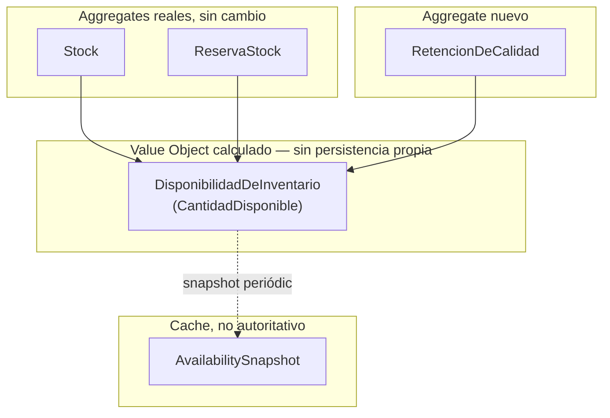
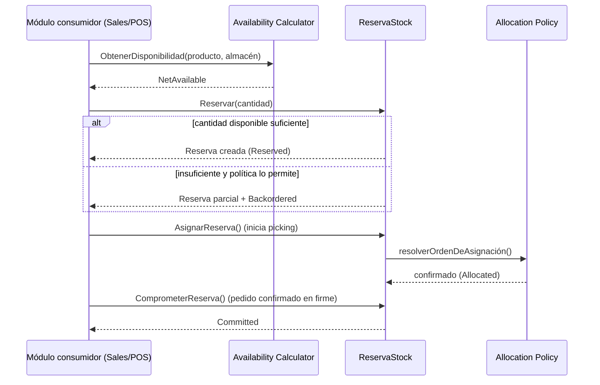
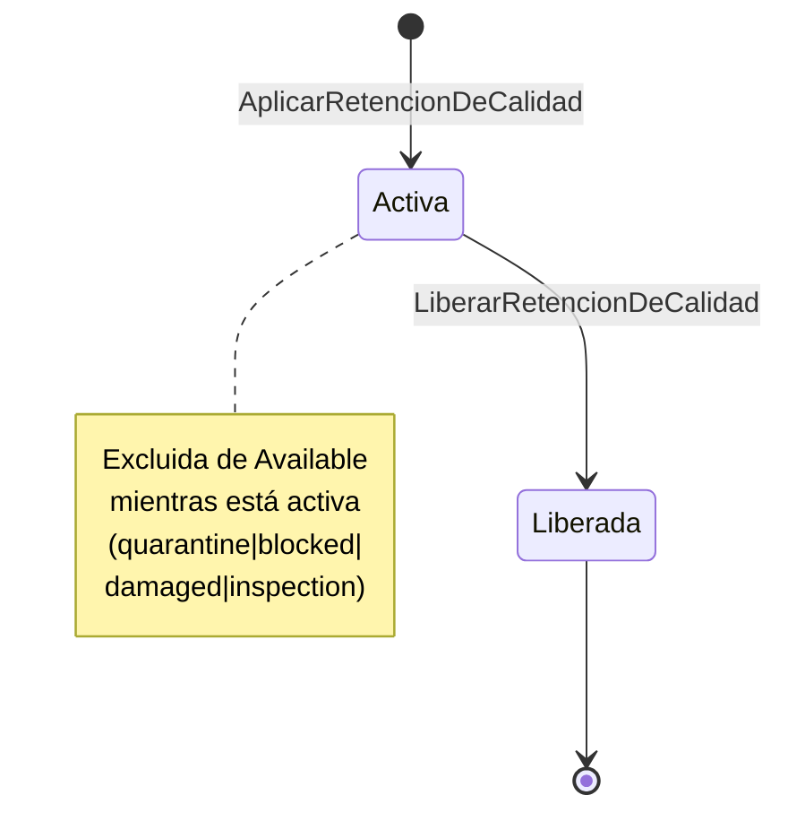

# ADR-INV-005 — Motor de Disponibilidad de Inventario (Inventory Availability Engine)

|                                 |                                                                                                                                                                                                                                                 |
| ------------------------------- | ----------------------------------------------------------------------------------------------------------------------------------------------------------------------------------------------------------------------------------------------- |
| **Identificador**               | `ADR-INV-005`                                                                                                                                                                                                                                   |
| **Versión**                     | 1.0.0                                                                                                                                                                                                                                           |
| **Estado**                      | Propuesta                                                                                                                                                                                                                                       |
| **Fecha**                       | 2026-07-28                                                                                                                                                                                                                                      |
| **Última revisión**             | 2026-07-28                                                                                                                                                                                                                                      |
| **Autor**                       | Principal Software Architect, GORAZUS ERP Enterprise                                                                                                                                                                                            |
| **Ámbito**                      | Motor de disponibilidad de inventario — dominio `inventory`, consumido por `sales`, `purchases`, `pos`, `production`, `services`                                                                                                                |
| **ADRs relacionados**           | `ADR-INV-000` (Bounded Context, Ubiquitous Language), `ADR-INV-001` (Producto), `ADR-INV-002` (Almacenes), `ADR-INV-003` (Motor de Movimientos), `ADR-INV-004` (Motor de Costeo), `ADR-INF-001` (Concurrencia), `ADR-DB-001` (particionamiento) |
| **Dominios relacionados**       | Inventory, Products, Sales, Purchases, Production                                                                                                                                                                                               |
| **Componentes relacionados**    | `inventory.stock`, `inventory.stock_reservations`, `inventory.v_available_stock`, `inventory.stock_transfers`, `inventory.replenishment_rules`, `inventory.inventory_lots`                                                                      |
| **Issues relacionados**         | `ISSUE-10` (reservas sin expiración), deuda nueva registrada en §13 de este documento                                                                                                                                                           |
| **Patrones relacionados (AKB)** | `Append-Only Ledger Pattern`, `Engineering Heuristics`, `Domain Design Heuristics`                                                                                                                                                              |
| **Documentos relacionados**     | [[Stock]], [[Reservation]], [[Movement Engine]], [[Warehouse]], [[Business Rules Matrix — Inventory]], `docs/ddd/16_domain_policies.md §P12`                                                                                                    |

Este documento formaliza el Motor de Disponibilidad de Inventario de GORAZUS ERP Enterprise —
extiende [[Stock]]/[[Reservation]] (ya reales) sin reemplazarlos, mismo criterio de honestidad que
`ADR-INV-004`: cada uno de los 22 estados solicitados se marca **✅ Real**, **🟡 Real parcial** o
**🔴 Propuesto**, verificado contra `core/database/prisma/schemas/inventory/schema.prisma` línea por
línea antes de diseñar nada.

---

## 1. Propósito y Alcance

Todo módulo de GORAZUS que necesite saber "¿hay stock de esto?" debe hacer una pregunta, no un
cálculo — este es el principio fundacional de este ADR, y es una generalización directa de la
heurística ya real _"nunca modificar el estado actual sin pasar por el ledger que lo sostiene"_
([[Engineering Heuristics]] #1): así como `Stock` nunca se escribe fuera de [[Movement Engine]], la
**disponibilidad** nunca debe calcularse dos veces en dos módulos distintos con dos fórmulas que
puedan divergir. Hoy `sales` ya consume `v_available_stock` (real, `ADR-INV-002`) — este ADR
formaliza esa dependencia como contrato explícito y la extiende a los 22 estados solicitados, la
mayoría de los cuales no existen todavía ni como columna ni como concepto de dominio nombrado.

## 2. Estado Real del Motor de Disponibilidad (verificado, no asumido)

| Estado solicitado   | Real hoy                                                  | Evidencia                                                                                                                                      |
| ------------------- | --------------------------------------------------------- | ---------------------------------------------------------------------------------------------------------------------------------------------- |
| On Hand             | ✅ Real                                                   | `stock.quantity_on_hand`                                                                                                                       |
| Reserved            | ✅ Real                                                   | `stock.quantity_reserved`, mantenido por [[Reservation]]                                                                                       |
| Available           | ✅ Real                                                   | `inventory.v_available_stock` (vista real: `on_hand − reserved`)                                                                               |
| Allocated           | 🔴 Propuesto — **no existe, confundido con Reserved hoy** | [[Reservation]]: "no distingue `Reserved` de `Committed`" — mismo gap se extiende a Allocated (§3.2)                                           |
| Committed           | 🔴 Propuesto — mismo gap que Allocated                    | Ídem                                                                                                                                           |
| Incoming            | 🟡 Derivable, no materializado                            | `inventory.goods_receipts` sin confirmar + `stock_transfers.status IN ('draft','in_transit')` con destino este almacén                         |
| Outgoing            | 🟡 Derivable, no materializado                            | `inventory.goods_issues` sin confirmar + `stock_transfers` con origen este almacén                                                             |
| In Transit          | ✅ Real                                                   | `stock_transfers.status = 'in_transit'` (`EstadoTransferencia`, `transferencia.entity.ts`, real)                                               |
| Backordered         | 🔴 Propuesto                                              | Sin tabla ni columna — §3.6                                                                                                                    |
| On Order            | 🟡 Derivable, no materializado                            | `purchases.purchase_orders` real (schema ajeno, consumido por referencia)                                                                      |
| Quarantine          | 🔴 Propuesto                                              | Sin tabla ni columna                                                                                                                           |
| Blocked             | 🔴 Propuesto                                              | Sin tabla ni columna                                                                                                                           |
| Damaged             | 🔴 Propuesto                                              | Sin tabla ni columna — `stock_adjustment_reasons` real podría alojar un motivo "dañado", no es lo mismo que un estado de disponibilidad        |
| Inspection          | 🔴 Propuesto                                              | Sin tabla ni columna                                                                                                                           |
| Expired             | 🟡 Derivable, no materializado                            | `inventory_lots.expiry_date` real — vencido = `expiry_date < CURRENT_DATE`                                                                     |
| Returned            | 🔴 Propuesto                                              | `sales.sales_returns`/`sales_return_lines` existen (schema `sales`, ajeno) sin conexión a disponibilidad de `inventory` todavía                |
| Consigned           | 🔴 Propuesto                                              | Sin tabla ni columna                                                                                                                           |
| Virtual Stock       | 🟡 Parcial                                                | `warehouses.warehouse_type = 'virtual'` real ([[Warehouse]]) — el _almacén_ puede ser virtual, no hay un estado de _cantidad_ virtual separado |
| Forecast Stock      | 🔴 Propuesto                                              | Sin tabla ni columna — mismo hallazgo que [[Innovation Report — 2026-07-28]] (pronóstico de demanda, sin dato ni código)                       |
| Safety Stock        | 🟡 Parcial                                                | `replenishment_rules.min_quantity` real, sin código de aplicación (`BR-11`, [[Business Rules Matrix — Inventory]])                             |
| Reorder Quantity    | 🟡 Parcial                                                | `replenishment_rules.max_quantity` real — el nombre real no coincide exactamente con "cantidad de reorden" (aclarado en §3.8)                  |
| Net Available       | 🔴 Propuesto                                              | Fórmula nueva sobre estados ya reales/propuestos — §3.9                                                                                        |
| Projected Available | 🔴 Propuesto                                              | Fórmula nueva, requiere Incoming/Outgoing — §3.10                                                                                              |

**Resumen honesto**: 4 de 22 estados ya reales y operativos, 6 derivables de datos ya reales sin
columna propia, 12 genuinamente nuevos. Ningún estado de este ADR se presenta como implementado sin
serlo.

## 3. Los 22 Estados — Diseño Completo

### 3.1 On Hand, Reserved, Available — ya reales, sin cambio de diseño

Sin extensión necesaria — `stock.quantity_on_hand`/`quantity_reserved`/`v_available_stock` ya
resuelven estos tres exactamente como están. Este ADR los **consume**, no los rediseña.

### 3.2 Allocated y Committed — diseño nuevo (la brecha más citada del AKB)

**Definición**: `Reserved` (ya real) es "apartado para un propósito, reversible sin costo" —
`Allocated` es un paso más: "ya asignado a una línea de picking específica, en proceso de salida
física, reversión posible pero con fricción operativa" — `Committed` es el paso final antes de
`Reserved` dejar de existir: "la promesa contractual de que esta cantidad saldrá, independientemente
de qué otra reserva compita por el mismo stock" (p. ej. una línea de pedido de venta ya confirmada,
antes de que exista una salida física).

**Regla de negocio**: una unidad de Stock pasa `Available → Reserved → Allocated → (sale física,
deja de contar en ninguno de los tres)`. `Committed` es ortogonal, no secuencial: una reserva puede
ser `Committed` (un pedido de venta ya confirmado, cliente esperando) sin ser todavía `Allocated`
(nadie empezó el picking). El [[Reservation]] real hoy no distingue ninguno de los dos.

**Fórmula**: `Allocated = SUM(stock_reservations.quantity WHERE picking_started = true)` (columna
propuesta, ausente hoy). `Committed = SUM(stock_reservations.quantity WHERE source_module = 'sales'
AND source_entity_id apunta a un pedido en estado no-cancelable)`.

**Dependencias**: requiere que `stock_reservations` gane dos columnas nuevas (`picking_started_at`,
`is_committed`) — extensión de la tabla real, no una tabla paralela (mismo criterio de
[[Engineering Heuristics]] #5: verificar si lo existente ya resuelve la necesidad antes de crear algo
nuevo).

**Eventos de dominio**: `ReservaAsignada` (Allocated), `ReservaComprometida` (Committed).

**Auditoría**: heredada automáticamente (auditoría universal sobre `stock_reservations`).

### 3.3 Incoming y Outgoing — diseño nuevo (agregación, no tabla nueva)

**Definición**: cantidad total en camino de **entrar** o **salir** de un almacén, sin distinguir
todavía la causa (compra, transferencia, producción).

**Fórmula**:

```
Incoming(warehouseId) = SUM(goods_receipts sin confirmar, destino=warehouseId)
                       + SUM(stock_transfers.status IN ('draft','in_transit'), destino=warehouseId)
                       + SUM(production_order_outputs pendientes, warehouseId)
Outgoing(warehouseId) = SUM(goods_issues sin confirmar, origen=warehouseId)
                       + SUM(stock_transfers.status IN ('draft','in_transit'), origen=warehouseId)
```

**Dependencias**: `goods_receipts`/`goods_issues` (reales, ya con `warehouse_id`), `stock_transfers`
(real), `production_order_outputs` (real, schema ya certificado). Sin tabla nueva — es agregación de
datos ya reales, calculada por el Domain Service (§4), nunca materializada de forma redundante.

### 3.4 In Transit — ya real, sin cambio de diseño

`stock_transfers.status = 'in_transit'` ya es exactamente esto. Este ADR lo incorpora como insumo de
Incoming/Outgoing (§3.3) sin rediseñarlo.

### 3.5 On Order — diseño nuevo (cruce con dominio ajeno)

**Definición**: cantidad ya comprometida en una orden de compra confirmada, todavía sin recibir.

**Fórmula**: `SUM(purchases.purchase_order_lines.quantity WHERE purchase_orders.status = 'confirmed'
AND NOT EXISTS goods_receipt_line asociada)`.

**Dependencia real, límite de dominio explícito**: `purchases` es un dominio ajeno (schema real,
`compras` sin código de aplicación, `GEMM §9`) — el Motor de Disponibilidad **lee** de `purchases` vía
una consulta de solo lectura, nunca posee ni duplica esa tabla (mismo criterio de "declarar, no
poseer" ya aplicado a impuestos en `ADR-INV-001 §2.1`).

### 3.6 Backordered — diseño nuevo

**Definición**: cantidad de una línea de venta confirmada que **no pudo** reservarse por falta de
`Available` suficiente en el momento de confirmar.

**Regla de negocio**: se genera automáticamente cuando `Reservar(cantidad)` se ejecuta bajo la
política `allow_estimated`/reserva parcial (§5.2) y la cantidad disponible es menor a la solicitada —
la diferencia queda registrada como `Backordered`, no se pierde silenciosamente.

**Fórmula**: `Backordered = cantidad_solicitada − cantidad_efectivamente_reservada`, por línea.

**Dependencias**: requiere `stock_reservations.requested_quantity` (columna nueva, distinta de
`quantity` que hoy ya representa "lo efectivamente reservado") — extensión, no tabla nueva.

**Evento**: `ReservaParcialConBackorder`.

### 3.7 Quarantine, Blocked, Damaged, Inspection — diseño nuevo (familia de "no disponible por calidad")

Las cuatro comparten la misma forma de negocio — cantidad físicamente presente (`On Hand`) pero
excluida de `Available` por una razón de calidad/cumplimiento, no de compromiso comercial (a
diferencia de `Reserved`/`Allocated`/`Committed`). Se propone una sola tabla,
`stock_quality_holds` (no cuatro tablas paralelas — mismo criterio de "no fragmentar sin necesidad",
[[Enterprise Optimization Report — 2026-07-28]] §3), con `hold_type CHECK IN
('quarantine','blocked','damaged','inspection')`:

```text
┌──────────────┐        ┌────────────────────────┐
│    stock      │───────▶│  stock_quality_holds     │  hold_type: quarantine|blocked|
│ quantity_on_  │  1:N   │  product_id, warehouse_id │  damaged|inspection
│ hand          │        │  quantity, hold_type       │  released_at (mismo patrón que
└──────────────┘        │  released_at                │  stock_reservations)
                          └────────────────────────┘
```

**Fórmula de impacto en `Available`**: `Available = on_hand − reserved − SUM(stock_quality_holds
WHERE released_at IS NULL)` — extiende la fórmula real de `v_available_stock`, no la reemplaza.

**Evento**: `RetencionDeCalidadAplicada`, `RetencionDeCalidadLiberada`.

### 3.8 Expired — diseño nuevo (derivado, no un estado a mantener)

**Definición**: cantidad de un lote cuya `expiry_date` ya pasó — **no se mantiene como columna**, se
deriva en cada consulta (mismo criterio que `Available` mismo: valor calculado, no denormalizado sin
dueño de mantenimiento, [[Engineering Heuristics]] #3).

**Fórmula**: `Expired(productId, warehouseId) = SUM(inventory_lots.remaining_quantity WHERE
expiry_date < CURRENT_DATE)`.

**Regla de negocio propuesta**: un lote vencido se excluye automáticamente de `Available` (no
requiere una operación manual de "marcar como vencido") — regla FEFO ya mencionada en
`ADR-INV-001 §6` (primero en vencer, primero en salir) se vuelve más estricta: un lote vencido nunca
sale, punto.

### 3.9 Returned — diseño nuevo (cruce con dominio ajeno)

**Definición**: cantidad que regresó de una venta (`sales.sales_returns`, schema real, sin código de
aplicación) y está pendiente de reingresar a `Available` (requiere inspección de calidad — conecta
directamente con §3.7: una devolución entra primero como `Inspection`, no directo a `Available`).

**Dependencia**: mismo límite de dominio que On Order (§3.5) — el Motor de Disponibilidad reacciona a
un evento de `sales` (`DevolucionRecibida`, propuesto en el dominio de Ventas, fuera del alcance de
este ADR), nunca escribe directamente en las tablas de `sales`.

### 3.10 Consigned — diseño nuevo

**Definición**: inventario físicamente en las instalaciones de GORAZUS (o de un cliente) pero cuya
propiedad legal todavía no se transfirió — no cuenta como `Available` para venta normal ni como
`On Hand` propio para valuación (`ADR-INV-004`) hasta que se confirme la transferencia de propiedad.

**Diseño propuesto**: bandera `is_consigned` en `stock` (columna nueva) + `consignor_id`/
`consignee_id` (referencia a `suppliers`/`customers`, dominios ajenos, por referencia). **Fuera de
alcance de implementación de este ADR** — se documenta el diseño porque fue solicitado
explícitamente, sin evidencia de necesidad de negocio confirmada en ningún documento de esta sesión
(mismo criterio de honestidad que [[Innovation Report — 2026-07-28]]: diseñar cuando se pide, no
fingir que ya hay una necesidad real detrás).

### 3.11 Virtual Stock — aclaración, no diseño nuevo

`warehouses.warehouse_type = 'virtual'` ya es real ([[Warehouse]], `ADR-INV-002 §3`) — un "almacén
virtual" ya puede tener sus propias filas de `stock` como cualquier otro almacén. No se necesita un
estado de cantidad "virtual" separado — la virtualidad es una propiedad del almacén, no de la
cantidad, aclaración ya coherente con el patrón de dos capas de `ADR-INV-001 §3.1`/`ADR-INV-002 §3`.

### 3.12 Forecast Stock — diseño nuevo, deliberadamente mínimo

Mismo veredicto que [[Innovation Report — 2026-07-28]] §2: **Monitor**, no **Prototype**. Se propone
solo la interfaz de consulta (`ObtenerPronosticoDeStock`, §4.10) sin motor de cálculo — cualquier
implementación real de pronóstico requiere el modelo de IA que ese reporte ya clasificó sin evidencia
de necesidad de negocio confirmada. Este ADR dimensiona el lugar donde encajaría, no lo construye.

### 3.13 Safety Stock y Reorder Quantity — aclaración de nomenclatura + diseño de aplicación

`replenishment_rules.min_quantity`/`max_quantity` ya son, respectivamente, el equivalente real de
Safety Stock (el piso bajo el cual se debe reponer) y el techo de reposición — **no** hay una columna
`reorder_quantity` distinta; se propone calcularla, no almacenarla:
`ReorderQuantity = max_quantity − Available_actual` (cuando `Available_actual < min_quantity`) — la
tabla ya real no necesita una columna nueva, necesita un Domain Service que la lea (§4.9).

### 3.14 Net Available — diseño nuevo (la fórmula más completa de este ADR)

```
NetAvailable = On Hand
             − Reserved
             − Allocated
             − SUM(stock_quality_holds activos)
             − Expired
             + Returned (una vez pasada Inspection)
```

Es la extensión completa de `v_available_stock` (que hoy solo resta `Reserved`) — **decisión de
diseño**: `v_available_stock` real **no se modifica** (`sales` ya la consume, cambiar su fórmula sin
coordinación rompería un consumidor real) — se propone una vista nueva,
`inventory.v_net_available_stock`, que extiende el cálculo sin tocar la vista existente.

### 3.15 Projected Available — diseño nuevo

```
ProjectedAvailable(fecha_futura) = NetAvailable_hoy
                                  + Incoming (con fecha esperada ≤ fecha_futura)
                                  − Outgoing (con fecha esperada ≤ fecha_futura)
                                  − Backordered
```

Requiere que `goods_receipts`/`stock_transfers`/`purchase_orders` tengan una fecha esperada de
llegada confiable — hoy ninguna tabla real de recepción tiene una columna de "fecha esperada"
distinta de `created_at` (hallazgo de esta revisión, brecha real, §13).

## 4. Diseño DDD

### 4.1 Decisión de diseño central — Disponibilidad como Value Object calculado, no como Aggregate mutable

**La decisión más importante de este ADR**: `DisponibilidadDeInventario` **no** es un Aggregate Root
con estado propio persistido — es un **Value Object calculado** por un Domain Service que lee
[[Stock]], [[Reservation]] y las tablas nuevas de §3 en el momento de la consulta (o desde un
snapshot cacheado, §4.3, nunca autoritativo). Razón: convertirlo en un Aggregate mutable requeriría
mantenerlo sincronizado desde N puntos de escritura distintos (cada tabla que contribuye a la
fórmula) — exactamente el anti-patrón que [[Engineering Heuristics]] #3 ya previene ("denormalizar
solo con dueño de mantenimiento claro"). Ningún dueño único puede mantener correctamente un valor que
depende de siete tablas distintas sin que alguna eventualmente quede desincronizada.

### 4.2 Aggregates (ya reales, sin cambio)

`Stock`, `ReservaStock` — este ADR no introduce Aggregate Roots nuevos para disponibilidad en sí.
Introduce uno nuevo y acotado: **`RetencionDeCalidad`** (`stock_quality_holds`, §3.7) — Aggregate
Root propio porque tiene ciclo de vida independiente (`activa → liberada`), igual criterio que
`ReservaStock`.

### 4.3 Availability Snapshot (cache, explícitamente no autoritativo)

`inventory.availability_snapshots` (propuesta) — snapshot periódico (`background_job`) de
`NetAvailable`/`ProjectedAvailable` por `(product_id, warehouse_id)`, usado **solo** para reportes de
alto volumen (dashboards, exportes) donde recalcular en vivo sería costoso — **nunca** la fuente de
verdad para una decisión transaccional (reservar/confirmar una venta siempre lee el cálculo en vivo,
nunca el snapshot, para evitar vender sobre un número desactualizado).

### 4.4 Availability Calculator (Domain Service)

`CalcularDisponibilidad(productId, warehouseId)` — el único punto del sistema que ejecuta las
fórmulas de §3. Todo módulo que necesite disponibilidad lo invoca; ninguno recalcula por su cuenta
(regla de negocio de nivel de plataforma, no solo de este dominio).

### 4.5 Availability Policy / Reservation Policy / Allocation Policy / Release Policy

Cuatro Domain Policies nuevas, propuestas (mismo límite de autorización de edición de `docs/ddd/`
ya respetado en ADRs anteriores):

- **Availability Policy (propuesta P17)**: qué estados cuentan como "disponible para vender" —
  configurable por empresa (algunas empresas venden sobre `Backordered`, otras no).
- **Reservation Policy (propuesta P18)**: formaliza la política de inventario negativo ya diseñada
  en `ADR-INV-004 §6` (bloquear/permitir estimado/permitir costo cero), reutilizada aquí para
  cantidad, no solo costo — mismo mecanismo, dos consumidores.
- **Allocation Policy (propuesta P19)**: orden de asignación cuando varias reservas compiten por el
  mismo stock limitado — FIFO por fecha de reserva por defecto (§5.14), con prioridad configurable
  (§5.13).
- **Release Policy (propuesta P20)**: cuándo una reserva/asignación se libera automáticamente —
  formaliza `ISSUE-10` (expiración de reservas) como política explícita en vez de dejarlo como issue
  suelto.

### 4.6 Value Objects

`CantidadDisponible` (monto + desglose por estado, inmutable — el resultado de
`CalcularDisponibilidad`), `VentanaDeExpiracionDeReserva` (reutiliza "Rango de Fecha", ya real en
`docs/ddd/06_value_objects.md §1`).

### 4.7 Repositories

`RetencionDeCalidadRepository` (nuevo, port/adapter real). Sin repositorio propio para
`DisponibilidadDeInventario` — al ser un Value Object calculado (§4.1), no tiene persistencia propia
que requiera un repositorio; `AvailabilitySnapshotRepository` (§4.3) sí, para el cache.

### 4.8 Factories

`RetencionDeCalidadFactory` — mismo patrón que `ProductoFactory`/`TransferenciaFactory` reales.

### 4.9 Specifications

`StockDisponibleParaReserva` (ya insinuada en `ddd/17_invariants.md` I1, formalizada aquí como
Specification reutilizable), `LoteEstaVencido` (§3.8), `RequiereReposicion` (§3.13 —
`Available_actual < min_quantity`).

### 4.10 Application Services / Commands / Queries

- Comandos: `AplicarRetencionDeCalidad`, `LiberarRetencionDeCalidad`, `AsignarReserva` (Allocated),
  `ComprometerReserva` (Committed).
- Consultas: `ObtenerDisponibilidad(productId, warehouseId)`,
  `ObtenerDisponibilidadProyectada(productId, warehouseId, fecha)`,
  `ObtenerPronosticoDeStock` (§3.12, interfaz sin motor), `ObtenerProductosParaReponer` (§3.13).

## 5. Reglas de Negocio

| Operación              | Regla                                                                                                                                                                  | Estado                                                  |
| ---------------------- | ---------------------------------------------------------------------------------------------------------------------------------------------------------------------- | ------------------------------------------------------- |
| Reservations           | `BR-04`: reserva siempre con dueño (`source_module`/`source_entity_id` obligatorios)                                                                                   | ✅ Real                                                 |
| Sales Orders           | Confirmar un pedido intenta `Reservar`; si `Available` insuficiente y la política lo permite, genera `Backordered` (§3.6)                                              | 🔴 Propuesto                                            |
| Purchase Orders        | Una orden confirmada contribuye a `On Order` (§3.5), nunca a `On Hand` hasta la recepción real                                                                         | 🔴 Propuesto                                            |
| Transfers              | `In Transit` ya descuenta de `Available` del origen sin sumar al destino hasta `received` (`transferencia.entity.ts`, real)                                            | ✅ Real                                                 |
| Returns                | Entra como `Inspection` (§3.7), nunca directo a `Available`                                                                                                            | 🔴 Propuesto                                            |
| Cycle Counts           | Ya reconcilia vía Ajuste (`BR-10`, real) — sin cambio, `CalcularDisponibilidad` simplemente lee el `Stock` ya reconciliado                                             | ✅ Real (heredado)                                      |
| Inventory Adjustments  | `BR-09` ya real (ajuste requiere motivo) — mismo criterio se extiende a `stock_quality_holds`                                                                          | ✅ Real (heredado)                                      |
| Production Consumption | `production_order_components` (real) resta de `Available` al confirmarse el consumo                                                                                    | 🟡 Tabla real, integración con disponibilidad propuesta |
| Production Output      | `production_order_outputs` (real) contribuye a `Incoming` (§3.3) hasta confirmarse                                                                                     | 🟡 Tabla real, integración con disponibilidad propuesta |
| Warehouse Movements    | Cubierto por [[Movement Engine]] ya real — este ADR no lo modifica                                                                                                     | ✅ Real (heredado)                                      |
| Negative Inventory     | Reutiliza la política de 3 opciones de `ADR-INV-004 §6`, aplicada a cantidad                                                                                           | 🔴 Propuesto (mismo mecanismo, nuevo consumidor)        |
| Partial Reservations   | Genera `Backordered` por la diferencia (§3.6) en vez de rechazar toda la reserva                                                                                       | 🔴 Propuesto                                            |
| Reservation Expiration | Formaliza `ISSUE-10` — Release Policy (§4.5) con `background_job` de barrido                                                                                           | 🔴 Propuesto, ya recomendado como issue abierto         |
| Reservation Priority   | Orden de inserción por defecto (ya real, [[Reservation]]: "el único orden real es de inserción") — prioridad configurable como extensión, no reemplazo                 | 🟡 Real (default) + propuesto (configurable)            |
| Allocation Priority    | Allocation Policy (§4.5, P19) — FIFO por fecha de reserva por defecto                                                                                                  | 🔴 Propuesto                                            |
| Warehouse Priority     | Nuevo — al buscar disponibilidad multi-almacén, orden configurable (más cercano, mayor stock, almacén principal primero — `warehouse_type = 'main'`, `ADR-INV-002 §3`) | 🔴 Propuesto                                            |
| Branch Priority        | Mismo criterio que Warehouse Priority, un nivel arriba en la jerarquía                                                                                                 | 🔴 Propuesto                                            |
| Company Isolation      | RLS universal ya real (`Security`) — heredado sin cambio, **con la misma brecha conocida** de `branch`/`warehouse` (`ISSUE-02`)                                        | ✅ Real (heredado, con brecha conocida)                 |

## 6. Diseño de Base de Datos

### 6.1 Tablas nuevas

```sql
CREATE TABLE inventory.stock_quality_holds (
    id                  UUID        NOT NULL DEFAULT gen_random_uuid(),
    product_id          UUID        NOT NULL REFERENCES products.products(id),
    warehouse_id        UUID        NOT NULL REFERENCES inventory.warehouses(id),
    quantity            DECIMAL(18,6) NOT NULL,
    hold_type           TEXT        NOT NULL, -- 'quarantine'|'blocked'|'damaged'|'inspection'
    reason              TEXT,
    released_at         TIMESTAMPTZ,
    PRIMARY KEY (id)
);

CREATE TABLE inventory.availability_snapshots (
    id                  UUID        NOT NULL DEFAULT gen_random_uuid(),
    product_id          UUID        NOT NULL REFERENCES products.products(id),
    warehouse_id        UUID        NOT NULL REFERENCES inventory.warehouses(id),
    net_available        DECIMAL(18,6) NOT NULL,
    projected_available  DECIMAL(18,6),
    snapshot_at          TIMESTAMPTZ NOT NULL DEFAULT now(),
    PRIMARY KEY (id, snapshot_at)
) PARTITION BY RANGE (snapshot_at); -- mensual, mismo criterio que ADR-DB-001

-- Extensión de tabla real (no tabla nueva) — columnas propuestas sobre stock_reservations
ALTER TABLE inventory.stock_reservations ADD COLUMN picking_started_at TIMESTAMPTZ;
ALTER TABLE inventory.stock_reservations ADD COLUMN is_committed BOOLEAN NOT NULL DEFAULT false;
ALTER TABLE inventory.stock_reservations ADD COLUMN requested_quantity DECIMAL(18,6);
ALTER TABLE inventory.stock_reservations ADD COLUMN expires_at TIMESTAMPTZ; -- cierra ISSUE-10
```

### 6.2 Vistas y Vistas Materializadas

- `inventory.v_net_available_stock` (vista, §3.14) — extiende `v_available_stock` sin modificarla.
- `inventory.v_incoming_outgoing` (vista, §3.3) — agregación en vivo.
- `availability_snapshots` (§6.1) cumple el rol de "vista materializada" vía `background_job`
  periódico en vez de `MATERIALIZED VIEW` nativa de Postgres — decisión deliberada: un
  `REFRESH MATERIALIZED VIEW` bloquea lecturas concurrentes salvo `CONCURRENTLY` (que requiere un
  índice único), mientras que una tabla real particionada permite `INSERT` sin bloquear lecturas del
  snapshot anterior — mismo criterio de "preferir un ledger append-only sobre una vista que se
  recalcula in-place" ([[Append-Only Ledger Pattern]]).

### 6.3 Índices

`BTree (product_id, warehouse_id)` en `stock_quality_holds` (mismo patrón ya certificado). `BRIN` en
`availability_snapshots.snapshot_at` (append-only, `ADR-DB-001 §15.5`). Índice parcial
`WHERE released_at IS NULL` en `stock_quality_holds` y `WHERE expires_at IS NOT NULL AND released_at
IS NULL` en `stock_reservations` extendida — mismo patrón de 828 índices parciales ya certificados
(`INDEX_REPORT.md`).

### 6.4 Concurrencia, Locking, Idempotencia

Reutiliza el orden determinístico de `ADR-INF-001 §4` sin extenderlo — `RetencionDeCalidad` se
bloquea después de `Stock` en ese mismo orden (es una restricción adicional sobre la misma unidad de
inventario, no una entidad nueva en la cadena). `AsignarReserva`/`ComprometerReserva` requieren clave
de idempotencia — mismo gap ya identificado (`ISSUE-07`), reutilizado, no reinventado.

## 7. Diseño de API

Mismo estándar real (`API Standards`):

- `GET /inventario/disponibilidad?productId=&warehouseId=` — `CalcularDisponibilidad`.
- `GET /inventario/disponibilidad/proyectada?productId=&warehouseId=&fecha=`.
- `GET /inventario/disponibilidad/bulk` (`POST` con body, lista de productos — evita 1000 llamadas
  GET individuales, mismo criterio de eficiencia que cualquier bulk endpoint enterprise).
- `POST /inventario/retenciones-calidad` / `.../{id}/liberar`.
- `POST /inventario/reservas/{id}/asignar` (Allocated) / `.../comprometer` (Committed).
- `GET /inventario/disponibilidad/reposicion` — `ObtenerProductosParaReponer` (§3.13).
- `GET /inventario/disponibilidad/almacen/{warehouseId}` / `.../sucursal/{branchId}` /
  `.../empresa/{companyId}` — mismo cálculo, distinto nivel de agregación.

Formato `{data, meta}`/RFC 7807/paginación/Bearer JWT heredado. Permisos nuevos:
`inventario.gestionar_disponibilidad`, `inventario.gestionar_retenciones_calidad`.

## 8. Seguridad

RBAC por operación (`gestionar_disponibilidad` vs. `gestionar_retenciones_calidad`, separados —
liberar una retención de calidad es una decisión de mayor impacto que solo consultar disponibilidad).
Aislamiento empresa/sucursal/almacén: hereda RLS real, **misma brecha conocida** de `branch`/
`warehouse` sin cobertura (`ISSUE-02`) — no la resuelve, la hereda igual que `ADR-INV-004`. Auditoría
completa: heredada automáticamente sobre las tablas nuevas.

## 9. Rendimiento y Escalabilidad

- Millones de productos/reservas: `CalcularDisponibilidad` es una consulta acotada por
  `(product_id, warehouse_id)`, con los índices ya certificados — no un `SCAN` de tabla completa.
- Redis: candidato real de cache de lectura (ya real como uno de los tres roles de Redis,
  `Infrastructure`) para `GET /inventario/disponibilidad` de productos de alta consulta — con TTL
  corto (segundos), nunca como fuente de verdad transaccional (mismo límite que
  `availability_snapshots`, §4.3).
- Background recalculation: `availability_snapshots` se puebla vía `core.scheduled_jobs` (real), no
  en cada escritura — evita el costo de mantener un valor derivado sincronizado en tiempo real sobre
  siete tablas de origen.
- Escalado horizontal: `api` ya escalable ([[Infrastructure]]) — sin cambio necesario, las consultas
  de disponibilidad son _stateless_ por diseño (Value Object calculado, §4.1).

## 10. Diagramas

### 10.1 Diagrama de Aggregates y Value Objects



### 10.2 Flujo de Reserva → Asignación → Compromiso



### 10.3 Ciclo de vida de una Retención de Calidad



## 11. Riesgos, Trade-offs y Alternativas Consideradas

| Riesgo                                                                                 | Severidad | Mitigación                                                                                                                                 |
| -------------------------------------------------------------------------------------- | --------- | ------------------------------------------------------------------------------------------------------------------------------------------ |
| `stock_reservations` extendida con 4 columnas nuevas sin migración de datos históricos | Baja      | Todas `NULL`/`false` por defecto — compatible hacia atrás, sin romper filas existentes                                                     |
| `availability_snapshots` desactualizado si el `background_job` falla silenciosamente   | Media     | Mismo patrón de alerta ya diseñado para particiones (`ADR-DB-001 §10.4`) — reutilizable, no un mecanismo nuevo                             |
| Cálculo de `Incoming`/`Outgoing` cruza 4 tablas en vivo — costo de consulta no medido  | Media     | Sin evidencia de que sea un problema real todavía (`pg_stat_statements` no instalado, brecha ya conocida) — no se optimiza preventivamente |

**Alternativas descartadas**:

- **Cuatro tablas separadas para Quarantine/Blocked/Damaged/Inspection** en vez de una con
  `hold_type`. Descartada: mismo criterio de simplificación ya aplicado en
  [[Enterprise Optimization Report — 2026-07-28]] §3 — cuatro tablas de una columna útil cada una
  fragmentarían sin beneficio sobre un discriminador.
- **`DisponibilidadDeInventario` como Aggregate Root persistido** en vez de Value Object calculado
  (§4.1). Descartada explícitamente — es la decisión de diseño central de este ADR, no una opción
  menor.
- **`MATERIALIZED VIEW` nativa de Postgres para el snapshot** en vez de tabla particionada (§6.2).
  Descartada por el problema real de bloqueo de `REFRESH` sin `CONCURRENTLY`.

## 12. Consecuencias

- Todo módulo futuro que necesite disponibilidad debe consumir `CalcularDisponibilidad`
  (`ObtenerDisponibilidad`) — nunca leer `stock.quantity_on_hand` directamente y restar algo por su
  cuenta. Esta es la regla de plataforma más importante de este ADR, mencionada explícitamente en el
  pedido original ("No module may calculate stock independently").
- `v_available_stock` real permanece sin cambios — `sales` sigue funcionando exactamente igual;
  `v_net_available_stock` es la extensión, no un reemplazo que rompería el consumidor actual.
- Las cuatro Domain Policies propuestas (P17-P20) requieren autorización de edición de
  `docs/ddd/16_domain_policies.md`, mismo límite ya respetado en ADRs anteriores.

## 13. Mejoras Futuras / Deuda Registrada

- Ninguna tabla real de recepción/orden de compra tiene columna de "fecha esperada de llegada"
  (hallazgo nuevo, §3.15) — bloquea `ProjectedAvailable` real hasta que se agregue.
- `ISSUE-10` (expiración de reservas) queda formalizado como Release Policy (P20) en vez de issue
  suelto — recomendado para consolidarse en el Issue Register real cuando se implemente.
- Warehouse Priority / Branch Priority (§5) quedan diseñadas sin algoritmo de "cercanía" real —
  requeriría datos de geolocalización que GORAZUS no certifica hoy en ningún documento leído esta
  sesión.

---

## Alternativas Consideradas

Ver §11.

## Consecuencias

Ver §12.
