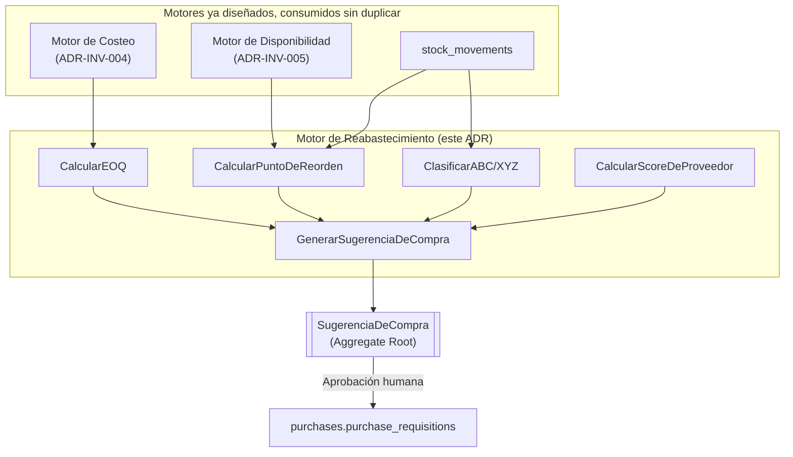
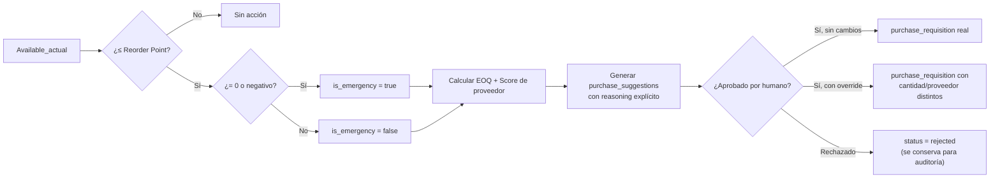
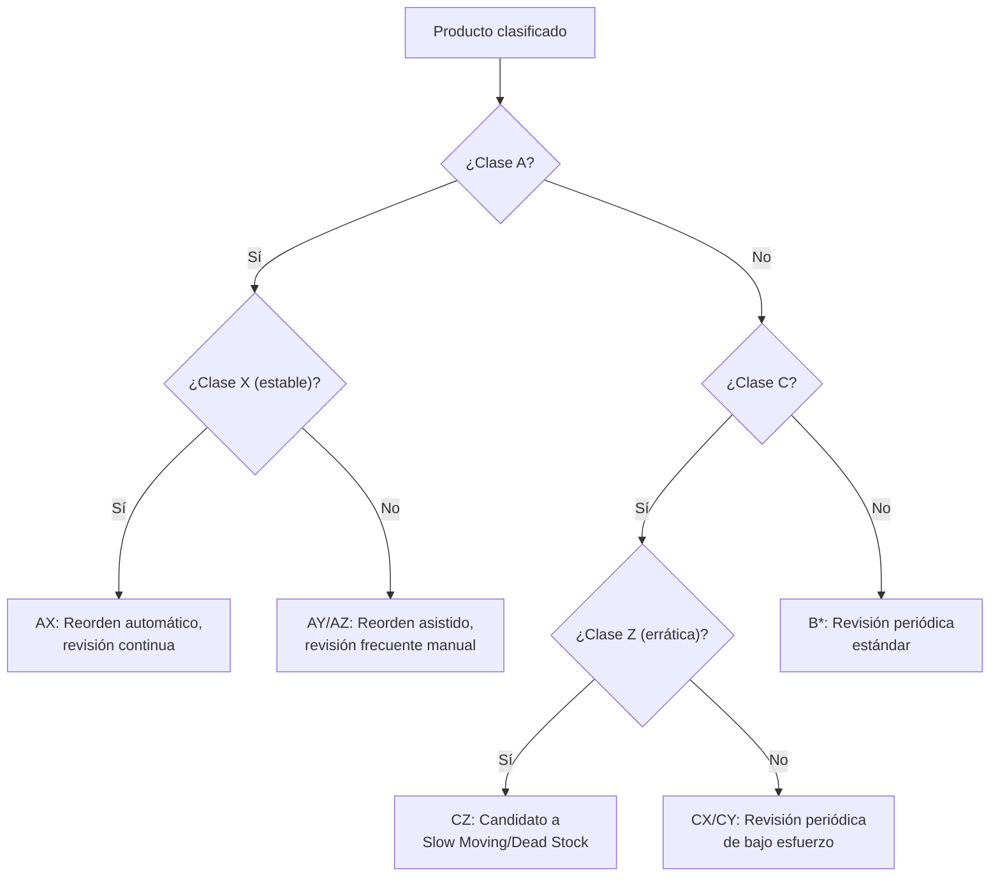

# ADR-INV-006 — Motor de Reabastecimiento de Inventario (Inventory Replenishment Engine)

|                                 |                                                                                                                                                                                                                |
| ------------------------------- | -------------------------------------------------------------------------------------------------------------------------------------------------------------------------------------------------------------- |
| **Identificador**               | `ADR-INV-006`                                                                                                                                                                                                  |
| **Versión**                     | 1.0.0                                                                                                                                                                                                          |
| **Estado**                      | Propuesta                                                                                                                                                                                                      |
| **Fecha**                       | 2026-07-28                                                                                                                                                                                                     |
| **Última revisión**             | 2026-07-28                                                                                                                                                                                                     |
| **Autor**                       | Principal Software Architect, GORAZUS ERP Enterprise                                                                                                                                                           |
| **Ámbito**                      | Motor de reabastecimiento — dominio `inventory`, consumido por `purchases`, `products`, `bi`                                                                                                                   |
| **ADRs relacionados**           | `ADR-INV-000` a `ADR-INV-005` (toda la serie), `ADR-DB-001` (particionamiento)                                                                                                                                 |
| **Dominios relacionados**       | Inventory, Purchases, Products, Suppliers, BI                                                                                                                                                                  |
| **Componentes relacionados**    | `inventory.replenishment_rules`, `products.product_suppliers`, `bi.forecasts`/`forecast_models`, `suppliers.supplier_classifications`, `purchases.purchase_requisitions`/`purchase_orders`                     |
| **Issues relacionados**         | Deuda nueva registrada en §14 de este documento                                                                                                                                                                |
| **Patrones relacionados (AKB)** | `Append-Only Ledger Pattern`, `Engineering Heuristics`, `Domain Design Heuristics`                                                                                                                             |
| **Documentos relacionados**     | `ADR-INV-005 §3.13` (Safety Stock/Reorder ya identificados como parciales), [[Business Rules Matrix — Inventory]] BR-11, [[Innovation Report — 2026-07-28]] (veredicto ya emitido sobre pronóstico de demanda) |

Cierre de la trilogía de motores de Inventario (`ADR-INV-004` Costeo, `ADR-INV-005` Disponibilidad,
`ADR-INV-006` Reabastecimiento) — los tres comparten el mismo Aggregate `Stock`/[[Reservation]] como
insumo, sin duplicar lectura ni cálculo entre sí. Mismo criterio de honestidad: cada capacidad
solicitada se marca **✅ Real**, **🟡 Parcial** o **🔴 Propuesta**, verificado contra el schema
certificado — incluyendo un hallazgo que corrige una conclusión de esta misma sesión (§2, `bi.forecasts`).

---

## 1. Propósito y Alcance

Un motor de reabastecimiento que no es explicable es, en la práctica, una caja negra que nadie puede
auditar cuando compra de más o se queda sin stock — la regla explícita del pedido
("Every recommendation must be deterministic, auditable and explainable") no es una limitación, es
la razón por la que este ADR diseña el motor sobre **fórmulas de investigación de operaciones
clásicas** (EOQ, punto de reorden, clasificación ABC/XYZ) en vez de un modelo de caja negra — mismo
veredicto ya emitido en [[Innovation Report — 2026-07-28]] (IA sin evidencia de necesidad de negocio
confirmada → `Discard`/`Monitor`, nunca `Adopt` sin evidencia). Este motor es el tercero y último de
la trilogía: consume `Stock`/`v_net_available_stock` (`ADR-INV-005`) y la valuación de costo
(`ADR-INV-004`) para decidir **cuándo, cuánto y a quién** comprar — sin recalcular ninguno de los dos
por su cuenta.

## 2. Estado Real del Motor de Reabastecimiento (verificado — con una corrección real)

**Corrección a un hallazgo previo de esta misma sesión**: [[Innovation Report — 2026-07-28]] marcó
"IA — Pronóstico de demanda" como sin ningún dato ni código. Verificación más profunda para este ADR
encontró que **sí existe infraestructura genérica de pronóstico** (`bi.forecast_models`/`bi.forecasts`
— `algorithm` + `predicted_value` por fecha) — genérica de BI, sin columna `product_id`/`warehouse_id`
propia, por lo que no es "pronóstico de demanda de inventario" todavía, pero sí es el mecanismo real
sobre el que se apoyaría si se implementara (§3.6). Se corrige aquí explícitamente en vez de repetir
el hallazgo anterior sin verificar.

| Capacidad solicitada                   | Estado                                     | Evidencia                                                                                                                                                                                 |
| -------------------------------------- | ------------------------------------------ | ----------------------------------------------------------------------------------------------------------------------------------------------------------------------------------------- |
| Minimum/Maximum Stock                  | ✅ Real, sin código de aplicación          | `replenishment_rules.min_quantity`/`max_quantity`                                                                                                                                         |
| Safety Stock                           | 🟡 Real parcial                            | Mismo campo `min_quantity` — aclaración de nomenclatura, no tabla nueva (`ADR-INV-005 §3.13`)                                                                                             |
| Reorder Point                          | 🟡 Real parcial                            | Se calcula, no se almacena — §3.4                                                                                                                                                         |
| Economic Order Quantity (EOQ)          | 🔴 Propuesta                               | Fórmula clásica, sin tabla — §3.5                                                                                                                                                         |
| ABC Classification                     | 🔴 Propuesta                               | Sin tabla específica de inventario — `supplier_classifications`/`customer_classifications` son el patrón real más cercano (genérico, nombre libre), no una clasificación ABC estructurada |
| XYZ Classification                     | 🔴 Propuesta                               | Sin evidencia alguna                                                                                                                                                                      |
| ABC-XYZ Matrix                         | 🔴 Propuesta                               | Combinación de las dos anteriores                                                                                                                                                         |
| Demand Classification                  | 🔴 Propuesta                               | Sin evidencia                                                                                                                                                                             |
| Seasonality                            | 🔴 Propuesta                               | Sin evidencia                                                                                                                                                                             |
| Lead Time                              | ✅ Real                                    | `product_suppliers.lead_time_days`                                                                                                                                                        |
| Supplier Lead Time                     | ✅ Real                                    | Mismo campo, ya por proveedor                                                                                                                                                             |
| Purchase Frequency                     | 🔴 Propuesta                               | Derivable de `purchase_order_lines` históricas, sin cálculo hoy                                                                                                                           |
| Forecast Consumption                   | 🟡 Real parcial (infraestructura genérica) | `bi.forecasts`/`forecast_models` — corrección de §2                                                                                                                                       |
| Historical Consumption                 | ✅ Real                                    | `inventory.stock_movements` (particionada, `ADR-DB-001 §7`) — fuente ya completa                                                                                                          |
| Demand Trend                           | 🔴 Propuesta                               | Cálculo sobre `stock_movements`, sin fórmula formalizada hoy                                                                                                                              |
| Buffer Stock                           | 🟡 Real parcial                            | Mismo concepto que Safety Stock, aclarado en §3.13 de `ADR-INV-005`                                                                                                                       |
| Service Level Target                   | 🔴 Propuesta                               | Sin campo — §3.7                                                                                                                                                                          |
| Coverage Days                          | 🔴 Propuesta                               | Fórmula derivable — §3.8                                                                                                                                                                  |
| Procurement Calendar                   | 🔴 Propuesta                               | Sin tabla — `core.scheduled_jobs` real es el mecanismo de ejecución, no de calendario de negocio                                                                                          |
| Preferred Supplier                     | ✅ Real                                    | `product_suppliers.is_preferred`                                                                                                                                                          |
| Multiple Suppliers                     | ✅ Real                                    | `product_suppliers` ya es 1:N por producto                                                                                                                                                |
| Supplier Ranking                       | 🟡 Real parcial                            | `supplier_classifications` (genérico) — sin ranking estructurado por desempeño                                                                                                            |
| Supplier Reliability                   | 🔴 Propuesta                               | Sin dato histórico de cumplimiento (a tiempo/tarde) — §3.11                                                                                                                               |
| Automatic Purchase Suggestions         | 🔴 Propuesta                               | `purchase_requisitions` real es el destino, no el origen automático — §4.3                                                                                                                |
| Partial Replenishment                  | 🟡 Real parcial                            | `purchase_order_lines`/`goods_receipt_lines` ya permiten recepción parcial (cantidades independientes)                                                                                    |
| Emergency Replenishment                | 🔴 Propuesta                               | Sin clasificación de urgencia hoy                                                                                                                                                         |
| Warehouse/Branch/Company-wide Planning | ✅ Real (estructura)                       | `replenishment_rules.warehouse_id` ya real; agregación por sucursal/empresa es propuesta (§3.14)                                                                                          |

**Resumen honesto**: 7 de 30 capacidades ya reales, 7 parciales (mecanismo genérico sin
especialización de inventario), 16 genuinamente nuevas.

## 3. Capacidades — Diseño Completo

### 3.1 Minimum/Maximum/Safety Stock — ya reales, aclaración final

`replenishment_rules.min_quantity` = Safety Stock = Buffer Stock (mismo concepto, tres nombres
distintos en el pedido) = el piso bajo el cual se dispara reposición. `max_quantity` = techo de
reposición. Sin cambio de schema — este ADR construye el motor de decisión **sobre** estos dos
campos ya reales.

### 3.2 Reorder Point — diseño nuevo (fórmula clásica sobre datos ya reales)

```
Punto de Reorden = (Consumo Promedio Diario × Lead Time en días) + Safety Stock
```

`Consumo Promedio Diario` se deriva de `Historical Consumption` (`stock_movements`, ya real, §3.6).
`Lead Time` ya real (`product_suppliers.lead_time_days`). `Safety Stock` ya real
(`replenishment_rules.min_quantity`). **No requiere ninguna tabla nueva** — es una fórmula calculada
por el Domain Service (§4.4), mismo criterio que `Available` (`ADR-INV-005 §4.1`): un valor derivado
no se materializa sin dueño de mantenimiento claro.

### 3.3 Economic Order Quantity (EOQ) — diseño nuevo

```
EOQ = √( (2 × Demanda Anual × Costo de Ordenar) / Costo de Mantener Inventario Anual por Unidad )
```

Tres insumos, dos ya reales y uno propuesto: `Demanda Anual` (derivable de `stock_movements`),
`Costo de Mantener Inventario` (derivable del costo vigente ya real, `ADR-INV-004`, más una tasa de
manejo — porcentaje configurable, propuesto, `configuration`), `Costo de Ordenar` (propuesto —
costo administrativo fijo por orden de compra, sin equivalente real hoy). Fórmula clásica de
investigación de operaciones (Wilson, 1913) — determinística, auditable, sin componente de IA.

### 3.4 ABC Classification — diseño nuevo

Clasifica productos por su contribución al valor total de consumo/venta (Pareto 80/20) — **A** (alto
valor, ~20% de productos, ~80% del valor), **B** (medio), **C** (bajo valor, alto volumen de SKUs).
Se propone `inventory.product_abc_classifications` (mismo patrón que `supplier_classifications`
real, pero con la fórmula explícita, no solo un nombre libre):

```
Valor Anual de Consumo(producto) = Cantidad Anual Consumida × Costo Unitario Vigente (ADR-INV-004)
Clase A: acumulado hasta 80% del valor total, ordenado descendente
Clase B: acumulado entre 80%-95%
Clase C: el resto
```

Recalculado periódicamente (`background_job`, no en cada movimiento — mismo criterio que
`availability_snapshots`, `ADR-INV-005 §4.3`).

### 3.5 XYZ Classification — diseño nuevo

Clasifica por **variabilidad** de la demanda, no por valor — complementaria a ABC, nunca sustituta:

```
Coeficiente de Variación (CV) = Desviación Estándar del Consumo Mensual / Consumo Promedio Mensual
Clase X: CV bajo (demanda estable, predecible)
Clase Y: CV medio (variable, con tendencia identificable)
Clase Z: CV alto (esporádica, difícil de pronosticar)
```

### 3.6 ABC-XYZ Matrix — combinación, sin tabla adicional

Nueve celdas (`AX`, `AY`, `AZ`, `BX`... `CZ`) — cada combinación implica una estrategia de
reabastecimiento distinta (p. ej. `AX`: alto valor + demanda estable → control estricto, reorden
automático; `CZ`: bajo valor + demanda errática → revisión manual esporádica, nunca automatización
plena). Se deriva de las dos clasificaciones ya diseñadas (§3.4, §3.5) — sin tabla física nueva, es
una vista (`inventory.v_abc_xyz_matrix`).

### 3.7 Demand Classification, Seasonality, Demand Trend, Forecast Consumption

Las cuatro comparten el mismo Domain Service propuesto, `AnalizarPatronDeDemanda` (§4.5), que lee
`stock_movements` (histórico completo, ya real) y — si existiera un `forecast_models` con
`algorithm = 'moving_average'` o similar (§2, corrección) — puede registrar sus resultados en
`bi.forecasts` **extendido** con `product_id`/`warehouse_id` (columnas propuestas sobre la tabla
genérica real, no una tabla paralela — mismo criterio de extensión sobre duplicación ya aplicado en
`ADR-INV-004`/`ADR-INV-005`). **Límite explícito**: este ADR diseña la interfaz de consulta
(`ObtenerPatronDeDemanda`), no un algoritmo de pronóstico específico — coherente con el veredicto ya
emitido en [[Innovation Report — 2026-07-28]] de no construir capacidad de IA sin necesidad de
negocio confirmada. Estacionalidad se modela como un factor multiplicador simple por mes
(`seasonality_index`, propuesto, 12 valores por producto/categoría) — determinístico, no un modelo
de series de tiempo complejo.

### 3.8 Service Level Target y Coverage Days — diseño nuevo

`Service Level Target` (propuesto, `configuration` o `replenishment_rules` extendida — % de
confianza deseado de no quedarse sin stock, p. ej. 95%) determina el multiplicador de Safety Stock
(fórmula estándar: `Safety Stock = Z-score(nivel de servicio) × Desviación Estándar de Demanda ×
√Lead Time`) — **reemplaza** el `min_quantity` fijo por un cálculo dinámico, cuando la empresa opte
por configurarlo así (retrocompatible: si no se configura, se sigue usando `min_quantity` fijo, mismo
criterio de "extensión opcional, nunca ruptura" de toda la serie `ADR-INV-*`).

```
Coverage Days = Available_actual (ADR-INV-005) / Consumo Promedio Diario
```

Días de cobertura — cuántos días dura el stock actual al ritmo de consumo actual, métrica de
diagnóstico rápido, no de decisión (esa es Reorder Point).

### 3.9 Procurement Calendar — diseño nuevo, ligero

No un calendario propio — se propone que `RecalcularSugerenciasDeCompra` (§4.6) se ejecute vía
`core.scheduled_jobs` (real) con la frecuencia que cada empresa configure (diaria, semanal) —
reutiliza el mecanismo real de trabajos programados en vez de construir un calendario de negocio
paralelo.

### 3.10 Preferred Supplier, Multiple Suppliers — ya reales

`product_suppliers.is_preferred`/1:N por producto — sin cambio de diseño, el motor los consume tal
cual.

### 3.11 Supplier Ranking y Supplier Reliability — diseño nuevo

**Reliability** (propuesta): `supplier_performance_history` (nueva) — una fila por orden de compra
recibida, registrando `promised_date` vs. `actual_receipt_date` (a tiempo/tarde, en días) y
`quality_issues_count` (referencia opcional a `stock_quality_holds`, `ADR-INV-005 §3.7`, cuando la
recepción de ese proveedor generó una retención de calidad). **Ranking** (propuesto, calculado, no
almacenado): `Score = w1×(% entregas a tiempo) + w2×(1 − % con problemas de calidad) + w3×(costo
relativo vs. otros proveedores del mismo producto, ADR-INV-004)` — pesos configurables, fórmula
transparente y auditable (cada componente del score es trazable a datos reales, nunca una caja negra).

### 3.12 Automatic Purchase Suggestions — diseño nuevo (el corazón del motor)

`inventory.purchase_suggestions` (propuesta) — una fila por producto/almacén cuando
`Available_actual` (`ADR-INV-005`) cruza el Reorder Point (§3.2):

```text
Available_actual ≤ Reorder Point
        │
        ▼
Generar purchase_suggestions:
  suggested_quantity = MAX(EOQ, max_quantity − Available_actual)
  suggested_supplier_id = proveedor con mayor Score (§3.11) entre los preferidos
  reasoning = JSON explicando cada componente de la decisión (auditable, §3 del pedido)
        │
        ▼
Requiere aprobación humana antes de convertirse en
purchases.purchase_requisitions (real) — nunca genera una
orden de compra automáticamente sin revisión (mismo criterio
de Approval Engine/P8 ya referenciado en Innovation Report)
```

**Decisión de diseño explícita**: la sugerencia siempre es una **recomendación**, nunca una acción —
convertirla en `purchase_requisition` real es un paso humano deliberado, consistente con "Human
approval remains mandatory for critical operations" del pedido original.

### 3.13 Partial y Emergency Replenishment

**Partial**: ya soportado estructuralmente (`purchase_order_lines`/`goods_receipt_lines` con
cantidades independientes, real) — el motor no necesita diseño adicional, solo generar la sugerencia
con la cantidad correcta.

**Emergency** (propuesto): bandera `is_emergency` en `purchase_suggestions` cuando
`Available_actual` ya está en cero o negativo (política de inventario negativo, `ADR-INV-004 §6`,
reutilizada) en el momento de generarse la sugerencia — prioriza la sugerencia en cualquier vista/
reporte, sin cambiar el flujo de aprobación (sigue requiriendo confirmación humana).

### 3.14 Warehouse, Branch y Company-wide Planning

`replenishment_rules.warehouse_id` ya es real (planificación por almacén). Se propone
`ObtenerSugerenciasConsolidadas(branchId | companyId)` (Query, §4.7) — agrega sugerencias de varios
almacenes sin crear una tabla de planificación jerárquica nueva (mismo criterio de "calcular, no
denormalizar sin dueño").

## 4. Diseño DDD

### 4.1 Decisión de diseño central — mismo criterio que `ADR-INV-005 §4.1`, reafirmado

`SugerenciaDeCompra` (`PurchaseSuggestion`) **sí** es un Aggregate Root persistido (a diferencia de
`DisponibilidadDeInventario` en `ADR-INV-005`) — porque, a diferencia de la disponibilidad (un valor
que siempre se puede recalcular desde el origen sin pérdida de información), una sugerencia de
compra es una **decisión tomada en un momento específico** con datos que en ese momento eran
correctos — debe persistirse tal como se generó, para auditoría, incluso si los datos de origen
cambian después. Es la misma distinción que ya separa `Movement Engine` (ledger persistido) de
`Available` (valor calculado) — aplicada aquí a nivel de decisión de negocio en vez de a nivel de
cantidad física.

### 4.2 Aggregates

- **`SugerenciaDeCompra`** (Aggregate Root nuevo) — `purchase_suggestions`, con `reasoning`
  inmutable una vez generada.
- **`ClasificacionABC`/`ClasificacionXYZ`** (Aggregate Root nuevo, uno combinado) —
  `product_abc_classifications`, recalculado periódicamente, historial preservado (nunca `UPDATE`
  sobre una clasificación anterior — nueva fila por recálculo, mismo `Append-Only Ledger Pattern`).
- **`DesempeñoDeProveedor`** (Aggregate Root nuevo) — `supplier_performance_history`, append-only,
  una fila por orden de compra recibida.

### 4.3 Replenishment Plan

No es un Aggregate separado — es una **Query compuesta** (§4.7) que agrega `SugerenciaDeCompra`s
activas por almacén/sucursal/empresa (§3.14), presentada como "plan" en la capa de aplicación sin
persistencia propia (mismo criterio de no denormalizar un valor agregable bajo demanda).

### 4.4 Domain Services

- `CalcularPuntoDeReorden` (§3.2).
- `CalcularEOQ` (§3.3).
- `ClasificarABC` / `ClasificarXYZ` (§3.4, §3.5).
- `AnalizarPatronDeDemanda` (§3.7).
- `CalcularScoreDeProveedor` (§3.11).
- `GenerarSugerenciaDeCompra` (§3.12) — orquesta los anteriores, el Domain Service central de este
  ADR, equivalente en importancia a `ActualizarInventario` (`ADR-INV-004`) o
  `CalcularDisponibilidad` (`ADR-INV-005`).

### 4.5 Policies

Cuatro nuevas propuestas (`docs/ddd/16_domain_policies.md`, requiere autorización, mismo límite ya
respetado):

- **Safety Stock Policy (P21 propuesta)**: fijo (`min_quantity`) vs. dinámico (nivel de servicio,
  §3.8) — configurable por producto, no una sola regla global.
- **Reorder Policy (P22 propuesta)**: revisión continua (recalcula en cada movimiento) vs. revisión
  periódica (`Procurement Calendar`, §3.9) — configurable por empresa.
- **Lead Time Policy (P23 propuesta)**: lead time fijo (`product_suppliers.lead_time_days`) vs.
  calculado dinámicamente desde `supplier_performance_history` (§3.11) cuando existan suficientes
  datos históricos — empieza fijo, migra a dinámico cuando hay evidencia.
- **Supplier Selection Policy (P24 propuesta)**: `is_preferred` (ya real) como default, `Score`
  (§3.11) como desempate o anulación explícita.

### 4.6 Repositories, Factories, Specifications

`SugerenciaDeCompraRepository`, `ClasificacionABCRepository`, `DesempeñoDeProveedorRepository`
(puertos, mismo patrón real). `SugerenciaDeCompraFactory` (aplica `GenerarSugerenciaDeCompra`).
Specifications: `RequiereReabastecimiento` (extiende `RequiereReposicion` ya propuesta en
`ADR-INV-005 §4.9`), `EsProveedorConfiable` (`Score ≥ umbral configurable`).

### 4.7 Commands / Queries / Application Services

- Comandos: `GenerarSugerenciasDeCompra` (bulk, background job), `AprobarSugerencia` (la convierte en
  `purchase_requisition` real), `RechazarSugerencia`, `RecalcularClasificacionABCXYZ`.
- Consultas: `ObtenerSugerenciasActivas(warehouseId)`, `ObtenerSugerenciasConsolidadas(branchId |
companyId)` (§3.14), `ObtenerClasificacionDeProducto(productId)`, `SimularReabastecimiento`
  (§7, simulación sin persistir — pura función de las fórmulas de §3 sobre parámetros hipotéticos).

### 4.8 Domain Events

`SugerenciaDeCompraGenerada`, `SugerenciaDeCompraAprobada`, `SugerenciaDeCompraRechazada`,
`ClasificacionABCXYZRecalculada`, `ProveedorMarcadoComoNoConfiable` (cuando `Score` cae bajo umbral).
Mismo estado honesto que el resto de eventos de Inventario: diseñados, no publicados hasta que exista
código real ([[Domain Events]]).

## 5. Reglas de Negocio

| Escenario                               | Regla                                                                                                                                                                                                                                               |
| --------------------------------------- | --------------------------------------------------------------------------------------------------------------------------------------------------------------------------------------------------------------------------------------------------- |
| Low stock                               | `Available_actual` entre Reorder Point y `min_quantity` — genera sugerencia normal                                                                                                                                                                  |
| Critical stock                          | `Available_actual < min_quantity` — genera sugerencia con prioridad alta, no automática todavía                                                                                                                                                     |
| Zero stock                              | `Available_actual = 0` — sugerencia `is_emergency = true` (§3.13)                                                                                                                                                                                   |
| Negative stock                          | Reutiliza la política de 3 opciones de `ADR-INV-004 §6`, ya diseñada — este motor no inventa una política nueva, la consume                                                                                                                         |
| High demand                             | Detectado por `AnalizarPatronDeDemanda` (§3.7) — tendencia creciente ajusta el Consumo Promedio Diario usado en Reorder Point, sin esperar al próximo recálculo periódico completo                                                                  |
| Slow moving / Dead stock                | Clase `C` + `Z` en la matriz ABC-XYZ (§3.6) con `Coverage Days` (§3.8) por encima de un umbral configurable — candidato a liquidación, nunca a reabastecimiento automático                                                                          |
| Seasonal products                       | `seasonality_index` (§3.7) ajusta el Consumo Promedio Diario por mes, no un modelo separado                                                                                                                                                         |
| Multiple warehouses/suppliers/companies | Ya cubierto por la estructura real (`warehouse_id`, `product_suppliers` 1:N, RLS universal)                                                                                                                                                         |
| Approval workflows                      | Toda sugerencia requiere `AprobarSugerencia` humana (§3.12) — sin excepción, ni siquiera para `is_emergency`                                                                                                                                        |
| Manual overrides                        | `AprobarSugerencia` acepta cantidad/proveedor distintos a los sugeridos — el override se registra junto a la sugerencia original (nunca la sobreescribe, mismo criterio de Ajuste vs. Corrección de `ADR-INV-004 §5`/[[Engineering Heuristics]] #6) |
| Auditability                            | Heredada automáticamente + `reasoning` explícito por sugerencia (§3.12) — auditable más allá del trigger genérico, con la justificación de negocio incluida                                                                                         |

## 6. Diseño de Base de Datos

### 6.1 Tablas nuevas

```sql
CREATE TABLE inventory.product_abc_classifications (
    id                  UUID   NOT NULL DEFAULT gen_random_uuid(),
    product_id          UUID   NOT NULL REFERENCES products.products(id),
    warehouse_id        UUID   REFERENCES inventory.warehouses(id),
    abc_class           TEXT   NOT NULL, -- 'A'|'B'|'C'
    xyz_class           TEXT   NOT NULL, -- 'X'|'Y'|'Z'
    annual_value        DECIMAL(18,4) NOT NULL,
    coefficient_of_variation DECIMAL(8,4) NOT NULL,
    calculated_at       TIMESTAMPTZ NOT NULL DEFAULT now(),
    PRIMARY KEY (id, calculated_at)
) PARTITION BY RANGE (calculated_at); -- mensual, append-only (ADR-DB-001)

CREATE TABLE inventory.supplier_performance_history (
    id                  UUID   NOT NULL DEFAULT gen_random_uuid(),
    supplier_id         UUID   NOT NULL, -- referencia a suppliers.suppliers (schema ajeno)
    purchase_order_id   UUID   NOT NULL, -- referencia a purchases.purchase_orders (schema ajeno)
    promised_date        DATE,
    actual_receipt_date  DATE,
    quality_hold_id       UUID   REFERENCES inventory.stock_quality_holds(id),
    created_at           TIMESTAMPTZ NOT NULL DEFAULT now(),
    PRIMARY KEY (id, created_at)
) PARTITION BY RANGE (created_at);

CREATE TABLE inventory.purchase_suggestions (
    id                    UUID   NOT NULL DEFAULT gen_random_uuid(),
    product_id            UUID   NOT NULL REFERENCES products.products(id),
    warehouse_id          UUID   NOT NULL REFERENCES inventory.warehouses(id),
    suggested_quantity    DECIMAL(18,6) NOT NULL,
    suggested_supplier_id UUID,
    is_emergency          BOOLEAN NOT NULL DEFAULT false,
    reasoning             JSONB  NOT NULL, -- auditable: cada componente de la fórmula
    status                TEXT   NOT NULL DEFAULT 'pending', -- 'pending'|'approved'|'rejected'
    approved_requisition_id UUID, -- referencia a purchases.purchase_requisitions cuando se aprueba
    created_at            TIMESTAMPTZ NOT NULL DEFAULT now(),
    PRIMARY KEY (id)
);
```

### 6.2 Índices, Vistas

`BTree (product_id, warehouse_id)` en las tres tablas (patrón ya certificado). `BRIN` en
`calculated_at`/`created_at` de las dos tablas particionadas. Vista `inventory.v_abc_xyz_matrix`
(§3.6, derivada de `product_abc_classifications`, sin tabla física propia). Índice parcial
`WHERE status = 'pending'` en `purchase_suggestions` — la consulta dominante es "sugerencias
pendientes de revisar", mismo patrón de 828 índices parciales ya certificados.

### 6.3 Partición y Concurrencia

`product_abc_classifications`/`supplier_performance_history` particionadas `RANGE` mensual —
append-only, mismo criterio que `cost_adjustments` (`ADR-INV-004 §13.4`). `purchase_suggestions`
**no** particionada — crece con el número de productos bajo reabastecimiento activo, no con el
tiempo puro (una sugerencia `pending` sigue siendo relevante indefinidamente hasta resolverse).
Concurrencia: `AprobarSugerencia` sigue el orden determinístico ya real (`ADR-INF-001 §4`); requiere
clave de idempotencia (mismo gap ya identificado, `ISSUE-07`, reutilizado).

## 7. Diseño de API

- `GET /inventario/reabastecimiento/sugerencias?warehouseId=&status=pending`.
- `POST /inventario/reabastecimiento/sugerencias/{id}/aprobar` / `.../rechazar`.
- `GET /inventario/reabastecimiento/punto-reorden?productId=&warehouseId=`.
- `GET /inventario/reabastecimiento/eoq?productId=`.
- `GET /inventario/reabastecimiento/clasificacion/{productId}`.
- `POST /inventario/reabastecimiento/recalcular` (bulk, dispara `background_job`).
- `POST /inventario/reabastecimiento/simular` (§4.7, `SimularReabastecimiento` — no persiste).
- `GET /inventario/reabastecimiento/historial?productId=` — historial de sugerencias/clasificaciones.

Formato/estándares heredados sin cambio (`API Standards`). Permisos nuevos:
`inventario.gestionar_reabastecimiento`, `inventario.aprobar_sugerencias_compra`.

## 8. Seguridad

RBAC con permiso de aprobación separado del de consulta (mismo criterio que `ADR-INV-004 §15`/
`ADR-INV-005 §8`). RLS heredado, misma brecha conocida de `branch`/`warehouse` (`ISSUE-02`),
heredada sin resolver ni empeorar. Auditoría universal + `reasoning` explícito (§3.12) como capa
adicional de trazabilidad específica de este motor.

## 9. Rendimiento y Escalabilidad

`GenerarSugerenciasDeCompra` y `RecalcularClasificacionABCXYZ` son `background_job`s, nunca
síncronos — evita bloquear cualquier flujo transaccional con un cálculo de millones de productos.
Recalculo incremental: `ClasificarABC`/`ClasificarXYZ` solo reprocesan productos con movimientos
nuevos desde el último cálculo (no todo el catálogo en cada corrida) — mismo criterio de "no
recalcular lo que no cambió" ya aplicado en `ADR-DB-001 §4.6` (particiones futuras solo se crean,
nunca se recrean). Redis: cache de lectura para `ObtenerSugerenciasActivas` de alta consulta, TTL
corto, nunca fuente de verdad (mismo límite que `ADR-INV-005 §9`).

## 10. Analítica y KPIs

| KPI                    | Fórmula                                                                                                                                                                    | Fuente                                                            |
| ---------------------- | -------------------------------------------------------------------------------------------------------------------------------------------------------------------------- | ----------------------------------------------------------------- |
| Inventory Turnover     | Costo de Venta Anual / Valor Promedio de Inventario                                                                                                                        | `ADR-INV-004` (costo), `Available`/`On Hand` (`ADR-INV-005`)      |
| Days of Inventory      | 365 / Inventory Turnover                                                                                                                                                   | Ídem                                                              |
| Service Level          | % de líneas de venta servidas sin `Backordered` (`ADR-INV-005 §3.6`)                                                                                                       | `stock_reservations` extendida                                    |
| Forecast Accuracy      | 1 − (\|Real − Pronosticado\| / Real), si `bi.forecasts` se extiende a inventario (§2, §3.7)                                                                                | `bi.forecasts`                                                    |
| Stockout Rate          | % de días con `Available_actual = 0` sobre el total                                                                                                                        | Snapshot histórico (`availability_snapshots`, `ADR-INV-005 §4.3`) |
| Overstock Rate         | % de productos con `Coverage Days` > umbral configurable                                                                                                                   | §3.8                                                              |
| Reorder Efficiency     | % de sugerencias aprobadas sin modificación vs. con override manual (§5)                                                                                                   | `purchase_suggestions`                                            |
| Supplier Performance   | `Score` de §3.11, agregado por proveedor                                                                                                                                   | `supplier_performance_history`                                    |
| Demand Variability     | Coeficiente de Variación (§3.5)                                                                                                                                            | `product_abc_classifications`                                     |
| Inventory Health Score | Compuesto: `w1×Turnover_normalizado + w2×(1−Stockout Rate) + w3×(1−Overstock Rate)` — mismo criterio de fórmula transparente y auditable que el Score de proveedor (§3.11) | Las anteriores                                                    |

Todos calculables desde tablas ya reales o propuestas en este ADR — ningún KPI requiere una fuente
de datos externa no identificada.

## 11. Diagramas

### 11.1 Diagrama de Dominio



### 11.2 Flujo de Sugerencia de Compra (decisión)



### 11.3 Árbol de Decisión — Matriz ABC-XYZ y Estrategia



## 12. Quality Gate — Verificación de Consistencia

- **DDD/Clean/Hexagonal**: `SugerenciaDeCompra` sigue el mismo patrón de Aggregate+Repository+Factory
  ya validado con código real (`Architecture Review`); `DisponibilidadDeInventario`/Costo se
  **consumen**, nunca se reimplementan (§1).
- **Consistencia con Disponibilidad**: Reorder Point (§3.2) lee `Available_actual` vía
  `CalcularDisponibilidad` (`ADR-INV-005 §4.4`), nunca calcula su propia cantidad disponible.
- **Consistencia con Costeo**: EOQ (§3.3) y Reorder Efficiency (§10) leen el costo vigente vía el
  mecanismo real de `ADR-INV-004`, nunca un costo propio paralelo.
- **Consistencia con `ADR-DB-001`**: dos tablas nuevas particionadas siguen el criterio ya
  establecido; una (`purchase_suggestions`) explícitamente no particionada, con la misma
  justificación ya usada para `Stock` (crece con entidades, no con tiempo).
- **Sin lógica duplicada**: verificado que ninguna fórmula de este ADR recalcula algo que
  `ADR-INV-004`/`ADR-INV-005` ya resuelven — cada una de las 30 capacidades solicitadas se mapeó
  primero contra el estado real (§2) antes de diseñar.

## 13. Riesgos, Alternativas Consideradas

| Riesgo                                                                                                                | Severidad | Mitigación                                                                                                                                                      |
| --------------------------------------------------------------------------------------------------------------------- | --------- | --------------------------------------------------------------------------------------------------------------------------------------------------------------- |
| EOQ/Reorder Point con datos de consumo insuficientes (producto nuevo, sin historial)                                  | Media     | Fórmula degrada a `min_quantity`/`max_quantity` fijos (§3.1) cuando no hay suficiente `Historical Consumption` — nunca división por cero ni resultado fabricado |
| Clasificación ABC/XYZ costosa de recalcular sobre catálogo completo                                                   | Media     | Recálculo incremental (§9), nunca completo salvo primera ejecución                                                                                              |
| `bi.forecasts` extendido con columnas de inventario podría colisionar con otro uso de esa tabla genérica (BI general) | Baja      | Columnas nuevas nulables, no rompen ningún consumidor existente de `bi.forecasts` (verificado: sin código de aplicación real sobre esa tabla todavía, `GEMM`)   |

**Alternativas descartadas**:

- **Motor de pronóstico con IA/ML como insumo obligatorio del Reorder Point**. Descartada: viola el
  requisito explícito de decisiones "deterministic, auditable and explainable" del propio pedido, y
  el veredicto ya emitido en [[Innovation Report — 2026-07-28]] sobre IA sin evidencia de necesidad.
- **Generación automática de órdenes de compra sin aprobación humana** para casos "obviamente"
  correctos (p. ej. `AX` con reorden automático). Descartada explícitamente — el pedido exige
  aprobación humana para operaciones críticas sin excepción; "obviamente correcto" es, en la
  práctica, la fuente más común de sobre-compra silenciosa en un ERP real.
- **Tabla de planificación jerárquica materializada** (empresa→sucursal→almacén) en vez de Query
  agregada bajo demanda (§3.14). Descartada por el mismo criterio de no denormalizar sin dueño de
  mantenimiento claro.

## 14. Consecuencias y Deuda Registrada

- Todo módulo que hoy revise `replenishment_rules` directamente para decidir reabastecimiento debe
  migrar a `GenerarSugerenciaDeCompra`/`ObtenerSugerenciasActivas` — mismo criterio de fuente única
  ya establecido en `ADR-INV-005 §12`.
- `bi.forecasts`/`forecast_models` requieren extensión (`product_id`/`warehouse_id` nulables) antes
  de que §3.7 sea implementable — deuda de schema nueva, sin ticket formal aplicado directamente
  (mismo límite de coordinación con la sesión de Inventario).
- Las cuatro Domain Policies propuestas (P21-P24) y el Aggregate `SugerenciaDeCompra` requieren
  autorización de edición de `docs/ddd/` para formalizarse fuera de este ADR.

---

## Alternativas Consideradas

Ver §13.

## Consecuencias

Ver §14.
