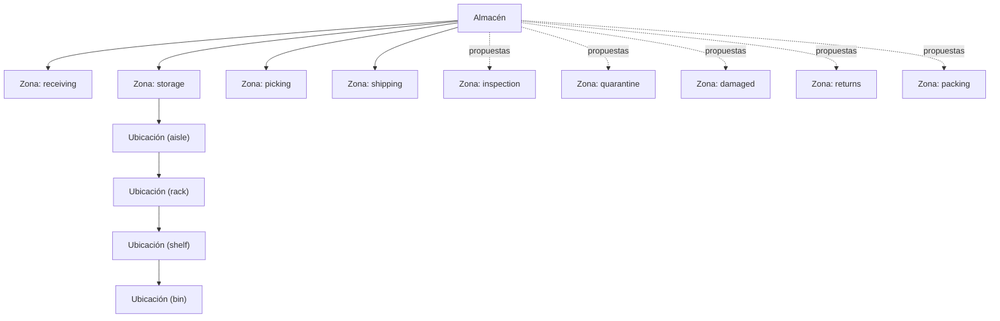
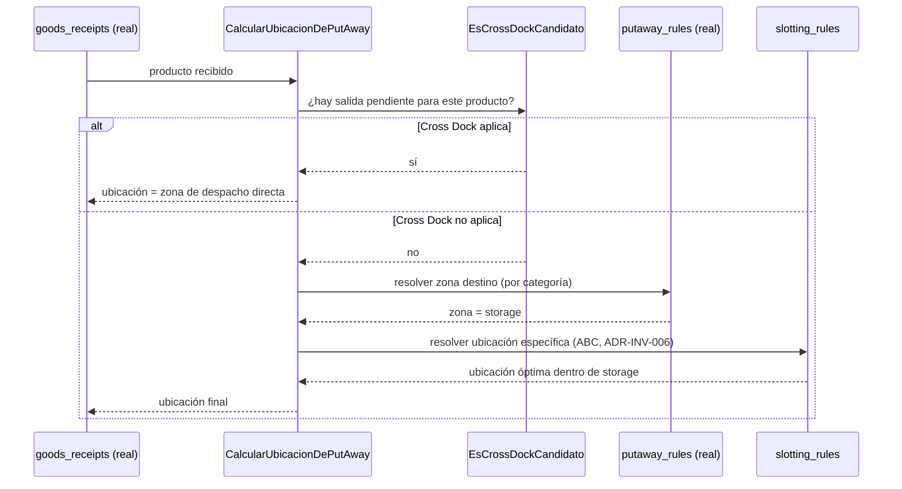
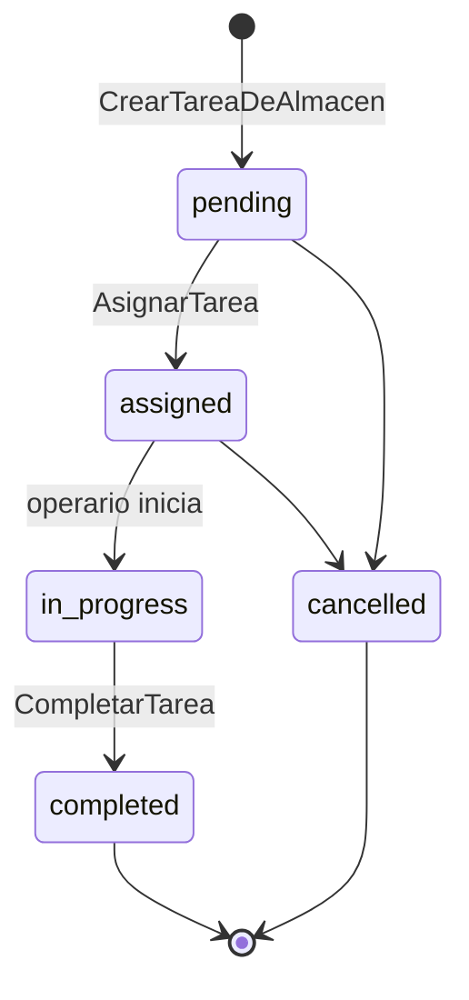

# ADR-INV-007 — Motor de Optimización de Almacenes (Warehouse Optimization Engine)

|                                 |                                                                                                                                                                                |
| ------------------------------- | ------------------------------------------------------------------------------------------------------------------------------------------------------------------------------ |
| **Identificador**               | `ADR-INV-007`                                                                                                                                                                  |
| **Versión**                     | 1.0.0                                                                                                                                                                          |
| **Estado**                      | Propuesta                                                                                                                                                                      |
| **Fecha**                       | 2026-07-28                                                                                                                                                                     |
| **Última revisión**             | 2026-07-28                                                                                                                                                                     |
| **Autor**                       | Principal Software Architect / WMS Architect, GORAZUS ERP Enterprise                                                                                                           |
| **Ámbito**                      | Motor de optimización de almacenes — dominio `inventory`, base para un futuro WMS                                                                                              |
| **ADRs relacionados**           | `ADR-INV-000` a `ADR-INV-006` (toda la serie), `ADR-DB-001` (particionamiento)                                                                                                 |
| **Dominios relacionados**       | Inventory (único — este ADR no cruza a otro schema, a diferencia de `ADR-INV-004/005/006`)                                                                                     |
| **Componentes relacionados**    | `inventory.warehouses`, `inventory.warehouse_zones`, `inventory.warehouse_locations`, `inventory.picking_rules`, `inventory.putaway_rules`, `inventory.cycle_count_schedules`  |
| **Issues relacionados**         | Deuda nueva registrada en §14 de este documento                                                                                                                                |
| **Patrones relacionados (AKB)** | `Append-Only Ledger Pattern`, `Engineering Heuristics`, `Domain Design Heuristics`                                                                                             |
| **Documentos relacionados**     | [[Warehouse]], `ADR-INV-002` (Gestión de Almacenes, fuente original de la jerarquía), `modules/inventario/backend/entities/{almacen,zona-almacen,ubicacion-almacen}.entity.ts` |

Cuarto y último ADR de la serie de motores de Inventario. A diferencia de `ADR-INV-004/005/006`, este
ADR **no cruza a ningún schema ajeno** — todo lo que necesita ya vive en `inventory`. Mismo criterio
de honestidad: cada capacidad se marca **✅ Real**, **🟡 Parcial** o **🔴 Propuesta**, verificado
contra `core/database/prisma/schemas/inventory/schema.prisma` **y** el código real de
`modules/inventario/backend/entities/` (no solo el schema — este ADR es el primero de la serie que
lee las tres entidades de dominio reales completas antes de diseñar).

---

## 1. Propósito y Alcance

GORAZUS ya tiene una jerarquía de almacén real y deliberadamente flexible —
`Almacén → Zona → Ubicación`, con `Ubicación` auto-referenciada sin profundidad fija, exactamente
para representar "pasillo → estante → bin" sin forzar una jerarquía rígida de cuatro niveles fijos
(cita literal del comentario real en `ubicacion-almacen.entity.ts`). Este ADR **no reemplaza** esa
decisión — la extiende con lo que falta para ser la base de un WMS futuro: capacidad física,
clasificación del nivel de jerarquía, tareas de almacén, rutas de picking, y las métricas que un
centro de distribución real necesita. Alcance explícito: **motor de optimización**, no un WMS
completo con hardware RF/RFID real (esa integración queda "future-ready", §3.15, sin implementar).

## 2. Estado Real del Motor de Optimización de Almacenes (verificado — schema y código)

| Capacidad solicitada                           | Estado                                         | Evidencia                                                                                                                                                                                                                        |
| ---------------------------------------------- | ---------------------------------------------- | -------------------------------------------------------------------------------------------------------------------------------------------------------------------------------------------------------------------------------- |
| Warehouse                                      | ✅ Real, con código                            | `warehouses` + `Almacen` (entidad real, `warehouseType ∈ {physical, virtual}`)                                                                                                                                                   |
| Warehouse Zone                                 | ✅ Real, con código                            | `warehouse_zones` + `ZonaAlmacen` (`zoneFunction ∈ {receiving, storage, picking, shipping}` — **4 valores reales, no más**)                                                                                                      |
| Warehouse Area                                 | 🟡 No distinta de Zone                         | El pedido distingue "Zone" de "Area" — en GORAZUS son el mismo concepto (`warehouse_zones`), aclarado en §3.1                                                                                                                    |
| Aisle / Rack / Shelf / Bin                     | 🟡 Estructura real, sin discriminador de nivel | `warehouse_locations.parent_location_id` (auto-referencia real, ya soporta profundidad arbitraria) — **sin columna que diga "esto es un pasillo" vs. "esto es un bin"**                                                          |
| Location Hierarchy                             | ✅ Real                                        | Confirmado arriba — el patrón ya es N-niveles, mismo criterio que `product_categories`                                                                                                                                           |
| Dynamic/Fixed/Overflow Locations               | 🔴 Propuesta                                   | Sin columna de tipo de asignación — §3.3                                                                                                                                                                                         |
| Receiving/Shipping/Picking/Storage Area        | ✅ Real (como `zone_function`)                 | Ídem Zone                                                                                                                                                                                                                        |
| Inspection/Quarantine/Damaged/Returns Area     | 🔴 Propuesta                                   | `zone_function` real no incluye estos 4 — conecta directo con `stock_quality_holds` (`ADR-INV-005 §3.7`), no debería ser solo una zona física sino also un estado lógico — aclarado en §3.4                                      |
| Transit Area                                   | 🟡 Conceptualmente cubierta                    | `stock_transfers.status = 'in_transit'` (`ADR-INV-005 §3.4`) es un estado de transferencia, no una zona física — un almacén origen/destino no necesita una "zona de tránsito" propia salvo que el negocio lo pida explícitamente |
| Packing Area                                   | 🔴 Propuesta                                   | `zone_function` no la incluye — §3.4                                                                                                                                                                                             |
| Dock Management                                | 🔴 Propuesta                                   | Sin tabla — §3.5                                                                                                                                                                                                                 |
| Cross Docking                                  | 🔴 Propuesta                                   | Sin tabla — §3.6                                                                                                                                                                                                                 |
| Put Away Rules                                 | 🟡 Real, sin código de aplicación              | `putaway_rules` (`target_zone_id`, `priority`, `product_category_id` opcional)                                                                                                                                                   |
| Slotting Rules                                 | 🔴 Propuesta                                   | Distinta de Put Away — §3.7                                                                                                                                                                                                      |
| Warehouse/Volume/Weight Capacity               | 🔴 Propuesta                                   | **Ninguna columna de capacidad en ninguna tabla real** (`warehouses`/`warehouse_zones`/`warehouse_locations`) — hallazgo más importante de esta verificación, §3.2                                                               |
| Picking Routes                                 | 🔴 Propuesta                                   | Sin tabla — §3.9                                                                                                                                                                                                                 |
| Wave/Zone/Cluster/Batch Picking                | 🟡 Real parcial                                | `picking_rules.strategy` (texto libre, sin código de aplicación) — no distingue estas 4 estrategias específicamente, aclarado en §3.8                                                                                            |
| FIFO/FEFO/LIFO Picking                         | ✅ Real (a nivel de producto, no de almacén)   | FEFO ya real como regla de negocio (`ADR-INV-001 §6`, lotes por `expiry_date`); FIFO/LIFO ya reales como método de costeo (`ADR-INV-004`) — este ADR los reutiliza para picking, no los rediseña                                 |
| Task Assignment / Warehouse Tasks / Priorities | 🔴 Propuesta                                   | Sin tabla — §3.10                                                                                                                                                                                                                |
| Travel Optimization                            | 🔴 Propuesta                                   | Requiere coordenadas de ubicación, ausentes hoy — §3.11                                                                                                                                                                          |
| Barcode / QR Support                           | ✅ Real (a nivel de producto)                  | `product_barcodes` ya real (`ADR-INV-001 §6`) — reutilizado, no un mecanismo nuevo de almacén                                                                                                                                    |
| RF Device Ready / Future RFID Ready            | 🔴 Propuesta, deliberadamente ligera           | §3.15                                                                                                                                                                                                                            |

**Resumen honesto**: 5 de 25 capacidades ya reales con código, 6 parciales (tabla real sin
aplicación, o concepto cubierto por otro mecanismo ya real), 14 genuinamente nuevas.

## 3. Capacidades — Diseño Completo

### 3.1 Warehouse Zone vs. Warehouse Area — no son dos conceptos

El pedido distingue ambos — en GORAZUS son el mismo `warehouse_zones`. No se introduce una tabla
`warehouse_areas` paralela (mismo criterio de "no fragmentar sin necesidad" ya aplicado en toda la
serie).

### 3.2 Capacidad de Almacén/Zona/Ubicación — diseño nuevo (el hallazgo más importante)

**Hallazgo real**: ni `warehouses` ni `warehouse_zones` ni `warehouse_locations` tienen **ninguna**
columna de capacidad — ni volumen, ni peso, ni cantidad máxima de unidades. Un WMS real no puede
optimizar sin saber cuánto cabe en cada lugar. Se propone extender las tres tablas (no crear tablas
paralelas):

```sql
ALTER TABLE inventory.warehouses ADD COLUMN max_volume_m3 DECIMAL(14,4);
ALTER TABLE inventory.warehouses ADD COLUMN max_weight_kg DECIMAL(14,4);
ALTER TABLE inventory.warehouse_zones ADD COLUMN max_volume_m3 DECIMAL(14,4);
ALTER TABLE inventory.warehouse_zones ADD COLUMN max_weight_kg DECIMAL(14,4);
ALTER TABLE inventory.warehouse_locations ADD COLUMN max_volume_m3 DECIMAL(12,4);
ALTER TABLE inventory.warehouse_locations ADD COLUMN max_weight_kg DECIMAL(12,4);
ALTER TABLE inventory.warehouse_locations ADD COLUMN max_units INTEGER;
```

Todas nulables — un almacén sin capacidad declarada simplemente no participa de la validación de
capacidad (comportamiento actual preservado, extensión opt-in, mismo criterio de compatibilidad
hacia atrás de toda la serie). Cálculo de ocupación: usa `product_physical_attributes`
(`weight_kg`/`volume_m3`, ya real, `ADR-INV-001 §5.1`) × cantidad en `stock` — **sin columna nueva
de ocupación actual**, se calcula (mismo criterio que `Available`, `ADR-INV-005 §4.1`: valor
derivado, nunca denormalizado sin dueño de mantenimiento).

### 3.3 Dynamic, Fixed, Overflow Locations — diseño nuevo

Se propone `location_assignment_type` (columna nueva sobre `warehouse_locations`,
`CHECK IN ('fixed', 'dynamic', 'overflow')`):

- **Fixed**: un producto específico siempre va a esa ubicación (relación opcional
  `preferred_product_id`, propuesta).
- **Dynamic**: cualquier producto puede asignarse según la regla de Put Away vigente (§3.7) —
  comportamiento por defecto, preserva el uso actual sin romper nada.
- **Overflow**: solo se usa cuando las ubicaciones `fixed`/`dynamic` preferidas de un producto ya
  están a capacidad (§3.2) — última opción, nunca la primera elección del algoritmo de Put Away.

### 3.4 Clasificación de Nivel de Ubicación y Zonas Nuevas

**Nivel de ubicación** (Aisle/Rack/Shelf/Bin, §2): se propone `location_level` (columna nueva,
`CHECK IN ('aisle', 'rack', 'shelf', 'bin')`, nulable) sobre `warehouse_locations` — **no** una tabla
por nivel (mismo criterio que Warehouse/Product type: discriminador en la misma tabla, no tablas
paralelas). El auto-referencia ya real (`parent_location_id`) sigue siendo la fuente de la jerarquía;
`location_level` solo la etiqueta para reportes y validación (p. ej. un `bin` no puede tener hijos).

**Zonas nuevas** (`zone_function` extendido, `ADD VALUE` sobre el `CHECK` real, no una tabla nueva):
`inspection`, `quarantine`, `damaged`, `returns`, `packing`. Conectan directamente con
[[Reservation]]/`stock_quality_holds` (`ADR-INV-005 §3.7`) — una zona `quarantine` es el lugar
**físico**, `stock_quality_holds` es el estado **lógico**; ambos deben coexistir (un producto puede
estar físicamente en la zona de cuarentena Y lógicamente retenido — son dos hechos relacionados, no
uno solo).

### 3.5 Dock Management — diseño nuevo

`inventory.warehouse_docks` (propuesta) — un muelle de carga/descarga por almacén, con
`dock_type CHECK IN ('receiving', 'shipping', 'both')` y `is_available` (booleano simple, no un
calendario de reservas completo — sin evidencia de necesidad de negocio para algo más complejo).
`goods_receipts`/`goods_issues` (reales) ganan una columna opcional `dock_id` — extensión, no
ruptura.

### 3.6 Cross Docking — diseño nuevo

Definición: mercadería que entra por recepción y sale directo a despacho **sin pasar por
almacenamiento** — un caso especial de Put Away donde la "ubicación destino" calculada (§3.7) resulta
ser directamente una zona de despacho, no una de almacenamiento. **No requiere tabla nueva** — es una
regla de decisión dentro de `CalcularUbicacionDePutAway` (§4.4): si existe una salida pendiente
(`goods_issues` sin confirmar, `ADR-INV-005 §3.3`) para el mismo producto en cantidad suficiente, se
sugiere cross-dock en vez de una ubicación de almacenamiento normal.

### 3.7 Put Away Rules (ya reales) vs. Slotting Rules (propuesta) — distinción que no existía

`putaway_rules` (real, sin código) resuelve **"¿a qué zona va este producto al recibirse?"** —
`Slotting` es una pregunta distinta y más fina: **"¿a qué ubicación específica, dentro de esa zona,
optimiza mejor el picking futuro?"** (p. ej. productos de alta rotación cerca de la salida). Se
propone `inventory.slotting_rules` (nueva, no confundir con `putaway_rules`):

```text
putaway_rules (real)          →  decide la ZONA (receiving → storage, por categoría)
slotting_rules (propuesto)    →  decide la UBICACIÓN dentro de la zona
                                  (ej: clase A de ADR-INV-006 → ubicaciones más cercanas a picking)
```

Conecta directamente con la clasificación ABC/XYZ ya diseñada (`ADR-INV-006 §3.4-3.6`) — un producto
clase `A` (alto valor, alta rotación) debería slotearse en ubicaciones de menor distancia de viaje
(§3.11), reutilizando la clasificación existente, sin recalcularla.

### 3.8 Wave, Zone, Cluster, Batch Picking — diseño nuevo sobre `picking_rules` real

`picking_rules.strategy` (real, texto libre, sin código) se propone formalizar con
`CHECK IN ('single_order', 'wave', 'zone', 'cluster', 'batch')`:

- **Single Order**: una tarea de picking por pedido — comportamiento implícito actual (sin
  agrupación).
- **Wave**: agrupa N pedidos liberados juntos en un mismo ciclo de picking (`picking_waves`,
  propuesta, Aggregate Root — §4.2).
- **Zone**: cada operario cubre una zona fija, el pedido se divide entre operarios de zonas distintas.
- **Cluster**: un operario recoge varios pedidos simultáneamente en un solo recorrido (requiere
  `WarehouseTask` con múltiples líneas, §3.10).
- **Batch**: agrupa unidades del mismo producto entre varios pedidos antes de separarlas por pedido
  al final (minimiza viajes al mismo lugar).

### 3.9 Picking Routes — diseño nuevo

`ObtenerRutaDePicking(taskId)` (Query, no tabla) — ordena las líneas de una `WarehouseTask` (§3.10)
por la secuencia física de ubicaciones más corta, usando `location_level`/jerarquía (§3.4) como proxy
de proximidad cuando no existen coordenadas reales (§3.11) — determinístico y explicable ("ordenado
por pasillo, luego por estante"), no una optimización de rutas con algoritmo de grafos complejo sin
evidencia de necesidad.

### 3.10 Task Assignment, Warehouse Tasks, Priorities — diseño nuevo (el Aggregate central)

`inventory.warehouse_tasks` (propuesta, Aggregate Root) — unifica Put Away, Picking, Relocation,
Cycle Count en un solo concepto de "tarea de almacén" con `task_type CHECK IN ('putaway', 'picking',
'relocation', 'cycle_count')`, `priority` (reutiliza el mismo patrón de `putaway_rules.priority` ya
real), `assigned_to_user_id`, `status CHECK IN ('pending', 'assigned', 'in_progress', 'completed',
'cancelled')`. Mismo criterio de "una tabla con discriminador en vez de cuatro tablas paralelas" ya
aplicado a `stock_quality_holds` (`ADR-INV-005 §3.7`).

### 3.11 Travel Optimization — diseño nuevo, deliberadamente mínimo

**Sin coordenadas reales** (`x`/`y`/`z` o distancia) en ninguna tabla de ubicación hoy — se propone
`sequence_number` (entero simple sobre `warehouse_locations`, nulable) como proxy determinístico de
orden físico dentro de una zona, en vez de coordenadas cartesianas completas (mismo criterio de "no
construir más de lo que hay evidencia de necesitar" — un almacén pequeño no necesita geometría 3D,
uno grande podría, pero eso es una extensión futura, §3.15, no parte de este ADR).

### 3.12 Receiving, Shipping, Inspection, Packing — flujos, no solo zonas

Cubiertos como Business Rules (§5), reutilizando `goods_receipts`/`goods_issues` (reales) — este ADR
no rediseña la recepción/despacho en sí ([[Movement Engine]] ya los resuelve), solo agrega la
dimensión física de **dónde** ocurren dentro del almacén (dock, zona, tarea).

### 3.13 Blocked Locations

Reutiliza `stock_quality_holds` (`ADR-INV-005 §3.7`) a nivel de ubicación en vez de producto —
extensión: `stock_quality_holds` ya tiene `warehouse_id`, se propone `location_id` opcional para
bloquear una ubicación completa (p. ej. estante dañado), no solo una cantidad de producto específica.

### 3.14 Warehouse Priorities, Warehouse Restrictions

**Priorities**: mismo concepto ya diseñado en `ADR-INV-005 §5` (Warehouse Priority, Branch
Priority) — este ADR no lo rediseña, lo reutiliza para decidir a qué almacén asignar una tarea nueva
cuando varios podrían cumplirla. **Restrictions**: propuesto —
`warehouse_product_restrictions` (nueva, ligera: `warehouse_id`, `product_id`,
`restriction_type CHECK IN ('not_allowed', 'requires_approval')`) — p. ej. un almacén sin cadena de
frío no debería recibir productos que la requieran (`ADR-INV-001` no modela "requiere refrigeración"
todavía — señalado como brecha de `products`, no de este ADR, §14).

### 3.15 RF Device Ready / Future RFID Ready — diseño ligero, future-ready

Sin tabla ni columna — se propone que toda API de este motor (§7) ya devuelva payloads compactos
(solo IDs + códigos, sin datos innecesarios) aptos para un cliente RF de bajo ancho de banda, y que
`WarehouseTask` (§3.10) tenga un campo `confirmation_method` (`CHECK IN ('manual', 'barcode', 'rf',
'rfid')`, nulable, default `manual`) — la infraestructura de hardware RF/RFID en sí queda
explícitamente fuera de alcance (sin evidencia de necesidad de negocio confirmada, mismo criterio ya
aplicado a IA en [[Innovation Report — 2026-07-28]]).

## 4. Diseño DDD

### 4.1 Decisión de diseño — consistente con el criterio ya establecido en la trilogía

`WarehouseTask` (§3.10) es un Aggregate Root **persistido** (igual criterio que `SugerenciaDeCompra`,
`ADR-INV-006 §4.1`: es una decisión/instrucción de trabajo en un momento dado, debe auditarse tal
como se generó). `Capacidad`/`Ocupación` (§3.2) es un **valor calculado**, no persistido (igual
criterio que `DisponibilidadDeInventario`, `ADR-INV-005 §4.1`: siempre recalculable desde `stock` +
`product_physical_attributes` sin pérdida de información).

### 4.2 Aggregates

- **`WarehouseTask`** (nuevo) — unifica Put Away/Picking/Relocation/Cycle Count (§3.10).
- **`PickingWave`** (nuevo) — agrupa N `WarehouseTask` de tipo `picking` liberadas juntas (§3.8).
- **`SlottingRule`** (nuevo) — `slotting_rules` (§3.7).
- **`WarehouseDock`** (nuevo) — `warehouse_docks` (§3.5).
- `Almacen`/`ZonaAlmacen`/`UbicacionAlmacen` (ya reales, sin cambio de Aggregate — solo columnas
  nuevas nulables, §3.2-3.4).

### 4.3 Picking Strategy / Put Away Strategy / Slotting Policy / Capacity Policy

Cuatro Domain Policies nuevas propuestas (`docs/ddd/16_domain_policies.md`, mismo límite de
autorización ya respetado en toda la serie):

- **Picking Strategy (P25 propuesta)**: cuál de las 5 estrategias de §3.8 aplica por almacén —
  configurable, no fija.
- **Put Away Strategy (P26 propuesta)**: formaliza cómo `putaway_rules` (real) + Cross Dock (§3.6)
  - Slotting (§3.7) se combinan en una sola decisión de "dónde va esto que acaba de llegar".
- **Slotting Policy (P27 propuesta)**: cuándo reslotear (recalcular ubicaciones óptimas) — periódico
  vía `background_job`, nunca en cada movimiento individual (mismo criterio de recálculo incremental
  ya usado en `ADR-INV-006 §9`).
- **Capacity Policy (P28 propuesta)**: qué pasa cuando una ubicación excede su capacidad declarada —
  bloquear la asignación (`strict`) vs. permitir con advertencia (`allow_overflow`), mismo patrón de
  dos opciones configurables ya usado para inventario negativo (`ADR-INV-004 §6`).

### 4.4 Domain Services

`CalcularUbicacionDePutAway` (§3.6, §3.7), `CalcularOcupacion` (§3.2), `GenerarOlaDePicking` (§3.8),
`ObtenerRutaDePicking` (§3.9), `AsignarTarea` (§3.10, considera prioridad + carga de trabajo actual
del operario), `ResloteoDeUbicaciones` (§3.7, periódico).

### 4.5 Repositories, Factories, Specifications

`WarehouseTaskRepository`, `PickingWaveRepository`, `SlottingRuleRepository`,
`WarehouseDockRepository` (puertos, mismo patrón real). `WarehouseTaskFactory` (crea la tarea
correcta según `task_type`, mismo patrón que `CapaDeCostoFactory`, `ADR-INV-004 §12.6`).
Specifications: `UbicacionTieneCapacidadDisponible` (§3.2, `Capacity Policy`), `EsCrossDockCandidato`
(§3.6).

### 4.6 Commands / Queries / Application Services

- Comandos: `CrearTareaDeAlmacen`, `AsignarTarea`, `CompletarTarea`, `LiberarOlaDePicking`,
  `ResloteoDeUbicaciones` (bulk, background).
- Consultas: `ObtenerTareasPendientes(warehouseId, userId?)`, `ObtenerOcupacion(warehouseId | zoneId
| locationId)`, `ObtenerRutaDePicking(taskId)`, `ObtenerCandidatosDeSlotting`.

### 4.7 Domain Events

`TareaDeAlmacenCreada`, `TareaDeAlmacenAsignada`, `TareaDeAlmacenCompletada`,
`OlaDePickingLiberada`, `UbicacionResloteada`, `CapacidadExcedida` (cuando `Capacity Policy` en modo
`allow_overflow` permite una asignación sobre el límite — señal de alerta, no de bloqueo). Mismo
estado honesto que el resto de la serie: diseñados, no publicados hasta que exista código real.

## 5. Reglas de Negocio

| Operación              | Regla                                                                                                                                                                                                                                                                                                          |
| ---------------------- | -------------------------------------------------------------------------------------------------------------------------------------------------------------------------------------------------------------------------------------------------------------------------------------------------------------- |
| Receiving              | `goods_receipts` (real) + `dock_id` opcional (§3.5) — sin cambio al flujo transaccional ya real                                                                                                                                                                                                                |
| Put Away               | `CalcularUbicacionDePutAway` evalúa Cross Dock (§3.6) primero, luego `putaway_rules` real, luego Slotting (§3.7) como desempate entre ubicaciones candidatas dentro de la zona resuelta                                                                                                                        |
| Relocation             | Nueva `WarehouseTask` tipo `relocation` — mueve stock entre ubicaciones del mismo almacén, distinta de `stock_transfers` (que es entre almacenes)                                                                                                                                                              |
| Picking                | Respeta FIFO/FEFO/LIFO ya real a nivel de producto (`ADR-INV-001`/`ADR-INV-004`) — la estrategia de picking (§3.8) decide **cómo se agrupan** las tareas, nunca **qué unidad física** se toma primero                                                                                                          |
| Packing                | Nueva zona `packing` (§3.4) — sin regla de negocio adicional más allá de la ubicación física, empaque en sí es responsabilidad de `sales`/`pos`, fuera de este dominio                                                                                                                                         |
| Shipping               | `goods_issues` (real) + `dock_id` opcional (§3.5)                                                                                                                                                                                                                                                              |
| Transfers              | Ya real ([[Warehouse]], `ADR-INV-005 §3.4`) — sin cambio                                                                                                                                                                                                                                                       |
| Returns                | Nueva zona `returns` (§3.4) como destino físico — conecta con `Inspection` lógica ya diseñada (`ADR-INV-005 §3.9`)                                                                                                                                                                                             |
| Cross Dock             | §3.6 — regla de decisión dentro de Put Away, no un flujo separado                                                                                                                                                                                                                                              |
| Cycle Count            | Ya real (`cycle_count_schedules`, `BR-10`) — se propone que genere una `WarehouseTask` tipo `cycle_count` en vez de operar fuera del sistema de tareas (unifica, no duplica)                                                                                                                                   |
| Blocked Locations      | §3.13 — reutiliza `stock_quality_holds` extendido                                                                                                                                                                                                                                                              |
| Location Capacity      | `Capacity Policy` (§4.3, P28) — `strict` por defecto, `allow_overflow` configurable                                                                                                                                                                                                                            |
| Warehouse Priorities   | Reutiliza `ADR-INV-005 §5`, no se rediseña                                                                                                                                                                                                                                                                     |
| Warehouse Restrictions | §3.14 — nueva tabla ligera                                                                                                                                                                                                                                                                                     |
| Travel Optimization    | `sequence_number` determinístico (§3.11), nunca un algoritmo de optimización de grafos sin evidencia de necesidad                                                                                                                                                                                              |
| Task Assignment        | `AsignarTarea` considera prioridad (§3.10) + carga de trabajo actual del operario — determinístico, auditable (`reasoning` no requerido aquí como en `ADR-INV-006`, porque la lógica es suficientemente simple para ser autoexplicativa: "el operario con menos tareas pendientes de la zona correspondiente") |

## 6. Diseño de Base de Datos

### 6.1 Tablas nuevas

```sql
CREATE TABLE inventory.warehouse_tasks (
    id                    UUID   NOT NULL DEFAULT gen_random_uuid(),
    warehouse_id          UUID   NOT NULL REFERENCES inventory.warehouses(id),
    task_type             TEXT   NOT NULL, -- 'putaway'|'picking'|'relocation'|'cycle_count'
    source_location_id    UUID   REFERENCES inventory.warehouse_locations(id),
    target_location_id    UUID   REFERENCES inventory.warehouse_locations(id),
    product_id            UUID   REFERENCES products.products(id),
    quantity              DECIMAL(18,6),
    priority              SMALLINT NOT NULL DEFAULT 0,
    assigned_to_user_id   UUID   REFERENCES core.users(id),
    status                TEXT   NOT NULL DEFAULT 'pending',
    confirmation_method   TEXT   DEFAULT 'manual', -- 'manual'|'barcode'|'rf'|'rfid'
    picking_wave_id       UUID,
    PRIMARY KEY (id)
);

CREATE TABLE inventory.picking_waves (
    id                UUID   NOT NULL DEFAULT gen_random_uuid(),
    warehouse_id      UUID   NOT NULL REFERENCES inventory.warehouses(id),
    status            TEXT   NOT NULL DEFAULT 'open', -- 'open'|'released'|'completed'
    released_at       TIMESTAMPTZ,
    PRIMARY KEY (id)
);

CREATE TABLE inventory.slotting_rules (
    id                    UUID   NOT NULL DEFAULT gen_random_uuid(),
    warehouse_id          UUID   NOT NULL REFERENCES inventory.warehouses(id),
    abc_class             TEXT,  -- referencia conceptual a product_abc_classifications (ADR-INV-006)
    target_location_level TEXT,  -- 'aisle'|'rack'|'shelf'|'bin'
    max_distance_rank     SMALLINT, -- posición máxima aceptable de sequence_number
    PRIMARY KEY (id)
);

CREATE TABLE inventory.warehouse_docks (
    id             UUID   NOT NULL DEFAULT gen_random_uuid(),
    warehouse_id   UUID   NOT NULL REFERENCES inventory.warehouses(id),
    code           TEXT   NOT NULL,
    dock_type      TEXT   NOT NULL, -- 'receiving'|'shipping'|'both'
    is_available   BOOLEAN NOT NULL DEFAULT true,
    PRIMARY KEY (id)
);

CREATE TABLE inventory.warehouse_product_restrictions (
    id                UUID NOT NULL DEFAULT gen_random_uuid(),
    warehouse_id      UUID NOT NULL REFERENCES inventory.warehouses(id),
    product_id        UUID NOT NULL REFERENCES products.products(id),
    restriction_type  TEXT NOT NULL, -- 'not_allowed'|'requires_approval'
    PRIMARY KEY (id)
);

-- Extensión de tablas reales (no tablas nuevas)
ALTER TABLE inventory.warehouses ADD COLUMN max_volume_m3 DECIMAL(14,4);
ALTER TABLE inventory.warehouses ADD COLUMN max_weight_kg DECIMAL(14,4);
ALTER TABLE inventory.warehouse_zones ADD COLUMN max_volume_m3 DECIMAL(14,4);
ALTER TABLE inventory.warehouse_zones ADD COLUMN max_weight_kg DECIMAL(14,4);
ALTER TABLE inventory.warehouse_locations ADD COLUMN max_volume_m3 DECIMAL(12,4);
ALTER TABLE inventory.warehouse_locations ADD COLUMN max_weight_kg DECIMAL(12,4);
ALTER TABLE inventory.warehouse_locations ADD COLUMN max_units INTEGER;
ALTER TABLE inventory.warehouse_locations ADD COLUMN location_assignment_type TEXT DEFAULT 'dynamic';
ALTER TABLE inventory.warehouse_locations ADD COLUMN location_level TEXT;
ALTER TABLE inventory.warehouse_locations ADD COLUMN sequence_number INTEGER;
```

### 6.2 Índices, Vistas

`BTree (warehouse_id, status)` en `warehouse_tasks` (consulta dominante: tareas pendientes de un
almacén). Índice parcial `WHERE status = 'pending'` (mismo patrón de 828 parciales ya certificados).
Vista `inventory.v_warehouse_occupancy` — ocupación calculada por almacén/zona/ubicación (§3.2),
derivada, sin mantenimiento.

### 6.3 Partición, Concurrencia

`warehouse_tasks` **no** particionada — crece con el volumen de operación diaria, pero las tareas
`completed`/`cancelled` antiguas son candidatas reales a archivado por antigüedad (a diferencia de
`purchase_suggestions`, `ADR-INV-006 §6.3`, que se mantienen indefinidamente por auditoría de
decisión) — se recomienda evaluar partición `RANGE` mensual **si** el volumen real lo justifica
después de medir (mismo criterio de "no particionar preventivamente", `ADR-DB-001 §2.1`).
Concurrencia: `AsignarTarea`/`CompletarTarea` siguen el orden determinístico ya real
(`ADR-INF-001 §4`) — una tarea de almacén opera sobre `Location`, ya presente en esa cadena de
bloqueo.

## 7. Diseño de API

- `GET /almacenes/tareas?warehouseId=&status=pending&assignedToUserId=`.
- `POST /almacenes/tareas/{id}/asignar` / `.../completar`.
- `POST /almacenes/olas-picking` / `.../{id}/liberar`.
- `GET /almacenes/{id}/ocupacion` (§3.2, `v_warehouse_occupancy`).
- `GET /almacenes/tareas/{id}/ruta` (§3.9, `ObtenerRutaDePicking`).
- `POST /almacenes/reslotting` (bulk, background job).
- `GET /almacenes/muelles?warehouseId=`.
- `GET /almacenes/{id}/metricas` (§10, KPIs).

Formato/estándares heredados (`API Standards`). Permisos nuevos:
`inventario.gestionar_tareas_almacen`, `inventario.gestionar_slotting`.

## 8. Seguridad

RBAC con permiso de asignación de tareas separado del de solo consulta. RLS heredado, misma brecha
conocida de `branch`/`warehouse` sin cobertura (`ISSUE-02`) — igual que el resto de la trilogía.
Auditoría universal heredada sobre las 5 tablas nuevas.

## 9. Rendimiento y Escalabilidad

`GenerarOlaDePicking`/`ResloteoDeUbicaciones` como `background_job`s (mismo criterio que
`ADR-INV-004/005/006`). Redis: cache de `ObtenerTareasPendientes` de alta consulta (dashboards de
operarios), TTL corto. Escalado horizontal: sin cambio necesario, mismas garantías ya reales de `api`.

## 10. Analítica y KPIs

| KPI                            | Fórmula                                                                                                                                                                             |
| ------------------------------ | ----------------------------------------------------------------------------------------------------------------------------------------------------------------------------------- |
| Warehouse Occupancy            | `SUM(volumen ocupado) / max_volume_m3` (§3.2)                                                                                                                                       |
| Location Utilization           | % de ubicaciones con `stock` activo sobre el total                                                                                                                                  |
| Picking Efficiency             | Líneas completadas / hora por operario (`warehouse_tasks` tipo `picking`)                                                                                                           |
| Packing Efficiency             | Fuera del alcance directo de este motor — depende de `sales`/`pos`, referenciado no calculado aquí                                                                                  |
| Travel Distance                | Suma de diferencias de `sequence_number` (§3.11) recorridas por tarea — proxy determinístico, no distancia real sin coordenadas                                                     |
| Warehouse Productivity         | Tareas completadas / tareas creadas, por período                                                                                                                                    |
| Receiving/Shipping Performance | Tiempo entre `goods_receipts`/`goods_issues` creado y confirmado                                                                                                                    |
| Task Completion Rate           | % de `warehouse_tasks` completadas dentro de un SLA configurable                                                                                                                    |
| Warehouse Health Score         | Compuesto: `w1×Occupancy_normalizada + w2×Task Completion Rate + w3×(1−tasas de excepción de Capacity Policy, §4.7)` — mismo criterio de fórmula transparente que `ADR-INV-006 §10` |

## 11. Diagramas

### 11.1 Jerarquía de Almacén y Ubicación



### 11.2 Flujo de Put Away con Cross Dock



### 11.3 Ciclo de Vida de una Tarea de Almacén



## 12. Quality Gate — Verificación de Consistencia

- **DDD/Clean/Hexagonal**: `WarehouseTask` sigue el mismo patrón Aggregate+Repository+Factory ya
  validado; `Almacen`/`ZonaAlmacen`/`UbicacionAlmacen` reales **no se tocan** como entidades, solo
  ganan columnas nulables.
- **Consistencia con Disponibilidad (`ADR-INV-005`)**: `Capacity Policy` (§4.3) es un concepto
  distinto de `Available` — capacidad física vs. cantidad comprometida — verificado que no se
  solapan ni se recalculan entre sí.
- **Consistencia con Costeo (`ADR-INV-004`)**: sin intersección directa — este motor no toca costo.
- **Consistencia con Reabastecimiento (`ADR-INV-006`)**: `Slotting Rules` (§3.7) **consume**
  `abc_class`/`xyz_class` ya diseñados, nunca reclasifica por su cuenta.
- **Consistencia con `ADR-DB-001`**: `warehouse_tasks` explícitamente no particionada por defecto,
  con la misma justificación de "crece con entidades activas, no con tiempo puro" ya usada para
  `purchase_suggestions`.
- **Sin lógica duplicada**: verificado que picking respeta FIFO/FEFO/LIFO ya reales sin
  reimplementarlos (§5).

## 13. Riesgos, Alternativas Consideradas

| Riesgo                                                                                         | Severidad | Mitigación                                                                                                                                                   |
| ---------------------------------------------------------------------------------------------- | --------- | ------------------------------------------------------------------------------------------------------------------------------------------------------------ |
| Capacidad nunca poblada por ningún usuario, quedando la validación siempre inactiva            | Baja      | Columnas nulables — `Capacity Policy` en modo `strict` solo bloquea si hay un valor declarado; comportamiento actual (sin capacidad) se preserva exactamente |
| `location_level`/`location_assignment_type` como texto libre sin migración de datos existentes | Baja      | Nulables, sin romper ubicaciones ya creadas                                                                                                                  |
| Cross Dock mal configurado genera envíos directos no deseados                                  | Media     | Requiere que exista una salida pendiente real y confirmada del mismo producto — no es una heurística especulativa, es una coincidencia de datos ya reales    |

**Alternativas descartadas**:

- **Tablas separadas por nivel de ubicación** (`aisles`, `racks`, `shelves`, `bins`). Descartada
  explícitamente — rompería la jerarquía auto-referenciada real ya elegida deliberadamente
  (`ubicacion-almacen.entity.ts`, cita literal: "sin fijar una profundidad rígida").
- **Coordenadas cartesianas completas (x/y/z) para optimización de rutas real**. Descartada por
  ahora — sin evidencia de que un algoritmo de optimización de grafos sea necesario antes que un
  proxy simple de secuencia (§3.11); candidato de extensión futura, no de este ADR.
- **Cuatro tablas separadas para las zonas nuevas** (inspection/quarantine/damaged/returns/packing)
  en vez de extender el `CHECK` de `zone_function`. Descartada — mismo criterio de simplificación ya
  aplicado repetidamente en la serie.

## 14. Consecuencias y Deuda Registrada

- Todo flujo de recepción/picking futuro debe consumir `CalcularUbicacionDePutAway`/
  `AsignarTarea` — mismo principio de fuente única ya establecido en `ADR-INV-005 §12`/
  `ADR-INV-006 §14`.
- `products.products` no modela "requiere refrigeración"/condiciones especiales de almacenamiento —
  brecha real identificada en §3.14, fuera del alcance de este ADR (pertenece a `ADR-INV-001`, no se
  corrige aquí sin autorización de reabrir ese documento).
- Las cuatro Domain Policies propuestas (P25-P28) y los cinco Aggregates nuevos requieren
  autorización de edición de `docs/ddd/` para formalizarse fuera de este ADR, mismo límite ya
  respetado en toda la serie.

---

## Alternativas Consideradas

Ver §13.

## Consecuencias

Ver §14.
