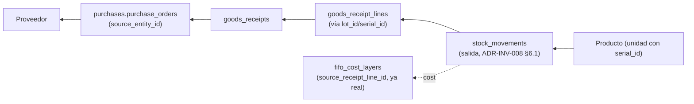
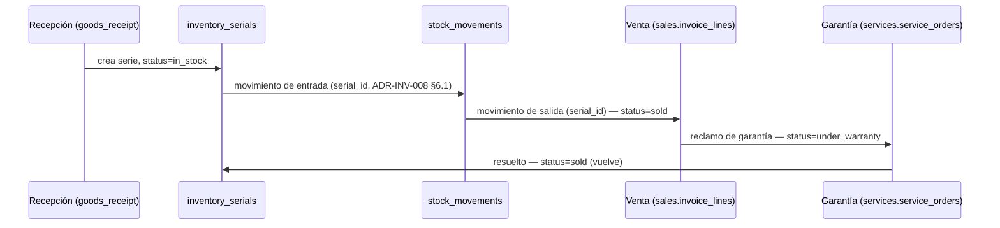
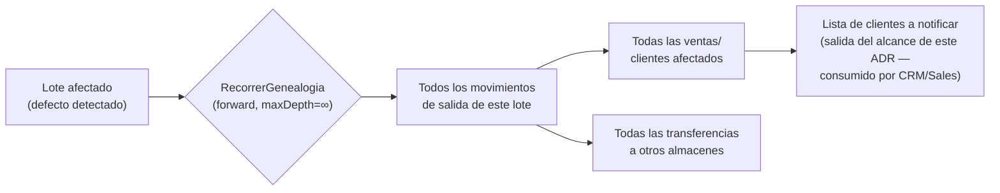

# ADR-INV-008 — Motor de Trazabilidad de Inventario (Inventory Traceability Engine)

|                                 |                                                                                                                                                                                                      |
| ------------------------------- | ---------------------------------------------------------------------------------------------------------------------------------------------------------------------------------------------------- |
| **Identificador**               | `ADR-INV-008`                                                                                                                                                                                        |
| **Versión**                     | 1.0.0                                                                                                                                                                                                |
| **Estado**                      | Propuesta                                                                                                                                                                                            |
| **Fecha**                       | 2026-07-28                                                                                                                                                                                           |
| **Última revisión**             | 2026-07-28                                                                                                                                                                                           |
| **Autor**                       | Principal Software Architect / Traceability Specialist, GORAZUS ERP Enterprise                                                                                                                       |
| **Ámbito**                      | Motor de trazabilidad — dominio `inventory`, capa de consulta sobre los cinco motores ya diseñados                                                                                                   |
| **ADRs relacionados**           | `ADR-INV-000` a `ADR-INV-007` (toda la serie), `ADR-DB-001` (particionamiento, auditoría)                                                                                                            |
| **Dominios relacionados**       | Inventory, Products, Purchases, Sales, Accounting (por referencia, sin cruzar escritura)                                                                                                             |
| **Componentes relacionados**    | `inventory.stock_movements`, `inventory.inventory_lots`, `inventory.inventory_serials`, `inventory.fifo_cost_layers`, `core.audit_logs`, todo `source_module`/`source_entity_id` polimórfico ya real |
| **Issues relacionados**         | Refuerza `ISSUE-01` (I4) indirectamente — la brecha de trazabilidad física es la misma raíz que la invariante Lote XOR Serie sin enforcement                                                         |
| **Patrones relacionados (AKB)** | `Append-Only Ledger Pattern`, `Engineering Heuristics`, `Domain Design Heuristics`, `Asserted-but-Unenforced Invariant (Anti-Pattern)`                                                               |
| **Documentos relacionados**     | [[Movement Engine]] (hallazgo central ya documentado: "ningún movimiento carga `lot_id`/`serial_id`"), `ADR-INV-002 §10.1`, [[Cost Engine]]                                                          |

Quinto ADR de la serie de motores de Inventario — a diferencia de los cuatro anteriores, este **no
introduce un nuevo motor de decisión**: es la **capa de consulta unificada** sobre los cuatro motores
ya diseñados (`ADR-INV-004` Costeo, `ADR-INV-005` Disponibilidad, `ADR-INV-006` Reabastecimiento,
`ADR-INV-007` Almacenes) más [[Movement Engine]] y la auditoría universal real. Mismo criterio de
honestidad: cada capacidad se marca **✅ Real**, **🟡 Parcial** o **🔴 Propuesta**.

---

## 1. Propósito y Alcance

**Decisión de diseño fundacional, antes que cualquier otra cosa**: de las 25 "genealogías" pedidas
en el prompt original (producto, lote, serie, batch, capa de costo, inventario, documento, proveedor,
cliente, transferencia, almacén, sucursal, empresa, movimiento, reserva, asignación, disponibilidad,
ajuste, conteo cíclico, producción, devolución, recall, calidad, auditoría), **ninguna es un
mecanismo distinto** — todas son **el mismo grafo de referencias ya real** (`source_module`/
`source_entity_id` polimórfico + FK directas + auditoría universal), recorrido desde un punto de
entrada distinto. Diseñar 25 motores de genealogía sería la violación más directa posible de la
Regla Empresarial del propio pedido ("No module may implement traceability independently") —
aplicada aquí a nivel de diseño interno, no solo entre módulos. Este ADR diseña **un** motor con
**25 puntos de entrada** (§4.9), no 25 motores.

## 2. Estado Real del Motor de Trazabilidad (verificado — el hallazgo ya lo tenía el AKB)

**No es un hallazgo nuevo de este ADR** — [[Movement Engine]] ya lo documentó explícitamente durante
la fase de conocimiento reutilizable de esta sesión: _"ningún movimiento carga `lot_id`/`serial_id` —
la trazabilidad real hoy es de costo (vía [[Cost Engine]]), no de unidad física"_. Este ADR **hereda
y cierra** ese hallazgo en vez de descubrirlo de nuevo, verificado aquí directamente contra
`stock_movements` (schema completo leído: `product_id`, `warehouse_id`, `movement_type_id`,
`quantity`, `unit_cost`, `source_module`, `source_entity_id` — sin `lot_id`, `serial_id`, ni
`location_id`).

| Capacidad de genealogía                | Estado                                          | Mecanismo real subyacente                                                                                                                               |
| -------------------------------------- | ----------------------------------------------- | ------------------------------------------------------------------------------------------------------------------------------------------------------- |
| Movement genealogy                     | ✅ Real                                         | [[Movement Engine]] (`stock_movements`, ledger append-only, `ADR-DB-001`)                                                                               |
| Cost layer genealogy                   | ✅ Real (FIFO) / 🟡 Parcial (LIFO)              | `fifo_cost_layers.source_receipt_line_id` real; `lifo_cost_layers` sin esa columna (`ADR-INV-004 §3.2`, ya señalado)                                    |
| Document genealogy                     | ✅ Real                                         | `source_module`/`source_entity_id` polimórfico, ya el patrón dominante de todo `inventory`                                                              |
| Audit genealogy                        | ✅ Real                                         | `core.audit_logs`, universal e inmutable, 494 tablas                                                                                                    |
| Supplier / Customer genealogy          | 🟡 Derivable, cruza dominio ajeno               | Vía `goods_receipts.source_entity_id` → `purchases.purchase_orders` → proveedor; vía `sales.invoice_lines` → cliente — lectura, nunca escritura cruzada |
| Warehouse / Branch / Company genealogy | ✅ Real                                         | `warehouse_id`/`branch_id`/`company_id` ya presentes en toda tabla de negocio, RLS universal                                                            |
| Transfer genealogy                     | ✅ Real                                         | `stock_transfers` (`ADR-INV-005 §3.4`)                                                                                                                  |
| Reservation / Allocation genealogy     | ✅ Real (Reservation) / 🟡 Parcial (Allocation) | [[Reservation]] real; `Allocated`/`Committed` propuestos en `ADR-INV-005 §3.2`, sin código                                                              |
| Availability genealogy                 | 🟡 Parcial                                      | `availability_snapshots` (propuesta, `ADR-INV-005 §4.3`) sería la fuente histórica — sin implementar                                                    |
| Inventory adjustment genealogy         | ✅ Real                                         | `stock_adjustments`/`stock_adjustment_lines`, `BR-09`                                                                                                   |
| Cycle count genealogy                  | ✅ Real                                         | `physical_counts`/`physical_count_lines`, `BR-10`                                                                                                       |
| Production genealogy                   | 🟡 Real parcial                                 | `production_orders`/`production_order_components`/`production_order_outputs` reales, sin conexión de genealogía formal a `stock_movements` todavía      |
| Return genealogy                       | 🔴 Propuesto                                    | `sales.sales_returns` real (schema ajeno) sin conexión a `inventory` (`ADR-INV-005 §3.9`, ya señalado)                                                  |
| Recall genealogy                       | 🔴 Propuesto                                    | Sin evidencia de tabla ni concepto — se diseña como Query, no como tabla (§4.9)                                                                         |
| Quality genealogy                      | ✅ Real (si `ADR-INV-005` se implementa)        | `stock_quality_holds` (propuesta, `ADR-INV-005 §3.7`)                                                                                                   |
| **Lot genealogy**                      | 🔴 **La brecha central**                        | `inventory_lots` real, **pero `stock_movements` no referencia `lot_id`** — sin esta columna, no hay genealogía física real, solo de costo               |
| **Serial genealogy**                   | 🔴 **La brecha central**                        | `inventory_serials` real (con ciclo de vida propio, `ADR-INV-001 §7`), **mismo problema**: `stock_movements` no referencia `serial_id`                  |
| Batch genealogy                        | 🟡 Mismo concepto que Lot                       | El pedido distingue "Batch" de "Lot" — en GORAZUS son el mismo concepto (`inventory_lots`), aclarado en §3.1                                            |
| Product genealogy                      | ✅ Real (como consecuencia de las anteriores)   | Se deriva de `product_id` en cada tabla — no requiere mecanismo propio                                                                                  |
| Inventory genealogy                    | ✅ Real (consecuencia)                          | Igual que Product — es el resultado agregado de todas las anteriores                                                                                    |

**Resumen honesto**: de 19 tipos de genealogía distintos (colapsando duplicados como Batch=Lot,
Product/Inventory=derivados), 10 ya reales, 5 parciales, 4 requieren diseño nuevo — pero **la brecha
más importante no es "cuántos tipos faltan"**, es que la genealogía física (Lote/Serie) sobre el
propio ledger de movimientos no existe todavía, y sin ella ninguna de las genealogías físicas es
realmente completa, solo aproximada vía costo.

## 3. Aclaraciones de Nomenclatura

### 3.1 Batch = Lot, no dos conceptos

Mismo criterio que "Weighted Average = Moving Average" ya aclarado en `ADR-INV-004 §3.3`. GORAZUS
certifica `inventory_lots`, no una tabla `batches` separada.

### 3.2 Genealogía vs. Auditoría — dos preguntas relacionadas, no idénticas

**Auditoría** (`core.audit_logs`, real) responde _"¿quién cambió qué campo, cuándo?"_ — un log de
cambios de datos. **Genealogía** responde _"¿de dónde vino esta unidad física/este costo/este
documento, y a dónde fue?"_ — un grafo de relaciones de negocio, no de cambios de campos. Ambas son
reales y ambas alimentan la Línea de Tiempo (§4.3), pero resuelven preguntas distintas — un cambio de
`observations` en una factura genera una fila de auditoría sin ser un evento de genealogía relevante.

## 4. Diseño DDD

### 4.1 Decisión de diseño central — la Genealogía es un Grafo de Consulta, nunca una escritura nueva

**Ningún dato de este ADR se escribe dos veces.** El motor de trazabilidad **lee** de las tablas ya
reales (`stock_movements`, `fifo_cost_layers`, `stock_adjustments`, `stock_transfers`,
`physical_counts`, `core.audit_logs`, y las nuevas de `ADR-INV-004/005/006/007`) — nunca copia su
contenido a una tabla de genealogía propia. Es la aplicación más estricta hasta ahora del principio
de fuente única ya establecido (`ADR-INV-005 §12`, `ADR-INV-006 §14`): un motor de trazabilidad que
mantuviera su propia copia de los datos sería, literalmente, una segunda fuente de verdad de todo lo
que los otros cuatro motores ya producen — el peor caso posible de duplicación que la Regla
Empresarial de este mismo prompt prohíbe explícitamente.

### 4.2 Traceability Aggregate — no existe como tal

No hay un Aggregate Root "Trazabilidad" — sería, otra vez, una escritura paralela. Lo que sí existe:

- **`EslabonDeGenealogia`** (`GenealogyLink`, Aggregate Root nuevo, **el único dato nuevo que este
  ADR persiste**) — una fila ligera que declara una relación causal entre dos entidades cuando esa
  relación **no** es ya derivable de una FK o de `source_module`/`source_entity_id` (p. ej. la
  relación "esta unidad de producto terminado consumió estas unidades de materia prima", vía
  `production_order_components`/`production_order_outputs`, que hoy son dos tablas sin una relación
  N:M explícita entre sí). Se usa **solo** donde la relación no es ya reconstruible desde datos
  existentes — no una copia general de todo el grafo.

### 4.3 Traceability Timeline (Timeline Builder)

`ConstruirLineaDeTiempo(entityType, entityId)` — Domain Service (no Aggregate) que recorre el grafo
en ambas direcciones (hacia atrás: "¿de dónde vino?"; hacia adelante: "¿a dónde fue?") desde cualquier
punto de entrada (§4.9) y devuelve una secuencia ordenada de eventos — un **Value Object calculado**,
mismo criterio que `DisponibilidadDeInventario` (`ADR-INV-005 §4.1`): siempre reconstruible desde el
origen, nunca materializado como fuente de verdad (aunque sí cacheable, §4.4, para rendimiento).

### 4.4 Genealogy Service / Traceability Service

`RecorrerGenealogia(entityType, entityId, direction: 'backward' | 'forward', maxDepth)` — el Domain
Service central de este ADR. `direction='backward'` responde "¿de dónde vino esto?" (§5, preguntas
de origen); `forward` responde "¿a dónde fue esto?" (§5, preguntas de impacto/recall). `maxDepth`
existe porque un grafo de genealogía en un ERP con 15+ años de historia (`ADR-DB-001 §1`) podría, en
teoría, no tener límite natural — se acota explícitamente, nunca se recorre "todo" sin un límite
declarado.

**Cache, no autoritativo**: `traceability_snapshots` (propuesta) — igual patrón que
`availability_snapshots` (`ADR-INV-005 §4.3`): resultado de un recorrido reciente, cacheado para
consultas repetidas de alto volumen (p. ej. "genealogía del lote X" consultada muchas veces durante
una investigación de calidad), nunca la fuente de verdad — cualquier discrepancia con el grafo real
se resuelve siempre a favor del grafo, nunca del cache.

### 4.5 Point-in-Time Reconstruction

`ReconstruirEnPuntoDelTiempo(entityType, entityId, fecha)` — responde _"¿cómo se veía esto en esta
fecha específica?"_ filtrando el recorrido de §4.4 a eventos con `created_at ≤ fecha` — no requiere
mecanismo nuevo, es un parámetro adicional sobre el mismo Domain Service, posible **porque** todas
las tablas de origen son ledgers append-only o snapshots con fecha ([[Append-Only Ledger Pattern]]) —
si alguna tabla de origen permitiera `UPDATE` in-place, esta reconstrucción sería imposible de
confiar. Es la validación más fuerte hasta ahora de por qué ese patrón importa.

### 4.6 Repositories, Factories, Specifications

`EslabonDeGenealogiaRepository` (el único repositorio de escritura nueva, §4.2).
`TraceabilitySnapshotRepository` (cache, §4.4). Sin Factory nueva más allá de
`EslabonDeGenealogiaFactory`. Specifications: `TieneGenealogiaCompleta` (§10, KPI de completitud —
verifica si una entidad tiene todos los eslabones esperados según su tipo, p. ej. un lote sin ninguna
capa FIFO asociada indicaría una brecha real de datos).

### 4.7 Policies

Una nueva propuesta (`docs/ddd/16_domain_policies.md`, mismo límite de autorización):

- **Retention & Sensitive Data Policy (P29 propuesta)**: qué campos de la línea de tiempo son
  visibles según el rol de quien consulta (§8) — un operario de almacén no necesariamente debe ver
  el costo unitario de cada capa en una consulta de genealogía física, aunque el dato exista.

### 4.8 Domain Events

`EslabonDeGenealogiaCreado`, `ReconstruccionSolicitada` (auditable en sí misma — quién pidió
reconstruir qué historia, relevante para una investigación de calidad o auditoría externa). Mismo
estado honesto que toda la serie: diseñados, no publicados sin código real.

### 4.9 Los 25 puntos de entrada — un solo motor, no 25

| Punto de entrada solicitado              | Se resuelve como                                                                                                                                                                                                                                                 |
| ---------------------------------------- | ---------------------------------------------------------------------------------------------------------------------------------------------------------------------------------------------------------------------------------------------------------------- |
| Product / Lot / Serial / Batch genealogy | `RecorrerGenealogia('product'\|'lot'\|'serial', id, 'backward')`                                                                                                                                                                                                 |
| Cost layer genealogy                     | `RecorrerGenealogia('cost_layer', id, 'backward')` — usa `source_receipt_line_id` real (FIFO)                                                                                                                                                                    |
| Inventory / Document genealogy           | `RecorrerGenealogia('stock_movement'\|'document', id, ambas direcciones)`                                                                                                                                                                                        |
| Supplier / Customer genealogy            | `RecorrerGenealogia('supplier'\|'customer', id, 'forward')` — cruza a `purchases`/`sales` por lectura                                                                                                                                                            |
| Transfer / Movement genealogy            | Ya cubierto por [[Movement Engine]] directamente, sin capa adicional                                                                                                                                                                                             |
| Warehouse / Branch / Company genealogy   | Filtro de alcance sobre cualquier recorrido, no un tipo de recorrido propio                                                                                                                                                                                      |
| Reservation / Allocation genealogy       | `RecorrerGenealogia('reservation', id, ambas)`                                                                                                                                                                                                                   |
| Availability genealogy                   | Lee `traceability_snapshots` de `availability_snapshots` cuando exista (`ADR-INV-005`)                                                                                                                                                                           |
| Adjustment / Cycle count genealogy       | `RecorrerGenealogia('adjustment'\|'cycle_count', id, 'backward')`                                                                                                                                                                                                |
| Production genealogy                     | `RecorrerGenealogia('production_order', id, ambas)` — usa `EslabonDeGenealogia` (§4.2) para la relación componente↔salida que hoy no es una FK directa                                                                                                           |
| Return genealogy                         | `RecorrerGenealogia('sales_return', id, 'backward')` — cuando `ADR-INV-005 §3.9` se implemente                                                                                                                                                                   |
| **Recall genealogy**                     | `RecorrerGenealogia('lot'\|'serial', id, 'forward', maxDepth=∞)` — un recall es, exactamente, "¿a dónde fue todo lo que salió de este lote/serie?" — **no requiere ningún mecanismo nuevo** una vez que `lot_id`/`serial_id` existan en `stock_movements` (§6.1) |
| Quality genealogy                        | `RecorrerGenealogia('quality_hold', id, ambas)`                                                                                                                                                                                                                  |
| Audit genealogy                          | Delegado directo a `core.audit_logs`, sin capa adicional — ya es, en sí mismo, la fuente de auditoría                                                                                                                                                            |

**Confirmación explícita del hallazgo de §1**: la fila de Recall es la prueba más clara — no hace
falta diseñar "un motor de recall" separado, hace falta **una columna** (`lot_id`/`serial_id` en
`stock_movements`, §6.1) para que el motor genérico ya diseñado resuelva la pregunta.

## 5. Preguntas de Trazabilidad — Diseño de Respuesta

| Pregunta pedida                 | Resuelta por                                                                                                                             |
| ------------------------------- | ---------------------------------------------------------------------------------------------------------------------------------------- |
| ¿De dónde vino esta unidad?     | `RecorrerGenealogia(..., 'backward')` hasta `goods_receipts`/`production_order_outputs`                                                  |
| ¿Dónde se almacenó?             | `WarehouseTask` (`ADR-INV-007 §3.10`) con `target_location_id`, cuando exista, más `warehouse_id` en cada movimiento (ya real)           |
| ¿Quién la manejó?               | `assigned_to_user_id` de `WarehouseTask` (`ADR-INV-007`) + `created_by` universal                                                        |
| ¿Quién la aprobó?               | `AprobarSugerencia`/`approved_requisition_id` (`ADR-INV-006`), o aprobaciones de `Approval Engine` (P8, referenciado, fuera de este ADR) |
| ¿Qué almacén/sucursal/empresa?  | Filtro directo, sin recorrido — ya real en cada tabla                                                                                    |
| ¿Qué proveedor/compra?          | `goods_receipts.source_entity_id` → `purchases.purchase_orders`                                                                          |
| ¿Qué transferencia?             | `stock_transfers`, ya real                                                                                                               |
| ¿Qué venta/factura/cliente?     | `source_module='sales'` en el movimiento de salida → `sales.invoice_lines` → cliente                                                     |
| ¿Qué ajuste/reserva/asignación? | Recorrido directo sobre las tablas reales/propuestas correspondientes                                                                    |
| ¿Qué capa de costo/valuación?   | `fifo_cost_layers`/`lifo_cost_layers`/`average_cost_history` (`ADR-INV-004`)                                                             |
| ¿Qué evento de auditoría?       | `core.audit_logs`, filtrado por `table_name`/`row_id`                                                                                    |
| Línea de tiempo completa        | `ConstruirLineaDeTiempo` (§4.3), combina todas las anteriores en orden cronológico                                                       |

## 6. Diseño de Base de Datos

### 6.1 La corrección de schema más importante de este ADR

```sql
ALTER TABLE inventory.stock_movements ADD COLUMN lot_id UUID REFERENCES inventory.inventory_lots(id);
ALTER TABLE inventory.stock_movements ADD COLUMN serial_id UUID REFERENCES inventory.inventory_serials(id);
ALTER TABLE inventory.stock_movements ADD COLUMN location_id UUID REFERENCES inventory.warehouse_locations(id);

-- Cierra la brecha ya señalada en ADR-INV-004 §3.2 (LIFO sin trazabilidad de origen)
ALTER TABLE inventory.lifo_cost_layers ADD COLUMN source_receipt_line_id UUID
    REFERENCES inventory.goods_receipt_lines(id);
```

Las cuatro columnas nulables — **compatibilidad hacia atrás exacta**, mismo criterio de toda la
serie: [[Movement Engine]] sigue funcionando idéntico para productos sin `tracksLot`/`tracksSerial`;
para los que sí, cada movimiento nuevo queda genealógicamente completo desde el momento en que se
despliegue esta migración (los movimientos históricos anteriores quedan, honestamente, sin
trazabilidad física retroactiva — no se puede reconstruir un dato que nunca se capturó).

### 6.2 Tablas nuevas

```sql
CREATE TABLE inventory.genealogy_links (
    id                  UUID   NOT NULL DEFAULT gen_random_uuid(),
    from_entity_type    TEXT   NOT NULL,
    from_entity_id      UUID   NOT NULL,
    to_entity_type      TEXT   NOT NULL,
    to_entity_id        UUID   NOT NULL,
    relationship_type   TEXT   NOT NULL, -- 'consumed_by'|'produced_by'|'derived_from'
    created_at          TIMESTAMPTZ NOT NULL DEFAULT now(),
    PRIMARY KEY (id, created_at)
) PARTITION BY RANGE (created_at); -- mensual, append-only (ADR-DB-001)

CREATE TABLE inventory.traceability_snapshots (
    id                  UUID   NOT NULL DEFAULT gen_random_uuid(),
    entity_type         TEXT   NOT NULL,
    entity_id           UUID   NOT NULL,
    timeline_json        JSONB  NOT NULL, -- resultado cacheado de ConstruirLineaDeTiempo
    snapshot_at          TIMESTAMPTZ NOT NULL DEFAULT now(),
    PRIMARY KEY (id, snapshot_at)
) PARTITION BY RANGE (snapshot_at);
```

### 6.3 Índices, Vistas Materializadas

`BTree (from_entity_type, from_entity_id)` y `(to_entity_type, to_entity_id)` en `genealogy_links` —
la consulta dominante es "todos los eslabones desde/hacia esta entidad". `BRIN` en ambas tablas
particionadas por fecha (`created_at`/`snapshot_at`). **Vista materializada, no vista simple**, para
`v_lot_genealogy_summary` (recorrido de un salto — lote → movimientos directos), refrescada por
`background_job` — a diferencia de `ADR-INV-005 §6.2` (que descartó `MATERIALIZED VIEW` nativa por el
bloqueo de `REFRESH`), aquí sí se justifica porque el recorrido de genealogía de un solo salto es
estable y de bajo cambio relativo (no cada movimiento individual, solo agregados por lote/serie) —
`REFRESH ... CONCURRENTLY` con índice único es viable a esta cadencia.

### 6.4 Retención, Snapshots Históricos

**Diferencia real con el resto de la serie**: la trazabilidad tiene un requisito de retención
**más largo**, no más corto — un recall de años después necesita la genealogía completa, no solo la
ventana operativa reciente (`ADR-DB-001 §11`, Hot/Warm/Cold). Se propone que `genealogy_links` y las
columnas nuevas de `stock_movements` **no** se archiven con la misma agresividad que `audit_logs`
(retención propuesta de `ADR-DB-001 §11.3`) — mínimo legal + margen de seguridad de recall específico
por industria (regulado, fuera del alcance de este ADR fijar el número exacto).

### 6.5 Concurrencia

Sin escritura transaccional nueva de alto volumen — `genealogy_links` se escribe solo donde la
relación no es ya derivable (§4.2, caso acotado: producción). El resto de este motor es
**exclusivamente de lectura** — no participa de la cadena de bloqueo determinístico de
`ADR-INF-001 §4` porque no compite por los mismos recursos que las escrituras transaccionales.

## 7. Reglas de Negocio

| Escenario                                                                     | Regla                                                                                                                                                                                                                                                                                                                                                                                                        |
| ----------------------------------------------------------------------------- | ------------------------------------------------------------------------------------------------------------------------------------------------------------------------------------------------------------------------------------------------------------------------------------------------------------------------------------------------------------------------------------------------------------ |
| Serial tracking                                                               | Todo movimiento de un producto con `tracksSerial=true` debe llevar `serial_id` (§6.1) — validación de aplicación, no `CHECK` cruzado (mismo límite ya documentado repetidamente, Postgres no puede validar contra otra tabla)                                                                                                                                                                                |
| Lot tracking                                                                  | Ídem con `lot_id` para `tracksLot=true` — y nunca ambos a la vez en el mismo movimiento (refuerza la invariante I4 ya conocida, `ADR-INV-001`/`ISSUE-01`, sin resolverla — este ADR no corrige I4, solo no la contradice)                                                                                                                                                                                    |
| Movement tracking                                                             | Ya real, sin cambio (Movement Engine)                                                                                                                                                                                                                                                                                                                                                                        |
| Returns / Transfers / Adjustments / Cycle Counts / Reservations / Allocations | Cada uno ya genera su propio rastro real o propuesto en su ADR de origen — este ADR solo los **conecta**, no les agrega reglas nuevas                                                                                                                                                                                                                                                                        |
| Purchasing / Sales / POS                                                      | Conectados vía `source_module`/`source_entity_id` ya real — sin regla nueva, solo lectura                                                                                                                                                                                                                                                                                                                    |
| Warehouse operations                                                          | Conectado vía `WarehouseTask` (`ADR-INV-007`) cuando exista                                                                                                                                                                                                                                                                                                                                                  |
| Cost changes                                                                  | Conectado vía `cost_adjustments` (`ADR-INV-004 §13.1`) — cada Ajuste/Corrección ya es, en sí mismo, un eslabón de genealogía de costo                                                                                                                                                                                                                                                                        |
| Company / Branch / Warehouse isolation                                        | RLS heredado, misma brecha conocida de `branch`/`warehouse` (`ISSUE-02`) — **con una nota nueva**: un motor de trazabilidad que ignora el aislamiento de sucursal podría filtrar información entre sucursales de la misma empresa a través de una reconstrucción de línea de tiempo — el mismo gap ya conocido, pero con una superficie de exposición mayor aquí que en los ADRs anteriores, por diseño (§8) |

## 8. Seguridad

**Consideración nueva, específica de este ADR**: una línea de tiempo completa puede exponer más
información de la que un solo endpoint transaccional expondría — costo unitario histórico, quién
manejó cada unidad, qué cliente la recibió. Se propone **Retention & Sensitive Data Policy** (§4.7,
P29) explícitamente para esto: un rol de "auditor de calidad" ve genealogía física completa sin
costo; un rol de "contralor financiero" ve genealogía de costo completa; solo un rol de
administrador de sistema ve ambas combinadas sin restricción. RBAC granular por tipo de dato
expuesto, no solo por operación — extensión real sobre el patrón ya usado (permiso de consulta vs.
permiso de gestión, repetido en `ADR-INV-004/005/006/007`), aquí llevado un nivel más fino.
Auditoría: `ReconstruccionSolicitada` (§4.8) audita el acto de consultar la genealogía en sí, no
solo los datos consultados — relevante para investigaciones donde "quién pidió ver esto" es tan
importante como "qué encontraron".

## 9. Rendimiento y Escalabilidad

Millones de eslabones: `genealogy_links` particionada, índices ya certificados. `RecorrerGenealogia`
con `maxDepth` acotado (§4.4) evita recorridos sin límite sobre un grafo de 15+ años de historia.
`traceability_snapshots`/`v_lot_genealogy_summary` (materializada) absorben la consulta repetida de
alto volumen sin recalcular el grafo completo cada vez. Redis: cache de lectura para líneas de
tiempo de alta consulta (auditorías activas), TTL corto, nunca autoritativo — mismo límite que toda
la serie. Background indexing: `EslabonDeGenealogiaCreado` (producción) se procesa async, nunca
bloquea la confirmación de una orden de producción real.

## 10. Analítica y KPIs

| KPI                            | Fórmula                                                                                                                                                                                       |
| ------------------------------ | --------------------------------------------------------------------------------------------------------------------------------------------------------------------------------------------- |
| Traceability Completeness      | % de movimientos de productos con `tracksLot`/`tracksSerial=true` que sí tienen `lot_id`/`serial_id` poblado (§6.1) — mide la adopción real de la corrección de schema, no solo su existencia |
| Genealogy Coverage             | % de tipos de entidad (§4.9) con al menos un eslabón real conectado                                                                                                                           |
| Audit Completeness             | Ya 100% por diseño (`core.audit_logs` universal) — único KPI de esta lista sin brecha real                                                                                                    |
| Recall Efficiency              | Tiempo de ejecución de `RecorrerGenealogia(..., 'forward', maxDepth=∞)` para un lote/serie — medido, no proyectado                                                                            |
| Lot Integrity                  | % de lotes cuya suma de movimientos de salida no excede `remaining_quantity` original (verificación de consistencia, no invariante de motor — mismo espíritu que `ADR-INV-004 §13.3`)         |
| Serial Integrity               | % de series cuyo `status` (`ADR-INV-001 §7`) es consistente con su última posición en la línea de tiempo                                                                                      |
| Historical Reconstruction Time | Tiempo real de `ReconstruirEnPuntoDelTiempo` — KPI operativo, no de negocio                                                                                                                   |
| Traceability Health Score      | Compuesto: `w1×Completeness + w2×Genealogy Coverage + w3×Lot/Serial Integrity` — mismo criterio de fórmula transparente que el resto de la serie                                              |

## 11. Diagramas

### 11.1 Diagrama de Genealogía (un producto, recorrido hacia atrás)



### 11.2 Timeline de una Unidad Serializada



### 11.3 Flujo de Recall (genealogía hacia adelante)



## 12. Quality Gate — Verificación de Consistencia

- **DDD/Clean/Hexagonal**: `EslabonDeGenealogia` es el único Aggregate de escritura nueva, con
  Repository/Factory propios — el resto del motor es Domain Service de solo lectura, sin violar el
  patrón ya establecido.
- **Consistencia con los cuatro motores previos**: verificado que este ADR no recalcula costo
  (`ADR-INV-004`), disponibilidad (`ADR-INV-005`), sugerencias de reabastecimiento (`ADR-INV-006`) ni
  tareas de almacén (`ADR-INV-007`) — los **lee**, nunca los reimplementa.
- **Consistencia con `ADR-DB-001`**: dos tablas nuevas particionadas siguiendo el criterio ya
  establecido; retención **intencionalmente distinta** (más larga) del resto de la serie, justificada
  explícitamente (§6.4), no una desviación accidental.
- **Sin lógica duplicada**: los 25 puntos de entrada pedidos se resolvieron en **un** Domain Service
  (`RecorrerGenealogia`) con parámetros, no 25 implementaciones — verificación explícita contra la
  Regla Empresarial del propio prompt.
- **Refuerzo, no resolución, de `ISSUE-01`**: este ADR depende de que `tracksSerial`/`tracksLot` sean
  mutuamente excluyentes (I4) para que la genealogía física sea inequívoca — no corrige esa
  invariante (fuera de su alcance), pero su propio diseño (§7) documenta por qué la brecha ya
  conocida importa más de lo que parecía antes de este ADR.

## 13. Riesgos, Alternativas Consideradas

| Riesgo                                                                                       | Severidad | Mitigación                                                                                                                                                        |
| -------------------------------------------------------------------------------------------- | --------- | ----------------------------------------------------------------------------------------------------------------------------------------------------------------- |
| Movimientos históricos sin `lot_id`/`serial_id` quedan sin trazabilidad física retroactiva   | Media     | Aceptado explícitamente (§6.1) — no se fabrica un dato que nunca se capturó; se documenta como límite conocido, no se oculta                                      |
| `genealogy_links` podría crecer sin control si se usa para relaciones que sí eran derivables | Media     | Specification `TieneGenealogiaCompleta` (§4.6) + revisión de que solo se usa donde no hay FK/`source_module` ya real — disciplina de diseño, no un límite técnico |
| Exposición de datos sensibles en una línea de tiempo combinada (costo + cliente + operario)  | Alta      | Retention & Sensitive Data Policy (P29, §8) — mitigación de diseño explícita, no un límite técnico tampoco (requiere disciplina de implementación futura)         |

**Alternativas descartadas**:

- **25 motores/tablas de genealogía especializados**, uno por tipo pedido. Descartada
  explícitamente como la violación más directa de la Regla Empresarial del propio prompt — es la
  decisión central de este ADR (§1), no una opción menor entre varias.
- **Copiar todo el grafo de relaciones a una tabla de genealogía única** en vez de leer de las
  fuentes reales. Descartada — segunda fuente de verdad, mismo argumento de §4.1.
- **`MATERIALIZED VIEW` para todo recorrido de genealogía** (no solo el resumen de un salto, §6.3).
  Descartada para recorridos multi-salto — el bloqueo de `REFRESH` sin `CONCURRENTLY` es aceptable
  para un agregado estable de un salto, no para un grafo completo de profundidad variable.

## 14. Consecuencias y Deuda Registrada

- Todo módulo que necesite reconstruir el historial de una unidad debe consumir
  `RecorrerGenealogia`/`ConstruirLineaDeTiempo` — mismo principio de fuente única reafirmado por
  quinta vez consecutiva en la serie.
- La migración de §6.1 (`lot_id`/`serial_id`/`location_id` en `stock_movements`, `source_receipt_line_id`
  en `lifo_cost_layers`) es la deuda técnica más importante de este ADR — sin ella, Recall/Lot/Serial
  genealogy permanecen aproximados, no exactos.
- `EslabonDeGenealogia`/Retention Policy (P29) requieren autorización de edición de `docs/ddd/`, mismo
  límite ya respetado en toda la serie.
- La brecha de `products.products` sin modelar condiciones especiales de almacenamiento (señalada en
  `ADR-INV-007 §14`) es indirectamente relevante para Quality genealogy — no se resuelve aquí tampoco.

---

## Alternativas Consideradas

Ver §13.

## Consecuencias

Ver §14.
