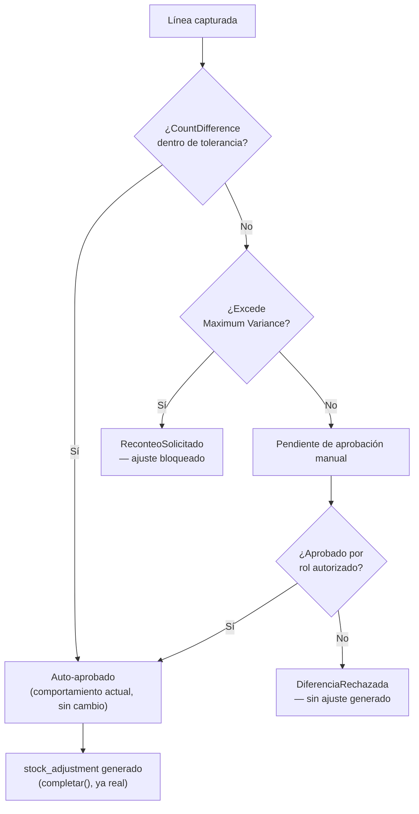
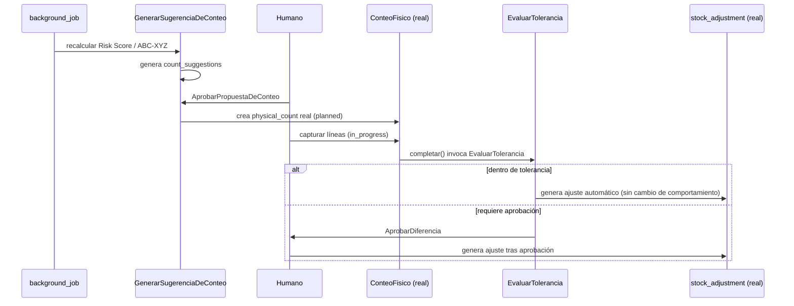
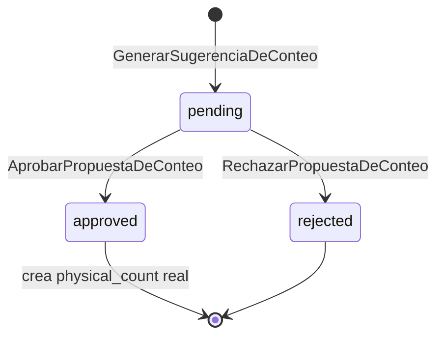

# ADR-INV-009 — Motor de Conteo Cíclico de Inventario (Inventory Cycle Count Engine)

|                                 |                                                                                                                                                                                                                                                                   |
| ------------------------------- | ----------------------------------------------------------------------------------------------------------------------------------------------------------------------------------------------------------------------------------------------------------------- |
| **Identificador**               | `ADR-INV-009`                                                                                                                                                                                                                                                     |
| **Versión**                     | 1.0.0                                                                                                                                                                                                                                                             |
| **Estado**                      | Propuesta                                                                                                                                                                                                                                                         |
| **Fecha**                       | 2026-07-28                                                                                                                                                                                                                                                        |
| **Última revisión**             | 2026-07-28                                                                                                                                                                                                                                                        |
| **Autor**                       | Principal Software Architect / Audit Specialist, GORAZUS ERP Enterprise                                                                                                                                                                                           |
| **Ámbito**                      | Motor de conteo cíclico — dominio `inventory`, la única área de la serie con código real ya probado en la mayoría de sus piezas base                                                                                                                              |
| **ADRs relacionados**           | `ADR-INV-000` a `ADR-INV-008` (toda la serie)                                                                                                                                                                                                                     |
| **Dominios relacionados**       | Inventory (único — sin cruce a otro schema, mismo caso que `ADR-INV-007`)                                                                                                                                                                                         |
| **Componentes relacionados**    | `inventory.physical_counts`/`physical_count_lines`, `inventory.cycle_count_schedules`, `inventory.stock_adjustments`/`stock_adjustment_lines`/`stock_adjustment_reasons`, `modules/inventario/backend/services/{conteos,ajustes,programacion-conteos}.service.ts` |
| **Issues relacionados**         | Deuda nueva registrada en §14 — ausencia total de tolerancia/aprobación es el hallazgo central                                                                                                                                                                    |
| **Patrones relacionados (AKB)** | `Append-Only Ledger Pattern`, `Engineering Heuristics`, `Asserted-but-Unenforced Invariant (Anti-Pattern)`                                                                                                                                                        |
| **Documentos relacionados**     | `INVENTORY_CYCLE_COUNT.md` (real, ya documenta el gap de ABC/rotación), `INVENTORY_ADJUSTMENTS_REPORT.md`, `INVENTORY_PHYSICAL_COUNTS.md`, `BR-09`/`BR-10` ([[Business Rules Matrix — Inventory]])                                                                |

Sexto ADR de la serie — el primero donde **la mayoría de la base ya es código real y probado**, no
solo schema. Mismo criterio de honestidad de siempre: **✅ Real**, **🟡 Parcial**, **🔴 Propuesta** —
pero aquí la proporción se invierte respecto al resto de la serie: el motor de ejecución de conteo y
reconciliación ya existe; lo que falta es la **inteligencia de planificación** (qué contar, cuándo,
con qué prioridad) y la **gobernanza de aprobación** (qué pasa cuando hay una diferencia).

---

## 1. Propósito y Alcance

**Hallazgo que reorienta este ADR, encontrado antes de diseñar nada**: leyendo
`modules/inventario/backend/services/conteos.service.ts` línea por línea (no solo el schema), se
confirma que `completar()` — el método real que cierra un conteo — genera un `stock_adjustment`
**automáticamente para cualquier discrepancia, sin importar su magnitud, sin ningún paso de
aprobación humana entre "diferencia detectada" y "ajuste aplicado"**. Es el hallazgo central de este
documento: GORAZUS ya tiene un motor de conteo funcional y bien probado, pero sin ninguna de las
piezas de gobernanza (tolerancia, aprobación, reconteo) que la Regla Empresarial del propio pedido
exige ("All inventory adjustments must originate from this engine" — hoy se cumple, pero sin control
de calidad sobre qué adjunta se genera). Este ADR diseña esa capa de gobernanza como extensión,
**nunca reemplazo**, del motor real ya funcionando.

## 2. Estado Real del Motor de Conteo Cíclico (verificado — schema y código)

| Capacidad solicitada                                      | Estado                                                                                                        | Evidencia                                                                                                                                                                                          |
| --------------------------------------------------------- | ------------------------------------------------------------------------------------------------------------- | -------------------------------------------------------------------------------------------------------------------------------------------------------------------------------------------------- |
| Scheduled Count                                           | ✅ Real, con código                                                                                           | `cycle_count_schedules` + `ProgramacionConteosController`/Service, `generar()` real                                                                                                                |
| Location / Zone / Warehouse Count                         | ✅ Real, con código                                                                                           | `generar()` filtra por zona real; conteo manual acepta `warehouseId`                                                                                                                               |
| Product / Category Count                                  | 🟡 Real por composición                                                                                       | Mismo patrón que `putaway_rules` (`ADR-INV-007 §3.7`): se filtran `productId`s desde `products` y se crean con `productIds` explícito — ya documentado como real en `INVENTORY_CYCLE_COUNT.md §3`  |
| ABC Cycle Count                                           | 🔴 Propuesta — **el schema no lo soporta hoy**, ya documentado como gap real en `INVENTORY_CYCLE_COUNT.md §3` | Este ADR lo cierra reutilizando `product_abc_classifications` **ya propuesta** en `ADR-INV-006 §3.4` — la tabla que ese reporte anterior predijo que haría falta ya está diseñada, sin implementar |
| Random Count                                              | 🔴 Propuesta                                                                                                  | Selección aleatoria de `productId`s sobre `stock` — sin mecanismo hoy                                                                                                                              |
| Event-triggered Count                                     | 🔴 Propuesta                                                                                                  | P. ej. disparado por `CapaDeCostoCreada` con discrepancia de costo, o `RetencionDeCalidadCreada` (`ADR-INV-005 §3.7`) — sin conexión hoy                                                           |
| Risk-based Count                                          | 🔴 Propuesta                                                                                                  | Requiere Risk Score (§3.2) — sin dato base hoy                                                                                                                                                     |
| XYZ Classification (como estrategia de conteo)            | 🔴 Propuesta                                                                                                  | Reutiliza `product_abc_classifications.xyz_class`, ya propuesta en `ADR-INV-006 §3.5`                                                                                                              |
| Lot / Serial Count                                        | 🔴 Propuesta                                                                                                  | `physical_count_lines` no tiene `lot_id`/`serial_id` — mismo gap ya encontrado y ya en corrección en `ADR-INV-008 §6.1` (`stock_movements`); aquí se extiende a conteo                             |
| Expired Inventory Count                                   | 🟡 Derivable                                                                                                  | `inventory_lots.expiry_date` real (`ADR-INV-005 §3.8`) — filtro, no mecanismo nuevo                                                                                                                |
| Damaged / Reserved / Blocked / Quarantine Inventory Count | 🟡 Derivable (Reserved) / 🔴 Propuesta (resto)                                                                | `Reserved` ya real (`stock.quantity_reserved`); Damaged/Blocked/Quarantine dependen de `stock_quality_holds`, propuesta en `ADR-INV-005 §3.7`, sin implementar                                     |
| Customer-owned / Supplier-owned Inventory Count           | 🔴 Propuesta                                                                                                  | Depende de `is_consigned` (`ADR-INV-005 §3.10`, propuesta, fuera de alcance de implementación ahí también)                                                                                         |
| Blind Count                                               | 🔴 Propuesta                                                                                                  | `physical_count_lines.system_quantity` es visible sin restricción hoy — sin bandera de ocultamiento                                                                                                |
| Double Blind Count                                        | 🔴 Propuesta                                                                                                  | Requiere dos capturas independientes reconciliadas entre sí — sin mecanismo, ni de una ni de dos capturas                                                                                          |
| Full Physical Inventory                                   | 🟡 Real por composición                                                                                       | Un conteo sin filtro de zona/producto ya cubre todo el almacén — sin mecanismo nuevo, es el caso límite de lo ya real                                                                              |
| Emergency Count                                           | 🔴 Propuesta                                                                                                  | Sin bandera de prioridad/urgencia en `physical_counts` hoy                                                                                                                                         |
| Planning / Assignment / Execution                         | ✅ Real (Planning, Execution) / 🔴 Propuesta (Assignment)                                                     | `planned`/`in_progress`/`completed` ya real; sin `assigned_to_user_id` en `physical_counts` — nadie es dueño explícito de ejecutar un conteo hoy                                                   |
| Verification / Approval                                   | 🔴 **El hallazgo central**                                                                                    | Sin paso de verificación ni aprobación — `completar()` genera el ajuste directo, sin gate humano                                                                                                   |
| Adjustment Proposal vs. Inventory Adjustment              | 🔴 Propuesta (Proposal) / ✅ Real (Adjustment)                                                                | Hoy no hay "propuesta" — el ajuste ya se crea confirmado en la práctica; se propone separar ambos pasos                                                                                            |
| Recount Threshold                                         | 🔴 Propuesta                                                                                                  | Sin mecanismo — toda discrepancia genera ajuste directo, nunca solicita reconteo                                                                                                                   |
| Tolerance Percentage / Quantity                           | 🔴 **El otro hallazgo central**                                                                               | **Cero tolerancia hoy** — cualquier diferencia, por mínima que sea, genera ajuste automático                                                                                                       |

**Resumen honesto**: de 23 tipos de conteo + 10 estrategias + workflow de 9 pasos solicitados, la
**ejecución mecánica** (crear conteo, capturar cantidades, cerrar y reconciliar) ya es real y
probada — la **inteligencia de selección** (ABC/XYZ/Riesgo) y la **gobernanza de aprobación**
(tolerancia, verificación, reconteo) son, casi en su totalidad, diseño nuevo de este ADR.

## 3. Diseño — Estrategias de Selección de Conteo

### 3.1 Un solo motor de selección, no 23 tipos de conteo separados

Mismo principio arquitectónico ya aplicado en `ADR-INV-008 §1` a las 25 genealogías: los 23 tipos de
conteo pedidos no son 23 mecanismos — son **filtros distintos sobre el mismo `GenerarSugerenciaDeConteo`**
(§4.4), aplicado a `stock`/`inventory_lots`/`inventory_serials`/`stock_quality_holds`. Diseñar 23
generadores separados violaría la misma Regla Empresarial que `ADR-INV-008` ya evitó violar.

### 3.2 Risk Score — nueva fórmula, reutiliza datos ya diseñados

```
Risk Score(producto, almacén) = w1×(1 − Count Accuracy histórica, §10)
                               + w2×(abc_class = 'A' ? 1 : 0.3, ADR-INV-006 §3.4)
                               + w3×(Shrinkage % histórico, §10)
                               + w4×(¿tiene stock_quality_holds activos? 1 : 0, ADR-INV-005 §3.7)
```

Determinística y auditable (mismo criterio de `ADR-INV-006 §11`: cada componente es trazable a un
dato real, nunca una caja negra) — pesos configurables, no fijos. **Risk-based Count** = ordenar por
Risk Score descendente y seleccionar los N productos de mayor riesgo, sin mecanismo adicional.

### 3.3 Fraud Risk, Supplier Risk, Warehouse Risk

Tres variantes del mismo Risk Score (§3.2) con ponderación distinta: Fraud Risk pondera más la
frecuencia de ajustes manuales sobre el mismo producto/operario (`created_by` en
`stock_adjustments`, ya real); Supplier Risk pondera `supplier_performance_history`
(`ADR-INV-006 §3.11`, propuesta); Warehouse Risk pondera Count Accuracy agregada por almacén en vez
de por producto. Ninguna requiere tabla nueva — son parámetros distintos del mismo cálculo.

## 4. Diseño DDD

### 4.1 Decisión de diseño — extender los Aggregates reales, no reemplazarlos

`ConteoFisico`/`AjusteStock` **ya son Aggregates reales y probados** — este ADR no los redefine. Se
extienden con columnas nuevas (§6.1) y se introduce un Aggregate nuevo, **`PropuestaDeConteo`**
(`CountSession`/`CountTask` del pedido, unificados), que resuelve la capa de planificación que hoy
no existe.

### 4.2 CycleCount / CountSession / CountTask — unificados en `PropuestaDeConteo`

El pedido distingue `CycleCount` de `CountSession`/`CountTask` — en el diseño real de GORAZUS,
`ConteoFisico` (`physical_counts`) ya cumple el rol de "sesión de conteo" (una campaña con líneas).
`PropuestaDeConteo` (Aggregate Root nuevo) es la pieza que falta **antes** de esa sesión: la
recomendación de qué contar y por qué (Risk Score, ABC, evento disparador), que un humano aprueba
antes de convertirse en un `ConteoFisico` real — mismo patrón exacto que `SugerenciaDeCompra`
(`ADR-INV-006 §4.1`): decisión persistida, auditable tal como se generó, aprobación humana
obligatoria antes de ejecutarse.

### 4.3 CountResult, CountDifference, Reconciliation

`CountResult` = `physical_count_lines.counted_quantity` (ya real). `CountDifference` = diferencia
calculada (`counted_quantity − system_quantity`), no almacenada aparte (mismo criterio de valor
derivado). **Reconciliation** es el nombre correcto para lo que `completar()` ya hace — este ADR le
agrega el gate de tolerancia/aprobación (§5) sin tocar la lógica de generación del ajuste en sí.

### 4.4 Domain Services

- `GenerarSugerenciaDeConteo` (§3.1) — el generador único parametrizado.
- `CalcularRiskScore` (§3.2).
- `EvaluarTolerancia` (§5.1) — decide si una diferencia se auto-aprueba, requiere aprobación, o
  dispara un reconteo, **antes** de que `completar()` (ya real) genere el ajuste.
- `AplicarConteo` — extiende `completar()` real, insertando `EvaluarTolerancia` como paso
  intermedio obligatorio (§5).

### 4.5 Approval Policy / Assignment Policy / Variance Policy

Tres Domain Policies nuevas propuestas (mismo límite de autorización de `docs/ddd/` ya respetado):

- **Approval Policy (P30 propuesta)**: qué rol aprueba una diferencia según su magnitud (§5.2) —
  reutiliza el mismo criterio de permiso de consulta vs. gestión ya usado en toda la serie, un
  nivel más: consulta / gestión / **aprobación de varianza**.
- **Assignment Policy (P31 propuesta)**: a qué operario se asigna un `ConteoFisico` — mismo criterio
  de `AsignarTarea` ya diseñado en `ADR-INV-007 §4.4` (carga de trabajo actual + zona), reutilizado
  aquí sin rediseñar.
- **Variance Policy (P32 propuesta)**: formaliza Tolerance Percentage/Quantity/Recount Threshold
  (§5.1) como configuración explícita, no implícita en código.

### 4.6 Repositories, Factories, Specifications, Commands, Queries

`PropuestaDeConteoRepository` (nuevo). `PropuestaDeConteoFactory`. Specifications:
`ExcedeTolerancia` (§5.1), `RequiereAprobacion` (§5.2), `RequiereReconteo` (§5.3). Comandos:
`GenerarSugerenciasDeConteo` (bulk, background), `AprobarPropuestaDeConteo`, `AsignarConteo`
(extiende `AsignarTarea` real de `ADR-INV-007`), `AprobarDiferencia`, `SolicitarReconteo`. Consultas:
`ObtenerPropuestasPendientes`, `ObtenerDiferenciasPendientesDeAprobacion`,
`ObtenerHistorialDeConteos(productId | warehouseId)`.

### 4.7 Domain Events

`PropuestaDeConteoGenerada`, `PropuestaDeConteoAprobada`, `ConteoAsignado`,
`DiferenciaDetectada` (nuevo — hoy `completar()` no publica nada, ni siquiera este evento),
`DiferenciaAprobada`, `ReconteoSolicitado`. Mismo estado honesto: diseñados, no publicados hasta que
exista código real de eventos.

## 5. Reglas de Negocio — la capa de gobernanza que falta

### 5.1 Tolerance Percentage / Quantity / Recount Threshold

Tres umbrales configurables (por empresa, o por clasificación ABC del producto —
`ADR-INV-006 §3.4`), evaluados en orden por `EvaluarTolerancia` **antes** de que `completar()` real
genere el ajuste:

```text
|CountDifference| ≤ Tolerancia (% o cantidad, la que sea más estricta)
        │
        ├─ Sí → Auto-aprobado, ajuste se genera igual que hoy (sin cambio de comportamiento)
        │
        └─ No → ¿|CountDifference| > Maximum Variance?
                  │
                  ├─ Sí → Recount Threshold: bloquea el ajuste, dispara ReconteoSolicitado
                  │        (nunca se ajusta sobre un solo conteo con varianza extrema)
                  │
                  └─ No → Requiere aprobación manual (§5.2) antes de generar el ajuste
```

**Compatibilidad hacia atrás explícita**: si ninguna tolerancia se configura, el comportamiento es
idéntico al actual (`completar()` genera el ajuste directo) — mismo criterio de extensión sin
ruptura de toda la serie.

### 5.2 Automatic vs. Manual Approval

Automática cuando la diferencia está dentro de tolerancia (§5.1). Manual cuando la excede pero no
alcanza el Recount Threshold — requiere `AprobarDiferencia` con `inventario.aprobar_diferencias_conteo`
(permiso nuevo, §8), separado del permiso de ejecutar el conteo en sí (mismo criterio de separación
de permisos ya usado repetidamente en la serie).

### 5.3 Maximum Variance / Negative Inventory Detection

Maximum Variance dispara reconteo (§5.1). Negative Inventory Detection: si `counted_quantity`
implicaría que otro movimiento posterior dejaría el stock negativo (cruce con `Available`,
`ADR-INV-005`), la diferencia se marca de prioridad alta para aprobación, nunca se auto-aprueba
aunque esté dentro de tolerancia porcentual — una diferencia pequeña en términos relativos puede ser
grande en términos de riesgo de disponibilidad.

### 5.4 Blind Count y Double Blind Count

**Blind**: `physical_count_lines.system_quantity` no se expone en la API de captura al operario
(`counted_quantity` se envía sin haber visto el valor esperado) — cambio de comportamiento de API
(§7), no de schema. **Double Blind**: dos capturas independientes (dos filas de resultado por línea,
propuesto: `physical_count_line_captures`, nueva) reconciliadas entre sí antes de comparar contra
`system_quantity` — mecanismo nuevo real, único caso de esta sección con tabla nueva.

### 5.5 Reservation / Availability Validation, Warehouse/Location Lock Policies

Un conteo en progreso **no bloquea** operación del almacén hoy (correcto, cumple "the warehouse
must never stop operating" del pedido, ya sin diseño adicional) — pero un ajuste generado durante un
conteo activo podría entrar en conflicto con una reserva creada en el ínterin. Se propone que
`EvaluarTolerancia` valide `Available` vigente (`ADR-INV-005 §4.4`) antes de aprobar automáticamente
un ajuste que reduciría el stock por debajo de lo ya reservado — reutiliza la Specification
`StockDisponibleParaReserva` ya real, no una nueva.

## 6. Diseño de Base de Datos

### 6.1 Extensión de tablas reales

```sql
ALTER TABLE inventory.physical_counts ADD COLUMN assigned_to_user_id UUID REFERENCES core.users(id);
ALTER TABLE inventory.physical_counts ADD COLUMN is_blind BOOLEAN NOT NULL DEFAULT false;
ALTER TABLE inventory.physical_counts ADD COLUMN priority TEXT DEFAULT 'normal'; -- 'normal'|'emergency'
ALTER TABLE inventory.physical_count_lines ADD COLUMN lot_id UUID REFERENCES inventory.inventory_lots(id);
ALTER TABLE inventory.physical_count_lines ADD COLUMN serial_id UUID REFERENCES inventory.inventory_serials(id);
```

Todas nulables/con default — `completar()` real sigue funcionando idéntico para conteos sin estas
columnas pobladas.

### 6.2 Tablas nuevas

```sql
CREATE TABLE inventory.count_suggestions (
    id                  UUID   NOT NULL DEFAULT gen_random_uuid(),
    warehouse_id        UUID   NOT NULL REFERENCES inventory.warehouses(id),
    product_id          UUID   REFERENCES products.products(id),
    zone_id             UUID   REFERENCES inventory.warehouse_zones(id),
    trigger_type        TEXT   NOT NULL, -- 'abc'|'xyz'|'risk'|'random'|'event'|'scheduled'
    risk_score          DECIMAL(6,4),
    reasoning           JSONB  NOT NULL, -- auditable, mismo criterio que purchase_suggestions
    status              TEXT   NOT NULL DEFAULT 'pending', -- 'pending'|'approved'|'rejected'
    generated_count_id  UUID REFERENCES inventory.physical_counts(id),
    created_at          TIMESTAMPTZ NOT NULL DEFAULT now(),
    PRIMARY KEY (id)
);

CREATE TABLE inventory.count_variance_approvals (
    id                     UUID   NOT NULL DEFAULT gen_random_uuid(),
    physical_count_line_id UUID   NOT NULL REFERENCES inventory.physical_count_lines(id),
    variance_status        TEXT   NOT NULL, -- 'within_tolerance'|'pending_approval'|'recount_required'
    approved_by            UUID   REFERENCES core.users(id),
    approved_at            TIMESTAMPTZ,
    created_at             TIMESTAMPTZ NOT NULL DEFAULT now(),
    PRIMARY KEY (id, created_at)
) PARTITION BY RANGE (created_at); -- mensual, append-only (ADR-DB-001)

CREATE TABLE inventory.physical_count_line_captures (
    id                     UUID   NOT NULL DEFAULT gen_random_uuid(),
    physical_count_line_id UUID   NOT NULL REFERENCES inventory.physical_count_lines(id),
    counted_by             UUID   NOT NULL REFERENCES core.users(id),
    counted_quantity       DECIMAL(18,6) NOT NULL,
    capture_sequence       SMALLINT NOT NULL, -- 1 o 2, para Double Blind (§5.4)
    created_at             TIMESTAMPTZ NOT NULL DEFAULT now(),
    PRIMARY KEY (id)
);
```

### 6.3 Índices, Retención

`BTree (warehouse_id, status)` en `count_suggestions` (mismo patrón que `purchase_suggestions`,
`ADR-INV-006 §6.2`). `BRIN` en `count_variance_approvals.created_at`. Retención: `count_variance_approvals`
sigue el mismo criterio de auditoría de larga duración que `ADR-INV-008 §6.4` — un ajuste de
inventario aprobado (o no) es evidencia de cumplimiento, no un log operativo de corta vida.

### 6.4 Concurrencia

`AprobarDiferencia`/`SolicitarReconteo` siguen el orden determinístico ya real (`ADR-INF-001 §4`).
Sin nuevo riesgo de deadlock — estas operaciones no compiten por los mismos recursos que
[[Movement Engine]] en el camino caliente de venta/reserva.

## 7. Diseño de API

- `POST /inventario/conteos/sugerencias` (bulk, background) / `GET .../sugerencias?status=pending`.
- `POST /inventario/conteos/sugerencias/{id}/aprobar` / `.../rechazar`.
- `POST /inventario/conteos/{id}/asignar`.
- `POST /inventario/conteos/{id}/lineas/{lineaId}/capturar` — **payload sin `system_quantity`** si
  `is_blind=true` (§5.4), mismo endpoint, comportamiento condicional documentado explícitamente en
  OpenAPI, no un endpoint paralelo.
- `POST /inventario/conteos/{id}/completar` — extiende el real, ahora invoca `EvaluarTolerancia`.
- `POST /inventario/conteos/diferencias/{id}/aprobar` / `.../reconteo`.
- `GET /inventario/conteos/historial?productId=&warehouseId=`.
- `GET /inventario/conteos/reportes/varianza?warehouseId=&desde=&hasta=`.

Formato/estándares heredados (`API Standards`). Permisos nuevos:
`inventario.gestionar_sugerencias_conteo`, `inventario.aprobar_diferencias_conteo`.

## 8. Seguridad

RBAC de tres niveles (consulta / ejecución / aprobación de varianza) — más granular que el resto de
la serie porque la aprobación de una diferencia de inventario es, por naturaleza, una operación de
control interno con implicación de auditoría externa. RLS heredado, misma brecha conocida de
`branch`/`warehouse` (`ISSUE-02`). Auditoría universal + `reasoning`/`count_variance_approvals` como
capa adicional de trazabilidad específica de este motor (mismo patrón que `ADR-INV-006 §8`).

## 9. Rendimiento y Escalabilidad

`GenerarSugerenciasDeConteo`/recálculo de Risk Score como `background_job`s (mismo criterio de toda
la serie). **Hallazgo real relevante para este ADR específicamente**: `core/scheduler` existe como
infraestructura real desde antes de esta sesión, **sin ningún consumidor real todavía**
(`TECHNICAL_DEBT.md §2`, ya documentado) — conectar `cycle_count_schedules`/`count_suggestions` a
ese scheduler es la pieza de infraestructura que falta para que "el conteo continuo" sea real y no
solo una acción manual (`generar()` hoy hay que llamarla). Este ADR **no** implementa esa conexión
(fuera de alcance de diseño puro), pero la señala como el bloqueador real más directo entre este
documento y "inventory operations must never stop" del pedido original.

## 10. Analítica y KPIs

| KPI                    | Fórmula                                                                                                                                            |
| ---------------------- | -------------------------------------------------------------------------------------------------------------------------------------------------- |
| Inventory Accuracy     | `1 − (                                                                                                                                             | CountDifference | / system_quantity)`, promediado         |
| Count Accuracy         | % de líneas de conteo sin diferencia sobre el total contado                                                                                        |
| Variance %             | `                                                                                                                                                  | CountDifference | / system_quantity` por línea, agregable |
| Shrinkage %            | Solo diferencias negativas (`counted < system`) sobre el valor total (usa costo vigente, `ADR-INV-004`)                                            |
| Adjustment Frequency   | Ajustes generados / conteos completados, por período                                                                                               |
| Cycle Count Coverage   | % de productos/ubicaciones contados en los últimos N días sobre el total activo                                                                    |
| Warehouse Accuracy     | Inventory Accuracy agregada por almacén — insumo directo de Warehouse Risk (§3.3)                                                                  |
| Operator Accuracy      | % de capturas de un operario sin necesidad de reconteo — insumo de Fraud Risk (§3.3)                                                               |
| Inventory Health Score | Compuesto: `w1×Inventory Accuracy + w2×Cycle Count Coverage + w3×(1−Shrinkage %)`, mismo criterio de fórmula transparente que el resto de la serie |

## 11. Diagramas

### 11.1 Flujo de Aprobación con Tolerancia



### 11.2 Secuencia — Sugerencia de Conteo hasta Ajuste



### 11.3 Ciclo de Vida de una Propuesta de Conteo



## 12. Quality Gate — Verificación de Consistencia

- **DDD/Clean/Hexagonal**: `PropuestaDeConteo` sigue el mismo patrón Aggregate+Repository+Factory ya
  validado; `ConteoFisico`/`AjusteStock` reales **no se reemplazan**, solo se extienden.
- **Consistencia con Almacenes (`ADR-INV-007`)**: `AsignarConteo` reutiliza `AsignarTarea` ya
  diseñado, sin duplicar lógica de asignación.
- **Consistencia con Disponibilidad (`ADR-INV-005`)**: validación de negativo en §5.3 reutiliza
  `CalcularDisponibilidad`, no recalcula stock por su cuenta.
- **Consistencia con Costeo (`ADR-INV-004`)**: Shrinkage % (§10) usa el costo vigente ya real, sin
  costeo propio.
- **Consistencia con Trazabilidad (`ADR-INV-008`)**: `lot_id`/`serial_id` en `physical_count_lines`
  (§6.1) usa exactamente las mismas columnas ya propuestas para `stock_movements` en ese ADR, no un
  esquema paralelo.
- **Sin lógica duplicada**: verificado que los 23 tipos de conteo se resuelven en un generador
  parametrizado (§3.1), no 23 implementaciones — mismo criterio ya aplicado en `ADR-INV-008`.

## 13. Riesgos, Alternativas Consideradas

| Riesgo                                                                                                             | Severidad | Mitigación                                                                                                                                                                                      |
| ------------------------------------------------------------------------------------------------------------------ | --------- | ----------------------------------------------------------------------------------------------------------------------------------------------------------------------------------------------- |
| Sin tolerancia configurada, el comportamiento actual (ajuste automático sin control) continúa                      | Media     | Aceptado explícitamente como default — mismo criterio de "extensión opt-in, nunca ruptura" de toda la serie; el riesgo real es organizacional (¿se configura la tolerancia?), no arquitectónico |
| `core/scheduler` sin consumidor real bloquea la "continuidad" que pide el prompt                                   | Alta      | Señalado explícitamente en §9 como el bloqueador real — este ADR no lo resuelve, lo documenta con honestidad en vez de fingir que "conteo continuo" ya es posible                               |
| Double Blind Count agrega una tabla y un flujo que ningún documento de sesiones anteriores pedía hasta este prompt | Baja      | Diseñado porque se pidió explícitamente, con la misma disciplina de "sin evidencia de necesidad de negocio previa, pero tampoco se inventa una — se diseña lo pedido, documentado como nuevo"   |

**Alternativas descartadas**:

- **Reemplazar `ConteoFisico`/`AjusteStock` por Aggregates nuevos**. Descartada explícitamente — ya
  son código real, probado, en producción de desarrollo; extenderlos es estrictamente mejor que
  reescribirlos sin motivo.
- **23 tablas o generadores de conteo especializados**. Descartada, mismo argumento que
  `ADR-INV-008 §1`.
- **Bloquear operación del almacén durante un conteo activo** (interpretación literal de "verificar
  sin detener"). Descartada — el diseño real ya no bloquea (`physical_counts` no impide movimientos
  concurrentes), y bloquear introduciría exactamente el problema que "the warehouse must never stop
  operating" prohíbe.

## 14. Consecuencias y Deuda Registrada

- Todo flujo de conteo futuro debe invocar `EvaluarTolerancia` antes de generar un ajuste — mismo
  principio de fuente única reafirmado por sexta vez en la serie, aplicado aquí como corrección
  sobre un flujo real ya existente, no solo como regla para código nuevo.
- **Deuda técnica más importante de este ADR**: cero tolerancia/aprobación en el flujo real hoy —
  cualquier volumen de producción real con este comportamiento genera ajustes automáticos sin
  control por diferencias que podrían ser errores de captura, no shrinkage real.
- `core/scheduler` sin consumidor sigue siendo el bloqueador de fondo para "conteo continuo" real —
  ya documentado en `TECHNICAL_DEBT.md`, reafirmado aquí con un caso de uso concreto que lo necesita.
- Las tres Domain Policies propuestas (P30-P32) y `PropuestaDeConteo` requieren autorización de
  edición de `docs/ddd/`, mismo límite ya respetado en toda la serie.

---

## Alternativas Consideradas

Ver §13.

## Consecuencias

Ver §14.
