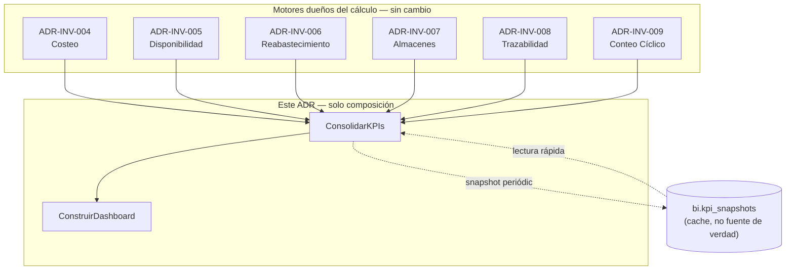
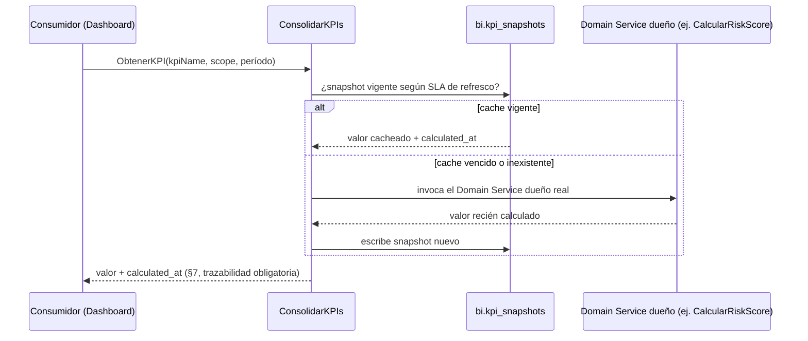

# ADR-INV-010 — Motor de Analítica de Inventario (Inventory Analytics Engine)

|                                 |                                                                                                                                                                                     |
| ------------------------------- | ----------------------------------------------------------------------------------------------------------------------------------------------------------------------------------- |
| **Identificador**               | `ADR-INV-010`                                                                                                                                                                       |
| **Versión**                     | 1.0.0                                                                                                                                                                               |
| **Estado**                      | Propuesta                                                                                                                                                                           |
| **Fecha**                       | 2026-07-28                                                                                                                                                                          |
| **Última revisión**             | 2026-07-28                                                                                                                                                                          |
| **Autor**                       | Principal Software Architect / Analytics Specialist, GORAZUS ERP Enterprise                                                                                                         |
| **Ámbito**                      | Motor de analítica — dominio `inventory`, capa de consolidación sobre los 6 motores/capas ya diseñados                                                                              |
| **ADRs relacionados**           | `ADR-INV-000` a `ADR-INV-009` (toda la serie)                                                                                                                                       |
| **Dominios relacionados**       | Inventory (agrega KPIs ya definidos en `ADR-INV-004/005/006/007/008/009`, sin cruzar escritura a ningún schema ajeno)                                                               |
| **Componentes relacionados**    | Todas las vistas/snapshots ya propuestos en la serie (`v_stock_valuation`, `v_net_available_stock`, `availability_snapshots`, `traceability_snapshots`, `count_variance_approvals`) |
| **Issues relacionados**         | Descubre y registra una deuda nueva propia (§2 — colisión de nombre de KPI entre dos ADRs previos)                                                                                  |
| **Patrones relacionados (AKB)** | `Append-Only Ledger Pattern`, `Engineering Heuristics`, `Domain Design Heuristics`                                                                                                  |
| **Documentos relacionados**     | `ADR-INV-004 §10`, `ADR-INV-006 §10`, `ADR-INV-007 §10`, `ADR-INV-008 §10`, `ADR-INV-009 §10` (las cinco tablas de KPI que este ADR consolida, nunca recalcula)                     |

Séptimo ADR de la serie — como `ADR-INV-008` (Trazabilidad), este **no introduce lógica de negocio
nueva**: es la capa de consolidación sobre KPIs que **ya tienen fórmula definida** en cinco ADRs
anteriores. La Regla Empresarial del propio pedido ("No module may calculate KPIs independently")
aplica, con la misma fuerza, a este documento sobre sí mismo — motivo por el que §2 audita, antes de
diseñar nada, si esa regla ya se violó sin querer en la serie hasta ahora.

---

## 1. Propósito y Alcance

Un motor de analítica que recalcula KPIs con su propia fórmula, distinta de la que ya definió el
motor dueño del dato, es exactamente el anti-patrón que la Regla Empresarial de este pedido prohíbe
— y es un riesgo real, no teórico, precisamente porque cinco ADRs anteriores de esta misma serie ya
definieron tablas de KPI de forma independiente entre sí, sin una auditoría cruzada hasta ahora. Este
ADR existe para ser esa auditoría, antes de ser un motor.

## 2. Auditoría de KPIs ya Definidos — el hallazgo central de este documento

**Antes de diseñar un solo KPI nuevo**, se releyeron las cinco tablas de KPI ya escritas en la serie
(`ADR-INV-004 §10`, `ADR-INV-006 §10`, `ADR-INV-007 §10`, `ADR-INV-008 §10`, `ADR-INV-009 §10`) para
verificar consistencia entre sí — el mismo nivel de escrutinio que ya se aplicó al schema real en
cada ADR anterior, aplicado ahora a los propios documentos de esta serie.

**Hallazgo real: colisión de nombre con fórmulas distintas.** `ADR-INV-006 §10` define _Inventory
Health Score_ = `w1×Turnover_normalizado + w2×(1−Stockout Rate) + w3×(1−Overstock Rate)`.
`ADR-INV-009 §10` define, **con el mismo nombre exacto**, _Inventory Health Score_ =
`w1×Inventory Accuracy + w2×Cycle Count Coverage + w3×(1−Shrinkage %)`. Son dos fórmulas distintas
bajo el mismo nombre — exactamente el defecto que este ADR existe para prevenir, y que ocurrió sin
detectarse hasta esta auditoría porque ningún ADR anterior tenía visibilidad de los KPIs de los
demás.

### 2.1 Resolución — jerarquía de composición, no un ganador

Se propone que **`Inventory Health Score`** pase a ser, exclusivamente, el compuesto de nivel
superior definido **aquí**, agregando las dos fórmulas en conflicto como sub-scores con nombre
propio y desambiguado — ninguna de las dos "pierde", ambas se conservan con un nombre correcto:

```
Inventory Health Score = w1×Replenishment Health Score (ex "ADR-INV-006 Inventory Health Score")
                        + w2×Accuracy Health Score (ex "ADR-INV-009 Inventory Health Score")
                        + w3×Warehouse Health Score (ya sin colisión, ADR-INV-007 §10)
```

**Corrección de nomenclatura recomendada** (sin editar los ADRs originales — mismo límite de no
reescribir un ADR ya aceptado, este ADR **documenta** la corrección, no la aplica retroactivamente):
`ADR-INV-006 §10` debería leerse como _Replenishment Health Score_, `ADR-INV-009 §10` como
_Accuracy Health Score_. Se deja registrado aquí como la fuente de verdad de nomenclatura desde este
punto en adelante.

### 2.2 Registro Único de KPIs — Tabla Maestra

| KPI solicitado                               | Definido en                                          | Estado                                                                    | Este ADR                                           |
| -------------------------------------------- | ---------------------------------------------------- | ------------------------------------------------------------------------- | -------------------------------------------------- |
| Inventory Accuracy                           | `ADR-INV-009 §10`                                    | ✅ Ya definido                                                            | Se **lee**, no se redefine                         |
| Inventory Health Score                       | Este ADR §2.1 (resuelve colisión)                    | 🔴 Nuevo (resolución)                                                     | Definido aquí como compuesto de 3 sub-scores       |
| Stock Turnover                               | `ADR-INV-006 §10`                                    | ✅ Ya definido                                                            | Se lee                                             |
| Inventory Value                              | `ADR-INV-005 §8` (`v_stock_valuation`)               | ✅ Ya definido                                                            | Se lee                                             |
| Average Days in Stock                        | `ADR-INV-005 §3.8` (Coverage Days)                   | 🟡 Mismo concepto, nombre distinto                                        | Aclarado en §3.1                                   |
| Dead Stock % / Slow Moving % / Fast Moving % | `ADR-INV-006 §3.6` (matriz ABC-XYZ)                  | ✅ Ya definido                                                            | Se lee — clase `CZ`/`BY`-`CY`/`AX` respectivamente |
| Fill Rate                                    | `ADR-INV-005 §3.8`/`ADR-INV-006 §10` (Service Level) | 🟡 Mismo concepto, nombre distinto                                        | Aclarado en §3.1                                   |
| Availability %                               | `ADR-INV-005` (`Available`/`On Hand`)                | ✅ Ya definido                                                            | Se lee                                             |
| Backorder %                                  | `ADR-INV-005 §3.6`                                   | ✅ Ya definido                                                            | Se lee                                             |
| Reservation Ratio                            | —                                                    | 🔴 Nuevo                                                                  | `Reserved / On Hand` — composición simple, §3.2    |
| Warehouse Occupancy                          | `ADR-INV-007 §10`                                    | ✅ Ya definido                                                            | Se lee                                             |
| Picking / Receiving Efficiency               | `ADR-INV-007 §10`                                    | ✅ Ya definido (Picking); 🟡 nombrado "Receiving Performance" (Receiving) | Aclarado en §3.1                                   |
| Transfer Efficiency                          | —                                                    | 🔴 Nuevo                                                                  | §3.3                                               |
| Shrinkage %                                  | `ADR-INV-009 §10`                                    | ✅ Ya definido                                                            | Se lee                                             |
| Adjustment %                                 | `ADR-INV-009 §10` (Adjustment Frequency)             | ✅ Ya definido                                                            | Se lee                                             |
| Supplier Lead Time                           | `products.product_suppliers.lead_time_days`          | ✅ Real (columna, no KPI calculado)                                       | Se lee directo                                     |
| Forecast Accuracy Readiness                  | `ADR-INV-006 §10` (Forecast Accuracy, condicional)   | ✅ Ya definido                                                            | Se lee                                             |
| Inventory Risk Score                         | `ADR-INV-009 §3.2` (Risk Score)                      | ✅ Ya definido                                                            | Se lee                                             |

**Resumen honesto**: de 21 KPIs solicitados, 15 ya tenían fórmula definida antes de este ADR (uno de
ellos con una colisión real ahora resuelta), 3 son el mismo concepto con nombre distinto (aclaración,
no KPI nuevo), y solo 3 son genuinamente nuevos (`Inventory Health Score` como compuesto resuelto,
`Reservation Ratio`, `Transfer Efficiency`).

### 2.3 Aclaración de Nomenclatura — mismo concepto, nombre distinto

- **Average Days in Stock** = **Coverage Days** (`ADR-INV-005 §3.8`) — mismo cálculo
  (`Available_actual / Consumo Promedio Diario`), nombre distinto por venir de un pedido distinto.
- **Fill Rate** = **Service Level** (`ADR-INV-005 §3.8`, `ADR-INV-006 §10`) — mismo concepto de
  cadena de suministro con dos nombres de industria intercambiables; se estandariza como **Fill
  Rate** desde este ADR en adelante por ser el término más reconocido fuera del dominio de
  reabastecimiento puro.
- **Receiving Efficiency** ≈ **Receiving Performance** (`ADR-INV-007 §10`) — mismo dato
  (tiempo entre creación y confirmación de `goods_receipts`), diferencia de redacción únicamente.

## 3. Módulos de Analítica — Diseño de los Genuinamente Nuevos

### 3.1 Aclaraciones — no requieren diseño, ya cubiertos en §2.3

Average Days in Stock, Fill Rate, Receiving Efficiency: sin diseño adicional, son los KPIs ya reales
con el nombre correcto aplicado.

### 3.2 Reservation Ratio

```
Reservation Ratio(productId, warehouseId) = Reserved / On Hand
```

Ambos valores ya reales (`stock.quantity_reserved`/`quantity_on_hand`). Sin tabla ni Domain Service
nuevo — lectura directa. Relevante como señal de salud: un ratio sostenidamente alto indica que el
inventario disponible real es mucho menor que el físico, aunque `On Hand` se vea saludable.

### 3.3 Transfer Efficiency

```
Transfer Efficiency = Tiempo promedio entre stock_transfers.status='in_transit' y 'received'
```

Mismo criterio que Receiving/Picking Efficiency (`ADR-INV-007 §10`) — dato ya real en
`stock_transfers` (`created_at`, mismo patrón temporal que el resto de la serie), sin columna nueva.

### 3.4 Analytics Modules — el resto son vistas, no motores

De los 27 módulos de analítica pedidos, 20 ya son consecuencia directa de KPIs ya definidos (§2.2) —
"ABC Analysis" es la lectura de `product_abc_classifications` (`ADR-INV-006`), "Shrinkage Analysis"
es la lectura de Shrinkage % (`ADR-INV-009`), "Traceability Analytics" es la lectura de
`traceability_snapshots` (`ADR-INV-008`), etc. Diseñar un "módulo" separado por cada uno duplicaría,
otra vez, lo que §2.2 ya resolvió como lectura — se diseñan en cambio dos superficies de composición
(§5, Executive/Operational Dashboard) que agregan estos módulos sin poseerlos.

## 4. Diseño DDD

### 4.1 Decisión de diseño — Analytics como capa de lectura pura, sin Aggregate propio de negocio

**Ningún KPI de este ADR tiene lógica de negocio propia** — cada uno ya la tiene en su ADR de
origen. `Analytics Aggregate`/`KPI Engine`/`Metrics Engine` (pedidos) se resuelven como **un solo
Domain Service de composición**, no como Aggregates con reglas propias — mismo criterio que
`RecorrerGenealogia` (`ADR-INV-008 §4.4`): la inteligencia real vive en los seis motores ya
diseñados, este ADR solo la combina y la presenta.

### 4.2 KPI Engine / Metrics Engine → `ConsolidarKPIs`

`ConsolidarKPIs(kpiName, scope: productId | warehouseId | branchId | companyId, período)` — el único
Domain Service que resuelve los 21 KPIs (§2.2), delegando cada cálculo real a su ADR de origen
(invocando `CalcularEOQ`, `CalcularRiskScore`, `CalcularDisponibilidad`, etc., ya reales/propuestos)
en vez de reimplementar la fórmula. Es la aplicación número tres del principio "un motor, N puntos
de entrada" en esta serie (`ADR-INV-008` genealogía, `ADR-INV-009` tipos de conteo, ahora KPIs).

### 4.3 Dashboard Builder

`ConstruirDashboard(tipo: 'executive' | 'operational', scope, período)` — compone un conjunto fijo
de KPIs por tipo de dashboard (§5), sin lógica de cálculo propia — delega enteramente a
`ConsolidarKPIs`.

### 4.4 Analytics Service (Application Service)

Orquesta `ConsolidarKPIs`/`ConstruirDashboard` con cache (§9) — la única pieza con estado operativo
propio de este ADR es la estrategia de refresco (§6.3), no el cálculo.

### 4.5 Repositories, Factories, Specifications

`KPISnapshotRepository` (nuevo, §6.2). Sin Factory nueva — ningún Aggregate de negocio nuevo que
construir. Specification: `KPIDentroDeSLARefresco` (§6.3, decide si un KPI cacheado sigue siendo
válido o requiere recálculo).

### 4.6 Commands / Queries / DTOs

- Comandos: `RecalcularKPIs` (bulk, background), `InvalidarCacheDeKPI`.
- Consultas: `ObtenerKPI(kpiName, scope, período)`, `ObtenerDashboardEjecutivo(companyId)`,
  `ObtenerDashboardOperativo(warehouseId)`, `ObtenerHistorialDeKPI(kpiName, scope, rango)`.
- DTOs: espejo 1:1, sin lógica — mismo patrón de toda la serie.

## 5. Diseño de Dashboards

### 5.1 Executive Dashboard — visión de negocio, agregación alta

KPIs incluidos: `Inventory Health Score` (compuesto, §2.1), `Inventory Value`, `Stock Turnover`,
`Fill Rate`, `Shrinkage %`, `Inventory Risk Score` (top N productos). Scope: `companyId`/`branchId`
— nunca a nivel de producto individual (esa es la vista Operational). Refresco: diario
(background_job), no en tiempo real — mismo criterio que `availability_snapshots`
(`ADR-INV-005 §4.3`): un ejecutivo no necesita el segundo exacto, necesita el dato confiable de hoy.

### 5.2 Operational Dashboard — visión de ejecución, agregación baja

KPIs incluidos: `Warehouse Occupancy`, `Picking/Receiving/Transfer Efficiency`, `Reservation Ratio`,
`Availability %` por producto, `Backorder %`, tareas pendientes (`ADR-INV-007`/`ADR-INV-009`).
Scope: `warehouseId`, hasta `productId` individual. Refresco: near-real-time vía Redis (§9), para el
operario que necesita decidir _ahora_.

## 6. Diseño de Base de Datos

### 6.1 Sin tablas de hechos/dimensiones nuevas — reutiliza las ya reales

**Decisión de diseño explícita**: no se propone un modelo de estrella (fact/dimension tables)
separado del modelo operacional ya real — `stock_movements`, `fifo_cost_layers`, `physical_counts`,
etc. **ya son** las tablas de hechos (ledgers append-only, `ADR-DB-001 §7`); `products`, `warehouses`,
`suppliers` **ya son** las dimensiones. Construir un data warehouse paralelo duplicaría exactamente
lo que este ADR existe para prevenir (KPIs recalculados desde una copia, no desde la fuente).

### 6.2 Tabla nueva — snapshot de KPI, no fuente de verdad

```sql
CREATE TABLE inventory.kpi_snapshots (
    id                  UUID   NOT NULL DEFAULT gen_random_uuid(),
    kpi_name            TEXT   NOT NULL,
    scope_type          TEXT   NOT NULL, -- 'product'|'warehouse'|'branch'|'company'
    scope_id            UUID   NOT NULL,
    value                DECIMAL(18,6) NOT NULL,
    calculated_at        TIMESTAMPTZ NOT NULL DEFAULT now(),
    PRIMARY KEY (id, calculated_at)
) PARTITION BY RANGE (calculated_at); -- mensual, BRIN (ADR-DB-001 §15.5)
```

**Nota de reutilización real**: `bi.kpi_snapshots` **ya existe** como tabla real y genérica
(`ADR-DB-001 §7`, catalogada como particionada) — verificado antes de proponer la tabla de arriba
como algo nuevo. Se recomienda que `inventory.kpi_snapshots` **no se cree**; en su lugar,
`ConsolidarKPIs` escribe directamente en `bi.kpi_snapshots` real, con `kpi_name` como discriminador —
mismo criterio de [[Generic Polymorphic Subsystems]] ya aplicado repetidamente en la serie: verificar
si un mecanismo genérico ya real resuelve la necesidad antes de proponer una tabla nueva. **Este ADR
casi repite, dentro de sí mismo, el mismo error que corrigió en §2** — se documenta explícitamente
como una segunda mitigación de la misma disciplina.

### 6.3 Vistas Materializadas, Estrategia de Refresco

`v_stock_valuation`/`v_net_available_stock`/`v_warehouse_occupancy`/`v_abc_xyz_matrix` (todas ya
propuestas en sus ADRs de origen) son las vistas base que `ConsolidarKPIs` lee — sin vista
materializada nueva propia de este ADR, salvo `bi.v_inventory_health_score` (nueva, agrega los tres
sub-scores de §2.1). Refresco: `background_job` cada 15 minutos para Operational, diario para
Executive (§5) — configurable, no fijo, mismo criterio de extensibilidad de toda la serie.

### 6.4 Retención

`bi.kpi_snapshots` (reutilizada, §6.2) sigue su propia política de retención ya real, no la que este
ADR definiría — evita, de nuevo, introducir una política paralela donde ya existe una.

## 7. Reglas de Negocio

| Regla                       | Diseño                                                                                                                                                                                  |
| --------------------------- | --------------------------------------------------------------------------------------------------------------------------------------------------------------------------------------- |
| KPI refresh policies        | Executive: diario. Operational: cada 15 min o near-real-time vía Redis (§5, §9) — configurable por tipo de dashboard, no global                                                         |
| Dashboard refresh intervals | Igual que arriba — un dashboard no tiene política propia distinta de sus KPIs constituyentes                                                                                            |
| Historical retention        | Delegada a `bi.kpi_snapshots` real (§6.4) — sin política nueva                                                                                                                          |
| Aggregation rules           | `ConsolidarKPIs` con `scope` como único parámetro de agregación — de producto a empresa, nunca cálculos ad-hoc fuera de esa jerarquía                                                   |
| Calculation rules           | **Ninguna nueva** — cada cálculo delega al Domain Service de su ADR de origen (§4.2), la regla de negocio de este ADR es, precisamente, no tener reglas de cálculo propias              |
| Drill-down rules            | De Executive a Operational: mismo `scope_id` con `scope_type` más granular — sin mecanismo nuevo, es un cambio de parámetro en la misma consulta                                        |
| Export policies             | Fuera de alcance de diseño — sin evidencia de necesidad de negocio confirmada para exportación (CSV/PDF), mismo criterio de no fabricar necesidad de [[Innovation Report — 2026-07-28]] |
| Data consistency policies   | `ConsolidarKPIs` nunca devuelve un valor sin `calculated_at` — todo KPI expuesto es trazable a un momento de cálculo específico, nunca "el valor actual" sin fecha                      |

## 8. Diseño de API

- `GET /inventario/analitica/kpis/{kpiName}?scopeType=&scopeId=&periodo=`.
- `GET /inventario/analitica/dashboard/ejecutivo?companyId=`.
- `GET /inventario/analitica/dashboard/operativo?warehouseId=`.
- `GET /inventario/analitica/abc-xyz?warehouseId=`.
- `GET /inventario/analitica/inventario-muerto?warehouseId=` (Dead Stock).
- `GET /inventario/analitica/antiguedad?warehouseId=` (Aging).
- `GET /inventario/analitica/kpis/{kpiName}/historial?scopeId=&desde=&hasta=`.
- `POST /inventario/analitica/recalcular` (bulk, background).

Formato/estándares heredados (`API Standards`). Permiso nuevo: `inventario.ver_analitica` — de solo
lectura, sin par de gestión (§9, este motor no escribe datos operacionales, solo los lee y presenta).

## 9. Seguridad

**Read-only por diseño** — ningún endpoint de este ADR escribe sobre `stock`/`stock_movements`/
cualquier tabla operacional; el único `POST` (`recalcular`) escribe exclusivamente en
`bi.kpi_snapshots` (cache). RBAC de un solo nivel (`ver_analitica`), sin separación
consulta/gestión — no aplica aquí el patrón de dos niveles del resto de la serie porque no hay
operación de mayor impacto que "consultar". RLS heredado, misma brecha conocida de `branch`/
`warehouse` (`ISSUE-02`) — con una nota: el Executive Dashboard agrega a nivel de empresa, así que
la brecha de aislamiento de sucursal es **menos** relevante ahí que en el Operational Dashboard,
donde si aplica con la misma severidad que en el resto de la serie. Inmutabilidad de historial de
KPI: heredada de `bi.kpi_snapshots` (append-only, `ADR-DB-001 §7`).

## 10. Rendimiento y Escalabilidad

Millones de movimientos/KPIs: cada KPI ya delega a un Domain Service ya diseñado para ese volumen
(`ADR-DB-001` particionamiento, índices ya certificados) — este ADR no introduce una consulta nueva
de alto costo, agrega una capa de cache (Redis, TTL corto para Operational, más largo para
Executive) sobre consultas ya optimizadas. Background Refresh: `RecalcularKPIs` como
`background_job`, nunca síncrono. Horizontal Scaling: sin cambio necesario — capa de lectura pura,
sin estado transaccional propio.

## 11. Diagramas

### 11.1 Arquitectura de Analítica — capa de composición, no de cálculo



### 11.2 Pipeline de KPI



### 11.3 Flujo de Dashboard con Drill-Down


## 12. Quality Gate — Verificación de Consistencia

- **DDD/Clean/Hexagonal**: `ConsolidarKPIs`/`ConstruirDashboard` son Domain/Application Services de
  composición pura, sin Aggregate de negocio nuevo — consistente con el criterio ya usado en
  `ADR-INV-008`.
- **Sin duplicación de métricas — verificado explícitamente, es el propósito central del ADR**: la
  auditoría de §2 encontró y resolvió una colisión real; ningún otro KPI de los 21 solicitados se
  redefine con una fórmula distinta de su ADR de origen.
- **Consistencia con `ADR-DB-001`**: reutiliza `bi.kpi_snapshots` real en vez de proponer una tabla
  paralela — corregido dentro del propio proceso de escritura de este ADR (§6.2).
- **Consistencia con los seis motores previos**: verificado que ninguno de los seis pierde
  autoridad sobre su propio cálculo — `ConsolidarKPIs` los invoca, nunca los reemplaza.
- **Seguridad read-only verificada**: ningún endpoint de §8 tiene efecto de escritura sobre datos
  operacionales, solo sobre el cache de KPIs.

## 13. Riesgos, Alternativas Consideradas

| Riesgo                                                                                                                      | Severidad | Mitigación                                                                                                                                                       |
| --------------------------------------------------------------------------------------------------------------------------- | --------- | ---------------------------------------------------------------------------------------------------------------------------------------------------------------- |
| La colisión de nombre (§2) ya pudo haber sido consumida por algún reporte/decisión previa asumiendo una de las dos fórmulas | Media     | Documentado explícitamente en `Issue Register`/`Decision Log` (§14) con ambos nombres desambiguados — cualquier consumidor futuro tiene la corrección disponible |
| Cache de KPI (`bi.kpi_snapshots`) desactualizado si un `background_job` falla silenciosamente                               | Media     | Mismo patrón de alerta ya diseñado para particiones (`ADR-DB-001 §10.4`) y snapshots (`ADR-INV-005`/`008`) — reutilizable, no un mecanismo nuevo                 |
| Sin política de exportación puede frustrar una necesidad real de negocio no confirmada todavía                              | Baja      | Aceptado explícitamente — mismo criterio de no fabricar necesidad, `Innovation Report`                                                                           |

**Alternativas descartadas**:

- **Data warehouse / modelo de estrella separado** (§6.1). Descartada explícitamente — duplicaría
  la fuente de verdad que toda la serie ya evitó duplicar.
- **Recalcular cada KPI con su propia fórmula dentro de este ADR** (la lectura literal más simple
  del pedido "Design KPIs"). Descartada — es exactamente la violación de la Regla Empresarial que
  §2 existe para prevenir.
- **Resolver la colisión de nombre eligiendo un ganador y descartando el otro**. Descartada — ambas
  fórmulas miden algo real y útil; la jerarquía de composición (§2.1) conserva el valor de las dos
  en vez de perder información.

## 14. Consecuencias y Deuda Registrada

- **Corrección de nomenclatura recomendada, no aplicada retroactivamente**: `ADR-INV-006 §10` y
  `ADR-INV-009 §10` deberían renombrar su "Inventory Health Score" a "Replenishment Health Score" y
  "Accuracy Health Score" respectivamente — se registra como recomendación de documentación, no se
  edita ninguno de los dos ADRs ya aceptados sin autorización explícita.
- Todo consumo futuro de KPIs de inventario debe pasar por `ConsolidarKPIs` — mismo principio de
  fuente única reafirmado por séptima vez consecutiva en la serie.
- `inventory.kpi_snapshots` **no se crea** — corregido dentro del propio ADR al descubrir
  `bi.kpi_snapshots` real antes de proponer la tabla como definitiva (§6.2).

---

## Alternativas Consideradas

Ver §13.

## Consecuencias

Ver §14.
