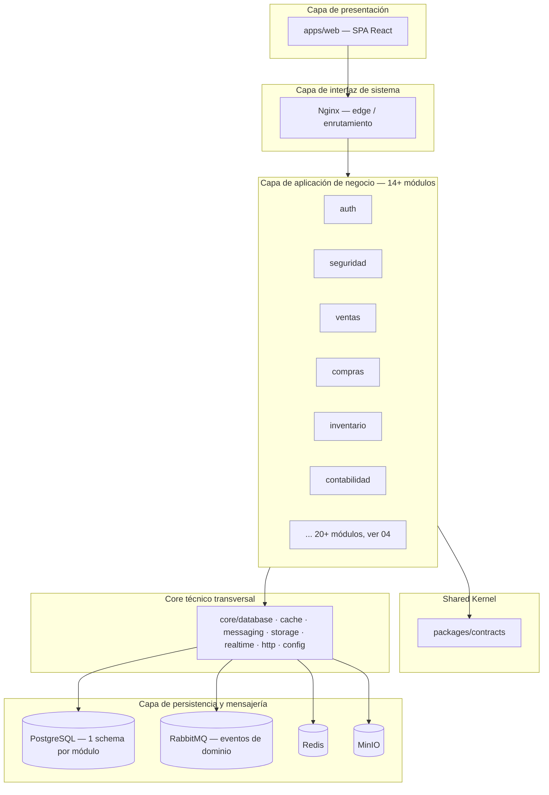
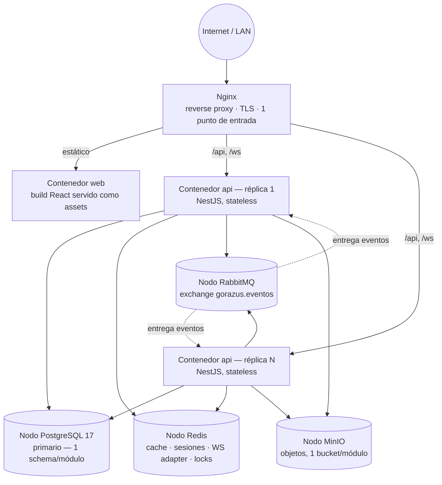
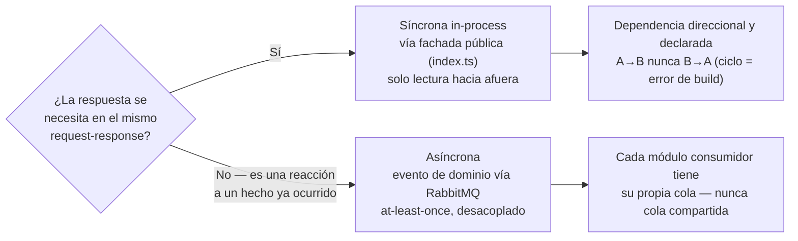
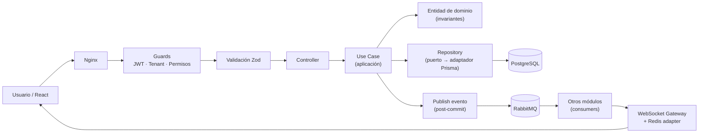
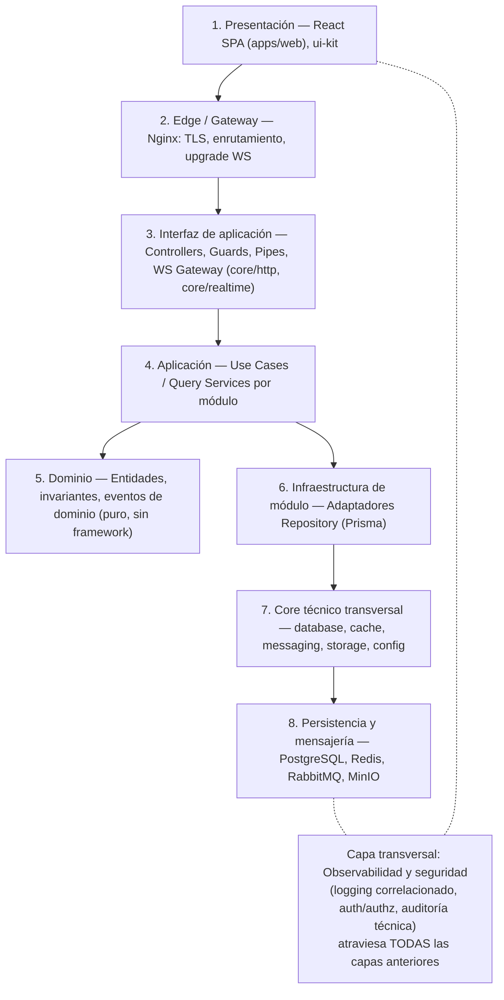

# 00 — Arquitectura general del ERP (vista consolidada)

> Versión 1.0 — 2026-07-13. Este documento es un **punto de entrada**,
> no una fuente de verdad paralela: consolida en una sola vista las
> nueve dimensiones de arquitectura de GORAZUS (lógica, física,
> software, infraestructura, comunicación, flujo de información, capas,
> buenas prácticas, estándares), señalando en cada sección dónde vive
> el detalle normativo completo. Donde este documento y un documento
> numerado (01-11) parezcan divergir, **el documento numerado manda**
> — este es un mapa, no el territorio. Cambios de fondo se documentan
> primero en el documento correspondiente y se reflejan acá después,
> según el proceso de [11-gobernanza-y-adrs.md](./11-gobernanza-y-adrs.md).

## 0. Resumen ejecutivo

GORAZUS es un **monolito modular** (NestJS + React + PostgreSQL),
construido con Clean Architecture + DDD + SOLID, con fronteras de
módulo estrictas y verificadas por herramienta (Nx), diseñado para que
la extracción futura de cualquier módulo a microservicio sea un cambio
de infraestructura y no una reescritura. Referencia completa de la
visión y principios rectores: [README.md](./README.md).

---

## 1. Arquitectura lógica

La arquitectura lógica responde "¿qué unidades de negocio existen y
quién es dueño de qué?" — independiente de en qué proceso o servidor
corran físicamente.

Puntos clave (detalle completo en los documentos citados):

- La unidad lógica de negocio es el **módulo** (bounded context DDD),
  no la tabla ni el endpoint. Catálogo completo de los 27 módulos,
  entidades de las que cada uno es dueño y sus colaboraciones:
  [04-catalogo-modulos-negocio.md](./04-catalogo-modulos-negocio.md).
- La organización lógica del código (qué carpeta puede importar qué)
  está descrita en
  [01-estructura-monorepo.md](./01-estructura-monorepo.md).
- Todo módulo comparte solo dos superficies con el resto del sistema:
  su fachada pública (`index.ts`) y sus eventos de dominio — ver
  sección 5 de este documento y
  [06-comunicacion-entre-modulos.md](./06-comunicacion-entre-modulos.md).
- El **Shared Kernel** (`packages/contracts`) es deliberadamente
  mínimo — value objects universales y contexto transversal, nunca
  entidades de negocio de un módulo específico.

---

## 2. Arquitectura física

La arquitectura física responde "¿en qué procesos, contenedores y
nodos corre esto realmente?". Esta vista **no existe hoy como diagrama
único** en el resto de la documentación — 08 describe la topología
Docker Compose por servicio; acá se consolida como vista de despliegue.

| Nodo físico/lógico  | Naturaleza                                       | Escalado                                                                                                                                                                     | Referencia                                                                                                                                   |
| ------------------- | ------------------------------------------------ | ---------------------------------------------------------------------------------------------------------------------------------------------------------------------------- | -------------------------------------------------------------------------------------------------------------------------------------------- |
| Nginx / `Ingress`   | Stateless, single point of entry                 | Vertical (1 instancia suele bastar) o activo-pasivo                                                                                                                          | [08 §1-2](./08-infraestructura-y-despliegue.md#1-topología-docker-compose)                                                                   |
| `api` (NestJS)      | **Stateless** (sesión vía JWT)                   | Horizontal, N réplicas sin coordinación adicional (`HorizontalPodAutoscaler` en K8s, ver [31 §2](./31-infraestructura-completa.md#2-kubernetes--adoptado-decisión-revisada)) | [08 §7](./08-infraestructura-y-despliegue.md#7-escalado-horizontal)                                                                          |
| `web` (React build) | Estático                                         | Horizontal trivial / CDN en producción                                                                                                                                       | [08 §1](./08-infraestructura-y-despliegue.md#1-topología-docker-compose)                                                                     |
| PostgreSQL          | **Stateful**, un único primario en fase monolito | Failover automático vía Patroni (posiblemente como operator de K8s)                                                                                                          | [docs/database/10](../database/10-estrategia-alta-disponibilidad.md), [10-evolucion-a-microservicios.md](./10-evolucion-a-microservicios.md) |
| Redis               | Stateful (cache/sesión/WS/locks)                 | Sentinel, HA ya diseñada                                                                                                                                                     | [31 §11](./31-infraestructura-completa.md#11-alta-disponibilidad--gap-cerrado-para-redisrabbitmqminio)                                       |
| RabbitMQ            | Stateful (colas por módulo consumidor)           | Cluster con quorum queues, HA ya diseñada                                                                                                                                    | [31 §11](./31-infraestructura-completa.md#11-alta-disponibilidad--gap-cerrado-para-redisrabbitmqminio)                                       |
| MinIO               | Stateful (objetos)                               | Modo distribuido con erasure coding, HA ya diseñada                                                                                                                          | [31 §11](./31-infraestructura-completa.md#11-alta-disponibilidad--gap-cerrado-para-redisrabbitmqminio)                                       |

Desde [31-infraestructura-completa §2](./31-infraestructura-completa.md#2-kubernetes--adoptado-decisión-revisada),
`staging`/`production` orquestan esta topología con Kubernetes;
`local` sigue en Docker Compose. La topología física es
intencionalmente la **misma forma** en los tres entornos — solo
cambian réplicas, recursos y qué puertos de administración quedan
expuestos (tabla de entornos en
[08 §6](./08-infraestructura-y-despliegue.md#6-entornos)). Esto evita
la clase de bug "funciona en mi entorno" causada por topologías
distintas entre ambientes.

**Camino de evolución física:** cuando un módulo se extrae a
microservicio, gana su propio nodo/contenedor y, si corresponde, su
propia instancia de Postgres — proceso detallado en
[10-evolucion-a-microservicios.md §3](./10-evolucion-a-microservicios.md#3-proceso-de-extracción-strangler-fig).

---

## 3. Arquitectura de software

La arquitectura de software responde "¿cómo está construido el código
por dentro?" — patrones, capas internas y principios de diseño.

### 3.1 Principios rectores aplicados (no repetidos, ver tabla completa en [README §2](./README.md#2-principios-rectores))

Clean Architecture/Hexagonal, SOLID, DRY, KISS y "preparado para
microservicios" se aplican **dentro de cada módulo** (capas
concéntricas: dominio → aplicación → infraestructura/interfaz, regla
de dependencia hacia adentro) — detalle completo backend en
[02](./02-arquitectura-modulos-backend.md) y frontend en
[03](./03-arquitectura-modulos-frontend.md).

### 3.2 Catálogo de patrones de diseño usados (vista consolidada — no existe hoy en un solo lugar)

| Patrón                                          | Dónde se usa                                                                                                         | Problema que resuelve                                                                         |
| ----------------------------------------------- | -------------------------------------------------------------------------------------------------------------------- | --------------------------------------------------------------------------------------------- |
| **Ports & Adapters (Hexagonal)**                | `repositories/` (interfaz vs. implementación Prisma)                                                                 | Desacoplar el dominio del motor de persistencia concreto                                      |
| **Use Case / Command**                          | `services/*.usecase.ts`                                                                                              | Una operación de negocio = una unidad testeable con `execute()`                               |
| **Repository**                                  | `*.repository.ts` (puerto) + `*.repository.prisma.ts` (adaptador)                                                    | Ocultar detalles de acceso a datos detrás de una interfaz orientada al dominio                |
| **Facade**                                      | `index.ts` de cada módulo                                                                                            | Única superficie pública que otros módulos pueden importar                                    |
| **DTO + Validator (Zod como fuente única)**     | `dto/`, `validators/`, reexportado en `shared/contracts`                                                             | Un solo lugar de verdad para la forma de los datos, compartido FE↔BE                          |
| **Domain Event / Publish-Subscribe**            | `events/*.event.ts` + RabbitMQ                                                                                       | Desacople real entre módulos, consistencia eventual                                           |
| **CQRS ligero (sin event sourcing)**            | Separación de `*.usecase.ts` (comandos) vs. `*-query.service.ts` (lecturas, fachada pública)                         | Las lecturas cross-módulo no deben pasar por la misma ruta que las escrituras transaccionales |
| **Adapter**                                     | Adaptador Redis del WebSocket Gateway                                                                                | Permitir fan-out de eventos en tiempo real entre réplicas stateless de `api`                  |
| **Aggregate (DDD táctico, vía "módulo dueño")** | Patrón "módulo dueño" ([06 §4](./06-comunicacion-entre-modulos.md#4-patrón-módulo-dueño-para-entidades-compartidas)) | Un único módulo controla las invariantes de una entidad compartida entre varios               |

### 3.3 Frontend: patrones de datos

Estado de servidor = TanStack Query (nunca duplicado en estado local),
formularios = React Hook Form + Zod compartido con backend, rutas
federadas por módulo y ensambladas en `apps/web`. Detalle completo:
[03-arquitectura-modulos-frontend.md](./03-arquitectura-modulos-frontend.md).

---

## 4. Arquitectura de infraestructura

Cubierta en detalle en
[08-infraestructura-y-despliegue.md](./08-infraestructura-y-despliegue.md)
(Docker Compose, Nginx, Redis, RabbitMQ, MinIO, entornos, escalado). Se
consolidan acá los **cross-cutting concerns** de infraestructura que
hoy están repartidos entre 07 y 08, y se identifican explícitamente los
puntos aún **no decididos** (candidatos a ADR, no defectos):

| Concern transversal                        | Estado actual                                                                                       | Referencia                                                            |
| ------------------------------------------ | --------------------------------------------------------------------------------------------------- | --------------------------------------------------------------------- |
| Configuración                              | Validación fail-fast con Zod al boot (`core/config`)                                                | [08 §6](./08-infraestructura-y-despliegue.md#6-entornos)              |
| Secretos                                   | `.env` fuera de control de versiones; sin gestor de secretos centralizado aún                       | [08 §6](./08-infraestructura-y-despliegue.md#6-entornos)              |
| Logging                                    | Estructurado (JSON), correlación por `empresaId`/`userId`/`requestId`                               | [07 §6](./07-convenciones-y-estandares.md#6-logging-y-observabilidad) |
| **Observabilidad (métricas, trazas, APM)** | **No definido aún** — logging existe, pero no hay decisión de stack de métricas/tracing distribuido | _Gap — ver §10_                                                       |
| **CI/CD**                                  | No documentado aún como arquitectura (solo se infiere de Nx affected + trunk-based)                 | _Gap — ver §10_                                                       |
| **Gestión de secretos en producción**      | No definido (Vault, AWS/GCP Secret Manager, etc.)                                                   | _Gap — ver §10_                                                       |

---

## 5. Comunicación entre módulos

Regla de oro (detalle completo y ejemplos:
[06-comunicacion-entre-modulos.md](./06-comunicacion-entre-modulos.md)):
**solo dos formas válidas de comunicación**, nunca acceso directo a
código o tablas de otro módulo.

Complementan esta regla: el **Shared Kernel** mínimo
(`packages/contracts`) y el patrón **módulo dueño** para entidades
compartidas (`Cliente`, `Producto`, `CuentaContable`) — ningún módulo
que no sea el dueño escribe esa entidad, aunque varios la lean.

---

## 6. Flujo de información

Los dos flujos normativos completos (secuencia paso a paso, manejo de
errores, y por qué **no** hay transacciones distribuidas entre
módulos) están en
[05-flujo-de-datos.md](./05-flujo-de-datos.md): request HTTP estándar
y evento en tiempo real vía WebSocket.

Vista consolidada de extremo a extremo (las capas por las que cruza
cualquier flujo, síncrono o asíncrono):

Principios que gobiernan este flujo en todo el sistema, no solo en un
módulo:

1. El aislamiento multiempresa (`empresaId`) se resuelve **antes** de
   que corra cualquier lógica de negocio (`TenantInterceptor`) — ver
   [09 §3](./09-seguridad-y-multiempresa.md#3-multiempresa-multi-tenant).
2. Un evento de dominio se publica **después** de confirmada la
   transacción local, nunca antes.
3. Las escrituras que cruzan módulos usan **consistencia eventual +
   compensación explícita**, nunca una transacción distribuida — el
   mismo modelo que tendrán los módulos el día que sean
   microservicios reales
   ([05 §4](./05-flujo-de-datos.md#4-escrituras-que-cruzan-módulos-sin-transacciones-distribuidas)).
4. Un error de dominio nunca llega al cliente como 500 genérico —
   siempre mapeado a un código estable
   ([05 §3](./05-flujo-de-datos.md#3-manejo-de-errores-en-el-flujo)).

---

## 7. Capas del sistema

Existen **dos niveles de "capas"** en GORAZUS y es importante no
confundirlos:

**(a) Capas de todo el sistema** (vista nueva, consolidada acá por
primera vez — los documentos 01-11 solo cubren, cada uno, una capa
puntual):

**(b) Capas internas de un módulo backend** (Clean Architecture/
Hexagonal — dominio, aplicación, infraestructura, interfaz): esta es
la vista de la capa 4-6 de arriba, expandida por módulo, y está
documentada en detalle exclusivamente en
[02-arquitectura-modulos-backend.md §1](./02-arquitectura-modulos-backend.md#1-las-capas-y-la-regla-de-dependencia)
— no se repite acá.

La regla que conecta ambas vistas: **la capa 5 (Dominio) nunca conoce
la capa 2 (Nginx) ni la capa 8 (PostgreSQL)** — la dependencia siempre
apunta hacia adentro, sea a nivel de todo el sistema o a nivel de un
módulo individual.

---

## 8. Buenas prácticas

Consolidado de principios que aplican a **todo** el sistema (el detalle
normativo completo de estándares está en
[07-convenciones-y-estandares.md](./07-convenciones-y-estandares.md)):

- **Regla de dependencia hacia adentro**, siempre — a nivel de capas
  del sistema (§7) y a nivel de capas de módulo ([02](./02-arquitectura-modulos-backend.md)).
- **Un módulo, un dueño de datos** — nunca dos módulos escriben la
  misma entidad ([04](./04-catalogo-modulos-negocio.md),
  [06 §4](./06-comunicacion-entre-modulos.md#4-patrón-módulo-dueño-para-entidades-compartidas)).
- **Fail fast en configuración** — la aplicación no arranca con
  configuración inválida, en vez de fallar en producción con error
  críptico ([08 §6](./08-infraestructura-y-despliegue.md#6-entornos)).
- **Un solo lugar de verdad de validación** (Zod), compartido FE↔BE
  ([07 §7](./07-convenciones-y-estandares.md#7-validación)).
- **Ningún módulo reimplementa infraestructura transversal** (logging,
  autorización, cache) — todo pasa por `core/*`
  ([07 §6](./07-convenciones-y-estandares.md#6-logging-y-observabilidad),
  [09](./09-seguridad-y-multiempresa.md)).
- **Alcance real, no simetría** — ningún módulo hereda pantallas o
  capacidades de otro "porque los demás las tienen"
  ([04, nota de alcance](./04-catalogo-modulos-negocio.md#nota-de-alcance-leer-antes-que-la-tabla)).
- **Pirámide de testing por capa**, con foco en flujos transaccionales
  de alto costo de bug (ventas, compras, caja, contabilidad) — no
  cobertura e2e uniforme forzada en todos los módulos
  ([07 §5](./07-convenciones-y-estandares.md#5-testing)).
- **Ningún cambio de arquitectura se aplica retroactivamente en
  silencio** — se migra módulo por módulo cuando se justifica
  ([11 §3](./11-gobernanza-y-adrs.md#3-versionado-de-este-documento-de-arquitectura)).

---

## 9. Estándares

Referencia normativa única y completa:
[07-convenciones-y-estandares.md](./07-convenciones-y-estandares.md)
— cubre naming (archivos, clases, eventos, DTOs), idioma (dominio en
español / técnica en inglés), Git (trunk-based, Conventional Commits,
CODEOWNERS por módulo), contrato REST (versionado `/api/v1`, formato
de respuesta y error, paginación), testing por capa, logging
estructurado y validación única con Zod. No se repite acá para evitar
que este documento y 07 diverjan con el tiempo — cualquier cambio de
estándar se hace en 07 y se hereda automáticamente por referencia.

---

## 10. Gaps identificados (candidatos a ADR, no decisiones tomadas)

Al consolidar las nueve vistas surgieron puntos de arquitectura de
infraestructura que en su momento no tenían decisión documentada.
**Estado actualizado (2026-07-13, tras
[31-infraestructura-completa.md](./31-infraestructura-completa.md))**:
tres de los cinco ya se cerraron como diseño de arquitectura; siguen
listados acá por trazabilidad, marcados según su estado. Cada punto
cerrado sigue requiriendo su propio ADR de implementación según
[11-gobernanza-y-adrs.md](./11-gobernanza-y-adrs.md) antes de
construirse — estos documentos fijan la arquitectura objetivo, no
reemplazan ese ADR:

1. ✅ **Observabilidad** — cerrado en
   [31-infraestructura-completa §9](./31-infraestructura-completa.md#9-monitoreo--gap-cerrado-identificado-en-00-arquitectura-general-10)
   (OpenTelemetry + Prometheus + Grafana, trace ID reutilizando el
   `requestId` ya existente en los logs).
2. ✅ **CI/CD** — cerrado en
   [31-infraestructura-completa §7-8](./31-infraestructura-completa.md#7-cicd--gap-cerrado-identificado-en-00-arquitectura-general-10)
   (pipeline sobre `nx affected` + 4 workflows de GitHub Actions).
3. **Gestión de secretos en producción** — sigue abierto: reemplazo de
   `.env` por un gestor centralizado (Vault, AWS/GCP/Azure Secret
   Manager) antes de ambientes productivos reales con datos de
   clientes.
4. ✅ **Alta disponibilidad de Redis/RabbitMQ/MinIO** — cerrado en
   [31-infraestructura-completa §11](./31-infraestructura-completa.md#11-alta-disponibilidad--gap-cerrado-para-redisrabbitmqminio)
   (Sentinel, quorum queues, modo distribuido con erasure coding,
   respectivamente), simétrico a lo ya fijado para PostgreSQL.
5. **API Gateway real** — sigue abierto: `Ingress`/Nginx es suficiente
   mientras GORAZUS sea monolito modular o tenga pocos servicios
   extraídos ([10 §4](./10-evolucion-a-microservicios.md#4-qué-no-se-hace)) —
   el umbral específico de "cuántos servicios extraídos ameritan un
   gateway dedicado" sigue sin un número concreto. (Nota: Kubernetes
   en sí ya no es parte de este gap — se adoptó, ver
   [31-infraestructura-completa §2](./31-infraestructura-completa.md#2-kubernetes--adoptado-decisión-revisada) —
   pero eso no resuelve automáticamente la pregunta del API Gateway,
   son dos decisiones independientes.)

---

## 11. Mapa de trazabilidad

| Sección de este documento          | Documento(s) de detalle normativo                                                                               |
| ---------------------------------- | --------------------------------------------------------------------------------------------------------------- |
| 1. Arquitectura lógica             | [01](./01-estructura-monorepo.md), [04](./04-catalogo-modulos-negocio.md)                                       |
| 2. Arquitectura física             | [08](./08-infraestructura-y-despliegue.md), [10](./10-evolucion-a-microservicios.md)                            |
| 3. Arquitectura de software        | [02](./02-arquitectura-modulos-backend.md), [03](./03-arquitectura-modulos-frontend.md)                         |
| 4. Arquitectura de infraestructura | [08](./08-infraestructura-y-despliegue.md)                                                                      |
| 5. Comunicación entre módulos      | [06](./06-comunicacion-entre-modulos.md)                                                                        |
| 6. Flujo de información            | [05](./05-flujo-de-datos.md)                                                                                    |
| 7. Capas del sistema               | [02](./02-arquitectura-modulos-backend.md) (interno de módulo) + §7 de este documento (sistema completo, nuevo) |
| 8. Buenas prácticas                | [07](./07-convenciones-y-estandares.md), [09](./09-seguridad-y-multiempresa.md)                                 |
| 9. Estándares                      | [07](./07-convenciones-y-estandares.md)                                                                         |
| Gobernanza y evolución             | [11](./11-gobernanza-y-adrs.md), [10](./10-evolucion-a-microservicios.md)                                       |
