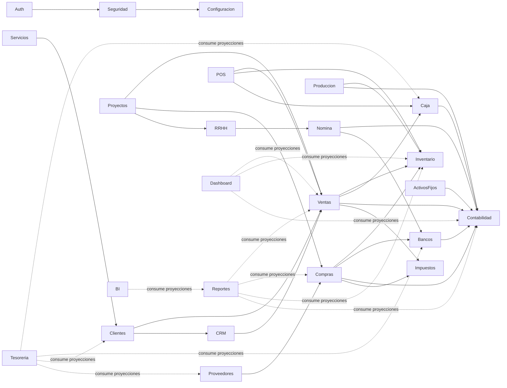

# 04 — Catálogo de módulos de negocio

## Nota de alcance (leer antes que la tabla)

Este catálogo define **fronteras de dominio y propiedad de datos**
(bounded contexts) — no una lista cerrada de pantallas ni funciones.
Ningún módulo debe implementarse asumiendo que necesita el mismo
conjunto de capacidades que otro (Dashboard, Listado, Auditoría,
Exportaciones, etc.) solo por consistencia visual. Cada capacidad se
agrega cuando hay una necesidad de negocio real y confirmada para ese
módulo específico. Lo que sí es fijo desde el diseño es **quién es
dueño de qué entidad** y **quién colabora con quién**, porque eso
determina las fronteras técnicas del monolito modular.

## Mapa de dependencias entre módulos

Las flechas sólidas son dependencias de negocio declaradas (el módulo
origen consume la fachada pública del módulo destino). Las flechas
punteadas indican consumo de solo lectura vía proyecciones/eventos,
nunca escritura.

## Catálogo

| Módulo               | Responsabilidad central                                                                                                                                                 | Entidades de las que es dueño                                                                                                                                                                                                                                                                                                          | Colabora con                                                                                                                                                                                                                                                                                                                                                                         |
| -------------------- | ----------------------------------------------------------------------------------------------------------------------------------------------------------------------- | -------------------------------------------------------------------------------------------------------------------------------------------------------------------------------------------------------------------------------------------------------------------------------------------------------------------------------------- | ------------------------------------------------------------------------------------------------------------------------------------------------------------------------------------------------------------------------------------------------------------------------------------------------------------------------------------------------------------------------------------ |
| **auth**             | Identidad, sesión, login, tokens JWT (access/refresh), recuperación de contraseña                                                                                       | `Usuario` (credenciales), `SesionActiva`                                                                                                                                                                                                                                                                                               | `seguridad` (roles/permisos del usuario autenticado)                                                                                                                                                                                                                                                                                                                                 |
| **seguridad**        | Roles, permisos, políticas de acceso, asignación de permisos por módulo/acción                                                                                          | `Rol`, `Permiso`, `AsignacionRol`                                                                                                                                                                                                                                                                                                      | Todos los módulos consultan `seguridad` para autorizar acciones                                                                                                                                                                                                                                                                                                                      |
| **configuracion**    | Parametrización general: datos de la(s) empresa(s), monedas, series de numeración, parámetros fiscales/regionales, geografía, formas/métodos de pago, listas de precios | `Empresa`, `Moneda`, `SerieNumeracion`, `ParametroSistema`, `FormaDePago`, `MetodoDePago`, `ListaDePrecios` (propiedad fijada en [14-modulo-core.md §15-16](./14-modulo-core.md#15-payment-methods-configurationpayment_forms--payment_methods--banks--dueño-real-configuration), no estaba asignada antes)                            | Todos los módulos leen configuración de empresa activa; `ventas`/`clientes`/`crm` consumen `ListaDePrecios`; `ventas`/`caja`/`bancos` consumen `MetodoDePago`                                                                                                                                                                                                                        |
| **clientes**         | Maestro único de clientes                                                                                                                                               | `Cliente`, `ContactoCliente`, `DireccionCliente`                                                                                                                                                                                                                                                                                       | `ventas`, `crm`, `contabilidad` (cuentas por cobrar)                                                                                                                                                                                                                                                                                                                                 |
| **proveedores**      | Maestro único de proveedores                                                                                                                                            | `Proveedor`, `ContactoProveedor`                                                                                                                                                                                                                                                                                                       | `compras`, `contabilidad` (cuentas por pagar)                                                                                                                                                                                                                                                                                                                                        |
| **productos**        | Maestro único de productos/servicios, variantes, atributos, kits/combos/BOM                                                                                             | `Producto`, `Variante`, `Atributo`, `Kit`, `Combo`, `BOM`                                                                                                                                                                                                                                                                              | `ventas`, `compras`, `inventario` (existencia), `produccion` (BOM) — ver [18-modulo-products.md](./18-modulo-products.md)                                                                                                                                                                                                                                                            |
| **ventas**           | Ciclo de venta: cotización → pedido → factura                                                                                                                           | `Venta`, `LineaVenta`, `Factura`                                                                                                                                                                                                                                                                                                       | `clientes`, `inventario` (verifica/reserva stock), `caja`, `contabilidad`                                                                                                                                                                                                                                                                                                            |
| **compras**          | Ciclo de compra: orden de compra → recepción → factura de proveedor                                                                                                     | `OrdenCompra`, `LineaCompra`, `FacturaCompra`                                                                                                                                                                                                                                                                                          | `proveedores`, `inventario` (ingresa stock), `bancos`, `contabilidad`                                                                                                                                                                                                                                                                                                                |
| **inventario**       | Existencias, movimientos de stock, almacenes, valorización                                                                                                              | `Producto`, `Almacen`, `MovimientoStock`, `Existencia`                                                                                                                                                                                                                                                                                 | `ventas`, `compras`, `pos` — único dueño autorizado a modificar existencias                                                                                                                                                                                                                                                                                                          |
| **caja**             | Movimientos de efectivo, arqueos, cierres de caja                                                                                                                       | `Caja`, `MovimientoCaja`, `ArqueoCaja`                                                                                                                                                                                                                                                                                                 | `ventas`, `pos`, `contabilidad`                                                                                                                                                                                                                                                                                                                                                      |
| **bancos**           | Cuentas bancarias, conciliación, transferencias                                                                                                                         | `CuentaBancaria`, `MovimientoBancario`, `Conciliacion`                                                                                                                                                                                                                                                                                 | `compras`, `contabilidad`                                                                                                                                                                                                                                                                                                                                                            |
| **contabilidad**     | Plan de cuentas, asientos contables, libros                                                                                                                             | `CuentaContable`, `AsientoContable`, `LibroDiario`                                                                                                                                                                                                                                                                                     | Consume eventos de `ventas`, `compras`, `caja`, `bancos` para generar asientos — nunca al revés                                                                                                                                                                                                                                                                                      |
| **impuestos**        | Catálogo y cálculo de impuestos, retenciones, exenciones, declaraciones                                                                                                 | `Impuesto`, `TasaImpuesto`, `RegimenRetencion` (nota: `RegimenRetencion` vive realmente como `configuration.fiscal_regimes`, no como tabla propia de `impuestos` — corregido, ver [46-modulo-taxes.md §1](./46-modulo-taxes.md#1-jurisdicciones-fiscales-y-régimen-tax_jurisdictions--reconciliación-con-configurationfiscal_regimes)) | `ventas`/`compras` referencian tasas, nunca las recalculan — ver [46-modulo-taxes.md](./46-modulo-taxes.md) (diseño completo, antes solo [logico/12-taxes.md](../database/logico/12-taxes.md))                                                                                                                                                                                       |
| **crm**              | Oportunidades, seguimiento comercial, actividades con clientes/prospectos                                                                                               | `Oportunidad`, `Actividad`, `Prospecto`                                                                                                                                                                                                                                                                                                | `clientes`, alimenta a `ventas` cuando una oportunidad se convierte en venta                                                                                                                                                                                                                                                                                                         |
| **pos**              | Punto de venta físico: venta rápida, turno de caja, ticket                                                                                                              | Ninguna propia — orquesta `ventas` + `inventario` + `caja` en flujo optimizado para mostrador                                                                                                                                                                                                                                          | `ventas`, `inventario`, `caja`                                                                                                                                                                                                                                                                                                                                                       |
| **produccion**       | Órdenes de fabricación, listas de materiales (BOM), planificación                                                                                                       | `OrdenProduccion`, `ListaMateriales` (`CentroTrabajo` retirado de esta fila — sin tabla real, ver [38-modulo-production.md §7](./38-modulo-production.md#7-explícitamente-no-diseñado--requiere-confirmar-necesidad-de-negocio))                                                                                                       | `inventario` (consume materia prima, ingresa producto terminado), `contabilidad` (costo de producción)                                                                                                                                                                                                                                                                               |
| **servicios**        | Órdenes de servicio, contratos, mantenimiento post-venta                                                                                                                | `OrdenServicio`, `ContratoServicio`                                                                                                                                                                                                                                                                                                    | `clientes`, `inventario` (repuestos) — **no** `activos-fijos`: corregido, ver [39-modulo-services.md §4](./39-modulo-services.md#4-equipos-bajo-servicio--dos-conceptos-que-no-se-conectan-a-propósito) (equipo de cliente bajo servicio y activo fijo propio son conceptos distintos, sin FK entre ellos)                                                                           |
| **recursos-humanos** | Legajo de empleados, contratos, estructura organizacional, ausencias                                                                                                    | `Empleado`, `Contrato`, `Puesto`, `Ausencia`                                                                                                                                                                                                                                                                                           | Alimenta a `nomina`; `seguridad` (usuario del sistema vinculado al empleado)                                                                                                                                                                                                                                                                                                         |
| **nomina**           | Cálculo y liquidación de sueldos, cargas sociales, retenciones                                                                                                          | `Liquidacion`, `ConceptoNomina`, `Prestamo`                                                                                                                                                                                                                                                                                            | `recursos-humanos` (datos del empleado), `contabilidad` (asiento de sueldos), `bancos` (pago por transferencia)                                                                                                                                                                                                                                                                      |
| **activos-fijos**    | Registro, depreciación y baja de bienes de uso                                                                                                                          | `ActivoFijo`, `Depreciacion`                                                                                                                                                                                                                                                                                                           | `contabilidad` (asiento de depreciación), `compras` (alta por compra)                                                                                                                                                                                                                                                                                                                |
| **proyectos**        | Planificación, costeo y seguimiento de proyectos                                                                                                                        | `Proyecto`, `TareaProyecto`, `AsignacionRecurso`                                                                                                                                                                                                                                                                                       | `ventas` (facturación de proyecto), `compras` (costos del proyecto), `recursos-humanos` (horas de personal), `documentos` (adjuntos vía `core.documents`, agregado — ver [40-modulo-projects.md §10](./40-modulo-projects.md#10-integración-con-otros-módulos--códigos-de-evento-y-aclaración-de-alcance-del-menú); `produccion` señalado en el menú pero sin FK real, no se agrega) |
| **documentos**       | Repositorio documental transversal, versionado, flujos de aprobación                                                                                                    | `Documento`, `VersionDocumento`, `AprobacionDocumento`                                                                                                                                                                                                                                                                                 | Cualquier módulo puede adjuntar documentos referenciando su propio registro por ID — `documentos` nunca conoce el detalle de negocio del documento adjunto                                                                                                                                                                                                                           |
| **reportes**         | Agregación y presentación de información entre módulos (reportes formales/imprimibles)                                                                                  | Ninguna propia — solo proyecciones de solo lectura                                                                                                                                                                                                                                                                                     | Consume de todos los módulos vía eventos/proyecciones, nunca escribe en otros módulos                                                                                                                                                                                                                                                                                                |
| **bi**               | Tableros analíticos, KPIs, análisis multidimensional                                                                                                                    | Ninguna propia — modelo analítico derivado (data mart de solo lectura)                                                                                                                                                                                                                                                                 | Consume proyecciones agregadas, típicamente ya pasadas por `reportes`                                                                                                                                                                                                                                                                                                                |
| **administracion**   | Administración técnica del sistema: respaldo, integraciones, salud del sistema, importación/exportación masiva                                                          | `TareaProgramada`, `RegistroImportacion`, `IntegracionExterna`                                                                                                                                                                                                                                                                         | Transversal — opera sobre la infraestructura, no sobre datos de negocio de otros módulos                                                                                                                                                                                                                                                                                             |
| **tesoreria**        | Consolidación de posición de caja y bancos, flujo de fondos proyectado                                                                                                  | Ninguna propia — vista consolidada de solo lectura                                                                                                                                                                                                                                                                                     | Consume proyecciones de `caja`, `bancos`, `clientes` (CxC) y `proveedores` (CxP)                                                                                                                                                                                                                                                                                                     |
| **dashboard**        | Panel de inicio con indicadores clave de todos los módulos                                                                                                              | Ninguna propia                                                                                                                                                                                                                                                                                                                         | Consume proyecciones de los módulos habilitados para la empresa/usuario                                                                                                                                                                                                                                                                                                              |

## Notas de diseño por caso especial

### `auth` vs `seguridad`: por qué son dos módulos y no uno

`auth` responde "¿quién sos y estás logueado?" (autenticación). `seguridad`
responde "¿qué podés hacer?" (autorización). Se separan porque tienen
ciclos de vida y complejidad distintos: `auth` es infraestructura de
identidad relativamente estable; `seguridad` es donde crece la
complejidad de negocio (roles por empresa, permisos granulares por
módulo y acción, más adelante posiblemente jerarquías de rol). Fusionarlos
mezclaría una preocupación técnica con una de negocio.

### `pos` no tiene entidades propias

El punto de venta es un **caso de uso compuesto**, no un dominio de
datos nuevo. Una venta hecha por POS es, en el modelo de datos, una
`Venta` igual que una hecha desde el módulo `ventas` — con un canal
distinto. Esto evita el error clásico de sistemas POS que terminan con
su propio maestro de ventas paralelo al del resto del ERP.

### `reportes` nunca es dueño de datos

Ningún módulo depende de `reportes` para funcionar — es puramente un
consumidor. Esto es deliberado: si `reportes` tuviera lógica de negocio
propia que otros módulos necesitaran, se convertiría en un cuello de
botella y en un candidato a ciclo de dependencias. Ver
[06-comunicacion-entre-modulos.md](./06-comunicacion-entre-modulos.md)
para el patrón de proyecciones que usa.

### `contabilidad` como consumidor, no como orquestador

La contabilidad **nunca** le dice a `ventas` o `compras` cómo operar —
reacciona a hechos ya ocurridos (`VentaConfirmada`, `FacturaCompraRegistrada`)
generando los asientos correspondientes. Esto refleja la realidad de
negocio (la contabilidad registra lo que pasó, no lo autoriza) y evita
acoplar los módulos operativos a las reglas del plan de cuentas.

### Entidades compartidas entre módulos: patrón "módulo dueño"

`Cliente`, `Producto`, `CuentaContable` son usados por múltiples
módulos pero **tienen un único dueño**. El resto los referencia por ID
y consume una proyección de solo lectura publicada por el dueño — nunca
los duplica ni los escribe. Detalle completo en
[06-comunicacion-entre-modulos.md](./06-comunicacion-entre-modulos.md).

### `tesoreria` vs `caja` + `bancos`: por qué son módulos distintos

`caja` y `bancos` son los **dueños operativos** de sus movimientos
(cada uno registra sus propias transacciones). `tesoreria` no registra
nada — es una capa de consolidación que responde "¿cuánta liquidez
tenemos hoy y cuánta vamos a tener en 30/60/90 días, considerando lo
que nos deben y lo que debemos?". Separarlo evita que `caja` o `bancos`
carguen con lógica de proyección financiera que no les corresponde, y
evita que la consolidación se vuelva, sin querer, una tercera fuente de
verdad sobre los mismos movimientos.

### `bi` vs `reportes`: por qué son módulos distintos

`reportes` produce salidas formales con layout fijo (un reporte de IVA,
un estado de cuenta) — la unidad de trabajo es "el reporte tal como se
imprime o exporta". `bi` produce tableros interactivos, KPIs y análisis
multidimensional (drill-down, comparación de períodos) — la unidad de
trabajo es "la pregunta que el usuario arma en el momento". Fusionarlos
obligaría a que ambos casos de uso, con necesidades de rendimiento y de
UI muy distintas, compitan por el mismo modelo de datos.

### `administracion` vs `seguridad`: por qué son módulos distintos

`seguridad` es autorización de negocio (quién puede hacer qué dentro
del ERP). `administracion` es operación técnica del sistema en sí
(programar respaldos, ver salud de colas/eventos, ejecutar
importaciones masivas, gestionar integraciones externas). Un usuario
puede tener acceso administrativo del negocio sin tener acceso a la
administración técnica del sistema, y viceversa (típicamente un rol de
IT externo).

### `documentos` como repositorio transversal, no como dueño de negocio

`documentos` almacena y versiona archivos (adjuntos, comprobantes
escaneados, contratos) pero nunca interpreta su contenido de negocio.
Cualquier módulo que necesite adjuntar un archivo a uno de sus registros
(una factura, un contrato de RRHH, una orden de compra) usa el servicio
público de `documentos` pasando una referencia (`moduloOrigen`,
`entidadId`) — `documentos` no sabe qué es una "factura", solo que
alguien le pidió guardar un archivo asociado a ese ID.

### `dashboard` como composición pura, igual que `pos`

El panel de inicio no tiene entidades propias ni lógica de negocio: es
un ensamblador de widgets, cada uno alimentado por la proyección de
solo lectura del módulo correspondiente. Qué widgets ve cada usuario
depende de los permisos que ya tiene sobre esos módulos — `dashboard`
no define permisos nuevos.
