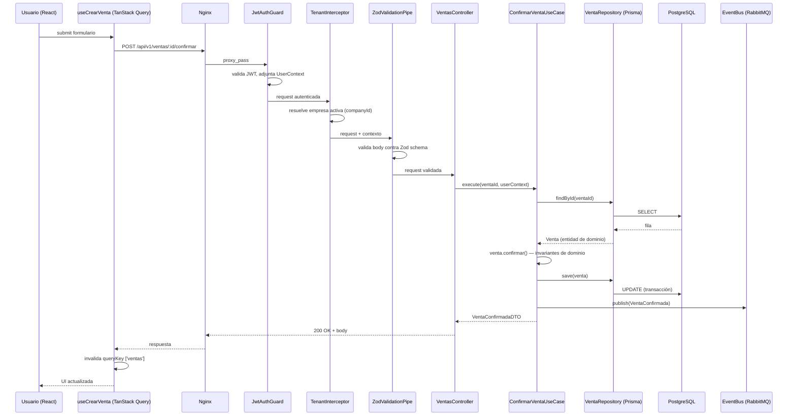
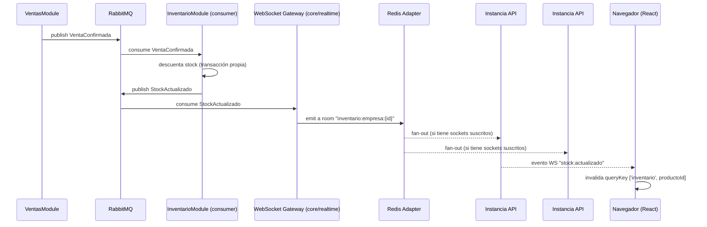

# 05 — Flujo de datos

## 1. Ciclo de vida de una request HTTP estándar

Ejemplo: el usuario confirma una venta desde el frontend.

Puntos clave:

- El `TenantInterceptor` resuelve la empresa activa **antes** de que
  cualquier lógica de negocio corra — ningún repositorio puede olvidar
  el filtro de empresa porque lo aplica la capa base (ver
  [09-seguridad-y-multiempresa.md](./09-seguridad-y-multiempresa.md)).
- La publicación del evento (`VentaConfirmada`) ocurre **después** de
  que la transacción de base de datos se confirmó, nunca antes — de lo
  contrario otros módulos podrían reaccionar a un cambio que luego se
  revierte.
- El controller nunca toca `R` (repository) ni `DB` directamente.

## 2. Ciclo de vida de un evento en tiempo real (WebSocket)

Ejemplo: `inventario` decrementa stock tras la venta y todos los clientes
con la pantalla de inventario abierta lo ven sin refrescar.

- El **Redis Adapter** es obligatorio en cuanto haya más de una
  instancia de `apps/api` corriendo (horizontal scaling): sin él, un
  socket conectado a la instancia #2 nunca recibiría un evento emitido
  por la instancia #1.
- El frontend nunca actualiza estado local a mano al recibir el evento
  WS — invalida la query correspondiente y deja que TanStack Query
  vuelva a pedir la fuente de verdad. Evita divergencias entre lo que
  muestra la UI y lo que hay en base de datos.

## 3. Manejo de errores en el flujo

- Cualquier excepción de dominio (`VentaYaConfirmadaError`,
  `StockInsuficienteError`) extiende una base común en `core/http` y es
  traducida por un `ExceptionFilter` global a un formato de error HTTP
  consistente (ver
  [07-convenciones-y-estandares.md](./07-convenciones-y-estandares.md)
  para el contrato exacto de error).
- Un error de dominio **nunca** llega al cliente como un 500 genérico:
  el filtro mapea excepciones de negocio conocidas a 4xx con un código
  de error estable (`VENTA_YA_CONFIRMADA`) que el frontend puede usar
  para mostrar un mensaje específico, no solo "ocurrió un error".

## 4. Escrituras que cruzan módulos: sin transacciones distribuidas

Cuando confirmar una venta requiere tocar `ventas`, `inventario` y
`caja`, **no se abre una única transacción de base de datos que cruce
los tres schemas**. Cada módulo confirma su propia transacción local y
notifica a los demás por evento. Si un paso downstream falla (p. ej.
`inventario` no tiene stock), el flujo se resuelve con compensación
explícita (p. ej. `ventas` escucha `StockInsuficiente` y revierte el
estado de la venta a "pendiente de stock"), no con rollback distribuido.
Esto es deliberado: es el mismo patrón que se necesitará cuando estos
módulos sean servicios separados, así que se adopta desde el monolito
para no tener que rediseñar el flujo de datos más adelante. Detalle en
[06-comunicacion-entre-modulos.md](./06-comunicacion-entre-modulos.md).
