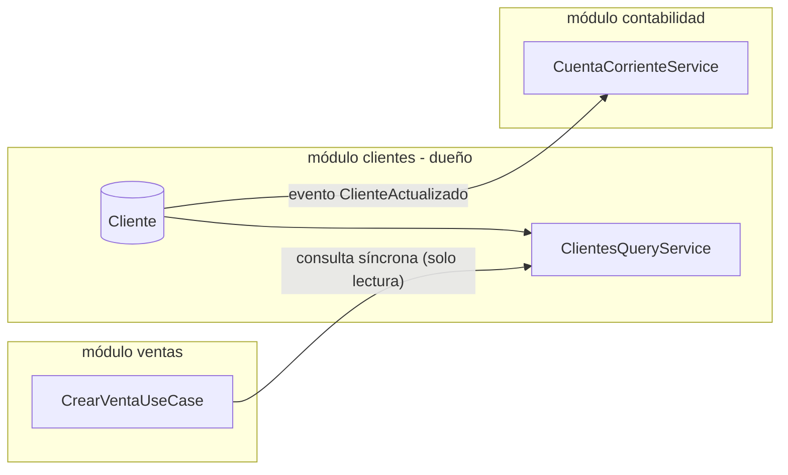

# 06 — Comunicación entre módulos

Este es el documento más importante para mantener la modularidad en el
tiempo. La mayoría de los "monolitos modulares" fallan no por su
estructura de carpetas inicial, sino porque con el tiempo los módulos
empiezan a llamarse entre sí sin disciplina. Estas reglas existen para
evitarlo.

## 1. Dos formas de comunicación, y solo dos

### a) Síncrona in-process — a través de la fachada pública

Un módulo puede llamar directamente a otro **solo** a través del
servicio exportado en su `index.ts` (ver
[01-estructura-monorepo.md](./01-estructura-monorepo.md#4-anatomía-de-un-módulo-vista-desde-la-raíz)).

```ts
// modules/ventas/backend/services/crear-venta.usecase.ts
import { InventarioQueryService } from '@gorazus/modules/inventario';

class CrearVentaUseCase {
  constructor(private readonly inventario: InventarioQueryService) {}

  async execute(input: CrearVentaInput) {
    const disponible = await this.inventario.verificarDisponibilidad(input.lineas);
    // ...
  }
}
```

Se usa cuando la respuesta se necesita **en el mismo request-response**
(p. ej. validar disponibilidad de stock antes de confirmar una venta).
`InventarioQueryService` es de solo lectura hacia afuera: ningún módulo
externo puede pedirle a `inventario` que modifique stock por esta vía —
eso solo ocurre a través de eventos, para que el módulo dueño conserve
control total sobre sus invariantes.

**Regla dura:** `ventas` puede depender de `inventario`, pero
`inventario` **nunca** importa nada de `ventas`. Las dependencias entre
módulos de negocio son direccionales y están declaradas explícitamente
en el `README.md` de cada módulo y en sus tags de Nx. Un ciclo de
dependencias entre módulos (`A` depende de `B` que depende de `A`) es un
error de build, no una advertencia.

### b) Asíncrona — eventos de dominio vía RabbitMQ

Se usa para todo lo que es una **reacción** a un hecho ya ocurrido, no
una pregunta que necesita respuesta inmediata.

```ts
// modules/ventas/backend/events/venta-confirmada.event.ts
export class VentaConfirmadaEvent {
  constructor(
    readonly ventaId: string,
    readonly empresaId: string,
    readonly clienteId: string,
    readonly lineas: { productoId: string; cantidad: number }[],
    readonly ocurridoEn: Date,
  ) {}
}
```

- `ventas` publica `VentaConfirmadaEvent` a un exchange de RabbitMQ
  (`gorazus.eventos`, topic exchange, routing key `ventas.venta.confirmada`).
- `inventario`, `contabilidad` y `caja` cada uno tiene su propia cola
  suscrita a las routing keys que le interesan. Si `contabilidad` está
  caído, `ventas` sigue funcionando — el evento espera en la cola.
- **Aun en fase de monolito**, los eventos entre módulos pasan por
  RabbitMQ y no por un `EventEmitter` en memoria. Es deliberadamente más
  costoso que un emisor en proceso, a cambio de que el comportamiento
  (at-least-once delivery, posibilidad de reproceso, desacople real) sea
  idéntico al que tendrá cuando estos módulos sean servicios separados.
  Ver [10-evolucion-a-microservicios.md](./10-evolucion-a-microservicios.md).

## 2. Qué NO es comunicación válida entre módulos

- ❌ Importar un archivo interno de otro módulo
  (`modules/inventario/backend/repositories/producto.repository`).
- ❌ Leer la tabla de otro módulo con una query directa, aunque estén en
  la misma base de datos física.
- ❌ Una FK de Postgres entre schemas de módulos distintos.
- ❌ Un módulo modificando el estado de una entidad que no le pertenece,
  aunque técnicamente pudiera (p. ej. `ventas` marcando un `Producto`
  como agotado directamente).

## 3. Shared Kernel: qué vive en `packages/contracts`

El Shared Kernel es el único código que **todos** los módulos pueden
importar sin que cuente como una dependencia módulo-a-módulo. Se
mantiene deliberadamente pequeño:

- Value objects universales: `Money`, `Porcentaje`, `RangoFecha`.
- Contexto transversal: `TenantId`, `UserContext`, `AuditMeta`
  (quién/cuándo creó o modificó un registro).
- Tipos de error base y códigos de error compartidos.

**Lo que NO va en el Shared Kernel:** cualquier tipo que represente un
concepto de negocio de un módulo específico (`Cliente`, `Producto`,
`AsientoContable`). Si dos módulos necesitan "una versión resumida" de
una entidad ajena, eso es una proyección publicada por el módulo dueño
(sección siguiente), no un tipo compartido inventado a mitad de camino.

Cada adición al Shared Kernel es una decisión arquitectónica — pasa por
el proceso de ADR (ver
[11-gobernanza-y-adrs.md](./11-gobernanza-y-adrs.md)) porque cada tipo
agregado ahí se vuelve, en la práctica, casi imposible de cambiar sin
tocar todos los módulos.

## 4. Patrón "módulo dueño" para entidades compartidas

Ejemplo: `Cliente` es usado por `ventas`, `crm` y `contabilidad`, pero
`clientes` es su único dueño.



- `ventas` nunca guarda una copia editable de los datos del cliente —
  guarda `clienteId` y, cuando necesita mostrar nombre/dirección, llama
  a `ClientesQueryService` (síncrono) o mantiene una proyección
  liviana actualizada por eventos (`ClienteActualizado`) si la
  necesita con frecuencia y no puede pagar una llamada síncrona por
  cada render.
- Escribir o modificar un `Cliente` **siempre** pasa por `clientes`,
  sin excepción, incluso si el flujo de negocio empieza en `crm` (p. ej.
  "convertir prospecto en cliente" es una llamada de `crm` al comando
  público `ClientesCommandService.crear()`, no una inserción directa).

## 5. Ejemplo end-to-end: confirmar una venta

1. `ventas` confirma la venta (transacción local, solo su propio schema).
2. `ventas` publica `VentaConfirmada` con los datos mínimos necesarios
   (ids, cantidades, montos) — no el objeto completo de dominio.
3. `inventario` consume el evento, descuenta stock en su propia
   transacción. Si no hay stock suficiente (condición de carrera),
   publica `StockInsuficiente`.
4. `contabilidad` consume `VentaConfirmada` y genera el asiento contable
   correspondiente en su propio schema.
5. `caja` consume `VentaConfirmada` (si la venta fue de contado) y
   registra el movimiento de caja.
6. Si `inventario` publicó `StockInsuficiente`, `ventas` lo consume y
   revierte el estado de la venta — esta es la "compensación" mencionada
   en [05-flujo-de-datos.md](./05-flujo-de-datos.md#4-escrituras-que-cruzan-módulos-sin-transacciones-distribuidas).

Ningún paso de este flujo requiere que dos módulos compartan una
transacción de base de datos. Cada módulo es responsable de que su
propio estado sea siempre consistente; la consistencia **entre**
módulos es eventual y se logra por medio de eventos y compensación
explícita — el mismo modelo que usaría un sistema de microservicios
real.
