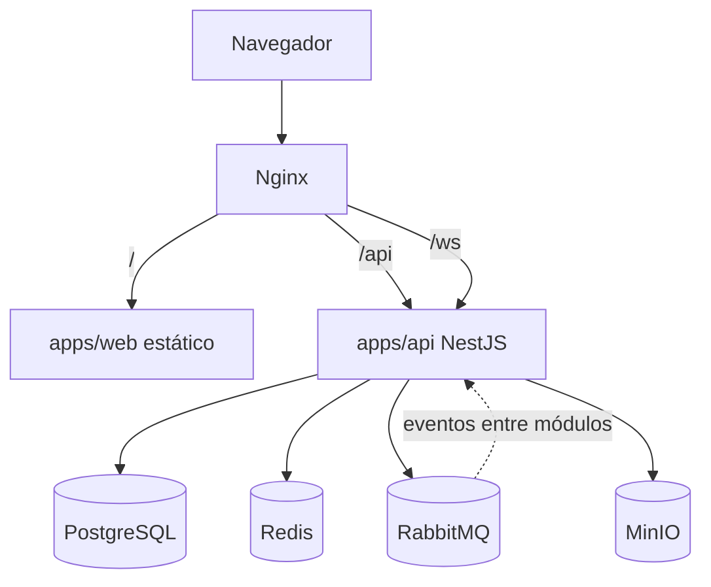

# 08 — Infraestructura y despliegue

## 1. Topología Docker Compose



Servicios en `infra/docker/docker-compose.yml`:

| Servicio   | Rol                                                                               | Notas                                                                                       |
| ---------- | --------------------------------------------------------------------------------- | ------------------------------------------------------------------------------------------- |
| `nginx`    | Reverse proxy único punto de entrada                                              | Termina TLS, sirve estáticos de `web`, enruta `/api` y `/ws`                                |
| `api`      | Backend NestJS (monolito modular)                                                 | Escalable a N réplicas detrás de Nginx                                                      |
| `web`      | Build estático de React servido vía Nginx (o CDN en prod)                         | No corre Node en producción, solo assets                                                    |
| `postgres` | Base de datos única, un schema por módulo                                         | Ver [02](./02-arquitectura-modulos-backend.md#4-base-de-datos-prisma-con-schema-por-módulo) |
| `redis`    | Cache + sesiones + adapter de WebSocket                                           | Ver sección 3                                                                               |
| `rabbitmq` | Bus de eventos entre módulos                                                      | Exchange topic `gorazus.eventos`                                                            |
| `minio`    | Almacenamiento de objetos (archivos adjuntos, comprobantes, imágenes de producto) | Un bucket por módulo que lo necesite                                                        |

`docker-compose.dev.yml` agrega hot-reload de `api`/`web` y expone
puertos de administración (pgAdmin, RabbitMQ management UI, MinIO
console) que no existen en `docker-compose.prod.yml`.

## 2. Nginx: enrutamiento

```nginx
location /api/ {
    proxy_pass http://api:3000/;
}

location /ws/ {
    proxy_pass http://api:3000/;
    proxy_http_version 1.1;
    proxy_set_header Upgrade $http_upgrade;
    proxy_set_header Connection "upgrade";
}

location / {
    root /usr/share/nginx/html; # build de apps/web
    try_files $uri /index.html;
}
```

- Un único dominio para frontend y backend evita problemas de CORS en
  producción; en desarrollo, Vite proxy cumple el mismo rol.
- El upgrade de conexión (`Upgrade`/`Connection`) es obligatorio para
  que el WebSocket Gateway funcione detrás de Nginx.

## 3. Redis: los tres usos, sin mezclarlos

1. **Cache de lectura** (p. ej. catálogo de productos, configuración de
   empresa) — con invalidación explícita desde el módulo dueño al
   escribir, no solo TTL.
2. **Adaptador de WebSocket** (`@socket.io/redis-adapter` o equivalente)
   — necesario en cuanto `api` corre más de una réplica. Ver
   [05-flujo-de-datos.md](./05-flujo-de-datos.md#2-ciclo-de-vida-de-un-evento-en-tiempo-real-websocket).
3. **Rate limiting / locks distribuidos** puntuales (p. ej. evitar doble
   confirmación concurrente de la misma venta).

Cada uso vive en su propio namespace de claves (`cache:*`, `ws:*`,
`lock:*`) para poder monitorear y purgar independientemente.

## 4. RabbitMQ: convención de exchanges y colas

- Un exchange topic por dominio de mensajería: `gorazus.eventos` para
  eventos de dominio entre módulos.
- Routing key: `<modulo>.<entidad>.<evento>` (`ventas.venta.confirmada`).
- Cada módulo consumidor declara **su propia cola** con binding a las
  routing keys que le interesan (`inventario.q.ventas-confirmadas`) —
  nunca comparte cola con otro módulo, para que el reprocesamiento o la
  caída de un consumidor no afecte a otro.
- Dead-letter queue por cola de consumo, para mensajes que fallan
  repetidamente y requieren intervención en vez de reintento infinito.

## 5. MinIO: buckets

Un bucket por módulo que maneja archivos (`ventas-comprobantes`,
`compras-facturas`, `pos-tickets`), no un bucket único genérico —
facilita políticas de retención y permisos distintos por tipo de
documento. El acceso siempre pasa por el backend (URLs firmadas de
corta duración), nunca se exponen credenciales de MinIO al frontend.

## 6. Entornos

| Entorno       | Propósito                 | Orquestación                                                                                                          | Diferencias clave                                            |
| ------------- | ------------------------- | --------------------------------------------------------------------------------------------------------------------- | ------------------------------------------------------------ |
| `local` (dev) | Desarrollo día a día      | Docker Compose                                                                                                        | Hot-reload, servicios de admin expuestos, datos de seed      |
| `staging`     | Validación pre-producción | Kubernetes (ver [docs/architecture/31 §2](./31-infraestructura-completa.md#2-kubernetes--adoptado-decisión-revisada)) | Misma topología que prod, datos anonimizados                 |
| `production`  | Uso real                  | Kubernetes                                                                                                            | Réplicas de `api`, backups automáticos de Postgres, TLS real |

- Variables de entorno validadas al boot con un schema Zod en
  `core/config` — si falta o es inválida una variable requerida, la
  aplicación **no arranca** (fail fast), en vez de fallar más tarde en
  producción con un error críptico.
- Secretos (JWT secret, credenciales de DB/RabbitMQ/MinIO) nunca se
  commitean — `.env` está en `.gitignore`, y `infra/docker` documenta un
  `.env.example` con las claves necesarias sin valores reales.

## 7. Escalado horizontal

- `api` es stateless (sesión vía JWT, no session storage en memoria) —
  escala agregando réplicas sin coordinación adicional más allá del
  Redis adapter para WebSocket.
- `postgres` no se escala horizontalmente en la fase de monolito
  modular (un único primario); la separación por schema ya prepara el
  camino para mover schemas calientes a su propia instancia si el
  volumen de un módulo específico lo justifica, sin rediseñar el resto.
