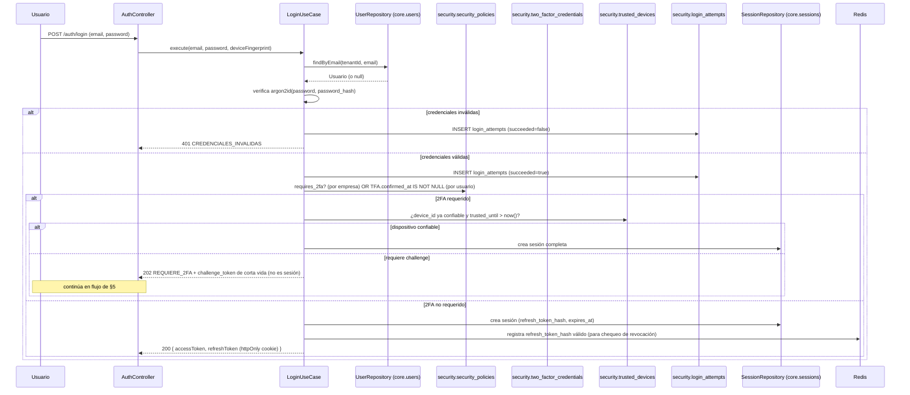
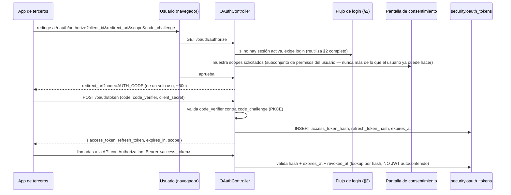
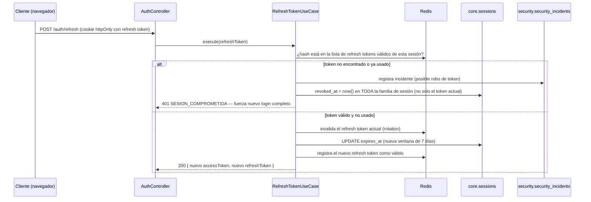
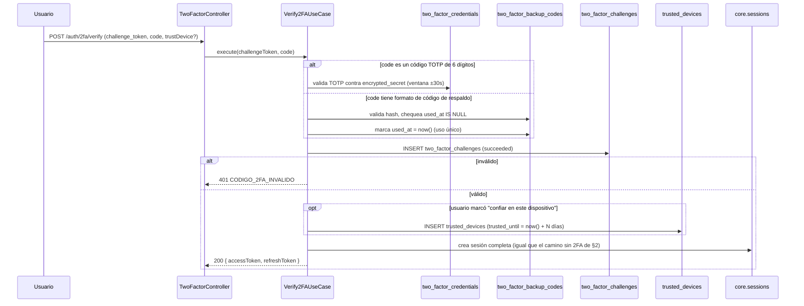
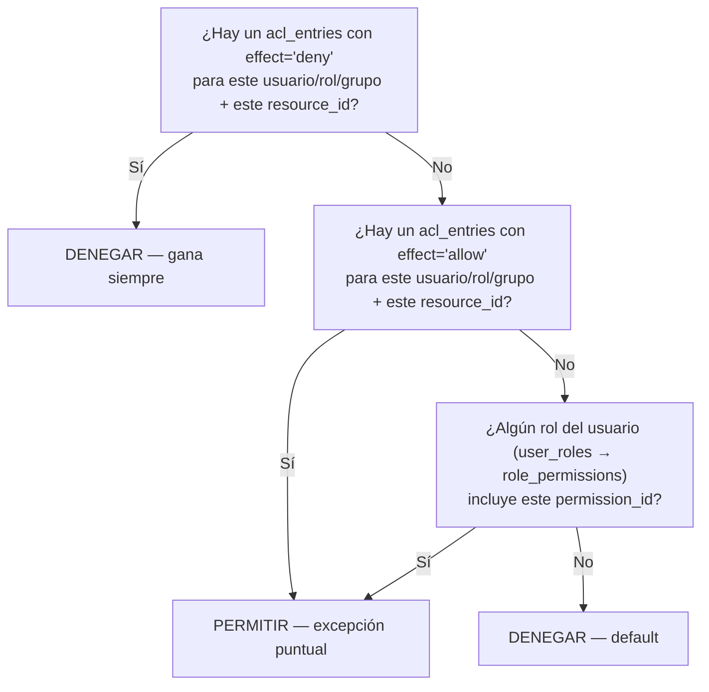

# 13 — Módulo Auth (diseño completo)

> Versión 1.0 — 2026-07-13. Diseño funcional y técnico completo del
> módulo `auth`. No introduce tablas nuevas — el modelo de datos ya
> existe y está verificado contra
> [sql/01_core.sql](../database/sql/01_core.sql) y
> [sql/02_security.sql](../database/sql/02_security.sql). Lo que este
> documento aporta es lo que no existía: los **flujos completos**
> (login, refresh, 2FA, OAuth2, API Keys, resolución de autorización)
> y la **arquitectura del módulo backend** que los implementa. Sin
> código — diagramas de secuencia (mermaid) y prosa únicamente.
>
> **Nota de implementación real (agregada 2026-07-22, sin reescribir el
> resto del documento):** login/refresh/logout/reset de contraseña/2FA ya
> están implementados y en producción real, con algunos nombres/detalles
> distintos a este diseño original — `Setup2FAUseCase`/`Verify2FAUseCase`
> de §5 se llaman `DosFactoresService` (`modules/seguridad/backend`) y
> `CompleteTwoFactorLoginUseCase` (`modules/auth/backend`) en el código
> real; el "202 REQUIERE_2FA" de §2 es un 200 con
> `{ requiresTwoFactor: true, challengeToken }` en la implementación real.
> Fuente de verdad de lo que existe hoy: `CHANGELOG.md` (búsqueda por
> fecha) y [AUTH_ARCHITECTURE.md](../reports/auth/AUTH_ARCHITECTURE.md)
> (docs/reports/auth/, resumen corto). OAuth2 (§3) y API Keys (§10) de este documento
> siguen sin implementar — ver "Pendiente conocido" en `CHANGELOG.md`.

## 0. Alcance y propiedad de datos — por qué "Auth" no es un schema propio

Antes de diseñar los flujos, hay que resolver una tensión real: el
pedido agrupa JWT/OAuth/Refresh/2FA/Roles/Permisos/Sesiones/API Keys
bajo "el módulo Auth", pero la arquitectura ya decidió (ver
[04-catalogo-modulos-negocio.md](./04-catalogo-modulos-negocio.md#auth-vs-seguridad-por-qué-son-dos-módulos-y-no-uno))
que `auth` (autenticación: ¿quién sos?) y `seguridad` (autorización:
¿qué podés hacer?) son módulos separados, y que sus datos viven en dos
lugares distintos por motivos ya fundamentados en el modelo de datos
([01-modelo-conceptual §1.5](../database/01-modelo-conceptual.md#15-excepción-a-no-fk-entre-schemas)):

| Concepto pedido                  | Dueño real del dato                                                | Por qué no tiene schema propio                                                                                                               |
| -------------------------------- | ------------------------------------------------------------------ | -------------------------------------------------------------------------------------------------------------------------------------------- |
| Identidad, credenciales, JWT     | `core.users`                                                       | `core` es fundacional — toda tabla del sistema ya tiene FK real hacia `users`; crear un schema `auth` aparte duplicaría la raíz de identidad |
| Sesiones                         | `core.sessions`                                                    | Mismo motivo — referenciada por `security.session_activity_logs`                                                                             |
| Tokens de propósito general      | `core.tokens`                                                      | Verificación de email, reset de password — infraestructura de identidad                                                                      |
| API Keys                         | `core.api_keys`, `core.api_key_scopes`                             | Igual — identidad de un actor no-humano                                                                                                      |
| Roles y permisos (RBAC base)     | `core.roles`, `core.permissions`, `role_permissions`, `user_roles` | Catálogo transversal consumido por los 21 módulos, no solo por auth                                                                          |
| ACL fino, políticas, 2FA, OAuth2 | `security.*`                                                       | Autorización avanzada — ver tabla completa en [logico/02-security.md](../database/logico/02-security.md)                                     |

**Conclusión de diseño:** `auth` es, igual que `pos` y `dashboard`
([04-catalogo](./04-catalogo-modulos-negocio.md#pos-no-tiene-entidades-propias)),
un **módulo de orquestación sin entidades propias** — su
`modules/auth/backend/` no declara tablas nuevas; sus repositorios son
adaptadores sobre `core.users`/`core.sessions`/`core.tokens`/`core.api_keys`
(permitido por la excepción de §1.5 citada arriba) y sobre
`security.*` para 2FA/OAuth2/políticas. Esto es exactamente lo que
permite responder el pedido "diseña completamente el módulo Auth"
como un diseño único y coherente, aunque el dato cruce dos schemas.

## 1. Arquitectura del módulo backend

Aplica la plantilla ya fijada en
[02-arquitectura-modulos-backend.md](./02-arquitectura-modulos-backend.md)
— no se repite la explicación de capas, solo se instancia para `auth`:

| Capa                       | Contenido específico de `auth`                                                                                                                                                                                                                                                                 |
| -------------------------- | ---------------------------------------------------------------------------------------------------------------------------------------------------------------------------------------------------------------------------------------------------------------------------------------------- |
| `entities/`                | `Usuario` (invariantes: formato de email, política de password delegada a `security.password_policies`), `Sesion`, `ApiKey`, `CredencialDosFactores` — clases de dominio puras, sin saber de Prisma/Nest                                                                                       |
| `repositories/`            | `UserRepository`, `SessionRepository`, `TokenRepository`, `ApiKeyRepository` (adaptadores sobre `core.*`); `TwoFactorRepository`, `OAuthClientRepository`, `OAuthTokenRepository`, `LoginAttemptRepository` (adaptadores sobre `security.*`)                                                   |
| `services/` (casos de uso) | `LoginUseCase`, `RefreshTokenUseCase`, `LogoutUseCase`, `RevokeAllSessionsUseCase`, `Setup2FAUseCase`, `Verify2FAUseCase`, `RegenerateBackupCodesUseCase`, `CreateApiKeyUseCase`, `RevokeApiKeyUseCase`, `AuthorizeOAuthClientUseCase`, `ExchangeOAuthCodeUseCase`, `RefreshOAuthTokenUseCase` |
| `dto`/`validators/`        | Schemas Zod: `LoginSchema`, `RefreshSchema`, `Verify2FASchema`, `CreateApiKeySchema`, `OAuthAuthorizeSchema`, `OAuthTokenExchangeSchema` — reexportados a `shared/contracts` para el frontend                                                                                                  |
| `controllers/`             | `AuthController` (`/auth/login`, `/auth/refresh`, `/auth/logout`, `/auth/sessions`), `TwoFactorController` (`/auth/2fa/*`), `ApiKeysController` (`/auth/api-keys`), `OAuthController` (`/oauth/authorize`, `/oauth/token`)                                                                     |
| `events/`                  | Publica `SesionRevocada` (fuerza cierre de sesión en otras réplicas vía `core/realtime`, ver [05 §2](./05-flujo-de-datos.md#2-ciclo-de-vida-de-un-evento-en-tiempo-real-websocket)); consume ninguno — `auth` no reacciona a eventos de otros módulos                                          |

`seguridad` es quien expone `PermissionsGuard` y el servicio de
resolución de autorización (§8) — `auth` solo emite el `UserContext`
autenticado; no decide qué puede hacer ese usuario. Frontera limpia,
consistente con [09 §1-2](./09-seguridad-y-multiempresa.md).

## 2. JWT

Estructura del token y decisión de no embeber roles/permisos ya fijada
en
[09 §1](./09-seguridad-y-multiempresa.md#1-autenticación-auth). Acá el
**flujo completo de login**, incluyendo el punto de decisión de 2FA:

Puntos de diseño no cubiertos antes:

- El **challenge token** emitido cuando 2FA es requerido **no es una
  sesión válida** — es una credencial temporal de un solo propósito
  (verificar el segundo factor), de vida muy corta (2-5 min), que no
  pasa el `PermissionsGuard` de ningún endpoint de negocio.
- `login_attempts` se escribe siempre, éxito o fracaso — es la base de
  `max_login_attempts`/`lockout_duration_minutes` de
  `security.security_policies` (bloqueo temporal por fuerza bruta,
  contado por `email_attempted` + `ip_address` en la ventana de
  `lockout_duration_minutes`).

## 3. OAuth

**Dirección del diseño, explícita porque no estaba fijada:** GORAZUS
actúa como **servidor de autorización OAuth2** (no como consumidor) —
`security.oauth_clients` son aplicaciones de terceros (integraciones
e-commerce, apps móviles propias, BI externo) que piden acceso
delegado a los datos de un usuario de GORAZUS. Esto es consistente con
las columnas ya definidas (`redirect_uris`, `client_secret_hash`,
scopes N:M) — un flujo de "iniciar sesión con Google/Microsoft" sería
el caso inverso (GORAZUS como _cliente_ de un IdP externo) y **no está
cubierto por este modelo**; queda fuera de alcance hasta que haya
necesidad de negocio confirmada (mismo criterio de
[04-catalogo, nota de alcance](./04-catalogo-modulos-negocio.md#nota-de-alcance-leer-antes-que-la-tabla)).

Flujo: **Authorization Code + PKCE** (obligatorio para todo cliente,
no opcional — protege también a los clientes confidenciales, buena
práctica moderna independientemente de si el `redirect_uri` es una
app móvil, SPA o backend de terceros):

**Por qué el access token de OAuth es opaco (verificado contra DB) y
el JWT de sesión de usuario es autocontenido:** son decisiones
distintas a propósito. El JWT de sesión prioriza velocidad (miles de
requests internos por segundo, verificación sin tocar DB). El token
OAuth es de mucho menor volumen (integraciones, no tráfico interno) y
necesita poder revocarse/inspeccionarse con precisión por cliente y
por scope en cualquier momento — el costo de un lookup en
`security.oauth_tokens` es aceptable a ese volumen y da control real
sobre cada integración de terceros.

## 4. Refresh Token

Estructura y rotación ya fijadas en
[09 §1](./09-seguridad-y-multiempresa.md#1-autenticación-auth). Flujo
completo, incluyendo **detección de reuso** (no cubierto antes):

La detección de reuso es el mecanismo real detrás de "rotado en cada
uso... para poder detectar reuso indebido" que 09 §1 ya declaraba como
propósito — acá se especifica el mecanismo: reusar un refresh token ya
rotado es la señal de que alguien más lo tiene, y la respuesta es
revocar toda la sesión, no solo negar ese request.

## 5. 2FA

Dos flujos distintos, ambos sobre `security.two_factor_*`:

**5.1 Alta (enrollment)** — el usuario activa 2FA voluntariamente o
porque `security_policies.requires_2fa = true` lo exige:

1. `Setup2FAUseCase` genera un secreto TOTP, lo cifra
   (`encrypted_secret`, mismo mecanismo de `pgcrypto` que otras
   columnas sensibles — ver
   [06-estrategia-seguridad §3](../database/06-estrategia-seguridad.md#3-cifrado))
   y lo guarda en `two_factor_credentials` con `confirmed_at = NULL`
   (pendiente de confirmar).
2. Se muestra el QR (secreto en claro solo en este momento, nunca se
   vuelve a mostrar).
3. El usuario ingresa el primer código generado por su app
   autenticadora → `Verify2FAUseCase` valida contra el secreto → si es
   correcto, `confirmed_at = now()`.
4. Se generan y muestran **una única vez** N códigos de respaldo →
   se guardan hasheados en `two_factor_backup_codes`.

**5.2 Challenge en login** (continuación del diagrama de §2 cuando
"requiere 2FA"):

## 6. Roles

Modelo RBAC ya fijado en
[09 §2](./09-seguridad-y-multiempresa.md#2-autorización-seguridad):
`Usuario → Rol (por empresa) → Permiso`, vía `core.user_roles` y
`core.role_permissions` (ambas N:M con las 18 columnas completas —
quién asignó qué rol y cuándo es dato de negocio real, no ruido, ver
[02-modelo-logico §1.3](../database/02-modelo-logico.md#13-patrón-de-unión-nm)).
Roles de fábrica (`is_system_role = true`) no son eliminables, para
que la empresa siempre tenga al menos un camino de administración
válido. La gestión de roles (crear, asignar) es responsabilidad de
`seguridad`, no de `auth` — `auth` solo lee `user_roles` al construir
el `UserContext` de una sesión.

## 7. Permisos

Formato `<modulo>.<accion>` en `core.permissions`, catálogo único
reutilizado por **cuatro mecanismos de concesión distintos** — esto no
estaba explicitado como principio de diseño y es la pieza que conecta
Roles, ACL, API Keys y OAuth en un solo modelo mental:

| Mecanismo de concesión | Tabla                                                                                                           | Alcance                                                                                                |
| ---------------------- | --------------------------------------------------------------------------------------------------------------- | ------------------------------------------------------------------------------------------------------ |
| Rol                    | `core.role_permissions`                                                                                         | Todo lo que el rol permite, para cualquier registro                                                    |
| ACL fino               | `security.acl_entries`                                                                                          | Un permiso sobre un registro específico (`resource_id`), anula o extiende el rol — ver §8              |
| API Key                | `core.api_key_scopes`                                                                                           | Subconjunto de permisos otorgado a un actor no-humano                                                  |
| OAuth Client           | `security.oauth_client_scopes` (vía `oauth_scopes`, mapeado 1:1 a códigos de `core.permissions` por convención) | Subconjunto delegado por el usuario a una app de terceros — nunca más de lo que el usuario mismo tiene |

Un mismo catálogo de "qué acciones existen" evita que cuatro
mecanismos de autorización terminen, con el tiempo, respondiendo la
pregunta "¿qué es `ventas.confirmar`?" de cuatro formas distintas.

## 8. Autorización: cómo se combinan Roles y ACL (regla de precedencia — no existía)

`PermissionsGuard` (ver
[09 §2](./09-seguridad-y-multiempresa.md#2-autorización-seguridad))
resuelve así, en orden, deteniéndose en el primer resultado
concluyente:

**Por qué `deny` de ACL gana siempre, incluso sobre un rol que
permite:** es la única forma de expresar "esta persona tiene el rol
Vendedor, pero este cliente específico está vetado para ella" sin
crear un rol nuevo por cada excepción — el caso de uso real que
`security.acl_entries` existe para resolver.
`security.permission_delegations` (delegación temporal, p. ej.
cobertura de vacaciones) se evalúa como una fuente adicional de "rol
efectivo" en el paso C, con su propia ventana `starts_at`/`ends_at`.

## 9. Sesiones

`core.sessions` + verificación de revocación contra Redis (no solo
`expires_at` en Postgres, para que "cerrar sesión en todos los
dispositivos" sea instantáneo — ver
[09 §1](./09-seguridad-y-multiempresa.md#1-autenticación-auth)).
Distinción de diseño necesaria y hasta ahora implícita: **dos
temporalidades distintas, no una**:

| Mecanismo                                                             | Dónde vive                                                                                                                              | Se renueva                                                                              |
| --------------------------------------------------------------------- | --------------------------------------------------------------------------------------------------------------------------------------- | --------------------------------------------------------------------------------------- |
| Expiración absoluta del refresh token                                 | `sessions.expires_at`                                                                                                                   | En cada rotación exitosa (§4) — ventana móvil de 7 días mientras el usuario siga activo |
| Timeout por inactividad (`security_policies.session_timeout_minutes`) | Marca de "última actividad" en Redis, namespace `ws:session:<id>:last_seen` (no se escribe en Postgres por request — costo inaceptable) | En cada request autenticado exitoso                                                     |

Un guard de idle-timeout compara `now() - last_seen` contra
`session_timeout_minutes` **antes** de aceptar el access token, aunque
el JWT en sí siga siendo criptográficamente válido — esto es lo que
permite cerrar sesión por inactividad sin esperar a que expire el
access token de 15 minutos.

**Flujos de gestión** (pantalla "Sesiones activas" del usuario):
listar sesiones propias (`core.sessions` filtradas por `user_id`, con
`ip_address`/`user_agent` para reconocimiento humano), revocar una
sesión puntual, o revocar todas (`RevokeAllSessionsUseCase`: marca
`revoked_at` en todas + purga las claves Redis correspondientes +
publica `SesionRevocada` para que la réplica que sostiene ese
WebSocket la corte en tiempo real, ver
[05 §2](./05-flujo-de-datos.md#2-ciclo-de-vida-de-un-evento-en-tiempo-real-websocket)).

## 10. API Keys

`core.api_keys` (solo `key_hash` + `key_prefix` visible) +
`core.api_key_scopes` + `security.api_key_rate_limits`. Flujo:

1. **Creación**: un usuario con permiso `seguridad.gestionar_api_keys`
   genera una key con nombre, empresa (`company_id`, obligatorio — una
   API key siempre opera dentro de una empresa, igual que una sesión
   normal) y scopes (subconjunto de `core.permissions`, igual
   restricción que OAuth: nunca más que los permisos del usuario que
   la crea). El valor en texto plano se muestra **una única vez**.
2. **Uso**: el cliente envía `Authorization: ApiKey <valor>` — un
   esquema HTTP distinto de `Bearer <jwt>`, para que `core/http` sepa
   sin ambigüedad qué guard aplicar. `ApiKeyGuard` hashea el valor
   recibido, busca por `key_hash` (único, ver
   [02a-restricciones-e-indices §5](../database/02a-restricciones-e-indices.md#5-índices---regla-por-rol-de-tabla)),
   verifica `expires_at`/`is_deleted` (revocar = soft delete, no hay
   columna `revoked_at` separada porque no hace falta — el patrón
   universal ya cubre "ya no válida") y valida el scope requerido por
   el endpoint contra `api_key_scopes`.
3. **Rate limit**: `security.api_key_rate_limits.requests_per_minute`
   se aplica con un contador en Redis (`lock:*`/`cache:*` namespace,
   ver [08 §3](./08-infraestructura-y-despliegue.md#3-redis-los-tres-usos-sin-mezclarlos)),
   no contra Postgres — igual criterio de costo que el idle-timeout de
   §9.
4. **Alcance multiempresa**: una API key nunca opera "en todas las
   empresas" — hereda `company_id`/`branch_id` de las columnas
   universales igual que cualquier otra fila, y `PermissionsGuard`
   la trata como un `UserContext` sintético (sin usuario humano
   detrás) para el resto del pipeline de autorización de §8.

## 11. Trazabilidad

| Punto solicitado         | Documento(s) de detalle normativo                                            | Novedad de este documento                                                              |
| ------------------------ | ---------------------------------------------------------------------------- | -------------------------------------------------------------------------------------- |
| JWT                      | [09 §1](./09-seguridad-y-multiempresa.md#1-autenticación-auth)               | Flujo completo de login (§2)                                                           |
| OAuth                    | [logico/02-security.md](../database/logico/02-security.md) (modelo de datos) | Dirección del diseño (proveedor, no consumidor) + flujo Authorization Code + PKCE (§3) |
| Refresh Token            | [09 §1](./09-seguridad-y-multiempresa.md#1-autenticación-auth)               | Mecanismo exacto de detección de reuso (§4)                                            |
| 2FA                      | [logico/02-security.md](../database/logico/02-security.md) (modelo de datos) | Flujos de alta y challenge completos (§5)                                              |
| Roles                    | [09 §2](./09-seguridad-y-multiempresa.md#2-autorización-seguridad)           | — (ya completo, solo referenciado)                                                     |
| Permisos                 | [09 §2](./09-seguridad-y-multiempresa.md#2-autorización-seguridad)           | Los 4 mecanismos de concesión que comparten el catálogo (§7)                           |
| — Autorización Roles+ACL | _(no existía)_                                                               | Regla de precedencia deny > allow > rol (§8)                                           |
| Sesiones                 | [09 §1](./09-seguridad-y-multiempresa.md#1-autenticación-auth)               | Distinción expiración absoluta vs. idle timeout (§9)                                   |
| API Keys                 | [logico/01-core.md](../database/logico/01-core.md) (modelo de datos)         | Flujo completo de creación/uso/rate-limit (§10)                                        |
| Arquitectura del módulo  | [02](./02-arquitectura-modulos-backend.md) (plantilla genérica)              | Instanciada para `auth` + resuelta la tensión de propiedad de datos (§0-1)             |
