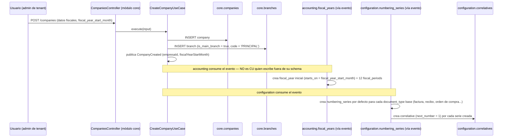
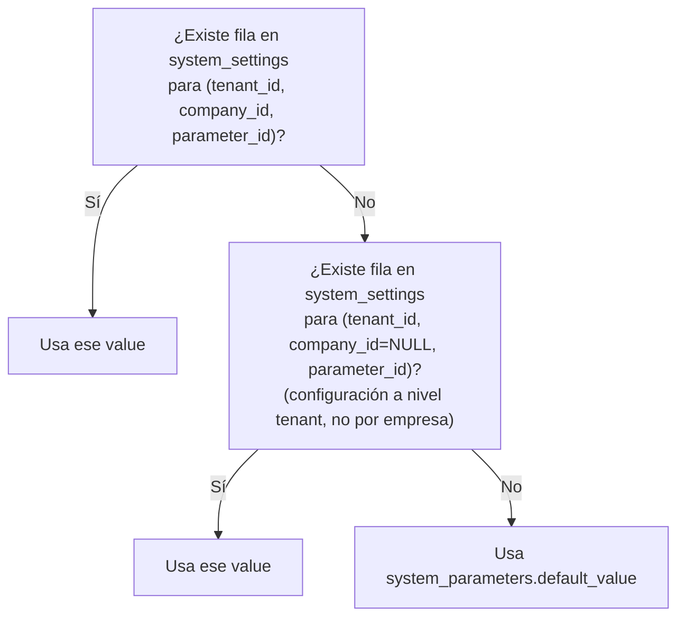
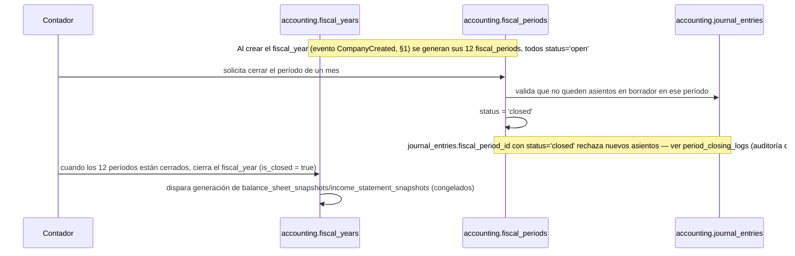
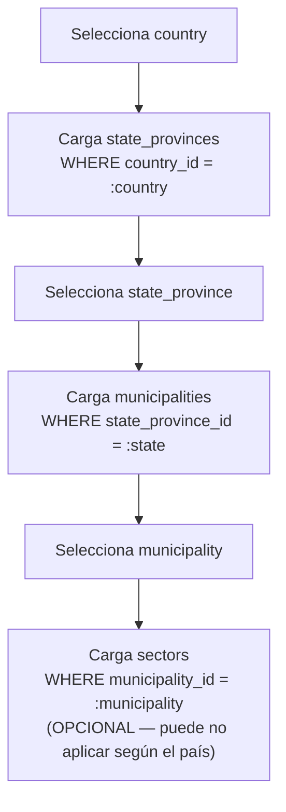
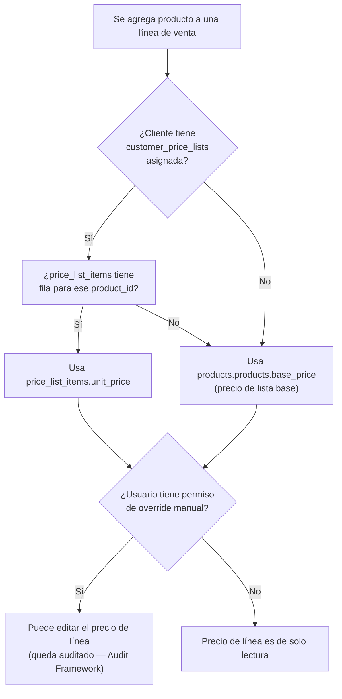

# 14 — Módulo Core (diseño completo)

> Versión 1.1 — 2026-07-13. Mismo criterio que
> [13-modulo-auth.md](./13-modulo-auth.md): diseño funcional y técnico
> completo, sin tablas nuevas (el modelo ya existe y está verificado
> contra [sql/01_core.sql](../database/sql/01_core.sql),
> [sql/21_configuration.sql](../database/sql/21_configuration.sql) y
> [sql/11_accounting.sql](../database/sql/11_accounting.sql)). Sin
> código — solo prosa y diagramas.
>
> **Ampliación v1.1** (pedido de Fase 4 — Configuration): se agregan
> §12-16 (Cities, Exchange Rate Types, Fiscal Document Types, Payment
> Methods, Price Lists) — 5 de los 14 puntos pedidos en esa fase que no
> estaban en el alcance original de v1.0. El punto 14 de esa lista
> ("Taxes") **no** se agrega acá — ver
> [33-iam-plan-de-implementacion-fase-3.md](./33-iam-plan-de-implementacion-fase-3.md)
> para el criterio de "no diseñar especulativamente/fuera de alcance
> proporcionado" aplicado de forma análoga en
> [34-configuration-plan-de-implementacion-fase-4.md §2](./34-configuration-plan-de-implementacion-fase-4.md#2-taxes-no-se-absorbe-acá--es-la-fase-16-ya-conocida).

## 0. Alcance — qué es realmente del módulo Core (aclaración necesaria)

Igual que con `auth` en el documento anterior, hay una tensión real
entre el pedido y la propiedad de datos ya decidida. De los 10
elementos pedidos, **solo 3 son de `core`** — los otros 7 ya tienen
dueño fijado por la regla de no-duplicación de
[01-modelo-conceptual §3](../database/01-modelo-conceptual.md#3-regla-de-no-duplicación-entre-módulos),
verificado ahora contra el SQL real:

| Elemento pedido | Schema real (verificado en SQL)                                        | Módulo dueño    | Por qué no es de `core`                                                                                                                            |
| --------------- | ---------------------------------------------------------------------- | --------------- | -------------------------------------------------------------------------------------------------------------------------------------------------- |
| **Companies**   | `core.companies`                                                       | `core`          | ✅ Es de `core`                                                                                                                                    |
| **Branches**    | `core.branches`                                                        | `core`          | ✅ Es de `core`                                                                                                                                    |
| **Settings**    | `core.system_settings`, `core.system_parameters`, `core.feature_flags` | `core`          | ✅ Es de `core`                                                                                                                                    |
| Countries       | `configuration.countries`                                              | `configuration` | Geografía es catálogo global compartido — dueño fijado en 01 §3                                                                                    |
| Currencies      | `configuration.currencies`                                             | `configuration` | Igual — evita que `core`, `accounting`, `sales` tengan cada uno su propio catálogo de monedas                                                      |
| Languages       | `configuration.languages`                                              | `configuration` | Catálogo transversal, usado por el patrón `_translations` de las 21 tablas que lo necesitan                                                        |
| TimeZones       | `configuration.timezones`                                              | `configuration` | Catálogo puro, sin lógica de negocio                                                                                                               |
| Fiscal Years    | `accounting.fiscal_years`, `accounting.fiscal_periods`                 | `accounting`    | El ejercicio fiscal es un concepto contable (períodos abiertos/cerrados condicionan `journal_entries`) — vive donde vive su consumidor principal   |
| Document Series | `configuration.numbering_series`, `document_number_formats`            | `configuration` | Consumida por `sales`/`purchases`/`accounting` por igual — dueño único evita que cada módulo emisor de comprobantes reinvente su propia numeración |
| Correlatives    | `configuration.correlatives`                                           | `configuration` | 1:1 con `numbering_series`, mismo dueño                                                                                                            |

**Decisión de este documento:** diseñar los 10 completos —es lo que se
pidió— pero **organizados por dueño real**, no fusionados en `core`.
Moverlos a `core` sería un cambio estructural real (rompería la regla
de no-duplicación y le daría a `core` una responsabilidad de negocio
que hoy no tiene) y, de proponerse en serio, requeriría un ADR según
[11-gobernanza-y-adrs.md §4](./11-gobernanza-y-adrs.md#4-quién-puede-aprobar-qué)
("cambio de infraestructura... ADR + validación"). Si la intención era
literalmente fusionar todo en `core`, avisá y se redacta ese ADR — por
defecto se mantiene la arquitectura ya vigente.

## 1. Companies (`core.companies`) — dueño real: `core`

Columnas propias ya fijadas: `legal_name`, `trade_name`, `tax_id`
(único por tenant), `tax_regime`, `functional_currency_code` (FK
diferida hacia `configuration.currencies`, cerrada en
[21_configuration.sql](../database/sql/21_configuration.sql)),
`fiscal_year_start_month`.

**Reglas de negocio (nuevas — no estaban explicitadas):**

- Una `Company` inactiva (`is_active = false`) no puede recibir
  transacciones nuevas en ningún módulo — el `TenantInterceptor`
  ([05 §1](./05-flujo-de-datos.md#1-ciclo-de-vida-de-una-request-http-estándar))
  rechaza la request antes de llegar al controller si la empresa
  activa está inactiva, sin que cada módulo tenga que validarlo por su
  cuenta.
- `functional_currency_code` es inmutable después de la primera
  transacción contable — cambiarla a mitad de operación invalidaría
  todos los saldos históricos en moneda funcional; un cambio real
  requiere el proceso de revaluación de
  [logico/11-accounting.md](../database/logico/11-accounting.md)
  (`currency_revaluations`), no una edición directa.

**Flujo de alta de empresa (orquesta Companies + Branches + Fiscal
Years + Document Series — no existía como flujo único):**



Este es el mismo patrón ya fijado en
[06-comunicacion-entre-modulos.md](./06-comunicacion-entre-modulos.md):
`core` publica `CompanyCreated`, nunca escribe directamente en
`accounting.fiscal_years` ni en `configuration.numbering_series` — la
regla "un módulo nunca modifica el estado de una entidad que no le
pertenece" se mantiene incluso en el flujo de onboarding.

## 2. Branches (`core.branches`) — dueño real: `core`

`code` único por empresa, `is_main_branch` (exactamente una sucursal
principal por empresa — invariante de dominio validada en la entidad,
no solo en base de datos, aunque también se podría reforzar con
`CHECK`/índice único parcial `WHERE is_main_branch = true`, candidato
a agregar en 06-estrategia-seguridad/04-estrategia-indices si se
confirma la necesidad).

**Cascada al crear una sucursal nueva** (más allá de la principal,
creada en el flujo de §1): una sucursal nueva típicamente necesita su
propio almacén (`inventory.warehouses`), caja (`cash.cash_registers`)
y series de numeración (`configuration.numbering_series`, que
**requiere** `branch_id` — es `NOT NULL` en el schema, a diferencia de
`company_id` que si es opcional en varias tablas de `configuration`).
Mismo patrón de evento (`BranchCreated`) que dispara la creación en
cada módulo dueño, no una escritura directa de `core`.

**Desactivar una sucursal** no la borra (soft delete estándar) pero sí
bloquea nuevas transacciones con ese `branch_id` — mismo mecanismo del
`TenantInterceptor` que en §1, a nivel de sucursal en vez de empresa.

## 3. Settings (`core.system_settings` + `system_parameters` + `feature_flags`) — dueño real: `core`

**Modelo de dos niveles** (no estaba explicado como flujo):
`system_parameters` es el catálogo de _qué_ parámetros existen (clave,
tipo de dato, valor por defecto) — se siembra con el sistema, no lo
edita el usuario final. `system_settings` es el _valor concreto_
configurado para un tenant/empresa — fila que solo existe si alguien
lo sobreescribió.

**Flujo de resolución de un setting** (qué valor efectivo usa la
aplicación — no existía documentado):



Esto evita que cada empresa nueva necesite una fila por cada parámetro
existente — solo se materializa una fila cuando alguien realmente
cambia el valor por defecto, siguiendo el mismo espíritu de
`metadata JSONB` (extensión sin costo hasta que se usa) pero para
configuración estructurada y tipada.

**Feature flags** son un mecanismo aparte, deliberadamente: no
resuelven "valor de un parámetro" sino "¿está prendida esta
funcionalidad para este tenant?", con `rollout_percentage` para
activación progresiva (canary) — se evalúa en el borde (`core/config`
o el guard correspondiente), nunca dentro de la lógica de negocio de
un módulo (un módulo no debería tener `if (featureFlag)` disperso en
sus casos de uso; el flag decide qué implementación se inyecta, no
qué rama de código corre).

## 4-7. Countries, Currencies, Languages, TimeZones — dueño real: `configuration`

Los cuatro comparten la misma forma: **catálogo global** (`tenant_id`
= sentinela del sistema, visible a todos los tenants vía la política
RLS ya descrita en
[06-estrategia-seguridad §1](../database/06-estrategia-seguridad.md#1-row-level-security-el-mecanismo-central-de-aislamiento-multiempresa))

- tabla `_translations` para el nombre visible (patrón ya fijado en
  [02-modelo-logico §1.2](../database/02-modelo-logico.md#12-patrón-de-traducción-_translations)).
  Ningún módulo de negocio los duplica — todos referencian por ID.

| Catálogo     | Consumido por                                                                                                                                  | Nota de diseño                                                                                                                                                                      |
| ------------ | ---------------------------------------------------------------------------------------------------------------------------------------------- | ----------------------------------------------------------------------------------------------------------------------------------------------------------------------------------- |
| `countries`  | `state_provinces`→`municipalities` (jerarquía geográfica completa), `tax_jurisdictions`, `fiscal_regimes`, `fiscal_document_types`, `holidays` | Un país es la raíz de tres árboles de configuración distintos (geografía, fiscalidad, feriados) — no se fusionan en una tabla porque tienen ciclos de vida y cardinalidad distintos |
| `currencies` | `core.companies.functional_currency_code`, `exchange_rates`, `price_lists`, cualquier módulo con montos multi-moneda                           | `exchange_rates` es histórico por fecha (`rate_date`) — nunca se sobreescribe una cotización pasada, se agrega una fila nueva                                                       |
| `languages`  | Toda tabla `_translations` del sistema (patrón transversal)                                                                                    | El idioma por defecto de una empresa no es una columna de `companies` — es un `system_setting` (§3), porque es configurable sin ser estructural                                     |
| `timezones`  | `core.user_profiles.preferred_timezone`, cálculo de plazos en `hr`/`payroll`/`services` junto con `holidays`                                   | Zona horaria de visualización (por usuario) vs. zona horaria de la empresa son conceptos distintos — la primera vive en `user_profiles`, no acá                                     |

## 8. Fiscal Years (`accounting.fiscal_years` + `fiscal_periods`) — dueño real: `accounting`

Ya creados en cascada en el flujo de §1. **Ciclo de vida** (no
documentado antes como flujo):



`period_number` + `starts_on`/`ends_on` de cada `fiscal_period` se
calculan a partir de `fiscal_year_start_month` de `core.companies` —
una empresa con ejercicio fiscal julio-junio tiene su período 1 en
julio, no en enero; esto es lo que le da sentido de negocio real a la
columna `fiscal_year_start_month` que hasta ahora solo estaba
declarada en el schema sin flujo asociado.

## 9. Document Series (`configuration.numbering_series` + `document_number_formats`) — dueño real: `configuration`

`document_type` identifica qué comprobante numera (`'sales.invoice'`,
`'purchases.purchase_order'`, ...) — convención de string ya usada
igual que `source_module`/`entity_type` polimórficos en otras tablas.
`branch_id` es **obligatorio** (a diferencia de `company_id`, que en
otras tablas de `configuration` es opcional) — una serie de numeración
**siempre** pertenece a una sucursal concreta, nunca es "de toda la
empresa", porque el punto de emisión físico/legal de un comprobante es
la sucursal. `document_number_formats` separa el _formato visual_
(prefijo/longitud/sufijo) de la _serie_ en sí — permite cambiar el
formato de presentación sin resetear el contador.

## 10. Correlatives (`configuration.correlatives`) — dueño real: `configuration`

1:1 con `numbering_series` (índice único verificado). El mecanismo de
concurrencia **ya existe y está verificado** en
[sql/25_functions.sql](../database/sql/25_functions.sql)
(`fn_get_next_correlative`) — no es optimista (no es "reintentar si
`row_version` cambió"), es **pesimista**: `SELECT ... FOR UPDATE`
bloquea la fila del correlativo hasta que la transacción que lo pidió
confirma, así que una segunda transacción concurrente espera en vez de
arriesgarse a emitir el mismo número. Esto es la decisión correcta
para este caso específico (a diferencia del resto del modelo, que
favorece optimistic locking vía `row_version` — ver
[01-modelo-conceptual §1.1](../database/01-modelo-conceptual.md#11-columnas-universales)):
un número de comprobante duplicado es un problema legal/fiscal real
(dos facturas con el mismo folio), mientras que la mayoría de los
conflictos de `UPDATE` concurrente en el resto del sistema son
recuperables con un reintento de negocio.

`fn_generate_document_number` compone prefijo + número con ceros a la
izquierda + sufijo en una sola llamada — es la función que
`sales.services/crear-venta.usecase.ts` (o equivalente en cualquier
módulo emisor) invoca al confirmar un documento, nunca antes (el
correlativo se consume solo cuando el documento efectivamente se
confirma, para no dejar huecos en la numeración por documentos
abandonados en borrador — huecos que además tendrían implicancia
fiscal en la mayoría de regímenes).

## 12. Cities (`configuration.municipalities`) — dueño real: `configuration`

**Aclaración de nombre:** no existe una tabla `cities` — el nivel
"ciudad" de la jerarquía geográfica es `configuration.municipalities`.
Jerarquía completa, verificada contra
[sql/21_configuration.sql](../database/sql/21_configuration.sql):

```
countries → state_provinces → municipalities → sectors
(país)      (estado/provincia)  (municipio/ciudad)  (sector/barrio/zona)
```

**Asimetría de traducciones (real, no documentada hasta ahora):** el
patrón `_translations` (§4-7) llega hasta `state_provinces` —
`country_translations` y `state_province_translations` existen, pero
`municipalities` y `sectors` **no tienen tabla de traducción propia**.
Esto es una decisión de diseño razonable, no un descuido: countries y
state_provinces aparecen en documentos legales/fiscales
multi-idioma (una factura puede mostrar el nombre del país/estado en
el idioma del cliente), mientras que municipios y sectores casi
siempre se muestran en el idioma local único de esa dirección postal
— traducirlos agregaría 2 tablas más sin un caso de uso real que lo
justifique hoy. Si en el futuro surge esa necesidad (p. ej. reportes
para inversionistas extranjeros con desglose geográfico completo), se
agregan siguiendo el mismo patrón — no antes.

**Flujo de selección en cascada** (usado en formularios de dirección
de `clientes`/`proveedores` — no documentado hasta ahora):



**Nivel obligatorio vs. opcional:** `country_id` y `municipality_id`
son las dos FKs que efectivamente usan `customers.customer_addresses`
y `suppliers.supplier_addresses` (verificado en el schema) — es decir,
una dirección **siempre** resuelve hasta municipio; `sector_id` es
opcional y su uso real depende del país (relevante para rutas de
reparto en `ventas`/`inventario` en países donde el sector es la
unidad de zonificación de reparto, irrelevante en otros).

## 13. Exchange Rate Types (`configuration.exchange_rate_types`) — dueño real: `configuration`

**Por qué existe aparte de `exchange_rates` (§4-7):** varios países
tienen más de una tasa de cambio oficial vigente simultáneamente
(compra/venta de un banco central, tasa oficial vs. tasa paralela en
economías con control cambiario). `exchange_rate_types` es el catálogo
de **qué tipos de tasa existen para un país** (`buy`, `sell`,
`official`, `parallel` — valores de ejemplo, el catálogo es
configurable por país, no un `ENUM` fijo); `exchange_rates` (ya
diseñada en §4-7) se extiende con la FK hacia este catálogo para saber
**cuál** de esas tasas es cada fila histórica.

**Regla de resolución cuando un país tiene varios tipos activos** (no
existía documentada — es la pieza que le faltaba a `Currency Manager`,
[32-core-platform/03 §4](./32-core-platform/03-localizacion-y-globalizacion.md#4-currency-manager)):
toda conversión debe especificar explícitamente el
`exchange_rate_type_id` a usar — **no hay tasa "por defecto" implícita**.
Un módulo que solicita una conversión sin indicar el tipo recibe un
error de validación, no una tasa arbitraria; esto es deliberado, dado
que usar la tasa incorrecta (oficial cuando correspondía paralela, o
viceversa) tiene implicancia fiscal/contable real en los países donde
esto aplica. Países con un solo tipo de tasa (la mayoría) simplemente
tienen un único registro en `exchange_rate_types`, y los módulos
consumidores pueden omitir el parámetro y dejar que `Currency Manager`
resuelva el único tipo disponible — la validación estricta solo se
activa cuando hay ambigüedad real.

## 14. Fiscal Document Types (`configuration.fiscal_document_types`) — dueño real: `configuration`

**Desambiguación necesaria** — existen 3 tablas distintas que podrían
confundirse bajo el nombre genérico "tipos de documento", cada una con
propósito y dueño distintos:

| Tabla                                          | Qué es                                                                                                       | Dueño           | Documento                                                                                                    |
| ---------------------------------------------- | ------------------------------------------------------------------------------------------------------------ | --------------- | ------------------------------------------------------------------------------------------------------------ |
| `configuration.fiscal_document_types`          | Tipo de **comprobante legal** por país (CFDI, DTE, NFe, Factura A/B/C)                                       | `configuration` | Este documento (§14)                                                                                         |
| `core.document_types`                          | Tipo de **archivo adjunto** (contrato, certificado) con reglas de retención — consumido por `core.documents` | `core`          | [32-core-platform/08 §3 File Manager](./32-core-platform/08-frameworks-de-infraestructura.md#3-file-manager) |
| `configuration.numbering_series.document_type` | Columna de texto libre que identifica qué comprobante numera una serie (`'sales.invoice'`) — no es una tabla | `configuration` | §9 de este documento (ya cubierto)                                                                           |

Esta sección cubre exclusivamente la primera: el catálogo de qué
formato de comprobante fiscal exige la legislación de cada país,
FK'd desde `sales.invoices.fiscal_document_type_id`. Es catálogo puro
(mismo patrón de §4-7: global, `_translations` si aplicara), **sin**
lógica de cálculo de impuestos — el motor de impuestos en sí (tasas,
retenciones, percepciones) es un dominio completamente distinto,
propiedad del schema `taxes` (módulo `impuestos`, Fase 16 del
roadmap), no de `configuration`. Este catálogo solo responde "¿qué
tipo de comprobante legal es este documento?", nunca "¿cuánto impuesto
lleva?" — esa segunda pregunta se diseñará cuando se aborde Fase 16,
no acá (ver
[34-configuration-plan-de-implementacion-fase-4.md §2](./34-configuration-plan-de-implementacion-fase-4.md#2-taxes-no-se-absorbe-acá--es-la-fase-16-ya-conocida)).

## 15. Payment Methods (`configuration.payment_forms` + `payment_methods` + `banks`) — dueño real: `configuration`

**Modelo de dos niveles** (mismo espíritu que Settings en §3 —
catálogo general vs. instancia concreta, no documentado hasta ahora):

- `payment_forms` — categoría amplia y estable: `cash`, `check`,
  `transfer`, `card`, `credit`. Catálogo global, prácticamente nunca
  cambia.
- `payment_methods` — el instrumento concreto y editable por company:
  `payment_form_id` (obligatorio), `bank_account_id` (opcional, FK
  laxa hacia `banks.bank_accounts` — un método "Visa - Terminal
  Sucursal Norte" puede o no estar ligado a una cuenta bancaria
  específica), `name`.

**Asimetría real de `company_id`:** a diferencia de la mayoría de
tablas de `configuration` (donde `company_id` suele ser opcional para
permitir catálogos a nivel tenant), en `payment_methods` es
**obligatorio** — mismo criterio que `branch_id` en `numbering_series`
(§9): los medios de pago habilitados son una decisión operativa de
cada empresa (una empresa puede aceptar tarjeta y otra no), no un
catálogo global que todas las empresas de un tenant comparten por
igual.

**Flujo de consumo** (ya existía parcialmente descrito en
[20-modulo-sales.md](./20-modulo-sales.md), se referencia acá para
dejar completa la vista desde `configuration`): al registrar un
`sales.receipts`, `payment_method_id` resuelve —vía `payment_form_id`—
a qué módulo destino se enruta el monto cobrado (`cash` → apertura de
turno en `cash.cash_registers`, `transfer`/`card` → conciliación
pendiente en `banks`), descrita en `20-modulo-sales.md` como _"una
tabla de decisión pequeña y estable"_. `configuration` es dueño del
catálogo (qué métodos existen, cuáles están activos); `sales`/`cash`/
`banks` son consumidores, nunca escriben en `payment_methods`.

**Activación/desactivación:** un `payment_method` inactivo
(`is_active = false`, columna universal) no puede seleccionarse en
comprobantes nuevos, pero los ya emitidos con ese método conservan la
referencia — mismo criterio de soft-delete que el resto del sistema.

## 16. Price Lists (`configuration.price_lists` + `price_list_items`) — dueño real: `configuration`

**Decisión de propiedad (no estaba asignada en ningún documento —
se fija acá):** `price_lists` vive físicamente en el schema
`configuration` pero no aparecía listada como propiedad de ningún
módulo en
[04-catalogo-modulos-negocio.md](./04-catalogo-modulos-negocio.md).
Se confirma `configuration` como dueño real, con el mismo criterio ya
aplicado a `currencies`/`numbering_series`: es catálogo consumido por
varios módulos (`sales`, `customers`, `crm`) sin que ninguno de ellos
sea el origen natural del dato — asignarlo a `productos` sería
incorrecto porque una lista de precios no es una propiedad del
producto (el mismo producto tiene un precio distinto en cada lista);
asignarlo a `ventas` sería incorrecto porque `customers.customer_price_lists`
(la asignación de lista a cliente) es una decisión comercial que se
toma antes y fuera del flujo de una venta puntual.

**Modelo:** `price_lists` (`name`, `currency_id`, `company_id`
obligatorio — mismo criterio de alcance por empresa que Payment
Methods) + `price_list_items` (`price_list_id`, `product_id` —
referencia laxa hacia `products.products`, `unit_price`). Único índice
`(price_list_id, product_id)` — un producto aparece a lo sumo una vez
por lista.

**Asignación a cliente:** `customers.customer_price_lists` (dueño real
`customers`, ya evidente por el nombre de tabla y su schema) asocia
una lista a un cliente específico — la relación es "el cliente tiene
asignada una lista", no "la lista pertenece al cliente".

**Flujo de resolución de precio en una venta** (no existía documentado
en ningún lugar — gap real cerrado acá):



**Multi-moneda:** `price_lists.currency_id` puede diferir de la
moneda transaccional de la venta — en ese caso el precio resuelto pasa
por `Currency Manager`
([32-core-platform/03 §4](./32-core-platform/03-localizacion-y-globalizacion.md#4-currency-manager))
igual que cualquier otro monto multi-moneda, **no** se asume que la
lista está siempre en la moneda de la venta.

**Nota de alcance:** este documento fija el catálogo y su flujo de
resolución básico. Reglas más avanzadas de pricing (descuentos por
volumen, vigencia temporal de una lista, listas jerárquicas con
herencia) no están en el modelo de datos actual
(`price_list_items` no tiene columnas de vigencia ni de cantidad
mínima) — si se confirma necesidad de negocio para eso, es una
extensión de schema real, no de este documento.

## 17. Trazabilidad

| Punto solicitado                         | Dueño real      | Documento(s) de detalle normativo                                                                               | Novedad de este documento                                                                                                                   |
| ---------------------------------------- | --------------- | --------------------------------------------------------------------------------------------------------------- | ------------------------------------------------------------------------------------------------------------------------------------------- |
| Companies                                | `core`          | [01-modelo-conceptual](../database/01-modelo-conceptual.md), [logico/01-core.md](../database/logico/01-core.md) | Reglas de inmutabilidad de moneda funcional + flujo de onboarding (§1)                                                                      |
| Branches                                 | `core`          | Ídem                                                                                                            | Cascada de creación de recursos por sucursal (§2)                                                                                           |
| Settings                                 | `core`          | [logico/01-core.md](../database/logico/01-core.md)                                                              | Flujo de resolución de valor efectivo (§3)                                                                                                  |
| Countries/Currencies/Languages/TimeZones | `configuration` | [logico/21-configuration.md](../database/logico/21-configuration.md)                                            | Tabla de consumidores por catálogo (§4-7)                                                                                                   |
| Fiscal Years                             | `accounting`    | [logico/11-accounting.md](../database/logico/11-accounting.md)                                                  | Ciclo de vida completo apertura→cierre de período→cierre de ejercicio (§8)                                                                  |
| Document Series                          | `configuration` | [logico/21-configuration.md](../database/logico/21-configuration.md)                                            | Por qué `branch_id` es obligatorio acá y no en el resto de `configuration` (§9)                                                             |
| Correlatives                             | `configuration` | [sql/25_functions.sql](../database/sql/25_functions.sql) (mecanismo ya implementado)                            | Por qué este caso usa lock pesimista en vez del optimistic locking universal del resto del modelo (§10)                                     |
| Cities                                   | `configuration` | [logico/21-configuration.md](../database/logico/21-configuration.md)                                            | Aclaración de nombre (`municipalities`), jerarquía completa hasta `sectors`, asimetría de traducciones, flujo de selección en cascada (§12) |
| Exchange Rate Types                      | `configuration` | [logico/21-configuration.md](../database/logico/21-configuration.md)                                            | Por qué existe aparte de `exchange_rates`, regla de resolución sin tasa "por defecto" implícita (§13)                                       |
| Fiscal Document Types                    | `configuration` | [logico/21-configuration.md](../database/logico/21-configuration.md)                                            | Desambiguación frente a `core.document_types` y `numbering_series.document_type` (§14)                                                      |
| Payment Methods                          | `configuration` | [logico/21-configuration.md](../database/logico/21-configuration.md)                                            | Modelo de dos niveles (forma/método), asimetría de `company_id` obligatorio (§15)                                                           |
| Price Lists                              | `configuration` | [logico/21-configuration.md](../database/logico/21-configuration.md)                                            | Decisión de propiedad (no asignada antes) + flujo completo de resolución de precio en una venta (§16)                                       |
