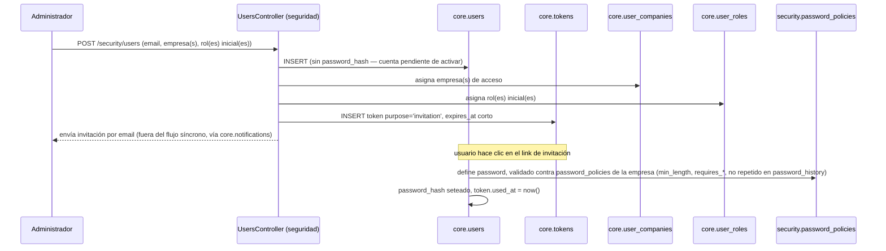
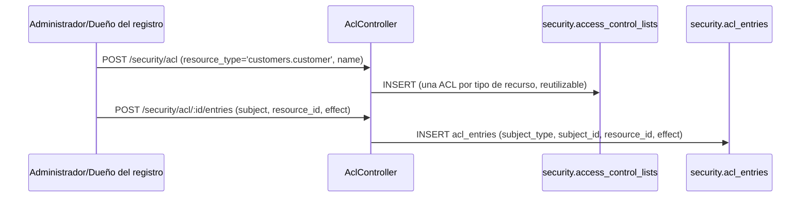
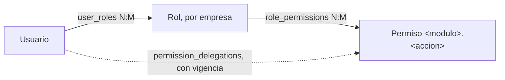
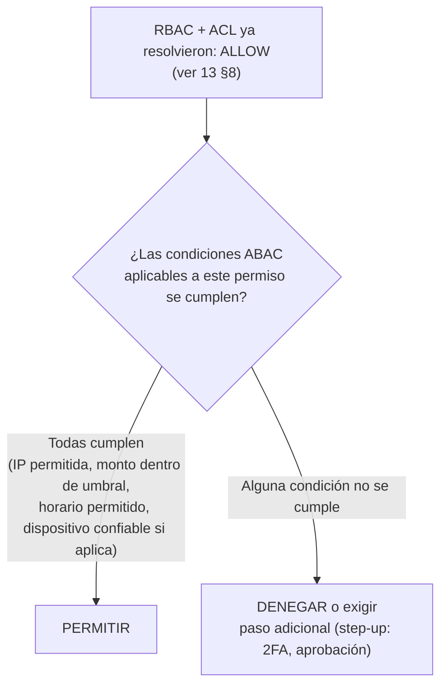
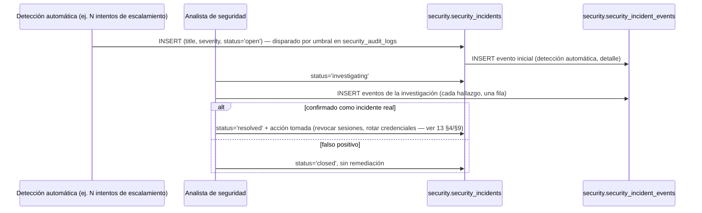

# 15 — Módulo Security (diseño completo)

> Versión 1.0 — 2026-07-13. Mismo criterio que
> [13-modulo-auth.md](./13-modulo-auth.md) y
> [14-modulo-core.md](./14-modulo-core.md). Sin tablas nuevas salvo
> donde se marca explícitamente como **candidato pendiente de ADR**
> (§6, ABAC) — el resto ya existe y está verificado contra
> [sql/01_core.sql](../database/sql/01_core.sql) y
> [sql/02_security.sql](../database/sql/02_security.sql). Sin código.

## 0. Relación con `auth` — qué no se repite acá

`auth` (§0 de [13-modulo-auth.md](./13-modulo-auth.md#0-alcance-y-propiedad-de-datos--por-qué-auth-no-es-un-schema-propio))
ya resolvió qué vive en `core` (identidad, roles/permisos base) y qué
vive en `security` (ACL fino, políticas, 2FA, OAuth2, auditoría de
seguridad). Este documento **no vuelve a explicar esa frontera** —la
da por vigente— y tampoco repite lo que 13 ya diseñó en detalle:
estructura de JWT/sesión, y la **regla de precedencia RBAC vs. ACL**
(deny > allow > rol,
[13 §8](./13-modulo-auth.md#8-autorización-cómo-se-combinan-roles-y-acl-regla-de-precedencia--no-existía)).
Acá se completa lo que faltaba: administración de usuarios (no
login), administración de ACL, diseño de ABAC (que no existía), y
bitácora/auditoría completas.

## 1. Usuarios — administración (no autenticación)

`core.users` es el dato; el ciclo de vida administrativo no estaba
diseñado (13 cubrió login, no alta/baja):

**Baja/offboarding** (tampoco existía como flujo): desactivar
(`is_active = false`, nunca borrado físico — el usuario sigue siendo
`created_by`/`updated_by` de años de registros históricos) dispara,
vía evento `UsuarioDesactivado`: revocar todas las sesiones activas
(reutiliza `RevokeAllSessionsUseCase` de
[13 §9](./13-modulo-auth.md#9-sesiones)), revocar las API Keys que
haya creado (o reasignarlas a un responsable, decisión operativa por
empresa), y remover sus `user_roles`/`user_companies` — sin borrar el
historial de auditoría donde participó como actor.

**Bloqueo por fuerza bruta**: `security.login_attempts` +
`security_policies.max_login_attempts`/`lockout_duration_minutes` ya
son el dato (ver [13 §2](./13-modulo-auth.md#2-jwt)); acá se fija la
regla exacta: se cuentan intentos fallidos consecutivos por
`(email_attempted, ip_address)` dentro de la ventana de
`lockout_duration_minutes` — superado `max_login_attempts`, el login
se rechaza con `429 CUENTA_BLOQUEADA_TEMPORALMENTE` aunque la
contraseña sea correcta, hasta que expire la ventana o un
administrador desbloquee manualmente.

## 2. Roles — resumen (detalle completo en 13)

`core.roles` (por empresa) + `core.user_roles` (N:M) +
`core.role_permissions` (N:M) — modelo RBAC completo ya en
[13 §6](./13-modulo-auth.md#6-roles). Lo único administrativo nuevo
acá: quién puede gestionar roles es en sí un permiso
(`seguridad.gestionar_roles`), y los roles de fábrica
(`is_system_role = true`) son editables en sus permisos pero no
eliminables ni renombrables — garantiza que una empresa nunca quede
sin un rol administrativo funcional por error de un usuario.

## 3. Permisos — resumen (detalle completo en 13)

Catálogo único `<modulo>.<accion>` en `core.permissions`, reutilizado
por 4 mecanismos de concesión (rol, ACL, API key, OAuth scope) — ver
[13 §7](./13-modulo-auth.md#7-permisos). Gobernanza: un permiso nuevo
se agrega **solo** cuando se crea el módulo o el caso de uso que lo
necesita (proceso ya fijado en
[11-gobernanza-y-adrs §1](./11-gobernanza-y-adrs.md#1-cómo-se-agrega-un-módulo-nuevo)),
nunca en tiempo de ejecución vía UI — es parte del contrato de código,
no un dato configurable por el usuario final.

## 4. ACL — administración (nuevo; la precedencia ya está en 13 §8)

`security.access_control_lists` + `acl_entries` resuelven la pregunta
que RBAC no puede: "excepciones puntuales a nivel de un registro
específico". Flujo de administración:

**Casos de uso reales que justifican ACL sobre RBAC** (no estaban
enumerados):

| Caso                                                                                                           | `subject_type` | `resource_id`                       | `effect`                                                                                                                           |
| -------------------------------------------------------------------------------------------------------------- | -------------- | ----------------------------------- | ---------------------------------------------------------------------------------------------------------------------------------- |
| Un vendedor tiene el rol `ventas.crear`/`ver` pero no debe ver la cuenta de un cliente en conflicto de interés | `user`         | ID del `customers.customer` puntual | `deny`                                                                                                                             |
| Un usuario sin rol de RRHH necesita ver un solo legajo por una investigación puntual, con plazo                | `user`         | ID del `hr.employee`                | `allow` (combinado con `security.permission_delegations` si además necesita el permiso de acción, no solo de lectura del registro) |
| Un grupo de auditores externos necesita lectura de todos los asientos de un ejercicio cerrado específico       | `group`        | ID de `accounting.fiscal_year`      | `allow`                                                                                                                            |

`resource_id = NULL` en una entrada de ACL significa "aplica a
**todo** el `resource_type` de esa ACL para ese sujeto" — la forma de
dar una excepción amplia sin crear un rol nuevo de un solo uso.

## 5. RBAC — vista resumen (detalle completo en 13 §6-8)

RBAC es la **capa base** de autorización — resuelve el caso general
("¿este rol puede hacer esto, en cualquier registro?"). ACL (§4) es la
capa de excepción. ABAC (§6) es la capa de condición dinámica. Las
tres se combinan en un único pipeline, no son alternativas — ver la
extensión del diagrama de precedencia de
[13 §8](./13-modulo-auth.md#8-autorización-cómo-se-combinan-roles-y-acl-regla-de-precedencia--no-existía)
al final de §6.

## 6. ABAC (Attribute-Based Access Control) — diseño nuevo, candidato pendiente de ADR

**No existe hoy una tabla genérica de políticas ABAC** en el schema —
esto se declara explícitamente en vez de inventar una tabla nueva sin
pasar por el proceso correspondiente
([11-gobernanza-y-adrs §2](./11-gobernanza-y-adrs.md#2-architecture-decision-records-adr),
un cambio en el modelo de autorización afecta a todos los módulos y
requiere ADR). Lo que sí existe son **piezas ABAC puntuales, ya
implementadas, sin nombre unificado hasta ahora**:

| Atributo evaluado               | Mecanismo ya existente                                                                           | Tipo de atributo                                        |
| ------------------------------- | ------------------------------------------------------------------------------------------------ | ------------------------------------------------------- |
| Rango de IP de origen           | `security.ip_allowlist_entries` / `ip_denylist_entries`                                          | Ambiental (entorno de la request)                       |
| Monto de la transacción         | `core.approval_matrices` (`min_amount`/`max_amount` → `required_role_id`)                        | Del recurso (atributo del objeto sobre el que se actúa) |
| Vigencia temporal de un permiso | `security.permission_delegations` (`starts_at`/`ends_at`)                                        | Temporal                                                |
| Confianza del dispositivo       | `security.trusted_devices` (condiciona si se exige 2FA — ver [13 §5](./13-modulo-auth.md#5-2fa)) | Del sujeto/contexto (riesgo)                            |
| Requisito de 2FA por política   | `security.security_policies.requires_2fa`                                                        | Del sujeto + ambiental combinados                       |

**Diseño propuesto** (conceptual, sin sintaxis de tabla): un ABAC
completo generalizaría estos casos puntuales en un motor de
condiciones evaluado como una capa adicional del pipeline de
autorización, **después** de que RBAC+ACL ya determinaron un `allow`
base (ABAC nunca amplía lo que RBAC/ACL ya negaron — solo puede
restringir más, nunca conceder lo que la capa base no concedió,
principio de menor privilegio):

Estructura mínima que tendría la tabla candidata (para discusión en el
ADR, no creada acá): `security.attribute_policies` — `permission_id`
(a qué permiso aplica), `attribute_source` (qué tabla/campo provee el
atributo: `request.ip`, `resource.amount`, `resource.owner_id`,
`context.time_of_day`), `operator` (`<=`, `IN`, `BETWEEN`...),
`expected_value`. **Por qué no se crea ahora:** sin un motor de
evaluación de expresiones ya decidido (¿se resuelve en SQL vía función,
o en la capa de aplicación en `PermissionsGuard`?), fijar la tabla
prematuramente arriesgaría diseñar el schema equivocado — la decisión
de _dónde_ evalúa ABAC (DB vs. aplicación) es exactamente el tipo de
decisión que un ADR está pensado para capturar.

## 7. Bitácora

Cuatro tablas de log, con propósito y audiencia distintos —
comparación que no existía consolidada en un solo lugar:

| Tabla                            | Qué registra                                                                                                                                                                                | Audiencia típica                                  | Inmutable                          |
| -------------------------------- | ------------------------------------------------------------------------------------------------------------------------------------------------------------------------------------------- | ------------------------------------------------- | ---------------------------------- |
| `core.audit_logs`                | Cambios de datos de negocio (INSERT/UPDATE/DELETE, campo por campo) — ver [05-estrategia-auditoria §2](../database/05-estrategia-auditoria.md#2-coreaudit_logs-captura-genérica-de-cambios) | Soporte funcional, auditoría de negocio, contador | Sí — nadie tiene `UPDATE`/`DELETE` |
| `core.activity_logs`             | Navegación/acciones de usuario para analítica de uso (no cambios de dato)                                                                                                                   | Producto/UX, no seguridad                         | No (es analítica, no evidencia)    |
| `security.security_audit_logs`   | Eventos de seguridad: permiso denegado, escalamiento, rotación de clave — ver [05 §4](../database/05-estrategia-auditoria.md#4-auditoría-de-seguridad-separada)                             | Equipo de seguridad, SIEM externo                 | Sí                                 |
| `security.session_activity_logs` | Actividad granular **dentro** de una sesión con foco en seguridad (accesos denegados, intentos fuera de política)                                                                           | Investigación de incidentes puntuales             | Sí                                 |

La razón de tenerlas separadas (y no una tabla "bitácora" única) es la
misma que ya fundamenta
[05-estrategia-auditoria §1](../database/05-estrategia-auditoria.md#1-las-cuatro-capas-de-auditoría):
cada una responde una pregunta distinta, con un consumidor y un
régimen de retención distintos — fusionarlas sería "eficiente" en
apariencia y costoso en la práctica cada vez que alguien necesita
consultar una sola de las cuatro.

## 8. Auditoría

Las cuatro capas completas (columnas universales, `audit_logs`,
`change_history`, `<entidad>_status_history`) ya están en
[05-estrategia-auditoria.md](../database/05-estrategia-auditoria.md) —
no se repiten. Lo que faltaba y se agrega acá: el **flujo de gestión
de incidentes de seguridad** (`security.security_incidents` +
`security_incident_events`), que hasta ahora solo existía como modelo
de datos sin ciclo de vida:

`severity` (`low`/`medium`/`high`/`critical`) determina el canal de
notificación (vía `core.notifications`/`notification_channels`, ver
[logico/01-core.md](../database/logico/01-core.md)) — un incidente
`critical` no espera a que un analista lo revise para notificar,
dispara alerta inmediata; el resto se agrega a una cola de revisión.

## 9. Trazabilidad

| Punto solicitado | Documento(s) de detalle normativo                                                                                       | Novedad de este documento                                                                 |
| ---------------- | ----------------------------------------------------------------------------------------------------------------------- | ----------------------------------------------------------------------------------------- |
| Usuarios         | [logico/01-core.md](../database/logico/01-core.md) (modelo)                                                             | Ciclo de vida completo: alta/invitación, baja/offboarding, bloqueo por fuerza bruta (§1)  |
| Roles            | [13 §6](./13-modulo-auth.md#6-roles)                                                                                    | Gobernanza de quién administra roles (§2)                                                 |
| Permisos         | [13 §7](./13-modulo-auth.md#7-permisos)                                                                                 | Gobernanza de alta de permisos nuevos (§3)                                                |
| ACL              | [13 §8](./13-modulo-auth.md#8-autorización-cómo-se-combinan-roles-y-acl-regla-de-precedencia--no-existía) (precedencia) | Flujo de administración + casos de uso reales (§4)                                        |
| RBAC             | [13 §6](./13-modulo-auth.md#6-roles)                                                                                    | Vista resumen unificando RBAC+ACL+ABAC (§5)                                               |
| ABAC             | _(no existía)_                                                                                                          | Diseño conceptual completo + tabla candidata explícitamente marcada pendiente de ADR (§6) |
| Bitácora         | [05-estrategia-auditoria §1-4](../database/05-estrategia-auditoria.md)                                                  | Comparación consolidada de las 4 tablas de log (§7)                                       |
| Auditoría        | [05-estrategia-auditoria.md](../database/05-estrategia-auditoria.md) (completo)                                         | Ciclo de vida de gestión de incidentes de seguridad (§8)                                  |
