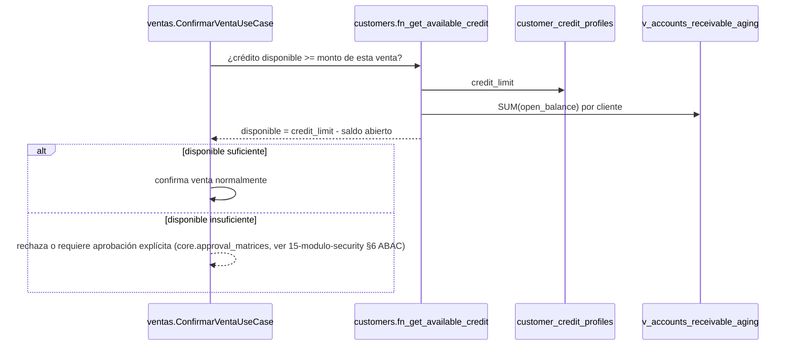

# 16 — Módulo Customers (diseño completo)

> Versión 1.0 — 2026-07-13. Mismo criterio que los documentos de
> módulo anteriores ([13](./13-modulo-auth.md),
> [14](./14-modulo-core.md), [15](./15-modulo-security.md)). Sin
> tablas nuevas — el modelo ya existe y está verificado contra
> [sql/03_customers.sql](../database/sql/03_customers.sql) (18 tablas)
> y las vistas/funciones reales de
> [sql/24_views.sql](../database/sql/24_views.sql) y
> [sql/25_functions.sql](../database/sql/25_functions.sql). Sin
> código.

## 0. Alcance — a diferencia de Auth/Core/Security, acá casi todo es del propio módulo

Los 7 puntos pedidos, verificados contra el schema real:

| Elemento pedido   | Tabla(s) real(es)                                                                                | ¿Es de `customers`? |
| ----------------- | ------------------------------------------------------------------------------------------------ | ------------------- |
| Clientes          | `customers.customers`                                                                            | Sí                  |
| Contactos         | `customers.customer_contacts`                                                                    | Sí                  |
| Direcciones       | `customers.customer_addresses`                                                                   | Sí                  |
| Créditos          | `customers.customer_credit_profiles`, `customer_credit_limit_history`                            | Sí                  |
| Estados de Cuenta | `customers.customer_statements`                                                                  | Sí                  |
| Documentos        | _(no existe `customer_documents`)_                                                               | **No** — ver §6     |
| Historial         | `customer_credit_limit_history`, `customer_block_history`, `customer_visits` + `core.audit_logs` | Parcial — ver §7    |

La única corrección real es **Documentos**: por la regla de
no-duplicación ya fijada
([01-modelo-conceptual §3](../database/01-modelo-conceptual.md#3-regla-de-no-duplicación-entre-módulos),
confirmada en la nota de cabecera de
[logico/03-customers.md](../database/logico/03-customers.md)), los
archivos adjuntos a un cliente usan `core.documents` (polimórfico),
nunca una tabla propia — evita que 21 módulos tengan cada uno su
`<modulo>_documents`. `customers` es, por lo demás, dueño exclusivo de
sus 18 tablas — `sales`, `crm` y `pos` la referencian por ID, nunca la
escriben (patrón "módulo dueño",
[06-comunicacion-entre-modulos §4](./06-comunicacion-entre-modulos.md#4-patrón-módulo-dueño-para-entidades-compartidas)).

## 1. Clientes (`customers.customers`)

Maestro único — `tax_id` único por empresa (`company_id, tax_id`),
`legal_name` indexado con GIN+trigram para búsqueda de texto libre
(ya en el SQL real). Dos entradas al alta, no una:

- **Alta directa**: un usuario de `ventas` o `customers` crea el
  cliente completo desde el módulo.
- **Conversión desde CRM**: `crm.opportunities` "ganada" invoca el
  comando público `ClientesCommandService.crear()` — nunca un INSERT
  directo, ni siquiera desde un módulo que "ya conoce" los datos del
  prospecto (ver
  [logico/13-crm.md](../database/logico/13-crm.md), nota de cabecera).
  Este es el único camino de alta válido cuando el origen es un
  prospecto — evita clientes duplicados con datos parcialmente
  distintos del mismo prospecto.

**Bloqueo comercial** (`is_blocked`, `block_reason` en la fila +
`customer_block_history` como bitácora — dos mecanismos
complementarios, no redundantes): `is_blocked = true` es lo que
`ventas` consulta en caliente antes de confirmar una venta (columna,
rápido); `customer_block_history` es el _por qué y cuándo_ de cada
cambio de ese booleano (ver §7). Un cliente bloqueado puede seguir
recibiendo cobros (`sales.receipts`) — el bloqueo impide **nuevas**
ventas a crédito, no el cobro de lo ya vendido.

`assigned_salesperson_id` y `loyalty_program_id` (en
`customer_loyalty_accounts`) son **IDs sueltos** hacia `sales` — sin
FK real, porque `sales` depende de `customers`, nunca al revés (regla
direccional ya fijada en
[06 §1](./06-comunicacion-entre-modulos.md#1-dos-formas-de-comunicación-y-solo-dos)):
si `customers` tuviera FK real hacia `sales.salespeople`, el ciclo de
dependencia sería un error de build.

## 2. Contactos (`customers.customer_contacts`)

Múltiples contactos por cliente, `is_primary` marca el de referencia
para comunicación por defecto. **Regla no reforzada hoy a nivel de
base de datos** (gap identificado, no bloqueante): nada impide hoy dos
contactos `is_primary = true` para el mismo cliente — el candidato
natural es un índice único parcial
`(customer_id) WHERE is_primary = true AND deleted_at IS NULL`, mismo
patrón ya usado para `core.branches.is_main_branch` (señalado como
pendiente equivalente en
[14-modulo-core §2](./14-modulo-core.md#2-branches-corebranches--dueño-real-core)).
Hasta que se agregue, la unicidad la garantiza el caso de uso
(`CrearContactoUseCase` desmarca el anterior antes de marcar el
nuevo), no el motor.

## 3. Direcciones (`customers.customer_addresses`)

`address_type` limitado por `CHECK` a `billing`/`shipping`/`other` —
deliberadamente sin tabla catálogo (3 valores fijos, sin necesidad de
traducción ni metadata propia, ver criterio de
[02a-restricciones-e-indices §4](../database/02a-restricciones-e-indices.md#4-restricciones--patrón-por-rol-de-tabla),
fila "Enumeraciones embebidas"). `is_default` tiene el mismo gap de
unicidad que `is_primary` en contactos (§2) — mismo criterio de
solución, evaluado **por `address_type`** (puede haber una dirección
`billing` default y una `shipping` default simultáneamente, son
independientes). `municipality_id` es FK diferida (cerrada recién en
[21_configuration.sql](../database/sql/21_configuration.sql)) hacia el
árbol geográfico país→provincia→municipio de `configuration` — nunca
duplicado acá.

## 4. Créditos

Tres piezas que trabajan juntas — **verificadas contra la función y
vista reales**, no una descripción aproximada:

1. **`customer_credit_profiles`** (1:1): `credit_limit`,
   `payment_terms_days`, `billing_cutoff_day` — el límite vigente.
2. **`customers.v_accounts_receivable_aging`** (vista real, ver
   [24_views.sql](../database/sql/24_views.sql)): antigüedad de saldos
   por factura, calculada como `total_amount - SUM(receipt_allocations aplicados)`,
   agrupada en buckets `0-30`/`31-60`/`61-90`/`90+` — **no es una
   tabla**, se recalcula en cada consulta desde `sales.invoices` +
   `sales.receipt_allocations`, siempre al día.
3. **`customers.fn_get_available_credit(customer_id)`** (función real,
   ver [25_functions.sql](../database/sql/25_functions.sql)): resta el
   saldo abierto total (suma de la vista anterior) al `credit_limit`
   del perfil — el "crédito disponible" que consume `ventas` antes de
   confirmar una venta a crédito.

**Flujo de control de crédito al confirmar una venta** (conecta las
tres piezas — no existía como flujo único):

**Cambio de límite de crédito** siempre pasa por
`customer_credit_limit_history` (`previous_limit`, `new_limit`,
`approved_by_user_id` obligatorio en la fila, no solo en
`created_by`/`updated_by` universal — es un campo de negocio propio
porque "quién aprobó este límite específico" es distinto de "quién
tocó la fila por última vez"). `customer_references` (comerciales/
personales) es el insumo cualitativo de la decisión de otorgar un
límite inicial — no participa del cálculo automático de disponible,
es soporte para la evaluación humana.

## 5. Estados de Cuenta (`customer_statements`)

**Snapshot, no vista** — a diferencia de `v_accounts_receivable_aging`
(§4, siempre recalculada), un `customer_statement` congela
`snapshot_data JSONB` en el momento de su generación, con valor
probatorio/legal (ya fijado en el comentario del schema). Esto
resuelve una pregunta de diseño que no estaba explícita: **por qué no
alcanza con la vista** — un estado de cuenta que el cliente reclama o
que se usa en un litigio debe verse exactamente igual hoy que el día
que se emitió, aunque después se apliquen más cobros o se corrija un
movimiento; la vista, por definición, no puede darte eso.

**Cuándo se genera** (no estaba definido): dos disparadores válidos,
no mutuamente excluyentes — (a) job programado
(`core.scheduled_jobs`, ver
[14-modulo-core §1](./14-modulo-core.md#1-companies-corecompanies--dueño-real-core))
que corre al cierre de cada `billing_cutoff_day` por cliente, y (b) a
demanda, cuando un usuario o el propio cliente (portal) solicita un
estado de cuenta fuera de ciclo. Ambos casos ejecutan el mismo caso de
uso (`GenerarEstadoDeCuentaUseCase`), que lee
`v_accounts_receivable_aging` en ese instante y la serializa en
`snapshot_data` — la vista es la _fuente_, el statement es la
_fotografía_.

## 6. Documentos — no es una tabla de `customers` (aclaración de diseño)

No existe `customer_documents`. Todo archivo adjunto a un cliente
(contrato firmado, escaneo de identificación fiscal, solicitud de
crédito firmada, comprobante de referencia comercial) usa
`core.documents` con `source_module = 'customers'` y
`source_entity_id = customers.customers.id` — el mismo mecanismo
polimórfico documentado en
[14-modulo-core](./14-modulo-core.md) y
[logico/01-core.md](../database/logico/01-core.md). `customers` no
necesita saber nada de almacenamiento, versionado ni tipos de
documento — solo pasa la referencia. `document_type_id` (catálogo de
`core.document_types`) es lo que distingue, en la práctica, un
"contrato de cliente" de un "comprobante de pago" sin que `customers`
tenga que modelar esa distinción.

## 7. Historial — consolidado (no existía como vista unificada)

Cuatro fuentes de historial de un cliente, cada una con su propósito —
mismo criterio que la comparación de bitácoras de
[15-modulo-security §7](./15-modulo-security.md#7-bitácora), aplicado
acá a un cliente específico:

| Fuente                                                                                         | Qué responde                                                           | Alcance                                                 |
| ---------------------------------------------------------------------------------------------- | ---------------------------------------------------------------------- | ------------------------------------------------------- |
| `customer_credit_limit_history`                                                                | "¿Cómo cambió su límite de crédito y quién lo aprobó?"                 | Solo cambios de crédito                                 |
| `customer_block_history`                                                                       | "¿Cuándo se bloqueó/desbloqueó comercialmente y por qué?"              | Solo bloqueo comercial                                  |
| `customer_visits`                                                                              | "¿Qué visitas de venta recibió, cuándo y con qué resultado?"           | Solo actividad comercial de campo                       |
| `core.audit_logs` filtrado por `table_schema='customers', table_name='customers', row_id=<id>` | "¿Qué campo cambió, exactamente, y cuándo, en el maestro del cliente?" | Cualquier cambio de la fila `customers.customers` en sí |

**Vista "Cliente 360" propuesta** (síntesis nueva, no una tabla —
una consulta de agregación en la capa de aplicación, en
`ClientesQueryService`): combina las cuatro fuentes ordenadas por
fecha en una sola línea de tiempo para la pantalla de detalle de
cliente, más los eventos de negocio relevantes que sí tienen dueño en
otro módulo pero se muestran por referencia de solo lectura
(`sales.invoices` del cliente, `crm.opportunities` de las que se
originó) — consistente con que `customers` sigue sin escribir ni
duplicar esos datos, solo los proyecta en una vista de lectura
agregada para el usuario final.

## 8. Trazabilidad

| Punto solicitado  | Documento(s) de detalle normativo                                                                          | Novedad de este documento                                                                      |
| ----------------- | ---------------------------------------------------------------------------------------------------------- | ---------------------------------------------------------------------------------------------- |
| Clientes          | [logico/03-customers.md](../database/logico/03-customers.md)                                               | Los dos caminos de alta válidos (directo vs. conversión CRM) + mecanismo de bloqueo (§1)       |
| Contactos         | Ídem                                                                                                       | Gap de unicidad de contacto primario, con solución propuesta (§2)                              |
| Direcciones       | Ídem                                                                                                       | Gap de unicidad de dirección default por tipo (§3)                                             |
| Créditos          | [sql/24_views.sql](../database/sql/24_views.sql), [sql/25_functions.sql](../database/sql/25_functions.sql) | Flujo completo de control de crédito al vender, verificado contra la función/vista reales (§4) |
| Estados de Cuenta | [sql/03_customers.sql](../database/sql/03_customers.sql) (modelo)                                          | Por qué es snapshot y no vista + cuándo se dispara (§5)                                        |
| Documentos        | [logico/01-core.md](../database/logico/01-core.md) (`core.documents`)                                      | Aclaración de que no es tabla propia (§6)                                                      |
| Historial         | _(no existía consolidado)_                                                                                 | Comparación de las 4 fuentes + propuesta de vista "Cliente 360" (§7)                           |
