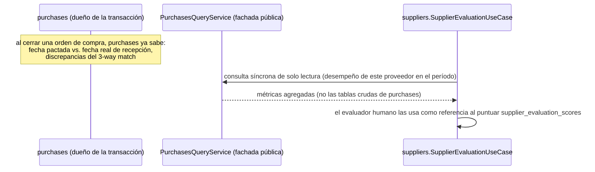

# 17 — Módulo Suppliers (diseño completo)

> Versión 1.0 — 2026-07-13. Mismo criterio que los documentos de
> módulo anteriores. Sin tablas nuevas — verificado contra
> [sql/04_suppliers.sql](../database/sql/04_suppliers.sql) (13 tablas)
> y, para las secciones de Compras y Pagos, contra
> [sql/10_banks.sql](../database/sql/10_banks.sql) y
> [sql/24_views.sql](../database/sql/24_views.sql) reales. Sin código.

## 0. Alcance — mismo patrón que Customers, con dos correcciones

`suppliers` es el espejo de `customers` del lado de compras
([logico/04-suppliers.md](../database/logico/04-suppliers.md), nota
de cabecera). De los 6 puntos pedidos, **4 son de `suppliers`** y 2
pertenecen a otros módulos por la misma regla de no-duplicación ya
aplicada en
[16-modulo-customers §0](./16-modulo-customers.md#0-alcance--a-diferencia-de-authcoresecurity-acá-casi-todo-es-del-propio-módulo):

| Elemento pedido | Dueño real                                                         | Nota                                                                                                                                                                 |
| --------------- | ------------------------------------------------------------------ | -------------------------------------------------------------------------------------------------------------------------------------------------------------------- |
| Proveedores     | `suppliers.suppliers`                                              | ✅                                                                                                                                                                   |
| Contactos       | `suppliers.supplier_contacts`                                      | ✅                                                                                                                                                                   |
| Direcciones     | `suppliers.supplier_addresses`                                     | ✅                                                                                                                                                                   |
| Compras         | `purchases.*`                                                      | **No** — `suppliers` es dueño del maestro y su evaluación, no de las transacciones de compra ([logico/04-suppliers.md](../database/logico/04-suppliers.md)) — ver §4 |
| Pagos           | `banks.*` (transferencias, cheques, lotes) + `cash.*` (pago menor) | **No** — mismo motivo, ver §5                                                                                                                                        |
| Historial       | `suppliers.supplier_history`                                       | ✅ — a diferencia de `customers`, acá **sí existe** una tabla unificada (ver §6)                                                                                     |

## 1. Proveedores (`suppliers.suppliers`)

Maestro único, `tax_id` único por empresa, mismo patrón de bloqueo
(`is_blocked`/`block_reason` + `supplier_block_history`) que
`customers.customers`. **Diferencia de fondo con el maestro de
clientes**, no solo de nombre de tabla: en `customers`, el crédito lo
otorga _la empresa al cliente_; en `suppliers`,
`supplier_credit_profiles` registra el crédito que **el proveedor le
otorga a la empresa** (comentario del schema real:
"Condiciones de crédito que el proveedor otorga a la empresa") — la
empresa es la deudora acá, no la acreedora. Esto invierte el sentido
de "crédito disponible": para clientes se calcula cuánto puede seguir
comprando el cliente a crédito (§4 de
[16-modulo-customers](./16-modulo-customers.md#4-créditos)); para
proveedores no hay un cálculo equivalente de "disponible" porque quien
concede el límite es el proveedor, no la empresa — `credit_limit` acá
es informativo (el tope que el proveedor acordó), no una validación
que `purchases` deba hacer cumplir del lado de GORAZUS.

`payment_terms_days` existe **en dos lugares** (`suppliers.suppliers`
y `supplier_credit_profiles`) — no es duplicación accidental: el de
`suppliers` es el término general por defecto del proveedor, el de
`supplier_credit_profiles` es el término asociado específicamente al
crédito otorgado, que puede diferir (p. ej. un proveedor con término
general de 30 días pero 60 días para líneas de crédito preaprobadas).

`supplier_withholding_profiles` (régimen de retención por defecto) no
tiene equivalente en `customers` — asimetría de negocio real, no un
descuido: la empresa retiene impuestos a sus proveedores al pagarles
(según el régimen fiscal del país, ver
[configuration.fiscal_regimes](../database/logico/21-configuration.md)),
pero no retiene a sus clientes al cobrarles.

## 2. Contactos (`suppliers.supplier_contacts`)

Mismo modelo y mismo gap que
[16-modulo-customers §2](./16-modulo-customers.md#2-contactos-customerscustomer_contacts):
`is_primary` sin índice único parcial que impida dos contactos
primarios simultáneos — misma solución propuesta (reforzar en el caso
de uso hasta que se agregue el índice).

## 3. Direcciones (`suppliers.supplier_addresses`)

Mismo modelo que
[16-modulo-customers §3](./16-modulo-customers.md#3-direcciones-customerscustomer_addresses):
`address_type` vía `CHECK` (`billing`/`shipping`/`other`),
`municipality_id` diferida hacia `configuration`, mismo gap de
unicidad de `is_default` por tipo.

## 4. Compras — no es una tabla de `suppliers` (aclaración de diseño)

`purchases` es el dueño real (27 tablas: requisiciones, cotizaciones,
órdenes de compra, recepciones, facturas de compra, 3-way match,
devoluciones — ver
[logico/08-purchases.md](../database/logico/08-purchases.md)).
`suppliers.suppliers.id` es referenciado por ID desde `purchase_orders`,
`purchase_quotes`, `purchase_invoices`, etc. — `suppliers` nunca
escribe una transacción de compra, solo es consultado.

**Relación que sí es nueva acá — retroalimentación evaluación↔compra**
(no estaba conectada antes): `supplier_evaluations` /
`supplier_evaluation_scores` (calidad, plazo, precio) son
`suppliers`, pero el **insumo objetivo** para completarlas (¿llegó a
tiempo?, ¿hubo discrepancia en el 3-way match?) vive en `purchases`
(`purchase_invoice_matching`, fechas de `goods_receipt_notes` vs.
`purchase_orders`). El flujo correcto, consistente con "módulo dueño":

`suppliers` **no calcula automáticamente** el puntaje de evaluación a
partir de esas métricas —la evaluación sigue siendo una decisión
humana registrada (`evaluated_by_user_id`)— pero sí puede
**pre-cargarlas como sugerencia** en el formulario de evaluación,
evitando que el evaluador tenga que ir a buscar los datos a `purchases`
por su cuenta.

## 5. Pagos — no es una tabla de `suppliers` (aclaración de diseño + gap real encontrado)

Los pagos a proveedores ocurren en `banks`
(`checks_issued.supplier_id`, `bank_transfers`, `bank_payment_batches`

- `bank_payment_batch_lines`) o en `cash` (pago menor). `suppliers`
  solo es referenciado por ID.

**Gap real, verificado contra el SQL** (no estaba señalado antes):
del lado de clientes, `sales.receipt_allocations` vincula
explícitamente un cobro con la(s) factura(s) que salda
(`amount_applied` por factura), y eso es lo que permite que
`customers.v_accounts_receivable_aging`
([16-modulo-customers §4](./16-modulo-customers.md#4-créditos)) reste
los pagos aplicados y muestre el saldo _neto_ real. Del lado de
proveedores, **no existe una tabla equivalente**: verifiqué
`banks.checks_issued` (tiene `supplier_id`, no `purchase_invoice_id`)
y `banks.bank_payment_batch_lines` (tiene `source_module`/
`source_entity_id` polimórfico genérico, no una relación explícita
"este pago salda estas facturas específicas"). Consecuencia directa,
también verificada: `suppliers.v_accounts_payable_aging`
([sql/24_views.sql](../database/sql/24_views.sql)) expone
`pi.total_amount` **sin restar pagos ya realizados** — a diferencia de
su espejo de cuentas por cobrar, hoy no neta lo pagado.

**Esto es una asimetría estructural real entre los dos módulos
espejo**, no una simplificación intencional documentada en ningún
lado — se deja señalada como candidata a ADR (afecta a `banks` y a la
vista de `suppliers`, dos módulos, por lo que corresponde el proceso
de [11-gobernanza-y-adrs §2](./11-gobernanza-y-adrs.md#2-architecture-decision-records-adr),
no un ajuste silencioso). La solución natural sería una tabla
`banks.payment_allocations` (mismo patrón que
`sales.receipt_allocations`) vinculando cada pago (cheque,
transferencia, línea de lote) con la(s) `purchase_invoice_id` que
salda — no se crea acá por la misma razón que no se creó la tabla ABAC
en [15-modulo-security §6](./15-modulo-security.md#6-abac-attribute-based-access-control--diseño-nuevo-candidato-pendiente-de-adr):
es un cambio de schema real, no un documento de diseño.

## 6. Historial (`suppliers.supplier_history`)

**A diferencia de `customers`**, donde no existe una tabla histórica
genérica y hubo que proponer una vista "Cliente 360" en la capa de
aplicación
([16-modulo-customers §7](./16-modulo-customers.md#7-historial--consolidado-no-existía-como-vista-unificada)),
acá **sí existe** `supplier_history` (`event_description` libre +
`occurred_at`) como tabla real. Vale aclarar su alcance para que no se
use mal: complementa, no reemplaza, a
`supplier_credit_limit_history` (cambios de crédito) y
`supplier_block_history` (bloqueo) — esas dos siguen siendo la fuente
de verdad para _sus_ eventos específicos, con columnas tipadas
(`previous_limit`/`new_limit`, `action`/`reason`).
`supplier_history` es para eventos relevantes que **no** encajan en
ninguna tabla tipada existente (p. ej. "proveedor notificó cambio de
razón social", "se resolvió disputa comercial") — un log narrativo
libre, más cercano en espíritu a `core.activity_logs` que a
`core.audit_logs` (no es auditoría técnica de cambios de campo, es
curaduría humana de hechos relevantes).

**Observación de consistencia** (no se resuelve acá, se señala): esta
asimetría entre `customers` (sin tabla genérica) y `suppliers` (con
`supplier_history`) es candidata a revisarse — o se agrega
`customer_history` equivalente, o se documenta explícitamente por qué
el maestro de proveedores la necesita y el de clientes no. Hoy no hay
una razón de negocio registrada para la diferencia, así que se trata
como inconsistencia de diseño pendiente de decisión, no como decisión
deliberada.

## 7. Trazabilidad

| Punto solicitado | Documento(s) de detalle normativo                                                                  | Novedad de este documento                                                                                                         |
| ---------------- | -------------------------------------------------------------------------------------------------- | --------------------------------------------------------------------------------------------------------------------------------- |
| Proveedores      | [logico/04-suppliers.md](../database/logico/04-suppliers.md)                                       | Inversión del sentido del crédito vs. clientes + por qué `payment_terms_days` está en dos tablas (§1)                             |
| Contactos        | Ídem                                                                                               | Mismo gap de unicidad que `customers`, referenciado no repetido (§2)                                                              |
| Direcciones      | Ídem                                                                                               | Ídem (§3)                                                                                                                         |
| Compras          | [logico/08-purchases.md](../database/logico/08-purchases.md)                                       | Flujo de retroalimentación evaluación↔desempeño de compra (§4)                                                                    |
| Pagos            | [sql/10_banks.sql](../database/sql/10_banks.sql), [sql/24_views.sql](../database/sql/24_views.sql) | **Gap real encontrado**: sin tabla de asignación pago↔factura, a diferencia de `sales.receipt_allocations` — candidata a ADR (§5) |
| Historial        | [sql/04_suppliers.sql](../database/sql/04_suppliers.sql)                                           | Alcance de `supplier_history` vs. tablas específicas + asimetría con `customers` señalada (§6)                                    |
