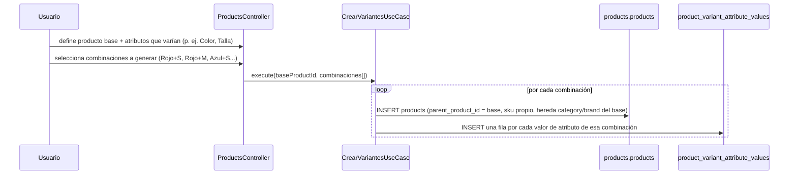
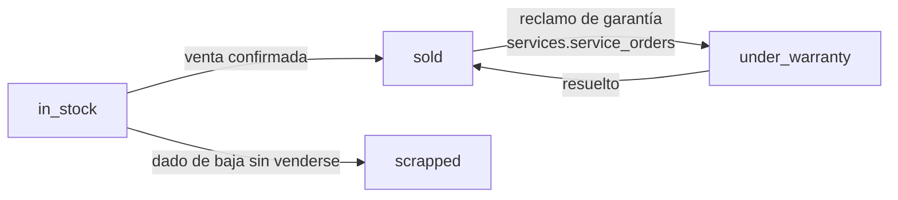

# 18 — Módulo Products (diseño completo)

> Versión 1.0 — 2026-07-13. Mismo criterio que los documentos de
> módulo anteriores. Sin tablas nuevas. Verificado tabla por tabla
> contra [sql/05_products.sql](../database/sql/05_products.sql) (35
> tablas reales, contadas por grep — no de memoria) y, para
> Lotes/Series, contra [sql/06_inventory.sql](../database/sql/06_inventory.sql).
> Sin código.

## 0. Alcance — dos correcciones encontradas al verificar

| Elemento pedido                                                           | Dueño real      | Nota                                                                                                                                                                                                |
| ------------------------------------------------------------------------- | --------------- | --------------------------------------------------------------------------------------------------------------------------------------------------------------------------------------------------- |
| Productos, Categorías, Marcas, Modelos, Imágenes, Atributos, Combos, Kits | `products`      | ✅                                                                                                                                                                                                  |
| **Variantes**                                                             | `products`      | ✅ pero **no es tabla propia** — corregido en §5, ver también la corrección aplicada a [logico/05-products.md](../database/logico/05-products.md)                                                   |
| **Lotes, Series**                                                         | `inventory`     | **No** son de `products` — la _definición_ (¿este producto rastrea lote/serie?) sí vive en `products.products`, las _instancias_ viven en `inventory.inventory_lots`/`inventory_serials` — ver §6-7 |
| **Servicios**                                                             | _(no es tabla)_ | Es un valor de `products.product_type` — ver §12                                                                                                                                                    |

**Corrección de documentación aplicada en este mismo trabajo:**
[logico/05-products.md](../database/logico/05-products.md) listaba
`product_variants` como si fuera una tabla física separada, con FK
propia. Verificado contra el SQL real: **no existe tal tabla** — una
variante es una fila de `products.products` con `parent_product_id`
seteado (auto-referencia, mismo patrón que `product_categories`). Se
corrigió el documento lógico para que coincida con la fuente de
verdad real ([sql/05_products.sql](../database/sql/05_products.sql)).
También se corrigió el conteo de tablas de `products` en
[02-modelo-logico.md](../database/02-modelo-logico.md) (era 36,
son 35 — y de paso `configuration` era 22, son 23; el total real de
495 no cambia porque los dos errores se cancelaban).

## 1. Productos (`products.products`)

Entidad central — `sku` único por empresa, `product_type` (`CHECK IN
('good', 'service', 'kit', 'combo', 'composite')`) determina el
comportamiento de todo lo demás, no una tabla separada por tipo. Tres
grupos de columnas que solo aplican según el tipo (no estaba
explicitado como regla):

| Columna                                                                                      | Aplica a                    | Irrelevante para                                                    |
| -------------------------------------------------------------------------------------------- | --------------------------- | ------------------------------------------------------------------- |
| `base_unit_id`, `costing_method`, `tracks_serial`, `tracks_lot`, `standard_cost`             | `good` (tiene stock físico) | `service` (no tiene existencia física que costear/rastrear)         |
| `parent_product_id`                                                                          | Variantes de `good` (§5)    | `kit`/`combo`/`composite` (no tienen variantes, tienen componentes) |
| Nada propio — el precio surge de sus componentes o de `pricing_policy`/`discount_percentage` | `kit`, `combo`              | —                                                                   |

`category_id`, `brand_id`, `model_id`, `line_id`, `family_id`,
`collection_id` son seis dimensiones de clasificación **independientes
entre sí**, todas opcionales — un producto puede tener marca sin línea,
línea sin colección, etc. No hay jerarquía obligatoria entre ellas
(a diferencia de `product_categories`, que sí es jerárquica en sí
misma vía auto-referencia).

## 2. Categorías (`product_categories`)

Jerárquica auto-referenciada de N niveles (`parent_category_id`) —
sustituye categoría+subcategoría de dos niveles fijos, mismo patrón ya
documentado en
[02-modelo-logico §1](../database/02-modelo-logico.md#1-cómo-se-pasa-de-350-entidades-conceptuales-a-700-1000-tablas-físicas).
`code` único por empresa, `product_category_translations` para el
nombre visible por idioma.

## 3. Marcas (`brands`) y 4. Modelos (`product_models`)

`brands` es plana (sin jerarquía). `product_models.brand_id` es
`NOT NULL` — un modelo **siempre** pertenece a una marca, no existe
"modelo sin marca" (a diferencia de `products.brand_id`, que sí es
opcional — un producto puede no tener marca definida, pero si tiene
modelo, ese modelo ya trae su marca implícita a través de la FK). Esto
significa que en la práctica, si se asigna `model_id` a un producto,
`brand_id` debería ser consistente con `product_models.brand_id` — una
validación de invariante de dominio a nivel de `entities/`, no
reforzada hoy por `CHECK` cruzado (Postgres no puede expresar un
`CHECK` que consulte otra tabla).

## 5. Variantes — no es tabla propia (corrección aplicada)

Una variante **es** una fila más de `products.products`, con
`parent_product_id` apuntando al producto base. Lo que la hace
"variante de talla/color" en vez de "otro producto cualquiera" es
`product_variant_attribute_values` — la combinación de valores de
atributo que le corresponde.

**Flujo de creación de variantes** (no existía documentado):

**Gap identificado, no bloqueante**: `product_variant_attribute_values`
tiene único `(variant_product_id, attribute_value_id)` — impide que la
_misma_ variante tenga el valor `Rojo` duplicado, pero no impide que
**dos variantes distintas** del mismo padre terminen con exactamente
la misma combinación de valores (dos filas "Rojo+S" para el mismo
producto base). Se resuelve hoy en el caso de uso (valida combinación
única antes de insertar), candidato a reforzarse con un índice
funcional si se confirma que ocurre en producción.

## 6. Lotes (`inventory.inventory_lots`) — dueño real: `inventory`

`products.products.tracks_lot = true` es la _declaración_ de que un
producto se rastrea por lote; `inventory.inventory_lots` (`lot_number`,
`expiry_date`, `remaining_quantity`) son las _instancias_ reales,
creadas por `inventory` al recibir mercadería
(`inventory.goods_receipts`), nunca por `products`. `expiry_date`
conecta con `hr`/`payroll`/`services` de forma indirecta a través de
`configuration.holidays` para cálculo de plazos de vencimiento
hábiles — pero el consumidor directo más relevante es `inventory`
(alertas de vencimiento) y `sales` (reglas FEFO: primero en vencer,
primero en salir, para productos con `tracks_lot`).

## 7. Series (`inventory.inventory_serials`) — dueño real: `inventory`

Igual patrón: `products.products.tracks_serial = true` declara la
capacidad; `inventory.inventory_serials` (`serial_number`, `status
CHECK IN ('in_stock', 'sold', 'under_warranty', 'scrapped')`) es la
instancia real, con **ciclo de vida propio** que no estaba antes
descrito como flujo:

Un número de serie con `status = 'sold'` es lo que
`sales.warranties`/`services.service_orders` referencian para saber
exactamente **qué unidad física** está bajo reclamo — no alcanza con
saber "qué producto", en un bien serializado importa la unidad
específica.

## 8. Imágenes (`product_images` + `product_videos`)

`file_id → core.files` — reutiliza el repositorio transversal de
archivos, `products` no gestiona almacenamiento propio (mismo patrón
que `core.documents`, ver
[16-modulo-customers §6](./16-modulo-customers.md#6-documentos--no-es-una-tabla-de-customers-aclaración-de-diseño)).
`display_order` ordena la galería — convención (no forzada por
constraint): `display_order = 0` es la imagen principal/portada,
mostrada en listados y resultados de búsqueda; el resto son galería de
detalle.

## 9. Atributos (`product_attributes` + `product_attribute_values` + traducciones)

Sistema **genérico**, no catálogos dedicados — es la pieza que hace
innecesarias las tablas `colors`/`sizes`/`materials` que un ERP menos
disciplinado tendría (ver
[02-modelo-logico §4](../database/02-modelo-logico.md#4-nota-transparente-sobre-el-número-494-vs-el-rango-700-1000-pedido)).
`product_attributes.code` (`'color'`, `'size'`, `'material'`...) se
siembra en `22_seed_data.sql`, pero una empresa puede definir
atributos propios (`'voltaje'`, `'sabor'`) sin tocar schema — la
extensibilidad real que el modelo genérico está diseñado para dar.

## 10. Combos (`product_combos` + `product_combo_components`)

1:1 con un `products.products` de `product_type = 'combo'`.
`discount_percentage` — el combo existe explícitamente para vender
varios productos juntos **más barato** que por separado.

## 11. Kits (`product_kits` + `product_kit_components`)

1:1 con un `products.products` de `product_type = 'kit'`.
`pricing_policy CHECK IN ('sum_components', 'fixed')` — a diferencia
del combo, un kit no necesariamente implica descuento: puede cobrarse
exactamente la suma de sus partes (agrupación por conveniencia de
venta) o un precio fijo independiente de esa suma.

### 11.1 Kit vs. Combo vs. BOM vs. Receta — comparación que no existía

Las cuatro tablas de composición del módulo resuelven problemas
distintos, aunque todas modelen "un producto hecho de otros
productos" — confundirlas es el error de diseño más probable acá:

| Mecanismo                     | `product_type`                | Se consume en...                                                                                                                 | Fija precio propio                       |
| ----------------------------- | ----------------------------- | -------------------------------------------------------------------------------------------------------------------------------- | ---------------------------------------- |
| **Kit**                       | `kit`                         | Venta (agrupación comercial, sin transformación física)                                                                          | Sí (`pricing_policy`)                    |
| **Combo**                     | `combo`                       | Venta (agrupación con descuento)                                                                                                 | Sí (`discount_percentage` sobre la suma) |
| **BOM** (`bill_of_materials`) | `composite`                   | Producción (`inventory.production_orders` consume los componentes y genera el producto terminado — transformación física real)   | No — el costo se calcula, no se fija     |
| **Receta** (`recipes`)        | `composite` (variante de BOM) | Igual que BOM, pero con `yield_quantity`/`yield_unit_id` — pensado para industria alimenticia/servicios con rendimiento variable | No                                       |

Kit y Combo **no generan movimiento de inventario propio** — al
vender un kit, `inventory` descuenta stock de **cada componente**, no
del kit en sí (el kit no tiene `Stock`, es una fachada de venta). BOM
y Receta sí generan una transformación física real vía
`inventory.production_orders` (consumo de componentes + ingreso de
producto terminado) — es la diferencia de fondo entre "vender cosas
juntas" y "fabricar algo nuevo a partir de insumos".

## 12. Servicios — no es tabla propia (aclaración de diseño)

`product_type = 'service'` en `products.products`. Un producto
servicio **no tiene** — deliberadamente— `tracks_serial`/`tracks_lot`
relevantes, no participa de `inventory.stock` (no hay existencia que
mover), y su `costing_method` es irrelevante en el sentido de costeo
de inventario (aunque puede tener `standard_cost` con otro
significado: costo de mano de obra estimado, no costo de mercadería).
Se vende exactamente igual que un `good` en `sales.invoice_lines`
(mismo flujo documental, ver
[16-modulo-customers](./16-modulo-customers.md) y
[docs/architecture/04-catalogo-modulos-negocio.md](./04-catalogo-modulos-negocio.md))
— la diferencia está enteramente en qué eventos dispara `inventory`
al confirmarse la venta: para un `good`, descuenta stock; para un
`service`, no hace nada (no hay handler de `VentaConfirmada` en
`inventory` para líneas de producto tipo servicio).

## 13. Trazabilidad

| Punto solicitado | Documento(s) de detalle normativo                            | Novedad de este documento                                                                    |
| ---------------- | ------------------------------------------------------------ | -------------------------------------------------------------------------------------------- |
| Productos        | [sql/05_products.sql](../database/sql/05_products.sql)       | Tabla de qué columnas aplican según `product_type` (§1)                                      |
| Categorías       | [logico/05-products.md](../database/logico/05-products.md)   | — (ya completo)                                                                              |
| Marcas / Modelos | Ídem                                                         | Regla de consistencia marca↔modelo no reforzada por `CHECK` (§3-4)                           |
| Variantes        | _(corregido en este trabajo)_                                | No es tabla propia + flujo de creación + gap de unicidad de combinación (§5)                 |
| Lotes            | [logico/06-inventory.md](../database/logico/06-inventory.md) | Aclaración de dueño real (`inventory`) — definición vs. instancia (§6)                       |
| Series           | Ídem                                                         | Ciclo de vida completo `in_stock→sold→under_warranty→scrapped` (§7)                          |
| Imágenes         | [logico/05-products.md](../database/logico/05-products.md)   | Convención de `display_order = 0` como portada (§8)                                          |
| Atributos        | Ídem                                                         | — (ya completo)                                                                              |
| Combos / Kits    | Ídem                                                         | Comparación Kit vs. Combo vs. BOM vs. Receta, con qué consume inventario y qué no (§10-11.1) |
| Servicios        | _(no es tabla)_                                              | Aclaración completa de qué columnas/flujos no aplican (§12)                                  |
