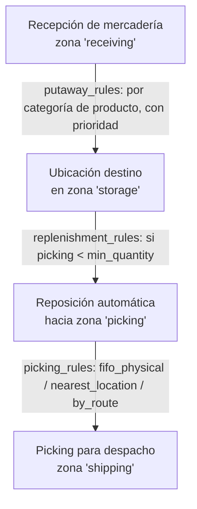
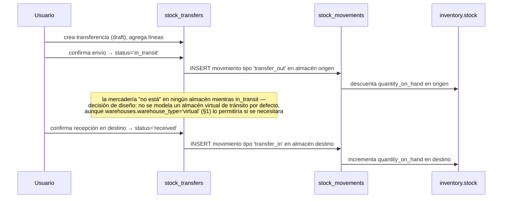
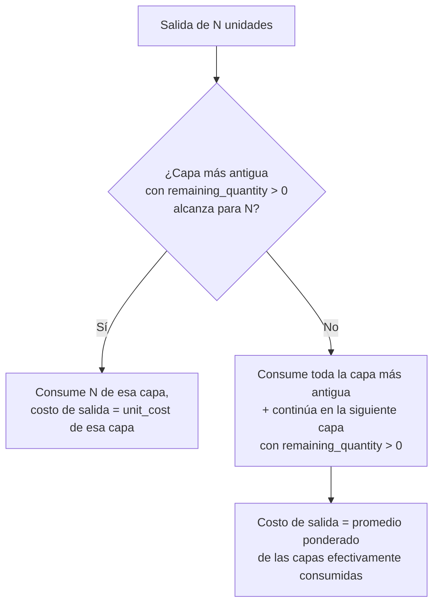

# 19 — Módulo Inventory (diseño completo)

> Versión 1.0 — 2026-07-13. Mismo criterio que los documentos de
> módulo anteriores. Sin tablas nuevas — verificado completo contra
> [sql/06_inventory.sql](../database/sql/06_inventory.sql) (34 tablas)
> y las vistas reales de
> [sql/24_views.sql](../database/sql/24_views.sql). Sin código.

## 0. Alcance — el único punto a corregir es Kardex

A diferencia de los módulos anteriores, acá casi no hay tensión de
propiedad: los 10 elementos de datos pedidos son genuinamente de
`inventory` (único módulo autorizado a escribir sobre existencias,
[docs/architecture/04](./04-catalogo-modulos-negocio.md)). La única
corrección: **Kardex no es tabla** — es
`inventory.v_kardex`, una vista real verificada en
[sql/24_views.sql](../database/sql/24_views.sql), derivada de
`stock_movements` con saldo corrido calculado por función de ventana
— ver §5.

## 1. Almacenes (`inventory.warehouses`)

`warehouse_type CHECK IN ('physical', 'virtual')` — un almacén virtual
existe para casos como mercadería en tránsito o consignación, sin
ubicación física real, sin dejar de participar del mismo modelo de
`stock`. `branch_id` es `NOT NULL` (a diferencia de la mayoría de
tablas de negocio) — un almacén **siempre** pertenece a una sucursal
concreta, consistente con
[14-modulo-core §2](./14-modulo-core.md#2-branches-corebranches--dueño-real-core)
(los almacenes son uno de los recursos que se crean en cascada al dar
de alta una sucursal). `code` único por sucursal.

## 2. Ubicaciones (`warehouse_zones` + `warehouse_locations` + reglas)

Tres niveles: **Almacén → Zona → Ubicación** (esta última
auto-referenciada, `parent_location_id`, para representar
pasillo→estante→bin sin fijar una profundidad rígida — mismo patrón
que `product_categories`). `zone_function CHECK IN ('receiving',
'storage', 'picking', 'shipping')` es lo que le da sentido operativo a
la zona, no solo organizativo.

**Flujo operativo de almacén que conecta zonas + 3 tablas de reglas**
(no existía como flujo único — las tres reglas estaban documentadas
por separado sin mostrar cómo interactúan):



`picking_rules.strategy = 'fifo_physical'` es la estrategia de picking
**físico** (qué ubicación se recorre primero) — no confundir con FIFO
de **costeo** (§10, qué capa de costo se consume primero): pueden
coincidir en la práctica pero son decisiones independientes, una de
logística de almacén y otra de valorización contable.

## 3. Existencias (`inventory.stock`)

Saldo actual por `(product_id, warehouse_id, location_id)` — único
índice con `COALESCE(location_id, uuid nulo)` para permitir un único
registro de stock "sin ubicación específica" por almacén (ya
verificado en el SQL real). `quantity_on_hand` y `quantity_reserved`
son columnas separadas — **disponible no es una tercera columna**, es
`inventory.v_available_stock` (vista real:
`quantity_on_hand - quantity_reserved`), consumida por `sales` antes
de confirmar un pedido. Igual criterio que el kardex (§5): lo
derivable no se duplica como columna.

**Sincronización `quantity_reserved`** (no estaba explicitado): esta
columna es un **total denormalizado**, mantenido por la aplicación
cada vez que se crea o libera una fila en `stock_reservations` (§9) —
no se recalcula con un `SUM` en cada lectura porque `v_available_stock`
se consulta en el camino caliente de ventas (cada intento de agregar
una línea a un pedido). El costo de mantenerlo sincronizado en
escritura es preferible al costo de sumarlo en cada lectura de alta
frecuencia.

## 4. Movimientos (`stock_movements` + `stock_movement_types`)

**Fuente de verdad única** de todo lo que le pasa a una existencia —
toda otra operación de este documento (transferencia, ajuste,
conteo, recepción, salida, consumo de producción) termina generando
una o más filas acá, nunca modifica `stock` directamente sin dejar
rastro. Particionada mensualmente (alto volumen, ver
[07-estrategia-particionamiento.md](../database/07-estrategia-particionamiento.md)).
`stock_movement_types.direction CHECK IN ('in', 'out')` es lo que la
vista de kardex (§5) usa para sumar o restar en el saldo corrido —
`quantity` en la fila siempre es positiva, el signo lo da el tipo, no
el valor.

## 5. Kardex — no es tabla, es `inventory.v_kardex`

Vista real, verificada:

```
SUM(CASE WHEN direction='in' THEN quantity ELSE -quantity END)
  OVER (PARTITION BY product_id, warehouse_id ORDER BY created_at
        ROWS BETWEEN UNBOUNDED PRECEDING AND CURRENT ROW) AS running_balance
```

Saldo corrido por producto+almacén, recalculado en cada consulta a
partir de `stock_movements` — nunca desincronizado del dato real
porque no hay un segundo lugar donde pueda desviarse. Esta es la razón
de fondo (no solo "ahorra una tabla") por la que no existe
`inventory.kardex_entries`: un kardex que se pudiera desincronizar de
los movimientos reales dejaría de servir para lo que un kardex existe
—reconstruir con confianza qué pasó—, así que se lo hizo
estructuralmente imposible de desincronizar.

## 6. Transferencias (`stock_transfers` + `stock_transfer_lines`)

`status CHECK IN ('draft', 'in_transit', 'received', 'cancelled')`.
**Flujo completo con `stock_movements`** (no estaba conectado
explícitamente):



Una transferencia genera **dos** movimientos, nunca uno — es lo que
mantiene la propiedad de que `stock_movements` sea la fuente completa
de verdad incluso para operaciones que no son ventas ni compras.

## 7. Ajustes (`stock_adjustments` + `stock_adjustment_lines` + `stock_adjustment_reasons`)

`status CHECK IN ('draft', 'confirmed')` — un ajuste en `draft` no
afecta `stock` todavía, permite armar el ajuste completo (varias
líneas) antes de comprometerlo. Al confirmar, cada línea
(`previous_quantity` vs. `new_quantity`) genera un movimiento tipo
`'adjustment'` con `direction` derivada del signo de la diferencia
(`new > previous` → `in`, `new < previous` → `out`) —
`stock_adjustment_reasons` (daño, merma, corrección de conteo...) es
lo que hace auditable _por qué_ se ajustó, no solo _cuánto_.

## 8. Conteos (`physical_counts` + `physical_count_lines` + `cycle_count_schedules`)

Dos modalidades, no una — distinción que ya estaba en
[logico/06-inventory.md](../database/logico/06-inventory.md) pero sin
el flujo de reconciliación:

- **Toma física ad-hoc** (`physical_counts`, `status`: `planned` →
  `in_progress` → `completed`): campaña puntual, típicamente de todo
  un almacén.
- **Conteo cíclico recurrente** (`cycle_count_schedules`,
  `frequency_days` + `next_run_date`): por zona, continuo, sin
  "campaña" — genera automáticamente `physical_counts` acotados a esa
  zona cuando corresponde.

**Reconciliación** (conecta Conteos con Ajustes — no estaba
conectado): `physical_count_lines.system_quantity` (lo que dice
`stock` al momento del conteo) vs. `counted_quantity` (lo que se
contó físicamente). Al completar el conteo, cada línea con diferencia
genera automáticamente una línea de `stock_adjustments` (§7) —
`physical_counts` **nunca** ajusta `stock` directamente, siempre pasa
por el mismo mecanismo de ajuste auditado que cualquier otra
corrección manual.

## 9. Reservas (`stock_reservations`)

Polimórfica (`source_module`/`source_entity_id`) — un pedido de venta
(`sales.sales_orders`) y una orden de producción
(`inventory.production_orders`) reservan de la misma forma, sin que
`inventory` necesite saber de negocio de ventas. `released_at` marca
cuándo se liberó la reserva (venta cancelada, o consumida al confirmar
la salida real vía `goods_issues` — la reserva se libera y el
movimiento de salida ya descuenta `quantity_on_hand` directamente, no
"convierte" la reserva en movimiento, son dos hechos distintos en el
tiempo). Ver sincronización con `stock.quantity_reserved` en §3.

## 10. FIFO (`inventory.fifo_cost_layers`)

Se activa cuando `products.products.costing_method = 'fifo'` (ver
[18-modulo-products §1](./18-modulo-products.md#1-productos-productsproducts)).
Cada `goods_receipt_line` con costo genera una **capa** nueva
(`original_quantity`, `remaining_quantity` — arranca igual a la
original, se consume con el tiempo, `unit_cost` fijo de esa entrada
específica). Al confirmarse una salida:



`source_receipt_line_id` conecta cada capa con la recepción que la
originó — trazabilidad completa de "este costo de salida vino
exactamente de estas entradas", que es la propiedad que distingue
FIFO de un promedio (§11): el costo de salida depende del **orden**
de entrada, no se difumina en un único número.

## 11. Promedio (`inventory.average_cost_history`)

Se activa cuando `costing_method = 'average'`. A diferencia de FIFO,
**no hay capas** — hay un único costo promedio ponderado vigente por
`(product_id, warehouse_id)`, recalculado en cada entrada:

```
nuevo_promedio = (cantidad_actual × promedio_actual + cantidad_recibida × costo_recibido)
                 / (cantidad_actual + cantidad_recibida)
```

`average_cost_history` no es el promedio vigente en sí — es el
**snapshot** de cada recálculo (`new_average_cost` + `created_at`),
igual criterio que `customer_credit_limit_history`
([16-modulo-customers §4](./16-modulo-customers.md#4-créditos)): el
valor vigente se lee de la fila más reciente, el historial completo
existe para auditoría de cómo llegó ahí. A diferencia de FIFO, una
salida con costeo promedio **no consume nada específico** — todas las
unidades en existencia, sin importar cuándo entraron, valen lo mismo
en el momento de salir.

## 12. Trazabilidad

| Punto solicitado | Documento(s) de detalle normativo                                      | Novedad de este documento                                                            |
| ---------------- | ---------------------------------------------------------------------- | ------------------------------------------------------------------------------------ |
| Almacenes        | [sql/06_inventory.sql](../database/sql/06_inventory.sql)               | Por qué `branch_id` es obligatorio acá (§1)                                          |
| Ubicaciones      | Ídem                                                                   | Flujo operativo que conecta zonas + 3 tablas de reglas (§2)                          |
| Existencias      | [sql/24_views.sql](../database/sql/24_views.sql) (`v_available_stock`) | Sincronización de `quantity_reserved` como total denormalizado (§3)                  |
| Movimientos      | [sql/06_inventory.sql](../database/sql/06_inventory.sql)               | — (ya es la pieza central, bien documentada)                                         |
| Kardex           | [sql/24_views.sql](../database/sql/24_views.sql) (`v_kardex`)          | Aclaración de que no es tabla + por qué eso es deliberado (§5)                       |
| Transferencias   | [sql/06_inventory.sql](../database/sql/06_inventory.sql)               | Flujo completo: genera 2 movimientos, no 1 (§6)                                      |
| Ajustes          | Ídem                                                                   | Cómo `draft`→`confirmed` se traduce a movimiento con dirección derivada (§7)         |
| Conteos          | Ídem                                                                   | Reconciliación conteo→ajuste, antes no conectada (§8)                                |
| Reservas         | Ídem                                                                   | Relación con `quantity_reserved` y con la salida real (§9)                           |
| FIFO             | Ídem                                                                   | Algoritmo completo de consumo de capas, con trazabilidad a la recepción origen (§10) |
| Promedio         | Ídem                                                                   | Fórmula de recálculo + por qué no hay capas, a diferencia de FIFO (§11)              |

## 13. Addendum — Fase 05, Parte 01 (2026-07-23): arquitectura de código

Este documento (v1.0) verifica el **schema**, no propone arquitectura de
aplicación. La arquitectura de código para construir las 31 tablas de acá
sin código todavía (todo excepto Almacén/Zona/Ubicación, `v0.6.0`) vive en
`INVENTORY_ARCHITECTURE.md` (raíz del repo) — incluye el mapeo del pedido
original de "Inventario Enterprise" contra estas mismas tablas, los gaps
reales de schema (QR/RFID, fecha de fabricación, peso/volumen/dimensiones,
obsolescencia, garantías, caja — ninguno tiene columna hoy) y la decisión
de usar `warehouse_locations.metadata.locationType` como convención de
aplicación (no columna nueva) para distinguir pasillo/estante/nivel/
posición dentro de la misma cadena auto-referenciada de §2. Ver también
`INVENTORY_NEXT_PHASE.md` para la secuencia de partes de implementación
recomendada.
