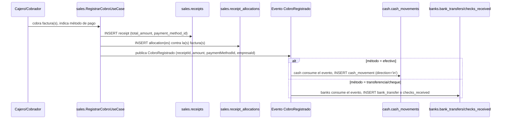

# 20 — Módulo Sales (diseño completo)

> Versión 1.0 — 2026-07-13. Mismo criterio que los documentos de
> módulo anteriores. Sin tablas nuevas — verificado completo contra
> [sql/07_sales.sql](../database/sql/07_sales.sql) (54 tablas, el
> módulo más grande del sistema). Sin código.

## 0. Alcance — una corrección y una aclaración conceptual

| Elemento pedido                                                                                      | Dueño real       | Nota                                                                                                                                                     |
| ---------------------------------------------------------------------------------------------------- | ---------------- | -------------------------------------------------------------------------------------------------------------------------------------------------------- |
| Cotizaciones, Pedidos, Facturas, Notas de Crédito, Notas de Débito, Recibos, Promociones, Comisiones | `sales`          | ✅                                                                                                                                                       |
| **Facturas POS**                                                                                     | `sales.invoices` | **No es tabla propia** — `sales_channel = 'pos'` sobre la misma `invoices`, ver §4                                                                       |
| **Cobros**                                                                                           | _(no es tabla)_  | Es el **proceso** — `sales.receipts`/`receipt_allocations` son el documento y su aplicación; el movimiento de dinero real vive en `cash`/`banks`. Ver §8 |

## 1. Cotizaciones (`quotes` + `quote_lines`)

`valid_until` (vencimiento de la oferta), `status_id` con historial
completo (`quote_status_history`). Encabeza la cadena documental —
`sales_orders.quote_id` es opcional: un pedido puede originarse de una
cotización aceptada o crearse directo, sin forzar el paso intermedio
cuando el negocio no lo necesita (venta de mostrador, por ejemplo).

## 2. Pedidos (`sales_orders` + `sales_order_lines`)

`sales_channel CHECK IN ('store', 'pos', 'ecommerce', 'phone',
'mobile')` — mismo enum que `invoices` (§4). Reserva stock vía
`inventory.stock_reservations`
([19-modulo-inventory §9](./19-modulo-inventory.md#9-reservas-inventorystock_reservations)),
polimórfico `source_module='sales', source_entity_id=sales_order.id`.

**Dos mecanismos distintos para "apartar", que se confunden
fácilmente** (aclaración necesaria): un pedido en estado `reserved`
(valor de `code` en `sales_order_status`, no tabla aparte — ver
comentario real del schema) es una reserva de stock _ligera_, sin
seguimiento de pagos parciales. `sales.layaways` (con
`layaway_payments`, `balance_due`) es un mecanismo _más pesado_, para
cuando el negocio necesita rastrear cuánto se ha abonado de un
apartado con pago diferido. No son la misma cosa con dos nombres —
son dos niveles de compromiso distintos, y confundirlos llevaría a
usar `layaways` para un simple "aparte esto 2 horas mientras confirmo"
o, al revés, a intentar rastrear pagos parciales sobre un
`sales_order.status='reserved'` que no tiene ninguna tabla para eso.

## 3. Facturas (`invoices` + `invoice_lines`)

Documento central — particionada **anualmente** (a diferencia de
`stock_movements`/`audit_logs`, particionadas mensualmente; volumen
distinto, retención fiscal distinta, ver
[07-estrategia-particionamiento.md](../database/07-estrategia-particionamiento.md)).
`fiscal_document_type_id` conecta con
[configuration.fiscal_document_types](../database/logico/21-configuration.md)
— el tipo de comprobante legal varía por país (CFDI, DTE, NFe, Factura
A/B/C), la tabla de factura en sí es única y genérica.
`electronic_invoice_logs` registra **cada intento** de timbrado
(`sent`/`accepted`/`rejected`), no solo el resultado final — necesario
porque un rechazo del proveedor fiscal externo (con su motivo,
`provider_response`) es información operativa real, no un dato a
descartar.

## 4. Facturas POS — no es tabla propia (confirmado en el schema real)

`sales_channel = 'pos'` en la misma `sales.invoices` — el comentario
del schema real lo dice explícitamente: _"cubre lo que en otros
sistemas sería una tabla `pos_orders` separada"_. Implicancia de
diseño que vale dejar explícita: una venta de mostrador **no tiene
ningún atajo fiscal** — pasa por el mismo `invoice_status`, el mismo
`electronic_invoice_logs`, el mismo cálculo de impuestos por línea que
una factura de canal `store` o `ecommerce`. La única diferencia real
entre canales es operativa (UI optimizada para mostrador, flujo
síncrono con `caja`/`inventario` en el mismo acto — ver
[docs/architecture/04](./04-catalogo-modulos-negocio.md#pos-no-tiene-entidades-propias)),
nunca una relajación del rigor documental o fiscal.

## 5. Notas de Crédito (`credit_notes` + `credit_note_lines`)

Siempre referencian `invoice_id` — una NC nunca existe sin la factura
que ajusta. `credit_note_lines` tiene `product_id` (igual que
`invoice_lines`) porque una NC casi siempre es reversión de líneas
concretas (devolución, corrección de cantidad/precio de un producto
específico).

## 6. Notas de Débito (`debit_notes` + `debit_note_lines`)

**Asimetría real con las NC, verificada en el schema** (no era obvia
sin comparar ambas tablas línea por línea): `debit_note_lines` **no
tiene** `product_id` — tiene `description` + `amount` libres. Esto no
es una inconsistencia, es correcto: una NC casi siempre corrige algo
que ya se facturó (un producto concreto), mientras que una ND casi
siempre agrega un cargo nuevo que nunca fue una línea de producto
(interés por mora, gasto de flete adicional, ajuste de tipo de cambio)
— no hay "producto" al que atribuir la línea, por eso el modelo de
datos correctamente no se lo exige.

## 7. Recibos (`receipts` + `receipt_allocations`)

El documento del lado de `sales` — `receipts.total_amount` es lo que
el cliente entregó; `receipt_allocations` (`receipt_id`, `invoice_id`,
`amount_applied`) es **contra qué facturas se aplicó**, soportando
pagos parciales o un solo recibo cubriendo varias facturas. Esto es lo
que consume
[16-modulo-customers §4](./16-modulo-customers.md#4-créditos) vía
`v_accounts_receivable_aging` para calcular saldo neto. El
comentario real del schema es explícito sobre el límite de esta tabla:
_"el movimiento de dinero real vive en cash/banks"_ — ver §8.

## 8. Cobros — el proceso completo, no una tabla (síntesis necesaria)

"Cobro" es el nombre del **proceso de negocio**; `receipts` es su
registro documental en `sales`, pero el dinero en sí (efectivo que
entra a una caja, transferencia que llega a una cuenta) es un hecho de
`cash`/`banks`, dos módulos distintos con sus propias transacciones.
El flujo completo, que no estaba conectado en ningún documento previo:

`sales` **nunca** escribe directamente en `cash.cash_movements` ni en
`banks.bank_transfers` — publica el evento y cada módulo dueño
registra su propia transacción, mismo patrón ya fijado para
`VentaConfirmada` en
[06-comunicacion-entre-modulos §5](./06-comunicacion-entre-modulos.md#5-ejemplo-end-to-end-confirmar-una-venta).
`payment_method_id` (FK diferida hacia `configuration.payment_methods`)
es lo que determina la rama del flujo — el mapeo método→módulo
destino es una tabla de decisión pequeña y estable (efectivo→`cash`,
todo lo demás→`banks`), no lógica dispersa.

## 9. Promociones — cinco mecanismos distintos, comparados (no existía)

`sales` tiene **cinco** formas de reducir lo que paga un cliente, cada
una para un caso de uso distinto — tratarlas como intercambiables es
el error de diseño más probable:

| Mecanismo                  | Tabla                                               | Se activa por                                                                             | Ejemplo                               |
| -------------------------- | --------------------------------------------------- | ----------------------------------------------------------------------------------------- | ------------------------------------- |
| **Promoción**              | `promotions` + `promotion_rules`                    | Regla automática (`volume`, `combo`, `buy_x_get_y`) evaluada al armar el pedido           | "3x2 en categoría X del 1 al 15"      |
| **Descuento general**      | `discounts`                                         | Producto/categoría, sin código ni acción del cliente                                      | "10% off en electrónica" permanente   |
| **Descuento por cliente**  | `customers.customer_discounts` (¡no es de `sales`!) | Negociado con un cliente específico — ver [16-modulo-customers](./16-modulo-customers.md) | Cliente mayorista con 15% fijo        |
| **Cupón**                  | `coupons` + `coupon_redemptions`                    | Código que el cliente ingresa, con `max_redemptions`                                      | Código de campaña de marketing        |
| **Puntos de fidelización** | `loyalty_points_transactions`                       | Canje voluntario de saldo acumulado                                                       | Canjear 500 puntos por $50            |
| **Tarjeta de regalo**      | `gift_cards` + `gift_card_transactions`             | Medio de pago con saldo propio, no descuento                                              | Pagar (parcial o total) con gift card |

Todas pueden coincidir en la **misma factura** — un pedido puede tener
una promoción de volumen, un cupón, y pagarse parcialmente con gift
card. El orden de aplicación (¿la promoción se calcula sobre el precio
ya con descuento de cliente, o antes?) es una regla de negocio que
debe fijarse explícitamente en `CrearVentaUseCase`, no algo que el
modelo de datos resuelva por sí solo — cada mecanismo es independiente
en el schema, la composición es responsabilidad de la capa de
aplicación.

## 10. Comisiones (`commission_rules` + `commission_entries`)

`commission_rules.salesperson_id` es **nullable** — una regla puede
ser específica de un vendedor o general (aplicada a cualquiera que
cumpla la condición). `commission_entries` se genera **por factura
confirmada** (`invoice_id NOT NULL`), nunca por pedido ni cotización —
la comisión se devenga sobre lo efectivamente facturado, no sobre lo
prometido. Conecta con `sales_targets` (meta por vendedor/equipo/
período) para medir cumplimiento, y — cruzando módulos — con
`payroll.payroll_commission_entries`
([14-modulo-core](./14-modulo-core.md) doc hermano de `payroll`, ver
[logico/15-payroll.md](../database/logico/15-payroll.md)), que
**consume** `sales.commission_entries` por ID suelto para incorporar
la comisión devengada a la liquidación de sueldo — `sales` nunca sabe
que existe una nómina, solo publica el dato de cuánto se devengó.

## 11. Trazabilidad

| Punto solicitado          | Documento(s) de detalle normativo                                                               | Novedad de este documento                                                                                                                                        |
| ------------------------- | ----------------------------------------------------------------------------------------------- | ---------------------------------------------------------------------------------------------------------------------------------------------------------------- |
| Cotizaciones              | [sql/07_sales.sql](../database/sql/07_sales.sql)                                                | —                                                                                                                                                                |
| Pedidos                   | Ídem, [19-modulo-inventory §9](./19-modulo-inventory.md#9-reservas-inventorystock_reservations) | Diferencia entre reserva ligera (`status='reserved'`) y `layaways` (§2)                                                                                          |
| Facturas                  | [sql/07_sales.sql](../database/sql/07_sales.sql)                                                | Por qué particiona anualmente, no mensualmente (§3)                                                                                                              |
| Facturas POS              | _(confirmado no-tabla)_                                                                         | Sin atajo fiscal por canal — aclaración explícita (§4)                                                                                                           |
| Notas de Crédito / Débito | [sql/07_sales.sql](../database/sql/07_sales.sql)                                                | Asimetría real: NC tiene `product_id`, ND no — verificada, no simplificación (§5-6)                                                                              |
| Recibos                   | Ídem                                                                                            | —                                                                                                                                                                |
| Cobros                    | _(no existía como flujo)_                                                                       | Flujo completo receipts→evento→cash/banks, con la regla de decisión de a qué módulo va (§8)                                                                      |
| Promociones               | Ídem                                                                                            | Comparación de los 5 mecanismos de descuento/incentivo, con la advertencia de que el orden de aplicación es responsabilidad de la aplicación, no del schema (§9) |
| Comisiones                | Ídem, [logico/15-payroll.md](../database/logico/15-payroll.md)                                  | Conexión con `payroll` vía ID suelto (§10)                                                                                                                       |
