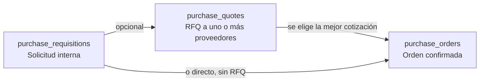
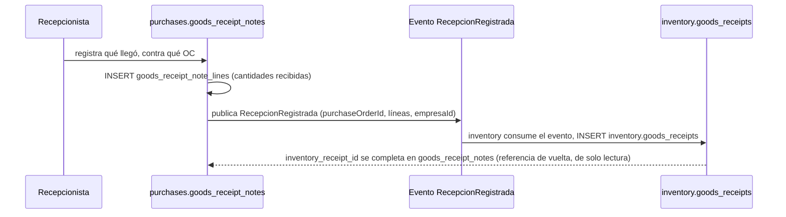
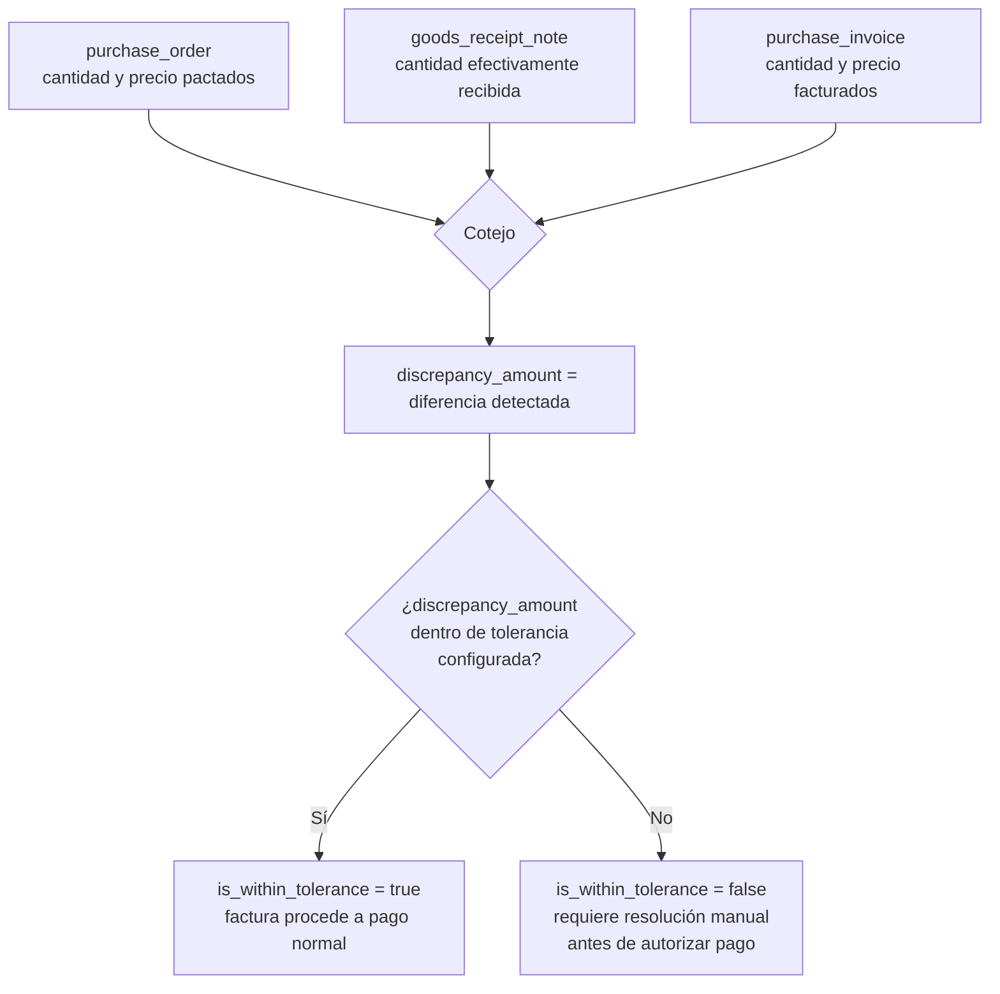
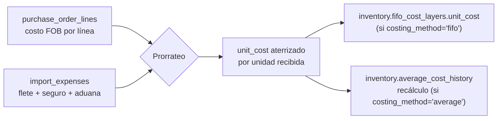

# 21 — Módulo Purchases (diseño completo)

> Versión 1.0 — 2026-07-13. Mismo criterio que los documentos de
> módulo anteriores, en particular su espejo
> [20-modulo-sales.md](./20-modulo-sales.md). Sin tablas nuevas —
> verificado completo contra
> [sql/08_purchases.sql](../database/sql/08_purchases.sql) (27
> tablas). Sin código.

## 0. Alcance — Pagos no es de `purchases` (ya resuelto en 17)

| Elemento pedido                                                                                                                     | Dueño real     | Nota                         |
| ----------------------------------------------------------------------------------------------------------------------------------- | -------------- | ---------------------------- |
| Solicitudes, Órdenes, Recepciones, Facturas, Importaciones                                                                          | `purchases`    | ✅                           |
| **Pagos**                                                                                                                           | `banks`/`cash` | **No** — mismo motivo que en |
| [17-modulo-suppliers §5](./17-modulo-suppliers.md#5-pagos--no-es-una-tabla-de-suppliers-aclaración-de-diseño--gap-real-encontrado), |
| no se repite acá el análisis completo (incluye el gap real ya                                                                       |
| encontrado: sin tabla de asignación pago↔factura en el lado de                                                                      |
| cuentas por pagar) — ver §6 para cómo interactúa específicamente con                                                                |
| `purchase_invoices` y `purchase_withholdings`.                                                                                      |

## 1. Solicitudes (`purchase_requisitions` + `purchase_requisition_lines`)

`requested_by_user_id` + `status_id` — el comentario real del schema
dice _"sujeta a aprobación"_, pero **no hay** un `workflow_id` ni
`approval_id` en la tabla. Esto es consistente, no un olvido: la
aprobación se resuelve vía el mecanismo genérico ya diseñado en
[14-modulo-core](./14-modulo-core.md) —
`core.approvals`/`core.approval_matrices`, polimórfico
(`entity_type='purchases.purchase_requisition'`, `entity_id`) — una
requisición no necesita su propia columna de aprobación porque el
mecanismo transversal ya la cubre sin que `purchases` tenga que
conocer roles ni montos de aprobación, solo publicar la solicitud y
consultar si fue aprobada.

## 2. De Solicitud a Orden — la cadena completa (no estaba conectada)

`purchase_quotes.requisition_id` es **opcional** — una cotización de
proveedor puede pedirse sin una requisición formal previa (compra
puntual no planificada). `purchase_orders.requisition_id` también es
opcional, por el mismo motivo: no toda orden de compra viene de una
solicitud interna formal, pero cuando sí la tiene, queda trazada.

## 3. Órdenes (`purchase_orders` + `purchase_order_lines`)

Documento confirmado hacia el proveedor — a partir de acá el flujo es
espejo de `sales_orders` (moneda, `document_number` único por
sucursal, estado con historial). La diferencia de fondo con `sales` es
que `purchase_orders` no reserva stock (no hay nada que reservar
todavía, el producto no ha llegado) — lo que sí dispara es la
expectativa de recepción, consumida por §4.

## 4. Recepciones (`goods_receipt_notes` + `goods_receipt_note_lines`) — dos tablas dueñas de un mismo hecho, confirmado

Ya señalado en el propio comentario del schema real, se confirma y se
diseña el flujo completo (no estaba conectado antes con el mecanismo
de eventos):

`purchases.goods_receipt_notes` es el documento **de compras** (qué se
recibió contra qué OC, insumo del 3-way match de §5).
`inventory.goods_receipts` es el movimiento **físico** (lo que
efectivamente entra a `inventory.stock`, ver
[19-modulo-inventory §4](./19-modulo-inventory.md#4-movimientos-stock_movements--stock_movement_types)).
Son dos proyecciones del mismo hecho desde dos módulos dueños
distintos — exactamente el mismo principio que ya se aplicó a
`ventas`/`inventario` en
[06-comunicacion-entre-modulos §5](./06-comunicacion-entre-modulos.md#5-ejemplo-end-to-end-confirmar-una-venta),
del lado de compras.

## 5. Facturas (`purchase_invoices` + `purchase_invoice_lines` + `purchase_invoice_matching`)

Particionada **anualmente** (igual criterio que `sales.invoices`, ver
[20-modulo-sales §3](./20-modulo-sales.md#3-facturas-invoices--invoice_lines)).
Dos piezas propias de este lado que no tienen equivalente en `sales`:

**`is_capitalizable`** (`purchase_invoice_lines`, columna real
verificada): cuando es `true`, la línea dispara alta en
`assets.fixed_assets` — el comentario del schema lo confirma
explícitamente. Esto es lo que distingue una compra de gasto corriente
de una compra de bien de uso, en el mismo documento de factura, sin
necesitar un tipo de documento distinto — la decisión es por línea,
porque una misma factura de proveedor puede traer tanto insumos
corrientes como un activo capitalizable.

**3-way match (`purchase_invoice_matching`)** — la pieza central de
control de este módulo, sin equivalente en `sales` (el lado de venta
no necesita cotejar tres documentos antes de confiar en una factura
propia):

`purchase_invoice_matching` es una fila **por combinación** de los
tres documentos, no un flag suelto en la factura — permite que una
factura que cubre líneas de más de una OC/recepción tenga su propio
registro de cotejo por cada combinación, en vez de un único resultado
agregado que ocultaría en cuál de las líneas está la discrepancia
real.

**Retenciones (`purchase_withholdings`)** — no tiene equivalente en
`sales` por la misma asimetría de negocio ya señalada en
[17-modulo-suppliers §1](./17-modulo-suppliers.md#1-proveedores-supplierssuppliers)
(la empresa retiene a sus proveedores, no a sus clientes). Reduce el
monto neto a pagar — ver §6.

## 6. Pagos — recapitulación breve + interacción con retenciones

Detalle completo del flujo y del gap encontrado en
[17-modulo-suppliers §5](./17-modulo-suppliers.md#5-pagos--no-es-una-tabla-de-suppliers-aclaración-de-diseño--gap-real-encontrado)
(pagos vía `banks`/`cash`, sin tabla de asignación pago↔factura a
diferencia de `sales.receipt_allocations`). Lo específico de
`purchases` que agrega valor acá: el monto que efectivamente se paga
**no es** `purchase_invoices.total_amount` — es ese monto **menos**
`purchase_withholdings.amount` de esa factura. El proveedor recibe el
neto; la retención queda como obligación de la empresa ante la
autoridad fiscal (`taxes.withholding_certificates`, ver
[logico/12-taxes.md](../database/logico/12-taxes.md)), no como parte
del pago al proveedor. Cualquier cálculo de "cuánto le debo pagar a
este proveedor" que ignore `purchase_withholdings` sobreestima el pago
real.

## 7. Importaciones (`imports` + `import_status` + `import_expenses` + `purchase_expenses`)

`imports` agrupa una `purchase_order` al exterior con sus gastos
asociados (`import_expenses`: `freight`/`insurance`/`customs`/`other`)
— `import_status` (`en tránsito`, `en aduana`, `nacionalizado`, según
comentario real) es el ciclo de vida logístico/aduanero, distinto del
`purchase_order_status` (que es del lado comercial).

**Flujo de costeo aterrizado (landed cost) — conecta Importaciones con
FIFO/Promedio de inventario, no estaba conectado antes**:

El prorrateo (típicamente por valor o por peso/volumen de cada línea,
decisión de negocio configurable, no fija en el schema) es lo que
convierte un costo FOB de la orden de compra en el `unit_cost` real
que entra a las capas FIFO o alimenta el promedio ponderado — ver
[19-modulo-inventory §10-11](./19-modulo-inventory.md#10-fifo-inventoryfifo_cost_layers).
Sin este prorrateo, el costo de un producto importado quedaría
subvaluado (solo el precio pagado al proveedor extranjero, sin flete
ni aduana), distorsionando tanto el margen de venta como la
valorización de inventario en los estados financieros.
`purchase_expenses` es el caso más simple, sin expediente de
importación (gasto de una compra local que no es mercadería en sí,
p. ej. instalación) — no participa de este prorrateo.

## 8. Trazabilidad

| Punto solicitado             | Documento(s) de detalle normativo                                                                                                  | Novedad de este documento                                                                                     |
| ---------------------------- | ---------------------------------------------------------------------------------------------------------------------------------- | ------------------------------------------------------------------------------------------------------------- |
| Solicitudes                  | [sql/08_purchases.sql](../database/sql/08_purchases.sql)                                                                           | Por qué no tiene `workflow_id` propio — usa `core.approvals` genérico (§1)                                    |
| — Cadena Solicitud→RFQ→Orden | _(no estaba conectada)_                                                                                                            | Diagrama completo con las dos rutas válidas (§2)                                                              |
| Órdenes                      | [sql/08_purchases.sql](../database/sql/08_purchases.sql)                                                                           | —                                                                                                             |
| Recepciones                  | Ídem                                                                                                                               | Flujo evento-driven completo entre `goods_receipt_notes` (compras) y `inventory.goods_receipts` (físico) (§4) |
| Facturas                     | Ídem                                                                                                                               | `is_capitalizable`→`assets.fixed_assets` + algoritmo completo del 3-way match (§5)                            |
| Pagos                        | [17-modulo-suppliers §5](./17-modulo-suppliers.md#5-pagos--no-es-una-tabla-de-suppliers-aclaración-de-diseño--gap-real-encontrado) | Interacción con retenciones: el pago real es neto, no el total de factura (§6)                                |
| Importaciones                | [sql/08_purchases.sql](../database/sql/08_purchases.sql)                                                                           | Flujo de costeo aterrizado, conectado con FIFO/Promedio de `inventory` (§7)                                   |
