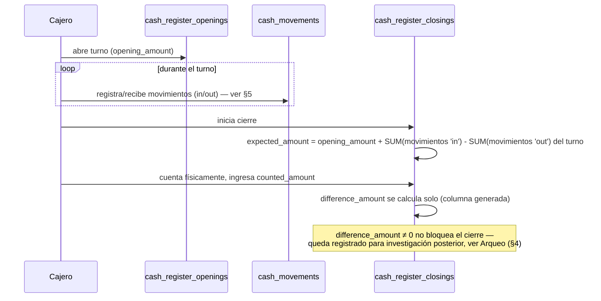
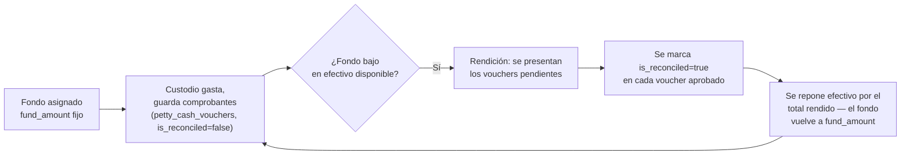

# 23 — Módulo Cash Management (diseño completo)

> Versión 1.0 — 2026-07-13. Mismo criterio que los documentos de
> módulo anteriores. Sin tablas nuevas — el modelo de las 11 tablas de
> `cash` ya está verificado tabla por tabla contra
> [sql/09_cash.sql](../database/sql/09_cash.sql) en
> [02a-restricciones-e-indices §6](../database/02a-restricciones-e-indices.md#6-ejemplo-completo-aplicado-módulo-cash-11-tablas)
> (PK, cardinalidad, restricciones e índices ya completos ahí — no se
> repiten). Este documento aporta lo que ese no cubre: **el flujo**
> operativo completo. Sin código.

## 0. Alcance — sin tensión de propiedad, con una conexión ya diseñada

Los 6 puntos pedidos son genuinamente de `cash`. Una conexión ya
existe con otro módulo y no se repite: el lado "efectivo" del flujo de
Cobros de
[20-modulo-sales §8](./20-modulo-sales.md#8-cobros--el-proceso-completo-no-una-tabla-síntesis-necesaria)
termina exactamente en `cash.cash_movements` — este documento diseña
qué pasa _dentro_ de `cash` a partir de ahí, no repite cómo llega.

## 1. Cajas (`cash_registers`)

`register_type CHECK IN ('administrative', 'pos')` — misma tabla
para caja de oficina y caja de punto de venta, consistente con que
`pos` no tiene entidades propias
([docs/architecture/04](./04-catalogo-modulos-negocio.md#pos-no-tiene-entidades-propias)):
una caja POS **es** un `cash_register` con `register_type = 'pos'`,
nunca una tabla paralela. `branch_id` obligatorio — una caja siempre
pertenece a una sucursal concreta, mismo criterio que
`inventory.warehouses`
([19-modulo-inventory §1](./19-modulo-inventory.md#1-almacenes-inventorywarehouses)).

## 2. Aperturas (`cash_register_openings`)

Define un **turno de caja**: el período entre abrir y cerrar. El
índice único parcial `(register_id) WHERE is_open = true` (verificado
en [02a §6](../database/02a-restricciones-e-indices.md#6-ejemplo-completo-aplicado-módulo-cash-11-tablas))
es la regla de negocio central de esta sección expresada como
constraint: **una caja no puede tener dos turnos abiertos a la vez**.
`opening_amount` es el fondo inicial declarado — la base contra la que
se calcula el esperado al cierre (§3).

## 3. Cierres (`cash_register_closings`)

1:1 con la apertura que cierra (índice único sobre `opening_id`, ya
verificado). `expected_amount` vs. `counted_amount`,
`difference_amount` como columna generada
(`counted_amount - expected_amount`) — **no se calcula en la
aplicación**, el motor la deriva siempre de forma consistente.

**Flujo completo del turno** (conecta Apertura + Movimientos + Cierre,
no estaba documentado como ciclo único):

`expected_amount` no es una columna calculada automáticamente por el
motor (a diferencia de `difference_amount`) — se fija al momento de
iniciar el cierre, como una fotografía de lo que el sistema esperaba
en ese instante, para que un movimiento tardío no altere retroactivamente
un cierre ya hecho.

## 4. Arqueos (`cash_counts` + `cash_count_lines`)

El arqueo es el **respaldo físico detallado** del `counted_amount` de
un cierre — `cash_counts.closing_id` (`NOT NULL`) lo liga siempre a un
cierre específico, nunca es un conteo suelto. `cash_count_lines`
desglosa por denominación (`denomination_value × quantity` — un
billete de $100, cuántos hay; una moneda de $5, cuántas hay).

**Regla de consistencia** (no reforzada por constraint, es invariante
de aplicación — igual criterio que otras reglas ya señaladas en
`is_primary`/`is_default` en módulos anteriores): la suma de
`cash_count_lines.denomination_value × quantity` de un arqueo debe
igualar el `counted_amount` del `cash_register_closings` al que
pertenece. Si no coincide, no es un error de negocio (una diferencia
de caja es normal y se registra vía `difference_amount`) — es un error
de **captura del arqueo en sí**, que el caso de uso debería validar
antes de guardar, distinto del error de negocio que el cierre ya
contempla.

## 5. Movimientos (`cash_movements` + `cash_movement_types`)

`cash_movement_types.direction CHECK IN ('in', 'out')` determina el
signo; `cash_movements.opening_id` es **obligatorio** — verificado:
todo movimiento pertenece a un turno abierto, no existe el concepto de
"movimiento de caja sin turno activo". Esto es lo que hace posible
calcular `expected_amount` en el cierre (§3) con una simple suma
acotada al turno, sin tener que decidir en tiempo de cierre qué
movimientos "cuentan".

`source_module`/`source_entity_id` polimórfico — el mismo movimiento
puede originarse en `sales` (cobro, ver
[20-modulo-sales §8](./20-modulo-sales.md#8-cobros--el-proceso-completo-no-una-tabla-síntesis-necesaria)),
en `purchases` (pago menor en efectivo) o ser un movimiento interno
(retiro, depósito a banco). Particionada mensualmente (alto volumen en
negocios con caja diaria activa).

**Dos movimientos especializados, con tabla propia en vez de solo un
`movement_type`** (vale aclarar por qué):

- **`cash_transfers`** (`source_register_id` ≠ `destination_register_id`,
  reforzado por `CHECK`): mover efectivo entre cajas de la misma
  sucursal no es "un movimiento de salida en una caja + uno de entrada
  en otra" registrado a mano dos veces — es una operación atómica con
  su propia tabla, evitando que una transferencia quede a medio
  registrar si algo falla entre los dos lados.
- **`cash_refunds`** (`sales_return_id NOT NULL` hacia
  `sales.sales_returns`): un reembolso en efectivo siempre está
  atado a una devolución de venta específica — no es un movimiento de
  salida genérico, lleva su propia trazabilidad hacia el documento de
  `sales` que lo origina.

## 6. Caja Chica (`petty_cash_funds` + `petty_cash_vouchers`)

**Sistema de fondo fijo (imprest system)** — patrón contable estándar,
distinto del ciclo apertura/cierre de §2-3: `petty_cash_funds` no se
"abre y cierra" por turno, es un fondo asignado a un
`custodian_user_id` de forma continua. `petty_cash_vouchers`
(`is_reconciled`) son los comprobantes de gasto pendientes de rendir.

**Flujo de reposición** (no estaba documentado — es lo que le da
sentido a `is_reconciled`):

La propiedad del sistema de fondo fijo es que `fund_amount` **nunca
cambia** — lo que varía es cuánto de ese monto está en efectivo físico
vs. en comprobantes pendientes de rendir; la suma de ambos siempre
debería igualar `fund_amount`. Esto es distinto de una caja regular,
donde el saldo esperado fluctúa con cada venta/cobro — la caja chica
está diseñada para permanecer constante en valor total, solo cambia su
composición.

## 7. Trazabilidad

| Punto solicitado | Documento(s) de detalle normativo                                                                                                                                      | Novedad de este documento                                                                                     |
| ---------------- | ---------------------------------------------------------------------------------------------------------------------------------------------------------------------- | ------------------------------------------------------------------------------------------------------------- |
| Cajas            | [02a-restricciones-e-indices §6](../database/02a-restricciones-e-indices.md#6-ejemplo-completo-aplicado-módulo-cash-11-tablas) (PK/FK/restricciones/índices completos) | Relación con POS (§1)                                                                                         |
| Aperturas        | Ídem                                                                                                                                                                   | Regla "un turno abierto por caja" como origen del resto del flujo (§2)                                        |
| Cierres          | Ídem                                                                                                                                                                   | Flujo completo del turno, con `expected_amount` como fotografía no recalculable (§3)                          |
| Arqueos          | Ídem                                                                                                                                                                   | Regla de consistencia arqueo↔cierre, distinguida de la diferencia de caja normal (§4)                         |
| Movimientos      | Ídem                                                                                                                                                                   | Invariante "sin turno abierto no hay movimiento" + por qué transferencias/reembolsos tienen tabla propia (§5) |
| Caja Chica       | Ídem                                                                                                                                                                   | Flujo de reposición del sistema de fondo fijo, no documentado antes (§6)                                      |
