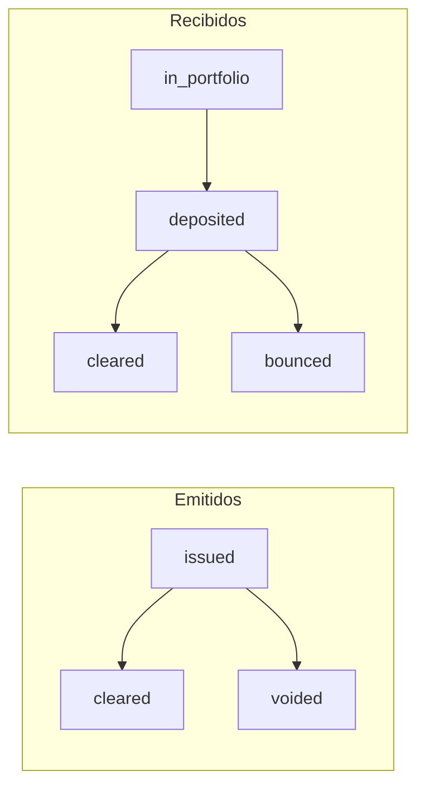
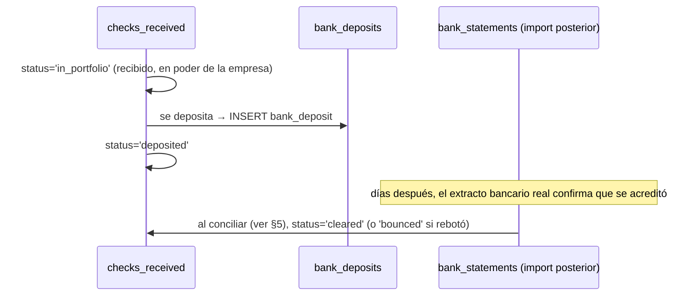
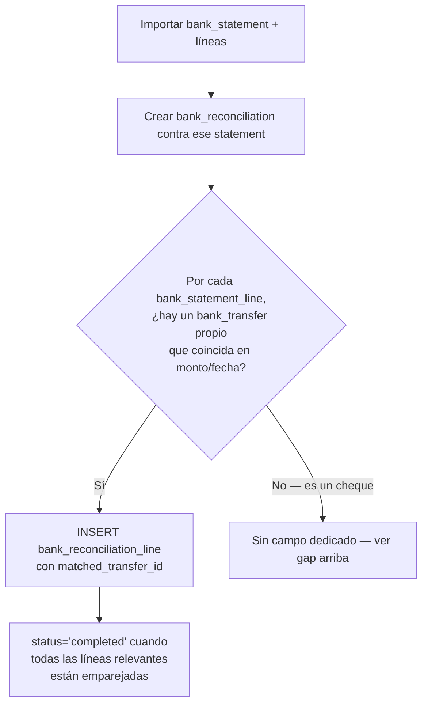

# 24 — Módulo Banking (diseño completo)

> Versión 1.0 — 2026-07-13. Mismo criterio que los documentos de
> módulo anteriores. Sin tablas nuevas — verificado completo contra
> [sql/10_banks.sql](../database/sql/10_banks.sql) (14 tablas). Sin
> código.

## 0. Alcance — "Bancos" (catálogo) no es de este schema

| Elemento pedido                                                | Dueño real            | Nota                                                                                                                                                                                                                                                                                                                                                    |
| -------------------------------------------------------------- | --------------------- | ------------------------------------------------------------------------------------------------------------------------------------------------------------------------------------------------------------------------------------------------------------------------------------------------------------------------------------------------------- |
| **Bancos**                                                     | `configuration.banks` | **No** — el catálogo de entidades financieras del mercado (nombre, SWIFT) ya se identificó como de `configuration` en [14-modulo-core §4-7](./14-modulo-core.md#4-7-countries-currencies-languages-timezones--dueño-real-configuration). `banks` (este módulo) es dueño de las **cuentas de la empresa** en esas entidades, nunca del catálogo — ver §1 |
| Cuentas, Cheques, Transferencias, Conciliaciones, POS Bancario | `banks`               | ✅                                                                                                                                                                                                                                                                                                                                                      |

## 1. Bancos — recapitulación breve, no repetida

`banks.bank_accounts.bank_id` referencia `configuration.banks` (FK
diferida, cerrada recién en `21_configuration.sql` — verificado en el
comentario real del archivo). El catálogo en sí (qué bancos existen en
el mercado) no se diseña acá, ya está en
[14-modulo-core](./14-modulo-core.md). Lo que sí es de `banks`: qué
cuenta tiene la empresa en cuál de esos bancos (§2).

## 2. Cuentas (`bank_accounts`)

`account_type CHECK IN ('checking', 'savings')`,
`account_number_encrypted` (cifrado a nivel de columna, mismo
mecanismo que `customers.customer_bank_accounts`, ver
[06-estrategia-seguridad §3](../database/06-estrategia-seguridad.md#3-cifrado)).
`currency_code` propia de la cuenta — una empresa puede tener cuentas
en distintas monedas, independientemente de su
`functional_currency_code` (ver
[14-modulo-core §1](./14-modulo-core.md#1-companies-corecompanies--dueño-real-core)),
lo que implica que los saldos de cuentas en moneda extranjera pasan
por el mismo mecanismo de `accounting.currency_revaluations` al cierre
([22-modulo-accounting §7](./22-modulo-accounting.md)).

## 3. Cheques — dos ciclos de vida distintos, no simétricos

`checks_issued` (emitidos por la empresa) y `checks_received`
(recibidos de clientes) **no son la misma tabla con dirección
invertida** — tienen estados distintos porque el riesgo es distinto en
cada lado:

Un cheque **emitido** solo puede aclararse o anularse — la empresa ya
decidió pagar, el riesgo es operativo (¿se cobró o no?). Un cheque
**recibido** tiene un estado intermedio real (`in_portfolio`, aún no
depositado — la empresa lo tiene físicamente pero no lo ha llevado al
banco) y un riesgo de rechazo (`bounced`) que no tiene equivalente del
lado emitido, porque el riesgo de fondos insuficientes es del emisor,
no de quien recibe.

**Numeración de cheques — mecanismo paralelo, no reutiliza
`configuration.correlatives`** (verificado, vale aclarar por qué):
`checkbooks.next_number` es un contador propio del talonario
(`starting_number`/`ending_number`/`next_number`), **no** pasa por
`configuration.numbering_series`/`correlatives`
([14-modulo-core §9-10](./14-modulo-core.md#9-document-series-configurationnumbering_series--document_number_formats-dueño-real-configuration)).
Es correcto que sean mecanismos separados: la numeración de
comprobantes (facturas, recibos) es una serie lógica que la empresa
controla; la numeración de un talonario de cheques la define el banco
al imprimirlo — GORAZUS solo la registra (`starting_number`/
`ending_number`) y avanza el contador, nunca la genera.

`checks_issued.supplier_id` y `checks_received.customer_id` son
**ambos nullable** — un cheque no siempre está asociado a un
tercero del maestro (puede emitirse a nombre de un empleado, un pago
puntual sin proveedor formal), consistente con la misma asimetría ya
señalada en
[17-modulo-suppliers §5](./17-modulo-suppliers.md#5-pagos--no-es-una-tabla-de-suppliers-aclaración-de-diseño--gap-real-encontrado).

## 4. Transferencias (`bank_transfers` + `bank_deposits`)

`bank_transfers.direction CHECK IN ('in', 'out')` +
`source_module`/`source_entity_id` polimórfico — mismo patrón que
`cash_movements`
([23-modulo-cash §5](./23-modulo-cash.md#5-movimientos-cash_movements--cash_movement_types)),
del lado bancario. `bank_deposits.cash_register_id` (nullable)
conecta específicamente el caso de **depositar efectivo de una caja**
al banco — el otro caso, depositar un cheque recibido, no lleva
`cash_register_id` (no salió de ninguna caja).

**Flujo del cheque recibido hasta el banco** (conecta Cheques con
Transferencias/Depósitos, no estaba conectado):

## 5. Conciliaciones (`bank_statements` + `bank_reconciliations` + `bank_reconciliation_lines`)

`bank_statements` (extracto importado, `source_file_id` hacia
`core.files`) + `bank_statement_lines` (líneas del extracto tal como
el banco las reporta) vs. `bank_reconciliations` (proceso) +
`bank_reconciliation_lines` (el emparejamiento).

**Gap real identificado, verificado contra el schema**:
`bank_reconciliation_lines` tiene `matched_transfer_id` (hacia
`bank_transfers`) pero **no** una columna equivalente hacia
`checks_issued`/`checks_received`. Esto significa que el caso más
clásico de conciliación bancaria —un cheque emitido que tarda semanas
en cobrarse ("cheque en tránsito")— no tiene hoy una forma explícita
de emparejarse con su línea de extracto correspondiente dentro de
`bank_reconciliation_lines`, solo las transferencias la tienen. En la
práctica esto obliga a una de dos soluciones no ideales: tratar el
cobro del cheque como si fuera una transferencia genérica (perdiendo
la relación explícita con `checks_issued`), o dejar la línea de
extracto sin `matched_*_id` y resolver la relación fuera del schema.
Se señala como candidato a ADR — agregar `matched_check_issued_id`/
`matched_check_received_id` (nullable, mutuamente excluyentes con
`matched_transfer_id`) es la extensión natural, siguiendo el mismo
patrón ya usado.

**Flujo de conciliación** (con la limitación de arriba ya señalada):

## 6. POS Bancario (`bank_pos_terminals` + `bank_cards`)

`bank_pos_terminals.branch_id` es **obligatorio** (a diferencia de
`bank_accounts`, donde es opcional) — un datáfono está físicamente en
una sucursal concreta, mismo criterio que `inventory.warehouses`
([19-modulo-inventory §1](./19-modulo-inventory.md#1-almacenes-inventorywarehouses))
y `cash.cash_registers`
([23-modulo-cash §1](./23-modulo-cash.md#1-cajas-cash_registers)).

**Desfase de liquidación — conexión con `sales`, no estaba diseñada**:
cuando un cliente paga con tarjeta en un terminal POS bancario, la
venta se confirma el mismo día (`sales.invoices`/`receipts`, ver
[20-modulo-sales §8](./20-modulo-sales.md#8-cobros--el-proceso-completo-no-una-tabla-síntesis-necesaria)),
pero el dinero real **no llega a `bank_accounts` ese mismo día** — el
adquirente (Visa/Mastercard/procesador) liquida típicamente 24-48h
después. Esto significa que entre el momento del cobro y el momento en
que aparece como `bank_transfers` (entrada), hay una ventana donde el
dinero está "reconocido en ventas pero no en banco" — exactamente el
tipo de diferencia que `bank_reconciliations` existe para resolver
(§5), y la razón por la que `v_treasury_position`
([22-modulo-accounting §7](./22-modulo-accounting.md#7-flujo-de-caja--dos-objetos-con-propósitos-opuestos))
nunca debe leerse como "todo lo vendido con tarjeta ya está
disponible" — solo refleja lo que ya se movió en `cash`/`banks`, no lo
pendiente de liquidar.

## 7. Trazabilidad

| Punto solicitado | Documento(s) de detalle normativo                                                                                 | Novedad de este documento                                                                                              |
| ---------------- | ----------------------------------------------------------------------------------------------------------------- | ---------------------------------------------------------------------------------------------------------------------- |
| Bancos           | [14-modulo-core §4-7](./14-modulo-core.md#4-7-countries-currencies-languages-timezones--dueño-real-configuration) | Aclaración de que el catálogo no es de `banks` (§1)                                                                    |
| Cuentas          | [sql/10_banks.sql](../database/sql/10_banks.sql)                                                                  | Relación entre moneda de cuenta y revaluación contable (§2)                                                            |
| Cheques          | Ídem                                                                                                              | Dos ciclos de vida no simétricos + numeración paralela a `correlatives`, explicada (§3)                                |
| Transferencias   | Ídem                                                                                                              | Flujo cheque recibido→depósito→conciliado (§4)                                                                         |
| Conciliaciones   | Ídem                                                                                                              | **Gap real encontrado**: sin campo de emparejamiento para cheques en `bank_reconciliation_lines`, candidato a ADR (§5) |
| POS Bancario     | Ídem                                                                                                              | Desfase de liquidación tarjeta↔banco, conectado con `v_treasury_position` (§6)                                         |
