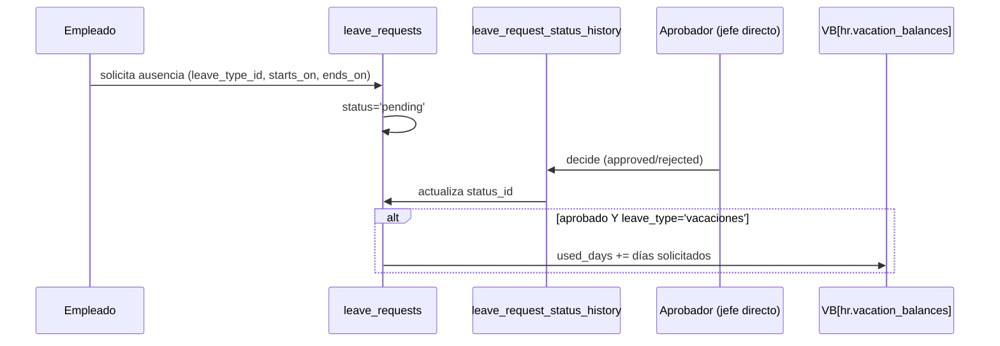

# 25 — Módulo Human Resources (diseño completo)

> Versión 1.0 — 2026-07-13. Mismo criterio que los documentos de
> módulo anteriores. Sin tablas nuevas — verificado completo contra
> [sql/13_hr.sql](../database/sql/13_hr.sql) (28 tablas). Sin código.

## 0. Alcance — Departamentos no es de `hr`, y Vacaciones/Permisos son el mismo mecanismo

| Elemento pedido                  | Dueño real                  | Nota                                                                                                                                                                                                                                                                              |
| -------------------------------- | --------------------------- | --------------------------------------------------------------------------------------------------------------------------------------------------------------------------------------------------------------------------------------------------------------------------------- |
| Empleados, Puestos, Evaluaciones | `hr`                        | ✅                                                                                                                                                                                                                                                                                |
| **Departamentos**                | `core`                      | **No** — `core.departments` ya existía como estructura organizacional reutilizada por `hr`, confirmado en el propio comentario de cabecera de `sql/13_hr.sql`: _"Referencia core.departments — no declara estructura propia"_. Ver §2                                             |
| **Vacaciones** y **Permisos**    | `hr.leave_requests` (ambos) | **No son dos sistemas distintos** — son el mismo mecanismo genérico (`leave_requests` + `leave_types`) diferenciado solo por el valor de `leave_type_id`. Vacaciones además tiene una tabla propia de saldo (`vacation_balances`) que ningún otro tipo de permiso tiene. Ver §4-5 |

## 1. Empleados (`hr.employees`)

`national_id_encrypted` (cifrado a nivel de columna, mismo mecanismo
que `customer_bank_accounts`/`employee_bank_accounts`, ver
[06-estrategia-seguridad §3](../database/06-estrategia-seguridad.md#3-cifrado)).
`hire_date`/`termination_date` como ciclo de vida completo — un
empleado nunca se borra al desvincularse, se marca
`termination_date`, consistente con que todo el historial
(evaluaciones, ausencias, activos asignados) sigue siendo válido tras
la baja.

**Corrección agregada (2026-07-13):** `00-indice-maestro.md` y
`00-roadmap-fases.md` citaban `hr.employee_asset_assignments` como ya
referenciado en este documento — no lo estaba, la mención de "activos
asignados" del párrafo anterior era genérica, sin tabla ni flujo. Se
corrige acá: `hr.employee_asset_assignments` (`employee_id →
employees`, `asset_id → assets.fixed_assets`, FK cerrada en
`sql/18_assets.sql`) es la asignación de un activo fijo de la empresa
(laptop, vehículo, herramienta) a un empleado — el diseño completo del
ciclo de vida del activo en sí (alta, depreciación, transferencia,
baja) vive en
[37-modulo-assets.md](./37-modulo-assets.md), no en este documento;
`hr` solo consume `assets.fixed_assets` por ID, mismo patrón
módulo-dueño que el resto del sistema.

**`user_id` es opcional** (no estaba señalado como decisión de
diseño): no todo empleado tiene una cuenta de sistema —un operario de
planta puede existir en `hr` sin nunca autenticarse en GORAZUS. Cuando
sí la tiene, `user_id` conecta con `core.users`, y el alta de esa
cuenta sigue el flujo de invitación ya diseñado en
[15-modulo-security §1](./15-modulo-security.md#1-usuarios--administración-no-autenticación),
pero **el alta del empleado no dispara automáticamente** la creación
de la cuenta — son dos decisiones administrativas separadas (un
empleado nuevo no necesariamente necesita acceso al sistema el primer
día, o nunca).

`department_id` en `employees` es **nullable**, mientras que
`job_positions.department_id` es `NOT NULL` (§3) — un empleado puede
existir sin departamento asignado directamente si su asignación real
viene de su puesto vía `employee_contracts.job_position_id`. Esto abre
una pregunta de consistencia no resuelta por el schema: nada obliga a
que `employees.department_id` coincida con el departamento del puesto
de su contrato vigente — es responsabilidad del caso de uso
mantenerlos alineados (o, alternativamente, tratar
`employees.department_id` como una asignación administrativa
independiente de la posición formal, p. ej. para reporte directo
distinto del organigrama de puestos). No se resuelve acá cuál de las
dos lecturas es la correcta — se señala como decisión de negocio
pendiente de fijar antes de construir reportes que asuman una u otra.

## 2. Departamentos (`core.departments`) — recapitulación, no repetida

Jerárquico auto-referenciado (`parent_department_id`), vive en `core`
porque lo reutilizan `hr` y la asignación general de usuarios
(`core.user_companies`/`roles` por empresa, ver
[14-modulo-core](./14-modulo-core.md)) sin que `hr` tenga que ser
dueño de una estructura que otros módulos también necesitan referenciar.
`hr.employees.department_id` y `hr.job_positions.department_id` son
las dos únicas FKs de `hr` hacia esta tabla — `hr` nunca declara su
propio departamento paralelo.

## 3. Puestos (`hr.job_positions`)

`department_id NOT NULL` (a diferencia de `employees.department_id`,
§1) — un puesto siempre pertenece a un departamento, es una decisión
estructural de la organización, no una asignación administrativa
flexible. `salary_band_min`/`salary_band_max` son la banda salarial
del puesto — `employee_contracts.base_salary` (el salario real
pactado) debería caer dentro de esa banda, aunque tampoco esto está
reforzado por `CHECK` (depende de dos tablas). La relación real
puesto↔empleado no es directa: pasa por
`employee_contracts.job_position_id` — un empleado puede tener
contratos históricos con distintos puestos (promociones, cambios de
área), y el puesto vigente es el de su contrato activo
(`ends_on IS NULL` o `ends_on >= hoy`), no una columna fija en
`employees`.

## 4-5. Vacaciones y Permisos — el mismo mecanismo, con una asimetría real

**Mecanismo común**: `hr.leave_requests` (`employee_id`,
`leave_type_id`, `starts_on`/`ends_on`, `status_id`) +
`leave_request_status_history` (con `decided_by_user_id` — quién
aprobó o rechazó, y cuándo). `hr.leave_types` es el catálogo que
distingue "vacaciones" de "permiso" — no dos tablas, un valor de
catálogo (`is_paid`, `accrual_rule`).

**La asimetría real, verificada**: solo **vacaciones** tiene una tabla
de saldo dedicada (`vacation_balances`, `accrued_days`/`used_days` por
empleado/año). Los demás tipos de `leave_types` (enfermedad,
maternidad/paternidad, sin goce) **no tienen tabla de saldo
equivalente** — se conceden o rechazan caso por caso vía
`leave_requests`, sin acumulación que trackear. Esto es correcto, no
un olvido: vacaciones es, en la mayoría de regímenes laborales, un
derecho que se **acumula** con el tiempo trabajado (de ahí
`accrued_days`) y tiene que cuadrar contra lo efectivamente tomado; una
licencia por enfermedad no se "acumula" de la misma forma —
típicamente es un derecho que se otorga por evento, con reglas propias
por régimen (`leave_types.accrual_rule` como campo libre es lo que
deja espacio para reglas específicas sin necesitar una tabla de saldo
por cada tipo).

**Sincronización `vacation_balances.used_days`** — igual patrón de
total denormalizado ya visto en
[19-modulo-inventory §3](./19-modulo-inventory.md#3-existencias-inventorystock)
(`quantity_reserved`): se actualiza cuando una `leave_request` de tipo
vacaciones pasa a `approved`, no se recalcula sumando `leave_requests`
en cada lectura — el saldo de vacaciones se consulta con frecuencia
(pantalla de empleado, validación al solicitar) y necesita ser lectura
rápida.

## 6. Evaluaciones (`performance_evaluations` + `performance_evaluation_criteria` + `performance_evaluation_scores`)

Patrón encabezado+detalle ya visto en otros módulos (una evaluación,
varios criterios puntuados) — `performance_evaluation_criteria` es
plano (sin ponderación explícita, a diferencia de
`suppliers.supplier_evaluation_criteria.weight_percentage`, ver
[17-modulo-suppliers](./17-modulo-suppliers.md), que sí pondera). Esta
es una asimetría real entre dos sistemas de evaluación que existen en
paralelo en el modelo (evaluación de desempeño de empleados vs.
evaluación de proveedores) — vale señalarla para que no se asuma que
"evaluación" siempre implica ponderación: acá el puntaje agregado
(`overall_score` en `performance_evaluations`, si se completa) queda a
criterio del evaluador, no calculado por fórmula a partir de los
`scores` individuales, a diferencia del lado de proveedores donde el
peso de cada criterio sí está en el schema.

`evaluated_by_user_id` es siempre un usuario (`core.users`), nunca
directamente otro `employee_id` — la evaluación queda atada a quién la
hizo _desde el sistema_, consistente con que toda auditoría de "quién
hizo qué" en GORAZUS pasa por `core.users`
([01-modelo-conceptual §1.1](../database/01-modelo-conceptual.md#11-columnas-universales)),
no por el maestro de empleados directamente.

## 7. Trazabilidad

| Punto solicitado  | Documento(s) de detalle normativo                                                         | Novedad de este documento                                                                                                                                  |
| ----------------- | ----------------------------------------------------------------------------------------- | ---------------------------------------------------------------------------------------------------------------------------------------------------------- |
| Empleados         | [sql/13_hr.sql](../database/sql/13_hr.sql)                                                | `user_id` opcional, sin alta automática de cuenta + pregunta de consistencia `department_id` vs. puesto (§1)                                               |
| Departamentos     | [14-modulo-core.md](./14-modulo-core.md) (módulo hermano, no cubierto ahí explícitamente) | Aclaración de propiedad `core`, primera vez que se documenta esta tabla en un módulo (§2)                                                                  |
| Puestos           | [sql/13_hr.sql](../database/sql/13_hr.sql)                                                | Relación real puesto↔empleado vía `employee_contracts`, no columna fija (§3)                                                                               |
| Vacaciones        | Ídem                                                                                      | Flujo completo + por qué es el único tipo con tabla de saldo (§4-5)                                                                                        |
| Permisos          | Ídem                                                                                      | Mismo mecanismo que Vacaciones, diferenciado solo por `leave_type_id` (§4-5)                                                                               |
| Evaluaciones      | Ídem                                                                                      | Asimetría real de ponderación frente a `supplier_evaluations` (§6)                                                                                         |
| Activos asignados | [37-modulo-assets.md](./37-modulo-assets.md) (diseño completo del activo en sí)           | Corrección de una referencia stale que citaban los índices maestros — `employee_asset_assignments` no estaba realmente cubierta hasta esta corrección (§1) |
