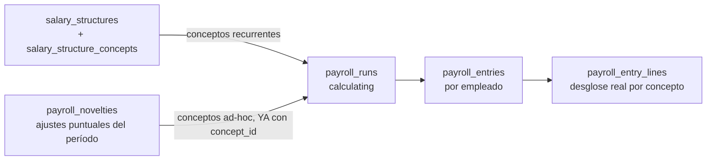

# 26 — Módulo Payroll (diseño completo)

> Versión 1.0 — 2026-07-13. Mismo criterio que los documentos de
> módulo anteriores. Sin tablas nuevas — verificado completo contra
> [sql/14_payroll.sql](../database/sql/14_payroll.sql) (22 tablas).
> Sin código.

## 0. Alcance — ISR, AFP y ARS no son tres tablas, son dos (y una se comparte)

| Elemento pedido    | Tabla real                                                                                 | Nota                                                                                                                                                |
| ------------------ | ------------------------------------------------------------------------------------------ | --------------------------------------------------------------------------------------------------------------------------------------------------- |
| Nómina             | `payroll_periods` + `payroll_runs` + `payroll_entries` + `payroll_entry_lines`             | ✅                                                                                                                                                  |
| **Bonificaciones** | `payroll_concepts` (tipo `earning`)                                                        | **No es tabla propia** — un bono es un concepto de nómina como cualquier otro, ver §2                                                               |
| Deducciones        | `payroll.deductions` + `loans`/`loan_installments` + `payroll_concepts` (tipo `deduction`) | Ver §3 — gap real de conexión encontrado                                                                                                            |
| **ISR**            | `tax_withholding_tables`                                                                   | ✅ (nombre genérico en el schema, es literalmente la tabla de tramos de ISR)                                                                        |
| **AFP** y **ARS**  | `social_security_tables` — **la misma tabla para ambas**                                   | Verificado: no hay tabla `afp_tables` ni `ars_tables` separada — ambas son filas de `social_security_tables` distinguidas por `scheme_name`. Ver §5 |
| Horas Extras       | `overtime_records`                                                                         | Mismo gap de conexión que Deducciones — ver §6                                                                                                      |

## 1. Nómina — el motor completo

Dos subsistemas que se combinan, no uno solo:

**Definición** (lo que _debería_ pagarse, estructural): `concept_types`
(`earning`/`deduction`/`employer_contribution`) → `payroll_concepts`
(un concepto con nombre y `calculation_formula`) →
`salary_structures` (por puesto, `job_position_id`) →
`salary_structure_concepts` (qué conceptos aplican a esa estructura,
con `override_amount` opcional).

**Ejecución** (lo que _efectivamente_ se pagó, transaccional):
`payroll_periods` → `payroll_runs` (`status`: `calculating`→
`calculated`→`closed`) → `payroll_entries` (una por empleado,
`gross_amount`/`net_amount`) → `payroll_entry_lines` (el desglose real
por concepto, con `concept_id` — esta es la tabla que finalmente
determina qué le pagaron o descontaron a cada empleado en cada
corrida).

## 2. Bonificaciones — no es tabla propia

Un bono es `payroll_concepts` con `concept_type = 'earning'` y un
`code` propio (`'bonus'`, `'productivity_bonus'`...). Dos caminos
válidos para que llegue a un empleado, ambos ya en el schema:

- **Recurrente**: vía `salary_structure_concepts` — el bono es parte
  fija de la estructura salarial del puesto.
- **Puntual**: vía `payroll_novelties` (`concept_id` + `amount` +
  `period_id` — **correctamente conectado** al motor de conceptos, a
  diferencia de otras tablas de este módulo, ver §3/§6) — un bono
  de un solo período, sin modificar la estructura salarial base.

`payroll.employee_benefits`/`employee_benefit_assignments` (seguro,
vale, bono fijo) es un **catálogo de beneficios asignados**, adyacente
pero distinto — ver la nota de conexión en §3, aplica igual acá:
no hay `concept_id` en `employee_benefit_assignments`, así que la
asignación de un beneficio no se traduce sola en una línea de nómina.

## 3. Deducciones — gap real de conexión, verificado

`payroll.deductions` (`employee_id`, `description`, `amount`) es un
descuento recurrente (cuota sindical, por ejemplo). `loans` +
`loan_installments` es el caso más completo y **sí está correctamente
conectado**: `loan_installments.payroll_entry_id` referencia
directamente la liquidación donde se aplicó esa cuota.

**Gap identificado, verificado contra el schema real**:
`payroll.deductions` **no tiene** `concept_id` ni ninguna FK hacia
`payroll_entry_lines` — a diferencia de `payroll_novelties` (que sí
tiene `concept_id`) y de `loan_installments` (que sí tiene
`payroll_entry_id`). Esto significa que, tal como está el modelo hoy,
una fila en `payroll.deductions` es una **intención declarada** de
descuento recurrente, pero no hay trazabilidad automática de en qué
corrida específica se aplicó — el caso de uso de cálculo de nómina
tendría que leer `deductions` activas por empleado y generar la línea
correspondiente (probablemente vía un `payroll_novelties` sintético, o
directamente una `payroll_entry_line`), sin que el schema deje un
rastro de esa traducción. Mismo gap exactamente en
`employee_benefit_assignments` (§2) y en `overtime_records` (§6) — es
un patrón repetido, no un caso aislado, y candidato razonable a
resolverse de forma unificada (p. ej. agregando `concept_id` a las
tres tablas) en vez de tres soluciones distintas.

## 4. ISR (`tax_withholding_tables`)

Tramos progresivos (`bracket_min`, `bracket_max` nullable —
`NULL` en el tramo superior significa "sin techo", el último tramo de
la escala), `rate_percentage` por tramo. Cálculo estándar de impuesto
progresivo: se aplica la tasa de cada tramo solo a la porción del
ingreso que cae dentro de ese tramo, no la tasa del tramo más alto
sobre el ingreso total — el schema no fuerza este cálculo (es lógica
de aplicación), pero la estructura de tramos con `bracket_min`/
`bracket_max` es exactamente la que ese cálculo requiere. El resultado
se materializa como una línea de `payroll_entry_lines` con
`concept_id` apuntando al concepto de ISR (`concept_type =
'deduction'`).

## 5. AFP y ARS (`social_security_tables`) — una tabla, dos regímenes

Verificado: **no existen** `afp_tables`/`ars_tables` separadas.
`social_security_tables` (`scheme_name`, `employee_rate_percentage`,
`employer_rate_percentage`) sirve para **cualquier** régimen de
seguridad social — AFP (pensión) y ARS (salud) son dos filas de la
misma tabla, distinguidas por `scheme_name`, no dos estructuras de
datos distintas. Mismo criterio de diseño que
[25-modulo-hr §4-5](./25-modulo-hr.md#4-5-vacaciones-y-permisos--el-mismo-mecanismo-con-una-asimetría-real)
(Vacaciones/Permisos: mismo mecanismo, distinto valor de catálogo).

**Doble naturaleza de cada aporte, no estaba explicitada**: cada fila
de `social_security_tables` genera, para el mismo empleado en la misma
corrida, **dos** efectos distintos:

| Componente       | `employee_rate_percentage`                                                                  | `employer_rate_percentage`                                                                                                                                                |
| ---------------- | ------------------------------------------------------------------------------------------- | ------------------------------------------------------------------------------------------------------------------------------------------------------------------------- |
| Efecto           | Se **descuenta** del salario del empleado (`concept_type='deduction'`, reduce `net_amount`) | Es **costo patronal adicional** (`concept_type='employer_contribution'`, nunca reduce lo que recibe el empleado)                                                          |
| Dónde aparece    | `payroll_entry_lines` del empleado                                                          | `payroll_entry_lines` también, pero no afecta `payroll_entries.net_amount` — es costo de la empresa, no del empleado                                                      |
| Destino contable | Asiento de nómina estándar (pasivo por retención a pagar a la AFP/ARS)                      | Asiento de gasto patronal (consumido por `accounting` como evento, ver [22-modulo-accounting §3](./22-modulo-accounting.md#3-asientos--manuales-automáticos-y-reversión)) |

Confundir estos dos componentes (tratar el aporte patronal como si
saliera del bolsillo del empleado, o viceversa) sería un error de
cálculo real, no solo de presentación — por eso el schema los separa
en dos columnas de tasa en vez de una sola.

## 6. Horas Extras (`overtime_records`)

`hours` + `rate_multiplier` (default `1.5`) — el multiplicador es
editable por fila, no fijo al 50%, porque distintos regímenes/
convenios pueden pactar recargos distintos (nocturno, feriado, doble
tiempo). Mismo gap de conexión que §3: **no tiene** `concept_id` ni
FK hacia `payroll_entry_lines` — el cálculo real (`hours ×
rate_multiplier × valor_hora_del_empleado`) tiene que resolverse en la
capa de aplicación al armar la corrida, leyendo los
`overtime_records` del período por empleado, sin que quede declarado
en el schema qué concepto de nómina específico recibe ese monto.

## 7. Trazabilidad

| Punto solicitado | Documento(s) de detalle normativo                    | Novedad de este documento                                                                                            |
| ---------------- | ---------------------------------------------------- | -------------------------------------------------------------------------------------------------------------------- |
| Nómina           | [sql/14_payroll.sql](../database/sql/14_payroll.sql) | Los dos subsistemas (definición vs. ejecución) conectados en un solo diagrama (§1)                                   |
| Bonificaciones   | Ídem                                                 | Aclaración de que no es tabla propia + los dos caminos válidos (§2)                                                  |
| Deducciones      | Ídem                                                 | **Gap real encontrado**: `deductions` sin `concept_id`, a diferencia de `payroll_novelties`/`loan_installments` (§3) |
| ISR              | Ídem                                                 | Mecánica de cálculo por tramos progresivos (§4)                                                                      |
| AFP / ARS        | Ídem                                                 | Confirmación de tabla compartida + doble naturaleza empleado/patronal, antes no explicitada (§5)                     |
| Horas Extras     | Ídem                                                 | Mismo gap de conexión que Deducciones, generalizado como patrón (§6)                                                 |
