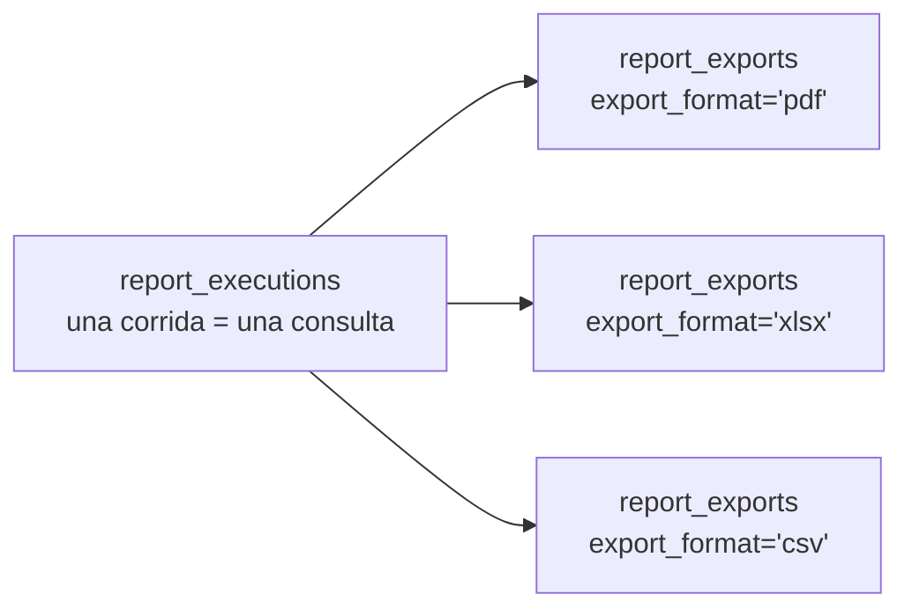

# 28 — Módulo Reports & BI (diseño completo)

> Versión 1.0 — 2026-07-13. Mismo criterio que los documentos de
> módulo anteriores. Sin tablas nuevas — verificado completo contra
> [sql/19_reports.sql](../database/sql/19_reports.sql) (11 tablas) y
> [sql/20_bi.sql](../database/sql/20_bi.sql) (14 tablas). Sin código.
>
> **Ampliación (Fase 7 — Business Intelligence):** ver
> [41-modulo-bi.md](./41-modulo-bi.md) — cierra 3 gaps puntuales
> encontrados al verificar contra los menús (`chart_type` en
> `dashboard_widgets`, reportes ad-hoc, export a imagen) y deja
> explícitamente fuera de alcance Power BI y Forecast/ML por falta de
> necesidad de negocio confirmada. No se repite acá.

## 0. Alcance — el pedido cruza tres conceptos ya distinguidos, más dos que no son tablas

| Elemento pedido       | Dueño real                                                                                                                                                  | Nota                                                                                                                                                                                                     |
| --------------------- | ----------------------------------------------------------------------------------------------------------------------------------------------------------- | -------------------------------------------------------------------------------------------------------------------------------------------------------------------------------------------------------- |
| **Dashboard**         | Dos cosas distintas — `reports.dashboards` (paneles armados por el usuario) **y** el módulo de negocio `dashboard` (panel de inicio, sin entidades propias) | Ver §4                                                                                                                                                                                                   |
| KPIs                  | `bi.kpis` — parte de una **jerarquía de tres niveles**, no una tabla aislada                                                                                | Ver §5                                                                                                                                                                                                   |
| **PDF** y **Excel**   | `reports.report_exports.export_format`                                                                                                                      | **No son tablas** — son valores del mismo campo (`CHECK IN ('pdf', 'xlsx', 'csv')`) de una única tabla de exportación. Ver §2                                                                            |
| Reportes programados  | `reports.report_schedules` + `report_schedule_recipients`                                                                                                   | ✅                                                                                                                                                                                                       |
| Business Intelligence | Schema completo `bi` (14 tablas)                                                                                                                            | Módulo distinto de `reports`, distinción ya fijada en [04-catalogo-modulos-negocio](./04-catalogo-modulos-negocio.md#bi-vs-reportes-por-qué-son-módulos-distintos) — no se repite acá, se aplica. Ver §6 |

## 1. Reportes — el motor base (contexto para todo lo demás)

`report_definitions` (`source_module` + `base_query_name` — de qué
módulo viene el dato y qué query lo trae) → `report_templates`
(layout, con traducción por idioma) → `report_parameters`
(configurables por ejecución) → `report_executions` (una corrida
concreta, con `parameters_used` congelados) → `report_exports` (el
archivo resultante). `reports` es consumidor puro de proyecciones de
los demás módulos, nunca dueño de datos transaccionales — regla ya
fijada, no repetida.

## 2. PDF y Excel — mismo campo, no tablas distintas

`report_exports.export_format CHECK IN ('pdf', 'xlsx', 'csv')`,
verificado. **Relación clave no explicitada antes**: una
`report_execution` es la _consulta_ (los datos, congelados en
`parameters_used` + lo que la query devolvió en ese momento);
`report_exports` es la _renderización_ — y una misma ejecución puede
tener **más de un** export, en formatos distintos:

Esto es lo que evita volver a ejecutar la query si un usuario pide "lo
mismo pero en Excel" después de haberlo visto en PDF — se renderiza el
mismo resultado ya obtenido en otro formato, no se re-consulta la base
de datos. `file_id` en cada export apunta a `core.files` — el archivo
físico en sí es responsabilidad del repositorio transversal, `reports`
solo referencia.

## 3. Reportes programados (`report_schedules` + `report_schedule_recipients`)

`cron_expression` (mismo mecanismo de programación que
`core.scheduled_jobs`, ver
[12-backend-enterprise §7](./12-backend-enterprise.md#7-configuración))

- `report_schedule_recipients` (lista de usuarios que lo reciben, no
  necesariamente el mismo que lo creó). **Flujo completo, no estaba
  conectado con notificaciones**: al disparar el cron, se crea una
  `report_execution` normal (mismo motor de §1, sin caso especial para
  "programado" vs. "manual"), se genera el `report_export` en el formato
  configurado, y se entrega vía `core.notifications`/
  `notification_channels` (ver
  [14-modulo-core §3](./14-modulo-core.md#3-settings-coresystem_settings--system_parameters--feature_flags))
  a cada `report_schedule_recipients.user_id` — un reporte programado no
  usa un mecanismo de entrega paralelo, reutiliza el mismo sistema de
  notificaciones que cualquier otro aviso del sistema.

## 4. Dashboard — dos objetos reales, no uno

|                                | `reports.dashboards` + `dashboard_widgets`                                                                            | Módulo `dashboard` (panel de inicio)                                                                                                      |
| ------------------------------ | --------------------------------------------------------------------------------------------------------------------- | ----------------------------------------------------------------------------------------------------------------------------------------- |
| ¿Tiene tablas propias?         | Sí (2, verificadas)                                                                                                   | No — ninguna, confirmado en [04-catalogo-modulos-negocio](./04-catalogo-modulos-negocio.md#dashboard-como-composición-pura-igual-que-pos) |
| ¿Quién lo arma?                | El usuario, libremente (`owner_user_id`, agrega `dashboard_widgets` eligiendo entre `report_definitions` disponibles) | El sistema, a partir de un registro declarativo de módulos habilitados/permisos del usuario                                               |
| ¿Se puede tener más de uno?    | Sí, un usuario puede crear varios paneles propios                                                                     | No, es el único panel de inicio                                                                                                           |
| Fuente de datos de cada widget | `report_definitions` (vía `dashboard_widgets.report_definition_id`)                                                   | Proyecciones de solo lectura de cada módulo habilitado                                                                                    |

Ambos son "un dashboard" en el sentido coloquial, pero uno es un
**producto de `reports`** (el usuario arma su propio panel analítico
eligiendo reportes) y el otro es **infraestructura de `apps/web`**
(el shell de la aplicación, sin dueño de dominio — ver
[03-arquitectura-modulos-frontend §6](./03-arquitectura-modulos-frontend.md#6-layout-y-shell-de-la-aplicación)).
No son intercambiables: agregar un widget a `reports.dashboards` nunca
modifica qué ve el usuario en el panel de inicio, y viceversa.

## 5. KPIs — jerarquía de tres niveles, no una tabla aislada

Verificado en el schema: **KPI**, **Indicador** y **Métrica** son tres
tablas paralelas (`bi.kpis`, `bi.indicators`, `bi.metrics`), cada una
con su propia tabla de snapshots históricos
(`kpi_snapshots`/`indicator_snapshots`/`metric_snapshots`, las tres
particionadas mensualmente), **no una jerarquía de FK entre ellas**
— son conceptualmente jerárquicos (comentario real: _"indicador de
menor jerarquía que un KPI"_, _"métrica... sin meta asociada, a
diferencia de KPI"_) pero estructuralmente independientes:

| Nivel        | Tiene `target_value`/meta | Uso típico                                                               |
| ------------ | ------------------------- | ------------------------------------------------------------------------ |
| `kpis`       | Sí                        | Indicador estratégico con meta de negocio ("margen bruto objetivo: 35%") |
| `indicators` | No                        | Indicador operativo de seguimiento, sin meta formal fijada               |
| `metrics`    | No                        | Dato agregado crudo, insumo de los dos anteriores o de un cubo (§6)      |

**`bi_alerts` — mecanismo de umbral unificado para los tres niveles**:
`CHECK (num_nonnulls(kpi_id, indicator_id, metric_id) = 1)` —
verificado, una alerta se define sobre **exactamente uno** de los
tres, nunca sobre una combinación. `bi_alert_triggers` registra cada
vez que el umbral (`threshold_operator`/`threshold_value`) se cruzó —
es una bitácora de activaciones, no el estado actual de la alerta (el
estado actual se deriva de si hay un trigger reciente sin resolver,
lógica de aplicación, no columna de estado en `bi_alerts`).

## 6. Business Intelligence — el schema completo, distinto de Reports

La distinción de fondo (`reports` = salida formal de layout fijo;
`bi` = análisis interactivo/drill-down) ya está fijada en
[04-catalogo-modulos-negocio](./04-catalogo-modulos-negocio.md#bi-vs-reportes-por-qué-son-módulos-distintos)
y no se repite. Lo que se agrega acá es cómo se arma un cubo:
`data_mart_tables.materialized_view_name` (referencia por nombre, no
FK, a una vista materializada real de
[28_materialized_views.sql](../database/sql/28_materialized_views.sql))
→ `data_cubes` → `data_cube_dimensions` (columnas por las que se puede
cortar/filtrar) + `data_cube_measures` (columnas agregables, con
`aggregation CHECK IN ('sum', 'avg', 'count', 'min', 'max')`). Un
cubo nunca lee una tabla transaccional cruda — siempre pasa por una
vista materializada ya agregada, consistente con el comentario real de
cabecera del archivo. `forecast_models`/`forecasts` son el único
componente predictivo del módulo — un modelo configurado
(`algorithm`, texto libre) que genera `forecasts` con
`predicted_value` por fecha, sin mecanismo de entrenamiento/
reentrenamiento modelado en el schema (responsabilidad de la capa de
aplicación o de un servicio externo de ML, fuera de alcance de este
documento).

## 7. Trazabilidad

| Punto solicitado      | Documento(s) de detalle normativo                                                                                                                                    | Novedad de este documento                                                                   |
| --------------------- | -------------------------------------------------------------------------------------------------------------------------------------------------------------------- | ------------------------------------------------------------------------------------------- |
| Dashboard             | [04-catalogo-modulos-negocio](./04-catalogo-modulos-negocio.md#dashboard-como-composición-pura-igual-que-pos) + [sql/19_reports.sql](../database/sql/19_reports.sql) | Comparación completa de los dos objetos reales, antes no distinguidos en un solo lugar (§4) |
| KPIs                  | [sql/20_bi.sql](../database/sql/20_bi.sql)                                                                                                                           | Jerarquía KPI/Indicador/Métrica + mecanismo de alertas unificado (§5)                       |
| PDF                   | Ídem (`reports.report_exports`)                                                                                                                                      | Relación ejecución↔export: una consulta, múltiples formatos sin re-consultar (§2)           |
| Excel                 | Ídem                                                                                                                                                                 | Ídem (§2)                                                                                   |
| Reportes programados  | [sql/19_reports.sql](../database/sql/19_reports.sql)                                                                                                                 | Flujo completo hacia `core.notifications`, sin mecanismo de entrega paralelo (§3)           |
| Business Intelligence | [04-catalogo-modulos-negocio](./04-catalogo-modulos-negocio.md#bi-vs-reportes-por-qué-son-módulos-distintos) + [sql/20_bi.sql](../database/sql/20_bi.sql)            | Mecánica de armado de un cubo sobre vistas materializadas (§6)                              |
