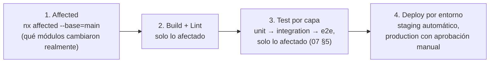

# 31 — Infraestructura completa (diseño consolidado)

> Versión 1.1 — 2026-07-13. Mismo criterio que
> [30-api-completa.md](./30-api-completa.md): consolida lo ya fijado
> sin repetirlo, y **cierra tres gaps ya identificados** en
> [00-arquitectura-general §10](./00-arquitectura-general.md#10-gaps-identificados-candidatos-a-adr-no-decisiones-tomadas)
> hace varios documentos: CI/CD (§7-8), Observabilidad/Monitoreo (§9)
> y alta disponibilidad de Redis/RabbitMQ/MinIO (§11). Sin código.
>
> **Nota de revisión (v1.1)**: §2 (Kubernetes) fue revisado el mismo
> día — la v1.0 declaraba K8s no adoptado, siguiendo la decisión de
> [10-evolucion-a-microservicios §4](./10-evolucion-a-microservicios.md#4-qué-no-se-hace).
> El Arquitecto Principal revisó esa decisión a pedido explícito del
> usuario; §2 documenta la decisión vigente (adoptado) y por qué no
> contradice el resto de la estrategia de monolito modular ya fijada.

## 1. Docker

Ya fijado completo en
[08-infraestructura-y-despliegue §1](./08-infraestructura-y-despliegue.md#1-topología-docker-compose):
topología Compose (`nginx`, `api`, `web`, `postgres`, `redis`,
`rabbitmq`, `minio`), variantes `dev`/`prod`. No se repite.

## 2. Kubernetes — adoptado (decisión revisada)

**Decisión vigente: sí adoptado.** Revisa lo declarado en
[10-evolucion-a-microservicios §4](./10-evolucion-a-microservicios.md#4-qué-no-se-hace)
(ver nota de revisión al inicio de este documento y la actualización
aplicada a esa sección). El punto de fondo que evita que esta decisión
contradiga el resto de la estrategia ya fijada:

**Adoptar K8s es una decisión de plataforma de orquestación,
ortogonal a la estrategia de monolito modular** — no implica extraer
microservicios antes de tiempo. GORAZUS sigue siendo, el día que esto
se implemente, el mismo monolito modular ya diseñado
([10-evolucion-a-microservicios §1](./10-evolucion-a-microservicios.md#1-por-qué-monolito-modular-primero)):
`apps/api` se despliega como un único `Deployment` con múltiples
réplicas (el mismo escalado horizontal ya descrito en
[08 §7](./08-infraestructura-y-despliegue.md#7-escalado-horizontal),
ahora gestionado por K8s en vez de a mano), no como 21 servicios
separados. Cuando en el futuro se extraiga un módulo real
(estrategia strangler fig ya fijada en
[10-evolucion-a-microservicios §3](./10-evolucion-a-microservicios.md#3-proceso-de-extracción-strangler-fig)),
ese servicio nuevo simplemente se agrega como un `Deployment` más al
mismo cluster ya existente — la migración a K8s no había que
repetirla en ese momento, ya está hecha.

### 2.1 Alcance por entorno

`local` (desarrollo) **sigue en Docker Compose** — velocidad de
iteración y hot-reload sin la sobrecarga de un cluster local
(minikube/kind), consistente con que
[08 §6](./08-infraestructura-y-despliegue.md#6-entornos) ya distingue
`local` de `staging`/`production` por su propósito, no solo por
configuración. `staging` y `production` corren sobre Kubernetes —
misma forma de topología en ambos (ya es principio fijado en 08 §6:
"la topología física es intencionalmente la misma forma en local,
staging y production"), solo cambian réplicas/recursos/namespace.

### 2.2 Topología

| Recurso K8s                                                 | Rol                                                | Reemplaza/extiende                                                                                                                                                                                                                                                                                                                                                                                                                                                                                                                                                                                                                           |
| ----------------------------------------------------------- | -------------------------------------------------- | -------------------------------------------------------------------------------------------------------------------------------------------------------------------------------------------------------------------------------------------------------------------------------------------------------------------------------------------------------------------------------------------------------------------------------------------------------------------------------------------------------------------------------------------------------------------------------------------------------------------------------------------- |
| `Deployment` (`api`, `web`)                                 | Réplicas del monolito modular y del build estático | Los servicios `api`/`web` de Docker Compose ([08 §1](./08-infraestructura-y-despliegue.md#1-topología-docker-compose))                                                                                                                                                                                                                                                                                                                                                                                                                                                                                                                       |
| `Service` (ClusterIP)                                       | Networking interno entre pods                      | — nuevo, no existía en Compose de un solo host                                                                                                                                                                                                                                                                                                                                                                                                                                                                                                                                                                                               |
| `Ingress` + `ingress-nginx`                                 | Enrutamiento externo, TLS, upgrade de WebSocket    | Las mismas reglas ya fijadas en [08 §2](./08-infraestructura-y-despliegue.md#2-nginx-enrutamiento) — se expresan como recurso `Ingress` en vez de `nginx.conf` a mano, mismo motor NGINX por debajo (`ingress-nginx` es un controlador NGINX)                                                                                                                                                                                                                                                                                                                                                                                                |
| `ConfigMap` / `Secret`                                      | Origen de las variables de entorno                 | Reemplaza `.env` en estos dos entornos — `core/config` sigue validando con el mismo schema Zod fail-fast ([12-backend-enterprise §7](./12-backend-enterprise.md#7-configuración)), sin cambio de contrato, solo cambia de dónde vienen los valores                                                                                                                                                                                                                                                                                                                                                                                           |
| `HorizontalPodAutoscaler`                                   | Autoescalado de `api`                              | Nuevo — sobre CPU/memoria o una métrica custom leída de Prometheus (§9), conectando el stack de monitoreo ya diseñado con el escalado real, no solo con alertas                                                                                                                                                                                                                                                                                                                                                                                                                                                                              |
| Operators (Postgres, Redis, RabbitMQ, MinIO)                | Despliegan los componentes con estado              | **No reemplazan el diseño ya hecho, lo implementan**: el operator de Postgres recomendado (CloudNativePG o Zalando postgres-operator) implementa Patroni internamente — es la misma arquitectura ya fijada en [docs/database/10-estrategia-alta-disponibilidad §2](../database/10-estrategia-alta-disponibilidad.md#2-orquestación-de-failover), corriendo dentro de K8s en vez de sobre VMs administradas a mano. Igual criterio para el Redis Operator (Sentinel), el RabbitMQ Cluster Operator (quorum queues) y el MinIO Operator (modo distribuido) ya diseñados en [§11](#11-alta-disponibilidad--gap-cerrado-para-redisrabbitmqminio) |
| Stack de observabilidad (Prometheus, Grafana, Loki, Jaeger) | Métricas/logs/trazas del §9                        | **Agregado por Fase 9** — corre en su propio namespace (`observability`, no `staging`/`production`) vía el `kube-prometheus-stack` (Prometheus + Grafana + Alertmanager empaquetados juntos, mantenido por la comunidad Prometheus Operator) más los charts oficiales de Loki y Jaeger, todos referenciados desde el mismo Kustomize de §2.3 (una base + overlay por entorno, igual patrón que el resto de recursos — no se introduce Helm como herramienta paralela solo para estas piezas)                                                                                                                                                 |

### 2.3 Namespaces y manifiestos

Un namespace por entorno (`staging`, `production`) — **no** un
namespace por tenant: el aislamiento multiempresa ya se resuelve a
nivel de aplicación (RLS,
[docs/database/06-estrategia-seguridad §1](../database/06-estrategia-seguridad.md#1-row-level-security-el-mecanismo-central-de-aislamiento-multiempresa)),
duplicar ese aislamiento a nivel de namespace sería sobre-ingeniería
sin beneficio real dado el modelo SaaS ya elegido (una base, RLS, no
bases separadas por tenant). Manifiestos en `infra/kubernetes/` (ver
[1-estructura-monorepo, árbol actualizado](./01-estructura-monorepo.md#2-árbol-de-carpetas-raíz)),
con Kustomize (`base/` + `overlays/staging/` + `overlays/production/`)
en vez de Helm — nativo de `kubectl`, sin dependencia adicional,
mismo criterio ya aplicado en Monitoreo (§9: preferir el stack estándar
sin vendor lock-in innecesario cuando hay alternativa madura).

### 2.4 Integración con CI/CD

Los workflows de GitHub Actions ya diseñados en §8
(`deploy-staging.yml`, `deploy-production.yml`) cambian su paso final
de `docker compose up` a `kubectl apply -k overlays/<entorno>` — el
resto del pipeline (etapas de §7, aprobación manual para producción)
no cambia.

## 3. NGINX

Ya fijado completo en
[08 §1-2](./08-infraestructura-y-despliegue.md#2-nginx-enrutamiento):
punto de entrada único, terminación TLS, upgrade de conexión
obligatorio para WebSocket. No se repite.

## 4. Redis

Los tres usos (cache, adaptador WebSocket, rate limiting/locks) ya
fijados en
[08 §3](./08-infraestructura-y-despliegue.md#3-redis-los-tres-usos-sin-mezclarlos).
Alta disponibilidad — ver §11 (gap cerrado en este documento).

## 5. RabbitMQ

Convención de exchange/routing key/cola por consumidor ya fijada en
[08 §4](./08-infraestructura-y-despliegue.md#4-rabbitmq-convención-de-exchanges-y-colas).
Alta disponibilidad — ver §11.

## 6. MinIO

Buckets por módulo, URLs firmadas de corta duración, ya fijado en
[08 §5](./08-infraestructura-y-despliegue.md#5-minio-buckets). Alta
disponibilidad — ver §11.

## 7. CI/CD — gap cerrado (identificado en 00-arquitectura-general §10)

Pipeline de 4 etapas, construido sobre lo ya decidido en
[01-estructura-monorepo](./01-estructura-monorepo.md) (Nx) y
[07-convenciones-y-estandares §5](./07-convenciones-y-estandares.md#5-testing)
(pirámide de testing):

**Por qué "solo lo afectado" no es una optimización opcional**: con
21+ módulos de negocio, correr la suite completa de tests en cada PR
—incluso uno que solo toca `hr`— sería minutos u horas de CI
desperdiciados por cambio. `nx affected` ya calcula el grafo de
dependencias real ([01 §1](./01-estructura-monorepo.md#1-decisión-monorepo-con-apps-delgadas--modules-como-núcleo)) —
el pipeline de CI existe para _usar_ ese grafo, no para ignorarlo y
correr todo siempre "por las dudas".

**Gate de calidad, no solo de tests**: un PR no es mergeable si (a)
falla cualquier test de lo afectado, (b) el lint de fronteras de Nx
detecta una importación prohibida
([01 §5](./01-estructura-monorepo.md#5-reglas-de-import-enforcement)),
o (c) no tiene la aprobación del CODEOWNER del módulo tocado
([07 §3](./07-convenciones-y-estandares.md#3-git)) — los tres son
bloqueantes automáticos, ninguno es una sugerencia.

## 8. GitHub Actions — la implementación concreta de §7

GitHub como plataforma ya está implícito en el proyecto
(`.github/CODEOWNERS`, ya referenciado en
[07 §3](./07-convenciones-y-estandares.md#3-git)) — GitHub Actions es
la elección consistente para CI/CD, no una herramienta nueva ajena al
resto de las decisiones ya tomadas.

| Workflow                   | Disparador                                    | Qué hace                                                                                                                                                                                                                                                                       |
| -------------------------- | --------------------------------------------- | ------------------------------------------------------------------------------------------------------------------------------------------------------------------------------------------------------------------------------------------------------------------------------ |
| `pr-validation.yml`        | Pull request hacia `main`                     | Las 4 etapas de §7, acotadas a `nx affected` contra `main`                                                                                                                                                                                                                     |
| `deploy-staging.yml`       | Push a `main` (post-merge)                    | Build completo de imágenes Docker, deploy automático a `staging`                                                                                                                                                                                                               |
| `deploy-production.yml`    | Manual (`workflow_dispatch`) o tag de release | Mismo build ya validado en staging (promoción de artefacto, no rebuild), requiere aprobación de un [GitHub Environment protegido](https://docs.github.com) con reviewers designados                                                                                            |
| `nightly-restore-test.yml` | Cron diario/mensual según corresponda         | Dispara las pruebas de restauración ya fijadas en [docs/database/08-estrategia-respaldo §6](../database/08-estrategia-respaldo.md#6-pruebas-de-restauración-no-negociable) — CI/CD no es solo para código, también para verificar que los respaldos siguen siendo restaurables |

**Secretos**: gestionados vía GitHub Environments (secrets scoped por
entorno — un secret de `production` nunca es legible desde un workflow
disparado en `staging`), no vía secrets a nivel de repositorio
completo — mismo principio de privilegio mínimo ya aplicado a los
roles de base de datos
([docs/database/06-estrategia-seguridad §2](../database/06-estrategia-seguridad.md#2-roles-de-base-de-datos-privilegio-mínimo)).
`deploy-production.yml` nunca tiene acceso directo a las credenciales
de `staging` ni viceversa.

## 9. Monitoreo — gap cerrado (identificado en 00-arquitectura-general §10)

Hoy solo existe logging estructurado
([07 §6](./07-convenciones-y-estandares.md#6-logging-y-observabilidad)).
Se completan los tres pilares de observabilidad, construidos sobre lo
que ya existe en vez de reemplazarlo:

| Pilar                   | Estado previo                                                                        | Se agrega                                                                                                                                                                                                                                                                                                                                                                                                                                                                                                                                                                                                                 |
| ----------------------- | ------------------------------------------------------------------------------------ | ------------------------------------------------------------------------------------------------------------------------------------------------------------------------------------------------------------------------------------------------------------------------------------------------------------------------------------------------------------------------------------------------------------------------------------------------------------------------------------------------------------------------------------------------------------------------------------------------------------------------- |
| **Logs**                | Ya completo — JSON estructurado, correlacionado por `empresaId`/`userId`/`requestId` | **Destino de agregación agregado por Fase 9 (antes indefinido — "el stack de observabilidad de Kubernetes" sin nombrar producto): Loki.** Cada réplica sigue escribiendo a `stdout` sin cambio ([32-core-platform/07 §2](./32-core-platform/07-observabilidad-y-gobernanza.md#2-logging-framework)); Promtail (o el `DaemonSet` equivalente) recolecta esos streams del propio runtime de contenedores de Kubernetes y los envía a Loki, indexados por las mismas etiquetas ya usadas para métricas (`namespace`, `pod`, `container`) — mismo principio de "reusar la correlación existente" que ya se aplicó al trace ID |
| **Métricas**            | No existía                                                                           | OpenTelemetry (instrumentación) → Prometheus (almacenamiento de series de tiempo) → Grafana (visualización) — stack estándar de la industria, sin vendor lock-in, coherente con que el resto del proyecto evita dependencias propietarias donde hay alternativa madura                                                                                                                                                                                                                                                                                                                                                    |
| **Trazas distribuidas** | No existía                                                                           | OpenTelemetry con el mismo `requestId` ya generado por `core/http` como trace ID — una traza sigue una request desde `Nginx` → `api` → publicación de evento en `RabbitMQ` → consumo en otro módulo, usando la correlación que **ya existe** en los logs, no un ID nuevo y paralelo. **Backend de almacenamiento/visualización agregado por Fase 9 (antes indefinido — solo el mecanismo de propagación estaba diseñado, sin destino): Jaeger**, receptor nativo de OTLP (el colector de OpenTelemetry ya instrumentado exporta directo a Jaeger sin traductor intermedio)                                                |

**Por qué Loki y no ELK/Elasticsearch para logs, y Jaeger y no
Zipkin/Tempo para trazas** (decisión pedida explícitamente en la
Fase 9, no una elección libre de este documento — se documenta el
porqué para que quede consistente con el resto de decisiones de stack
del proyecto): ambos son los pares "nativos" de lo que ya estaba
decidido — Loki es el sistema de logs construido por Grafana Labs
específicamente para integrarse sin fricción con Grafana (ya elegido
para métricas) usando el mismo lenguaje de consulta emparentado
(LogQL, misma sintaxis de etiquetas que PromQL) y el mismo mecanismo
de etiquetado que Prometheus, en vez de mantener un stack de búsqueda
de texto completo (Elasticsearch) separado y más pesado operacionalmente
para un caso de uso — log estructurado ya indexado por campos, no
búsqueda libre de texto — que no lo necesita. Jaeger es un backend
nativo de OpenTelemetry (recibe OTLP directamente), con UI propia de
exploración de trazas ya madura y ampliamente adoptada — evita
introducir un tercer proyecto (Tempo, técnicamente más nuevo y menos
independiente de Grafana Cloud) cuando Jaeger ya cumple el requisito
sin atarse al mismo proveedor que Loki/Grafana, manteniendo la
composición de piezas independientes (sin vendor lock-in) que el resto
de este documento ya prioriza.

**Por qué se reutiliza `requestId` como trace ID, en vez de que
OpenTelemetry genere el suyo propio**: sin esto, correlacionar un log
con su traza correspondiente requeriría un mapeo adicional
(`requestId` ↔ `traceId`) que agregaría una dimensión más de
sincronización a mantener. Generando el trace ID en el mismo punto
donde ya se genera `requestId` (`core/http`, al entrar la request), un
log y su traza son, literalmente, la misma clave de correlación.

**Alertas de infraestructura, distintas de las alertas de negocio ya
diseñadas** (`bi.bi_alerts`,
[28-modulo-reports-bi §5](./28-modulo-reports-bi.md#5-kpis--jerarquía-de-tres-niveles-no-una-tabla-aislada)):
Grafana Alerting sobre métricas técnicas (saturación de conexiones a
Postgres, profundidad de cola de RabbitMQ, latencia p99 de endpoints
críticos) — dos sistemas de alerta con propósitos distintos (salud
técnica vs. indicadores de negocio), no uno solo forzado a cubrir
ambos casos.

## 10. Respaldos

El respaldo de PostgreSQL ya está completo y no se repite:
[docs/database/08-estrategia-respaldo.md](../database/08-estrategia-respaldo.md)
(PITR, `pg_dump` por tenant, archivado en frío, cifrado, pruebas de
restauración mensuales). Lo que faltaba —respaldo de lo que **no** es
Postgres— se fija acá:

| Componente                                   | Estrategia                                                                                                                                                                                                                                                                                               |
| -------------------------------------------- | -------------------------------------------------------------------------------------------------------------------------------------------------------------------------------------------------------------------------------------------------------------------------------------------------------- |
| **MinIO** (archivos, adjuntos, comprobantes) | Replicación a un segundo bucket/región vía `mc mirror` o replicación nativa de MinIO — mismo principio de segunda ubicación física ya exigido para Postgres ([docs/database/08 §5](../database/08-estrategia-respaldo.md#5-cifrado-y-ubicación))                                                         |
| **RabbitMQ**                                 | Sin respaldo tradicional — los mensajes son tránsito, no estado permanente; lo que se protege es la **definición** de exchanges/colas/bindings (exportable como JSON, versionado igual que cualquier configuración de infraestructura), no el contenido de las colas en un momento dado                  |
| **Configuración/secretos**                   | Versionados en el gestor de secretos (candidato pendiente de ADR, ver [00-arquitectura-general §10](./00-arquitectura-general.md#10-gaps-identificados-candidatos-a-adr-no-decisiones-tomadas)) — hasta que exista, respaldo manual documentado de `.env.example` + valores reales fuera del repositorio |

## 11. Alta disponibilidad — gap cerrado para Redis/RabbitMQ/MinIO

La alta disponibilidad de PostgreSQL ya está completa y no se repite:
[docs/database/10-estrategia-alta-disponibilidad.md](../database/10-estrategia-alta-disponibilidad.md)
(Patroni, topología multi-zona/multi-región, RTO/RPO objetivo, game
days trimestrales). Se extiende **el mismo criterio** (objetivo de
servicio explícito + orquestación automática + topología) a los tres
componentes que hoy son nodo único — exactamente el gap #4 ya
señalado:

| Componente   | Objetivo (mismo criterio que Postgres)          | Mecanismo                                                                                                                                                                                                                                                                                                                                           |
| ------------ | ----------------------------------------------- | --------------------------------------------------------------------------------------------------------------------------------------------------------------------------------------------------------------------------------------------------------------------------------------------------------------------------------------------------- |
| **Redis**    | RTO < 30s (failover automático)                 | Redis Sentinel (3 nodos mínimo, quórum) sobre el mismo principio de "la aplicación nunca conoce la IP real" ya fijado para Postgres ([docs/database/10 §3](../database/10-estrategia-alta-disponibilidad.md#3-el-pool-de-conexiones-como-capa-de-indirección)) — el cliente Redis de `core/cache` se conecta vía Sentinel, no a un nodo fijo        |
| **RabbitMQ** | RPO 0 para colas críticas (eventos de dominio)  | Cluster de 3 nodos con **quorum queues** (no colas espejo clásicas, deprecadas por RabbitMQ) para las colas de eventos de dominio — garantiza que un mensaje sobrevive la caída de un nodo sin perderse, requisito real dado que estos mensajes son los eventos entre módulos ([06-comunicacion-entre-modulos](./06-comunicacion-entre-modulos.md)) |
| **MinIO**    | Tolerancia a la pérdida de un nodo sin downtime | Modo distribuido con _erasure coding_ (mínimo 4 nodos) — un archivo permanece recuperable aunque un nodo completo se pierda, sin necesitar replicación 1:1 completa (más eficiente en espacio que espejar cada archivo)                                                                                                                             |

**Por qué no se diseñaba antes de este documento**: cada uno de los
tres, individualmente, es una decisión de infraestructura que afecta
a todos los módulos que dependen de ese servicio — corresponde
formalizarse como ADR antes de implementarse
([11-gobernanza-y-adrs §2](./11-gobernanza-y-adrs.md#2-architecture-decision-records-adr)),
igual que se señaló para el resto de los gaps de este proyecto. Este
documento fija la **arquitectura objetivo**, no reemplaza el ADR que
formalizaría la implementación real.

## 12. Trazabilidad

| Punto solicitado         | Documento(s) de detalle normativo                                                                                          | Novedad de este documento                                                                                                    |
| ------------------------ | -------------------------------------------------------------------------------------------------------------------------- | ---------------------------------------------------------------------------------------------------------------------------- |
| Docker                   | [08 §1](./08-infraestructura-y-despliegue.md#1-topología-docker-compose)                                                   | —                                                                                                                            |
| Kubernetes               | [10-evolucion-a-microservicios §4](./10-evolucion-a-microservicios.md#4-qué-no-se-hace) (decisión revisada)                | Decisión de adopción + topología completa, integrada con Patroni/Sentinel/RabbitMQ Operator/MinIO Operator ya diseñados (§2) |
| NGINX                    | [08 §2](./08-infraestructura-y-despliegue.md#2-nginx-enrutamiento)                                                         | —                                                                                                                            |
| Redis / RabbitMQ / MinIO | [08 §3-5](./08-infraestructura-y-despliegue.md)                                                                            | Alta disponibilidad de los tres, gap cerrado (§11)                                                                           |
| CI/CD                    | _(gap identificado en 00 §10)_                                                                                             | Pipeline completo de 4 etapas sobre `nx affected` (§7)                                                                       |
| GitHub Actions           | _(gap identificado en 00 §10)_                                                                                             | 4 workflows concretos + gestión de secretos por entorno (§8)                                                                 |
| Monitoreo                | _(gap identificado en 00 §10)_                                                                                             | 3 pilares completos, trace ID reutilizando `requestId` existente (§9)                                                        |
| Respaldos                | [docs/database/08-estrategia-respaldo.md](../database/08-estrategia-respaldo.md) (Postgres completo)                       | Extensión a MinIO/RabbitMQ/configuración (§10)                                                                               |
| Alta disponibilidad      | [docs/database/10-estrategia-alta-disponibilidad.md](../database/10-estrategia-alta-disponibilidad.md) (Postgres completo) | Extensión a Redis/RabbitMQ/MinIO, gap cerrado (§11)                                                                          |
