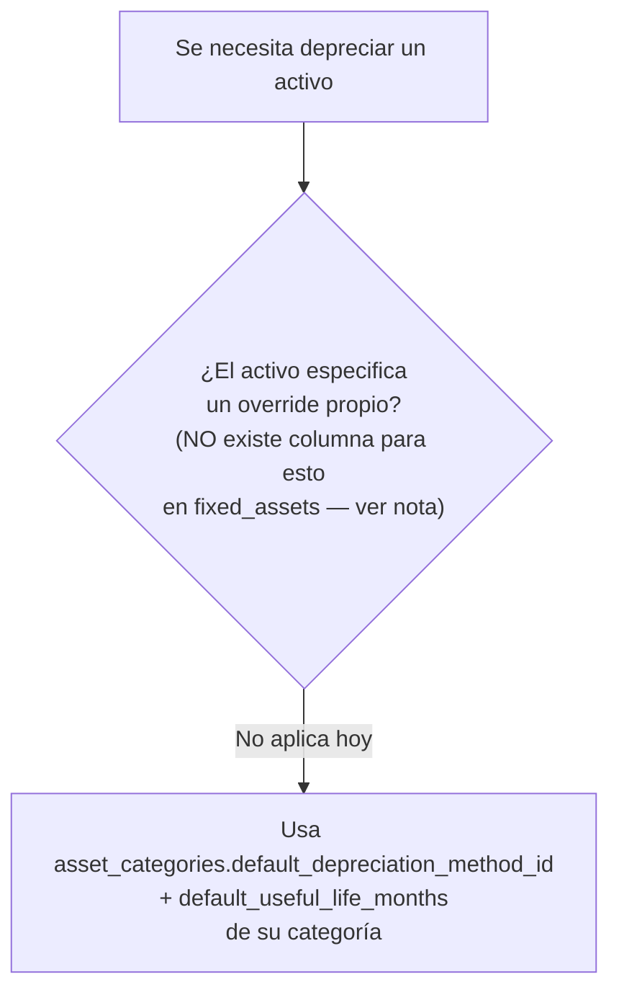
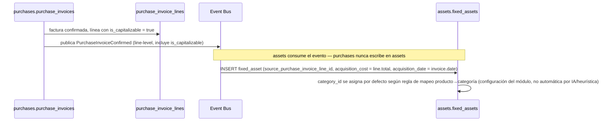
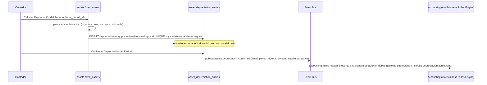
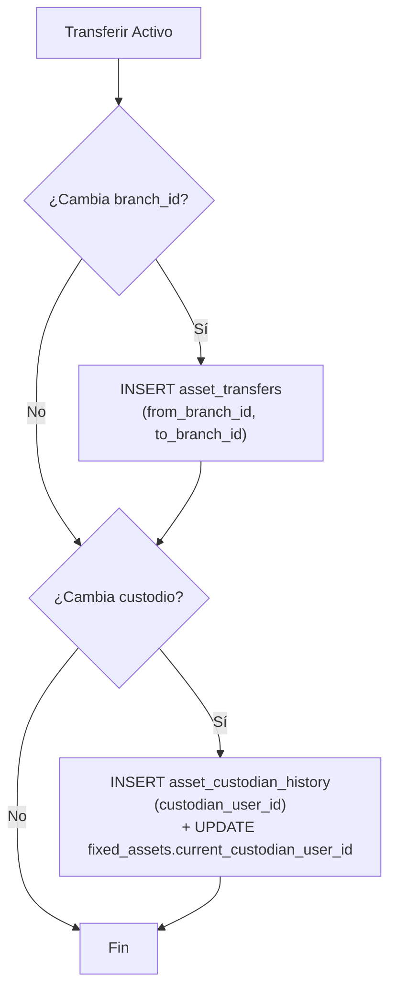

# 37 — Módulo Activos Fijos (diseño completo)

> Versión 1.0 — 2026-07-13. Primero de los 4 módulos de negocio
> pendientes que la
> [Fase 6](./36-modulos-de-negocio-plan-de-implementacion-fase-6.md §3)
> señaló sin diseñar — se aborda en el orden ya sugerido por
> [00-roadmap-fases.md](../00-roadmap-fases.md) (Activos Fijos primero,
> por ser el más referenciado desde módulos ya completos). Mismo
> criterio que el resto de documentos de módulo: sin tablas nuevas
> salvo un índice de integridad agregado (§3) — verificado completo
> contra [sql/18_assets.sql](../database/sql/18_assets.sql) (10
> tablas). Sin código.
>
> **Corrección encontrada al verificar:** tanto
> [00-indice-maestro.md](../00-indice-maestro.md) como
> [00-roadmap-fases.md](../00-roadmap-fases.md) afirman que este módulo
> ya estaba "referenciado desde... `hr.employee_asset_assignments`
> ([25-modulo-hr.md](./25-modulo-hr.md))" — se verificó contra el texto
> real de `25-modulo-hr.md` y **esa referencia no existe**: el
> documento nunca menciona `employee_asset_assignments`, solo tiene una
> mención genérica de paso a "activos asignados" sin diseño de flujo.
> Se corrige acá (§7) y se agrega la referencia real que faltaba en
> `25-modulo-hr.md`.

## 0. Alcance

| Elemento                                                                                                                          | Dueño real                                    | Nota                                                                                                                                                                                                       |
| --------------------------------------------------------------------------------------------------------------------------------- | --------------------------------------------- | ---------------------------------------------------------------------------------------------------------------------------------------------------------------------------------------------------------- |
| Categorías, Métodos de Depreciación, Activos Fijos, Depreciación, Mantenimientos, Transferencias, Custodios, Revaluaciones, Bajas | `assets`                                      | ✅ Los 10 conceptos pedidos son de este módulo                                                                                                                                                             |
| **La decisión de qué compra se capitaliza**                                                                                       | `purchases`                                   | **No** — `purchase_invoice_lines.is_capitalizable` ya es quien decide, `assets` solo reacciona (§2)                                                                                                        |
| **El asiento contable de depreciación/baja/revaluación**                                                                          | `accounting`                                  | **No** — `assets` publica eventos, nunca escribe en `accounting.journal_entries` (§9), mismo patrón módulo-dueño de todo el sistema                                                                        |
| **Aprobación de una baja o revaluación**                                                                                          | Genérico (`core.approvals`/`Approval Engine`) | **No** es una columna propia de `assets` — mismo criterio ya fijado en `21-modulo-purchases.md §1` para requisiciones (§8)                                                                                 |
| **Equipos bajo servicio**                                                                                                         | Resuelto sin FK — ver §10                     | El catálogo de módulos prometía esta relación; al diseñar `servicios` se determinó que son 2 conceptos independientes (mantenimiento propio vs. equipo de cliente) y se corrigió el catálogo, no el schema |

## 1. Categorías de Activos y Métodos de Depreciación (`asset_categories` + `depreciation_methods`)

`depreciation_methods` es catálogo global de 2 valores fijos por
`CHECK` (`straight_line`, `declining_balance`) — no requiere alta de
usuario, se siembra con el sistema (mismo criterio que
`configuration.payment_forms`,
[14-modulo-core.md §15](./14-modulo-core.md#15-payment-methods-configurationpayment_forms--payment_methods--banks--dueño-real-configuration)).
`asset_categories` sí es editable por company (`company_id NOT NULL`,
a diferencia de `depreciation_methods` donde es la columna universal
opcional) — cada categoría fija un `default_depreciation_method_id` y
`default_useful_life_months` que un activo puede heredar o
sobreescribir individualmente (`fixed_assets` no tiene sus propias
columnas de método/vida útil — ver §2, es una omisión real del schema
que se resuelve con una regla de aplicación, no con una columna
nueva).

**Regla de resolución de método/vida útil de un activo** (no existía
documentada — el schema no tiene estas columnas en `fixed_assets`
directamente):



**Nota de gap real:** el schema actual **no** permite que un activo
individual tenga un método o vida útil distinto al de su categoría —
`fixed_assets` no tiene `depreciation_method_id` ni `useful_life_months`
propios. Para la mayoría de bienes esto es correcto (dos laptops de la
misma categoría deprecian igual), pero es una limitación real para
casos legítimos (un vehículo específico con vida útil distinta al
resto de "Vehículos" por su uso real). Se documenta como limitación
conocida, no se agrega columna nueva sin confirmar que el caso de uso
lo justifica — la categoría ya cubre el caso general.

## 2. Activos Fijos (`fixed_assets`) — alta manual y alta desde compra

Entidad central del módulo. `acquisition_cost` + `acquisition_date`
inmutables tras el alta (cambiar el costo de adquisición después
invalidaría toda la depreciación ya calculada — un ajuste real de
valor pasa por `asset_revaluations`, §7, nunca por editar
`acquisition_cost` directamente, mismo principio que
`functional_currency_code` en `core.companies`,
[14-modulo-core.md §1](./14-modulo-core.md#1-companies-corecompanies--dueño-real-core)).

**Flujo de alta desde compra** (conecta `purchases.is_capitalizable`
con la creación real del activo — no existía documentado en ningún
lado, era solo una FK sin flujo):



**Alta manual** (activo que no viene de una compra —ej. aporte de
capital, activo heredado de una migración de otro sistema): mismo
INSERT sin `source_purchase_invoice_line_id` (columna ya nullable en
el schema real, sin cambio necesario).

**Umbral de capitalización — aclaración del gap encontrado contra el
menú:** `docs/menus/17-activos-fijos.md` promete un parámetro
"Umbral mínimo de activación" configurable. El schema **no** tiene
una columna de umbral en ningún lado — la decisión de capitalizar
sigue siendo 100% manual vía `purchase_invoice_lines.is_capitalizable`
(diseño ya fijado en `21-modulo-purchases.md §5`, no se cambia acá).
El umbral del menú se resuelve como un `system_parameter` de
`Settings` ([14-modulo-core.md §3](./14-modulo-core.md#3-settings-coresystem_settings--system_parameters--feature_flags--dueño-real-core)) —
un valor de referencia que la UI de `purchases` usa para **sugerir**
marcar `is_capitalizable = true` cuando el monto de la línea lo supera
(advertencia, no bloqueo), sin convertirse en una regla de base de
datos. Esto reconcilia la promesa del menú sin tocar el diseño ya
cerrado de Purchases.

`current_custodian_user_id` se fija en el alta (responsable inicial,
normalmente quien solicitó la compra o un valor por defecto de
"almacén/sin asignar") y cambia exclusivamente vía el flujo de §6.

## 3. Depreciación (`asset_depreciation_entries`) — cálculo y confirmación por período

**Gap real corregido:** el schema no tenía restricción que impidiera
dos entradas de depreciación para el mismo activo en el mismo período
— se agregó `UNIQUE(asset_id, fiscal_period_id) WHERE deleted_at IS
NULL` en `sql/18_assets.sql`. Sin esto, correr el cálculo de
depreciación dos veces por error para el mismo período duplicaría el
gasto.

**Cálculo** (por `depreciation_methods.code`, aplicando
`asset_categories.default_useful_life_months` de la categoría del
activo, §1):

- `straight_line`: `acquisition_cost / default_useful_life_months` por
  mes, constante durante toda la vida útil.
- `declining_balance`: porcentaje fijo aplicado sobre el valor neto en
  libros (`acquisition_cost - depreciación acumulada`) del período
  anterior, no sobre el costo de adquisición original — decrece cada
  período.

**Flujo de cierre de depreciación por período** (dos pasos separados,
"calcular" y "confirmar", tal como ya lo anticipa el menú):



**Candidato a particionamiento (gap real cerrado en esta pasada):**
`asset_depreciation_entries` es una tabla de hechos append-only que
crece con activos×períodos — mismo patrón que
`accounting.journal_entries`, que ya está particionada. Se agregó a
[07-estrategia-particionamiento.md §1](../database/07-estrategia-particionamiento.md#1-qué-se-particiona-y-qué-no)
(`RANGE` anual, alineado a ejercicio fiscal) y a
`sql/29_partitioning.sql`, con `PARTITION BY RANGE (created_at)`
declarado correctamente desde el `CREATE TABLE` (no arrastra el gap ya
conocido de `audit_logs`/`system_logs`, que sí necesitan retrofit —
ver la nota de ese mismo archivo).

## 4. Estado operativo de un activo — vista derivada, sin columna nueva

**Gap real encontrado:** `fixed_assets` no tiene columna de estado —
solo el `is_active` universal. Se resuelve con una vista, mismo patrón
ya usado en el sistema para estado derivado (`v_kardex` en inventario,
`v_treasury_position` en tesorería) en vez de agregar una columna que
duplicaría información ya inferible:

```sql
-- candidato para 24_views.sql
CREATE VIEW assets.v_fixed_asset_status AS
SELECT
    fa.id,
    fa.name,
    CASE
        WHEN EXISTS (
            SELECT 1 FROM assets.asset_disposals d
            WHERE d.asset_id = fa.id AND d.deleted_at IS NULL
        ) THEN 'dado_de_baja'
        ELSE 'en_servicio'
    END AS estado
FROM assets.fixed_assets fa
WHERE fa.deleted_at IS NULL;
```

**Regla de negocio (nueva):** confirmar una baja (§8) es lo único que
hace que un activo deje de estar "en servicio" — la aplicación fija
`fixed_assets.is_active = false` en el mismo paso que confirma la
baja, dentro de la misma transacción (`Unit of Work`,
[32-core-platform/09 §2-3](./32-core-platform/09-base-transaccional-y-modelado-ddd.md)),
nunca como una operación separada que pueda quedar desincronizada. No
se modela "en mantenimiento" como estado bloqueante — un mantenimiento
(§5) es un evento histórico sobre un activo que sigue en servicio, no
una transición de estado (decisión de alcance: el menú no pide
bloquear operaciones sobre un activo en mantenimiento, solo
reportarlas).

## 5. Mantenimientos (`asset_maintenances` + `asset_maintenance_types`)

Bitácora de trabajo realizado — **no** es un estado del activo (§4).
`asset_maintenance_types` es catálogo global de 2 valores
(`preventive`, `corrective`). `cost` es nullable (un mantenimiento en
garantía o interno sin costo directo es válido). No tiene columna de
fecha propia más allá del `created_at` universal — suficiente porque
un mantenimiento se registra al momento de ocurrir, no se programa a
futuro (no hay concepto de "orden de mantenimiento pendiente" en el
schema, solo el registro de uno ya realizado — el menú lo llama "Orden
de Mantenimiento" pero el modelo de datos es de bitácora, no de
programación; si se confirma necesidad real de mantenimiento
preventivo _programado_ con fecha futura y recordatorio, es una
extensión de schema real, mismo criterio que otras notas de alcance de
este documento).

## 6. Transferencias y Custodios (`asset_transfers` + `asset_custodian_history`)

**Gap real aclarado:** el comentario de `asset_transfers` dice
"cambio de ubicación/**responsable**" pero sus columnas solo cubren
ubicación (`from_branch_id`/`to_branch_id`) — no tiene columna de
custodio. El cambio de responsable vive en la tabla separada
`asset_custodian_history`. No es un error del schema, es un
modelo de dos tablas para dos ejes independientes que **pueden
cambiar juntos o por separado** — se documenta acá cómo se orquestan
juntas cuando la operación de negocio "Transferir Activo" del menú
cambia ambos a la vez:



`fixed_assets.current_custodian_user_id` es el puntero autoritativo al
responsable actual (lectura rápida sin agregar sobre el historial);
`asset_custodian_history` es append-only, sin columna de vigencia
(`assigned_until`) — determinar quién fue custodio en una fecha
pasada requiere ordenar por `created_at`, suficiente para el caso de
uso actual (auditoría, no consulta frecuente de "quién tenía este
activo el día X").

## 7. Revaluaciones (`asset_revaluations`)

`approved_by_user_id NOT NULL` — a diferencia de `asset_disposals`
(§8), esta tabla **sí** exige un aprobador en su propia columna. No se
cambia (sería inconsistente rediseñar algo que ya funciona), pero se
señala la asimetría real frente a Bajas en §8, donde se resuelve
distinto. No tiene `previous_value` propio — se deriva comparando
contra `acquisition_cost` o la revaluación anterior (misma entidad,
orden por `created_at`), no se duplica el dato.

**Evento publicado:** `assets.revaluation_approved` (§9).

## 8. Bajas (`asset_disposals`) — venta, donación o desecho

**Gap real 1 — asimetría con Revaluaciones:** a diferencia de
`asset_revaluations`, `asset_disposals` no tiene columna de aprobador,
aunque el menú (`docs/menus/17-activos-fijos.md`, config "Requiere
aprobación para baja") sí espera una aprobación. Se resuelve con el
mecanismo genérico, no con una columna nueva — mismo criterio ya
fijado para requisiciones de compra
([21-modulo-purchases.md §1](./21-modulo-purchases.md#1-solicitudes-purchase_requisitions--purchase_requisition_lines)):
`core.approvals` polimórfico
(`entity_type='assets.asset_disposal'`, `entity_id`), resuelto por
`Approval Engine`
([32-core-platform/05 §5](./32-core-platform/05-motores-de-logica-de-negocio.md#5-approval-engine)).
La baja se crea en estado implícito "pendiente" (sin fila en
`core.approvals` resuelta) y solo dispara sus efectos (§4, §9) cuando
la aprobación resuelve positivo — **si `Approval Engine` no está
configurado para este tipo de entidad, el sistema no exige aprobación**
(consistente con que el schema no la fuerza a nivel de columna).

**Gap real 2 — `residual_value` ambiguo para el caso `'sale'`:** la
columna conflaría "valor contable residual" (lo que quedaba por
depreciar) con "monto efectivamente recibido por la venta" — son
conceptos distintos que hoy comparten una sola columna. **Decisión de
alcance:** `residual_value` se usa exclusivamente como el valor
contable residual (necesario para calcular la ganancia/pérdida en
libros al dar de baja, sin importar el tipo de baja). El monto de
dinero efectivamente cobrado por una venta de activo **no** se modela
en `assets` — es una venta real, y como tal pasa por el flujo normal
de `ventas`/`caja`/`bancos` ya diseñado, referenciando la baja del
activo por `metadata` o por una nota en `observations` (columnas
universales) si se necesita trazabilidad cruzada, sin duplicar el
concepto de "documento de cobro" dentro de `assets`. Esto evita que
`assets` reinvente lo que `ventas`/`caja` ya hacen mejor.

**Evento publicado:** `assets.disposal_confirmed` (§9), y — dentro de
la misma unidad de trabajo — `fixed_assets.is_active = false` (§4).

## 9. Integración con Contabilidad — códigos de evento (no estaban definidos)

`22-modulo-accounting.md §3` ya diseña el mecanismo genérico
(`accounting_rules` mapea un `event_code` a una plantilla de asiento
débito/crédito vía `amount_formula`) y menciona `assets` como uno de
los módulos emisores, pero sin nombrar los eventos concretos. Se
definen acá, siguiendo la misma convención `<módulo>.<evento>` ya
usada (`'sales.invoice_confirmed'`):

| `event_code`                    | Disparado por                                    | Plantilla de asiento esperada                                                                    |
| ------------------------------- | ------------------------------------------------ | ------------------------------------------------------------------------------------------------ |
| `assets.depreciation_confirmed` | §3, confirmar depreciación de período            | Débito gasto de depreciación / Crédito depreciación acumulada                                    |
| `assets.disposal_confirmed`     | §8, resolución positiva de la aprobación de baja | Débito depreciación acumulada + (pérdida si aplica) / Crédito activo bruto                       |
| `assets.revaluation_approved`   | §7, `asset_revaluations` con aprobador           | Débito o crédito activo (según dirección del ajuste) / Crédito o débito superávit de revaluación |

La configuración exacta de cada `accounting_rule`/`accounting_rule_lines`
(qué cuenta contable de `chart_of_accounts` corresponde) es
configuración de datos por company, no una decisión de arquitectura —
mismo alcance que el resto de `accounting_rules` ya diseñadas.

## 10. Relación con Servicios — resuelta al diseñar `servicios` (actualización)

**Actualización 2026-07-13:** al diseñar
[39-modulo-services.md](./39-modulo-services.md) (siguiente módulo en
la cola de la Fase 6) se determinó que la colaboración que
`04-catalogo-modulos-negocio.md` prometía ("`servicios` (equipos bajo
servicio)") describía dos conceptos que en realidad **no necesitan
conectarse por FK**: el mantenimiento del activo propio de la empresa
ya está completo en §5 de este documento
(`assets.asset_maintenances`, interno, no facturable), mientras que
`services.equipment` modela el equipo **del cliente** bajo servicio
pagado — dos flujos de negocio distintos que cada uno ya tiene su
mecanismo completo, sin que uno dependa del otro. La fila del catálogo
de módulos se corrigió para no seguir prometiendo una relación que no
correspondía — ver
[39-modulo-services.md §4](./39-modulo-services.md#4-equipos-bajo-servicio--dos-conceptos-que-no-se-conectan-a-propósito)
para el razonamiento completo. No se agregó ninguna columna nueva a
`assets.*`.

## 11. Trazabilidad

| Punto solicitado                    | Dueño real                | Novedad de este documento                                                                                                     |
| ----------------------------------- | ------------------------- | ----------------------------------------------------------------------------------------------------------------------------- |
| Categorías, Métodos de Depreciación | `assets`                  | Regla de resolución método/vida útil + limitación conocida de override por activo (§1)                                        |
| Activos Fijos                       | `assets`                  | Flujo de alta desde compra (antes solo era una FK sin flujo) + aclaración del umbral de capitalización del menú (§2)          |
| Depreciación                        | `assets`                  | Cálculo por método, flujo calcular→confirmar→evento, `UNIQUE` agregado (gap real), particionamiento agregado (§3)             |
| Estado de un activo                 | `assets`                  | Vista derivada nueva (`v_fixed_asset_status`) — no existía ningún mecanismo de estado (§4)                                    |
| Mantenimientos                      | `assets`                  | Aclaración: bitácora, no estado bloqueante (§5)                                                                               |
| Transferencias, Custodios           | `assets`                  | Orquestación de las 2 tablas para la operación combinada del menú (§6)                                                        |
| Revaluaciones                       | `assets`                  | Asimetría de aprobador frente a Bajas, señalada (§7)                                                                          |
| Bajas                               | `assets`                  | Aprobación vía mecanismo genérico (no columna nueva) + deslinde de `residual_value` vs. monto de venta real (§8)              |
| Integración con Contabilidad        | `accounting` (consumidor) | 3 `event_code` definidos, no existían (§9)                                                                                    |
| Relación con Servicios              | Resuelto                  | Al diseñar `servicios` se confirmó que no hace falta FK — son 2 conceptos independientes, catálogo de módulos corregido (§10) |
