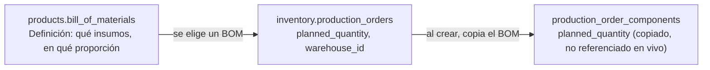
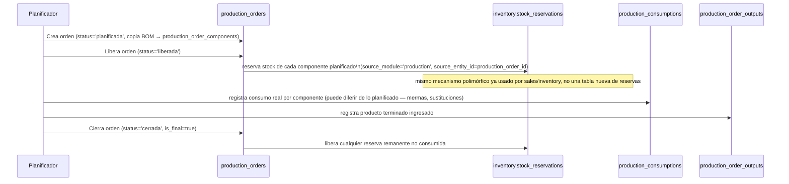

# 38 — Módulo Producción (diseño completo)

> Versión 1.0 — 2026-07-13. Segundo de los 4 módulos pendientes de la
> [Fase 6](./36-modulos-de-negocio-plan-de-implementacion-fase-6.md §3),
> en el orden ya sugerido por
> [00-roadmap-fases.md](../00-roadmap-fases.md). A diferencia de
> [37-modulo-assets.md](./37-modulo-assets.md), acá el hueco entre lo
> prometido (`docs/menus/13-produccion.md`,
> [04-catalogo-modulos-negocio.md](./04-catalogo-modulos-negocio.md))
> y lo que el schema real soporta es **mucho más grande** — se señala
> con la misma disciplina que ya se aplicó a Taxes en la Fase 4 y a
> LDAP/AD en la Fase 3: no se diseña de forma especulativa lo que no
> tiene modelo de datos real. Sin tablas nuevas salvo un índice de
> integridad y particionamiento agregados (§1, §4) — verificado
> completo contra las tablas de manufactura de
> [sql/05_products.sql](../database/sql/05_products.sql) y
> [sql/06_inventory.sql](../database/sql/06_inventory.sql). Sin
> código.

## 0. Alcance — qué de lo pedido tiene modelo de datos real y qué no

| Elemento (según `04-catalogo-modulos-negocio.md`/menú)             | ¿Tabla real?                                                                                                            | Este documento                                   |
| ------------------------------------------------------------------ | ----------------------------------------------------------------------------------------------------------------------- | ------------------------------------------------ |
| Listas de Materiales (BOM) / Recetas                               | ✅ `products.bill_of_materials`/`bom_components`/`recipes`/`recipe_ingredients`                                         | Diseñado en §1                                   |
| Órdenes de Producción (planificar→liberar→ejecutar→cerrar)         | ✅ `inventory.production_orders` + 5 tablas asociadas                                                                   | Diseñado en §2-5                                 |
| Costo de producción hacia Contabilidad                             | ✅ (mecanismo genérico ya existe, faltaban los `event_code`)                                                            | Diseñado en §6                                   |
| **Rutas de Fabricación (Routing)**                                 | ❌ **No existe tabla**                                                                                                  | **No se diseña — §7**                            |
| **Centro de Trabajo**                                              | ❌ **No existe tabla**, aunque `04-catalogo-modulos-negocio.md` lo lista como entidad propia de `produccion`            | **No se diseña — §7**                            |
| **MRP (Cálculo de Requerimiento de Materiales)**                   | ❌ **No existe tabla ni mecanismo**                                                                                     | **No se diseña — §7**                            |
| **Control de Calidad** (Plan de Inspección, Aprobar/Rechazar Lote) | ❌ **No existe tabla**                                                                                                  | **No se diseña — §7**                            |
| **Requisición de Materiales como documento propio**                | ❌ No hay tabla dedicada — el mecanismo real es `production_order_components` (planificado) + `stock_reservations` (§3) | Aclarado en §3, no se inventa un documento nuevo |

**Por qué esta tabla existe:** `docs/menus/13-produccion.md` promete un
schema completo `produccion.*` (`produccion.bom`, `produccion.ruta`,
`produccion.centro_trabajo`, `produccion.plan_inspeccion`...) que
**no existe en ningún lado del schema real** — no es un caso de "está
mal documentado en otro archivo", es contenido que nunca tuvo tabla.
Diseñar Routing/Centro de Trabajo/MRP/Calidad ahora sería inventar
~10 tablas nuevas sin que nadie haya confirmado la necesidad de
negocio real (¿la fábrica que va a usar GORAZUS necesita rutas de
fabricación con tiempos estándar por operación, o alcanza con "esta
orden consume estos insumos y produce este producto terminado"?) —
exactamente el tipo de diseño especulativo que la gobernanza del
proyecto ya evita en otros casos
([11-gobernanza-y-adrs.md §1](./11-gobernanza-y-adrs.md#1-cómo-se-agrega-un-módulo-nuevo)).
Este documento diseña completo lo que **sí** tiene modelo de datos:
manufactura simple por BOM (consumo de insumos → producto terminado),
que ya cubre el caso de uso central de "fabricar algo a partir de
otras cosas".

## 1. Listas de Materiales — BOM y Recetas (`products.bill_of_materials` + `bom_components`, `recipes` + `recipe_ingredients`)

Ya comparadas contra Kit/Combo en
[18-modulo-products.md §11.1](./18-modulo-products.md#111-kit-vs-combo-vs-bom-vs-receta--comparación-que-no-existía)
— la diferencia de fondo (BOM/Receta generan transformación física
real vía `production_orders`, Kit/Combo no) ya está resuelta ahí, no
se repite acá.

**Gap real corregido:** `bom_components` no tenía restricción que
impidiera el mismo componente duplicado dentro de un mismo BOM — se
agregó `UNIQUE(bom_id, component_product_id) WHERE deleted_at IS NULL`
en `sql/05_products.sql` (mismo criterio que el `UNIQUE` agregado en
`37-modulo-assets.md §3` para depreciación).

**BOM vs. Receta — cuándo usar cada una** (no estaba explicitado como
regla de decisión, solo como comparación de columnas): `recipes` se
usa cuando el rendimiento (`yield_quantity`) es variable o el producto
final es medido en una unidad distinta a la de los insumos (kg de
insumo → porciones de producto, típico de alimentos); `bill_of_materials`
se usa cuando la relación insumo→producto es 1:1 determinística
(`output_quantity` fijo, típico de manufactura discreta — ensamblar N
unidades de un mueble a partir de tornillos+madera+bisagras en
proporción fija). Un `product_id` tiene **uno u otro**, nunca ambos —
no hay ambigüedad de cuál aplica porque `product_type = 'composite'`
es el mismo valor para los dos casos y la tabla concreta (`bill_of_materials`
vs. `recipes`) ya lo distingue por FK.

## 2. De BOM a Orden de Producción

**Por qué se copia el BOM en vez de referenciarlo en vivo** (decisión
de diseño, no estaba explicitada): si el BOM cambia después de crear
la orden (una nueva versión con otra proporción de insumos), las
órdenes ya planificadas no deben cambiar retroactivamente — mismo
principio ya aplicado en todo el sistema para documentos confirmados
(p. ej. una factura no cambia si el precio de lista del producto
cambia después). `production_order_components.planned_quantity` es el
snapshot al momento de crear la orden.

## 3. Ciclo de vida de la Orden de Producción (`production_order_status` + `_status_history`)

Mismo patrón `_status`/`_status_history` que el resto del sistema
(`02-modelo-logico.md §1.1`) — catálogo editable por company (no
`CHECK` fijo, a diferencia de `assets.depreciation_methods`), con
`is_final` marcando qué estados cierran la orden.

**Aclaración del gap de "Requisición de Materiales" del menú:** el
menú promete un documento separado "Requisición de Materiales" con su
propio `produccion.requisicion`. No existe esa tabla — el mecanismo
real es exactamente la reserva de stock (`stock_reservations`,
polimórfica, ya diseñada en
[19-modulo-inventory.md](./19-modulo-inventory.md)) disparada al
liberar la orden, más el registro de consumo real
(`production_consumptions`) al ejecutar. No se crea un documento
nuevo — el flujo de arriba ya resuelve la necesidad de negocio
("reservar/consumir insumos para una orden") sin duplicar lo que
`inventory` ya hace.

## 4. Consumo real vs. planificado (`production_consumptions` vs. `production_order_components`)

Comparar ambas tablas por `(production_order_id, component_product_id)`
da la varianza de consumo (merma, sustitución, error de planificación)
— el reporte "Consumo Real vs. Estándar (BOM)" que promete el menú se
resuelve con esta comparación, **sin** necesitar una tabla de mermas
separada (otro ítem que el menú prometía sin tabla propia — se
resuelve leyendo la diferencia, no registrándola aparte).

**Candidato a particionamiento (gap real cerrado en esta pasada):**
`production_consumptions` es una tabla de hechos append-only de
volumen de ejecución (una fila por componente consumido, por orden) —
mismo perfil que `inventory.stock_movements`, ya particionada. Se
agregó a
[07-estrategia-particionamiento.md §1](../database/07-estrategia-particionamiento.md#1-qué-se-particiona-y-qué-no)
(`RANGE` mensual, no anual — es volumen de ejecución, no un corte
fiscal) y a `sql/29_partitioning.sql`, con `PARTITION BY RANGE
(created_at)` declarado correctamente desde el `CREATE TABLE`.

## 5. Ingreso de producto terminado y costeo (`production_order_outputs`)

`production_order_outputs.quantity` es lo que efectivamente entra a
`inventory.stock` del `warehouse_id` de la orden — mismo mecanismo de
`fn_apply_stock_movement` ya diseñado
([19-modulo-inventory.md](./19-modulo-inventory.md)), la producción
terminada es un movimiento de entrada como cualquier otro, con
`source_module='production'`.

**Método de costeo — reconciliando la configuración que promete el
menú** ("Absorción estándar vs. costo real"): el schema no tiene una
columna de costo unitario en `production_order_outputs` — el costo del
producto terminado se resuelve con el **mismo mecanismo FIFO/Promedio
ya diseñado en `inventory`**
([19-modulo-inventory.md](./19-modulo-inventory.md)), no uno nuevo:

- **Costo real (por defecto, consistente con el resto del sistema):**
  el costo del producto terminado es la suma del costo de cada
  componente efectivamente consumido (`production_consumptions`,
  costeado por FIFO/Promedio de cada insumo, según la política de
  costeo ya vigente para ese producto) — sin tabla ni columna nueva.
- **Costo estándar:** usar `bill_of_materials`/`bom_components` a
  costo de lista en vez de costo real consumido — variación
  registrada como diferencia contra el costo real, consumida por
  `accounting` (§6). El schema soporta esto sin cambios porque el
  costo estándar se calcula, no se almacena — es responsabilidad de
  aplicación, no de una columna nueva.

## 6. Integración con Contabilidad — códigos de evento (no estaban definidos)

`22-modulo-accounting.md §3` nunca nombra `produccion` como módulo
emisor de eventos, a pesar de que
`04-catalogo-modulos-negocio.md` ya promete la colaboración
("`contabilidad` (costo de producción)"). Se define acá, mismo
criterio que `37-modulo-assets.md §9`:

| `event_code`                   | Disparado por                                                                             | Plantilla de asiento esperada                                                                                                    |
| ------------------------------ | ----------------------------------------------------------------------------------------- | -------------------------------------------------------------------------------------------------------------------------------- |
| `production.order_closed`      | §3, cierre de una orden de producción                                                     | Débito inventario de producto terminado / Crédito inventario de materia prima consumida (traspaso de valor, no gasto ni ingreso) |
| `production.variance_recorded` | §5, diferencia entre costo estándar y costo real (solo si la company usa costeo estándar) | Débito o crédito "Variación de Producción" según signo de la diferencia                                                          |

## 7. Explícitamente no diseñado — requiere confirmar necesidad de negocio

Routing (rutas de fabricación con operaciones y tiempos estándar),
Centro de Trabajo (capacidad, OEE), MRP (cálculo automático de
requerimiento de materiales cruzando demanda/stock/BOM) y Control de
Calidad (planes de inspección, aprobación/rechazo de lote) están
prometidos en `docs/menus/13-produccion.md` y, parcialmente, en
`04-catalogo-modulos-negocio.md`, pero **no tienen ni una tabla en el
schema real**. No se diseñan en este documento por la misma razón que
Taxes no se absorbió en la Fase 4 y LDAP/AD no se diseñó en la Fase 3:
son piezas de tamaño considerable (Control de Calidad y MRP en
particular son subsistemas propios, no un puñado de columnas) sin
necesidad de negocio confirmada todavía. Si la fábrica real que va a
operar sobre GORAZUS necesita alguno de estos —manufactura con rutas
de operación complejas, múltiples centros de trabajo con capacidad
limitada, o trazabilidad de calidad por lote—, es una extensión de
schema real que amerita su propio documento, no un agregado apurado
acá. Lo que este documento sí deja resuelto (BOM simple → orden →
consumo → producto terminado) cubre manufactura discreta o de
proceso simple sin esas capacidades.

## 8. Trazabilidad

| Punto solicitado                                    | Dueño real                                     | Novedad de este documento                                                                                   |
| --------------------------------------------------- | ---------------------------------------------- | ----------------------------------------------------------------------------------------------------------- |
| Listas de Materiales (BOM), Recetas                 | `products`                                     | `UNIQUE` agregado (gap real) + regla de decisión BOM vs. Receta (§1)                                        |
| Órdenes de Producción                               | `inventory`                                    | Flujo completo planificar→liberar→consumir→cerrar (antes solo tablas sin flujo) (§2-3)                      |
| Requisición de Materiales                           | No es tabla propia                             | Aclaración: se resuelve con `stock_reservations` + `production_consumptions`, no un documento nuevo (§3)    |
| Consumo Real vs. Estándar                           | `inventory`                                    | Comparación entre 2 tablas ya existentes + particionamiento agregado (§4)                                   |
| Costo de Producción                                 | `inventory` (cálculo) / `accounting` (asiento) | Método de costeo real vs. estándar resuelto sin columnas nuevas, reusando FIFO/Promedio de `inventory` (§5) |
| Integración con Contabilidad                        | `accounting` (consumidor)                      | 2 `event_code` definidos, no existían (§6)                                                                  |
| Routing, Centro de Trabajo, MRP, Control de Calidad | Pendiente de necesidad de negocio              | Señalado explícitamente, no diseñado (§7)                                                                   |
