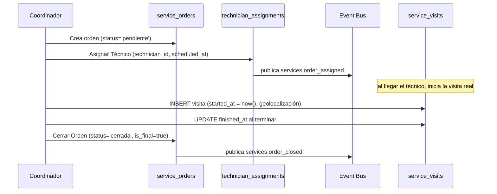
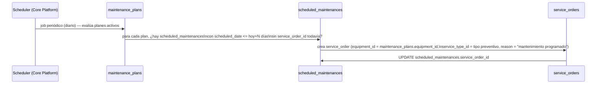

# 39 — Módulo Servicios (diseño completo)

> Versión 1.0 — 2026-07-13. Tercero de los 4 módulos pendientes de la
> [Fase 6](./36-modulos-de-negocio-plan-de-implementacion-fase-6.md §3),
> en el orden ya sugerido por
> [00-roadmap-fases.md](../00-roadmap-fases.md). Tamaño de gap
> intermedio entre [37-modulo-assets.md](./37-modulo-assets.md) (gaps
> puntuales) y [38-modulo-production.md](./38-modulo-production.md)
> (subsistemas enteros sin tabla) — acá no hay subsistemas fantasma,
> pero sí una tabla prometida que no existe (§8) y un gap de agenda
> real que se cierra con una columna nueva (§2). Verificado completo
> contra [sql/16_services.sql](../database/sql/16_services.sql) (18
> tablas + 1 columna agregada). Sin código.
>
> **Cierra un gap señalado desde Assets:**
> [37-modulo-assets.md §10](./37-modulo-assets.md#10-relación-con-servicios--resuelta-al-diseñar-servicios-actualización)
> dejó pendiente la relación "equipos bajo servicio" que
> `04-catalogo-modulos-negocio.md` prometía entre `activos-fijos` y
> `servicios`. Se resuelve en §4 — la conclusión es que **no hace
> falta FK nueva**, son dos conceptos de negocio distintos que ya
> tienen mecanismo propio completo.

## 0. Alcance

| Elemento                                                                                                                                           | Dueño real                      | Nota                                                                                                                                        |
| -------------------------------------------------------------------------------------------------------------------------------------------------- | ------------------------------- | ------------------------------------------------------------------------------------------------------------------------------------------- |
| Tipos/Motivos, Órdenes de Servicio, Técnicos, Equipos, Contratos/SLA, Mantenimiento Preventivo, Visitas, Reportes de Trabajo, Repuestos Consumidos | `services`                      | ✅ Los 18 conceptos del schema real                                                                                                         |
| **Garantías**                                                                                                                                      | `sales` (`sales.warranties`)    | **No** es de `services` — decisión de diseño ya fijada en el modelo lógico, `services` solo referencia por `warranty_id` (§8)               |
| **Repuestos en sí (catálogo, costo, stock)**                                                                                                       | `products`/`inventory`          | **No** — `service_parts_consumed` solo registra el consumo, la valorización usa el mecanismo FIFO/Promedio ya diseñado en `inventario` (§7) |
| **Mantenimiento de un activo fijo propio de la empresa**                                                                                           | `assets` (`asset_maintenances`) | **No** es de `services` — son conceptos distintos, ver §4                                                                                   |
| **El asiento contable del servicio facturado**                                                                                                     | `accounting`/`ventas`           | **No** — `services` publica eventos, `ventas` genera la factura, `accounting` el asiento (§9)                                               |

## 1. Tipos de Servicio, Motivos y Órdenes de Servicio (`service_types` + `service_order_reasons` + `service_orders`)

`service_types` fija `standard_duration_minutes` (tiempo estándar
esperado por tipo — insumo para SLA, §5) — catálogo editable por
company, no `CHECK` fijo (a diferencia de `assets.depreciation_methods`,
consistente con que "instalación", "mantenimiento preventivo",
"reparación" varían más entre negocios que "línea recta/saldos
decrecientes").

`service_orders.equipment_id` es **nullable** — una orden de servicio
no requiere necesariamente un equipo registrado (p. ej. un servicio de
consultoría o instalación de algo que todavía no existe como
`equipment` hasta que la orden lo crea). `warranty_id` también
nullable, referenciando `sales.warranties` — cuando el trabajo es por
reclamo de garantía, no se duplica información de la garantía acá,
solo se enlaza (decisión ya fijada en el modelo lógico, no se
rediseña).

`document_number` con `UNIQUE(branch_id, document_number)` —
`branch_id` es `NOT NULL` en esta tabla (a diferencia de la mayoría de
`services.*`, donde es opcional): una orden de servicio siempre se
emite desde una sucursal concreta, mismo criterio que
`configuration.numbering_series`
([14-modulo-core.md §9](./14-modulo-core.md#9-document-series-configurationnumbering_series--document_number_formats--dueño-real-configuration)).

## 2. Ciclo de vida de la Orden y Asignación de Técnico (`service_order_status`/`_status_history` + `technician_assignments`)

Mismo patrón `_status`/`_status_history` que el resto del sistema.

**Gap real cerrado — "Agenda de Técnico":** el menú
(`docs/menus/14-servicios.md`) promete una consulta "Agenda de
Técnico" pero `technician_assignments` no tenía ninguna columna de
fecha — solo vinculaba técnico↔orden sin decir _cuándo_. La única
fecha disponible en todo el módulo era `service_visits.started_at`,
que solo existe **después** de que la visita ya comenzó — inútil para
una agenda prospectiva. Se agregó `scheduled_at TIMESTAMPTZ` (nullable
— una asignación puede existir sin fecha planificada aún) a
`technician_assignments` en `sql/16_services.sql`.

"Agenda de Técnico" (reporte del menú) se resuelve consultando
`technician_assignments` filtrado por `technician_id` y rango de
`scheduled_at` — sin tabla nueva, solo la columna agregada.

## 3. Técnicos (`technicians`)

`employee_id` nullable ("ID suelto", sin FK real hacia `hr.employees`
según el comentario del schema) — un técnico no necesariamente es un
empleado interno, puede ser subcontratado (mismo espíritu que
`current_custodian_user_id` en `assets.fixed_assets` siendo opcional,
[37-modulo-assets.md §2](./37-modulo-assets.md#2-activos-fijos-fixed_assets--alta-manual-y-alta-desde-compra)) —
la relación con `suppliers` para técnicos subcontratados **no** existe
en el schema; si se confirma necesidad real de trackear qué proveedor
provee cada técnico externo, es una extensión de schema, no algo que
se infiera hoy.

## 4. Equipos bajo servicio — dos conceptos que no se conectan a propósito

**Gap heredado de Assets, resuelto acá:**
[37-modulo-assets.md §10 (versión original)](./37-modulo-assets.md#10-relación-con-servicios--resuelta-al-diseñar-servicios-actualización)
dejó pendiente por qué no existía FK entre `assets.fixed_assets` y
`services.equipment`, a pesar de que
`04-catalogo-modulos-negocio.md` prometía la colaboración "`servicios`
(equipos bajo servicio)". Al diseñar este módulo completo, la
respuesta es: **esa relación no describe un solo concepto, describe
dos, y cada uno ya tiene mecanismo propio completo:**

| Concepto                                                                                                          | Quién es el "equipo"                          | Mecanismo ya existente                                                                                                                                              | ¿Necesita `services`?                                              |
| ----------------------------------------------------------------------------------------------------------------- | --------------------------------------------- | ------------------------------------------------------------------------------------------------------------------------------------------------------------------- | ------------------------------------------------------------------ |
| Mantenimiento del activo propio de la empresa (una flota de vehículos, maquinaria interna)                        | Un `assets.fixed_assets` de la propia empresa | `assets.asset_maintenances` ([37-modulo-assets.md §5](./37-modulo-assets.md#5-mantenimientos-asset_maintenances--asset_maintenance_types)) — interno, no facturable | No — ya completo, sin depender de `services`                       |
| Servicio técnico pagado a un **cliente** sobre un equipo que el cliente posee (garantía, reparación, instalación) | Un `services.equipment` propiedad del cliente | `services.service_orders` (este documento) — externo, facturable                                                                                                    | No aplica a `assets` — el equipo nunca fue un activo de la empresa |

`services.equipment.customer_id` es `NOT NULL` — todo equipo en esta
tabla pertenece a un cliente, nunca a la propia empresa. No hay
escenario real donde un `fixed_asset` propio termine en
`services.equipment` sin cambiar de dueño legal (si la empresa vende
un activo usado a un cliente, eso ya pasa por `assets.asset_disposals`
tipo `'sale'`,
[37-modulo-assets.md §8](./37-modulo-assets.md#8-bajas-asset_disposals--venta-donación-o-desecho) —
a partir de ahí es un equipo de cliente, sin rastro necesario hacia el
`fixed_asset` original más allá de lo que la venta misma documente).

**Conclusión:** no se agrega ninguna columna a `assets.*` ni a
`services.*`. Se corrigió `04-catalogo-modulos-negocio.md` para que la
fila de `servicios` ya no prometa una colaboración con `activos-fijos`
que no correspondía.

## 5. Contratos, SLA y Mantenimiento Preventivo (`service_contracts` + `service_contract_types` + `sla_definitions` + `maintenance_plans` + `scheduled_maintenances`)

`service_contracts` ya está en la lista de entidades con auditoría de
snapshot completo
([05-estrategia-auditoria.md §3](../database/05-estrategia-auditoria.md#3-snapshot-completo-selectivo),
junto a `sales_contracts`) — decisión ya tomada, no se repite acá.

**Flujo de generación automática de órdenes desde un plan de
mantenimiento** (el menú lo promete como acción "Generar Órdenes de
Servicio Programadas" — no estaba documentado como flujo):

`frequency_days` en `maintenance_plans` genera las filas de
`scheduled_maintenances` con anticipación (mismo principio de
"premake" ya usado por `pg_partman` en particionamiento,
[29_partitioning.sql](../database/sql/29_partitioning.sql)) — no se
generan bajo demanda el mismo día, para que el Scheduler tenga margen
de crear la orden antes de la fecha comprometida.

`sla_definitions.response_time_hours`/`resolution_time_hours` — el
reporte "Cumplimiento de SLA" del menú se calcula comparando estos
valores contra `service_orders.created_at` (inicio del reloj) y
`service_visits.started_at` (primera respuesta) /
`service_orders` con `status.is_final=true` (resolución) — sin columna
adicional, es cálculo derivado.

## 6. Ejecución en campo (`service_visits` + `service_work_reports`)

`service_visits.latitude`/`longitude` — geolocalización de la visita
real (no de la orden ni del cliente), capturada al iniciar/finalizar.
`service_work_reports.customer_signature_file_id` referencia
`core.files` — la firma del cliente es un archivo gestionado por
`File Manager`
([32-core-platform/08 §3](./32-core-platform/08-frameworks-de-infraestructura.md#3-file-manager)),
no una columna de imagen propia — consistente con que ningún módulo de
negocio reimplementa gestión de archivos.

**Candidato a particionamiento (gap real cerrado en esta pasada):**
`service_visits` es una tabla de hechos de volumen de ejecución de
campo (una fila por visita). Se agregó a
[07-estrategia-particionamiento.md §1](../database/07-estrategia-particionamiento.md#1-qué-se-particiona-y-qué-no)
(`RANGE` mensual) y a `sql/29_partitioning.sql`, con `PARTITION BY
RANGE (created_at)` declarado correctamente desde el `CREATE TABLE`.

## 7. Repuestos consumidos (`service_parts_consumed`)

Mismo patrón que `production_consumptions`
([38-modulo-production.md §4](./38-modulo-production.md#4-consumo-real-vs-planificado-production_consumptions-vs-production_order_components)):
tabla de hechos append-only, sin `unit_cost`/`unit_price` propio — el
costo se resuelve con el mecanismo FIFO/Promedio ya diseñado en
`inventory`, no se duplica acá. El comentario del schema
("descontado de `inventory.stock`") confirma que el consumo dispara un
movimiento de inventario real
(`source_module='services'`, mismo mecanismo polimórfico que
`production` y `sales` ya usan), no un ajuste manual paralelo.

**Precio facturado al cliente vs. costo de repuesto:** distinto de
`service_parts_consumed` (que es costo interno) —
`service_order_lines.unit_price` es lo que se factura al cliente por
el repuesto/mano de obra (con margen), consumido por `ventas` al
generar la factura (§9). Dos columnas de precio en dos tablas
distintas, a propósito: costo real vs. precio de venta no son el mismo
número.

**Particionamiento (gap real cerrado):** mismo criterio que
`service_visits` (§6) — agregado a `07-estrategia-particionamiento.md`
y `29_partitioning.sql`, `RANGE` mensual.

## 8. Garantías — por qué `servicios.garantia` del menú no existe

`docs/menus/14-servicios.md` promete un formulario "Garantía de
Producto/Equipo" respaldado por una tabla `servicios.garantia` que
**no existe** — y no es un descuido: el modelo lógico de este módulo
declara explícitamente desde su primera línea que la garantía es
propiedad de `sales.warranties` (se emite al momento de la venta,
antes de que exista ninguna orden de servicio), y `services` solo la
referencia por `warranty_id` cuando el trabajo es un reclamo. Crear
una segunda tabla de garantías en `services` duplicaría una entidad ya
resuelta en otro schema — exactamente lo que la regla de
no-duplicación de
[01-modelo-conceptual §3](../database/01-modelo-conceptual.md#3-regla-de-no-duplicación-entre-módulos)
prohíbe. El formulario "Garantía de Producto/Equipo" del menú, de
construirse, edita `sales.warranties` — no es una pantalla propia de
`servicios` aunque el menú la liste ahí (la ubicación en el menú es
una decisión de navegación de UI, no de propiedad de datos).

## 9. Integración con Ventas y Contabilidad — códigos de evento (no estaban definidos)

`22-modulo-accounting.md` nunca nombra `services` como módulo emisor,
a pesar de que el menú promete "Factura automáticamente al cerrar
orden" (config del módulo) y `04-catalogo-modulos-negocio.md` ya
implica la colaboración vía `inventario` (repuestos, con costo real).
Se define acá, mismo criterio que `37-modulo-assets.md §9` y
`38-modulo-production.md §6`:

| `event_code`              | Disparado por                                  | Consumido por                                                                                                                                                                                                                                                                                                                                                                                                |
| ------------------------- | ---------------------------------------------- | ------------------------------------------------------------------------------------------------------------------------------------------------------------------------------------------------------------------------------------------------------------------------------------------------------------------------------------------------------------------------------------------------------------ |
| `services.order_assigned` | §2, asignación de técnico                      | `Notification Center` (avisa al técnico) — no llega a `accounting`                                                                                                                                                                                                                                                                                                                                           |
| `services.order_closed`   | §2, cierre de orden con `status.is_final=true` | `ventas` (genera factura a partir de `service_order_lines`, si la config "Factura automáticamente" está activa) → una vez facturado, `accounting` recibe el asiento por el mecanismo ya existente de `sales.invoice_confirmed`, **sin** necesitar un `event_code` contable propio de `services` — el costo de los repuestos consumidos (§7) ya llegó a `accounting` vía el movimiento de inventario estándar |

**Por qué no hace falta un tercer `event_code` contable propio de
`services`** (a diferencia de `assets`/`production`, que sí generan
asientos directos): el servicio se monetiza a través de una factura de
`ventas` — el asiento contable de esa factura ya está diseñado en
`22-modulo-accounting.md`, `services` no necesita un camino paralelo
hacia `accounting`. Esto es consistente con el patrón módulo-dueño: el
costo (repuestos) y el ingreso (factura) cada uno sigue el camino que
su módulo dueño respectivo ya define.

## 10. Trazabilidad

| Punto solicitado                         | Dueño real                                 | Novedad de este documento                                                                                         |
| ---------------------------------------- | ------------------------------------------ | ----------------------------------------------------------------------------------------------------------------- |
| Tipos/Motivos, Órdenes de Servicio       | `services`                                 | Reglas de `equipment_id`/`warranty_id` opcionales, `branch_id` obligatorio (§1)                                   |
| Ciclo de vida + Asignación de Técnico    | `services`                                 | `scheduled_at` agregado (gap real de "Agenda de Técnico") + flujo completo (§2)                                   |
| Técnicos                                 | `services`                                 | Aclaración de `employee_id` opcional / técnico subcontratado (§3)                                                 |
| Equipos bajo servicio                    | `services`                                 | Gap heredado de Assets resuelto: 2 conceptos independientes, sin FK nueva, catálogo de módulos corregido (§4)     |
| Contratos, SLA, Mantenimiento Preventivo | `services`                                 | Flujo de generación automática de órdenes desde plan (antes solo tablas sin flujo) (§5)                           |
| Ejecución en campo                       | `services`                                 | Particionamiento agregado (gap real) (§6)                                                                         |
| Repuestos consumidos                     | `services` (consumo) / `inventory` (costo) | Deslinde costo vs. precio facturado + particionamiento agregado (§7)                                              |
| Garantías                                | `sales` (no `services`)                    | Aclaración de por qué `servicios.garantia` del menú no tiene tabla — no es un gap, es una decisión ya tomada (§8) |
| Integración con Ventas/Contabilidad      | `ventas`/`accounting` (consumidores)       | 2 `event_code` definidos + explicación de por qué no hace falta un tercero contable directo (§9)                  |
