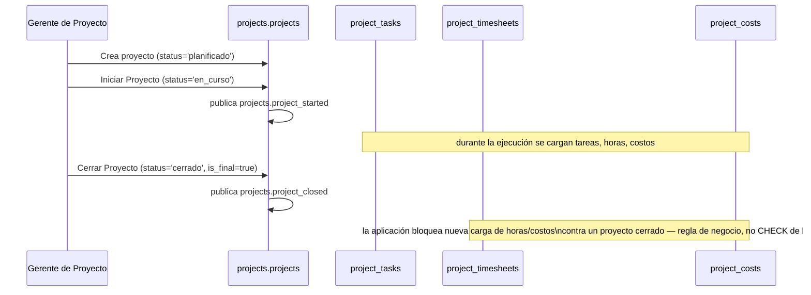
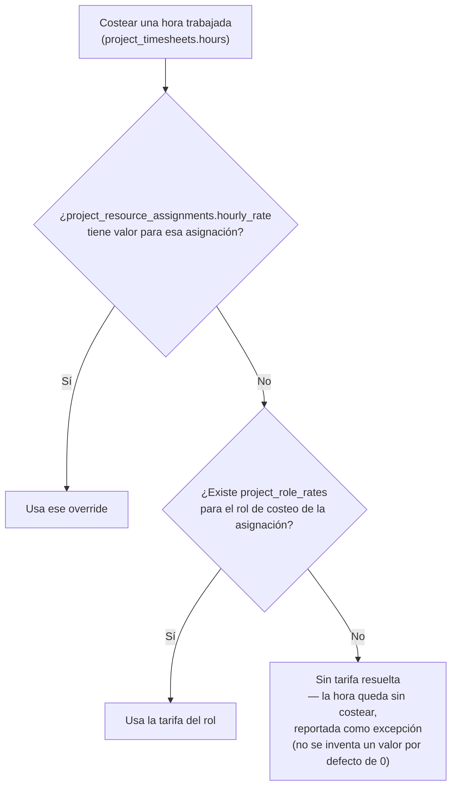

# 40 — Módulo Proyectos (diseño completo)

> Versión 1.0 — 2026-07-13. Último de los 4 módulos pendientes de la
> [Fase 6](./36-modulos-de-negocio-plan-de-implementacion-fase-6.md §3).
> A diferencia de los 3 anteriores, **ningún módulo ya completado le
> prometía nada a Proyectos** (verificado: cero menciones en
> `20-modulo-sales.md`, `21-modulo-purchases.md`, `25-modulo-hr.md`,
> `26-modulo-payroll.md`) — la dependencia es de una sola dirección,
> Proyectos consume de esos módulos, nunca al revés, consistente con
> `04-catalogo-modulos-negocio.md`. Tamaño de gap similar a
> [37-modulo-assets.md](./37-modulo-assets.md) (puntual, sin
> subsistemas fantasma) — 3 columnas + 1 tabla pequeña agregadas contra
> promesas reales del menú. Verificado completo contra
> [sql/17_projects.sql](../database/sql/17_projects.sql) (17 tablas
> tras esta pasada). Sin código.
>
> **Corrección de datos encontrada:** el modelo lógico
> ([logico/17-projects.md](../database/logico/17-projects.md))
> etiquetaba 3 relaciones como "(ID suelto)"
> (`project_resource_assignments.employee_id`,
> `project_costs.source_purchase_invoice_id`,
> `project_billing_milestones.invoice_id`) que en realidad **son**
> constraints `REFERENCES` reales en el SQL — corregido en el
> documento lógico, no es un cambio de diseño, solo de documentación
> exacta.

## 0. Alcance

| Elemento                                                                                                                                                      | Dueño real                  | Nota                                                                                                                                                                                                                              |
| ------------------------------------------------------------------------------------------------------------------------------------------------------------- | --------------------------- | --------------------------------------------------------------------------------------------------------------------------------------------------------------------------------------------------------------------------------- |
| Tipos de Proyecto, Proyectos, Tareas (WBS), Dependencias, Asignación de Recursos, Presupuestos, Partes de Horas, Costos, Planes/Hitos de Facturación, Riesgos | `projects`                  | ✅ Los 16 conceptos del schema real                                                                                                                                                                                               |
| **Tarifa horaria por defecto por rol**                                                                                                                        | `projects` (nuevo)          | ✅ `project_role_rates` agregada — cierra promesa real del menú sin tabla hasta ahora (§3)                                                                                                                                        |
| **Centro de costo del proyecto**                                                                                                                              | `accounting` (referenciado) | ✅ `projects.cost_center_id` agregada — cierra config del menú (§6)                                                                                                                                                               |
| **Fabricación bajo proyecto** (mencionado en el menú, vínculo con `produccion`)                                                                               | Pendiente                   | **No** se diseña — sin FK real en ningún lado, sin necesidad de negocio confirmada (§10)                                                                                                                                          |
| **La factura del hito en sí**                                                                                                                                 | `sales`                     | **No** es de `projects` — `project_billing_milestones.invoice_id` referencia la factura, `projects` no la genera directamente vía evento sino con una llamada síncrona (§8, decisión ya tomada por el menú, no de este documento) |
| **El asiento contable de costos/ingresos del proyecto**                                                                                                       | `accounting`                | **No** — ya llega por los caminos existentes de `sales`/`purchases`, `projects` no necesita un `event_code` contable propio (§10)                                                                                                 |

## 1. Tipos de Proyecto y Proyectos (`project_types` + `projects`)

`projects.customer_id` es **nullable** — un proyecto interno (p. ej.
una implementación propia, sin cliente facturable) es válido; solo los
proyectos con `project_billing_plans` necesitan `customer_id`
resuelto en la práctica (no forzado por `CHECK`, es una regla de
aplicación: no se puede generar un hito de facturación sin cliente,
pero el proyecto en sí puede existir sin uno).

`manager_user_id NOT NULL` — todo proyecto tiene un responsable desde
su creación, a diferencia de `current_custodian_user_id` en
`assets.fixed_assets` (opcional) — un proyecto sin responsable no
tiene sentido de negocio, un activo recién adquirido sí puede estar
temporalmente sin custodio asignado.

`total_budget` es un monto de referencia a nivel de cabecera —
distinto del desglose real por categoría en `project_budgets`/
`project_budget_lines` (§4). No se recalcula automáticamente desde las
líneas de presupuesto (evita que un cambio de línea sobreescriba
silenciosamente la cifra que el responsable fijó como techo).

## 2. Ciclo de vida (`project_status` + `project_status_history`)

Mismo patrón `_status`/`_status_history` que el resto del sistema.

**"Bloquea nueva carga de horas/costos" (config del menú):** no existe
`CHECK` en `project_timesheets`/`project_costs` que impida insertar
contra un proyecto cerrado — se aplica en la capa de servicio
(`Business Rules Engine` o validación directa consultando
`projects.status_id`), mismo criterio que otras reglas de "no permitir
X si el documento padre está en estado Y" ya resueltas así en el resto
del sistema (p. ej. `accounting.fn_prevent_unbalanced_posting` sí es
`CHECK` a nivel de trigger porque es una invariante contable dura;
esto es una regla de proceso, no de integridad, así que vive en
aplicación).

## 3. Recursos, Tarifas y Tareas (`project_tasks` + `project_task_dependencies` + `project_resource_assignments` + `project_role_rates`)

**Gap real cerrado — "Actualizar % de Avance de Tarea":**
`project_tasks` no tenía ninguna columna de avance físico, solo
`status_id` (pendiente/en curso/hecha) y fechas. Un estado de 3
valores no captura "esta tarea está 60% avanzada" — se agregó
`progress_percentage SMALLINT DEFAULT 0 CHECK (BETWEEN 0 AND 100)`.

**Gap real cerrado — "Tarifa horaria por defecto por rol":** ningún
lado del sistema (ni `projects`, ni `hr`, ni `payroll`) almacenaba una
tarifa de costeo por hora. Se resolvió en dos niveles, mismo espíritu
que `asset_categories.default_depreciation_method_id` (default de
categoría, con posibilidad de override puntual,
[37-modulo-assets.md §1](./37-modulo-assets.md#1-categorías-de-activos-y-métodos-de-depreciación-asset_categories--depreciation_methods)):

1. **`project_role_rates`** (nueva, `company_id` + `role_name` +
   `hourly_rate`) — tarifa por defecto por rol de costeo.
   `role_name` es texto libre, **no** FK hacia un puesto formal de
   `hr.job_positions` — un rol de costeo ("Desarrollador Senior",
   "Consultor") no siempre coincide 1:1 con la estructura de puestos
   de RRHH, y forzar esa coincidencia acoplaría dos taxonomías con
   propósitos distintos.
2. **`project_resource_assignments.hourly_rate`** (nueva, nullable) —
   override puntual por asignación, cuando un empleado específico
   tiene una tarifa distinta a la de su rol por defecto.

`project_task_dependencies` (predecesora/sucesora) — usado por el
reporte "Cronograma (Gantt)" del menú para calcular ruta crítica; el
cálculo en sí (qué tareas están en la ruta crítica) es lógica de
presentación sobre datos ya modelados, no requiere columna ni tabla
adicional.

## 4. Presupuesto (`project_budgets` + `project_budget_lines`) — no es lo mismo que `accounting.budgets`

**Aclaración necesaria (mismo patrón que "Policies vs. Policy Engine"
en la Fase 3, y "equipos bajo servicio" en
[39-modulo-services.md §4](./39-modulo-services.md#4-equipos-bajo-servicio--dos-conceptos-que-no-se-conectan-a-propósito)):**
`accounting.budgets`/`budget_lines` ya existe con su propio
`cost_center_id` — a primera vista parece duplicar
`project_budgets`/`project_budget_lines`. No lo hace: son dos alcances
distintos.

|                | `projects.project_budgets`                                                         | `accounting.budgets`                                                                                                 |
| -------------- | ---------------------------------------------------------------------------------- | -------------------------------------------------------------------------------------------------------------------- |
| Alcance        | Un proyecto específico, detallado por categoría (materiales/mano de obra/terceros) | Roll-up de toda la empresa por centro de costo, para control presupuestario general                                  |
| Quién lo edita | Gerente de proyecto                                                                | Área financiera                                                                                                      |
| Cuándo se usa  | Seguimiento operativo día a día del proyecto                                       | Reportes de control presupuestario consolidado, incluyendo centros de costo que no son proyectos (sucursales, áreas) |

`projects.cost_center_id` (§6) es el punto de unión entre ambos —
`accounting.budgets` puede filtrar/agrupar por el centro de costo que
un proyecto usa, sin que `project_budgets` necesite fusionarse con
`accounting.budget_lines`. No se propone ninguna sincronización
automática entre ambos — son vistas complementarias, no
duplicación a resolver.

## 5. Partes de Horas (`project_timesheets` + `project_timesheet_status`)

Flujo de aprobación ya modelado con `status_id`
(`pending`/`approved`/`rejected`, `CHECK` fijo — catálogo cerrado, a
diferencia de la mayoría de catálogos de este módulo que son
editables). "Requiere aprobación de parte de horas" (config del menú)
se resuelve con el mismo mecanismo genérico de aprobación ya usado en
todo el sistema (`core.approvals`/`Approval Engine`,
[32-core-platform/05 §5](./32-core-platform/05-motores-de-logica-de-negocio.md#5-approval-engine)) —
si la config está desactivada, un parte de horas nace directamente en
`approved` sin pasar por el flujo.

**Particionamiento (gap real cerrado):** `project_timesheets` es una
tabla de hechos append-only de volumen de ejecución (un parte por
empleado/tarea/día) — mismo perfil que `service_visits`
([39-modulo-services.md §6](./39-modulo-services.md#6-ejecución-en-campo-service_visits--service_work_reports)).
Agregada a
[07-estrategia-particionamiento.md §1](../database/07-estrategia-particionamiento.md#1-qué-se-particiona-y-qué-no)
y `sql/29_partitioning.sql`, `RANGE` mensual.

## 6. Costos y Centro de Costo (`project_costs` + `projects.cost_center_id`)

**Gap real cerrado — "Centro de costo por proyecto":** el menú
promete esta configuración con vínculo explícito a `contabilidad` para
reportes de rentabilidad, pero no existía columna. Se agregó
`projects.cost_center_id UUID REFERENCES accounting.cost_centers(id)`
— el propio comentario de `accounting.cost_centers` ya anticipaba esto
("Centro de costo (sucursal, área, **proyecto**)"), solo faltaba la
FK del lado de `projects`.

`project_costs.source_purchase_invoice_id` (FK real, corregido en el
modelo lógico) conecta un gasto de compra con el proyecto/tarea que lo
originó — el costo real llega a `accounting` por el camino normal de
`purchases` (asiento de la factura de compra), `project_costs` es una
**vista de asignación** (qué proyecto absorbe qué costo), no una
segunda fuente de verdad del gasto.

**Particionamiento (gap real cerrado):** mismo criterio que
`project_timesheets` (§5) — agregado a
`07-estrategia-particionamiento.md` y `29_partitioning.sql`, `RANGE`
mensual.

## 7. Auditoría y Particionamiento

`projects.projects` se agregó a la lista de entidades con snapshot
completo (`core.change_history`,
[05-estrategia-auditoria.md §3](../database/05-estrategia-auditoria.md#3-corechange_history-snapshot-completo-selectivo)) —
mismo criterio que `sales_contracts`/`service_contracts`: es un
registro de larga vida con presupuesto y responsable asignado, no un
catálogo simple, reconstruir su historial completo tiene valor de
negocio real (auditoría de cambios de presupuesto, de responsable, de
alcance).

## 8. Facturación por Hitos (`project_billing_plans` + `project_billing_milestones`)

`billing_method` (`progress`/`time_and_materials`/`fixed_milestone`)
fija cómo se calcula el monto de cada hito — el cálculo en sí
(`progress`: % de avance × presupuesto; `time_and_materials`: suma de
horas costeadas §3 + costos §6; `fixed_milestone`: monto fijo ya
definido en `project_billing_milestones.amount`) es lógica de
aplicación sobre datos ya modelados.

**Decisión ya tomada por el menú, documentada acá para que quede
explícita:** "Generar Factura de Hito" es una **llamada síncrona** a
`VentasCommandService`, no un evento asíncrono — a diferencia de
`services.order_closed`
([39-modulo-services.md §9](./39-modulo-services.md#9-integración-con-ventas-y-contabilidad--códigos-de-evento-no-estaban-definidos)),
que si es asíncrono. La diferencia tiene sentido de negocio: cerrar
una orden de servicio no requiere que el usuario espere la factura en
el mismo instante; generar la factura de un hito sí es una acción que
el usuario dispara explícitamente y espera confirmación inmediata
(número de factura asignado) antes de continuar. `project_billing_milestones.invoice_id`
se completa en la misma transacción de esa llamada síncrona, no vía
suscripción a un evento posterior.

## 9. Riesgos (`project_risks`)

Catálogo de probabilidad/impacto (`low`/`medium`/`high`, `CHECK`
fijo) — registro de gestión de riesgos sin flujo de mitigación
estructurado (no hay tabla de "plan de mitigación" ni de
"responsable de riesgo"). Suficiente para el reporte de riesgos que
el menú no llega a prometer en detalle (no aparece como submenú
explícito, solo como tabla en el modelo) — si se confirma necesidad de
un flujo de gestión de riesgos más completo, es una extensión real, no
se especula acá.

## 10. Integración con otros módulos — códigos de evento y aclaración de alcance del menú

`22-modulo-accounting.md` nunca nombra `projects` como módulo emisor
de eventos — pero, a diferencia de Assets/Production/Services, **no
hace falta uno propio**: el costo llega a `accounting` vía el asiento
normal de `purchases` (facturas de compra, con `project_costs` como
capa de asignación) y el ingreso vía el asiento normal de `sales`
(facturas generadas en §8). Los únicos eventos propios de `projects`
son de coordinación, no contables:

| `event_code`               | Disparado por          | Consumido por                                                                               |
| -------------------------- | ---------------------- | ------------------------------------------------------------------------------------------- |
| `projects.project_started` | §2, inicio de proyecto | `Notification Center` (avisa a los recursos asignados)                                      |
| `projects.project_closed`  | §2, cierre de proyecto | `Notification Center` + aplicación (bloquea nueva carga de horas/costos, regla de servicio) |

**Aclaración de alcance del menú — `produccion` y `documentos`:**
`docs/menus/18-proyectos.md` lista `produccion` y `contabilidad` como
módulos relacionados, pero `04-catalogo-modulos-negocio.md` no los
incluía en la fila de `proyectos` (solo `ventas`/`compras`/`rrhh`).
Se corrige la fila del catálogo para incluir `documentos` (trivial —
todo módulo ya puede adjuntar archivos vía `core.documents`/`File
Manager`, sin cambio de schema, es una omisión de listado, no un gap
funcional). **`produccion` no se agrega** — no existe ninguna FK entre
`projects.*` y `production.*` en ningún lado del schema, y no hay
necesidad de negocio confirmada de "fabricación bajo proyecto" como
flujo integrado (a diferencia de los otros gaps de este documento, que
sí tenían una promesa concreta y acotada de una sola columna — esto
implicaría diseñar cómo una orden de producción se origina desde una
tarea de proyecto, con su propio flujo, fuera de alcance proporcionado
para este documento). Si se confirma la necesidad, se diseña como
extensión real, mismo criterio que Routing/MRP en
[38-modulo-production.md §7](./38-modulo-production.md#7-explícitamente-no-diseñado--requiere-confirmar-necesidad-de-negocio).

## 11. Trazabilidad

| Punto solicitado                     | Dueño real                                         | Novedad de este documento                                                                                                                     |
| ------------------------------------ | -------------------------------------------------- | --------------------------------------------------------------------------------------------------------------------------------------------- |
| Tipos de Proyecto, Proyectos         | `projects`                                         | Reglas de `customer_id`/`manager_user_id`, `total_budget` como referencia no recalculada (§1)                                                 |
| Ciclo de vida                        | `projects`                                         | Flujo completo + aclaración de que el bloqueo post-cierre es regla de aplicación, no `CHECK` (§2)                                             |
| Tareas (WBS), Dependencias, Recursos | `projects`                                         | `progress_percentage` agregado (gap real) + `project_role_rates` + `hourly_rate` (2 gaps reales de costeo cerrados) (§3)                      |
| Presupuesto                          | `projects`                                         | Deslinde frente a `accounting.budgets` — 2 alcances distintos, sin fusión (§4)                                                                |
| Partes de Horas                      | `projects`                                         | Aprobación vía mecanismo genérico + particionamiento agregado (§5)                                                                            |
| Costos                               | `projects` (asignación) / `purchases` (gasto real) | `cost_center_id` agregado (gap real) + particionamiento agregado (§6)                                                                         |
| Auditoría                            | `projects`                                         | `change_history` agregado, mismo criterio que contratos (§7)                                                                                  |
| Facturación por Hitos                | `projects` (plan) / `sales` (factura)              | Aclaración de llamada síncrona vs. evento asíncrono, contraste explícito con Servicios (§8)                                                   |
| Riesgos                              | `projects`                                         | Confirmado alcance acotado, sin flujo de mitigación (§9)                                                                                      |
| Integración con Contabilidad         | `accounting`/`sales`/`purchases` (consumidores)    | 2 `event_code` de coordinación (no contables) + corrección del catálogo de módulos (`documentos` sí, `produccion` señalado sin diseñar) (§10) |
