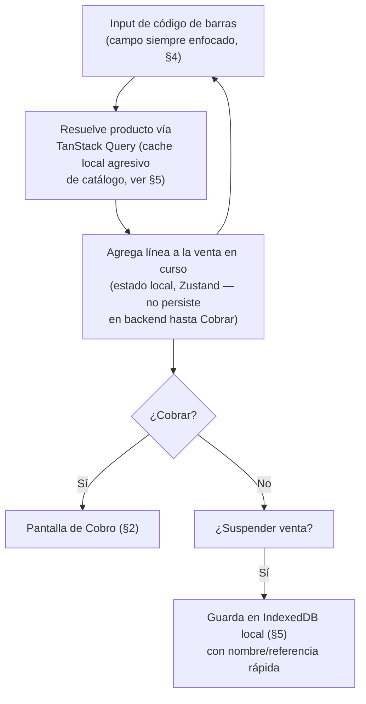
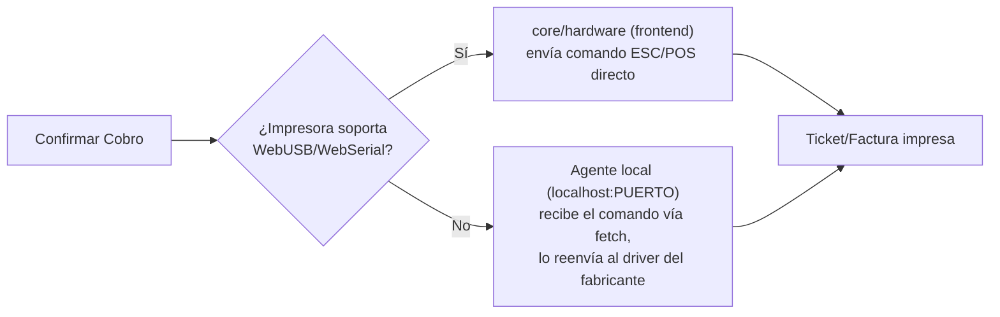
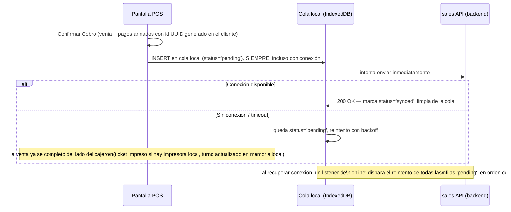

# 45 — POS: arquitectura de mostrador, hardware y offline (Fase 10)

> Versión 1.0 — 2026-07-13. Cierra el gap exacto que
> [00-roadmap-fases.md](../00-roadmap-fases.md) ya señalaba para la
> Fase 11 (POS, 🟡 Parcial): "UI de mostrador, hardware: impresora
> fiscal, lector de código de barras, tolerancia a desconexión". El
> dato en sí (`sales.invoices` con `sales_channel = 'pos'`) ya está
> completo desde
> [20-modulo-sales.md §4](./20-modulo-sales.md#4-facturas-pos--no-es-tabla-propia-confirmado-en-el-schema-real) —
> este documento es exclusivamente la capa de interfaz/hardware/
> resiliencia que faltaba, verificado contra
> [docs/menus/12-pos.md](../menus/12-pos.md). Sin código.

## 0. Alcance

| Elemento                                           | Ya resuelto en                                                                                                                                 | Este documento agrega                                                                       |
| -------------------------------------------------- | ---------------------------------------------------------------------------------------------------------------------------------------------- | ------------------------------------------------------------------------------------------- |
| Que una venta POS es una `Venta` con canal `'pos'` | [20-modulo-sales.md §4](./20-modulo-sales.md#4-facturas-pos--no-es-tabla-propia-confirmado-en-el-schema-real)                                  | Nada — no se repite                                                                         |
| Turno de caja, apertura/cierre/arqueo              | [23-modulo-cash.md](./23-modulo-cash.md)                                                                                                       | Nada — POS reutiliza el submenú de `caja` tal cual, ya confirmado en `docs/menus/12-pos.md` |
| Numeración fiscal por terminal                     | [14-modulo-core.md §9](./14-modulo-core.md#9-document-series-configurationnumbering_series--document_number_formats--dueño-real-configuration) | Cómo una terminal física se ata a una `numbering_series` (§6)                               |
| UI de mostrador (captura rápida, teclado/scanner)  | —                                                                                                                                              | §1-2                                                                                        |
| Hardware: impresora fiscal                         | —                                                                                                                                              | §3                                                                                          |
| Hardware: lector de código de barras               | —                                                                                                                                              | §4                                                                                          |
| Tolerancia a desconexión                           | —                                                                                                                                              | §5                                                                                          |

## 1. Pantalla de Venta POS — flujo de captura

Optimizada para velocidad, no para el mismo layout que el formulario
de venta estándar de `ventas` (que sí usa el `DataTable`/formulario
genérico de `ui-kit`,
[29-frontend-enterprise.md §6](./29-frontend-enterprise.md#6-componentes)) —
POS es una ruta con layout propio dentro del módulo `pos`
(`modules/pos/frontend/routes/venta-pos.layout.tsx`, mismo mecanismo
de layout anidado ya fijado en
[29 §3](./29-frontend-enterprise.md#3-layouts)), sin la navegación
estándar de `AppShell` visible (pantalla completa, minimiza
distracción visual en el mostrador).

**Por qué el carrito en curso vive en Zustand y no en TanStack
Query:** una venta a medias no es un dato de servidor todavía —no
existe fila en `sales.invoices` hasta que se confirma el cobro—, es
estado de interacción local, exactamente el criterio ya fijado en
[29-frontend-enterprise.md §5](./29-frontend-enterprise.md#5-estado-qué-va-en-tanstack-query-vs-qué-va-en-estado-localglobal)
("Stores... decisión cerrada: Zustand") para todo lo que no es dato de
servidor. El catálogo de productos consultado sí es TanStack Query
(dato de servidor), cacheado agresivamente (§5) para que escanear un
código de barras nunca espere un round-trip si el producto ya se
consultó antes en el turno.

## 2. Cobro multi-forma de pago

`docs/menus/12-pos.md` ya define la acción "Cobrar (multi-forma de
pago)" — combina efectivo/tarjeta/otros medios en un mismo cobro. La
pantalla de cobro:

1. Muestra el total pendiente y permite agregar N líneas de pago
   (`payment_method_id` + monto), cada una restando del pendiente —
   mismo catálogo de `configuration.payment_methods` ya diseñado en
   [14-modulo-core.md §15](./14-modulo-core.md#15-payment-methods-configurationpayment_forms--payment_methods--banks--dueño-real-configuration).
2. Al completar el pendiente (suma de líneas = total), habilita
   "Confirmar Cobro" — que envía la venta completa (líneas +
   pagos) en una sola request al backend, nunca en pasos separados
   (evita un estado intermedio de "venta confirmada pero sin cobro
   registrado" si la conexión se corta a mitad de camino — ver §5
   para el caso sin conexión en absoluto).
3. La confirmación dispara, del lado del backend ya diseñado, la
   apertura/actualización del turno de caja (`cash`) y la salida de
   inventario (`inventory`) — este documento no rediseña esa parte,
   solo el punto de entrada desde POS.

## 3. Hardware: impresora fiscal

**Decisión de integración:** vía **WebUSB/WebSerial del navegador**
cuando el driver del fabricante lo soporta directamente (impresoras
fiscales modernas con firmware ESC/POS o protocolo fiscal
estandarizado del país), con **fallback a un agente local** (pequeño
proceso Node corriendo en la PC de la terminal, expone un puerto
`localhost` que el frontend invoca vía `fetch`) para impresoras que
requieren un driver propietario de escritorio sin soporte WebUSB —
mismo patrón que la mayoría de sistemas POS web-based ya usan,
evitando depender de que **todas** las impresoras fiscales del
mercado soporten el mismo protocolo web.

**`core/hardware`** (nueva carpeta en `ui-kit`o en un paquete propio
`packages/pos-hardware`, decisión de ubicación exacta es de
implementación, no de arquitectura) abstrae ambos caminos detrás de
una interfaz única `PrinterAdapter.print(document)`, para que el
componente de UI que dispara la impresión no sepa ni le importe cuál
de los dos mecanismos está activo — mismo principio de encapsulamiento
que ya aplica el resto de `ui-kit`
([29 §6](./29-frontend-enterprise.md#6-componentes)).

**Reintento e impresión fallida:** si la impresión falla (papel
atascado, impresora apagada), la venta **ya está confirmada** en el
backend (§2, paso 2) — la impresión es un efecto posterior, no
bloqueante. La UI ofrece "Reimprimir Ticket" (ya listado en el menú)
reutilizando el mismo `PrinterAdapter` sobre una venta ya confirmada,
sin re-cobrar ni duplicar el documento fiscal.

## 4. Hardware: lector de código de barras

**Decisión de integración:** la gran mayoría de lectores de código de
barras de mostrador operan como **HID keyboard wedge** — el lector se
comporta como un teclado para el sistema operativo, "tipeando" el
código seguido de `Enter`. Esto significa que **no se necesita
integración de hardware especial** en la mayoría de los casos: un
`<input>` siempre enfocado en la pantalla de venta (§1) ya recibe el
código como si el cajero lo hubiera tecleado, y un listener de
`keydown` distingue "typeado por el lector" (velocidad de tecleo
mucho mayor a la humana, usada como heurística — igual criterio que
usan la mayoría de sistemas POS web) de una búsqueda manual escrita
por el cajero, sin requerir que el cajero presione un botón distinto
para cada modo.

**Excepción — lectores Bluetooth/USB con SDK propio** (menos común,
generalmente en integraciones más antiguas o de gama alta): mismo
mecanismo de agente local que la impresora fiscal (§3) — el
`PrinterAdapter` tiene su equivalente `ScannerAdapter`, mismo
principio de abstracción.

## 5. Tolerancia a desconexión (offline-first)

**Gap más grande de los tres — diseño completo, no existía ni el
mecanismo:**

**Por qué el `id` de la venta se genera en el cliente, no en el
servidor:** el UUID de `sales.invoices.id` ya usa
`gen_random_uuid()` como _default_, no `GENERATED ALWAYS` — el cliente
puede generar su propio UUID v4 y enviarlo explícitamente. Esto es lo
que hace segura la resincronización: si la venta ya llegó al backend
pero la respuesta se perdió (conexión cortada justo después de
confirmar), el reintento con el **mismo id** no crea una venta
duplicada — el backend ya la tiene, responde con éxito idempotente
(la fila ya existe con ese `id`, mismo criterio de idempotencia que
cualquier reintento seguro). Sin esto, cada reintento tras una
desconexión a mitad de confirmación arriesgaría una venta duplicada
real, con doble movimiento de inventario y doble apertura de cobro —
inaceptable en un punto de venta. **No se requiere columna ni tabla
nueva** — el mecanismo ya lo permite el schema tal cual está.

**Qué se cachea localmente para operar sin conexión:**

- Catálogo de productos + precios de la lista vigente (§1) — TanStack
  Query con `staleTime` largo específicamente en el contexto POS,
  refrescado al abrir turno, no en cada venta.
- Turno de caja activo y su saldo — reflejado en IndexedDB, reconciliado
  contra el backend al reconectar (si hubo un cierre de turno remoto
  mientras la terminal estaba offline, la reconciliación lo detecta y
  alerta al cajero, no lo sobreescribe silenciosamente).
- La cola de ventas `pending` en sí (arriba).

**Qué NO se hace offline** (límite explícito, no ambigüedad): abrir un
turno de caja nuevo requiere conexión (el turno es un recurso
compartido con `caja`, abrirlo offline arriesgaría dos cajeros
abriendo el "mismo" turno físico en la sucursal sin que ninguno de los
dos sepa del otro). Una terminal offline solo puede seguir vendiendo
dentro de un turno **ya abierto** antes de perder conexión.

## 6. Terminal / Punto de Venta

`docs/menus/12-pos.md` ya define "Terminal / Punto de Venta" como
configuración del módulo — identifica cada caja POS física y su serie
de numeración. Esto **ya tiene modelo de datos completo**: una
terminal es, en el schema real, la combinación de
`cash.cash_registers` (tipo `'pos'`) +
`configuration.numbering_series` con `branch_id` obligatorio (ya
diseñado en
[14-modulo-core.md §9](./14-modulo-core.md#9-document-series-configurationnumbering_series--document_number_formats--dueño-real-configuration)) —
no hace falta una tabla `pos.terminal` nueva. El frontend resuelve al
iniciar sesión en una terminal física cuál `cash_register`/
`numbering_series` le corresponde (configuración local del navegador/
dispositivo, persistida en `localStorage`, no en backend — es
identidad de la máquina física, no un dato de negocio).

## 7. Trazabilidad

| Punto del gap original               | Estado                                                                                               |
| ------------------------------------ | ---------------------------------------------------------------------------------------------------- |
| UI de mostrador                      | Cerrado — flujo de captura + cobro multi-forma de pago (§1-2)                                        |
| Hardware: impresora fiscal           | Cerrado — WebUSB/WebSerial con fallback a agente local, `PrinterAdapter` (§3)                        |
| Hardware: lector de código de barras | Cerrado — HID keyboard wedge como caso general, `ScannerAdapter` como excepción (§4)                 |
| Tolerancia a desconexión             | Cerrado — cola local IndexedDB + id generado en cliente para idempotencia, sin cambio de schema (§5) |
| Terminal / Punto de Venta            | Aclarado — ya tiene modelo de datos, no necesita tabla nueva (§6)                                    |

Con este documento, **Fase 11 (POS) pasa de 🟡 Parcial a ✅ Completo**
en el roadmap.
