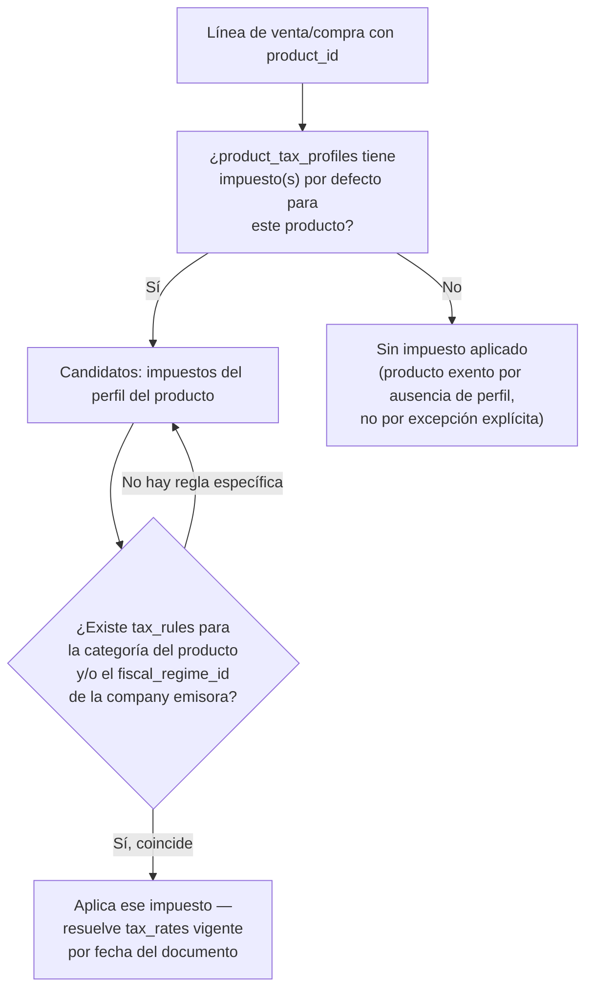

# 46 — Módulo Impuestos (diseño completo)

> Versión 1.0 — 2026-07-13. Último módulo de negocio pendiente con
> modelo de datos completo — el propio roadmap lo señalaba como el más
> urgente por cantidad de referencias cruzadas sin resolver
> ([00-roadmap-fases.md, "Orden sugerido"](../00-roadmap-fases.md)):
> `sales`, `purchases`, `payroll` y `configuration` ya referencian este
> módulo desde antes de que existiera. Mismo criterio que los 4
> módulos anteriores (Assets/Production/Services/Projects): sin tablas
> nuevas salvo 1 columna de reconciliación y particionamiento, ambos
> pequeños — verificado completo contra
> [sql/12_taxes.sql](../database/sql/12_taxes.sql) (13 tablas). Sin
> código.

## 0. Alcance

| Elemento                                                                                                       | Dueño real                                                       | Nota                                                                                                                                                                                                                                           |
| -------------------------------------------------------------------------------------------------------------- | ---------------------------------------------------------------- | ---------------------------------------------------------------------------------------------------------------------------------------------------------------------------------------------------------------------------------------------- |
| Jurisdicciones, Impuestos/Tasas, Reglas de Aplicabilidad, Retenciones, Exenciones, Percepciones, Declaraciones | `taxes`                                                          | ✅ Los 13 conceptos del schema real                                                                                                                                                                                                            |
| **Libro de IVA Ventas/Compras**                                                                                | `taxes` (vista)                                                  | ✅ Ya construido — `taxes.v_sales_tax_ledger`/`v_purchase_tax_ledger` ([sql/24_views.sql](../database/sql/24_views.sql)), no se rediseña (§8)                                                                                                  |
| **Auditoría de `tax_rates`**                                                                                   | `core.change_history`                                            | ✅ Ya decidido — `tax_rates` ya está en la lista de snapshot completo ([05-estrategia-auditoria.md §3](../database/05-estrategia-auditoria.md#3-corechange_history-snapshot-completo-selectivo)), no se repite acá                             |
| **Régimen tributario del país**                                                                                | `configuration` (`fiscal_regimes`)                               | Referenciado, no propiedad de `taxes` — reconciliado en §1, antes desconectado                                                                                                                                                                 |
| **Tipo de comprobante fiscal (CFDI/DTE/e-CF...)**                                                              | `configuration` (`fiscal_document_types`)                        | **No** es de `taxes` — ya diseñado en [14-modulo-core.md §14](./14-modulo-core.md#14-fiscal-document-types-configurationfiscal_document_types--dueño-real-configuration), responde "qué formato de comprobante", nunca "cuánto impuesto lleva" |
| **La decisión de qué retención aplica a un proveedor**                                                         | `suppliers` (`supplier_withholding_profiles`) referencia `taxes` | `taxes` define las reglas, `suppliers` decide cuál aplica a cada proveedor (§4)                                                                                                                                                                |
| **ISR de nómina**                                                                                              | `payroll` (`tax_withholding_tables`)                             | **No** es de `taxes` — mecanismo independiente, deliberadamente no unificado (§5)                                                                                                                                                              |
| **El asiento contable de retenciones/declaraciones**                                                           | `accounting`                                                     | `taxes` publica eventos puntuales, nunca escribe en `journal_entries` (§9)                                                                                                                                                                     |

## 1. Jurisdicciones Fiscales y Régimen (`tax_jurisdictions`) — reconciliación con `configuration.fiscal_regimes`

**Gap real cerrado:** `tax_jurisdictions` (alcance geográfico de un
impuesto — país/estado) y `configuration.fiscal_regimes` (régimen
tributario de una empresa — general, simplificado, exportador) eran
dos catálogos con significado real superpuesto sin ninguna FK entre
sí, verificado contra el schema completo. Son conceptos distintos que
**no se fusionan** (una jurisdicción es "dónde", un régimen es "bajo
qué estatus tributario opera la empresa") pero sí necesitaban
conectarse en el punto donde ambos afectan el mismo cálculo: qué tasa
aplica. Se agregó `tax_rules.fiscal_regime_id` (§3) — la reconciliación
vive ahí, no en `tax_jurisdictions` en sí, que se mantiene sin cambios
como el ámbito geográfico puro del impuesto.

`tax_jurisdictions.country_id` ya tenía su FK real cerrada en
`21_configuration.sql` (verificado directamente en el SQL, no solo en
el comentario) — no era un gap, solo una FK diferida ya resuelta desde
antes de este documento.

## 2. Impuestos y Tasas (`taxes` + `tax_translations` + `tax_rates`)

`taxes.tax_kind` (`sales_tax`/`income_tax`/`other`) distingue impuestos
al consumo (ITBIS/IVA — los que `sales`/`purchases` aplican por línea)
de impuestos sobre la renta (ISR — que **no** se calcula acá, ver §5)
— la columna existe precisamente para que `tax_rules`/`tax_rates`
sepan qué forma de aplicación corresponde sin necesitar una tabla
separada por tipo.

`tax_rates.effective_from`/`effective_to` (histórico de vigencia, sin
`effective_to` = tasa vigente actual) — mismo patrón que
`configuration.exchange_rates`
([14-modulo-core.md §4-7](./14-modulo-core.md#4-7-countries-currencies-languages-timezones--dueño-real-configuration)):
una tasa pasada nunca se sobreescribe, se agrega una fila nueva con
vigencia desde la fecha del cambio. Las dos vistas de libro de IVA
(§8) ya resuelven la tasa vigente por fecha de emisión del documento,
no la tasa "actual" al momento de consultar — mismo principio ya
aplicado a `Currency Manager`
([32-core-platform/03 §4](./32-core-platform/03-localizacion-y-globalizacion.md#4-currency-manager)).

## 3. Reglas de Aplicabilidad (`tax_rules`) — cómo se resuelve qué impuesto aplica a una línea

**Regla de resolución** (no estaba documentada como flujo, solo como
tabla):

`tax_rules.product_category_id` y `tax_rules.fiscal_regime_id` (§1,
agregada ahora) son **ambos nullable e independientes** — una regla
puede filtrar por categoría de producto, por régimen fiscal de la
company, por ambos, o por ninguno (regla general del impuesto). No
hay jerarquía de prioridad nueva que inventar: la resolución ya
descrita en el diagrama (perfil del producto → categoría → régimen)
es la que ya se desprende de las FKs existentes, este documento solo
la deja explícita.

**`sales.invoice_lines.tax_id`/`purchases.purchase_invoice_lines.tax_id`
son nullable** (verificado en el schema real) — una línea puede no
llevar impuesto (producto exento, servicio no gravado), decisión que
se toma al momento de facturar, no forzada por `tax_rules`.
`20-modulo-sales.md` nunca documentó este mecanismo en prosa a pesar
de tener la columna — queda cerrado acá, no se reabre el documento de
Ventas para esto.

## 4. Retenciones (`withholding_rules` + `withholding_certificates`)

Ya conectado desde antes de este documento: `purchases.
purchase_withholdings.withholding_rule_id` y `suppliers.
supplier_withholding_profiles.withholding_rule_id` ambos referencian
`taxes.withholding_rules` con FK real (cerradas en `12_taxes.sql`).
La asimetría cliente/proveedor ya está completamente justificada en
[17-modulo-suppliers.md](./17-modulo-suppliers.md) ("la empresa
retiene a sus proveedores, no a sus clientes") y el efecto en el pago
neto ya está diseñado en
[21-modulo-purchases.md §6](./21-modulo-purchases.md#6-pagos-purchase_payments--purchase_withholdings) —
no se repite acá.

**Lo que sí faltaba: cómo nace un `withholding_certificates`.**
`source_module`/`source_entity_id` es polimórfico — cuando `purchases`
registra un pago con retención (`purchase_withholdings`), la
aplicación crea la fila correspondiente en `withholding_certificates`
(`source_module = 'purchases'`, `source_entity_id` = el pago) **en la
misma unidad de trabajo** que registra el pago, nunca como un paso
separado — mismo principio de consistencia transaccional ya aplicado
en todo el sistema
([32-core-platform/09 §2-3](./32-core-platform/09-base-transaccional-y-modelado-ddd.md)).
El certificado es el comprobante legal de la retención — su existencia
no puede quedar desincronizada del pago que la originó.

## 5. Retenciones de Nómina — mecanismo independiente, no se unifica

**Aclaración necesaria, no un gap:** `payroll.tax_withholding_tables`
(ISR, ya diseñado en
[26-modulo-payroll.md §4](./26-modulo-payroll.md#4-isr-tax_withholding_tables))
**no tiene ninguna conexión** con `taxes.withholding_rules` —
verificado, cero FK entre ambos schemas. No se conecta ahora tampoco.
Son dos formas de cálculo estructuralmente distintas: `taxes.
withholding_rules` es una tasa plana sobre un monto de transacción
puntual (una factura de proveedor); `payroll.tax_withholding_tables`
es una tabla de tramos progresivos sobre una base salarial acumulada
(el mismo mecanismo de "tasa marginal por tramo" que un impuesto sobre
la renta real usa). Forzar una forma común entre ambos —por ejemplo,
modelar los tramos de ISR como filas de `withholding_rules`—
distorsionaría el modelo de tramos progresivos que `payroll` ya tiene
correctamente resuelto, sin ganar nada real a cambio. Se documenta
acá la independencia explícitamente para que quede claro que es una
decisión, no un descuido.

## 6. Exenciones (`tax_exemptions` + `tax_exemption_certificates`)

`tax_exemptions.customer_id` (nullable) — una exención puede ser por
cliente específico (organización sin fines de lucro con exención
reconocida) o general para el impuesto completo si `customer_id` es
`NULL` (mismo patrón de "alcance por ausencia de scope" ya usado en
`configuration.company_id` nullable en varias tablas). `tax_exemption_
certificates.document_id` referencia `core.documents` — el respaldo
documental de la exención usa `File Manager`
([32-core-platform/08 §3](./32-core-platform/08-frameworks-de-infraestructura.md#3-file-manager)),
no una columna de archivo propia — mismo principio ya aplicado en todo
el sistema (`service_work_reports.customer_signature_file_id`,
`37-modulo-assets.md` para respaldos documentales).

**Aplicación de una exención en la resolución de §3:** una línea de
venta a un `customer_id` con exención activa (`tax_exemptions` sin
`expires_at` vencido) para el `tax_id` en cuestión anula el resultado
de `tax_rules` — la exención es la última palabra, no una regla más
que compite en prioridad con `tax_rules`.

## 7. Percepciones (`tax_perceptions` + `tax_perception_rules`)

Mecanismo análogo a retenciones (§4) pero en dirección opuesta —una
percepción es un monto adicional cobrado (no retenido) por el emisor,
propio de regímenes específicos de algunos países (percepción de IVA
sobre ciertos rubros). Mismo patrón estructural que `tax_rules`
(reglas de cálculo separadas del catálogo) — no se repite el análisis
completo, es el mismo mecanismo de §3 aplicado a un concepto distinto.

## 8. Declaraciones (`tax_declarations` + `tax_declaration_lines`) y Libro de IVA — ya construido

**Ya resuelto, se cita, no se rediseña:** las dos vistas
`taxes.v_sales_tax_ledger`/`v_purchase_tax_ledger`
([sql/24_views.sql](../database/sql/24_views.sql)) ya calculan el
Libro de IVA Ventas/Compras completo —join de líneas de factura contra
`tax_rates` vigente por fecha— exactamente lo que
`docs/menus/09-contabilidad.md` pide en su submenú de Impuestos. No
hacía falta ninguna tabla ni vista nueva para esos dos reportes.

**Gap real de nomenclatura, corregido:** ese mismo menú nombra la
tabla de configuración de impuestos como `contabilidad.impuesto` — no
existe ese schema ni ese nombre. La tabla real es `taxes.taxes`
(schema `taxes`, plural, no `contabilidad.impuesto`) — mismo tipo de
corrección ya aplicada a `servicios.garantia`
([39-modulo-services.md §8](./39-modulo-services.md#8-garantías--por-qué-serviciosgarantia-del-menú-no-existe)).
No se edita el archivo de menú —es un alias informal, mismo criterio
ya aplicado en toda la sesión—, se deja la aclaración acá.

`tax_declarations` está descrita en el modelo lógico como
"congelada" — una vez presentada, no se edita; un ajuste posterior es
una declaración rectificativa nueva (fila nueva), nunca un `UPDATE`
sobre la ya presentada. Volumen bajo (una por período por company) —
no se agrega a particionamiento (§10), consistente con el criterio ya
fijado para tablas de catálogo/frecuencia baja.

## 9. Integración con Contabilidad — códigos de evento (no estaban definidos)

`22-modulo-accounting.md` nunca nombra `taxes` como módulo emisor de
eventos — ni un solo mention en todo el documento, verificado. El
impuesto **dentro de una línea de venta/compra** no necesita
`event_code` propio: ya llega a `accounting` como parte del asiento
automático de `sales.invoice_confirmed`/`purchases.*`, con
`tax_id`/`tax_rates` ya resueltos en la línea (mismo razonamiento que
[40-modulo-projects.md §10](./40-modulo-projects.md#10-integración-con-otros-módulos--códigos-de-evento-y-aclaración-de-alcance-del-menú)
usó para no crear un evento contable redundante). Dos eventos sí
son necesarios porque describen hechos fiscales propios, no derivados
de otro documento:

| `event_code`                           | Disparado por                                 | Plantilla de asiento esperada                                                                                       |
| -------------------------------------- | --------------------------------------------- | ------------------------------------------------------------------------------------------------------------------- |
| `taxes.withholding_certificate_issued` | §4, creación de un certificado de retención   | Débito impuesto retenido por pagar (pasivo) / Crédito cuenta por pagar al proveedor (reduce el neto)                |
| `taxes.declaration_filed`              | §8, presentación de una declaración periódica | Débito impuesto retenido por pagar (liquida el pasivo) / Crédito caja o banco (pago efectivo a la autoridad fiscal) |

## 10. Auditoría y Particionamiento

`tax_rates` ya está en la lista de `core.change_history` (§0) — no se
repite. `withholding_certificates` es una tabla de hechos append-only
(un certificado por pago/factura retenida) que no estaba en la lista
de particionamiento — se agregó a
[07-estrategia-particionamiento.md §1](../database/07-estrategia-particionamiento.md#1-qué-se-particiona-y-qué-no)
(`RANGE` mensual) y `sql/29_partitioning.sql`, con `PARTITION BY
RANGE (created_at)` declarado correctamente desde el `CREATE TABLE`.
`tax_declarations`/`tax_declaration_lines` no se particionan (§8,
volumen bajo por diseño).

## 11. Trazabilidad

| Punto solicitado             | Dueño real                                 | Novedad de este documento                                                                                       |
| ---------------------------- | ------------------------------------------ | --------------------------------------------------------------------------------------------------------------- |
| Jurisdicciones Fiscales      | `taxes`                                    | Reconciliación con `configuration.fiscal_regimes` vía `tax_rules.fiscal_regime_id`, no fusión de catálogos (§1) |
| Impuestos, Tasas             | `taxes`                                    | `tax_kind` aclarado, histórico de vigencia confirmado (§2)                                                      |
| Reglas de Aplicabilidad      | `taxes`                                    | Flujo completo de resolución producto→categoría→régimen (antes solo tabla, sin flujo) (§3)                      |
| Retenciones                  | `taxes` (regla) / `purchases` (aplicación) | Momento de creación del certificado dentro de la misma unidad de trabajo (§4)                                   |
| Retenciones de Nómina        | `payroll` (no `taxes`)                     | Independencia explícita, decisión documentada, no gap (§5)                                                      |
| Exenciones                   | `taxes`                                    | Regla de precedencia frente a `tax_rules` (§6)                                                                  |
| Percepciones                 | `taxes`                                    | Mismo mecanismo que retenciones en dirección opuesta (§7)                                                       |
| Declaraciones, Libro de IVA  | `taxes`                                    | Vistas ya construidas citadas + corrección de nomenclatura del menú (§8)                                        |
| Integración con Contabilidad | `accounting` (consumidor)                  | 2 `event_code` definidos, no existían (§9)                                                                      |
| Auditoría, Particionamiento  | `core`/`taxes`                             | `withholding_certificates` particionada (gap real cerrado) (§10)                                                |
