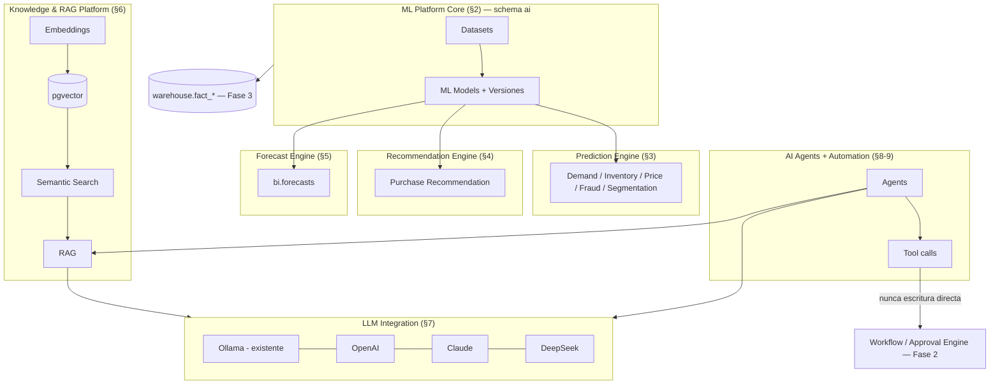

# 47 — Módulo IA (Inteligencia Artificial) — diseño completo

> 2026-07-21. Fase 4 de la secuencia de trabajo del usuario (Arquitecto
> Principal), continuando directamente desde
> [12-arquitectura-data-warehouse.md](../database/12-arquitectura-data-warehouse.md).
> **No modifica ningún módulo existente** — módulo nuevo, schema `ai`
> nuevo (propuesto, sin DDL). Solo documentación.

## 0. Nota de gobernanza — por qué este documento existe ahora y no antes

`docs/00-roadmap-fases.md` marca la Fase 27 (Inteligencia Artificial)
como **"❌ Pendiente de definir alcance"** explícitamente por falta de
necesidad de negocio confirmada — la misma razón se citó de nuevo hace
apenas una fase
([41-modulo-bi.md §4](./41-modulo-bi.md#4-forecast-mismo-criterio-que-la-fase-27-ia-del-roadmap):
_"no se diseña el motor de forecasting... sería tan especulativo"_).
Esto **no es una contradicción con este documento** — es exactamente
el mecanismo que esa regla de gobernanza estaba esperando: la decisión
de no diseñar especulativamente existe para que **este módulo no lo
inventara un modelo sin que nadie lo pidiera**, no para bloquear una
instrucción explícita y directa del Arquitecto Principal. El pedido
actual ("Fase 4: diseña completamente la plataforma de IA") **es** la
confirmación de necesidad de negocio que faltaba — se documenta acá,
explícitamente, para que quede trazable por qué el alcance cambió de
"pendiente" a "diseñado" en esta fecha, en vez de que parezca una
reversión silenciosa de una decisión previa.

**Lo que este documento reutiliza sin rediseñar** (verificado antes de
escribir una tabla nueva, mismo método que Fases 1-3):

| Ya existe                                     | Dónde                                                                                                                   | Cómo lo usa este módulo                                                                                                   |
| --------------------------------------------- | ----------------------------------------------------------------------------------------------------------------------- | ------------------------------------------------------------------------------------------------------------------------- |
| `core/ollama` (`OllamaService`)               | `core/ollama/ollama.service.ts` — `.generate()`, `.chat()`, `.embed()`, `.listModels()`, ya construido                  | Un proveedor más detrás de `LLM Integration` (§7), sin tocar su interfaz                                                  |
| `core.integrations`/`integration_credentials` | [32-core-platform/14 §5](./32-core-platform/14-motores-enterprise-avanzados.md#5-integration-engine)                    | Registro y credenciales de OpenAI/Claude/DeepSeek — mismo mecanismo que cualquier integración externa, no una tabla nueva |
| `Template Engine`                             | [32-core-platform/08 §4](./32-core-platform/08-frameworks-de-infraestructura.md#4-template-engine)                      | Base de `Prompt Management` (§8) — versionado + interpolación ya resueltos                                                |
| `Workflow Engine` / `Approval Engine`         | [32-core-platform/05 §4-5](./32-core-platform/05-motores-de-logica-de-negocio.md)                                       | Toda acción de un `AI Agent` que escriba en el ERP pasa por acá — nunca escritura directa (§9)                            |
| `Background Jobs` / `Scheduler`               | [32-core-platform/08 §5-6](./32-core-platform/08-frameworks-de-infraestructura.md)                                      | Entrenamiento de modelos y generación de predicciones, siempre asíncronos                                                 |
| `bi.forecast_models`/`forecasts`              | [28-modulo-reports-bi.md §6](./28-modulo-reports-bi.md#6-business-intelligence--el-schema-completo-distinto-de-reports) | `Forecast Engine` (§4) es el motor que finalmente les da contenido — sin tabla nueva en `bi`                              |
| `Data Warehouse` (`warehouse.fact_*`)         | [database/12-arquitectura-data-warehouse.md](../database/12-arquitectura-data-warehouse.md)                             | Fuente de entrenamiento preferida para todo modelo predictivo (§2-3) — datos ya conformados, no OLTP crudo                |
| `Storage Framework`                           | [32-core-platform/08 §2](./32-core-platform/08-frameworks-de-infraestructura.md#2-storage-framework)                    | Artefactos de modelo entrenado (pesos/checkpoints) — nunca en Postgres                                                    |
| `Event Bus`, `Notification Center`            | [32-core-platform/06](./32-core-platform/06-eventos-y-mensajeria.md)                                                    | Eventos de predicción/alerta, notificación de entrenamiento fallido                                                       |

## 1. Arquitectura general — 6 componentes

**Principio rector de este módulo, más estricto que el resto del
sistema:** un modelo de IA nunca escribe directamente en una tabla de
negocio ni ejecuta una acción irreversible por sí solo — toda salida
de IA es una **propuesta** (predicción, recomendación, o llamada a
herramienta de un agente) que un humano confirma o que pasa por
`Approval Engine`/`Workflow Engine` ya existentes. Este principio
recorre transversalmente §3-§9 y se explica una sola vez acá para no
repetirlo en cada componente.

## 2. ML Platform Core — infraestructura compartida

**Objetivo:** dar a cualquier capacidad predictiva del módulo (§3-§5)
un ciclo de vida uniforme de dataset → modelo → versión → entrenamiento
→ predicción, sin que cada caso de uso reimplemente su propio
versionado.

- **Tablas** (`ai.*`, todas con las columnas universales de
  [01-modelo-conceptual.md §1.1](../database/01-modelo-conceptual.md#11-columnas-universales),
  incluido `tenant_id`):
  - `ai.datasets` — un conjunto de datos con propósito de entrenamiento
    declarado (`name`, `use_case`, `source_description` — qué
    fact table/vista de `warehouse` o qué tablas OLTP lo alimentan).
  - `ai.dataset_versions` — una extracción concreta y congelada de un
    dataset (`dataset_id`, `version_number`, `row_count`,
    `extracted_at`, `storage_location` — apunta a `Storage Framework`,
    el contenido tabular no vive en Postgres).
  - `ai.ml_models` — un modelo declarado (`name`, `model_type`:
    `'classification' | 'regression' | 'clustering' | 'embedding'`,
    `use_case`: `'demand_prediction' | 'fraud_detection' | ...` — el
    catálogo de valores es exactamente la lista de §3-§5).
  - `ai.model_versions` — una versión entrenada concreta (`model_id`,
    `version_number`, `dataset_version_id` — con qué datos se entrenó
    —, `algorithm`, `hyperparameters` `JSONB`, `metrics` `JSONB`
    (accuracy/precision/recall/RMSE según `model_type`),
    `artifact_location` (`Storage Framework`), `status`:
    `'training' | 'candidate' | 'production' | 'archived'`).
  - `ai.model_training_runs` — una corrida de entrenamiento
    (`model_version_id`, `started_at`, `completed_at`, `status`:
    `'queued' | 'running' | 'succeeded' | 'failed'`,
    `triggered_by_user_id` nullable — nulo si la disparó `Scheduler`).
- **Relaciones:** `dataset_versions.dataset_id → datasets` (FK real,
  mismo schema); `ml_models.dataset_id`... no — un modelo no fija un
  dataset único, cada `model_versions.dataset_version_id →
dataset_versions` (FK real) — permite reentrenar el mismo modelo
  contra un dataset más reciente sin perder el historial de qué
  versión se entrenó con qué datos; `model_training_runs.model_version_id
→ model_versions` (FK real). Ningún FK cruza hacia `warehouse`/OLTP —
  `source_description` es texto libre + `source_entity_id` como ID
  suelto cuando aplica (mismo patrón ya fijado,
  [11-estrategia-integridad.md §4.1](../database/11-estrategia-integridad.md#41-las-tres-formas-válidas-de-referencia-ya-fijadas-resumen)).
- **Flujo:** un caso de uso (§3-§5) crea/actualiza su `ai.datasets` →
  al necesitar (re)entrenar, se congela una `dataset_versions` desde
  `warehouse.fact_*`/vistas de `bi` (preferido) o directamente de OLTP
  vía réplica de lectura si el caso de uso todavía no tiene fact table
  dedicada → `Background Jobs` ejecuta el entrenamiento
  (`model_training_runs`) → al completar, la nueva `model_versions`
  queda en `status='candidate'` → un humano (o una regla automática de
  umbral de métrica, vía `Business Rules Engine`) la promueve a
  `'production'` — nunca se promueve sola.
- **Entrenamiento:** siempre asíncrono (`Background Jobs`,
  [32-core-platform/08 §6](./32-core-platform/08-frameworks-de-infraestructura.md#6-background-jobs)),
  nunca bloquea un request HTTP. El algoritmo/librería de entrenamiento
  en sí (scikit-learn, XGBoost, un servicio externo de AutoML) es
  **decisión de implementación, no de arquitectura** — este documento
  no la fija, mismo criterio que `bi.forecast_models.algorithm` ya
  dejó como texto libre sin comprometerse a una librería.
- **Versionado:** `model_versions` es **append-only** — nunca se
  sobrescribe una versión ya entrenada (mismo principio de
  "el pasado no se reescribe" que `fact_*`/`accounting.journal_entries`
  ya siguen). Un modelo puede tener múltiples versiones en paralelo
  (`'candidate'` en evaluación mientras `'production'` sigue sirviendo
  predicciones) — permite comparar antes de reemplazar (A/B implícito).
- **Auditoría:** cada cambio de `status` de una `model_versions`
  (`ai.model.promoted`, `ai.model.archived`) es un evento de dominio,
  consumido por `Audit Framework` — quién promovió qué versión y
  cuándo es reconstruible.
- **Seguridad:** promover una versión a `'production'` requiere permiso
  administrativo del módulo IA (mismo nivel de gobernanza que editar
  `Business Rules Engine` o registrar una integración,
  [32-core-platform/14 §5](./32-core-platform/14-motores-enterprise-avanzados.md#5-integration-engine)) —
  nunca un rol operativo.

## 3. Prediction Engine + 5 aplicaciones

**Objetivo:** dar una interfaz única de inferencia
(`PredictionEngineService.predict(modelUseCase, entityRef): Prediction`)
sobre cualquier `ai.ml_models` en `status='production'`, sin que cada
aplicación (Demanda/Inventario/Precio/Fraude/Segmentación) reimplemente
su propio mecanismo de scoring.

- **Tablas:** `ai.predictions` (`model_version_id`, `entity_type`,
  `entity_id` — ID suelto hacia la fila real, p. ej.
  `sales.invoices` —, `predicted_value` `JSONB` (flexible: un número
  para regresión, una clase+probabilidad para clasificación),
  `confidence_score`, `predicted_at`, `actual_value` `JSONB` nullable
  — se completa después, cuando el hecho real ocurre, cerrando el lazo
  de retroalimentación para medir precisión real en producción, no
  solo en el dataset de entrenamiento).
- **Relaciones:** `predictions.model_version_id → model_versions` (FK
  real); `entity_type`/`entity_id` → ID suelto (ninguna FK física,
  mismo criterio ya aplicado en todo el sistema para referencias
  inter-módulo).
- **Flujo interno:** disparado por evento de dominio (p. ej.
  `sales.invoices` nueva dispara `Fraud Detection`) o por `Scheduler`
  (p. ej. `Demand Prediction` corre nocturnamente para el catálogo
  completo) → `PredictionEngineService` resuelve la `model_versions`
  `'production'` vigente para el `use_case` → ejecuta inferencia
  (síncrona si es liviana, o vía `Background Jobs` si el volumen de
  entidades a predecir es alto — p. ej. todo el catálogo de productos)
  → persiste en `ai.predictions` → publica `ai.prediction.created`.
- **Auditoría / Seguridad:** heredadas de §2 — cada predicción es
  trazable a la versión de modelo exacta que la generó
  (reproducibilidad: "¿por qué el sistema marcó esta venta como
  fraude?" tiene respuesta exacta).

### 3.1 Demand Prediction

Predice demanda futura por producto/sucursal. **Fuente de
entrenamiento:** `warehouse.fact_sales` (Fase 3, ya diseñada) —
candidato ideal explícito de por qué el Data Warehouse se diseñó antes
que este módulo: `fact_sales` ya tiene grano correcto (línea de
factura), dimensiones conformadas (`dim_product`, `dim_date`) y
volumen histórico limpio, sin necesitar re-agregar OLTP crudo cada vez.
`entity_type='products.products'`, `predicted_value` = cantidad
esperada por período. Consumido por `Inventory Prediction` (§3.2) y por
`sales`/`inventario` para planificación.

### 3.2 Inventory Prediction

Predice riesgo de quiebre de stock / punto de reorden.
**Fuente:** `warehouse.fact_inventory_movement` + la salida de §3.1
como insumo (un modelo puede consumir la predicción de otro — la
`entity_id` de una `ai.predictions` de demanda es un input válido de
dataset para este caso de uso, sin tabla nueva). `entity_type='products.products'`
(o `inventory.warehouse_stock` si el módulo de inventario lo modela
por depósito). Dispara `ai.prediction.created` con
`predicted_value.stockout_risk_days` — consumido por `Notification
Center` para alertar al comprador antes del quiebre real.

### 3.3 Price Optimization

Sugiere precio óptimo por producto según elasticidad de demanda
estimada. **Fuente:** `warehouse.fact_sales` (histórico de precio real
vs. cantidad vendida). `entity_type='products.products'`,
`predicted_value.suggested_price`. **Nunca escribe el precio
directamente** — genera una `ai.recommendations` (§4, tipo
`'price_change'`) que un usuario con permiso de `productos` acepta o
descarta, mismo principio rector de §1.

### 3.4 Fraud Detection

Clasifica una transacción (venta, compra, movimiento de caja) como
potencialmente fraudulenta. **Fuente:** `warehouse.fact_sales` /
`fact_cash_movement` con etiquetas históricas de casos confirmados
(requiere que el negocio ya haya marcado casos pasados como fraude
real — sin esa etiqueta, el modelo no tiene con qué aprender; se
documenta como prerrequisito de datos, no se resuelve acá).
`entity_type='sales.invoices'`/`'cash.cash_movements'`,
`predicted_value.fraud_score`. Un score sobre umbral configurable
(`core.system_parameters`, ya existente — reutilizado, sin columna
nueva) dispara `ai.prediction.fraud-flagged`, consumido por
`Notification Center` (alerta a supervisor) — **nunca bloquea la
transacción automáticamente**, coherente con el principio rector de §1
(una falsa alarma de fraude que bloquea una venta real es un costo de
negocio real, la decisión final queda en un humano).

### 3.5 Customer Segmentation

Agrupa clientes por comportamiento (clustering, no clasificación
supervisada — sin `target_value` conocido de antemano). **Tabla
adicional**, porque el resultado de clustering se consulta mucho más
seguido de lo que se recalcula (una predicción por cliente sería
redundante con `ai.predictions` para este patrón de acceso):
`ai.customer_segment_assignments` (`customer_id` ID suelto,
`segment_label`, `model_version_id`, `assigned_at`) — **no reemplaza**
`ai.predictions`, es una proyección de conveniencia derivada de una
corrida de `model_training_runs` de tipo clustering, recalculada
completa en cada re-segmentación (nunca `UPDATE` incremental fila por
fila). Consumida por `crm`/`ventas` para campañas dirigidas por
segmento.

## 4. Recommendation Engine + Purchase Recommendation

**Objetivo:** sugerir una acción de negocio concreta (no solo un valor
predicho) — comprar, reabastecer, ofrecer un descuento — con
trazabilidad de por qué se sugirió y qué se hizo con la sugerencia.

- **Tablas:** `ai.recommendations` (`recommendation_type`:
  `'purchase' | 'price_change' | 'upsell' | 'cross_sell'`,
  `target_entity_type`/`target_entity_id` (ID suelto — a quién/qué
  aplica), `recommended_action` `JSONB` (contenido específico del
  tipo, p. ej. `{supplierId, productId, suggestedQuantity}` para
  `'purchase'`), `model_version_id`, `score`, `status`:
  `'pending' | 'accepted' | 'dismissed' | 'expired'`,
  `resolved_by_user_id` nullable, `resolved_at` nullable).
- **Relaciones:** `recommendations.model_version_id → model_versions`
  (FK real); resto ID suelto, mismo criterio ya fijado.
- **Flujo:** una corrida de `Recommendation Engine` (§3.1-3.2 como
  insumo directo — demanda alta + inventario bajo = candidato de
  recomendación de compra) genera filas `'pending'` → aparece en el
  `Task Engine`
  ([32-core-platform/14 §4](./32-core-platform/14-motores-enterprise-avanzados.md#4-task-engine),
  reutilizado, no una bandeja nueva) del comprador responsable → el
  usuario acepta (dispara la acción real de negocio, p. ej. crear una
  solicitud de compra en `compras` — vía evento de dominio, nunca
  escritura directa del motor de IA) o descarta (queda como dato de
  entrenamiento negativo para el próximo ciclo — una recomendación
  descartada repetidamente es señal real para el modelo).
- **Auditoría:** `ai.recommendation.accepted`/`.dismissed` son eventos
  de dominio — permite medir la tasa de aceptación real de las
  sugerencias del sistema, la métrica de negocio que finalmente decide
  si el modelo aporta valor.
- **Seguridad:** aceptar una recomendación requiere el mismo permiso
  que la acción de negocio que dispara — el motor de IA nunca eleva
  privilegios ("la IA lo sugirió" no es una autorización).

## 5. Forecast Engine

**Objetivo:** finalmente dar contenido real a `bi.forecast_models`/
`bi.forecasts` — tablas que existen desde antes de este módulo
([28-modulo-reports-bi.md §6](./28-modulo-reports-bi.md#6-business-intelligence--el-schema-completo-distinto-de-reports))
con `algorithm` como texto libre y sin mecanismo de entrenamiento, tal
como quedó documentado explícitamente fuera de alcance en su momento.

- **Tablas:** ninguna nueva — `bi.forecast_models.algorithm` pasa a
  interpretarse como una referencia (por convención de nombre, no FK
  cruzada de schema — mismo patrón que `bi.data_mart_tables.materialized_view_name`)
  a un `ai.ml_models.use_case='forecast'`. `bi.forecasts` sigue siendo
  la tabla de salida, sin cambio de forma.
- **Relaciones:** conceptual, no física — `bi.forecast_models` (schema
  `bi`) y `ai.ml_models` (schema `ai`) permanecen sin FK entre sí,
  consistente con la regla de "nunca FK entre schemas de módulos de
  negocio distintos" — la relación la resuelve la aplicación por
  nombre/convención, igual que `data_mart_tables` ya hace con vistas
  materializadas.
- **Flujo:** `Forecast Engine` entrena un `ai.ml_models` de
  `model_type='regression'` sobre `warehouse.fact_*` relevante (ventas,
  caja, según qué se esté pronosticando) → al generar predicciones
  para fechas futuras, escribe en `bi.forecasts`
  (`model_id`+`forecast_date`+`predicted_value`, forma ya existente,
  sin columna nueva) en vez de (o además de) `ai.predictions` — se
  respeta la tabla de salida ya diseñada para que `bi`/`reports`/
  Dashboards la consuman sin cambio de interfaz.
- **Entrenamiento/Versionado/Auditoría/Seguridad:** heredados 100% de
  §2 — Forecast Engine no es un mecanismo aparte, es un `use_case` más
  de `ai.ml_models`.

## 6. Knowledge & RAG Platform

**Objetivo:** permitir búsqueda semántica sobre contenido de negocio
(documentos, artículos de conocimiento, histórico de tickets/CRM) y
usarla como contexto para generación de texto con un LLM (RAG —
Retrieval-Augmented Generation), en vez de depender solo del
conocimiento genérico del modelo.

- **Decisión de infraestructura — base de datos vectorial:** **se usa
  `pgvector` sobre el mismo Postgres 17 ya operado**, no un motor
  vectorial dedicado nuevo (Pinecone/Weaviate/Qdrant). Motivo, no
  default por pereza: el volumen esperado (documentos/artículos de
  conocimiento de un ERP, no búsqueda web a escala) no justifica una
  pieza de infraestructura nueva con su propio backup/HA/monitoreo —
  mismo criterio de gobernanza "no agregar dependencia sin necesidad
  real" ya aplicado repetidas veces
  (`packages/tooling/utils/totp.ts`, sin librería nueva;
  `Background Jobs`+`Scheduler` reutilizados en vez de un orquestador
  de pipeline nuevo en Fase 3). Reevaluar solo si el volumen real de
  embeddings supera lo que `pgvector` sostiene con buen rendimiento
  (candidato de una fase futura, no una limitación de este diseño).
- **Tablas:** `ai.knowledge_articles` (`title`, `content`, `category`,
  `source_module` nullable, `source_entity_id` nullable — cuando el
  artículo se generó a partir de una entidad real, p. ej. un
  procedimiento de `servicios`); `ai.embeddings` (`source_type`:
  `'knowledge_article' | 'document' | 'product'`, `source_id` ID
  suelto, `embedding_vector` — tipo `vector` de la extensión
  `pgvector`, dimensión según el modelo de embedding usado —,
  `model_used`, `created_at`).
- **Relaciones:** `embeddings.source_id` → ID suelto (puede apuntar a
  `ai.knowledge_articles.id` o a cualquier otra entidad embebible,
  p. ej. `core.documents.id` de
  [32-core-platform/14 §2](./32-core-platform/14-motores-enterprise-avanzados.md#2-document-management-system) —
  reutiliza `Document Management System` ya diseñado en vez de
  duplicar el concepto de "documento").
- **Flujo — indexación:** un documento/artículo nuevo o modificado
  dispara (`Background Jobs`) el cálculo de su embedding vía `LLM
Integration` (§7, método `.embed()` — ya existe en `OllamaService`,
  reutilizado) → se guarda en `ai.embeddings`.
- **Flujo — Semantic Search:** una consulta de texto se embebe con el
  mismo modelo → búsqueda de vecinos más cercanos (`pgvector`,
  operador de distancia coseno/L2 según el modelo) sobre
  `ai.embeddings`, filtrado por `tenant_id` (RLS, ver §10) →
  devuelve las `source_id` más relevantes.
- **Flujo — RAG:** Semantic Search resuelve el contexto relevante →
  se arma un prompt (vía `Prompt Management`, §8) que incluye ese
  contexto + la pregunta del usuario → se envía a `LLM Integration`
  (§7) para generar la respuesta final — el LLM nunca "inventa" desde
  cero, siempre fundamentado en contenido real recuperado, con las
  `source_id` usadas registradas en la respuesta para trazabilidad
  ("esta respuesta se basó en estos 3 artículos").
- **Auditoría:** cada consulta de Semantic Search/RAG queda
  registrada (ver `ai.llm_requests`, §7 — la consulta en sí es una
  llamada al LLM, auditada igual que cualquier otra).
- **Seguridad:** `ai.embeddings`/`ai.knowledge_articles` llevan
  `tenant_id` y RLS sin excepción (§10) — un artículo de conocimiento
  de un tenant nunca aparece en la búsqueda semántica de otro,
  incluso si el contenido fuera genérico.

## 7. LLM Integration

**Objetivo:** una interfaz única (`LlmIntegrationService`) para
generar texto/chat/embeddings sobre **cualquier** proveedor
configurado, para que ningún componente de este módulo (§3-§6, §8)
dependa directamente de un SDK de proveedor específico.

- **Arquitectura:** patrón de adaptador — exactamente el mismo ya
  formalizado por `Integration Engine`
  ([32-core-platform/14 §5](./32-core-platform/14-motores-enterprise-avanzados.md#5-integration-engine))
  y ya usado en la práctica por `WhatsAppGatewayAdapter`
  ([06 §4.1](./32-core-platform/06-eventos-y-mensajeria.md#41-integración-de-proveedores-por-canal-sms-whatsapp-email--detalle-agregado-por-fase-5)).
  `Ollama` ya es un adaptador construido (`OllamaService`, sin
  cambios); `OpenAI`/`Claude`/`DeepSeek` se agregan como 3 adaptadores
  nuevos detrás de la misma interfaz (`LlmProviderAdapter.generate()`/
  `.chat()`/`.embed()`), sin tocar `OllamaService`.
- **Tablas:** **ninguna tabla de registro nueva** — las credenciales de
  OpenAI/Claude/DeepSeek (API keys) se guardan en
  `core.integrations`/`integration_credentials` ya existentes
  (`integration_type='llm_provider'`), mismo mecanismo AES-256-GCM que
  cualquier otra integración externa (Fase 2). Se agrega
  `ai.llm_requests` (`provider`, `model`, `purpose`:
  `'generate' | 'chat' | 'embed'`, `prompt_tokens`,
  `completion_tokens`, `cost_estimate`, `latency_ms`,
  `requested_by_user_id` nullable — nulo si lo disparó un proceso de
  sistema) — log de uso/costo, no un catálogo de proveedores.
- **Relaciones:** `llm_requests` no tiene FK hacia `core.integrations`
  (evita acoplar el log de auditoría al ciclo de vida de la fila de
  integración) — guarda `provider`/`model` como texto, suficiente para
  reporting de costo.
- **Flujo:** cualquier componente (§3-§6, §8) pide
  `LlmIntegrationService.generate(prompt, {provider, model})` →
  resuelve el adaptador correspondiente (`Ollama` por defecto, ver
  Seguridad) → ejecuta la llamada real → registra `ai.llm_requests`
  con el consumo real reportado por el proveedor (tokens, latencia).
- **Seguridad — la decisión más importante de este componente:**
  **`Ollama` (autohospedado, dentro de la infraestructura propia) es
  el proveedor por defecto para cualquier operación que toque datos
  reales de negocio del tenant** (predicciones, RAG sobre documentos
  internos). `OpenAI`/`Claude`/`DeepSeek` (APIs externas de terceros)
  requieren **opt-in explícito por tenant**
  (`core.system_settings`/`system_parameters`, ya existentes,
  reutilizados sin columna nueva — un parámetro
  `ai.external_llm_enabled` por tenant) y, cuando están habilitados,
  el prompt enviado se arma con minimización de datos (nunca se
  interpola un dato sensible sin necesidad real — p. ej. un monto de
  factura puede viajar, un número de tarjeta nunca). Esta distinción
  se documenta explícitamente porque es un riesgo real de privacidad/
  residencia de datos distinto entre un proveedor local y uno externo
  — no es una preferencia de implementación, es una decisión de
  seguridad.
- **Escalabilidad/costo:** `ai.llm_requests.cost_estimate` acumulado
  se compara contra un umbral configurable
  (`core.system_parameters`, mismo mecanismo) — al superarlo,
  `Notification Center` alerta al administrador antes de que el gasto
  de un proveedor externo se salga de control, mismo patrón ya usado
  para alertas de `bi_alerts` (Fase 3, umbral + notificación).

## 8. Prompt Management

**Objetivo:** versionar y reutilizar los prompts que cualquier
componente de este módulo (RAG, Agentes, Forecast) le envía a un LLM,
sin texto hardcodeado disperso por el código.

- **Trazabilidad:** 🔗 Extiende diseño existente — **es `Template
Engine`
  ([32-core-platform/08 §4](./32-core-platform/08-frameworks-de-infraestructura.md#4-template-engine)),
  aplicado a prompts, no un motor de plantillas nuevo.** `core.templates`/
  `template_translations` ya resuelven versionado + interpolación +
  fallback (company→tenant→sistema) — un prompt de IA es, para efectos
  de este mecanismo, una plantilla más con `templateKey` namespaced
  (`ai.prompt.<caso-de-uso>`, p. ej. `ai.prompt.rag-answer`,
  `ai.prompt.fraud-explanation`).
- **Tablas:** ninguna nueva.
- **Extensión real necesaria, no cubierta por `Template Engine`
  todavía (gap honesto, no se diseña la columna acá):** conteo de
  tokens por plantilla renderizada (para estimar costo antes de
  enviar) — hoy `Template Engine` no tiene ese concepto porque nunca
  lo necesitó (sus consumidores hasta ahora son PDF/email, no LLMs
  facturados por token). Se documenta como extensión real pendiente,
  candidato de implementación cuando se construya este módulo, sin
  proponer su diseño de columna en este pase.
- **Seguridad:** mismo criterio ya fijado para plantillas fiscales en
  `Template Engine` — un prompt de sistema (`system_prompt`, el que
  define el comportamiento de un `AI Agent`, §9) requiere permiso
  administrativo para editarse, nunca editable por el usuario final
  de un agente (evita que un usuario reprograme el comportamiento de
  un agente compartido).

## 9. AI Agents + Automation Engine

**Objetivo:** permitir que un LLM ejecute una secuencia de pasos
(consultar datos, proponer una acción) de forma semi-autónoma, con la
misma garantía de "nunca escritura directa" del principio rector (§1).

- **Trazabilidad:** 🔗 Extiende diseño existente — un agente **no** es
  un motor de automatización nuevo, es un **nuevo tipo de disparador**
  de `Workflow Engine`/`Approval Engine` ya diseñados
  ([32-core-platform/05 §4-5](./32-core-platform/05-motores-de-logica-de-negocio.md)) —
  "Automation Engine" del pedido original **es** esta combinación, no
  un componente aparte.
- **Tablas:** `ai.agents` (`name`, `purpose`, `system_prompt_key` —
  referencia a `Prompt Management`, §8 —, `llm_provider`/`model`
  preferido, `allowed_tools` `JSONB` — lista de nombres de
  herramienta que el agente puede invocar, nunca "todas" por
  defecto —, `status`: `'active' | 'disabled'`); `ai.agent_runs`
  (`agent_id`, `trigger_type`: `'manual' | 'event' | 'scheduled'`,
  `input`, `output`, `tool_calls` `JSONB` (bitácora de qué
  herramienta se invocó, con qué argumentos, y qué devolvió — cada
  paso del razonamiento queda registrado, no solo el resultado
  final), `status`, `started_at`/`completed_at`);
  `ai.agent_tool_permissions` (`agent_id`, `tool_name`,
  `requires_approval` boolean).
- **Relaciones:** `agent_runs.agent_id → agents` (FK real);
  `agent_tool_permissions.agent_id → agents` (FK real); ninguna FK
  hacia tablas de negocio — toda acción real la ejecuta el sistema ya
  existente que la herramienta invoca (p. ej. la herramienta "crear
  solicitud de compra" internamente llama al caso de uso ya existente
  de `compras`, con el `Security Context` del usuario que aprobó, no
  del agente).
- **Flujo:** un agente se dispara (evento de dominio, disparo manual, o
  `Scheduler`) → arma su prompt (§8) con el contexto disponible
  (incluido RAG si su propósito lo requiere, §6) → el LLM decide qué
  herramienta invocar (function calling, según soporte del proveedor —
  detalle de implementación, no de arquitectura) → **si la herramienta
  tiene `requires_approval=true`** (el caso por defecto para cualquier
  herramienta que modifique datos de negocio), la invocación se
  convierte en una solicitud de `Approval Engine`, nunca se ejecuta
  directamente → si el aprobador acepta, **recién ahí** se ejecuta la
  acción real, con el `Security Context` del aprobador, no del agente
  → el resultado (éxito/rechazo) se registra en `agent_runs.tool_calls`.
- **Herramientas de solo lectura** (`requires_approval=false`,
  p. ej. "consultar stock actual") se ejecutan directo, sin fricción —
  la aprobación obligatoria es específicamente para acciones que
  cambian estado del ERP, no para toda invocación de herramienta.
- **Entrenamiento/Versionado:** no aplica en el sentido de §2 (un
  agente no es un modelo entrenado, es una configuración de prompt +
  herramientas sobre un LLM ya entrenado por su proveedor) —
  `ai.agents` sí se versiona implícitamente vía `Prompt Management`
  (§8, `Template Engine` ya versiona sus plantillas).
- **Auditoría:** `agent_runs.tool_calls` **es** el registro de
  auditoría completo de cada decisión del agente — consumido por
  `Audit Framework` igual que cualquier otro evento de dominio.
- **Seguridad — el punto más crítico de todo el módulo:** un agente
  **nunca** tiene una cuenta de usuario real ni un JWT propio — actúa
  siempre bajo un `Security Context` de sistema explícito y limitado
  ([32-core-platform/08 §5](./32-core-platform/08-frameworks-de-infraestructura.md#5-scheduler),
  mismo criterio ya aplicado a `Scheduler`), y cualquier efecto real
  sobre datos de negocio pasa por `Approval Engine` con el
  `Security Context` del humano que aprueba, nunca el del agente —
  esto es lo que hace que "el agente se comportó mal" nunca sea "el
  agente borró datos", en el peor caso es "el agente propuso algo que
  un humano rechazó".

## 10. Seguridad transversal (todo el módulo)

- **RLS sin excepción** — toda tabla `ai.*` lleva `tenant_id` y hereda
  `FORCE ROW LEVEL SECURITY`, mismo mecanismo ya verificado
  ([11-estrategia-integridad.md §6](../database/11-estrategia-integridad.md#6-integridad-transaccional--multiempresa--rls-como-mecanismo-de-integridad)) —
  un modelo entrenado con datos de un tenant nunca es accesible ni
  aplicable a otro (ni siquiera el modelo en sí — `ai.ml_models`
  también lleva `tenant_id`, no hay "modelo global compartido entre
  tenants" en este diseño, alternativa que se dejaría para una
  decisión de negocio explícita futura si el costo de entrenar por
  tenant lo justificara).
- **Proveedor local por defecto para datos sensibles** (§7) — la
  decisión de seguridad más importante del módulo, no se repite acá.
- **Nunca escritura directa** (§1, §9) — el control más importante
  contra un modelo/agente equivocado o manipulado (prompt injection
  vía contenido de RAG, por ejemplo): el daño máximo posible es una
  propuesta rechazable, nunca una escritura irreversible.
- **Sesgo/equidad de modelos de decisión sensible** (§3.4 Fraude,
  §3.5 Segmentación): se documenta como riesgo real a monitorear
  (un modelo de fraude sesgado por variables correlacionadas con
  características protegidas es un riesgo legal/reputacional real) —
  sin mecanismo de auditoría de sesgo diseñado en este pase (requiere
  su propia decisión de negocio/compliance, mismo criterio de no
  diseñar especulativamente aplicado dentro del alcance ya autorizado).

## 11. Auditoría transversal

Todo evento de dominio de este módulo
(`ai.model.*`, `ai.prediction.*`, `ai.recommendation.*`,
`ai.agent-run.*`) fluye a `Audit Framework`
([32-core-platform/07 §1](./32-core-platform/07-observabilidad-y-gobernanza.md#1-audit-framework)),
sin mecanismo paralelo. La combinación `ai.predictions.model_version_id`

- `ai.model_versions.dataset_version_id` + `ai.dataset_versions` da
  reproducibilidad completa: cualquier predicción histórica puede
  explicarse hasta el dato exacto de entrenamiento que la originó — el
  estándar de auditoría más alto que este módulo puede ofrecer sin
  almacenar el modelo completo versionado en Postgres (que ya vive en
  `Storage Framework`, §2).

## 12. Escalabilidad

- **Entrenamiento e inferencia batch, siempre en `Background Jobs`**
  (§2-§5) — nunca compiten con tráfico transaccional del ERP.
- **`pgvector` sobre el Postgres ya operado** (§6) — sin infraestructura
  nueva; reevaluar solo si el volumen de embeddings lo justifica
  (documentado como límite conocido, no ignorado).
- **`ai.predictions`/`ai.llm_requests` son candidatas reales de
  particionamiento por fecha** si su volumen crece al ritmo de
  `fact_*` (Fase 3) — mismo mecanismo `pg_partman` ya en uso, no se
  activa preventivamente sin volumen real que lo justifique (mismo
  criterio que evitó particionar tablas OLTP de bajo volumen,
  [07-estrategia-particionamiento.md §1](../database/07-estrategia-particionamiento.md#1-qué-se-particiona-y-qué-no)).
- **Proveedores externos de LLM** (§7) escalan por su propia cuenta
  (son APIs de terceros) — el único límite real del lado de GORAZUS es
  el control de costo ya diseñado (§7), no un cuello de botella técnico.

## 13. Trazabilidad

| Punto pedido en la Fase 4                                         | Cerrado en                                                                                                                             |
| ----------------------------------------------------------------- | -------------------------------------------------------------------------------------------------------------------------------------- |
| Crear el módulo AI                                                | Este documento completo, schema `ai` propuesto                                                                                         |
| Prediction Engine, Demand/Inventory/Fraud/Segmentation/Price      | §3                                                                                                                                     |
| Recommendation Engine, Purchase Recommendation                    | §4                                                                                                                                     |
| Forecast Engine                                                   | §5                                                                                                                                     |
| Machine Learning Models, Datasets, Entrenamiento, Versionado      | §2                                                                                                                                     |
| Embeddings, Vector Database, Semantic Search, RAG, Knowledge Base | §6                                                                                                                                     |
| LLM Integration, Ollama/OpenAI/Claude/DeepSeek Integration        | §7                                                                                                                                     |
| Prompt Management                                                 | §8                                                                                                                                     |
| AI Agents, Automation Engine                                      | §9                                                                                                                                     |
| Tablas, Relaciones, Flujos                                        | §2-§9, cada componente                                                                                                                 |
| Auditoría                                                         | §11 (+ por componente)                                                                                                                 |
| Seguridad                                                         | §10 (+ por componente)                                                                                                                 |
| No modificar módulos existentes                                   | §0 — solo lectura de `warehouse`/OLTP, extiende `Template Engine`/`Workflow Engine`/`Approval Engine`/`core.integrations` sin tocarlos |
| Integrarse con el ERP existente sin romper compatibilidad         | §0 (tabla de reutilización), §9 (nunca escritura directa)                                                                              |
| No SQL, no código, solo documentación                             | Confirmado — `ai.*` descrito conceptualmente, sin DDL                                                                                  |
