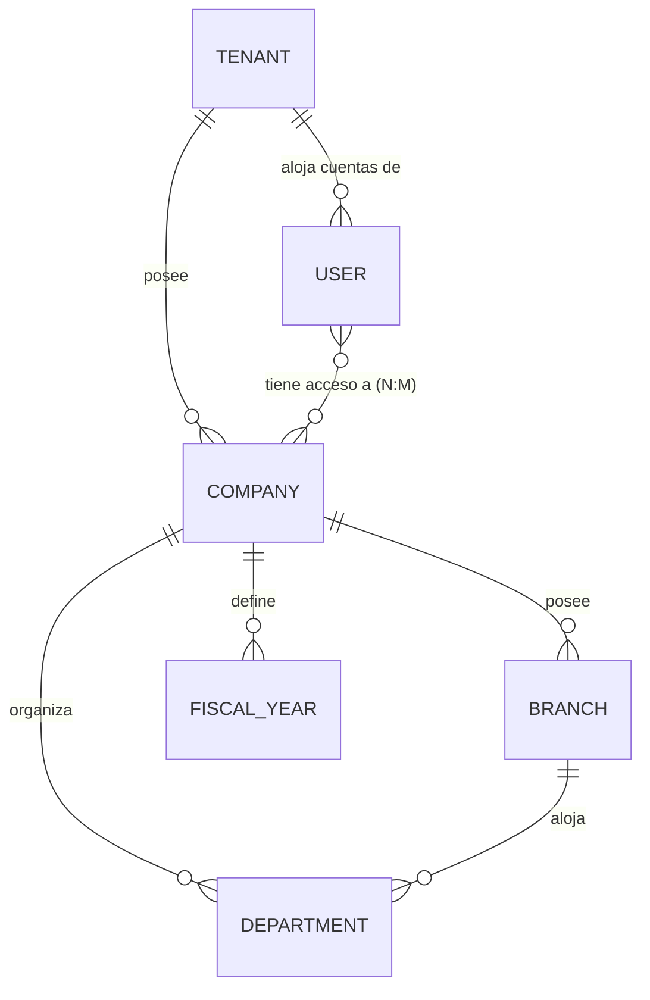

# 01 — Modelo Conceptual

## 1. El patrón universal: toda tabla de negocio

Antes de nombrar una sola entidad, se fija el patrón que **todas**
comparten. Esto no es boilerplate — es lo que hace posible multiempresa,
auditoría completa y particionamiento sin rediseño futuro.

### 1.1 Columnas universales

| Columna        | Tipo (Postgres 17)                                            | Nulable            | Propósito                                                                                                                                                                             |
| -------------- | ------------------------------------------------------------- | ------------------ | ------------------------------------------------------------------------------------------------------------------------------------------------------------------------------------- |
| `id`           | `UUID` (PK)                                                   | No                 | Identidad global, segura para replicación multi-nodo y merges sin colisión. Es la clave usada en toda FK.                                                                             |
| `local_id`     | `BIGINT GENERATED ALWAYS AS IDENTITY`                         | No (único)         | "ID entero" pedido — correlativo legible por humano, usado para ordenar/mostrar, nunca como FK.                                                                                       |
| `tenant_id`    | `UUID` (FK → `core.tenants`)                                  | No                 | Cliente SaaS dueño del registro. Ver [§2](#2-jerarquía-de-aislamiento-tenant--company--branch). Sentinela `00000000-0000-0000-0000-000000000000` para catálogos globales del sistema. |
| `company_id`   | `UUID` (FK → `core.companies`)                                | Sí                 | Empresa legal dentro del tenant. `NULL` = el registro aplica a todo el tenant (p. ej. configuración compartida entre empresas).                                                       |
| `branch_id`    | `UUID` (FK → `core.branches`)                                 | Sí                 | Sucursal dentro de la empresa. `NULL` = el registro aplica a toda la empresa.                                                                                                         |
| `created_at`   | `TIMESTAMPTZ`                                                 | No                 | Momento de creación, siempre en UTC.                                                                                                                                                  |
| `updated_at`   | `TIMESTAMPTZ`                                                 | No                 | Última modificación (mantenida por trigger, ver [26_triggers.sql](./sql/26_triggers.sql)).                                                                                            |
| `deleted_at`   | `TIMESTAMPTZ`                                                 | Sí                 | Momento de borrado lógico. `NULL` = registro vivo.                                                                                                                                    |
| `created_by`   | `UUID` (FK → `core.users`)                                    | No                 | Usuario que creó el registro (usuario `SYSTEM` reservado para procesos automáticos/seed).                                                                                             |
| `updated_by`   | `UUID` (FK → `core.users`)                                    | No                 | Usuario de la última modificación.                                                                                                                                                    |
| `deleted_by`   | `UUID` (FK → `core.users`)                                    | Sí                 | Usuario que ejecutó el borrado lógico.                                                                                                                                                |
| `version`      | `INTEGER`                                                     | No, default `1`    | Versión **de negocio**: la controla la aplicación para optimistic locking semántico (p. ej. "esta cotización es la revisión 3").                                                      |
| `row_version`  | `BIGINT`                                                      | No, default `0`    | Versión **técnica**: incrementada por trigger en cada `UPDATE` físico. Usada por replicación lógica y detección de conflictos de sincronización — no tiene significado de negocio.    |
| `is_active`    | `BOOLEAN`                                                     | No, default `true` | Estado operativo (p. ej. un producto puede estar inactivo sin estar borrado). Independiente de `is_deleted`.                                                                          |
| `is_deleted`   | `BOOLEAN GENERATED ALWAYS AS (deleted_at IS NOT NULL) STORED` | No                 | Columna calculada, indexable, para no repetir `WHERE deleted_at IS NULL` con lógica distinta en cada query.                                                                           |
| `observations` | `TEXT`                                                        | Sí                 | Campo libre para notas operativas del registro.                                                                                                                                       |
| `metadata`     | `JSONB`                                                       | No, default `'{}'` | Extensión sin migración para atributos de baja frecuencia de uso o específicos de un tenant. Ver [§1.3](#13-cuándo-usar-metadata-jsonb-y-cuándo-no) — no es un cajón de sastre.       |

**18 columnas universales** antes de cualquier atributo propio de la
entidad. Se documentan una única vez acá; cada archivo SQL las declara
de forma idéntica en cada `CREATE TABLE` (Postgres no tiene "mixins" de
columnas fuera de herencia de tablas, que se descarta deliberadamente —
ver nota abajo).

### 1.2 Por qué snake_case y no PascalCase

El pedido original usa `PascalCase` (`CompanyID`, `CreatedAt`). Se
traduce a `snake_case` (`company_id`, `created_at`) por tres razones
técnicas, no de estilo:

1. Postgres pliega a minúsculas cualquier identificador no citado —
   `CompanyID` sin comillas se guarda como `companyid`, y con comillas
   (`"CompanyID"`) hay que citar **todas** las referencias futuras
   (columnas, índices, FKs) o se rompe. `snake_case` elimina la clase
   de bug entera.
2. Es la convención idiomática de PostgreSQL, MySQL y MariaDB por
   igual — mejora directamente el objetivo de portabilidad "posterior"
   pedido.
3. SQL Server no distingue mayúsculas/minúsculas por defecto en la
   mayoría de collations, así que `snake_case` no pierde nada ahí
   tampoco.

### 1.3 Cuándo usar `metadata JSONB`, y cuándo no

`metadata` existe para atributos que (a) varían por tenant/instalación,
(b) tienen baja frecuencia de consulta/filtrado, o (c) son
verdaderamente de extensión (campos custom que un cliente específico
necesita sin tocar el schema). **No** se usa para:

- Cualquier campo que se filtra o se ordena con frecuencia (eso es una
  columna real, indexada).
- Cualquier relación con otra tabla (eso es una FK real, nunca un ID
  suelto dentro del JSON).
- Datos que ya tienen una columna natural en la entidad.

Esta disciplina es la diferencia entre un patrón Enterprise y una tabla
`EAV` disfrazada. Se refuerza con `CHECK` constraints de tamaño máximo
de `metadata` por tabla sensible a volumen (ver
[04-estrategia-indices.md](./04-estrategia-indices.md#índices-gin-sobre-jsonb)).

### 1.4 Por qué no herencia de tablas de Postgres

Postgres permite `CREATE TABLE x () INHERITS (base_audit_columns)`.
Se descarta deliberadamente: la herencia clásica de Postgres no
propaga `UNIQUE`/`FOREIGN KEY` ni participa bien en particionamiento
declarativo (que sí se usa activamente, ver
[07-estrategia-particionamiento.md](./07-estrategia-particionamiento.md)),
y complica la introspección de Prisma. Se prefiere **repetición
explícita y documentada** de las 18 columnas en cada tabla — más
verboso en el SQL, pero sin sorpresas ni features de Postgres que no
tienen equivalente en los otros 3 motores.

### 1.5 Excepción a "no FK entre schemas"

La arquitectura del monolito modular prohíbe FKs entre schemas de
**módulos de negocio** (`ventas.venta` nunca referencia
`inventario.producto` con FK real — ver
[06-comunicacion-entre-modulos.md](../architecture/06-comunicacion-entre-modulos.md)).
Esa regla **no aplica** a `core.tenants`, `core.companies`,
`core.branches` y `core.users`: son infraestructura fundacional, no un
módulo de negocio de pares. Toda tabla de cualquier schema tiene FK real
hacia esas cuatro tablas de `core`. Si `core` alguna vez se extrae como
servicio de identidad/tenancy separado, todo lo demás ya lo consume
igual que consume hoy la base de datos — de forma síncrona, no es una
dependencia que rompa el aislamiento entre módulos de negocio entre sí.

## 2. Jerarquía de aislamiento: Tenant → Company → Branch

- **Tenant**: la organización cliente que contrata GORAZUS como SaaS.
  Aislamiento máximo — un tenant nunca ve datos de otro, reforzado con
  Row-Level Security (ver
  [06-estrategia-seguridad.md](./06-estrategia-seguridad.md)), no solo
  con `WHERE tenant_id = ...` a nivel de aplicación.
- **Company** (empresa legal): unidad de multiempresa dentro de un
  tenant — cada una con su propia identificación fiscal, plan de
  cuentas y ejercicio fiscal. Un usuario puede tener acceso a varias
  empresas del mismo tenant (relación N:M vía `core.user_companies`).
- **Branch** (sucursal): unidad de multisucursal dentro de una empresa
  — cada una con sus propios almacenes, cajas y series de numeración.

Esta jerarquía de tres niveles es la que responde a **multiempresa**,
**multisucursal** y, combinada con `core.warehouses`/`core.currencies`/
`core.price_lists`/etc. del resto del modelo, a todas las demás
dimensiones "multi-" pedidas — ninguna de ellas necesita una tabla
especial "de multi-X": es simplemente una entidad con `tenant_id` +
`company_id`/`branch_id` opcional y una relación 1:N natural.

## 3. Regla de no-duplicación entre módulos

Con ~21 dominios y cientos de entidades, el riesgo real no es que
falten tablas — es que la misma idea se modele dos veces en dos
módulos distintos. Se fijan estas reglas de propiedad antes de listar
una sola tabla (ver también el patrón "módulo dueño" de
[06-comunicacion-entre-modulos.md](../architecture/06-comunicacion-entre-modulos.md)):

| Concepto                                                         | Módulo dueño                     | Quién NO lo duplica                                                                                                  |
| ---------------------------------------------------------------- | -------------------------------- | -------------------------------------------------------------------------------------------------------------------- |
| Catálogo de bancos (entidades financieras: nombre, código SWIFT) | `configuration`                  | `banks` solo referencia; `banks` es dueño de las _cuentas_ de la empresa en esos bancos                              |
| Catálogo de impuestos y tasas                                    | `taxes`                          | `configuration` no repite tasas; `sales`/`purchases` solo aplican una tasa existente                                 |
| Listas de precios (estructura general)                           | `configuration`                  | `sales` es dueño de las _reglas_ de descuento/promoción que consumen esas listas                                     |
| Departamentos organizacionales                                   | `core`                           | `hr` referencia `core.departments`, no crea uno propio                                                               |
| Roles y permisos base                                            | `core`                           | `security` agrega ACL fino, OAuth, 2FA — no re-declara rol/permiso                                                   |
| Documentos/archivos adjuntos                                     | `core` (repositorio transversal) | Ningún módulo crea su propia tabla de archivos — todos usan `core.documents` con `(source_module, source_entity_id)` |
| Geografía (país/provincia/municipio)                             | `configuration`                  | `customers`/`suppliers` solo referencian                                                                             |
| Series de numeración/correlativos                                | `configuration`                  | `sales`/`purchases`/`accounting` consumen, no redefinen                                                              |

## 4. Entidades conceptuales por módulo

> Formato: lista de entidades de negocio (sin atributos — eso es el
> [modelo lógico](./02-modelo-logico.md)) y su relación principal. El
> nombre exacto de tabla (`snake_case`, plural, prefijo de schema) se
> fija recién en el modelo lógico.

### CORE (`core`)

Fundacional — todo lo demás depende de este módulo, nunca al revés.
**Entidades:** Tenant, Company, Branch, UserCompany (N:M), Department,
User, Role, Permission, RolePermission, UserRole, Group, GroupMember,
SystemSetting, SystemParameter, Notification, NotificationTemplate,
NotificationRecipient, AuditLog, SystemLog, Token, ApiKey, Session,
File, Document, DocumentVersion, Signature, Template, Workflow,
WorkflowStep, WorkflowInstance, WorkflowInstanceStep, Approval,
ApprovalStep, ChangeHistory, ActivityLog, ScheduledJob, Integration,
ImportBatch, ImportBatchError.
**Relación principal:** todo módulo referencia `User` (auditoría),
`Company`/`Branch` (alcance) y opcionalmente `Document` (adjuntos) y
`Workflow`/`Approval` (flujos de aprobación reutilizables).

### SECURITY (`security`)

Autorización fina y autenticación avanzada — complementa, no duplica,
`core.role`/`core.permission`.
**Entidades:** AccessControlList, AclEntry, SecurityPolicy,
PasswordPolicy, PasswordHistory, LoginAttempt, IpAllowlistEntry,
IpDenylistEntry, OauthClient, OauthToken, OauthScope,
TwoFactorCredential, TwoFactorBackupCode, ApiKeyScope,
SecurityAuditLog, DataEncryptionKey.
**Relación principal:** `OauthToken`/`Session` (`core`) protegen el
acceso; `AclEntry` refina permisos de `core.permission` a nivel de
registro individual cuando el rol no alcanza.

### CUSTOMERS (`customers`)

**Entidades:** Customer, CustomerContact, CustomerAddress,
CustomerReference, CustomerCredit, CustomerCreditLimit,
CustomerStatement, CustomerDocument, CustomerDiscount,
CustomerPriceList, CustomerClassification, CustomerCategory,
Salesperson, SalesRoute, SalesRouteCustomer, CustomerVisit,
CustomerHistory.
**Relación principal:** `Customer` 1:N con `sales.SalesOrder`/`Invoice`
(por ID suelto, sin FK cruzada — ver [§1.5](#15-excepción-a-no-fk-entre-schemas)
para la excepción específica de `core`, que no aplica aquí).

### SUPPLIERS (`suppliers`)

**Entidades:** Supplier, SupplierContact, SupplierAddress,
SupplierPurchaseHistory, SupplierCredit, SupplierPayment,
SupplierWithholding, SupplierClassification, SupplierEvaluation,
SupplierEvaluationCriteria, SupplierHistory.
**Relación principal:** espejo de `customers`, del lado de compras.

### PRODUCTS (`products`)

**Entidades:** Product, ProductCategory, ProductSubcategory, Brand,
ProductModel, ProductLine, ProductFamily, ProductCollection,
ProductVariant, ProductAttribute, ProductAttributeValue, Color, Size,
Material, ProductPresentation, UnitOfMeasure, UnitConversion,
ProductImage, ProductVideo, ProductDocument, ProductSeriesConfig,
ProductLotConfig, ProductKit, ProductKitComponent, ProductCombo,
ProductComboComponent, ServiceProduct, CompositeProduct, Recipe,
RecipeIngredient, BillOfMaterials, BomComponent.
**Relación principal:** `Product` es el nodo central referenciado por
`inventory.Stock`, `sales.*Line`, `purchases.*Line` — dueño único de
"qué es" un producto; `inventory` es dueño único de "cuánto hay".

### INVENTORY (`inventory`)

**Entidades:** Warehouse, WarehouseLocation, WarehouseShelf,
WarehouseAisle, Stock, StockMovement, StockTransfer, StockAdjustment,
StockAdjustmentLine, PhysicalCount, PhysicalCountLine,
StockReservation, GoodsReceipt, GoodsReceiptLine, GoodsIssue,
GoodsIssueLine, Kardex, CostingMethod, FifoLayer, LifoLayer,
AverageCostHistory, InventorySerial, InventoryLot, LotExpiry,
ProductionOrder, ProductionOrderComponent, ProductionConsumption.
**Relación principal:** único módulo autorizado a escribir `Stock` —
`sales`/`purchases`/`pos` disparan movimientos vía evento, nunca
escriben la tabla directamente (ver
[06-comunicacion-entre-modulos.md](../architecture/06-comunicacion-entre-modulos.md)).

### SALES (`sales`)

**Entidades:** Quote, QuoteLine, SalesOrder, SalesOrderLine, Invoice,
InvoiceLine, PosInvoice, PosInvoiceLine, ElectronicInvoiceLog,
CreditNote, CreditNoteLine, DebitNote, DebitNoteLine, Receipt,
Collection, SalesReturn, SalesReturnLine, Warranty, CommissionRule,
CommissionEntry, Promotion, PromotionRule, Discount, Coupon,
CouponRedemption, Layaway, LayawayLine, SalesReservation, SalesContract,
Subscription, SubscriptionLine, RecurringSaleTemplate.
**Relación principal:** cadena documental Quote→SalesOrder→Invoice, cada
paso referenciando al anterior por `id`; dispara eventos consumidos por
`inventory` (stock), `cash`/`banks` (cobro) y `accounting` (asiento).

### PURCHASES (`purchases`)

**Entidades:** PurchaseRequisition, PurchaseRequisitionLine,
PurchaseQuote, PurchaseQuoteLine, PurchaseOrder, PurchaseOrderLine,
GoodsReceiptNote, GoodsReceiptNoteLine, PurchaseInvoice,
PurchaseInvoiceLine, Import, ImportExpense, PurchaseExpense,
PurchaseReturn, PurchaseReturnLine, PurchaseWithholding.
**Relación principal:** espejo de `sales` del lado de abastecimiento;
misma disciplina de cadena documental y eventos.

### CASH (`cash`)

**Entidades:** CashRegister, CashRegisterOpening, CashRegisterClosing,
CashCount, CashCountLine, CashMovement, PettyCash, PettyCashVoucher,
CashRefund.
**Relación principal:** `CashMovement` consume eventos de `sales`
(cobro) y `purchases` (pago menor); publica hacia `accounting`.

### BANKS (`banks`)

**Entidades:** BankAccount, CheckIssued, CheckReceived, BankTransfer,
BankDeposit, BankReconciliation, BankReconciliationLine, BankStatement,
BankStatementLine, BankCard, BankPosTerminal.
**Relación principal:** referencia `configuration.Bank` (catálogo de
entidades financieras); `BankAccount` es dueño de todo movimiento
bancario de la empresa.

### ACCOUNTING (`accounting`)

**Entidades:** ChartOfAccounts, AccountType, AccountingRule,
JournalEntry, JournalEntryLine, GeneralLedgerBalance, SubLedgerBalance,
CostCenter, ProfitCenter, Budget, BudgetLine, FiscalYear, FiscalPeriod,
BalanceSheetSnapshot, IncomeStatementSnapshot, CashFlowSnapshot,
CurrencyRevaluation, IfrsAdjustment.
**Relación principal:** consumidor puro de eventos de `sales`,
`purchases`, `cash`, `banks`, `payroll`, `assets` — nunca orquesta,
solo contabiliza (ver
[04-catalogo-modulos-negocio.md](../architecture/04-catalogo-modulos-negocio.md#contabilidad-como-consumidor-no-como-orquestador)).

### TAXES (`taxes`)

**Entidades:** Tax, TaxRate, TaxRule, SalesTaxLedger,
IncomeTaxWithholdingRule, WithholdingCertificate, TaxExemption,
TaxExemptionCertificate, TaxPerception, TaxJurisdiction,
TaxDeclaration.
**Relación principal:** `sales.InvoiceLine`/`purchases.PurchaseInvoiceLine`
referencian `TaxRate` para calcular el impuesto aplicado por línea.

### CRM (`crm`)

**Entidades:** Lead, LeadSource, Prospect, Opportunity,
OpportunityLine, SalesFunnel, SalesFunnelStage, Campaign,
CampaignMember, FollowUpActivity, CallLog, EmailLog, WhatsappLog,
AgendaEntry, CalendarEvent, CalendarEventAttendee.
**Relación principal:** `Opportunity` "ganada" genera un
`sales.SalesOrder` (llamada de comando, no FK — ver
[06-comunicacion-entre-modulos.md](../architecture/06-comunicacion-entre-modulos.md)).

### HR (`hr`)

**Entidades:** Employee, EmployeeContract, JobPosition,
OrganizationalUnit, Attendance, AttendanceDevice, Vacation,
VacationBalance, LeaveRequest, LeaveType, PerformanceEvaluation,
PerformanceCompetency, Training, TrainingEnrollment,
DisciplinaryAction, Recruitment, JobVacancy, Candidate,
CandidateStage.
**Relación principal:** referencia `core.Department`; alimenta a
`payroll` (nunca al revés).

### PAYROLL (`payroll`)

**Entidades:** PayrollConcept, SalaryStructure, PayrollPeriod,
PayrollRun, PayrollEntry, PayrollEntryLine, PayrollNovelty, Bonus,
Deduction, Loan, LoanInstallment, PensionFundContribution,
HealthInsuranceContribution, IncomeTaxWithholdingEntry, Overtime,
PayrollCommissionEntry, SeveranceCalculation.
**Relación principal:** consume `hr.Employee`/`Attendance`/`Vacation`;
publica hacia `accounting` y `banks` (pago).

### SERVICES (`services`)

**Entidades:** ServiceOrder, ServiceOrderLine, ServiceType, Technician,
TechnicianAssignment, Equipment, ServiceWarranty, ServiceContract,
MaintenancePlan, ScheduledMaintenance, ServiceVisit, ServiceWorkReport.
**Relación principal:** referencia `customers.Customer` y
`products.Product`/`inventory.Stock` (repuestos consumidos).

### PROJECTS (`projects`)

**Entidades:** Project, ProjectTask, ProjectTaskDependency,
ProjectSchedule, ProjectResourceAssignment, ProjectBudget,
ProjectBudgetLine, ProjectTimesheet, ProjectCost, ProjectBillingPlan,
ProjectBillingMilestone.
**Relación principal:** agrega trabajo de `hr` (horas),
`purchases`/`accounting` (costos) y dispara facturación en `sales`.

### ASSETS (`assets`)

**Entidades:** FixedAsset, AssetCategory, DepreciationMethod,
AssetDepreciationEntry, AssetMaintenance, AssetTransfer,
AssetDisposal, AssetCustodian.
**Relación principal:** alta desde `purchases.PurchaseInvoiceLine`
activable; publica depreciación hacia `accounting`.

### REPORTS (`reports`)

**Entidades:** ReportDefinition, ReportTemplate, ReportParameter,
ReportExecution, ReportExport, ReportSchedule, ReportFavorite.
**Relación principal:** consumidor de solo lectura de proyecciones de
todos los módulos — nunca dueño de datos transaccionales (ver
[04-catalogo-modulos-negocio.md](../architecture/04-catalogo-modulos-negocio.md#reportes-nunca-es-dueño-de-datos)).

### BI (`bi`)

**Entidades:** DataMartTable, DataCube, DataCubeDimension, Kpi,
KpiSnapshot, Indicator, Metric, MetricSnapshot, Forecast, ForecastModel,
BiAlert.
**Relación principal:** consume agregados ya materializados por
`reports`/vistas materializadas (ver
[28_materialized_views.sql](./sql/28_materialized_views.sql)), no las
tablas transaccionales crudas.

### CONFIGURATION (`configuration`)

**Entidades:** Currency, ExchangeRate, Country, StateProvince,
Municipality, Sector, PaymentForm, PaymentMethod, Bank (catálogo),
NumberingSeries, Correlative, PriceList, PriceListItem, Language,
Timezone, Holiday, SystemParameterCatalog.
**Relación principal:** catálogo puro consumido por todos los demás
módulos — ver reglas de no-duplicación en [§3](#3-regla-de-no-duplicación-entre-módulos).

## 5. Lo que este documento NO fija todavía

Tipos de dato exactos más allá de la tabla de columnas universales,
nombres físicos de tabla, índices, particiones y constraints completos.
Eso es exactamente el contenido de
[02-modelo-logico.md](./02-modelo-logico.md) en adelante.
