# 03 — Diagrama de Relaciones

## 1. Cómo leer estos diagramas

Con 494 tablas, un único diagrama ER es ilegible e inútil como
herramienta de trabajo. Se ofrecen dos niveles:

1. **Diagrama maestro**: relaciones entre _schemas_ (módulos), el mismo
   nivel que [04-catalogo-modulos-negocio.md](../architecture/04-catalogo-modulos-negocio.md),
   ahora con los 21 schemas de base de datos.
2. **Diagrama por módulo**: entidades principales de cada schema con
   cardinalidad real. Se muestran las tablas estructurales (encabezados,
   catálogos centrales) — las tablas `_translations`, `_status_history`
   y de auditoría fina se omiten del dibujo por ruido visual, pero están
   completas en [02-modelo-logico.md](./02-modelo-logico.md).

Toda FK hacia `core.tenants`/`companies`/`branches`/`users` (presente en
las 494 tablas) se omite de los diagramas por el mismo motivo — es
constante y ya está explicada en
[01-modelo-conceptual §1.5](./01-modelo-conceptual.md#15-excepción-a-no-fk-entre-schemas).

## 2. Diagrama maestro: relaciones entre módulos

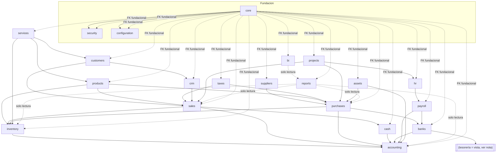

Nota: no existe schema `tesoreria` en esta base de datos — es
completamente una capa de proyección de solo lectura sobre `cash` +
`banks` + `customers` + `suppliers`, resuelta con vistas (ver
[24_views.sql](./sql/24_views.sql)), consistente con
[04-catalogo-modulos-negocio.md](../architecture/04-catalogo-modulos-negocio.md#tesoreria-vs-caja--bancos-por-qué-son-módulos-distintos).

## 3. Core

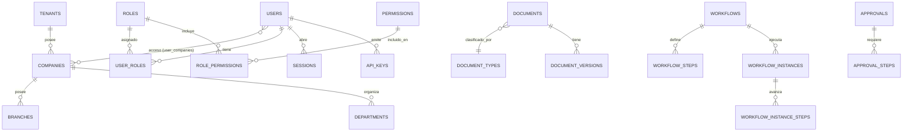

## 4. Security

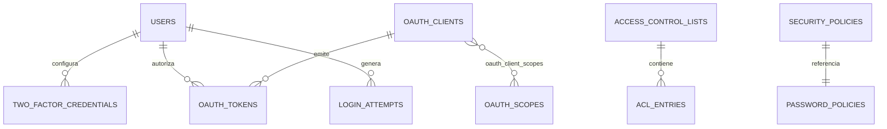

## 5. Customers

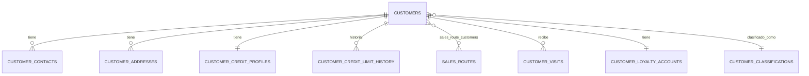

## 6. Suppliers

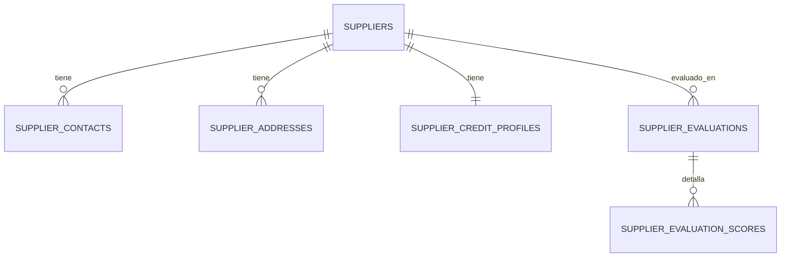

## 7. Products

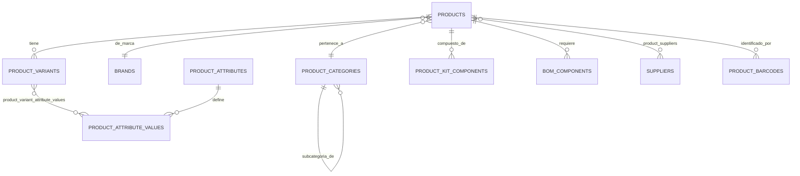

## 8. Inventory

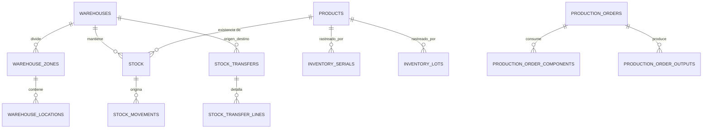

## 9. Sales

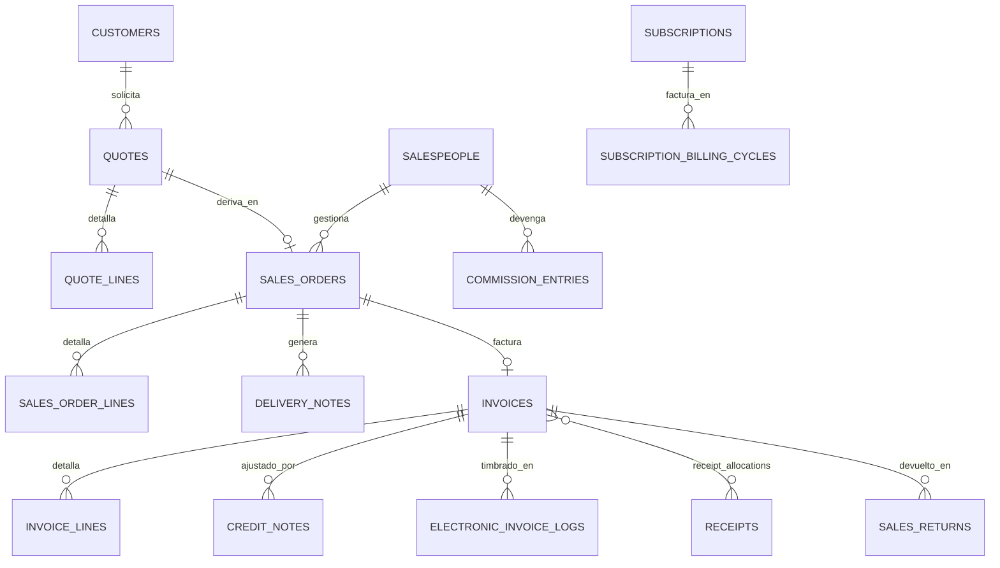

## 10. Purchases

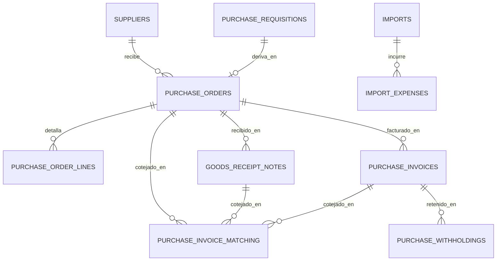

## 11. Cash

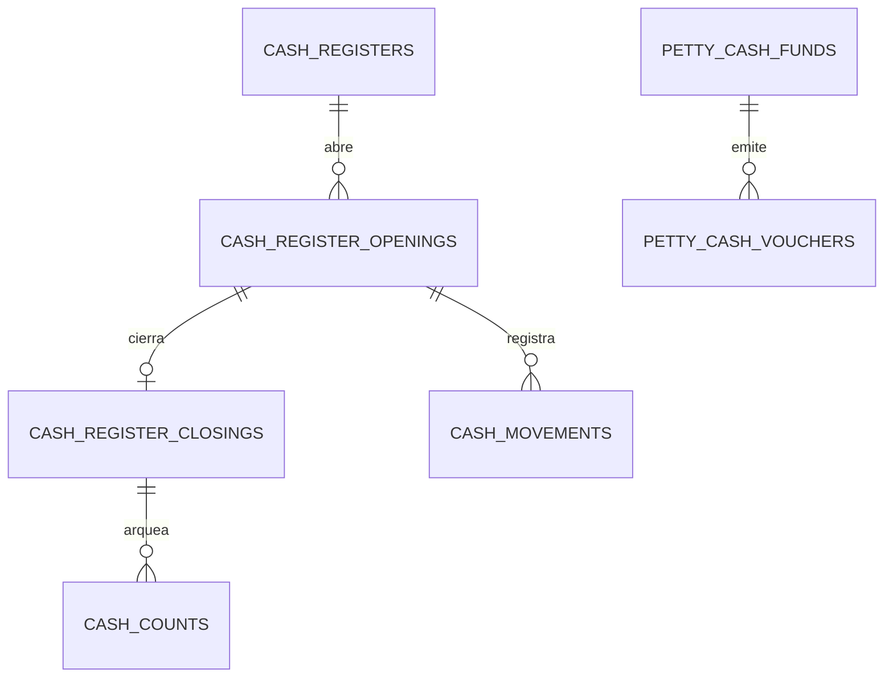

## 12. Banks

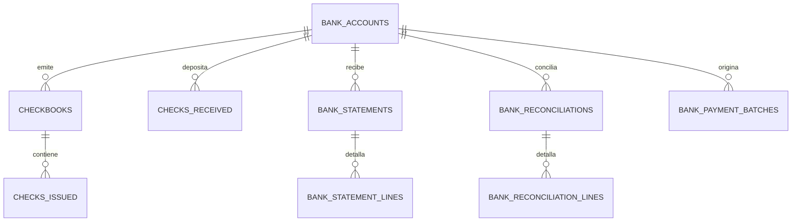

## 13. Accounting

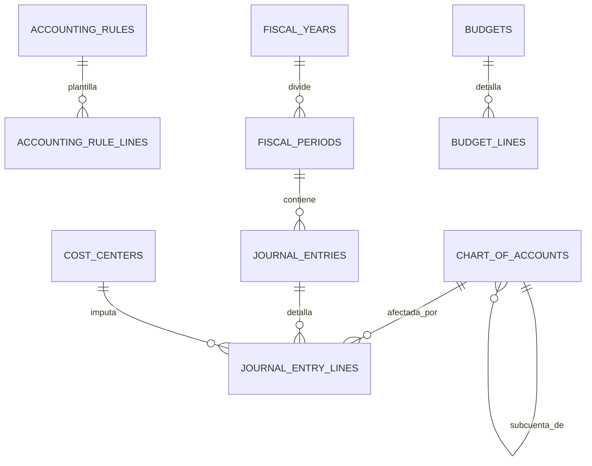

## 14. Taxes

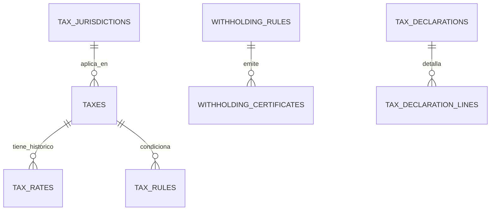

## 15. CRM

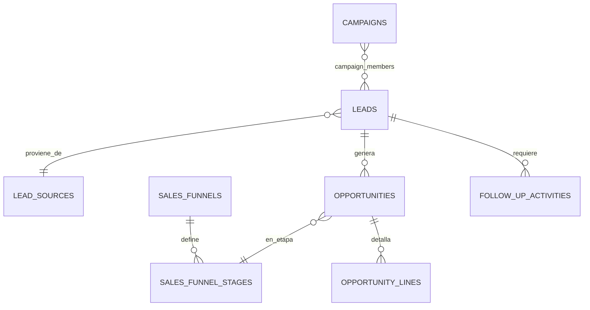

## 16. HR

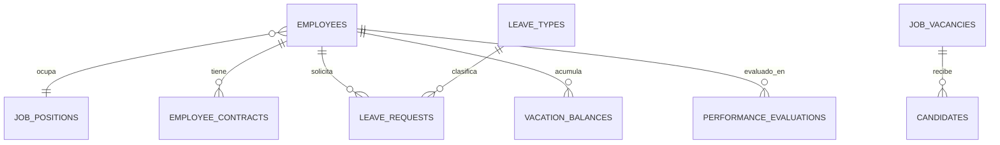

## 17. Payroll

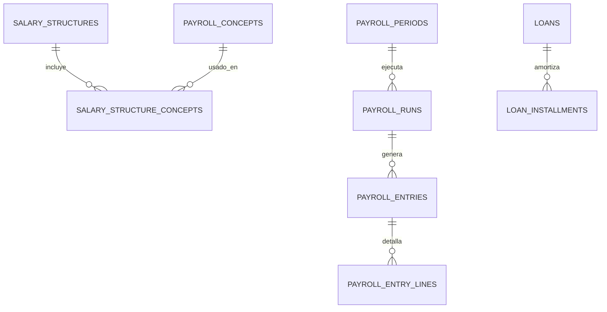

## 18. Services

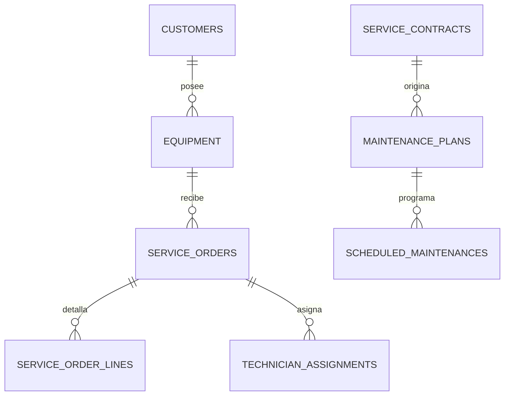

## 19. Projects

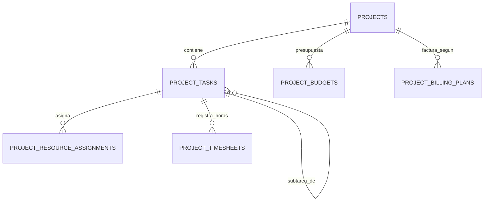

## 20. Assets

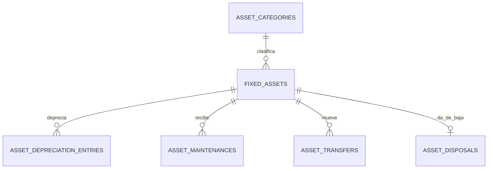

## 21. Reports & BI

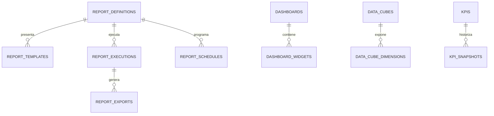

## 22. Configuration

```mermaid
erDiagram
    COUNTRIES ||--o{ STATE_PROVINCES : divide
    STATE_PROVINCES ||--o{ MUNICIPALITIES : divide
    CURRENCIES ||--o{ EXCHANGE_RATES : cotiza
    NUMBERING_SERIES ||--|| CORRELATIVES : controla
    PRICE_LISTS ||--o{ PRICE_LIST_ITEMS : detalla
```
