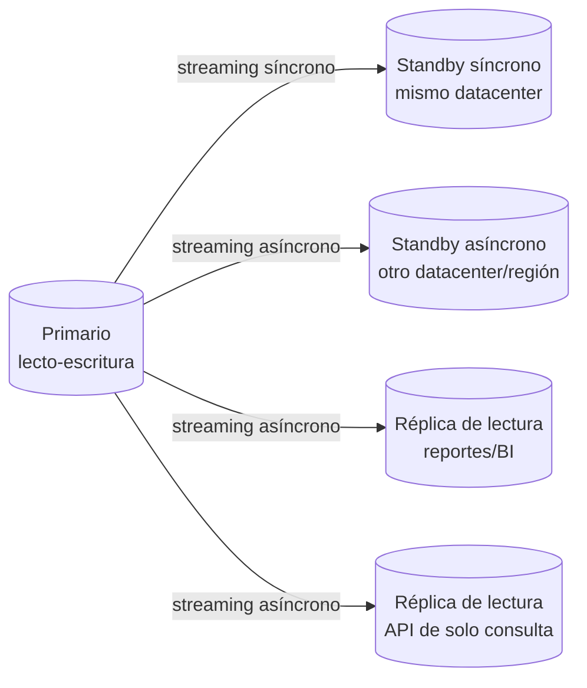

# 09 — Estrategia de Replicación

## 1. Dos tipos de replicación, dos propósitos distintos

| Tipo                                             | Propósito                                                                                                                                  | Consumidor                                                                                                 |
| ------------------------------------------------ | ------------------------------------------------------------------------------------------------------------------------------------------ | ---------------------------------------------------------------------------------------------------------- |
| Replicación física (streaming, WAL)              | Standby para failover (alta disponibilidad) + réplicas de solo lectura para escalar consultas                                              | Ver [10-estrategia-alta-disponibilidad.md](./10-estrategia-alta-disponibilidad.md); módulos `reports`/`bi` |
| Replicación lógica (selectiva, por tabla/schema) | Alimentar el modelo analítico de `bi` sin competir con el tráfico transaccional, e integraciones externas (CDC hacia sistemas de terceros) | `bi.data_mart_tables`, integraciones vía `core.webhook_subscriptions`/EDI                                  |

## 2. Topología física

- **Standby síncrono** (mismo datacenter/zona de disponibilidad): usado
  para failover automático de RPO≈0 — el commit del primario no se
  confirma al cliente hasta que el standby síncrono lo recibió (`synchronous_commit = on`,
  `synchronous_standby_names` apuntando a este nodo).
- **Standby asíncrono en otra región**: protección ante falla de región
  completa. Acepta RPO no-cero (segundos) a cambio de no penalizar la
  latencia de escritura del primario con la distancia geográfica.
- **Réplicas de lectura**: asíncronas, dedicadas a `reports`/`bi` y a
  cualquier endpoint de la API marcado explícitamente como solo-lectura
  (listados, dashboards). El rol `gorazus_readonly` (ver
  [06-estrategia-seguridad.md §2](./06-estrategia-seguridad.md#2-roles-de-base-de-datos-privilegio-mínimo))
  se conecta exclusivamente acá, nunca al primario — esto es lo que
  evita que un reporte pesado de fin de mes degrade el checkout de POS
  en producción.

## 3. Replicación lógica selectiva para BI

En vez de que `bi` consulte réplicas físicas completas (que cargan el
mismo peso transaccional que el primario, solo que en otro nodo),
`bi.data_mart_tables` se alimenta de **replicación lógica** de
únicamente las tablas/columnas que el modelo analítico necesita, hacia
una instancia separada optimizada para lectura analítica (índices
distintos, sin necesidad de baja latencia de escritura). Esto:

- Aísla completamente la carga analítica pesada (scans grandes,
  agregaciones) de cualquier impacto en el primario transaccional.
- Permite que la instancia analítica tenga un schema físico distinto
  (desnormalizado/columnar-friendly) sin afectar el modelo
  transaccional normalizado que el resto del sistema necesita.

## 4. Monitoreo de replication lag

Toda réplica (física o lógica) expone su lag (`pg_stat_replication`,
`pg_stat_subscription`) a las métricas de observabilidad. Umbrales de
alerta:

| Réplica                           | Lag aceptable                           | Acción si se excede                                                                                                                            |
| --------------------------------- | --------------------------------------- | ---------------------------------------------------------------------------------------------------------------------------------------------- |
| Standby síncrono                  | Prácticamente 0 (bloqueante por diseño) | Alerta inmediata — indica problema de red/disco                                                                                                |
| Standby asíncrono (otra región)   | < 30 segundos                           | Alerta si > 2 minutos sostenido                                                                                                                |
| Réplicas de lectura (reportes/BI) | < 60 segundos                           | Alerta si > 5 minutos; el `TenantInterceptor` puede degradar a "leer del primario" temporalmente si el lag es crítico y el endpoint lo permite |

## 5. Qué NO se replica

Las tablas de `security` con secretos cifrados (`integration_credentials`,
`data_encryption_keys`) replican igual que el resto (la réplica también
está cifrada en reposo, ver
[06-estrategia-seguridad.md §3](./06-estrategia-seguridad.md#3-cifrado)),
pero **no** se exponen nunca a través de la réplica de lectura de
`reports`/`bi` — el rol `gorazus_readonly` no tiene `GRANT` sobre el
schema `security` en ninguna instancia, primaria o réplica.

## 6. Notas de portabilidad

Streaming replication física es un mecanismo nativo de Postgres.
MySQL/MariaDB tienen replicación (asíncrona, semisíncrona, o Group
Replication) con configuración distinta pero el mismo objetivo. SQL
Server usa Always On Availability Groups. La replicación lógica
selectiva por tabla es más directa en Postgres (`PUBLICATION`/
`SUBSCRIPTION` nativos) que en los otros motores, donde suele requerir
una herramienta de CDC externa (Debezium) incluso para el caso nativo —
si se porta, esta pieza probablemente termine usando la misma
herramienta de CDC en los cuatro motores por consistencia operativa.
