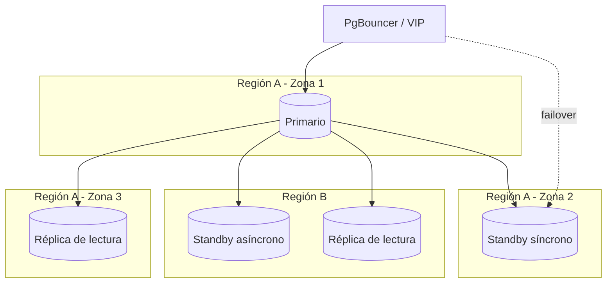

# 10 — Estrategia de Alta Disponibilidad

## 1. Objetivo de servicio

| Métrica                                                | Objetivo                                                                                                       |
| ------------------------------------------------------ | -------------------------------------------------------------------------------------------------------------- |
| Disponibilidad (SLA)                                   | 99.9% mensual (≈ 43 minutos de indisponibilidad/mes) para el primario transaccional                            |
| RTO (Recovery Time Objective) — falla de nodo primario | < 60 segundos (failover automático)                                                                            |
| RTO — falla de región completa                         | < 15 minutos (failover manual asistido a standby asíncrono de otra región)                                     |
| RPO (Recovery Point Objective) — falla de nodo         | 0 (standby síncrono, ver [09-estrategia-replicacion.md §2](./09-estrategia-replicacion.md#2-topología-física)) |
| RPO — falla de región completa                         | < 30 segundos (standby asíncrono)                                                                              |

## 2. Orquestación de failover

Failover del primario **automático**, gestionado por un orquestador de
cluster (Patroni sobre etcd/Consul como almacén de consenso distribuido)
— no manual y no dependiente de que una persona esté despierta a las
3am. Patroni:

- Monitorea salud del primario continuamente.
- Ante falla confirmada (no un simple timeout de red — se exige
  confirmación de quórum para evitar split-brain), promueve el standby
  síncrono a primario.
- Reconfigura automáticamente a los demás standbys para replicar del
  nuevo primario.

## 3. El pool de conexiones como capa de indirección

`apps/api` **nunca** se conecta directo a la IP del primario — se
conecta a través de **PgBouncer** (o equivalente) apuntando a un
nombre/VIP gestionado por el orquestador. Esto es lo que permite que un
failover sea transparente para la aplicación: PgBouncer redirige las
conexiones nuevas al nuevo primario en segundos, sin necesitar
redeploy ni cambio de configuración en `apps/api`. Las conexiones en
vuelo durante el failover fallan (inevitable) y se reintentan según la
política de reintento de la capa HTTP — no hay transacciones "medio
aplicadas" gracias a que Postgres es transaccional por diseño.

## 4. Topología multi-zona / multi-región

- Primario y standby síncrono en zonas de disponibilidad **distintas**
  dentro de la misma región (protege contra falla de zona sin pagar la
  latencia de una réplica síncrona entre regiones).
- Standby asíncrono en una región secundaria completa (protege contra
  falla de región).
- Réplicas de lectura distribuidas cerca de donde se generan las
  consultas de `reports`/`bi` para minimizar latencia de lectura.

## 5. Qué pasa con RLS y particiones durante un failover

Ninguna de las dos requiere reconfiguración especial: las políticas de
RLS (ver [06-estrategia-seguridad.md](./06-estrategia-seguridad.md)) y
la estructura de particiones (ver
[07-estrategia-particionamiento.md](./07-estrategia-particionamiento.md))
son parte del schema replicado — el standby promovido a primario ya las
tiene, no se recrean.

## 6. Simulacros de desastre (game days)

Trimestral: se ejecuta un failover controlado en un entorno que replica
la topología de producción (no en producción directamente), midiendo
RTO real contra el objetivo y validando que el pool de conexiones
redirige correctamente. El resultado alimenta el runbook de incidentes
— un procedimiento de disaster recovery que nunca se ensayó no es
confiable el día que se necesita de verdad.

## 7. Degradación controlada, no todo-o-nada

Si la capacidad de escritura del primario está comprometida pero las
réplicas de lectura están sanas, la aplicación puede degradar
endpoints no críticos a "solo lectura" (reportes, consultas, dashboard)
manteniendo disponibles los flujos transaccionales esenciales (venta
en POS, por ejemplo) hasta que el primario se recupere — en vez de una
caída total del sistema por un problema parcial.

## 8. Notas de portabilidad

Patroni es específico del ecosistema Postgres (aunque conceptualmente
equivalente a MySQL InnoDB Cluster/Group Replication con MySQL Router,
o a un Availability Group Listener de SQL Server). El patrón de "la
aplicación nunca conoce la IP real, siempre habla con un proxy/VIP" es
universal y se mantiene igual sin importar el motor — es la pieza de
esta estrategia con más valor de reutilización directa al portar.
