# 12 — Arquitectura de Data Warehouse (Plataforma Analítica Enterprise)

> 2026-07-21. Fase 3 de la secuencia de trabajo del usuario (Arquitecto
> Principal), continuando directamente desde
> [FASE2_MOTORES_ENTERPRISE.md](../architecture/FASE2_MOTORES_ENTERPRISE.md).
> **No modifica el modelo OLTP existente** — es una capa nueva,
> puramente aditiva, que **lee** de las 21 schemas transaccionales sin
> escribir en ninguna. Solo documentación — ningún `CREATE TABLE` ni
> código en este documento.

## 0. Alcance — qué ya existe (`bi`/`reports`) y qué falta genuinamente

Antes de diseñar una sola tabla, se verificó contra
[28-modulo-reports-bi.md](../architecture/28-modulo-reports-bi.md) y
[41-modulo-bi.md](../architecture/41-modulo-bi.md) (ambos ✅ completos,
sin gaps abiertos) qué de lo pedido ya existe:

| Pedido en Fase 3                  | Estado real                                                                                                                                                                                                                                                                                    |
| --------------------------------- | ---------------------------------------------------------------------------------------------------------------------------------------------------------------------------------------------------------------------------------------------------------------------------------------------- |
| Business Intelligence, OLAP       | ✅ Ya existe — `bi.data_cubes`/`data_cube_dimensions`/`data_cube_measures` (cubos declarativos)                                                                                                                                                                                                |
| KPIs, Indicadores                 | ✅ Ya existe — jerarquía `bi.kpis`/`indicators`/`metrics` de 3 niveles ([28 §5](../architecture/28-modulo-reports-bi.md#5-kpis--jerarquía-de-tres-niveles-no-una-tabla-aislada))                                                                                                               |
| Dashboards                        | ✅ Ya existe — `reports.dashboards`/`dashboard_widgets` ([28 §4](../architecture/28-modulo-reports-bi.md#4-dashboard--dos-objetos-reales-no-uno))                                                                                                                                              |
| Alertas                           | ✅ Ya existe — `bi.bi_alerts`/`bi_alert_triggers`, umbral unificado sobre KPI/Indicador/Métrica ([28 §5](../architecture/28-modulo-reports-bi.md#5-kpis--jerarquía-de-tres-niveles-no-una-tabla-aislada))                                                                                      |
| Reporting                         | ✅ Ya existe — `reports.report_definitions`/`executions`/`exports`/`schedules` ([28 §1-3](../architecture/28-modulo-reports-bi.md))                                                                                                                                                            |
| Snapshots                         | ✅ Ya existe — `kpi_snapshots`/`indicator_snapshots`/`metric_snapshots`, particionadas mensualmente                                                                                                                                                                                            |
| Materialized Views                | ✅ Ya existe el mecanismo — `bi.data_mart_tables.materialized_view_name` + `refresh_frequency` (referencia por nombre, no dueño del contenido)                                                                                                                                                 |
| Data Marts                        | 🔗 Solo el metadato de referencia (`data_mart_tables`) — **sin las tablas físicas que una vista materializada necesitaría leer con buen rendimiento a escala de millones de filas**                                                                                                            |
| Forecast                          | 🔗 Solo la forma del dato (`forecast_models`/`forecasts`) — **el motor de entrenamiento/ML queda explícitamente fuera de alcance por decisión de gobernanza ya tomada** ([41 §4](../architecture/41-modulo-bi.md#4-forecast-mismo-criterio-que-la-fase-27-ia-del-roadmap)), no se revisita acá |
| **Data Warehouse**                | 🆕 **No existe** — hoy toda vista materializada de `bi` lee, se asume, directamente de las tablas transaccionales OLTP; no hay capa dimensional (fact/dimension) intermedia                                                                                                                    |
| **Fact Tables**                   | 🆕 **No existen**                                                                                                                                                                                                                                                                              |
| **Dimension Tables**              | 🆕 **No existen** (conformadas o no)                                                                                                                                                                                                                                                           |
| **ETL / Data Pipeline**           | 🆕 **No existe** — ningún mecanismo de extracción/transformación/carga documentado                                                                                                                                                                                                             |
| **Modelo estrella/copo de nieve** | 🆕 **No definido** — no hay modelo dimensional del cual decidir la forma                                                                                                                                                                                                                       |
| **Carga incremental**             | 🆕 **No definida**                                                                                                                                                                                                                                                                             |
| **Consultas optimizadas**         | 🆕 **No definida** para un contexto analítico (el `04-estrategia-indices.md` existente es para OLTP)                                                                                                                                                                                           |

**Conclusión de alcance:** este documento diseña exactamente los 6
elementos marcados 🆕/🔗 — el resto (BI/OLAP/Reporting/Dashboards/
Alertas/Snapshots/Forecast) **no se rediseña**, se referencia. El
resultado es una capa nueva (schema `warehouse`, propuesto — ver §1)
que se inserta **debajo** de lo que `bi.data_mart_tables` ya apunta,
sin cambiar la interfaz de `bi`/`reports` hacia el resto del sistema.

## 1. Arquitectura general — 4 capas

```mermaid
flowchart LR
    subgraph OLTP["OLTP (21 schemas, sin cambios)"]
        A1[sales.invoices]
        A2[inventory.stock_movements]
        A3[accounting.journal_entries]
        A4["... 18 schemas más"]
    end
    subgraph ETL["ETL / Data Pipeline (nuevo, §6)"]
        B1[Extracción incremental]
        B2[Transformación / conformado]
        B3[Carga]
    end
    subgraph DW["Data Warehouse — schema warehouse (nuevo, §2-3)"]
        C1[Dimension Tables]
        C2[Fact Tables]
    end
    subgraph BI["bi / reports (ya existente, sin cambios de interfaz)"]
        D1[Materialized Views]
        D2[data_cubes / KPIs / Indicators / Metrics]
        D3[Dashboards / Alerts / Forecast]
    end
    OLTP -->|solo lectura| ETL --> DW
    DW -->|refresh_frequency ya existente| D1 --> D2 --> D3
```

**Principio rector, igual que el resto del schema de GORAZUS** (mismo
criterio que
[docs/database/README.md — "Principio rector"](./README.md#principio-rector-de-todo-el-diseño)):
cada decisión de esta capa se mide contra "¿sostiene 100M+ filas
analíticas sin rediseño?" y "¿es reversible?" — el DW es 100%
regenerable desde el OLTP (nunca la única copia de un dato), así que
un error de diseño acá nunca es una pérdida de datos irreversible,
solo una re-carga.

**Nombre de schema propuesto:** `warehouse` — sigue la convención ya
fijada (nombre de schema en inglés, snake_case,
[NAMING_CONVENTIONS.md](../standards/NAMING_CONVENTIONS.md)), un
schema nuevo entre los 21 ya existentes (sería el 22°). No se propone
el SQL de creación acá — el nombre y su contenido conceptual (§2-3)
son lo que se pide diseñar en esta fase.

## 2. Dimension Tables — dimensiones conformadas

"Conformada" (vocabulario Kimball, ya asumido por el pedido explícito
del usuario) significa: la misma dimensión, con las mismas claves y
significado, es reutilizada por múltiples fact tables — nunca una
copia distinta de "cliente" por cada área de negocio. Esto es lo que
permite comparar ventas y cobranza por el mismo cliente sin duplicar
lógica de join.

| Dimensión          | Grano                                        | Fuente OLTP (solo lectura)                                 | Tipo de cambio (SCD)                                                                                                                                                       |
| ------------------ | -------------------------------------------- | ---------------------------------------------------------- | -------------------------------------------------------------------------------------------------------------------------------------------------------------------------- |
| `dim_date`         | 1 fila por día calendario                    | Generada (no viene de OLTP — rango fijo, p. ej. 2020-2035) | N/A — inmutable por diseño                                                                                                                                                 |
| `dim_tenant_scope` | 1 fila por combinación tenant+company+branch | `core.tenants`/`companies`/`branches`                      | **SCD Tipo 2** — una sucursal puede cambiar de nombre/dirección; el histórico de hechos ya cargados debe seguir apuntando a los atributos vigentes en el momento del hecho |
| `dim_customer`     | 1 fila por versión de cliente                | `customers.customers`                                      | **SCD Tipo 2** — cambios de segmento/zona/vendedor asignado son analíticamente relevantes (¿este cliente ya estaba en el segmento X cuando compró?)                        |
| `dim_supplier`     | 1 fila por versión de proveedor              | `suppliers.suppliers`                                      | SCD Tipo 2, mismo criterio                                                                                                                                                 |
| `dim_product`      | 1 fila por versión de producto               | `products.products` + jerarquía de categoría               | SCD Tipo 2 para precio/costo estándar; la jerarquía de categoría es candidata a copo de nieve (§4) si es profunda                                                          |
| `dim_employee`     | 1 fila por versión de empleado               | `hr.employees`                                             | SCD Tipo 2 — cambios de puesto/departamento son analíticamente relevantes para RRHH/Nómina                                                                                 |
| `dim_account`      | 1 fila por cuenta contable                   | `accounting.chart_of_accounts`                             | **SCD Tipo 1** (sobrescribe) — el plan de cuentas es una clasificación, no un hecho histórico en sí mismo; candidata a copo de nieve (jerarquía de cuenta padre/hijo)      |
| `dim_user`         | 1 fila por usuario                           | `core.users`                                               | SCD Tipo 1 — quién procesó la transacción, no cambia el análisis si el usuario luego cambia de rol                                                                         |
| `dim_currency`     | 1 fila por moneda                            | `configuration.currencies`                                 | SCD Tipo 1 — catálogo estable                                                                                                                                              |

**SCD Tipo 1 vs Tipo 2 — regla de decisión aplicada, no arbitraria:**
Tipo 2 (versiona, conserva histórico) cuando el atributo que cambia
**afecta cómo se interpretaría un hecho pasado** (a qué segmento
pertenecía el cliente cuando compró); Tipo 1 (sobrescribe) cuando el
atributo es puramente descriptivo/operativo sin ese peso analítico
(nombre de usuario). Cada dimensión SCD Tipo 2 necesita, conceptualmente,
columnas de vigencia (`effective_from`/`effective_to`/`is_current`) —
**no se proponen como DDL acá**, es la forma esperada del patrón, sin
comprometer nombres exactos de columna a esta fase.

**Todas las dimensiones llevan `tenant_id`** (mismo patrón universal
que toda tabla OLTP, [01-modelo-conceptual.md §1.1](./01-modelo-conceptual.md#11-columnas-universales))
— el Data Warehouse **no es una excepción** al aislamiento multiempresa,
ver §11 (Seguridad).

## 3. Fact Tables — un grano por proceso de negocio medible

Regla Kimball aplicada sin desviación: cada fact table tiene **un
grano declarado explícitamente** (qué representa exactamente una fila)
— ambigüedad de grano es la causa más común de un Data Warehouse que
da números distintos según quién pregunta.

| Fact table                | Grano (1 fila = ...)         | Fuente OLTP                                            | Medidas (tipo)                                                                                                                                                            |
| ------------------------- | ---------------------------- | ------------------------------------------------------ | ------------------------------------------------------------------------------------------------------------------------------------------------------------------------- |
| `fact_sales`              | 1 línea de factura de venta  | `sales.invoices` + líneas                              | `quantity`, `unit_price`, `line_total` (**aditivas** — suman correctamente en cualquier corte); `discount_pct` (**no aditiva** — nunca sumar, solo promediar con cuidado) |
| `fact_purchases`          | 1 línea de factura de compra | `purchases.purchase_invoices`                          | Igual patrón que `fact_sales`                                                                                                                                             |
| `fact_inventory_movement` | 1 movimiento de stock        | `inventory.stock_movements` (ya particionada en OLTP)  | `quantity_delta` (aditiva, con signo), `unit_cost` (**semi-aditiva** — aditiva en el tiempo, no aditiva a través de productos distintos)                                  |
| `fact_cash_movement`      | 1 movimiento de caja         | `cash.cash_movements` (ya particionada en OLTP)        | `amount` (aditiva, con signo por tipo de movimiento)                                                                                                                      |
| `fact_accounting_journal` | 1 línea de asiento contable  | `accounting.journal_entries` (ya particionada en OLTP) | `debit_amount`, `credit_amount` (aditivas — deben cuadrar por diseño contable, ya validado en OLTP)                                                                       |
| `fact_hr_attendance`      | 1 registro de asistencia     | `hr.attendance_records` (ya particionada en OLTP)      | `hours_worked` (aditiva)                                                                                                                                                  |

**Por qué estos 6 y no más:** son los procesos de negocio con **mayor
volumen transaccional real** (todas sus fuentes ya están particionadas
en OLTP por ese mismo motivo, ver
[07-estrategia-particionamiento.md §1](./07-estrategia-particionamiento.md#1-qué-se-particiona-y-qué-no)) —
mismo criterio de "alcance real, no simetría" ya aplicado en todo el
proyecto: no se diseña `fact_crm`/`fact_projects`/etc. especulativamente
sin que un caso de uso de reporting real lo pida primero. Agregar una
fact table nueva más adelante es aditivo (no rompe las existentes),
consistente con el principio rector de §1.

**Claves foráneas de una fact table siempre son claves subrogadas
(surrogate keys) hacia las dimensiones, nunca el UUID de negocio
directamente** — un entero secuencial propio del Data Warehouse,
generado al cargar cada dimensión. Motivo, no solo convención Kimball:
un `JOIN` de una fact table de cientos de millones de filas contra una
dimensión es sensiblemente más rápido con un entero de 4-8 bytes que
con un UUID de 16 bytes — la razón de rendimiento real detrás de
`local_id BigInt` que el modelo OLTP ya usa para el mismo propósito en
otro contexto ([11-estrategia-integridad.md §2.1](./11-estrategia-integridad.md#21-por-qué-uuid-y-no-bigserial-como-pk)) —
se reutiliza el mismo criterio, no se inventa uno nuevo.

## 4. Modelo estrella vs. copo de nieve — criterio de decisión, no dogma

**Por defecto: estrella (star schema)** — cada fact table conectada
directamente a sus dimensiones, dimensiones desnormalizadas (todos los
atributos de una jerarquía aplanados en la misma fila). Es la opción
correcta por defecto porque minimiza `JOIN`s en las consultas
analíticas más comunes (agrupar ventas por región, sin tener que
atravesar 3 niveles de tabla de zona→región→país).

**Copo de nieve (snowflake) solo donde hay una razón concreta, dos
casos identificados:**

1. **`dim_product` → jerarquía de categoría.** Si la jerarquía de
   categorías de producto es profunda y cambia con frecuencia
   independiente del producto en sí (agregar/reorganizar categorías
   sin que eso implique un cambio real de cada producto), normalizarla
   en una tabla `dim_product_category` aparte evita reescribir millones
   de filas de `dim_product` cada vez que se reorganiza el árbol de
   categorías — el costo de un `JOIN` extra es menor que el costo de
   reescritura masiva.
2. **`dim_account` → plan de cuentas jerárquico.** Mismo argumento —
   el plan de cuentas contable es una jerarquía real (cuenta padre/
   hija) que cambia por decisión administrativa, no por cada
   transacción — normalizarla evita el mismo problema de reescritura.

**El resto de las dimensiones de §2 se mantienen en estrella pura** —
no se snowflakea `dim_customer`/`dim_supplier`/`dim_employee` porque
sus atributos (zona, segmento, departamento) cambian a la misma
cadencia que la entidad misma, sin la ventaja de reescritura que
justifica el copo de nieve en los 2 casos de arriba.

## 5. Data Marts — organización por área de negocio

Un Data Mart, en este diseño, **no es una copia física separada** del
Data Warehouse — es un **subconjunto lógico** de fact/dimension tables
relevante a un área de negocio, expuesto como el conjunto de vistas
materializadas que `bi.data_mart_tables` ya referencia por nombre (el
mecanismo de referencia no cambia, solo lo que hay detrás de cada
nombre).

| Data Mart  | Fact tables incluidas                           | Dimensiones compartidas                                                   |
| ---------- | ----------------------------------------------- | ------------------------------------------------------------------------- |
| Ventas     | `fact_sales`                                    | `dim_date`, `dim_tenant_scope`, `dim_customer`, `dim_product`, `dim_user` |
| Compras    | `fact_purchases`                                | `dim_date`, `dim_tenant_scope`, `dim_supplier`, `dim_product`, `dim_user` |
| Inventario | `fact_inventory_movement`                       | `dim_date`, `dim_tenant_scope`, `dim_product`                             |
| Finanzas   | `fact_cash_movement`, `fact_accounting_journal` | `dim_date`, `dim_tenant_scope`, `dim_account`, `dim_currency`             |
| RRHH       | `fact_hr_attendance`                            | `dim_date`, `dim_tenant_scope`, `dim_employee`                            |

Un Data Mart de "Rentabilidad" (cruzando Ventas + Compras + Inventario)
es posible sin tabla nueva — es exactamente el tipo de consulta que un
modelo dimensional conformado (dimensiones compartidas) habilita, sin
necesitar una fact table combinada especial.

## 6. ETL / Data Pipeline

**Arquitectura de 3 etapas, reutilizando infraestructura ya diseñada
en vez de inventar una nueva:**

1. **Extracción** — lee de una **réplica de lectura** del OLTP
   ([09-estrategia-replicacion.md](./09-estrategia-replicacion.md),
   ya diseñada explícitamente "para BI, Reportes" — este es exactamente
   ese caso de uso, no uno nuevo), nunca del primario de escritura —
   una carga analítica pesada no debe competir por recursos con
   transacciones de negocio en curso.
2. **Transformación** — resuelve claves subrogadas (busca o crea la
   fila de dimensión correspondiente al UUID de negocio del origen),
   aplica las reglas de SCD Tipo 1/2 de §2, y calcula medidas derivadas
   si aplica (p. ej. `line_total` si no viniera ya calculado en origen).
   Ejecuta como trabajo asíncrono vía `Background Jobs`
   ([32-core-platform/08 §6](../architecture/32-core-platform/08-frameworks-de-infraestructura.md#6-background-jobs) —
   ya diseñado, reutilizado sin cambios, no un motor de ETL nuevo).
3. **Carga** — `INSERT` a la fact/dimension table correspondiente
   (nunca `UPDATE` de una fila de fact ya cargada — un hecho de negocio
   es inmutable una vez ocurrido; una corrección se modela como una
   fila de ajuste nueva, mismo principio contable de "nunca reescribir
   el pasado" que `accounting.journal_entries` ya sigue en OLTP).

**Orquestación:** un job programado por `Scheduler`
([32-core-platform/08 §5](../architecture/32-core-platform/08-frameworks-de-infraestructura.md#5-scheduler),
ya diseñado) por cada fact table, a la cadencia declarada en
`bi.data_mart_tables.refresh_frequency` (columna ya existente,
reutilizada — no se propone una nueva). No se diseña un motor de
orquestación de pipeline propio (tipo Airflow) — `Scheduler` +
`Background Jobs`, ya existentes, son suficientes para la cadencia de
refresco de un ERP transaccional (horaria/diaria), no para
streaming en tiempo real, que no está en el alcance pedido.

## 7. Carga incremental

**Mecanismo: watermark sobre `updated_at`, sin CDC de bajo nivel.**
Cada tabla OLTP ya tiene `updated_at`/`row_version` (columnas
universales, [01-modelo-conceptual.md §1.1](./01-modelo-conceptual.md#11-columnas-universales)) —
la carga incremental de cada fact/dimension table guarda la marca de
tiempo (`watermark`) de la última fila procesada exitosamente y, en la
corrida siguiente, extrae solo `WHERE updated_at > watermark` de la
fuente. Se elige este mecanismo — no un CDC de bajo nivel basado en
WAL/logical replication de Postgres — porque el modelo universal ya
provee la columna necesaria en las 501 tablas sin excepción; agregar
CDC real sería infraestructura nueva no justificada cuando el dato que
se necesita ya existe.

**Caso especial — borrado lógico:** una fila con `deleted_at` recién
fijado también cuenta como "cambiada" (`updated_at` se actualiza al
marcar el borrado, por el trigger `core.fn_set_audit_fields` ya
existente) — el pipeline la captura igual que cualquier otro cambio y
decide, según la fact/dimension, si excluir el hecho o marcarlo como
anulado (nunca lo elimina físicamente del Data Warehouse — el DW
preserva historia incluso de datos ya borrados en OLTP, es
precisamente uno de sus propósitos).

**Primera carga (full load):** sin watermark previo, se procesa el
100% de la fuente una sola vez — operación pesada, se ejecuta fuera de
horario de negocio, mismo criterio operativo que cualquier backup
completo inicial.

## 8. Particionamiento

**Las fact tables de mayor volumen se particionan por rango de fecha,
mismo mecanismo `pg_partman` ya en uso para el particionamiento OLTP**
([07-estrategia-particionamiento.md](./07-estrategia-particionamiento.md) —
no se diseña un mecanismo de particionamiento nuevo): `fact_sales`,
`fact_purchases`, `fact_inventory_movement`, `fact_cash_movement`,
`fact_accounting_journal`, `fact_hr_attendance` — las 6, particionadas
por su columna de fecha de negocio (vía la `dim_date` correspondiente,
o una columna de fecha propia en la fact table para poder particionar
sin depender de un `JOIN`). Las dimension tables **no se particionan**
— su volumen (miles a cientos de miles de filas, no millones) no lo
justifica, mismo criterio ya usado para decidir qué se particiona en
OLTP (`07 §1`).

## 9. Retención e históricos

**El Data Warehouse retiene más tiempo que el OLTP operativo, por
diseño** — un análisis de tendencia a 5 años necesita datos que el
OLTP puede haber archivado/purgado por su propia política operativa
(`core.data_retention_policies`, ya existente,
[07-estrategia-particionamiento.md §6](./07-estrategia-particionamiento.md#6-retención-y-archivado)).
Cada fact table registra su propia fila en esa misma tabla de
políticas (mecanismo genérico ya existente, reutilizado sin cambios) —
con una ventana de retención propia, típicamente más larga que la de
su tabla OLTP de origen (p. ej. `inventory.stock_movements` puede
archivar en frío a los 2 años en OLTP; `fact_inventory_movement`
conserva el detalle analítico por 7 años o el plazo que la política
fiscal/de negocio del tenant exija). Igual mecanismo de archivado
(`DETACH PARTITION` + frío, nunca `DELETE` fila por fila) ya
documentado — no se repite el procedimiento acá.

## 10. Materialized Views — relación con lo ya existente

`bi.data_mart_tables.materialized_view_name` **no cambia de forma**
— sigue siendo una referencia por nombre a una vista materializada
real. Lo que cambia es **de dónde lee esa vista**: hoy (asumido, sin
capa intermedia) leería directo de tablas OLTP; con el Data Warehouse
en su lugar, la vista materializada se redefine para leer de las
fact/dimension tables de `warehouse` — consulta más simple (ya
conformada, ya con claves subrogadas resueltas) y más rápida (aislada
de la carga transaccional del OLTP primario, gracias a §6.1). **Este
documento no rediseña el mecanismo de `data_mart_tables` en sí** —
sigue siendo el mismo, solo con una fuente mejor detrás.

## 11. Consultas optimizadas

- **Claves subrogadas enteras** en toda fact table (§3) — el motivo de
  rendimiento principal, ya justificado.
- **Índices compuestos `(fecha, dimensión)`** en cada fact table para
  los cortes más comunes (ventas por región por mes, por ejemplo) —
  mismo criterio de "indexar por patrón de consulta real, no por cada
  columna" ya fijado en
  [04-estrategia-indices.md](./04-estrategia-indices.md), aplicado acá
  al contexto analítico.
- **Partition pruning automático** (§8) — una consulta que filtra por
  rango de fecha reciente nunca escanea particiones históricas, mismo
  beneficio que ya se mide en las tablas OLTP particionadas.
- **Vistas materializadas pre-agregadas** (§10, ya existente) para los
  cortes de mayor consulta repetida (KPI mensual, por ejemplo) — evita
  re-agregar millones de filas de fact table en cada request de
  dashboard.

## 12. KPIs, Indicadores, Dashboards, Alertas, Forecast — sin rediseño

Los 5 ya tienen diseño completo y estable
([28-modulo-reports-bi.md §4-6](../architecture/28-modulo-reports-bi.md),
[41-modulo-bi.md](../architecture/41-modulo-bi.md)) — este documento no
les agrega ni les quita nada. Su beneficio real de esta fase es
indirecto: una vez que `bi.data_mart_tables` apunte a vistas
materializadas sobre el Data Warehouse (§10) en vez de directo a OLTP,
los KPIs/Indicadores/Métricas que se calculan sobre esas vistas son
más rápidos de refrescar y más consistentes entre sí (misma fuente
conformada, mismas claves de dimensión) — sin que su propia
arquitectura (§5 de `28`) cambie una sola tabla o interfaz.

**Forecast, explícitamente sin ML:** el Data Warehouse se convierte en
una fuente de datos históricos limpia y consistente para cuando exista
necesidad de negocio confirmada de entrenar un modelo real — pero
diseñar ese motor de entrenamiento sigue **fuera de alcance por la
misma decisión de gobernanza ya tomada** (`41 §4`, Fase 27 del roadmap
sin alcance definido). No se revisita esa decisión en este documento.

## 13. Seguridad, auditoría y permisos

- **RLS se extiende al Data Warehouse sin excepción** — cada
  fact/dimension table lleva `tenant_id` (§2) y hereda la misma
  política `tenant_isolation` + `FORCE ROW LEVEL SECURITY` ya verificada
  en el resto del sistema
  ([11-estrategia-integridad.md §6](./11-estrategia-integridad.md#6-integridad-transaccional--multiempresa--rls-como-mecanismo-de-integridad)) —
  un Data Warehouse que agregara datos de negocio sin aislamiento por
  tenant sería una fuga de datos entre empresas al nivel analítico,
  el mismo riesgo que RLS ya previene a nivel operativo.
- **Permisos:** consultar el Data Warehouse (vía `bi`/`reports`, sin
  acceso directo de ningún módulo de negocio al schema `warehouse`)
  requiere el mismo permiso que ya exige el reporte/dashboard/cubo que
  lo consulta — no se agrega un nivel de permiso nuevo, se hereda el
  existente. El proceso de ETL corre con un `Security Context` de
  sistema explícito y auditable, mismo criterio que `Scheduler` ya
  aplica ([32-core-platform/08 §5](../architecture/32-core-platform/08-frameworks-de-infraestructura.md#5-scheduler)) —
  nunca con privilegios de un usuario real.
- **Auditoría:** cada corrida de carga (inicio, filas procesadas, éxito/
  fallo, watermark alcanzado) es un evento de dominio
  (`warehouse.load.completed`/`warehouse.load.failed`), consumido por
  `Audit Framework` y `Notification Center` (alerta si una carga crítica
  falla) — mismo patrón ya usado por `Scheduler`/`Background Jobs`.

## 14. Escalabilidad

- **Independencia de carga del OLTP primario** (§6.1, lee de réplica) —
  una consulta analítica pesada nunca compite por recursos con una
  venta en curso.
- **Particionamiento** (§8) permite que el volumen de la fact table más
  grande (`fact_sales`, previsiblemente) crezca a cientos de millones
  de filas sin degradar consultas sobre el período reciente.
- **Regenerable por diseño** (§1) — el Data Warehouse nunca es la única
  copia de un dato; ante corrupción o error de carga, se puede
  reconstruir desde el OLTP + históricos archivados en frío (§9), sin
  riesgo de pérdida permanente.
- **Escala horizontal del propio ETL** — cada fact table carga de forma
  independiente (`Background Jobs` ya escala por profundidad de cola,
  `32-core-platform/08 §6`), sin un cuello de botella de un único
  proceso monolítico de carga.

## 15. Trazabilidad

| Punto pedido en la Fase 3                                | Cerrado en                                                        |
| -------------------------------------------------------- | ----------------------------------------------------------------- |
| Data Warehouse, OLAP, BI, Reporting, Forecast, Analytics | §0 (mapeo completo)                                               |
| Fact Tables                                              | §3                                                                |
| Dimension Tables                                         | §2                                                                |
| Snapshots                                                | §0 (ya existe), §9 (históricos del DW)                            |
| KPIs, Indicadores                                        | §0 (ya existe), §12                                               |
| Materialized Views                                       | §10                                                               |
| Data Marts                                               | §5                                                                |
| ETL, Data Pipeline                                       | §6                                                                |
| Dashboards, Alertas                                      | §0 (ya existe), §12                                               |
| Modelo estrella, Modelo copo de nieve                    | §4                                                                |
| Particionamiento                                         | §8                                                                |
| Retención                                                | §9                                                                |
| Carga incremental                                        | §7                                                                |
| Consultas optimizadas                                    | §11                                                               |
| No modificar el modelo OLTP existente                    | §0-14 — 0 tablas OLTP tocadas, solo lectura vía réplica (§6.1)    |
| Solo documentación, sin SQL, sin código                  | Confirmado — ningún archivo `sql/*.sql` ni `.ts` creado o editado |
