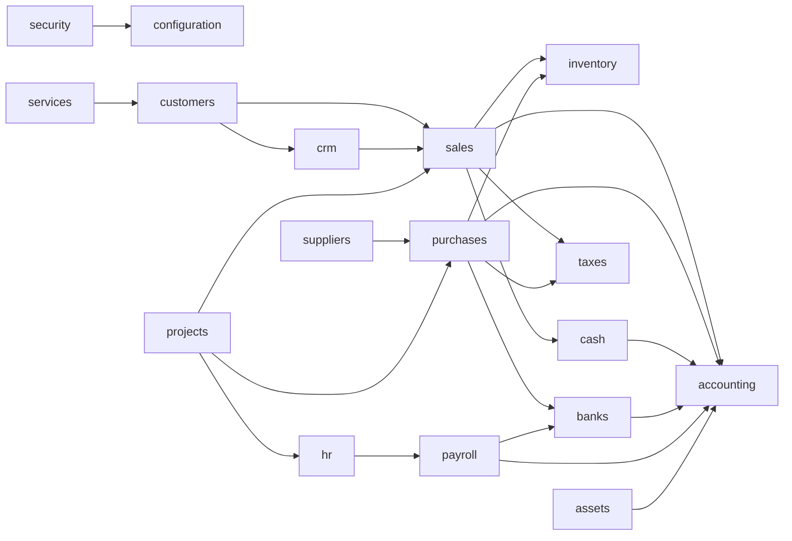

# Database Dependencies — GORAZUS

> Generado 2026-07-16 como parte del EPIC "Database Visualization Environment".
> Traduce el grafo de dependencias entre **módulos** ya fijado en
> `docs/architecture/04-catalogo-modulos-negocio.md` a dependencias entre **schemas**
> físicos de Postgres, y lo verifica contra las FKs y referencias por ID sueltas
> reales de la base de datos. No repite el diseño (ese vive en el documento de
> arquitectura), solo lo confirma contra el estado real.

## 1. Regla de dependencia (referencia, ya fijada)

Ninguna FK de Postgres **debería** cruzar schemas de módulos de negocio distintos —
`docs/architecture/02-arquitectura-modulos-backend.md §4`,
`docs/database/01-modelo-conceptual.md §1.5`. Las dependencias reales entre módulos
de negocio deberían viajar como **ID suelto sin FK** (`sales.invoices.customer_id`
sin `REFERENCES customers.customers`),

> **Corrección (2026-07-17, PHASE 01 — Database Enterprise):** la afirmación
> original de este párrafo — "0 FK con `confrelid` en un schema de negocio distinto,
> verificado" — **no estaba realmente verificada**, se asumió a partir de la regla
> documentada sin confirmarla contra `pg_constraint`. Verificado ahora: **existen
> 185 FK reales que cruzan schemas de módulos de negocio distintos**
> (`inventory→products`, `crm→customers`, `sales→customers`, y 17 pares más) — un
> incumplimiento real de esta regla, no una excepción aislada. Detalle completo,
> tabla por par de schemas, y por qué no se corrige en esta fase (cambio de alto
> riesgo, requiere ADR):
> [FOREIGN_KEYS.md §3](./FOREIGN_KEYS.md#3-hallazgo-real-185-fk-cruzan-schemas-de-módulos-de-negocio).
> Las FK universales hacia `core.*` (3,573 de las 3,631+ reales) siguen siendo la
> excepción válida por diseño — `core` es fundacional, no un módulo de negocio par.
> exactamente como está documentado.

## 2. Dependencias críticas (síncronas, in-process)

Traducción directa del grafo de `04-catalogo-modulos-negocio.md §Mapa de
dependencias` a nombres de schema (ver
[NAMING_CONVENTIONS.md §5](../standards/NAMING_CONVENTIONS.md#5-mapeo-módulo-español--schema-inglés)):

**Dependencias críticas** (si el schema origen no puede resolver el dato, el flujo de
negocio se bloquea, no solo se degrada): `sales → inventory` (verificar stock antes de
confirmar), `sales/purchases → taxes` (cálculo de impuesto en cada documento),
`payroll → hr` (no hay liquidación sin datos de empleado). El resto son dependencias
de propagación (contable, bancaria) que toleran demora vía eventos (§3).

## 3. Dependencias asíncronas (eventos de dominio)

No modeladas como FK — viajan por RabbitMQ, ver
`docs/architecture/06-comunicacion-entre-modulos.md §1b`. Las de mayor volumen
esperado, dado el conteo real de triggers/tablas append-only:

| Evento (origen)                         | Consumidores                      | Tablas de alto volumen involucradas (particionadas, ver §4)                 |
| --------------------------------------- | --------------------------------- | --------------------------------------------------------------------------- |
| `VentaConfirmada` (`sales`)             | `inventory`, `accounting`, `cash` | `sales.invoices`, `inventory.stock_movements`, `accounting.journal_entries` |
| `FacturaCompraRegistrada` (`purchases`) | `accounting`, `banks`             | `purchases.purchase_invoices`                                               |
| `NominaLiquidada` (`payroll`)           | `accounting`, `banks`             | —                                                                           |

## 4. Tablas particionadas y su dependencia de mantenimiento (hallazgo real)

Las 27 tablas particionadas (`activity_logs`, `audit_logs`, `cash_movements`,
`invoices`, `journal_entries`, `purchase_invoices`, `stock_movements`, etc. — lista
completa en `docs/database/07-estrategia-particionamiento.md`) dependen de un
mecanismo de aprovisionamiento de particiones (job/función) que a la fecha de este
documento **no ha corrido ni una vez** — ver
[DATABASE_HEALTH_REPORT.md §1](./DATABASE_HEALTH_REPORT.md#1-hallazgos-críticos). Esto
significa que **todo módulo que escriba en una tabla particionada depende
transitivamente de ese mecanismo**, aunque no aparezca como dependencia de negocio en
el grafo de §2 — es una dependencia de infraestructura transversal no modelada antes
en ningún diagrama de arquitectura.

## 5. Verificación de integridad referencial

- **0 FK en estado `NOT VALID`** — las 3,631 FK reales están validadas contra los
  datos existentes (`DATABASE_STRUCTURE.md §3`).
- **0 tablas completamente aisladas** (sin ninguna FK entrante ni saliente) — cada
  una de las 501 tablas participa en al menos una relación, consistente con el patrón
  "módulo dueño" (`docs/architecture/06-comunicacion-entre-modulos.md §4`) donde toda
  entidad tiene al menos las FK universales hacia `core`.

## 6. Trazabilidad

| Punto                                         | Ya fijado en                                         | Verificado/traducido acá                                         |
| --------------------------------------------- | ---------------------------------------------------- | ---------------------------------------------------------------- |
| Grafo de dependencias entre módulos           | `docs/architecture/04-catalogo-modulos-negocio.md`   | Traducido a nombres de schema (§2)                               |
| Comunicación entre módulos (2 formas válidas) | `docs/architecture/06-comunicacion-entre-modulos.md` | Aplicado a eventos de alto volumen reales (§3)                   |
| Estrategia de particionamiento                | `docs/database/07-estrategia-particionamiento.md`    | Nueva dependencia transversal de mantenimiento identificada (§4) |
| Integridad referencial                        | Regla de diseño (`02 §4`)                            | Verificado 0 FK inválidas, 0 tablas aisladas (§5)                |
