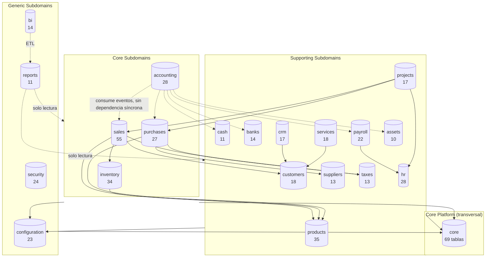

# Database Diagram — GORAZUS

> "Database Enterprise v1.0" — Fase 1, Parte 2 (2026-07-21, rama
> `feature/database-audit`). Diagrama actualizado de la organización
> **a nivel de schema** (no de tabla — el diagrama completo de 501 tablas
> es objeto de la Parte 3, "auditoría de tablas"). Consolida en un solo
> lugar los diagramas que ya existían, dispersos en 3 documentos distintos,
> y agrega el único que faltaba: el grafo de dependencias con la
> clasificación Core/Supporting/Generic Subdomain.

## 1. Diagrama de dependencias entre schemas (nuevo — clasificado por tipo de subdominio)

**Nota de honestidad sobre densidad:** este diagrama muestra solo las
dependencias **síncronas críticas** (18 de las posibles, ver
[SCHEMA_DEPENDENCIES.md §1](./SCHEMA_DEPENDENCIES.md#1-grafo-de-dependencias-referencia-no-repetido)) —
no incluye las 185 FK cross-schema del hallazgo conocido (serían
ilegibles como diagrama), ni las dependencias de solo lectura de
`reports`/`bi` hacia cada schema individual (resumidas como una sola
flecha por claridad).

## 2. Diagramas ya existentes (referencia, no regenerados en esta parte)

| Diagrama                                                | Ubicación                                                                                                       | Generado por         | Alcance                                                                                                            |
| ------------------------------------------------------- | --------------------------------------------------------------------------------------------------------------- | -------------------- | ------------------------------------------------------------------------------------------------------------------ |
| Maestro (schemas + relaciones clave)                    | `docs/database/erd/master/`                                                                                     | SchemaSpy + Graphviz | 21 schemas, sin las 3 columnas de auditoría universal (excluidas por densidad, ver `DATABASE_VISUALIZATION.md §4`) |
| Por módulo (ER completo, 1 por schema)                  | `docs/database/erd/<módulo>/`                                                                                   | SchemaSpy + Graphviz | Tabla por tabla, dentro de un mismo schema                                                                         |
| Diagrama de relaciones por módulo (conceptual)          | [03-diagrama-relaciones.md](./03-diagrama-relaciones.md)                                                        | Mermaid, a mano      | Entidades principales por módulo, sin las 501 tablas completas                                                     |
| Grafo de dependencias entre módulos (síncronas + async) | [DATABASE_DEPENDENCIES.md §2-3](./DATABASE_DEPENDENCIES.md#2-dependencias-críticas-síncronas-in-process)        | Mermaid, a mano      | Mismo grafo que §1 de este documento, sin la clasificación Core/Supporting/Generic                                 |
| Bounded Contexts + Context Map (vocabulario DDD)        | [docs/ddd/01_bounded_contexts.md](../ddd/01_bounded_contexts.md), [02_context_map.md](../ddd/02_context_map.md) | Mermaid, a mano      | Mismos 21 schemas, vocabulario DDD (Customer/Supplier, Partnership, ACL)                                           |

**No se regenera el diagrama maestro de SchemaSpy en esta parte** — no
hubo ningún cambio de schema/tabla que lo invalide (esta es una auditoría
de organización, sin DDL aplicado); regenerarlo sin cambios reales sería
trabajo redundante, además de la advertencia ya documentada sobre el
tiempo de render de `-all` sin el flag `-x`
([DATABASE_VISUALIZATION.md §4](./DATABASE_VISUALIZATION.md#4-cómo-regenerar-los-diagramas-erd-schemaspy)).

## 3. Trazabilidad

El único diagrama genuinamente nuevo de este documento es el de §1 (grafo
de dependencias con clasificación Core/Supporting/Generic Subdomain) — los
demás ya existían y se referencian, no se regeneran, siguiendo la misma
disciplina de "no repetir documentación" del resto de esta sesión.
