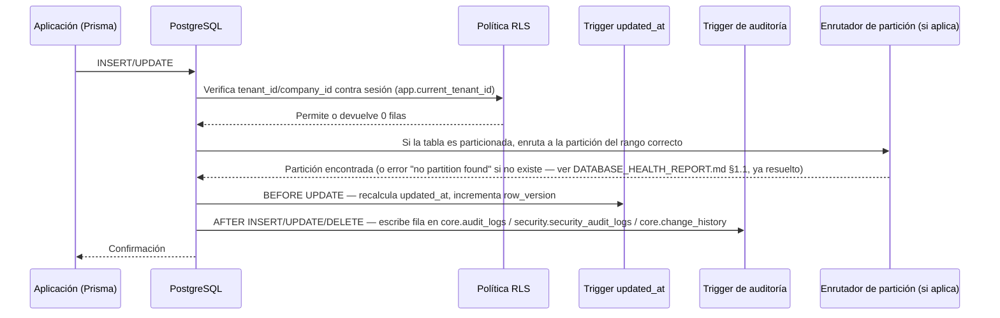
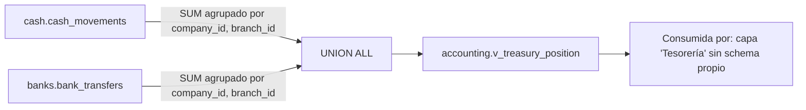

# Data Flow — GORAZUS (dentro de la base de datos)

> Generado 2026-07-17 (PHASE 01 — Database Enterprise). Distinto de
> `docs/architecture/05-flujo-de-datos.md` (ciclo de vida de una request HTTP/evento
> a nivel de aplicación, ya fijado, no repetido) — este documento cubre el flujo de
> datos **dentro** del motor de Postgres: qué dispara qué, en qué orden, verificado
> contra los triggers/funciones/particiones reales.

## 1. Flujo de un `INSERT`/`UPDATE` en cualquier tabla de negocio

**Orden real verificado** (no solo documentado): la política RLS se evalúa **antes**
que cualquier trigger — un `INSERT` que no cumple la política nunca llega a
disparar el trigger de auditoría. El trigger de auditoría corre **después** de que
la fila ya está físicamente escrita (no antes), consistente con
`docs/database/05-estrategia-auditoria.md`.

## 2. Flujo de particionamiento (corregido en esta fase)

Antes de esta fase, este flujo **fallaba en el paso "enruta a la partición"** para
las 27 tablas particionadas (0 particiones reales, ver
[DATABASE_HEALTH_REPORT.md §1.1](./DATABASE_HEALTH_REPORT.md#1-hallazgos-críticos-de-esta-fase)) —
cualquier `INSERT` producía `ERROR: no partition of relation "X" found for row`.
Corregido: `pg_partman` aprovisiona automáticamente la partición del mes/año en
curso + 1-3 períodos futuros (`p_premake`), y el job `partition_maintenance`
(`core.scheduled_jobs`) mantiene el margen hacia adelante — el flujo ya no depende
de que alguien cree la partición manualmente antes de que se necesite.

## 3. Flujo de la vista `accounting.v_treasury_position` (corregida en esta fase)

Antes de esta fase, esta vista **no existía** (fallaba al crearse por columna
ambigua, ver `DATABASE_HEALTH_REPORT.md §1.2`) — cualquier consulta a
`accounting.v_treasury_position` fallaba con "relation does not exist". Corregida
en `docs/database/sql/32_bugfixes.sql`.

## 4. Flujo de refresco de vistas materializadas

`bi.mv_daily_sales_summary` y las otras 3 vistas materializadas se refrescan vía
`REFRESH MATERIALIZED VIEW CONCURRENTLY` (requiere el índice único ya declarado,
`docs/database/sql/28_materialized_views.sql`), invocado por
`core.scheduled_jobs`/`core.background_jobs` — el mecanismo de invocación real
(worker que ejecuta el `REFRESH`) es responsabilidad de `core/scheduler` a nivel de
aplicación, fuera del alcance de "trabajar únicamente sobre la base de datos" — este
documento solo confirma que el objeto de base de datos (la vista materializada +
su índice único) está listo para recibirlo.

## 5. Flujo de aislamiento multiempresa (RLS, referencia)

Ya fijado completo en `docs/database/06-estrategia-seguridad.md §1` — no se repite.
Confirmado en esta fase: las 674 tablas físicas (incluidas las ~200 particiones
nuevas de esta fase) heredan la política RLS de su tabla padre automáticamente,
sin necesitar redefinirla partición por partición (`docs/database/07-estrategia-particionamiento.md §5`,
ya documentado, ahora verificable con particiones reales existiendo).

## 6. Trazabilidad

| Punto                         | Ya fijado en                                      | Verificado/corregido acá               |
| ----------------------------- | ------------------------------------------------- | -------------------------------------- |
| Ciclo de vida de request HTTP | `docs/architecture/05-flujo-de-datos.md §1`       | Referencia — no repetido               |
| RLS                           | `docs/database/06-estrategia-seguridad.md §1`     | Confirmado con particiones reales (§5) |
| Particionamiento              | `docs/database/07-estrategia-particionamiento.md` | Flujo corregido, ya no falla (§2)      |
| Vista de tesorería            | Nuevo hallazgo de esta fase                       | Corregida, flujo documentado (§3)      |
