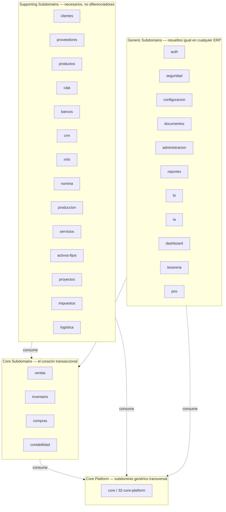

# 01 — Bounded Contexts

> Fase 6 (DDD) — 2026-07-21. Arquitecto Principal de Software y Base de
> Datos de GORAZUS ERP. Este documento **no rediseña** ningún módulo:
> traduce a vocabulario DDD estratégico los 29 módulos de negocio ya
> completamente diseñados en
> [04-catalogo-modulos-negocio.md](../architecture/04-catalogo-modulos-negocio.md)
> y en sus 29 documentos de detalle (`13` a `48`), y el Core Platform ya
> especificado en [32-core-platform/](../architecture/32-core-platform/README.md).
> Cero SQL, cero código, cero tabla nueva, cero renombrado.

## 0. Qué es (y qué no es) un Bounded Context aquí

En GORAZUS, un **módulo** (unidad autocontenida con backend, frontend y
contratos propios — glosario ya fijado en
[architecture/README.md §4](../architecture/README.md#4-glosario-mínimo))
y un **Bounded Context** DDD son, en la práctica, la misma frontera:

- Cada módulo tiene su propio schema de Postgres (regla 1:1 ya fijada
  en [database/00-modelo-general.md §1](../database/00-modelo-general.md)),
  su propio lenguaje, sus propias reglas de negocio y su propio "módulo
  dueño" para las entidades que le pertenecen
  ([06-comunicacion-entre-modulos.md §4](../architecture/06-comunicacion-entre-modulos.md#4-patrón-módulo-dueño-para-entidades-compartidas)).
- Un módulo **sin** schema propio (`pos`, `tesoreria`, `dashboard`) es,
  en términos DDD, un Bounded Context que no posee datos propios: es
  una composición/orquestación de otros contextos (ver
  [02_context_map.md](./02_context_map.md) §4).
- `documentos` y `administracion` no tienen schema propio de negocio,
  pero sí tablas propias dentro de `core` (`core.documents`,
  `core.integrations`, etc.) — se tratan como contextos propios porque
  tienen invariantes y ciclo de vida propios, distintos de los del
  resto de `core`.
- **`core` en sí mismo no es un módulo de negocio** — es el Core
  Platform (72+ componentes ya especificados en `32-core-platform/`):
  el conjunto de subdominios genéricos (Security Context, Domain
  Events, Workflow Engine, etc.) que todo Bounded Context de negocio
  consume. Se documenta aquí como un contexto adicional porque
  DDD exige nombrarlo explícitamente para no dejarlo como una "zona
  gris" sin dueño conceptual.

No se re-lista aquí el detalle interno de cada módulo (tablas
completas, flujos, permisos) — eso ya existe y no se duplica. Este
documento añade la capa que **no existía todavía**: la clasificación
estratégica (Core/Supporting/Generic Subdomain de Eric Evans) y, por
contexto, sus límites explícitos en términos de qué NO hace.

## 1. Clasificación estratégica (Core / Supporting / Generic Subdomain)

**Criterio de clasificación** (mismo principio rector que
`database/README.md`: cada decisión se mide contra si sostiene el
negocio a escala, no contra preferencia estética):

- **Core**: si desapareciera, GORAZUS deja de ser un ERP transaccional
  — es donde ocurre la actividad económica primaria (vender, comprar,
  mover inventario, contabilizar). Aquí es donde vale la pena invertir
  el mayor cuidado de modelado táctico (Fases 4-11 de este documento).
- **Supporting**: necesario y específico del dominio ERP, pero no es
  lo que un cliente compra GORAZUS para resolver — son datos maestros y
  procesos de apoyo (`clientes`, `productos`) o verticales de negocio
  que algunos tenants usan y otros no (`produccion`, `servicios`,
  `proyectos`, `activos-fijos`, `logistica`).
- **Generic**: el mismo problema ya resuelto por cualquier ERP/SaaS —
  autenticación, RBAC, reportes, BI, IA, POS como UI de venta. Candidatos
  naturales a comprar/tercerizar en un producto distinto a GORAZUS si
  algún día hiciera falta, aunque hoy están construidos in-house.
- **Core Platform**: no es un subdominio de negocio — es la
  infraestructura de aplicación transversal (motores, mensajería,
  observabilidad) que todos los demás contextos comparten. Ya
  completamente especificado en `32-core-platform/`.

## 2. Catálogo de Bounded Contexts

Convención de la tabla: **Objetivo** (una línea), **Tablas raíz**
(Aggregate Roots candidatos — desarrollados en
[04_aggregates.md](./04_aggregates.md)), **Eventos publicados/consumidos**
(catálogo completo en [07_domain_events.md](./07_domain_events.md) y
[13_integration_events.md](./13_integration_events.md); aquí solo los ya
documentados en
[12-backend-enterprise.md §6.3](../architecture/12-backend-enterprise.md#63-catálogo-representativo-de-eventos-por-módulo-nuevo)).

### 2.1 Core Subdomains

| Contexto         | Objetivo                                                                                                             | Límites (qué NO hace)                                                                                                          | Dependencias (síncronas)                                                                       | Schema / tablas raíz                               | Eventos publicados                                                | Eventos consumidos                                                                                                                                                                                                                                                          |
| ---------------- | -------------------------------------------------------------------------------------------------------------------- | ------------------------------------------------------------------------------------------------------------------------------ | ---------------------------------------------------------------------------------------------- | -------------------------------------------------- | ----------------------------------------------------------------- | --------------------------------------------------------------------------------------------------------------------------------------------------------------------------------------------------------------------------------------------------------------------------- |
| **ventas**       | Ciclo de venta completo: cotización → pedido → factura.                                                              | No descuenta stock directamente (lo pide a `inventario` vía evento); no genera el asiento contable (lo genera `contabilidad`). | `clientes`, `productos`, `inventario` (consulta disponibilidad), `impuestos`, `configuracion`  | `sales.quotes/sales_orders/invoices/...`           | `VentaConfirmada`, `FacturaAnulada`                               | `StockInsuficiente` (compensación), `OportunidadGanada` (de `crm`)                                                                                                                                                                                                          |
| **inventario**   | Único dueño del stock: existencias, movimientos, costeo (FIFO/Promedio), almacenes.                                  | No decide si una venta debe confirmarse; solo informa disponibilidad y ejecuta el descuento cuando se le pide.                 | `productos` (consulta), `configuracion`                                                        | `inventory.warehouses/stock/stock_movements/...`   | `StockActualizado`, `StockInsuficiente`                           | `VentaConfirmada`, `RecepcionConfirmada`                                                                                                                                                                                                                                    |
| **compras**      | Ciclo de compra completo: requisición → orden → recepción → factura de proveedor.                                    | No paga directamente (delega a `bancos`/`caja`); no ingresa stock él mismo (lo hace `inventario` al consumir el evento).       | `proveedores`, `productos`, `impuestos`, `configuracion`                                       | `purchases.purchase_orders/purchase_invoices/...`  | `FacturaCompraRegistrada`, `RecepcionConfirmada`                  | —                                                                                                                                                                                                                                                                           |
| **contabilidad** | Libro mayor, asientos, cierres, consolidación financiera — consumidor puro de eventos de negocio, nunca orquestador. | No inicia procesos de negocio; nunca decide si una venta o compra debe ocurrir, solo registra su efecto contable.              | `configuracion` (plan de cuentas base), `core` (Business Rules Engine para `accounting_rules`) | `accounting.chart_of_accounts/journal_entries/...` | (ninguno saliente — es el sumidero final de la mayoría de flujos) | `VentaConfirmada`, `FacturaAnulada`, `FacturaCompraRegistrada`, `MovimientoCajaRegistrado`, `ConciliacionCompletada`, `LiquidacionCerrada`, `DepreciacionCalculada`, y todo `event_code` de `accounting_rules` (ver [13_integration_events.md](./13_integration_events.md)) |

### 2.2 Supporting Subdomains

| Contexto                                      | Objetivo                                                                                 | Límites (qué NO hace)                                                                                                                                                                                                          | Dependencias (síncronas)                                  | Schema / tablas raíz                                                                                                         | Eventos publicados                                                        | Eventos consumidos                                                    |
| --------------------------------------------- | ---------------------------------------------------------------------------------------- | ------------------------------------------------------------------------------------------------------------------------------------------------------------------------------------------------------------------------------ | --------------------------------------------------------- | ---------------------------------------------------------------------------------------------------------------------------- | ------------------------------------------------------------------------- | --------------------------------------------------------------------- |
| **clientes**                                  | Único dueño del maestro de clientes (datos, crédito, direcciones).                       | No factura ni cobra — eso es `ventas`/`caja`; solo expone datos y reglas de crédito.                                                                                                                                           | `configuracion`                                           | `customers.customers/...`                                                                                                    | `ClienteActualizado`                                                      | —                                                                     |
| **proveedores**                               | Único dueño del maestro de proveedores (datos, evaluación, crédito).                     | No genera órdenes de compra — eso es `compras`.                                                                                                                                                                                | `configuracion`                                           | `suppliers.suppliers/...`                                                                                                    | `ProveedorActualizado` (nuevo, ver 07)                                    | —                                                                     |
| **productos**                                 | Único dueño del catálogo: productos, variantes, BOM/recetas, kits.                       | No conoce existencias reales (eso es `inventario`) ni precios de venta finales (eso es `ventas`/`configuracion.price_lists`).                                                                                                  | `configuracion` (unidades de medida, impuestos base)      | `products.products/bill_of_materials/...`                                                                                    | `ProductoCreado`, `ProductoDescontinuado` (nuevo, ver 07)                 | —                                                                     |
| **caja**                                      | Movimientos de efectivo, apertura/cierre de cajas, arqueos.                              | No concilia banco (eso es `bancos`); no genera asiento contable directamente.                                                                                                                                                  | `configuracion`                                           | `cash.cash_registers/cash_movements/...`                                                                                     | `MovimientoCajaRegistrado`, `CajaAbierta`, `CajaCerrada` (nuevos, ver 07) | `VentaConfirmada` (si es de contado)                                  |
| **bancos**                                    | Cuentas bancarias, conciliación, transferencias, cheques.                                | No es tesorería (no consolida posición global); solo gestiona sus propias cuentas.                                                                                                                                             | `configuracion`                                           | `banks.bank_accounts/bank_statements/...`                                                                                    | `ConciliacionCompletada`                                                  | `LiquidacionCerrada` (lote de pago), `FacturaCompraRegistrada` (pago) |
| **impuestos**                                 | Catálogo de impuestos, reglas de aplicabilidad, retenciones/percepciones, declaraciones. | No calcula el impuesto final de una línea de venta/compra por sí mismo sin ser invocado — es un servicio de dominio consultado (`CalcularImpuestos`, ver [08_domain_services.md](./08_domain_services.md)), no un orquestador. | `configuracion` (régimen fiscal)                          | `taxes.taxes/tax_rules/withholding_certificates/...`                                                                         | `RetencionEmitida`, `DeclaracionPresentada` (nuevos, ver 07)              | `VentaConfirmada`, `FacturaCompraRegistrada`                          |
| **crm**                                       | Prospectos, oportunidades, campañas, actividad comercial.                                | No confirma ventas — al ganar una oportunidad, llama al comando síncrono público de `ventas`, no publica un evento (excepción ya documentada).                                                                                 | `clientes`, `ventas` (comando síncrono)                   | `crm.leads/opportunities/campaigns/...`                                                                                      | `OportunidadGanada`                                                       | `ClienteActualizado`                                                  |
| **rrhh**                                      | Legajo del empleado, contratos, estructura organizacional, ausencias.                    | No calcula nómina — eso es `nomina`, que consume datos de `rrhh` por consulta síncrona.                                                                                                                                        | `configuracion`                                           | `hr.employees/employee_contracts/...`                                                                                        | `EmpleadoContratado`, `EmpleadoDadoDeBaja` (nuevos, ver 07)               | —                                                                     |
| **nomina**                                    | Cálculo y liquidación de nómina, cargas sociales, préstamos.                             | No modifica el legajo del empleado; solo lo consulta.                                                                                                                                                                          | `rrhh`, `bancos` (lote de pago), `configuracion`          | `payroll.payroll_runs/payroll_entries/...`                                                                                   | `LiquidacionCerrada`                                                      | —                                                                     |
| **produccion**                                | Órdenes de producción, explosión de BOM, consumo/costeo de manufactura.                  | No es dueño del BOM (lo consulta a `productos`) ni del stock (pide a `inventario` reservar/consumir componentes y recibir productos terminados).                                                                               | `productos` (BOM), `inventario` (reserva/consumo/ingreso) | `inventory.production_orders/...` (sin schema propio — ver nota en [19_module_dependencies.md](./19_module_dependencies.md)) | `OrdenProduccionLiberada`, `OrdenProduccionCerrada` (nuevos, ver 07)      | —                                                                     |
| **servicios**                                 | Órdenes de servicio, contratos/SLA, mantenimiento preventivo, técnicos.                  | No gestiona el activo físico del cliente en profundidad (delimitación ya resuelta frente a `activos-fijos`, son 2 conceptos independientes).                                                                                   | `clientes`, `ventas` (garantías), `configuracion`         | `services.service_orders/service_contracts/...`                                                                              | `OrdenServicioCerrada` (nuevo, ver 07)                                    | —                                                                     |
| **activos-fijos**                             | Registro, depreciación, transferencias, bajas de activos fijos propios.                  | No es el "equipo bajo servicio" de `servicios` (deslinde ya documentado).                                                                                                                                                      | `contabilidad` (vía evento)                               | `assets.fixed_assets/...`                                                                                                    | `DepreciacionCalculada`                                                   | —                                                                     |
| **proyectos**                                 | Planificación, WBS, costeo y facturación por hitos de proyectos.                         | No factura directamente — llama de forma síncrona al comando público de `ventas` para generar la factura del hito.                                                                                                             | `ventas` (síncrono), `compras`, `rrhh`                    | `projects.projects/project_tasks/...`                                                                                        | `HitoFacturado` (nuevo, ver 07)                                           | —                                                                     |
| **logistica** _(propuesto, sin DDL — Fase 5)_ | Transporte y despacho: transportistas, vehículos, envíos.                                | No decide qué se despacha (consume el hecho ya ocurrido de `ventas`/`compras`); solo gestiona el transporte físico.                                                                                                            | `ventas`, `compras` (consulta)                            | `logistics.shipments/carriers/...` (propuesto)                                                                               | `EnvioEntregado` (`logistics.shipment.delivered`, ya nombrado en Fase 5)  | `VentaConfirmada`                                                     |

### 2.3 Generic Subdomains

| Contexto                               | Objetivo                                                                                             | Límites (qué NO hace)                                                                                                                                                                                                               | Dependencias (síncronas)                                   | Schema / tablas raíz                                    | Eventos publicados                                                    | Eventos consumidos                                                                         |
| -------------------------------------- | ---------------------------------------------------------------------------------------------------- | ----------------------------------------------------------------------------------------------------------------------------------------------------------------------------------------------------------------------------------- | ---------------------------------------------------------- | ------------------------------------------------------- | --------------------------------------------------------------------- | ------------------------------------------------------------------------------------------ |
| **auth**                               | Identidad y sesión: login, tokens, recuperación de contraseña.                                       | No decide autorización granular (eso es `seguridad`).                                                                                                                                                                               | `core` (usuarios)                                          | `core.users/sessions/tokens` (sin schema propio)        | `SesionIniciada` (técnico, no de negocio)                             | —                                                                                          |
| **seguridad**                          | Roles, permisos, políticas de acceso por módulo/acción.                                              | No autentica — solo autoriza una vez que `auth` ya identificó al actor.                                                                                                                                                             | `auth`                                                     | `security.security_policies/access_control_lists/...`   | `RolModificado`                                                       | —                                                                                          |
| **configuracion**                      | Datos maestros transversales: monedas, series de numeración, parámetros fiscales, listas de precios. | No contiene lógica de negocio de ningún módulo — es catálogo puro consumido por todos.                                                                                                                                              | ninguna                                                    | `configuration.currencies/correlatives/price_lists/...` | —                                                                     | —                                                                                          |
| **documentos**                         | Repositorio documental transversal, versionado, firma electrónica.                                   | No decide el flujo de aprobación de un documento (eso es `core`/Workflow Engine — DMS extiende File Manager, ya diseñado en Fase 2).                                                                                                | `core` (Workflow/Approval Engine)                          | `core.documents/document_versions/signatures`           | `document.created`, `document.signed` (ya nombrados, Fase 2)          | —                                                                                          |
| **administracion**                     | Integraciones externas, EDI, webhooks, trabajos programados.                                         | No contiene lógica de negocio — es infraestructura de integración genérica (Integration Engine, Fase 2).                                                                                                                            | `core`                                                     | `core.integrations/edi_transactions/scheduled_jobs`     | `integration.*`, `webhook.*` (ya nombrados, Fase 2)                   | (todos los eventos de negocio que alimentan facturación electrónica — ver 13)              |
| **reportes**                           | Agregación de solo lectura de reportes cross-módulo.                                                 | Nunca escribe en el schema de otro módulo — solo lee.                                                                                                                                                                               | todos (solo lectura)                                       | `reports.dashboards/report_definitions/...`             | —                                                                     | (todos, solo lectura vía proyección/réplica)                                               |
| **bi**                                 | Dashboards analíticos, KPIs, data marts.                                                             | No es la fuente de verdad de ningún dato — es un derivado del OLTP vía el Data Warehouse ya diseñado ([database/12](../database/12-arquitectura-data-warehouse.md)).                                                                | `reportes`                                                 | `bi.kpis/data_cubes/...`                                | `bi_alert.triggered` (ya nombrado)                                    | (todos, vía ETL — no eventos en tiempo real)                                               |
| **ia** _(propuesto, sin DDL — Fase 4)_ | Predicción, recomendación, RAG, agentes de IA — siempre como propuesta, nunca escritura directa.     | Nunca escribe una tabla de negocio ni ejecuta una acción irreversible por sí sola — toda salida pasa por `Approval Engine`/`Workflow Engine` (principio rector ya fijado en [47-modulo-ia.md §1](../architecture/47-modulo-ia.md)). | `bi` (datos de origen), `core` (Approval Engine)           | `ai.predictions/recommendations/agent_runs` (propuesto) | `prediction.created`, `recommendation.created` (ya nombrados, Fase 4) | (amplio — consume eventos de todos los contextos Core/Supporting como entrada de features) |
| **dashboard**                          | Panel de inicio — composición pura de proyecciones de otros contextos.                               | No tiene entidades propias.                                                                                                                                                                                                         | todos (solo lectura)                                       | ninguna                                                 | —                                                                     | (proyecciones de todos)                                                                    |
| **tesoreria**                          | Posición consolidada de caja/banco y flujo de caja proyectado.                                       | No ejecuta movimientos — es una vista de solo lectura sobre `caja`+`bancos`+`clientes`+`proveedores`.                                                                                                                               | `caja`, `bancos`, `clientes`, `proveedores` (solo lectura) | ninguna                                                 | —                                                                     | `MovimientoCajaRegistrado`, `ConciliacionCompletada`                                       |
| **pos**                                | Orquestación de UI de punto de venta sobre `ventas`+`inventario`+`caja`.                             | No tiene entidades propias — cada operación de POS es, en el dominio, una operación de `ventas` (con `caja` de contado).                                                                                                            | `ventas`, `inventario`, `caja` (síncrono)                  | ninguna                                                 | —                                                                     | —                                                                                          |

### 2.4 Core Platform (subdominio genérico transversal)

| Contexto          | Objetivo                                                                                                                                                                                                                                                                                          | Documento de referencia                                                                                  |
| ----------------- | ------------------------------------------------------------------------------------------------------------------------------------------------------------------------------------------------------------------------------------------------------------------------------------------------- | -------------------------------------------------------------------------------------------------------- |
| **Core Platform** | Motores y frameworks transversales: Security Context, Domain Events/Event Bus, Workflow/BPM/Approval/Business Rules Engine, Notification Center, Scheduler, Integration Engine, Document Management, Digital Signature, Task Engine — consumidos por los 29 contextos anteriores, nunca al revés. | [32-core-platform/README.md](../architecture/32-core-platform/README.md) (72+5 componentes, ya completo) |

## 3. Trazabilidad

Todo el contenido de este documento es 🔗 **traducción a vocabulario
DDD** de decisiones ya tomadas — ningún módulo, tabla, evento o
dependencia mencionado aquí es nuevo, salvo donde se marca
explícitamente `(nuevo, ver 07)` para nombres de evento que antes no
tenían nombre asignado (se definen recién en
[07_domain_events.md](./07_domain_events.md), siguiendo exactamente la
convención ya fijada en
[07-convenciones-y-estandares.md §1](../architecture/07-convenciones-y-estandares.md#1-naming)).

**Siguiente documento:** [02_context_map.md](./02_context_map.md) —
cómo se comunican estos 29+1 contextos entre sí, en términos de los
patrones estratégicos de DDD (Customer/Supplier, Partnership, Shared
Kernel, OHS/PL, ACL).
