# 02 — Context Map

> Traduce las reglas de comunicación ya fijadas en
> [06-comunicacion-entre-modulos.md](../architecture/06-comunicacion-entre-modulos.md)
> a los patrones estratégicos estándar de DDD (Eric Evans / Vaughn
> Vernon). No cambia ninguna regla existente — nombra con vocabulario
> DDD lo que ya está decidido.

**Nota de terminología:** los términos en mayúscula de este documento
(`Customer`/`Supplier`, `Partnership`, `Open Host Service`) son
patrones DDD en inglés, **no** los módulos de negocio `clientes` /
`proveedores` de GORAZUS. Donde haya ambigüedad se usa el nombre del
módulo entre backticks (`clientes`) y el patrón DDD en cursiva
(_Customer/Supplier_).

## 1. Los dos mecanismos de comunicación como relaciones de Context Mapping

GORAZUS solo permite dos formas de comunicación entre contextos
([06 §1](../architecture/06-comunicacion-entre-modulos.md#1-dos-formas-de-comunicación-y-solo-dos)),
y ambas mapean directamente a patrones DDD estándar:

| Mecanismo GORAZUS                                    | Patrón DDD equivalente                     | Cuándo se usa                                                                                                 |
| ---------------------------------------------------- | ------------------------------------------ | ------------------------------------------------------------------------------------------------------------- |
| Síncrono in-process vía fachada pública (`index.ts`) | _Open Host Service_ + _Published Language_ | El consumidor necesita una respuesta en el mismo request (ej. `ventas` pregunta a `inventario` si hay stock). |
| Asíncrono vía evento de dominio (RabbitMQ)           | _Published Language_ sobre _Domain Event_  | El consumidor reacciona a un hecho ya ocurrido, sin bloquear al publicador.                                   |

Ninguno de los dos es _Conformist_ (el consumidor nunca adopta el
modelo interno del proveedor sin traducción) ni _Shared Database_
(prohibido explícitamente — [06 §2](../architecture/06-comunicacion-entre-modulos.md#2-qué-no-es-comunicación-válida-entre-módulos)):
cada contexto expone un modelo de lectura propio (DTO/proyección), no
sus tablas internas.

## 2. Mapa de relaciones entre contextos

```mermaid
flowchart TB
    subgraph Core["Core Subdomains"]
        ventas
        inventario
        compras
        contabilidad
    end
    subgraph Support["Supporting Subdomains"]
        clientes
        proveedores
        productos
        caja
        bancos
        crm
        rrhh
        nomina
        produccion
        servicios
        activos["activos-fijos"]
        proyectos
        impuestos
        logistica
    end
    subgraph Generic["Generic Subdomains"]
        auth
        seguridad
        configuracion
        reportes
        bi
        ia
        pos
        tesoreria
        dashboard
        documentos
        administracion
    end

    ventas -- "U/D Customer" --> inventario
    ventas -- "U/D Customer" --> clientes
    ventas -- "U/D Customer" --> productos
    ventas -- "U/D Customer" --> impuestos
    compras -- "U/D Customer" --> proveedores
    compras -- "U/D Customer" --> productos
    compras -- "U/D Customer" --> impuestos
    contabilidad -. "PL — solo consume eventos" .-> ventas
    contabilidad -. "PL — solo consume eventos" .-> compras
    contabilidad -. "PL — solo consume eventos" .-> caja
    contabilidad -. "PL — solo consume eventos" .-> bancos
    contabilidad -. "PL — solo consume eventos" .-> nomina
    contabilidad -. "PL — solo consume eventos" .-> activos
    crm -- "U/D Customer (síncrono)" --> ventas
    crm -. "PL" .-> clientes
    nomina -- "U/D Customer" --> rrhh
    proyectos -- "U/D Customer (síncrono)" --> ventas
    produccion -- "U/D Customer" --> productos
    produccion -- "U/D Customer" --> inventario
    logistica -. "PL" .-> ventas
    pos -- "U/D Customer" --> ventas
    pos -- "U/D Customer" --> inventario
    pos -- "U/D Customer" --> caja
    tesoreria -. "PL, solo lectura" .-> caja
    tesoreria -. "PL, solo lectura" .-> bancos
    reportes -. "PL, solo lectura" .-> Core
    reportes -. "PL, solo lectura" .-> Support
    bi -. "ETL, solo lectura" .-> reportes
    ia -. "ACL — nunca escribe" .-> Core

    Core -- "SK" --> SharedKernel[["Shared Kernel<br/>Money · TenantId · UserContext"]]
    Support -- "SK" --> SharedKernel
    Generic -- "SK" --> SharedKernel
```

`U/D Customer` = relación _Customer/Supplier_ donde el módulo que
dibuja la flecha es el **Customer** (consumidor, upstream de la
relación de poder de negociación) y el módulo apuntado es el
**Supplier** (proveedor del servicio/dato). `PL` = _Published
Language_ (eventos de dominio). `SK` = _Shared Kernel_. `ACL` =
_Anticorruption Layer_ (detalle en
[14_anti_corruption_layer.md](./14_anti_corruption_layer.md)).

## 3. Clasificación de cada relación por patrón DDD

### 3.1 Customer/Supplier

El patrón dominante en GORAZUS. El módulo _Customer_ depende de la
API pública (`index.ts`) del _Supplier_; la regla dura de
[06 §1a](../architecture/06-comunicacion-entre-modulos.md#a-síncrona-in-process--a-través-de-la-fachada-pública)
("`inventario` nunca importa nada de `ventas`") es exactamente la
regla DDD de que la dependencia es direccional y el _Supplier_ no
conoce a sus _Customers_.

| Customer     | Supplier                       | Contrato (Published Language)                                                                                                                                                                  |
| ------------ | ------------------------------ | ---------------------------------------------------------------------------------------------------------------------------------------------------------------------------------------------- |
| `ventas`     | `inventario`                   | `InventarioQueryService.verificarDisponibilidad()` (solo lectura)                                                                                                                              |
| `ventas`     | `clientes`                     | `ClientesQueryService` (solo lectura)                                                                                                                                                          |
| `ventas`     | `productos`                    | `ProductosQueryService` (solo lectura)                                                                                                                                                         |
| `compras`    | `proveedores`                  | `ProveedoresQueryService` (solo lectura)                                                                                                                                                       |
| `nomina`     | `rrhh`                         | `RRHHQueryService` (solo lectura)                                                                                                                                                              |
| `crm`        | `ventas`                       | comando síncrono `VentasCommandService.confirmarDesdeOportunidad()` — única excepción documentada donde el flujo cruza contextos síncronamente en sentido "de negocio" en vez de solo consulta |
| `proyectos`  | `ventas`                       | comando síncrono `VentasCommandService.facturarHito()`                                                                                                                                         |
| `pos`        | `ventas`, `inventario`, `caja` | orquestación pura — `pos` no tiene modelo propio, es 100% _Customer_                                                                                                                           |
| `produccion` | `productos`, `inventario`      | consulta de BOM + reserva/consumo/ingreso de stock                                                                                                                                             |

**Gobernanza de la relación:** el _Supplier_ nunca es sorprendido por
un _Customer_ nuevo sin declarar la dependencia en su propio
`README.md` de módulo y en los tags de Nx
([06 §1a](../architecture/06-comunicacion-entre-modulos.md#a-síncrona-in-process--a-través-de-la-fachada-pública)) —
esto ya cumple la práctica DDD recomendada de negociar el contrato
entre equipos antes de consumirlo.

### 3.2 Partnership

Relación bidireccional de coordinación estrecha, sin jerarquía
_Customer/Supplier_ clara — ambos contextos deben evolucionar
coordinadamente. En GORAZUS aparece en el flujo de venta contado
([06 §5](../architecture/06-comunicacion-entre-modulos.md#5-ejemplo-end-to-end-confirmar-una-venta)):

- `ventas` ↔ `inventario`: `VentaConfirmada` → descuento de stock;
  `StockInsuficiente` → compensación de vuelta a `ventas`. Ninguno de
  los dos es puramente _Customer_ del otro en este flujo específico —
  es una coreografía de dos pasos con compensación, el caso clásico de
  _Partnership_ con consistencia eventual.
- `ventas` ↔ `caja`: la venta de contado y el movimiento de caja se
  coordinan por evento (`VentaConfirmada` → `caja` registra), sin que
  ninguno bloquee al otro.

### 3.3 Shared Kernel

Ya diseñado y documentado en detalle en
[06-comunicacion-entre-modulos.md §3](../architecture/06-comunicacion-entre-modulos.md#3-shared-kernel)
y [32-core-platform/09 §7-8](../architecture/32-core-platform/09-base-transaccional-y-modelado-ddd.md#7-value-objects) —
ver [15_shared_kernel.md](./15_shared_kernel.md) para el inventario
completo. Es, por diseño, la única relación que **todos** los
contextos comparten simultáneamente (no es 1:1 como el resto de este
documento).

### 3.4 Open Host Service + Published Language

Todo `index.ts` de módulo es, formalmente, un _Open Host Service_: un
protocolo de acceso público, versionado implícitamente por el
contrato del `README.md` del módulo, en vez de un contrato negociado
uno a uno por cada consumidor. Los **eventos de dominio** son la
_Published Language_ — un vocabulario público, estable, documentado
(catálogo en [07_domain_events.md](./07_domain_events.md)), que
cualquier contexto puede consumir sin coordinar directamente con el
publicador. `Integration Engine` (Fase 2) es el _Open Host Service_
formal hacia el exterior del sistema (ver
[14_anti_corruption_layer.md](./14_anti_corruption_layer.md)).

### 3.5 Anticorruption Layer

Reservado para fronteras con modelos externos que GORAZUS no controla
y no debe dejar "filtrar" su vocabulario hacia el dominio interno:
facturación electrónica por país, bancos, pasarelas de pago, IA/LLMs
externos. Detalle completo en
[14_anti_corruption_layer.md](./14_anti_corruption_layer.md) —
internamente, entre contextos GORAZUS-a-GORAZUS, **no se necesita ACL**
porque todos comparten el mismo Shared Kernel y las mismas convenciones
de nombrado ([07-convenciones-y-estandares.md](../architecture/07-convenciones-y-estandares.md)).

### 3.6 Conformist

**No existe ningún caso de _Conformist_ en GORAZUS por diseño** — es
precisamente lo que el patrón "módulo dueño"
([06 §4](../architecture/06-comunicacion-entre-modulos.md#4-patrón-módulo-dueño-para-entidades-compartidas))
evita: ningún contexto consumidor adopta el modelo interno de otro sin
traducción, siempre pasa por la fachada pública (que ya es la
traducción). Se documenta la ausencia explícitamente porque es una
decisión de diseño, no un olvido.

### 3.7 Separate Ways

Contextos que deliberadamente **no** se comunican entre sí porque no
existe necesidad de negocio real: `activos-fijos` y `servicios`
(deslinde ya confirmado en
[39-modulo-services.md §10](../architecture/39-modulo-services.md)),
`reportes`/`bi`/`ia` entre sí (cada uno lee de las fuentes
transaccionales, no unos de otros). Documentar _Separate Ways_
explícitamente evita que una integración se añada "porque sí" en el
futuro sin justificación de negocio — mismo criterio de gobernanza que
`00-roadmap-fases.md` ya aplica a otras decisiones "fuera de alcance".

## 4. Contextos sin modelo propio (pure composition)

`pos`, `tesoreria` y `dashboard` no aparecen como nodos con datos
propios en un Context Map DDD estricto — son **vistas compuestas**
(Vernon las llamaría _Open Host Service consumers_ puros). Se listan
como Bounded Contexts en
[01_bounded_contexts.md](./01_bounded_contexts.md) únicamente porque
GORAZUS los trata como módulos de primera clase a nivel de producto
(tienen su propio frontend/UX), pero en el mapa estratégico son 100%
_Customer_ de otros contextos, nunca _Supplier_.

## 5. Trazabilidad

Ninguna relación de este mapa es nueva — todas derivan de reglas ya
fijadas en `06-comunicacion-entre-modulos.md` y de las integraciones
`event_code` ya documentadas módulo a módulo (37, 38, 39, 40, 46). Lo
nuevo es exclusivamente la clasificación por patrón DDD estratégico
(_Customer/Supplier_, _Partnership_, _ACL_, _Separate Ways_), que no
existía como vocabulario explícito antes de esta fase.

**Siguiente documento:** [03_ubiquitous_language.md](./03_ubiquitous_language.md).
