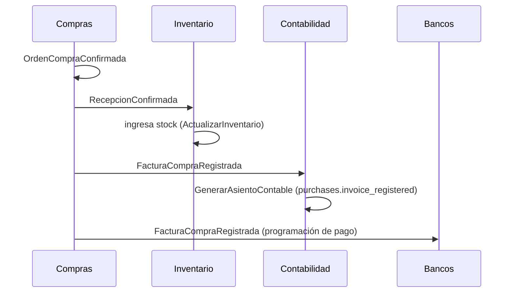
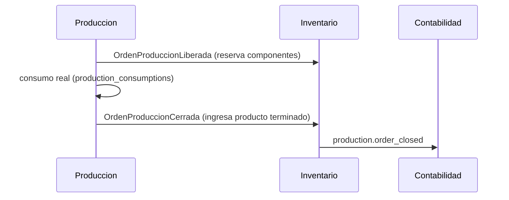
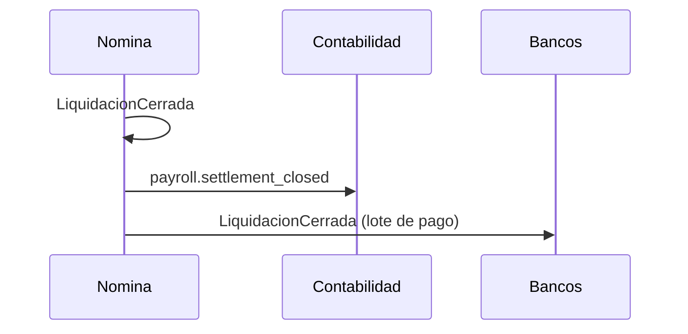

# 13 — Integration Events

> Un Integration Event es un Domain Event ([07](./07_domain_events.md))
> visto desde el lado del **consumidor cruzando Bounded Context** —
> mismo objeto físico (mensaje en RabbitMQ), rol distinto en el
> vocabulario DDD: dentro de un contexto es "algo que ya pasó"; entre
> contextos es "el contrato público que un contexto le ofrece a los
> demás". Este documento consolida los flujos cruzados ya documentados
> dispersos en 06, 12, 37, 38, 39, 40, 46 — no inventa ningún flujo
> nuevo, los reúne en un solo lugar por primera vez.

## 1. Dos superficies de nombrado para el mismo hecho (aclaración necesaria)

GORAZUS ya tiene **dos convenciones de nombre distintas** para el
mismo tipo de hecho de negocio, y ambas son correctas en su capa:

| Superficie                                 | Formato                                       | Ejemplo                     | Consumido por                                                                                                                                                                |
| ------------------------------------------ | --------------------------------------------- | --------------------------- | ---------------------------------------------------------------------------------------------------------------------------------------------------------------------------- |
| **Domain Event** (clase de dominio)        | PascalCase, español, sufijo `Event` en código | `VentaConfirmadaEvent`      | Cualquier módulo suscrito al Event Bus                                                                                                                                       |
| **`event_code`** (clave de regla contable) | `<módulo>.<snake_case>`                       | `'sales.invoice_confirmed'` | Exclusivamente `accounting_rules.event_code`, el mecanismo de asientos automáticos de `contabilidad` ([22-modulo-accounting.md §3](../architecture/22-modulo-accounting.md)) |

**No son dos mecanismos compitiendo** — el `event_code` es
literalmente el identificador con el que `contabilidad` se suscribe a
un Domain Event específico para generar su Asiento Contable vía
`GenerarAsientoContable`
([08_domain_services.md §1.5](./08_domain_services.md#15-generarasientocontable)).
Se documentan juntos aquí, con su correspondencia explícita, para que
no se interprete como una tercera convención de nombre a inventar.

## 2. Tabla de correspondencia Domain Event ↔ `event_code`

| Domain Event                     | `event_code` (si existe)                                                                                                                                                                                                   | Publicador                 | Efecto contable                                                 |
| -------------------------------- | -------------------------------------------------------------------------------------------------------------------------------------------------------------------------------------------------------------------------- | -------------------------- | --------------------------------------------------------------- |
| `VentaConfirmada`                | `sales.invoice_confirmed`                                                                                                                                                                                                  | `ventas`                   | Débito CxC / Crédito Ingreso + IVA por pagar                    |
| `FacturaCompraRegistrada`        | `purchases.invoice_registered` _(nombre inferido, mismo patrón)_                                                                                                                                                           | `compras`                  | Débito Inventario o Gasto / Crédito CxP                         |
| `MovimientoCajaRegistrado`       | `cash.movement_registered` _(inferido)_                                                                                                                                                                                    | `caja`                     | Débito/Crédito Caja / Contrapartida                             |
| `ConciliacionCompletada`         | — (no genera asiento propio, es de control)                                                                                                                                                                                | `bancos`                   | —                                                               |
| `LiquidacionCerrada`             | `payroll.settlement_closed` _(inferido)_                                                                                                                                                                                   | `nomina`                   | Débito Gasto de Sueldos / Crédito CxP Empleados                 |
| `DepreciacionCalculada`          | `assets.depreciation_confirmed` ✅ ya nombrado                                                                                                                                                                             | `activos-fijos`            | Débito Gasto Depreciación / Crédito Depreciación Acumulada      |
| `ActivoDadoDeBaja`               | `assets.disposal_confirmed` ✅ ya nombrado                                                                                                                                                                                 | `activos-fijos`            | Débito Depreciación Acumulada (+pérdida) / Crédito Activo Bruto |
| — (Revaluación)                  | `assets.revaluation_approved` ✅ ya nombrado                                                                                                                                                                               | `activos-fijos`            | Débito/Crédito Activo / Crédito/Débito Superávit                |
| `OrdenProduccionCerrada`         | `production.order_closed` ✅ ya nombrado                                                                                                                                                                                   | `produccion`               | Débito Inventario PT / Crédito Inventario MP                    |
| — (Variación de costeo estándar) | `production.variance_recorded` ✅ ya nombrado                                                                                                                                                                              | `produccion`               | Débito/Crédito Variación de Producción                          |
| `RetencionEmitida`               | `taxes.withholding_certificate_issued` ✅ ya nombrado                                                                                                                                                                      | `impuestos`                | Débito Impuesto Retenido por Pagar / Crédito CxP Proveedor      |
| `DeclaracionPresentada`          | `taxes.declaration_filed` ✅ ya nombrado                                                                                                                                                                                   | `impuestos`                | Débito Impuesto Retenido por Pagar / Crédito Caja/Banco         |
| `HitoFacturado`                  | (reusa `sales.invoice_confirmed` — la Factura generada es indistinguible contablemente de una venta directa)                                                                                                               | `proyectos` (vía `ventas`) | igual que `VentaConfirmada`                                     |
| `OrdenServicioCerrada`           | (sin `event_code` propio — reusa `sales.invoice_confirmed` si genera factura; el costo de repuestos ya llegó vía movimiento de inventario estándar, ver [39-modulo-services.md §9](../architecture/39-modulo-services.md)) | `servicios`                | igual que `VentaConfirmada`, si aplica                          |

**Nota de honestidad documental:** los eventos marcados
_(inferido, mismo patrón)_ siguen la convención `<módulo>.<snake_case>`
ya usada por los 6 `event_code` confirmados en documentos previos, pero
no tienen todavía una fila literal en `accounting_rules` verificada en
vivo — quedan señalados explícitamente como pendientes de alta en la
tabla de configuración cuando se implemente `contabilidad`, no como
gap de diseño.

## 3. Flujos de Integration Events multi-paso (coreografía)

### 3.1 Confirmar una venta de contado (ya documentado en `06 §5`, referenciado no repetido)

Ver
[06-comunicacion-entre-modulos.md §5](../architecture/06-comunicacion-entre-modulos.md#5-ejemplo-end-to-end-confirmar-una-venta)
para el flujo completo `ventas → inventario/contabilidad/caja` con
compensación (`StockInsuficiente`).

### 3.2 Ciclo de compra completo

### 3.3 Ciclo de producción

### 3.4 Ciclo de nómina

### 3.5 Facturación electrónica por país (integración saliente)

`ventas`/`compras` publican su Domain Event de facturación
(`VentaConfirmada`) → `administracion` lo consume vía `Integration
Engine` y lo traduce al formato del `edi_transactions.document_type`
correspondiente (`'dgii-e-cf'`, `'sunat-cpe'`, `'sat-cfdi'`) — mecanismo
completo ya diseñado en
[48-erp-enterprise-readiness.md §5](../architecture/48-erp-enterprise-readiness.md).
No se repite aquí; se referencia porque es, en términos DDD, un
Integration Event saliente hacia un sistema externo, con Anticorrupción
en el punto de traducción — ver
[14_anti_corruption_layer.md](./14_anti_corruption_layer.md).

## 4. Trazabilidad

Toda fila marcada ✅ en la tabla de §2 proviene literalmente de los
`event_code` ya definidos en 37, 38, 39, 40, 46. Los flujos de §3 son
la primera vez que se dibujan como diagrama de secuencia end-to-end —
antes vivían como prosa dispersa en cada documento de módulo. Cero
evento, tabla o regla contable nueva.

**Siguiente documento:** [14_anti_corruption_layer.md](./14_anti_corruption_layer.md).
