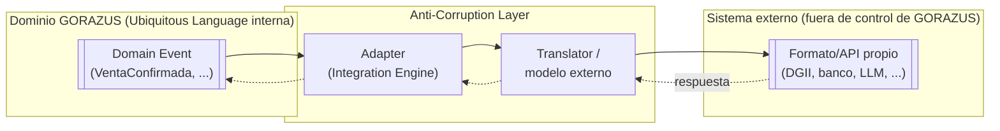

# 14 — Anti-Corruption Layer (ACL)

> Una ACL traduce entre el modelo de dominio de GORAZUS y el modelo de
> un sistema externo que GORAZUS no controla, para que el vocabulario,
> formato o inconsistencia de ese sistema externo nunca "contamine" el
> dominio interno. En GORAZUS, la ACL **ya existe como mecanismo
> genérico** — es `Integration Engine`
> ([32-core-platform/14 §5](../architecture/32-core-platform/14-motores-enterprise-avanzados.md#5-integration-engine),
> Fase 2) — este documento aplica ese mecanismo, ya diseñado, a cada
> frontera externa concreta que la Fase 6 pide nombrar explícitamente.

## 1. Principio único, aplicado 5 veces

Todas las fronteras de este documento comparten la misma forma:

- El **dominio** nunca conoce el formato externo (nunca hay un campo
  `dgii_ncf` en `sales.invoices`, por ejemplo — la traducción vive
  exclusivamente en la capa de integración).
- El **Adapter** es una implementación concreta de la interfaz genérica
  de `Integration Engine` (`core.integrations` +
  `integration_credentials`), un patrón ya usado por el adaptador de
  WhatsApp ([FASE2_MOTORES_ENTERPRISE.md](../architecture/FASE2_MOTORES_ENTERPRISE.md))
  — no se diseña un mecanismo nuevo por cada frontera.
- Los errores/inconsistencias del sistema externo se capturan y
  registran en `core.edi_transactions`/logs de integración, nunca se
  propagan como una excepción de dominio interna sin traducir.

## 2. Las 5 fronteras pedidas

### 2.1 ACL: Facturación Electrónica por país

- **Sistema externo:** DGII (RD), SUNAT (Perú), SAT (México), y
  equivalentes por país.
- **Traducción:** `VentaConfirmada`/`FacturaAnulada` → formato del
  documento fiscal electrónico local (`edi_transactions.document_type`:
  `'dgii-e-cf'`, `'sunat-cpe'`, `'sat-cfdi'`).
- **Ya diseñado en:**
  [48-erp-enterprise-readiness.md §5](../architecture/48-erp-enterprise-readiness.md) —
  incluye flujo de contingencia/reintento vía `Scheduler`. No se
  repite aquí.
- **Por qué es ACL y no solo integración:** cada país tiene su propio
  modelo de "factura" (campos obligatorios distintos, numeración
  distinta, firma digital obligatoria en algunos) — sin ACL, ese
  vocabulario local terminaría filtrándose al agregado Factura
  interno.

### 2.2 ACL: Bancos

- **Sistema externo:** bancos comerciales — formatos de Extracto
  Bancario (MT940, CSV propietario, API bancaria) y de lotes de pago.
- **Traducción:** el `Extracto Bancario` externo se traduce a
  `banks.bank_statement_lines` en el modelo interno **antes** de que
  `Conciliación Bancaria` lo procese — el algoritmo de conciliación
  nunca conoce el formato de origen del banco.
- **Ya diseñado en:**
  [24-modulo-banking.md](../architecture/24-modulo-banking.md) —
  mecanismo de importación/conciliación completo.
- **Dirección adicional (saliente):** lotes de pago (`nomina`,
  `compras`) se traducen del modelo interno al formato que el banco
  espera para procesarlos.

### 2.3 ACL: Pasarelas de pago

- **Sistema externo:** Stripe, PayPal, procesadores de tarjeta.
- **Estado actual:** **sin integración implementada todavía** — ya
  señalado explícitamente en
  [42-integraciones-plan-fase-8.md](../architecture/42-integraciones-plan-fase-8.md)
  como uno de los 11 puntos "sin antecedente en todo el proyecto", y
  en
  [48-erp-enterprise-readiness.md §16](../architecture/48-erp-enterprise-readiness.md)
  se documenta que PCI DSS "no aplica todavía" por esta misma razón.
- **Diseño de la ACL cuando se confirme la necesidad de negocio:** el
  webhook de confirmación de pago de la pasarela se traduciría a
  `MovimientoCajaRegistrado`/`ConciliacionCompletada` interno — nunca
  se persistiría el modelo de datos propio de la pasarela (tokens de
  tarjeta, etc.) dentro de un schema de negocio de GORAZUS, por
  requisito de alcance de PCI DSS. No se diseña más allá de esto sin
  confirmación de negocio, mismo criterio de gobernanza que Fase 8.

### 2.4 ACL: Marketplace

- **Sistema externo:** ningún marketplace (Amazon, MercadoLibre, etc.)
  tiene antecedente en ningún documento de GORAZUS revisado hasta
  ahora.
- **Estado:** no existe todavía ninguna necesidad de negocio confirmada
  — se documenta la ausencia explícitamente (mismo criterio que
  "Separate Ways" de [02_context_map.md §3.7](./02_context_map.md#37-separate-ways))
  para que quede claro que no es un olvido, sino la aplicación
  consistente de "no diseñar especulativamente sin necesidad de
  negocio confirmada" que ya rige el resto del proyecto (LDAP/AD,
  Power BI, Portal del Cliente).

### 2.5 ACL: Inteligencia Artificial (LLMs, agentes)

- **Sistema externo:** Ollama (local), OpenAI, Claude, DeepSeek.
- **Traducción:** ya diseñada en detalle en
  [47-modulo-ia.md §7](../architecture/47-modulo-ia.md) — adaptador
  único por proveedor detrás de una interfaz común, credenciales vía
  `Integration Engine`.
- **La ACL más estricta de las cinco:** no es solo traducción de
  formato — es una barrera de **autoridad**. El principio rector ya
  fijado ("un modelo de IA nunca escribe directamente en una tabla de
  negocio ni ejecuta una acción irreversible por sí solo") significa
  que la salida del sistema externo (una predicción, una respuesta de
  LLM) **nunca cruza la ACL como un comando de dominio válido** — cruza
  siempre como una **propuesta** que debe pasar por `Approval
Engine`/`Workflow Engine` bajo el `Security Context` del humano que
  aprueba, nunca el de la IA. Esto es, en términos DDD, una ACL que
  además de traducir, degrada deliberadamente la autoridad de lo que
  traduce.

### 2.6 ACL: APIs externas genéricas

- **Sistema externo:** cualquier API de terceros no cubierta por las
  4 anteriores (Microsoft 365, Google Workspace, OCR — listadas en
  Fase 8 sin diseño específico todavía).
- **Mecanismo:** el mismo `Integration Engine` genérico — la ACL
  específica de cada API nueva se diseña cuando exista necesidad de
  negocio confirmada, no antes (mismo criterio que §2.3/§2.4).

## 3. Tabla resumen

| Frontera                | Estado                                                            | Documento de diseño                                                                 |
| ----------------------- | ----------------------------------------------------------------- | ----------------------------------------------------------------------------------- |
| Facturación Electrónica | ✅ Diseñado                                                       | [48-erp-enterprise-readiness.md §5](../architecture/48-erp-enterprise-readiness.md) |
| Bancos                  | ✅ Diseñado                                                       | [24-modulo-banking.md](../architecture/24-modulo-banking.md)                        |
| Pasarelas de pago       | ❌ Sin necesidad de negocio confirmada                            | — (criterio documentado en §2.3)                                                    |
| Marketplace             | ❌ Sin necesidad de negocio confirmada                            | — (criterio documentado en §2.4)                                                    |
| IA (LLMs/Agentes)       | ✅ Diseñado, con barrera de autoridad adicional                   | [47-modulo-ia.md §7](../architecture/47-modulo-ia.md)                               |
| APIs externas genéricas | 🔗 Mecanismo genérico listo, integraciones específicas pendientes | [42-integraciones-plan-fase-8.md](../architecture/42-integraciones-plan-fase-8.md)  |

## 4. Trazabilidad

Ninguna de las 5 fronteras pedidas requirió diseño nuevo de mecanismo
— todas reutilizan `Integration Engine` (Fase 2). Lo que esta fase
añade es exclusivamente el vocabulario DDD (_Anti-Corruption Layer_) y
la constatación explícita de cuáles ya están diseñadas, cuáles no
tienen necesidad de negocio confirmada, y por qué la de IA es
estructuralmente distinta (degrada autoridad, no solo traduce
formato).

**Siguiente documento:** [15_shared_kernel.md](./15_shared_kernel.md).
