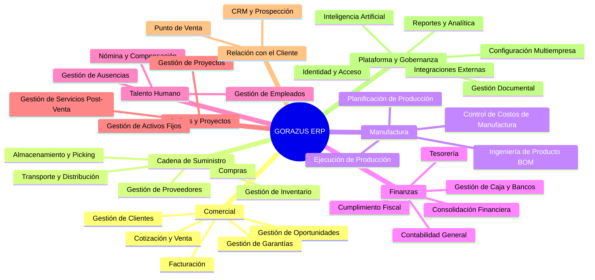

# 18 — Business Capabilities

> Un mapa de Business Capabilities responde "**qué** puede hacer el
> negocio", independiente de "**quién** lo implementa" (un Bounded
> Context) o "**cómo**" (una tabla). Es complementario, no redundante,
> con [01_bounded_contexts.md](./01_bounded_contexts.md): una
> capacidad puede requerir varios contextos trabajando juntos (p. ej.
> "Cumplimiento Fiscal" necesita `impuestos` + `contabilidad` +
> `administracion`).

## 1. Mapa de capacidades por dominio

## 2. Matriz Capacidad → Bounded Context(s) → Madurez

| Capacidad de negocio             | Bounded Context(s) responsables | Madurez (heurística de capacidad, no de código — ver nota) |
| -------------------------------- | ------------------------------- | ---------------------------------------------------------- |
| Gestión de Clientes              | `clientes`                      | Diferenciadora (Core-adyacente)                            |
| Gestión de Oportunidades         | `crm`                           | Soporte                                                    |
| Cotización y Venta               | `ventas`                        | **Core**                                                   |
| Facturación                      | `ventas`, `impuestos`           | **Core**                                                   |
| Gestión de Garantías             | `ventas`                        | Soporte                                                    |
| Gestión de Proveedores           | `proveedores`                   | Soporte                                                    |
| Compras                          | `compras`                       | **Core**                                                   |
| Gestión de Inventario            | `inventario`                    | **Core**                                                   |
| Almacenamiento y Picking         | `inventario` (WMS base)         | Soporte                                                    |
| Transporte y Distribución        | `logistica` _(propuesto)_       | Soporte, sin implementar                                   |
| Ingeniería de Producto (BOM)     | `productos`                     | Soporte                                                    |
| Planificación de Producción      | `produccion`                    | Soporte                                                    |
| Ejecución de Producción          | `produccion`, `inventario`      | Soporte                                                    |
| Control de Costos de Manufactura | `produccion`, `contabilidad`    | Soporte                                                    |
| Contabilidad General             | `contabilidad`                  | **Core**                                                   |
| Gestión de Caja y Bancos         | `caja`, `bancos`                | **Core**-adyacente                                         |
| Cumplimiento Fiscal              | `impuestos`, `administracion`   | Soporte crítico                                            |
| Consolidación Financiera         | `contabilidad`                  | Soporte, nuevo (Fase 5)                                    |
| Tesorería                        | `tesoreria`                     | Genérica (proyección)                                      |
| Gestión de Empleados             | `rrhh`                          | Soporte                                                    |
| Nómina y Compensación            | `nomina`                        | Soporte                                                    |
| Gestión de Ausencias             | `rrhh`                          | Soporte                                                    |
| Gestión de Activos Fijos         | `activos-fijos`                 | Soporte                                                    |
| Gestión de Proyectos             | `proyectos`                     | Soporte                                                    |
| Gestión de Servicios Post-Venta  | `servicios`                     | Soporte                                                    |
| Punto de Venta                   | `pos`                           | Genérica (orquestación)                                    |
| Identidad y Acceso               | `auth`, `seguridad`             | Genérica — única con backend+frontend reales hoy           |
| Configuración Multiempresa       | `configuracion`                 | Genérica                                                   |
| Gestión Documental               | `documentos`                    | Genérica                                                   |
| Integraciones Externas           | `administracion`                | Genérica                                                   |
| Reportes y Analítica             | `reportes`, `bi`                | Genérica                                                   |
| Inteligencia Artificial          | `ia` _(propuesto)_              | Genérica, sin implementar                                  |

**Nota sobre "Madurez":** esta columna clasifica **importancia
estratégica** (Core/Supporting/Generic, ver
[01_bounded_contexts.md §1](./01_bounded_contexts.md#1-clasificación-estratégica-core--supporting--generic-subdomain)),
no estado de implementación — el estado real de implementación
(backend/frontend construido vs. solo diseño) ya está documentado
exhaustivamente en
[48-erp-enterprise-readiness.md §1](../architecture/48-erp-enterprise-readiness.md)
y no se duplica aquí.

## 3. Capacidades que dependen de más de un contexto (composite capabilities)

| Capacidad compuesta            | Contextos que la componen                                                                                  |
| ------------------------------ | ---------------------------------------------------------------------------------------------------------- |
| Cumplimiento Fiscal            | `impuestos` (cálculo/declaración) + `contabilidad` (asiento) + `administracion` (envío EDI a la autoridad) |
| Ciclo Order-to-Cash            | `crm` → `ventas` → `inventario` → `contabilidad` → `caja`/`bancos`                                         |
| Ciclo Procure-to-Pay           | `compras` → `inventario` → `contabilidad` → `bancos`                                                       |
| Ciclo Hire-to-Retire           | `rrhh` → `nomina` → `contabilidad`                                                                         |
| Reporte Financiero Consolidado | `contabilidad` (por Empresa) + Grupo Corporativo (agregación) + `bi` (presentación)                        |

## 4. Trazabilidad

Este mapa no introduce ninguna capacidad de negocio que GORAZUS no
tenga ya — es la vista "de negocio" (qué hace la empresa) sobre el
mismo catálogo de 29+1 Bounded Contexts de
[01_bounded_contexts.md](./01_bounded_contexts.md), útil para
conversaciones con stakeholders no técnicos que piensan en
capacidades, no en módulos de software.

**Siguiente documento:** [19_module_dependencies.md](./19_module_dependencies.md).
