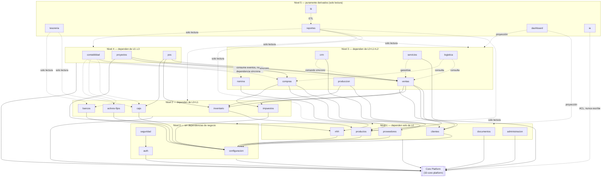

# 19 — Module Dependencies

> Grafo completo de dependencias síncronas (_Customer/Supplier_, ver
> [02_context_map.md](./02_context_map.md)) entre los 29 módulos de
> negocio + Core Platform. Complementa el diagrama de dependencias por
> módulo ya existente en
> [03-diagrama-relaciones.md](../database/03-diagrama-relaciones.md)
> (diagrama maestro a nivel de schema de base de datos) con la vista a
> nivel de **contexto de aplicación**, incluyendo los 3 módulos sin
> schema propio que ese diagrama no puede representar (`pos`,
> `tesoreria`, `dashboard`).

## 1. Grafo completo

## 2. Regla de niveles (orden de build/despliegue sugerido)

Un módulo de nivel N solo puede depender síncronamente (fachada
pública, _Customer/Supplier_) de módulos de nivel `< N`, o consumir
eventos de cualquier nivel (la dependencia asíncrona no impone orden
de despliegue — un consumidor caído no bloquea al publicador, regla ya
fijada en
[06-comunicacion-entre-modulos.md §1b](../architecture/06-comunicacion-entre-modulos.md#b-asíncrona--eventos-de-dominio-vía-rabbitmq)).
Esta capa de niveles **no es nueva como restricción** — ya está
implícita en el orden de construcción de fases que el propio roadmap
sigue (`00-roadmap-fases.md`: Productos→Inventario→Clientes→Ventas→Caja→POS,
memoria de proyecto de esta sesión) — aquí se hace explícita como
grafo completo por primera vez, cubriendo los 29 módulos.

| Nivel | Módulos                                                                        | Justificación                                                                    |
| ----- | ------------------------------------------------------------------------------ | -------------------------------------------------------------------------------- |
| 0     | `configuracion`, `auth`, `seguridad`                                           | Catálogos puros y plataforma de identidad — nada depende de negocio para existir |
| 1     | `clientes`, `proveedores`, `productos`, `rrhh`, `documentos`, `administracion` | Maestros de datos, sin dependencia de otro módulo de negocio                     |
| 2     | `inventario`, `caja`, `bancos`, `impuestos`, `activos-fijos`                   | Dependen de maestros (`productos`) o son autónomos operativos                    |
| 3     | `ventas`, `compras`, `nomina`, `crm`, `produccion`, `servicios`, `logistica`   | Ciclos transaccionales que orquestan maestros + inventario                       |
| 4     | `contabilidad`, `proyectos`, `pos`                                             | Sumidero de eventos de todo lo anterior, u orquestación pura                     |
| 5     | `tesoreria`, `reportes`, `bi`, `dashboard`, `ia`                               | Puramente derivados, solo lectura — nunca bloquean al resto                      |

## 3. Ciclos de dependencia: cero, por regla dura

Ningún par de módulos de este grafo forma un ciclo síncrono — regla ya
fijada como error de build, no advertencia
([06-comunicacion-entre-modulos.md §1a](../architecture/06-comunicacion-entre-modulos.md#a-síncrona-in-process--a-través-de-la-fachada-pública)).
La única relación que parece bidireccional (`ventas` ↔ `inventario`)
no es un ciclo síncrono real — es la _Partnership_ asíncrona con
compensación ya documentada en
[02_context_map.md §3.2](./02_context_map.md#32-partnership):
`ventas` nunca llama síncronamente a `inventario` para escribir, solo
para leer disponibilidad (`InventarioQueryService`, de solo lectura).

## 4. Trazabilidad

El grafo consolida, en un solo diagrama, dependencias que ya estaban
documentadas de forma dispersa: `04-catalogo-modulos-negocio.md`
(dependencias por módulo), los `event_code` de integración con
`contabilidad` (37, 38, 39, 40, 46), y el orden de construcción ya
confirmado en el roadmap del proyecto. No se declara ninguna
dependencia nueva.

**Siguiente documento:** [20_architecture_summary.md](./20_architecture_summary.md).
