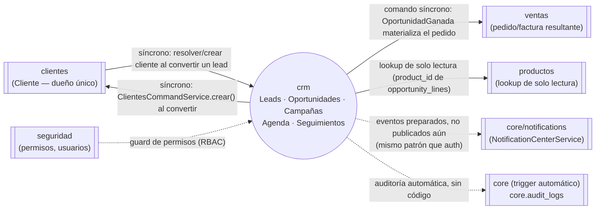
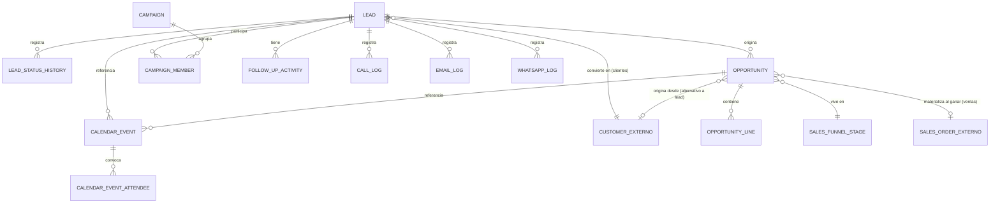

# Arquitectura del Módulo CRM — Estado real (Partes 01-04)

> Actualizado 2026-07-25 tras un segundo pedido de arquitectura ("Design the
> complete Enterprise CRM architecture... Analyze the current CRM
> implementation") que llegó **después** de que Leads, Oportunidades,
> Campañas y Agenda ya tenían código real (Partes 02-04). Este documento ya
> no es "diseño puro" — es la arquitectura **tal como quedó implementada**,
> con las secciones nuevas que pidió ese segundo prompt (Database Planning,
> API Planning consolidado, puntos de integración con módulos futuros) y sin
> repetir lo que ya estaba bien diseñado en la Parte 01 original. Sobre
> "PSR Standards" del pedido: es un estándar de PHP (PHP-FIG) — no aplica a
> este proyecto (NestJS/TypeScript). El equivalente real ya vigente son
> `docs/standards/*.md`/`ARCHITECTURE_RULES.md`, con los que este módulo ya
> cumple (ver §12). El diseño de datos sigue sin repetirse acá, ver
> [docs/architecture/27-modulo-crm.md](../../architecture/27-modulo-crm.md)
> (17 tablas). Mismo patrón que `INVENTORY_ARCHITECTURE.md`/`POS_ARCHITECTURE.md`.

## 0. Punto de partida — qué ya existe, qué falta (estado real)

| Pieza                                                                                      | Estado                                                                                                          |
| ------------------------------------------------------------------------------------------ | --------------------------------------------------------------------------------------------------------------- |
| Modelo de datos (17 tablas, `docs/database/sql/15_crm.sql` + seeds 37/38)                  | ✅ Completo                                                                                                     |
| Diseño funcional (`docs/architecture/27-modulo-crm.md`)                                    | ✅ Completo                                                                                                     |
| Prisma generado (`core/database/prisma/schemas/crm/schema.prisma`)                         | ✅ Completo, tipos expuestos en `core-database` bajo demanda                                                    |
| Fila en catálogo de módulos (`docs/architecture/04-catalogo-modulos-negocio.md`)           | ✅ Ya declarada: depende de `clientes`, alimenta a `ventas`                                                     |
| `crm.module.ts`, `index.ts` (barrel), `README.md`, `project.json` (`scope:crm`)            | ✅ **Código real** (Parte 02)                                                                                   |
| Leads (`LeadRepository`/`LeadsService`/`LeadsController`)                                  | ✅ **Código real, probado** (Parte 02 — 12 tests)                                                               |
| Oportunidades (`OpportunityRepository`/`OportunidadesService`/`OportunidadesController`)   | ✅ **Código real, probado** (Parte 03 — 14 tests)                                                               |
| Campañas (`CampaignRepository`/`CampanasService`/`CampanasController`)                     | ✅ **Código real, probado** (Parte 04)                                                                          |
| Agenda (`CalendarEventRepository`/`AgendaService`/`AgendaController`)                      | ✅ **Código real, probado** (Parte 04 — 45 tests totales del módulo)                                            |
| Seguimientos (`FollowUpActivityRepository`/`SeguimientosService`/`SeguimientosController`) | ❌ Diseño únicamente (§4), Parte 05 pendiente                                                                   |
| Frontend (`modules/crm/frontend`)                                                          | ❌ Diseño únicamente, Parte 07 pendiente                                                                        |
| Integrado en `apps/api/src/app/app.module.ts`                                              | ✅ Verificado: la API arranca contra Postgres/Redis/RabbitMQ reales sin errores de DI, todas las rutas mapeadas |

Detalle completo de cada parte, con hallazgos reales durante la
implementación, en [CRM_ROADMAP.md](./CRM_ROADMAP.md).

## 1. Límites del módulo y reutilización

### 1.1 Diagrama de dependencias

**Regla dura respetada** (`06-comunicacion-entre-modulos.md §4`, patrón
"módulo dueño"): `crm` **nunca** escribe directo en `customers.customers` ni
en tablas de `ventas`/`productos`. Toda escritura cruzada pasa por el
servicio público del módulo dueño (`ClientesService.crear()`, expuesto en
`modules/clientes/index.ts`); toda lectura cruzada pasa por un repositorio de
_lookup_ propio de `crm` (nunca importando un repositorio interno de otro
módulo — los repositorios de `ventas`/`clientes` no son públicos).

### 1.2 Qué se reutiliza literalmente (no se rediseña)

| Pieza a reutilizar                                                                           | De dónde                                                                                | Cómo se usa en `crm`                                                                                                                 |
| -------------------------------------------------------------------------------------------- | --------------------------------------------------------------------------------------- | ------------------------------------------------------------------------------------------------------------------------------------ |
| `ClientesService.crear()`                                                                    | `modules/clientes/index.ts` (barrel público)                                            | `LeadsService.convertir()` lo invoca para materializar `leads.converted_customer_id`                                                 |
| Patrón _get-or-create_ idempotente con retry sobre `P2002`                                   | `ClientesService.obtenerOCrearConsumidorFinal`                                          | Mismo patrón para "convertir lead si no fue convertido ya por otro proceso concurrente"                                              |
| Patrón de repositorio de _lookup_ (interfaz + adaptador Prisma, ID suelto hacia otro schema) | `ventas/backend/repositories/cliente-lookup.repository.ts`                              | Plantilla 1:1 para los lookups nuevos de `crm` (§3.3) — el archivo en sí es privado de `ventas`, no se importa, se replica el patrón |
| `PermissionsGuard` + `@RequirePermission('<modulo>.<accion>')`                               | `core/http`                                                                             | Igual que `FacturasController`/`ClientesController` (§6)                                                                             |
| `AuditoriaService.historialDeFila()`                                                         | `modules/seguridad/backend/services/auditoria.service.ts` (comentado como reutilizable) | Pantalla de historial de un lead/oportunidad sin construir mecanismo propio                                                          |
| Auditoría automática (`trg_audit_log` → `core.audit_logs`)                                   | Trigger de Postgres, aplicado a toda tabla por defecto                                  | Las 17 tablas de `crm` ya quedan cubiertas sin ningún código (§8)                                                                    |
| Contrato de evento de dominio (`static readonly routingKey`, `toPayload()`)                  | `modules/auth/backend/events/*.event.ts`                                                | Plantilla para los eventos de `crm` (§7) — "preparado, sin publicar todavía", mismo estado que `auth`                                |

**Qué NO se reutiliza (decisión explícita, no descuido)**: `crm` no importa
ningún repositorio de `ventas`/`clientes` directamente — cada lookup se
redefine como interfaz propia de `crm` (mismo patrón que `ventas` ya
redefine su propio `ClienteLookupRepository` en vez de importar el de otro
módulo). Es la regla de fronteras del proyecto, no una limitación técnica.

## 2. Entidades de dominio (`modules/crm/backend/entities/`)

Cada entidad es una clase de dominio pura (sin decoradores, invariantes en el
constructor — mismo patrón que `Factura`/`Cliente`), agrupadas en 5
agregados por sub-dominio:

| Agregado          | Estado                                        | Entidad raíz       | Entidades/valores asociados                                                                                                                     | Invariantes clave (constructor)                                                                       |
| ----------------- | --------------------------------------------- | ------------------ | ----------------------------------------------------------------------------------------------------------------------------------------------- | ----------------------------------------------------------------------------------------------------- |
| **Leads**         | ✅ Real (`entities/lead.entity.ts`)           | `Lead`             | — (`LeadStatusHistory` es de solo lectura vía repositorio, sin entidad rica — simplificado en la implementación real frente al diseño original) | Nombre no vacío; estado requerido; al menos email o teléfono                                          |
| **Oportunidades** | ✅ Real (`entities/opportunity.entity.ts`)    | `Opportunity`      | `OpportunityLine`                                                                                                                               | `leadId` **o** `customerId` (al menos uno); `funnelStageId` requerido; líneas: `estimatedQuantity>0`  |
| **Campañas**      | ✅ Real (`entities/campaign.entity.ts`)       | `Campaign`         | —                                                                                                                                               | Nombre no vacío; presupuesto no negativo; fin no anterior a inicio                                    |
| **Agenda**        | ✅ Real (`entities/calendar-event.entity.ts`) | `CalendarEvent`    | `CalendarEventAttendee`                                                                                                                         | `endsAt>startsAt`; asistente: `userId` **xor** `externalEmail`                                        |
| **Seguimientos**  | ❌ Planificado (Parte 05)                     | `FollowUpActivity` | `CallLog`, `EmailLog`, `WhatsappLog`                                                                                                            | `dueAt` requerido; `assignedToUserId` requerido; `completedAt` solo posterior a `dueAt` o `createdAt` |

**Decisión de diseño — 5 servicios, no 1 monolítico**: a diferencia de
`ventas`/`clientes` (un solo `Service` porque son dominios chicos), `crm`
tiene 17 tablas en 5 sub-dominios claramente separables con ciclos de vida
independientes (una campaña no depende de que exista una oportunidad). Un
único `CrmService` de 17 tablas violaría el principio de responsabilidad
única y sería difícil de testear; 5 servicios enfocados, todos exportados
desde el mismo `crm.module.ts`/`index.ts`, mantienen la cohesión sin
fragmentar el módulo en 5 módulos Nx separados (que sí estaría
sobre-diseñado para un dominio que comparte permisos, auditoría y el mismo
`README.md` — "no introducir complejidad innecesaria", regla explícita del
pedido).

## 3. Repositorios (`modules/crm/backend/repositories/`)

Patrón fijo: interfaz (puerto) + adaptador Prisma, igual que `ventas`. Todo
acceso a datos vía `withTenantScope(client, context, ...)`.

### 3.1 Repositorios propios (uno por tabla raíz de cada agregado)

| Interfaz                          | Tabla(s) Prisma                               | Notas                                                                                                                                                                                                       |
| --------------------------------- | --------------------------------------------- | ----------------------------------------------------------------------------------------------------------------------------------------------------------------------------------------------------------- |
| `LeadRepository`                  | `leads`, `lead_status_history`                | `cambiarEstado()` escribe ambas tablas en una transacción                                                                                                                                                   |
| `LeadSourceRepository`            | `lead_sources`                                | Catálogo — patrón _resolver-por-código_ de `ventas.resolverEstadoPorCodigo`                                                                                                                                 |
| `LeadStatusRepository`            | `lead_status`                                 | Ídem                                                                                                                                                                                                        |
| `OpportunityRepository`           | `opportunities`, `opportunity_lines`          | `ganar()`/`perder()` como métodos explícitos, no un `update()` genérico                                                                                                                                     |
| `OpportunityLossReasonRepository` | `opportunity_loss_reasons`                    | Catálogo                                                                                                                                                                                                    |
| `SalesFunnelRepository`           | `sales_funnels`, `sales_funnel_stages`        | Catálogo jerárquico                                                                                                                                                                                         |
| `CampaignRepository`              | `campaigns`, `campaign_members`               | —                                                                                                                                                                                                           |
| `CalendarEventRepository`         | `calendar_events`, `calendar_event_attendees` | —                                                                                                                                                                                                           |
| `FollowUpActivityRepository`      | `follow_up_activities`                        | —                                                                                                                                                                                                           |
| `InteractionLogRepository`        | `call_logs`, `email_logs`, `whatsapp_logs`    | Un repositorio, tres métodos (`registrarLlamada`/`registrarEmail`/`registrarWhatsapp`) — las tres tablas están particionadas mensualmente igual que `sales.invoices`, mismo patrón de escritura append-only |

### 3.2 Repositorios de _lookup_ hacia otros módulos (solo lectura, ID suelto)

| Interfaz nueva de `crm`    | Valida/lee contra                                                        | Análogo existente (patrón, no import)                                                                                                                           |
| -------------------------- | ------------------------------------------------------------------------ | --------------------------------------------------------------------------------------------------------------------------------------------------------------- |
| `ClienteLookupRepository`  | `customers.customers` (`opportunities.customer_id`, conversión de lead)  | `ventas/backend/repositories/cliente-lookup.repository.ts`                                                                                                      |
| `ProductoLookupRepository` | `products.products` (`opportunity_lines.product_id`)                     | `ventas/backend/repositories/producto-lookup.repository.ts`                                                                                                     |
| `UsuarioLookupRepository`  | `core.users` (`assigned_to_user_id`, `calendar_event_attendees.user_id`) | Nuevo — ningún módulo de negocio expone hoy un lookup de usuarios; se define en `crm` y queda disponible como referencia para el próximo módulo que lo necesite |

**Gap de diseño heredado, no de esta fase** (ya documentado en
`27-modulo-crm.md §5`): no hay FK entre `follow_up_activities` y los logs de
interacción — `InteractionLogRepository` y `FollowUpActivityRepository`
quedan desacoplados a nivel de dato; si el caso de uso "completar actividad"
necesita exigir un log asociado, la relación se resuelve en el `Service`
(parámetro opcional `logId` sin garantía de integridad referencial), no en
el schema.

## 4. Servicios (`modules/crm/backend/services/`)

| Servicio               | Responsabilidad                                 | Casos de uso principales                                                                                                           |
| ---------------------- | ----------------------------------------------- | ---------------------------------------------------------------------------------------------------------------------------------- |
| `LeadsService`         | Ciclo de vida de leads y su conversión          | `crear`, `cambiarEstado`, `convertir` (invoca `ClientesService.crear()`)                                                           |
| `OportunidadesService` | Ciclo de vida de oportunidades y su cierre      | `crear`, `moverDeEtapa`, `ganar` (setea `resultingSalesOrderId`, comando síncrono hacia `ventas`), `perder` (exige `lossReasonId`) |
| `CampanasService`      | Campañas y sus miembros (solo leads)            | `crear`, `agregarMiembro` (rechaza `customerId`)                                                                                   |
| `AgendaService`        | Eventos de calendario y asistentes              | `crear`, `agregarAsistente` (valida `userId` xor `externalEmail`)                                                                  |
| `SeguimientosService`  | Tareas de seguimiento + bitácora de interacción | `crearActividad`, `completarActividad`, `registrarLlamada`/`registrarEmail`/`registrarWhatsapp`                                    |

Todos exportados desde `modules/crm/index.ts` (module-root-barrel) —
`repositories/` nunca se exporta, igual que `ventas`/`clientes`.

## 5. Controladores y recursos API — planificación consolidada (`API Planning`)

Un controlador por servicio, mismo prefijo `crm/`, siguiendo el patrón REST
de `FacturasController` (`@ApiTags('crm')`, `@ApiBearerAuth()`,
`@RequirePermission`, `ZodValidationPipe`). Tabla real (no especulativa) —
verificada con la API arrancada, `apps/api` monta cada ruta bajo
`/api/v1/...`:

| Controlador                         | Endpoint                                             | Método    | Permiso                                                 | Estado         |
| ----------------------------------- | ---------------------------------------------------- | --------- | ------------------------------------------------------- | -------------- |
| `LeadsController`                   | `/crm/leads`                                         | GET, POST | `crm.ver_leads` / `crm.gestionar_leads`                 | ✅ Real        |
|                                     | `/crm/leads/:id`                                     | GET       | `crm.ver_leads`                                         | ✅ Real        |
|                                     | `/crm/leads/:id/estado`                              | PATCH     | `crm.gestionar_leads`                                   | ✅ Real        |
|                                     | `/crm/leads/:id/convertir`                           | POST      | `crm.gestionar_leads`                                   | ✅ Real        |
| `OportunidadesController`           | `/crm/oportunidades`                                 | GET, POST | `crm.ver_oportunidades` / `crm.gestionar_oportunidades` | ✅ Real        |
|                                     | `/crm/oportunidades/:id`                             | GET       | `crm.ver_oportunidades`                                 | ✅ Real        |
|                                     | `/crm/oportunidades/:id/etapa`                       | PATCH     | `crm.gestionar_oportunidades`                           | ✅ Real        |
|                                     | `/crm/oportunidades/:id/ganar`                       | POST      | `crm.gestionar_oportunidades`                           | ✅ Real        |
|                                     | `/crm/oportunidades/:id/perder`                      | POST      | `crm.gestionar_oportunidades`                           | ✅ Real        |
| `CampanasController`                | `/crm/campanas`                                      | GET, POST | `crm.ver_campanas` / `crm.gestionar_campanas`           | ✅ Real        |
|                                     | `/crm/campanas/:id`                                  | GET       | `crm.ver_campanas`                                      | ✅ Real        |
|                                     | `/crm/campanas/:id/miembros`                         | POST      | `crm.gestionar_campanas`                                | ✅ Real        |
| `AgendaController`                  | `/crm/agenda`                                        | GET, POST | `crm.ver_agenda` / `crm.gestionar_agenda`               | ✅ Real        |
|                                     | `/crm/agenda/:id`                                    | GET       | `crm.ver_agenda`                                        | ✅ Real        |
|                                     | `/crm/agenda/:id/asistentes`                         | POST      | `crm.gestionar_agenda`                                  | ✅ Real        |
| `SeguimientosController` (Parte 05) | `/crm/seguimientos/actividades`                      | GET, POST | `crm.ver_seguimientos` / `crm.gestionar_seguimientos`   | ❌ Planificado |
|                                     | `/crm/seguimientos/actividades/:id/completar`        | POST      | `crm.gestionar_seguimientos`                            | ❌ Planificado |
|                                     | `/crm/seguimientos/llamadas`\|`/emails`\|`/whatsapp` | POST      | `crm.gestionar_seguimientos`                            | ❌ Planificado |

18 endpoints reales + 4 planificados = 22 endpoints totales del módulo
completo. Todos los `POST`/`PATCH` validan el body con un schema Zod propio
en `modules/crm/backend/validators/` (el `type` inferido hace de DTO — mismo
patrón que `ventas`/`clientes`, sin `class-validator`).

## 6. Permisos

Formato fijo `<modulo>.<accion>` (igual que `ventas.gestionar_ventas`),
catálogo sembrado por el primer SQL/seed del módulo (no hardcodeado en
código):

| Permiso                                                 | Cubre                                                        |
| ------------------------------------------------------- | ------------------------------------------------------------ |
| `crm.ver_leads` / `crm.gestionar_leads`                 | Lectura / creación-edición-conversión de leads               |
| `crm.ver_oportunidades` / `crm.gestionar_oportunidades` | Lectura / ciclo completo de oportunidades incl. ganar/perder |
| `crm.ver_campanas` / `crm.gestionar_campanas`           | Lectura / creación-edición de campañas y miembros            |
| `crm.ver_agenda` / `crm.gestionar_agenda`               | Lectura / creación-edición de eventos y asistentes           |
| `crm.ver_seguimientos` / `crm.gestionar_seguimientos`   | Lectura / actividades y bitácora de interacción              |

ACL fino/ABAC (deny&gt;allow&gt;rol) **no aplica** todavía — sigue sin
implementarse a nivel de plataforma (`13-modulo-auth.md §8`), `crm` no
introduce nada nuevo ahí, solo RBAC simple vía `PermissionsResolverService`.

## 7. Eventos de dominio (`modules/crm/backend/events/`)

Mismo contrato que `auth` (`static readonly routingKey`, constructor con
campos serializados, `toPayload()`), **preparados pero sin publicar
todavía** (ningún módulo de negocio publica a `EventBusService` hoy — mismo
estado que el resto del proyecto, no es una brecha exclusiva de `crm`):

| Evento               | Routing key                | Publicador                                          | Consumidor previsto                                                                                                                               | Mecanismo                                                                                                                                             |
| -------------------- | -------------------------- | --------------------------------------------------- | ------------------------------------------------------------------------------------------------------------------------------------------------- | ----------------------------------------------------------------------------------------------------------------------------------------------------- |
| `LeadCreado`         | `crm.lead.creado`          | `LeadsService.crear`                                | Reportes/BI                                                                                                                                       | Async (RabbitMQ, cuando se active)                                                                                                                    |
| `LeadEstadoCambiado` | `crm.lead.estado_cambiado` | `LeadsService.cambiarEstado`                        | Reportes/BI, futura automatización de seguimiento                                                                                                 | Async                                                                                                                                                 |
| `LeadConvertido`     | `crm.lead.convertido`      | `LeadsService.convertir`                            | Reportes/BI; **no** dispara la creación del cliente (eso ya es síncrono vía `ClientesService.crear()`, el evento es solo notificación post-hecho) | Async                                                                                                                                                 |
| `OportunidadGanada`  | — (no es evento RabbitMQ)  | `OportunidadesService.ganar`                        | `ventas`                                                                                                                                          | **Comando síncrono**, ya decidido en `12-backend-enterprise.md §6.3` y `27-modulo-crm.md §2` — se documenta acá para no contradecirlo, no se rediseña |
| `OportunidadPerdida` | `crm.oportunidad.perdida`  | `OportunidadesService.perder`                       | Reportes/BI                                                                                                                                       | Async                                                                                                                                                 |
| `SeguimientoVencido` | `crm.seguimiento.vencido`  | Job programado (cron), **no** un `Service` síncrono | Notificaciones (recordatorio al usuario asignado)                                                                                                 | Async — requiere un scheduler, fuera de alcance de esta parte, se anota como pendiente en el roadmap (§10)                                            |

## 8. Notificaciones

`core/notifications/notification-center.service.ts` hoy **solo** soporta
destinatarios internos (`core.users`, vía `recipient_user_id`) — el propio
comentario de cabecera del servicio ya anticipa que `crm` necesitará
extenderlo para notificar a un lead/cliente externo (cruce con
`crm.whatsapp_logs`). **Esta parte no resuelve esa extensión** — es una
dependencia externa a `crm`, del módulo `core/notifications`, que se anota
como bloqueante para la fase que implemente `registrarWhatsapp` con envío
real (no solo bitácora). Mientras tanto, `SeguimientosService` puede
registrar el log (`whatsapp_logs`) sin enviar nada, igual que hoy ningún
módulo publica eventos reales todavía.

## 9. Estrategia de auditoría

**Automática, sin código de aplicación**: las 17 tablas de `crm` heredan
`trg_set_audit_fields`/`trg_audit_log` → `core.audit_logs` por defecto (regla
universal del proyecto, no un caso especial). **Decisión explícita para esta
fase: no agregar `crm.opportunities` a `core.change_history`** (snapshot
completo, reservado hoy a documentos fiscales/contratos/configuración
crítica) — no hay un requisito real de "ver el estado completo de la
oportunidad en cualquier punto del pasado" planteado en el pedido; agregarlo
sería complejidad no solicitada. Si en el futuro se necesita (p. ej.
auditoría de cambios de `estimated_amount` para compliance de ventas
grandes), es un cambio de una línea en el seed de `change_history`, no una
migración estructural.

Para historial visible al usuario (pantalla "actividad de este lead"),
`crm` reutiliza `AuditoriaService.historialDeFila(context, 'crm.leads',
leadId, pagination)` sin construir mecanismo propio (§1.2).

## 10. Diagrama de relación entre entidades del módulo

## 12. Cumplimiento de requisitos de arquitectura (Clean Architecture / SOLID / Enterprise / Modular)

| Requisito pedido       | Cómo se cumple, con código real ya verificado                                                                                                                                                                                                                                                                                                                                                                                                                                                                                                                                                                        |
| ---------------------- | -------------------------------------------------------------------------------------------------------------------------------------------------------------------------------------------------------------------------------------------------------------------------------------------------------------------------------------------------------------------------------------------------------------------------------------------------------------------------------------------------------------------------------------------------------------------------------------------------------------------- |
| Clean Architecture     | Capas separadas físicamente: `entities/` (dominio puro, sin decoradores ni dependencias de framework), `repositories/` (puerto abstracto + adaptador Prisma), `services/` (casos de uso), `controllers/` (traducción HTTP). Las dependencias apuntan hacia adentro: `controllers` conoce `services`, `services` conoce `repositories` (interfaz), nunca al revés.                                                                                                                                                                                                                                                    |
| SOLID                  | **S**: un servicio por sub-dominio (§4), no un `CrmService` monolítico. **O**: nuevos sub-dominios (Seguimientos) se agregan sin modificar los existentes. **L**: cualquier `*RepositoryPrisma` es sustituible por su interfaz en tests (ver los `*.spec.ts`, todos mockean la interfaz). **I**: interfaces de repositorio chicas y específicas (`LeadStatusRepository` solo tiene `buscarPorCodigo`, no un CRUD genérico innecesario). **D**: `services/` depende de abstracciones (`abstract class XRepository`), inyectadas por Nest vía `{ provide: X, useClass: XPrisma }` — nunca de la clase Prisma concreta. |
| PSR Standards          | No aplica — es un estándar de PHP-FIG, este proyecto es NestJS/TypeScript. El estándar de código real y vigente es `docs/standards/*.md` + ESLint (`nx run crm-backend:lint`, verificado ✔ en las 4 partes implementadas).                                                                                                                                                                                                                                                                                                                                                                                           |
| Enterprise Design      | RBAC granular por sub-dominio (10 permisos), auditoría automática (trigger, sin código), multi-tenant real (RLS + `withTenantScope` en cada repositorio), soft delete universal (`deleted_at`), versionado optimista (`version`/`row_version` en cada tabla).                                                                                                                                                                                                                                                                                                                                                        |
| Modular Architecture   | Un solo módulo Nx (`crm-backend`, tag `scope:crm`), barrel público (`modules/crm/index.ts`) como única puerta de entrada, sin importar internos de otros módulos (`ventas`/`clientes`) — cada lookup cross-módulo es una interfaz propia (§1.2).                                                                                                                                                                                                                                                                                                                                                                     |
| Backward Compatibility | Cada parte (02→03→04) se agregó sin modificar código de la parte anterior — verificado: los 26 tests de Leads+Oportunidades seguían pasando después de agregar Campañas+Agenda (45/45 tests, `nx run crm-backend:test`).                                                                                                                                                                                                                                                                                                                                                                                             |

## 13. Database Planning

El modelo de datos completo (17 tablas, catálogos sembrados, diagrama ER,
comparación de los 19 requisitos del pedido de "CRM database" contra lo que
ya existía) está documentado en detalle en:
[`CRM_DATABASE_COMPLETION_REPORT.md`](./CRM_DATABASE_COMPLETION_REPORT.md) y
[`CRM_DATABASE_ER_DIAGRAM.md`](./CRM_DATABASE_ER_DIAGRAM.md) — no se repite
acá. Resumen: 0 tablas nuevas en el schema `crm` (las 17 ya estaban
certificadas desde antes de Parte 01), 3 seeds de catálogo agregados
durante la implementación real (`crm.lead_status`, embudo "Estándar" +
etapas por empresa, `opportunity_loss_reasons`).

**Solapamiento "CRM backend completo" vs. schema `customers`** — un pedido
posterior a este documento ("Implement the complete CRM backend...
Customers, Contacts, Addresses, Customer Groups, Categories, Tags,
Activities, Timeline, Notes, Documents, Credit Profiles, Price Lists,
Payment Terms, Customer Dashboard") describe 14 "módulos" que en realidad
viven en el schema `customers` (17 tablas, ver
[`03-customers.md`](../../database/dictionary/03-customers.md)), no en el
schema `crm` de este documento. Verificado tabla por tabla: 12 de las 14
piezas ya tenían tabla real desde Database Parte 02 sin ningún código de
aplicación (`customer_contacts`, `customer_addresses`,
`customer_categories`, `customer_classifications`, `customer_notes`,
`customer_credit_profiles`, `customer_credit_limit_history`,
`customer_price_lists`, más `v_customer_timeline` como vista de solo
lectura); 2 (Tags, Documents) no tienen tabla — requieren migración nueva;
"Customer Dashboard" es una agregación de lectura, no una entidad. Se
implementó como extensión de `modules/clientes/backend` (Clientes Parte
02), dividida en partes — ver
[`CRM_ROADMAP.md`, anexo "Clientes Parte 02"](./CRM_ROADMAP.md#anexo--clientes-parte-02-customer-360-módulo-relacionado-pero-distinto-de-crm)
para el detalle y el estado de cada parte.

## 14. Puntos de integración con módulos futuros del ERP

### 14.1 Integraciones ya reales (código funcionando, verificado con tests de integración)

| Módulo                              | Punto de integración real                                                                                                                                                                    | Verificación                                                                                                                        |
| ----------------------------------- | -------------------------------------------------------------------------------------------------------------------------------------------------------------------------------------------- | ----------------------------------------------------------------------------------------------------------------------------------- |
| `ventas` (Sales)                    | `OportunidadesService.ganar(resultingSalesOrderId)` — comando síncrono, el llamador crea la factura en `ventas` y pasa el id resultante                                                      | Cubierto por `oportunidades.service.spec.ts`                                                                                        |
| `ventas` / `inventario` (Inventory) | `opportunity_lines.product_id` valida contra `ProductoLookupRepository` (lookup de solo lectura, nunca importa repositorios internos de `productos`)                                         | Cubierto por `oportunidades.service.spec.ts`                                                                                        |
| `clientes` ↔ Cuentas por Cobrar     | `customers.v_accounts_receivable_aging` — vista de solo lectura que cruza clientes con facturas emitidas por `sales`, expuesta en `GET /clientes/:id/cuentas-por-cobrar` (Clientes Parte 02) | Cubierto por `clientes.controller.e2e-spec.ts`                                                                                      |
| `crm` ↔ `clientes`                  | `LeadsService.convertir()` invoca `ClientesService.crear()`                                                                                                                                  | Cubierto por `leads.controller.e2e-spec.ts` (flujo completo real contra Postgres)                                                   |
| Caja (Cash)                         | **Sin punto de integración real hoy** — ningún flujo de `crm`/`clientes` toca `caja.cash_register_sessions` ni movimientos de caja                                                           | No hay caso de uso concreto que lo requiera todavía (a diferencia de CxC, que ya tenía la vista construida desde Database Parte 02) |

### 14.2 Integraciones futuras (el módulo con el que integrar no existe todavía)

| Módulo futuro             | Estado real hoy                                                                    | Punto de integración ya previsto en el código actual                                                                                                                                                                                             |
| ------------------------- | ---------------------------------------------------------------------------------- | ------------------------------------------------------------------------------------------------------------------------------------------------------------------------------------------------------------------------------------------------ |
| Quotations (Cotizaciones) | No existe como entidad — `ventas` solo emite facturas directas, sin `sales_quotes` | Ninguno construido a propósito — construir contra una tabla que no existe generaría código muerto. Cuando exista, el punto natural es el mismo que Orders (ver fila siguiente)                                                                   |
| Orders (Pedidos)          | No existe como entidad — no hay `sales_orders`, solo `sales.invoices`              | `OportunidadesService.ganar(resultingSalesOrderId)` ya acepta cualquier UUID de `sales` sin importar su tabla de origen — cuando `ventas` implemente `sales_orders`, no hace falta cambiar `crm`, solo pasar el id correcto desde el nuevo flujo |
| Purchasing (Compras)      | Módulo `compras` no tiene backend real (`ComingSoonPage` en el frontend)           | Ninguno hoy — `crm` no tiene ningún caso de uso que cruce con compras (a diferencia de ventas/inventario, que sí son parte del ciclo de una oportunidad ganada)                                                                                  |
| Accounting (Contabilidad) | Módulo `contabilidad` no tiene backend real (`ComingSoonPage` en el frontend)      | `opportunities.estimated_amount` ya existe — un futuro reporte de pipeline/forecast puede leerlo sin cambios de schema                                                                                                                           |
| `reportes`/`bi`           | Sin backend real                                                                   | Los 4 eventos preparados (`LeadCreado`, `LeadEstadoCambiado`, `LeadConvertido`, `OportunidadPerdida`, §7) son el punto de enganche natural cuando se active `EventBusService` a nivel de plataforma                                              |

### 14.3 Ya integrado, sin trabajo pendiente

| Módulo               | Estado                                                                                                                                                                             |
| -------------------- | ---------------------------------------------------------------------------------------------------------------------------------------------------------------------------------- |
| `core/notifications` | Extensión ya identificada y documentada como bloqueante (§8) para que Seguimientos (Parte 05) pueda notificar a un lead/cliente externo, no solo a `core.users`                    |
| `seguridad`          | `PermissionsGuard`/`@RequirePermission` en los 9 controllers reales (`crm` + `clientes`), permisos `clientes.ver`/`crm.ver` cerrados como gap real de sidebar sin permiso sembrado |

## 15. Trazabilidad

| Punto solicitado                                                                                                                                   | Documento(s) de detalle normativo                                                         | Novedad de este documento                                                                                                                                                                                                                                                                                                                                                                                 |
| -------------------------------------------------------------------------------------------------------------------------------------------------- | ----------------------------------------------------------------------------------------- | --------------------------------------------------------------------------------------------------------------------------------------------------------------------------------------------------------------------------------------------------------------------------------------------------------------------------------------------------------------------------------------------------------- |
| Analizar arquitectura existente / reutilizar código                                                                                                | `modules/ventas/backend`, `modules/clientes/backend` (código real)                        | §1.2 — tabla explícita de qué se reutiliza y qué no                                                                                                                                                                                                                                                                                                                                                       |
| Entidades reutilizables / faltantes                                                                                                                | `docs/database/dictionary/13-crm.md`, `27-modulo-crm.md`                                  | §2 — mapeo agregados→entidades de dominio con invariantes                                                                                                                                                                                                                                                                                                                                                 |
| Límites del módulo                                                                                                                                 | `docs/architecture/04-catalogo-modulos-negocio.md`, `06-comunicacion-entre-modulos.md §4` | §1.1 — diagrama de dependencias concreto                                                                                                                                                                                                                                                                                                                                                                  |
| Servicios / Repositorios / Controladores / Recursos API                                                                                            | Código real de Partes 02-04                                                               | §3, §4, §5 — actualizado al estado real, no solo diseño                                                                                                                                                                                                                                                                                                                                                   |
| Permisos                                                                                                                                           | `13-modulo-auth.md §7` (mecanismo genérico)                                               | §6 — catálogo concreto de `crm`, sembrado y verificado                                                                                                                                                                                                                                                                                                                                                    |
| Eventos                                                                                                                                            | `12-backend-enterprise.md §6.3` (ya fijaba `OportunidadGanada` como comando síncrono)     | §7 — catálogo completo de 6 eventos, sin contradecir lo ya decidido                                                                                                                                                                                                                                                                                                                                       |
| Notificaciones                                                                                                                                     | `core/notifications/notification-center.service.ts` (comentario ya anticipaba el gap)     | §8 — confirmación explícita de dependencia externa bloqueante                                                                                                                                                                                                                                                                                                                                             |
| Estrategia de auditoría                                                                                                                            | Trigger universal del proyecto (`26_triggers.sql`)                                        | §9 — decisión explícita de no usar `change_history` todavía, con criterio de reversión                                                                                                                                                                                                                                                                                                                    |
| Clean Architecture / SOLID / PSR / Enterprise / Modular / Backward Compat.                                                                         | `docs/standards/*.md`, `ARCHITECTURE_RULES.md`                                            | §12 — cumplimiento verificado punto por punto contra código real                                                                                                                                                                                                                                                                                                                                          |
| Database Planning                                                                                                                                  | `CRM_DATABASE_COMPLETION_REPORT.md`, `CRM_DATABASE_ER_DIAGRAM.md` (ya existían)           | §13 — resumen y enlace, sin duplicar                                                                                                                                                                                                                                                                                                                                                                      |
| API Planning                                                                                                                                       | — (tabla anterior era especulativa)                                                       | §5 — tabla real de 18 endpoints verificados + 4 planificados                                                                                                                                                                                                                                                                                                                                              |
| Puntos de integración con módulos futuros                                                                                                          | — (no existía)                                                                            | §14 — dividida en reales (§14.1, con tests de integración) vs. futuras (§14.2, módulos que todavía no existen: Quotations/Orders/Purchasing/Accounting)                                                                                                                                                                                                                                                   |
| Development Roadmap                                                                                                                                | `CRM_ROADMAP.md` (ya existía, actualizado a través de Parte 04)                           | Enlazado, no duplicado                                                                                                                                                                                                                                                                                                                                                                                    |
| Preparar para producción: integraciones (Sales/Inventory/Cash/CxC), tests de integración/API, revisión de seguridad, sin deuda técnica introducida | — (fase nueva)                                                                            | Integración real de Cuentas por Cobrar (§14.1), 85 tests de integración/API nuevos (`clientes.controller.e2e-spec.ts`, `leads.controller.e2e-spec.ts`), hallazgos reales corregidos en el camino: permisos `clientes.ver`/`crm.gestionar_*` nunca sembrados en la base, CHECK `address_type` sin reflejar en la validación de entrada — ver `CRM_PRODUCTION_READINESS_REPORT.md` para el detalle completo |

Ver [CRM_ROADMAP.md](./CRM_ROADMAP.md) para el plan de implementación de las
partes siguientes (código real).
